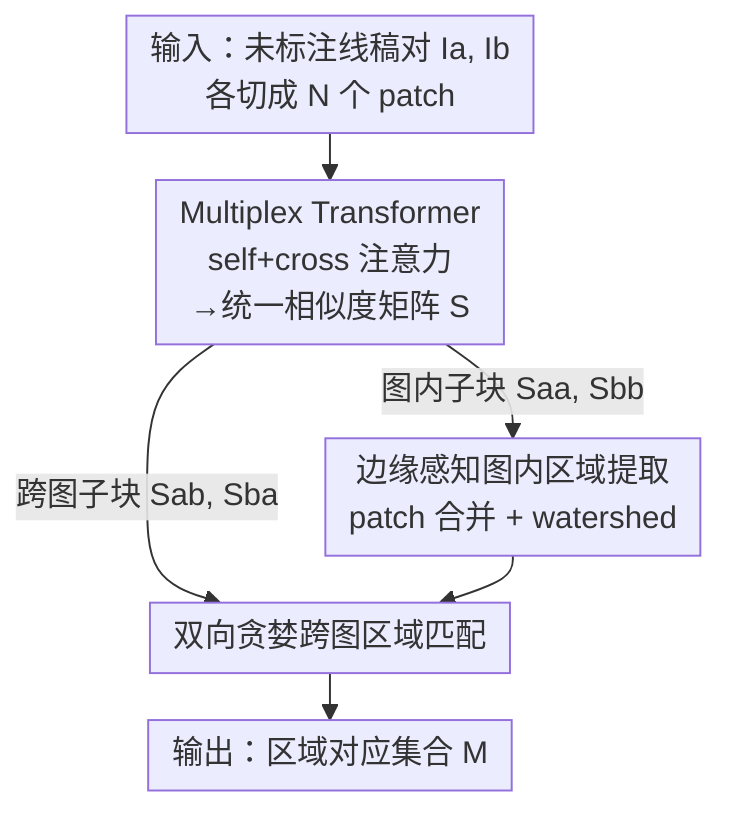

# Region-Wise Correspondence Prediction between Manga Line Art Images

**会议**: CVPR 2026  
**论文**: [CVF Open Access](https://openaccess.thecvf.com/content/CVPR2026/html/Li_Region-Wise_Correspondence_Prediction_between_Manga_Line_Art_Images_CVPR_2026_paper.html)  
**代码**: https://github.com/liyingxuan1012/r2r-lineart-correspondence  
**领域**: 线稿理解 / 区域对应 / 漫画动画处理  
**关键词**: 漫画线稿, 区域对应, Transformer, patch 相似度, 边缘感知分割

## 一句话总结
这篇论文首次提出"直接从未标注的原始漫画线稿对中预测区域级对应关系"这一任务，用一个 ViT + Multiplex Transformer 联合学习图内结构与跨图相似度，再配一套边缘感知的后处理把 patch 相似度变成像素级区域分割和匹配，在手绘风格线稿上做到 78.4–84.4% 的区域级准确率。

## 研究背景与动机
**领域现状**：在漫画和动画制作里，画师需要在大量线稿帧之间手工识别并跟踪语义区域——同一个角色的头发要在每一帧保持同一种蓝、右耳的耳环要在形状和位置上始终一致。这种跨帧的区域对应是上色、中间帧生成（in-betweening）等下游任务的基础，但目前完全靠人手，极其耗时且需要专业经验。

**现有痛点**：已有的线稿对应方法几乎都**预设图像已经被分割成闭合区域**，然后在闭合区域之间做匹配。这个假设只在 3D 渲染或干净矢量线稿里成立；真实手绘漫画线稿的轮廓往往是**开放的、松散的**，区域边界根本不闭合，规则化分割会失败。点到点匹配（如 LightGlue 这类为自然图设计的方法）又依赖颜色、纹理这些线稿里根本不存在的视觉线索，关键点稀疏又不可靠。

**核心矛盾**：线稿是抽象、稀疏的黑白笔画，缺少自然图的纹理/颜色线索；同一角色在不同帧又会有姿态、尺度、视角、画风的变化。更根本的是——**没有任何带区域级标注的训练数据**，自然图上训练的分割模型（SAM 等）因领域差距在线稿上表现很差。

**本文目标**：在没有任何先验分割、没有人工标注的前提下，给一对原始线稿，同时（1）在每张图里找出语义上有意义的结构区域，（2）预测两张图区域之间的对应关系。

**切入角度**：与其先分割再匹配（两阶段、依赖闭合区域），不如**先在 patch 粒度上联合学习图内结构和跨图对应**，把分割推迟到后处理。patch 级表示对开放轮廓更鲁棒，因为它学的是"哪些 patch 在结构上属于一类"，而不是"轮廓是否闭合"。

**核心 idea**：用一个能同时做 self-attention（图内）和 cross-attention（跨图）的 Multiplex Transformer，产出一个统一的 patch 相似度矩阵 $S$，让图内分组和跨图匹配都从同一个 $S$ 里读出来；再用边缘感知的后处理把粗糙的 patch 块变成贴合笔画的像素级区域。

## 方法详解

### 整体框架
方法分两大块：一个**基于 Transformer 的 patch 相似度学习模型**，和一个**纯后处理的区域匹配流程**。输入是一对未标注线稿 $I_a, I_b$，先各自切成 $N$ 个 $p\times p$ 的 patch，经 ViT 编码、Multiplex Transformer 交互后，得到一个统一相似度矩阵 $S\in[0,1]^{2N\times 2N}$——它的四个分块分别编码了"$I_a$ 内部"、"$I_b$ 内部"、"$I_a\to I_b$"、"$I_b\to I_a$"的 patch 相似度。后处理阶段：用左上块 $S_{aa}$/右下块 $S_{bb}$ 做图内 patch 合并得到区域 $R_a, R_b$，用右上块 $S_{ab}$/左下块 $S_{ba}$ 做跨图区域匹配得到对应集合 $M$。

### 关键设计

**1. Multiplex Transformer：用一个统一相似度矩阵同时承载图内结构与跨图对应**

线稿没有颜色纹理，单看一张图很难判断哪些 patch 属于同一语义区域，跨图匹配更无从下手。本文先用 ImageNet 预训练的 ViT-B/16 把每张图的 patch 嵌入成 $d$ 维 token（加可学习位置编码 $\tilde X = Z + E_{pos}$），再喂进 $M=4$ 层的 Multiplex Transformer $f_{MT}$。每一层里，两张图的 token 既各自做 self-attention（捕捉图内结构），又通过 cross-attention 去 attend 对方图的 token（捕捉跨图对应）——两件事在同一个网络里**同时**学。输出 $X'_a, X'_b$ 之后，用余弦相似度加逐行 softmax 得到统一矩阵 $S$。

这一设计的妙处在于：图内分组所需的"哪些 patch 像"和跨图匹配所需的"对面哪个 patch 最像"，本质是同一种相似度，让它们共享一个矩阵 $S$ 既省事又自洽。实验里跨图相似度的表现能逼近图内（AP 都在 83% 以上），作者把这归功于这种联合学习——cross-attention 让特征在缺颜色纹理时也能跨图对齐。

**2. 稀疏监督下的采样对比损失：让高度稀疏的 ground-truth 矩阵也能训得动**

ground-truth patch 对应矩阵 $G\in\{0,1\}^{2N\times 2N}$ 极其稀疏（绝大多数 patch 对都不匹配），若朴素地监督全部 $2N\times 2N$ 个对，正负样本严重失衡，训练难收敛。本文改用 CLIP 式的**采样对比损失**：每步从 $G$ 的非零项里随机抽正样本对 $(i,j)$，再为每个 $i$ 采 $K$ 个负样本 $\{j_k\}$，在 $S$ 的第 $i$ 行上对 $\{j\}\cup\{j_k\}$ 做温度缩放 softmax，最小化负对数似然：

$$L_{i,j} = -\log\frac{\exp(S_{ij}/\tau)}{\exp(S_{ij}/\tau) + \sum_{k=1}^{K}\exp(S_{ij_k}/\tau)}$$

其中 $\tau$ 为温度。最终 loss 在 batch 内所有采样正样本上取平均。这样做把监督信号集中在"少数真匹配 vs 一小撮难负样本"上，绕开了稀疏标签下的失衡，使模型在没有人工标注的情况下也能学到有意义的 patch 相似度。

**3. 边缘感知的图内区域提取：把方块状 patch 块磨成贴合笔画的像素级区域**

直接按 $S_{aa}$ 把相似的相邻 patch 合并，得到的是 16×16 的方块边界，既粗糙又不贴合笔画。本文先对 $I_a$ 做高斯平滑 + Sobel 梯度得到结构边缘图 $E_a$；在 8 邻域内按 $S_{aa}$ 相似度合并相邻 patch，但**跨越强边缘的合并会被抑制**（检查共享边界上的平均边缘响应）。然后以合并后的 patch 簇作种子，在 $E_a$ 上跑 watershed，让区域边界对齐笔画结构；再按接触长度和边缘强度做边缘感知的小区域合并，避免过度碎片化；最后每个 patch 按其像素多数投票确定区域 ID，产出像素级区域图 $R_a$。

这一步是处理"开放轮廓"的关键：它不要求轮廓闭合，而是用学到的 patch 相似度提供"哪里该是一块"的语义先验，再用边缘图提供"哪里该断开"的几何约束，两者结合既不会像 ClosedRegion 那样因无闭合轮廓而失败，也不会像 TrappedBall 那样过度分割（实验里本文 Cluster Ratio 稳定在 1.4–1.7，而 baseline 高达 7–14）。

**4. 双向贪婪的跨图区域匹配：用方向性相似度 + 双向取并集容忍非对称匹配**

有了区域集合 $R_a, R_b$，跨图匹配从 $S$ 的跨图子块 $S_{ab}, S_{ba}$ 聚合。对每对区域 $(R_i, R_j)$，方向相似度定义为两区域内所有 patch 对相似度的平均：

$$s(R_i, R_j) = \frac{1}{|R_i||R_j|}\sum_{p\in R_i}\sum_{q\in R_j} S_{ab}[p,q]$$

注意相似度是**非对称的**——$s(R_i, R_j)$ 由 $S_{ab}$ 算、$s(R_j, R_i)$ 由 $S_{ba}$ 算。匹配时做**双向阈值贪婪**：正向对 $R_a$ 每个区域取所有 $s$ 超阈值的 $R_b$ 区域得 $M_{a\to b}$，反向同理得 $M_{b\to a}$，最终对应集合取并 $M = M_{a\to b}\cup M_{b\to a}$。取并而非取交，是为了容忍一个区域在另一图被拆成多块、或角色姿态变化导致的非对称匹配，提升召回。

### 损失函数 / 训练策略
**自动标注流水线（训练数据引擎）**：没有现成的区域对应数据集，本文造了一条全自动标注流水线产生大规模伪标签。(1) **图内自动分割**——借助带颜色的线稿作辅助输入，把彩色线稿按 $K$ 个主色聚类、按颜色相似度检测连通区域、再按颜色和边界线索合并碎片。(2) **跨图自动匹配**——先用 LightGlue 做点到点匹配（关键点扩成 5×5 邻域增加覆盖），按区域平均色过滤偏差大的关键点，再用投票把 $I_a$ 的区域对应到 $I_b$ 中得票最高的区域；对脸部过度集中、未匹配的区域，再补一步同时考虑位置对齐和颜色相似度的粗匹配。训练集由短动画片段每 18 帧采一对、用 MangaNinja 转线稿，最终得到 **20 万对图（364,015 张）**。评测集则人工精修一小部分伪标签（ATD 25 对、GenAI 40 对）以保证 ground-truth 质量。

**训练超参**：ViT-B/16（ImageNet 预训练）+ patch size 16×16，Multiplex Transformer $M=4$ 层；训练 20 epoch、batch 16，AdamW、初始学习率 $1\times10^{-4}$，warm-up + 余弦退火，A100 GPU。

## 实验关键数据

### 主实验
**Patch 级评测**（Table 1，对比预测相似度矩阵 $S$ 与 ground-truth $G$，百分比）：

| 数据集 | 匹配类型 | AP | Best F1 | Top-1 Acc | Top-5 Acc |
|--------|----------|------|---------|-----------|-----------|
| ATD | 图内 ($I_a$) | 88.75 | 79.29 | – | – |
| ATD | 跨图 | 83.72 | 73.44 | 82.51 | 92.44 |
| GenAI | 图内 ($I_b$) | 88.42 | 79.03 | – | – |
| GenAI | 跨图 | 83.49 | 73.39 | 67.73 | 77.42 |

图内 AP 均超 85%、Best F1 超 76%；跨图表现逼近图内，说明联合学习确实让特征在无颜色纹理时也能跨图对齐。ATD 的 Top-K 更高，因为它和训练数据领域更接近。

**区域级评测**（Table 2，与 TrappedBall baseline 对比）：

| 数据集 | 方法 | ARI | mIoU (P→G) | CR | 区域准确率 |
|--------|------|------|-----------|------|-----------|
| ATD | Baseline | 64.04 | 13.05 | 7.23 | 82.94 |
| ATD | Ours | 48.11 | 31.00 | **1.41** | **84.44** |
| GenAI | Baseline | 33.90 | 5.89 | 13.84 | 72.36 |
| GenAI | Ours | 46.23 | 32.50 | **1.70** | **78.43** |

本文 Cluster Ratio 接近 1（1.41–1.70）说明分割平衡，而 baseline 的 CR 高达 7–14 是严重过度分割；本文 mIoU(P→G) 也明显更高（区域更贴合 ground-truth）。跨图区域准确率本文在两个数据集上都更高，且在更难的 GenAI 上提升更明显。

### 消融实验
| 配置 | 现象 | 说明 |
|------|------|------|
| 训练集规模递增 | 图内/跨图 PR 曲线持续变好 | 更大数据集让模型学到更稳定的结构表示 |
| CR 固定在 1.4–1.7 | 视觉与语义最一致 | CR 远小于 1 = 欠分割，远大于 1 = 过分割 |
| ClosedRegion 分割 | 在手绘线稿上几乎失败 | 缺闭合轮廓 |
| SAM 分割 | 把脸和背景并到一起、边界粗 | 自然图模型在无颜色纹理线稿上领域失配 |

### 关键发现
- **过度分割是区域级任务的最大陷阱**：规则化 baseline（TrappedBall）在 patch 级看似可用，但 CR 高达 7–14，把一个语义区域切成十几块，区域级实用性大打折扣；本文靠边缘感知合并把 CR 压到 1.4–1.7 才换来语义连贯的区域。
- **召回是瓶颈**：跨图区域召回仅 30–35%，模型仍难匹配被分裂成多块的大区域（如头发、衣服）或细碎小区域，这是高度抽象线稿的固有难度。
- **领域对齐影响明显**：ATD（相邻动画帧、姿态差异小）比 GenAI（扩散模型合成、结构差异大）容易，跨图准确率高出约 6 个百分点。

## 亮点与洞察
- **统一相似度矩阵 $S$ 的设计很优雅**：把"图内分组"和"跨图匹配"这两件看似不同的事，归约成对同一个 $2N\times 2N$ 矩阵不同分块的读取，模型只需学一个东西，后处理各取所需——这种"一份表示喂两个任务"的思路可迁移到任何"内部聚类 + 跨实例匹配"的场景。
- **绕开"无标注"的方式很务实**：用彩色线稿作辅助 + LightGlue + 颜色投票造伪标签，把一个本来需要海量人工的任务变成可规模化的自监督，20 万对训练数据完全自动生成，只在评测端人工精修一小撮。
- **patch 级 + 边缘感知后处理处理开放轮廓**：不强求轮廓闭合，用学到的语义相似度补"哪里是一块"、用边缘图补"哪里该断"，是对"手绘线稿轮廓不闭合"这一痛点的直接回应。

## 局限与展望
- **作者承认的局限**：为避免过度分割而合并小区域，会丢失细粒度语义（如眼睛、眉毛被并进大的脸部区域）；跨图召回偏低，难处理被不一致分割的大区域。
- **评测规模较小**：人工精修的评测集只有 ATD 25 对、GenAI 40 对，统计意义有限；主结果只报手绘风格，PBC（3D 渲染）结果放在补充材料。
- **依赖伪标签质量**：训练完全建立在自动标注流水线上，其中点到点匹配在脸部过度集中、颜色投票对画风敏感，伪标签噪声会传导到模型；阈值贪婪匹配的阈值、CR 区间都是经验固定，泛化到新画风时可能需重调。
- **改进思路**：把后处理的合并/匹配做成可学习、端到端，可能同时缓解召回低和细节丢失；引入多帧时序一致性约束有望提升跨帧稳定性。

## 相关工作与启发
- **vs 预分割区域匹配方法（Dai et al. [2]、PBC [2] 等）**：它们假设线稿已被分割成闭合区域再匹配，依赖干净矢量/3D 渲染轮廓；本文直接从原始手绘线稿出发、不预设分割，把分割推迟到边缘感知后处理，因此能处理开放/模糊轮廓。本文把 Dai et al. 改造成"规则分割 + 伪上色 + 同色匹配"作为最强可复现 baseline 来对比。
- **vs 点到点匹配（LightGlue [6] 等自然图方法）**：它们靠颜色/纹理找关键点，在稀疏黑白线稿上关键点稀疏不可靠；本文转而做 patch/区域级匹配，更契合线稿的抽象性。有意思的是本文反过来**用** LightGlue 来生成训练伪标签，而非直接用它做最终匹配。
- **vs 自然图分割（SAM [5]）**：SAM 在线稿上因缺颜色纹理而把语义部件并到背景、无法产生细粒度边界；本文证明这类自然图模型存在领域失配，需要专门为线稿设计的相似度学习 + 边缘感知分割。

## 评分
- 新颖性: ⭐⭐⭐⭐⭐ 首次定义"从原始未标注线稿直接预测区域级对应"这一任务，并给出数据、方法、benchmark 一整套
- 实验充分度: ⭐⭐⭐⭐ patch 级 + 区域级 + 多 baseline + 消融较完整，但人工评测集偏小、召回仍低
- 写作质量: ⭐⭐⭐⭐ 任务动机、流水线、公式都讲得清楚，图文对照到位
- 价值: ⭐⭐⭐⭐ 直击漫画/动画产线的真实痛点，对上色、中间帧生成等下游有实际意义，数据集与代码开源

<!-- RELATED:START -->

## 相关论文

- [\[CVPR 2026\] ALLNet: Multi-task Dense Prediction for Degraded Images](allnet_multi-task_dense_prediction_for_degraded_images.md)
- [\[CVPR 2026\] X-band Radar Non-Line-of-Sight Imaging](x-band_radar_non-line-of-sight_imaging.md)
- [\[CVPR 2026\] Bootstrapping Multi-view Learning for Test-time Noisy Correspondence](bootstrapping_multi-view_learning_for_test-time_noisy_correspondence.md)
- [\[CVPR 2026\] A Difference-in-Difference Approach to Detecting AI-Generated Images](a_difference-in-difference_approach_to_detecting_ai-generated_images.md)
- [\[CVPR 2026\] When Lines Meet Textures: Spatial-Frequency Aligned Diffusion Features for Cross-Sparsity Correspondence](when_lines_meet_textures_spatial-frequency_aligned_diffusion_features_for_cross-.md)

<!-- RELATED:END -->
