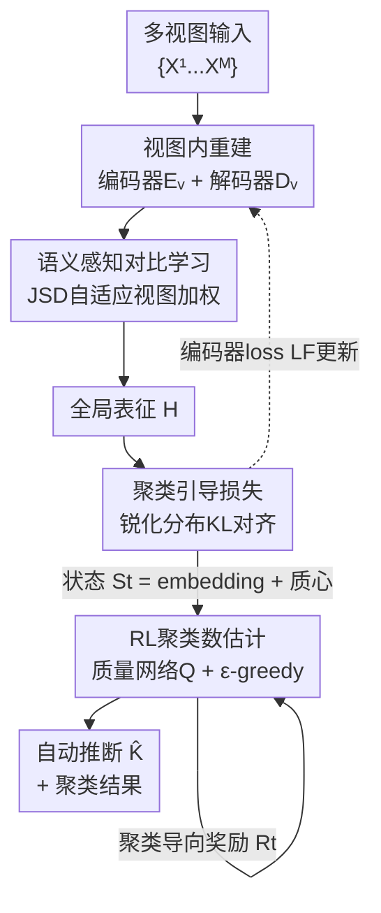

# Reliable Clustering Number Estimation for Contrastive Multi-View Clustering

**会议**: CVPR 2026  
**论文**: [CVF Open Access](https://openaccess.thecvf.com/content/CVPR2026/html/Zhu_Reliable_Clustering_Number_Estimation_for_Contrastive_Multi-View_Clustering_CVPR_2026_paper.html)  
**代码**: 无  
**领域**: 多视图聚类  
**关键词**: 对比多视图聚类, 聚类数估计, 强化学习, 表征退化, JSD 视图加权

## 一句话总结
RCNMC 用一个 JSD 自适应加权的语义感知对比模块缓解低质量视图把高质量视图"拖垮"的表征退化，再把"猜聚类数 K"建模成马尔可夫决策过程、用强化学习在单次训练里自动推断 K，从而在不预设 K、不依赖真值的条件下，在 9 个多视图数据集上达到甚至超过用了真值 K 的对比方法。

## 研究背景与动机
**领域现状**：对比多视图聚类（contrastive MVC）的主流做法是给每个视图配一个编码器抽特征，把不同视图的特征当正/负样本对做对比学习对齐，再融合成一个全局判别表征，最后丢给 K-means 之类的算法按预设的聚类数 $K$ 聚类。这一套深度方法在多个基准上已经显著超过传统方法。

**现有痛点**：这套流水线有两个被普遍忽视的硬伤。其一，它假设你事先知道真实的聚类数 $K$——可现实里 $K$ 往往未知甚至本身就是个说不清的概念（比如拿到一批病人的多视图数据，根本不知道有几种病、自然也给不出 $K$）。早期工作靠"换不同 $K$ 反复跑聚类、再用无监督指标挑最优"来绕过，但在深度多视图场景每个 $K$ 都要重训一遍，开销大到不实用。其二，多个视图的质量常常参差不齐：当某些视图含噪、质量低时，一味强调"视图间一致性对齐"会反噬——高质量视图被迫向低质量视图看齐，结果高质量视图自己的表征能力反而被削弱，作者称之为**表征退化（representation degeneration）**。

**核心矛盾**：对比学习的"对齐一致性"在视图质量不均衡时和"保留高质量视图判别力"是冲突的；而"聚类需要预设 $K$"和"现实 $K$ 未知"是另一组冲突。已有方法要么只解决其一，要么把两者割裂处理。

**本文目标**：在完全无监督、不给真值 $K$ 的前提下，同时（1）抑制对比学习引起的表征退化，（2）自动可靠地估计聚类数 $K$。

**切入角度**：作者注意到——视图与全局表征的"分布差异"可以用 Jensen–Shannon 散度（JSD）稳定度量，差异小说明这个视图语义和共识一致、质量高，应该在对比中被加强；而"找最优 $K$"本质是一个序贯决策问题，可以交给强化学习边训练边探索，用聚类的内聚/分离作为奖励，不必为每个候选 $K$ 重训。

**核心 idea**：用 JSD 自适应视图加权的对比学习治"表征退化"，用强化学习把聚类数估计建成 MDP 治"$K$ 未知"，两个模块在同一框架里互补。

## 方法详解

### 整体框架
RCNMC 的输入是 $M$ 个视图的多视图数据 $\{X^v\}_{v=1}^M$，输出是无需预设 $K$ 的聚类结果与自动推断出的聚类数 $\hat{K}$。整条流水线分两大块：**表征侧**先把每个视图编码进共享隐空间，靠视图内重建保住各视图自身信息，再用语义感知对比学习（SACL）融合出全局表征 $H$、同时按 JSD 给视图动态加权；**决策侧**则在这个不断更新的表征上，把"选多少个簇"当成强化学习的动作，用质量网络 $Q$ 评估每个候选 $K$、用聚类导向的奖励驱动，最终收敛到一个可靠的 $\hat{K}$。两块通过表征更新（编码器 loss）和状态转移（embedding/质心变化）耦合：编码器每被优化一次，状态就从 $S_t$ 转到 $S_{t+1}$，恰好对应 MDP 的状态转移。

### 关键设计

**1. 语义感知对比学习（SACL）：用 JSD 给视图打分，让高质量视图主导对齐**

针对"高质量视图被低质量视图拖垮"的表征退化痛点，SACL 把传统对比学习里"所有视图等权对齐"改成"按质量加权对齐"。先用非线性融合 MLP $F$ 把各视图特征 $\{Z_i^v\}$ 融成全局表征 $H_i$，常规对比损失 $l_{cl}(Z_i^v, H_i)$ 用余弦相似度把全局表征和各视图特征拉近。关键改动是给每个视图项乘上自适应权重：$L_{sacl}=\sum_{v=1}^{M} W^v\, l_{cl}(Z_i^v, H_i)$。权重 $W^v$ 怎么来？作者用 JSD 度量视图表征 $Z_i^v$ 与全局表征 $H_i$ 的分布差异 $D_{JSD}(Z_i^v, H_i)=\tfrac12 KL(P\|M)+\tfrac12 KL(Q\|M)$（$M=\tfrac12(P+Q)$ 是混合分布），差异越小说明该视图越贴近共识、语义越可靠。再把负差异过 Softmax 归一化得到权重：$W^v=\text{Softmax}(-D(Z_i^v,H_i))$（原文写成 $W^v = \frac{e^{1-D_{JSD}(Z_i^v,H_i)}-1}{\sum_j e^{1-D_{JSD}(Z_i^j,H_i)}-1}$ ⚠️ 指数里的 $-1$ 形式以原文为准）。这样高质量视图拿到大权重、在对比中被加强，低质量视图被削弱，从根上避免了"被迫对齐噪声视图"导致的退化。实验里在 Synthetic3d 上能看到：训练初期权重明显倾向高质量的 View 1，随迭代各视图权重逐渐收敛、弥合语义差距。

**2. 聚类引导损失：用锐化分布做自蒸馏，提升簇内聚合度**

光有判别表征还不够，作者额外加了一个聚类引导损失把表征往"更聚拢"的方向推。在全局表征 $H_i$ 上跑聚类算法（默认 K-Means）得到簇心 $C\in\mathbb{R}^{K\times d}$ 和软分配 $G_{ij}=\frac{(1+\|H_i-C_j\|^2)^{-1}}{\sum_{j'}(1+\|H_i-C_{j'}\|^2)^{-1}}$（Student-t 核的软分配），再构造一个"锐化"的目标分布 $X_{ij}=\frac{G_{ij}^2/\sum_i G_{ij}}{\sum_j G_{ij}^2/\sum_i G_{ij}}$，用 KL 散度把当前分配向锐化分布对齐：$L_{clu}=KL(G\|X)=\sum_i\sum_j G_{ij}\log\frac{G_{ij}}{X_{ij}}$。锐化分布会放大高置信度的分配、压低模糊分配，等于让模型对自己更确信的样本"加码"，从而提升簇内紧致度。编码器总损失把三项合在一起联合优化：$L_F=L_{clu}+L_{sacl}+L_{rec}$（$L_{rec}$ 是视图内重建损失，保各视图自身信息不丢）。

**3. 基于强化学习的聚类数估计：把"选 K"建成 MDP，单次训练推断最优簇数**

这是治"$K$ 未知"的核心模块，针对"逐个 $K$ 重训太贵"的痛点，作者把选 $K$ 建模成马尔可夫决策过程，一次训练就推断出来。四要素这样定义：**状态** $S_t=\{Z_t, C_t\}$ 同时包含样本 embedding 和簇心，兼顾局部与全局结构；**转移**靠编码器被 $L_F$ 优化后 embedding 与簇心更新自然产生 $S_t\to S_{t+1}$；**动作**由质量网络打分 $q_t=Q(S_t)$ 给每个候选簇数评分，策略用 $\epsilon$-greedy 选 $\hat{K}_t$（以概率 $\epsilon$ 取 $\arg\max q_t$、否则随机探索，$\epsilon$ 随训练逐渐增大以从探索转向利用）；**奖励**是聚类导向的——

$$R_t = -\frac{1}{N}\sum_i \min_j M(Z_t[i], C_t[j]) + \frac{1}{\hat{K}_t^2}\sum_i\sum_j M(C_t[i], C_t[j])$$

第一项（负的样本到最近簇心距离）鼓励簇内紧致，第二项（簇心两两距离）鼓励簇间分离，$M$ 是欧氏距离。训练用经验回放：把四元组 $(S_t,\hat{K}_t,S_{t+1},R_t)$ 收进缓冲区 $B$，再最小化时序差分式的 RL 损失 $L_Q=\frac{1}{t_e-t_s}\sum_t\big(R_t+\gamma\max Q(S_{t+1})-Q(S_t)[\hat{K}_t]\big)^2$（$\gamma$ 是折扣因子）来训练 $Q$。整个过程只训练一遍，就能让 $Q$ 学会评估不同簇数的好坏并收敛到最优 $\hat{K}$，彻底省掉"每个候选 $K$ 重训一次"的开销。

### 损失函数 / 训练策略
编码器 $F$ 训练 400 epoch，最小化 $L_F=L_{clu}+L_{sacl}+L_{rec}$；经验缓冲区填满后，质量网络 $Q$ 训练 30 epoch、学习率固定 $1e^{-3}$，最小化 $L_Q$。$F$ 学习率从 $\{1e^{-5},1e^{-4},1e^{-3}\}$ 中选，缓冲区大小取 $\{30,40,50\}$，初始贪婪率 $\epsilon\in\{0.3,0.5,0.7\}$ 且训练中递增，折扣因子 $\gamma=0.1$，底层聚类算法用 K-Means。

## 实验关键数据

### 主实验
在 9 个多视图数据集（MNIST-USPS、BDGP、Prokaryotic、Synthetic3d、CCV、Fashion、Cifar10、Cifar100、Caltech-XV）上，用 ACC / NMI / PUR 三指标，对比 8 个 SOTA 深度聚类方法。**关键 caveat**：ICMVC、MGBCC、DIVIDE 这些对比方法是**喂了真值 $K$** 的，RCNMC 没用任何 $K$ 先验，因此这个对比对 RCNMC 是"不公平"的——但即便如此 RCNMC 仍达到或超过它们。

| 数据集 | 指标 | RCNMC（无真值K） | ICMVC（用真值K） | MGBCC（用真值K） |
|--------|------|------|------|------|
| MNIST-USPS | ACC / NMI | 0.981 / 0.955 | 0.922 / 0.910 | 0.879 / 0.876 |
| BDGP | ACC / NMI | 0.992 / 0.938 | 0.988 / 0.963 | 0.970 / 0.912 |
| Prokaryotic | ACC / NMI | 0.706 / 0.432 | 0.632 / 0.278 | 0.691 / 0.379 |
| Fashion | ACC / NMI | 0.995 / 0.978 | 0.895 / 0.955 | 0.634 / 0.725 |
| Cifar100 | ACC / NMI | 0.948 / 0.984 | 0.852 / 0.967 | 0.933 / 0.955 |
| Caltech-4V | ACC / NMI | 0.855 / 0.755 | 0.823 / 0.726 | 0.523 / 0.459 |

### 与传统方法对比 + K 估计准确性
和参数化（K-Means◦、GMM◦，需预设 $K$）及非参数化（DBSCAN•、DPCA•，自动估 $K$）方法对比，RCNMC 不仅聚类指标全面领先，**估出的 $K$ 也更准**：

| 数据集 | 真值 K | RCNMC 估计 K | DBSCAN 估计 K | DPCA 估计 K |
|--------|--------|------|------|------|
| MNIST-USPS | 10 | **10** | 7 | 5 |
| BDGP | 5 | **5** | 8 | 4 |
| Synthetic3d | 3 | **3** | 5 | 6 |
| Fashion | 10 | 11 | 7 | 6 |
| Cifar10 | 10 | **10** | 14 | 12 |
| Cifar100 | 100 | 101 | 82 | 91 |

DBSCAN/DPCA 这类非参数方法在高维深度/图结构表征上估 $K$ 偏差很大（Cifar100 真值 100 估成 82/91），RCNMC 几乎贴住真值。

### 消融实验
在 MNIST-USPS、BDGP、Prokaryotic、Synthetic3d 上逐项消融（聚类数估计模块是核心、不可移除，故只消 $L_{rec}$ / $L_{sacl}$ / $L_{clu}$）：

| 配置 | MNIST-USPS NMI | BDGP NMI | 说明 |
|------|------|------|------|
| 仅 $L_{rec}$ | 0.498 | 0.542 | 只有重建，表征弱 |
| $L_{rec}+L_{sacl}$ | 0.914 | 0.905 | 去掉聚类损失 $L_{clu}$ |
| $L_{rec}+L_{clu}$ | 0.875 | 0.912 | 去掉语义对比 $L_{sacl}$ |
| 完整模型 | **0.955** | **0.938** | 三项齐全 |

### 关键发现
- **$L_{sacl}$ 比 $L_{clu}$ 更关键**：在 MNIST-USPS 上去掉 $L_{clu}$ 仅掉 NMI 4.15%（0.955→0.914），去掉 $L_{sacl}$ 掉 8%（0.955→0.875），说明语义感知对比学习对抑制表征退化贡献更大。
- **错误 $K$ 代价极高**：在 BDGP 上把 $K$ 错设为 2，ACC 仅 39.91%，而正确 $K=5$ 时 ACC 达 99.2%——印证了自动估 $K$ 的价值。
- **Elbow 法不可靠**：Synthetic3d 上 WSS 曲线在 $K=3$ 后骤降再平台、缺乏清晰拐点，容易误导；RCNMC 的 RL 估计则稳定命中真值。
- **效率优势**：传统 Elbow 需对每个候选 $K$ 重训模型，RCNMC 单次训练内用 RL 推断 $K$，训练时间显著更低。

## 亮点与洞察
- **把"调超参 K"变成"学一个策略"**：最巧妙的地方是不再把聚类数当成需要外部搜索的超参，而是建成 MDP 让 $Q$ 网络边训边学着评估候选簇数——奖励直接用聚类的内聚（样本到簇心）和分离（簇心间距）构造，无监督、可微动机清晰，单次训练就拿到 $K$。这个"用 RL 替代网格搜索超参"的思路可迁移到其他需要选离散结构超参的任务（如层数、码本大小）。
- **JSD 加权治表征退化**：用视图-全局表征的 JSD 差异当质量代理、Softmax 成权重，是一个轻量但直击要害的设计——它把"哪些视图可信"这个无监督场景下很难判断的问题，转化成可计算的分布距离，且权重会随训练自适应收敛。
- **诚实地承认对比"不公平"**：作者主动指出对手用了真值 $K$、自己没用，反而让"仍然超过"更有说服力。

## 局限与展望
- **奖励设计偏好球状簇**：奖励基于欧氏距离的内聚/分离，对非球状、流形结构的簇可能不友好（这恰是 DBSCAN 类方法的强项），论文未讨论这种场景。
- **超候选范围的 $K$**：$K$ 在 $[2, N_K]$ 内搜索，$N_K$ 的设置和大 $K$（如 Cifar100 的 100+）下的探索效率未充分分析；Fashion/Cifar100 估出 11/101 都略偏大 1，提示在簇数很多时仍有轻微高估。
- **训练复杂度与稳定性**：RL 模块引入 $\epsilon$-greedy、经验回放、折扣因子等多个超参，$\epsilon$ 递增策略和缓冲区大小对最终 $K$ 的敏感性论文给了取值范围但未做系统鲁棒性分析。
- **改进思路**：可把欧氏距离的奖励换成密度/连通性度量以适配非凸簇；或把 JSD 加权与 RL 状态进一步耦合（让视图权重也进入状态）。

## 相关工作与启发
- **vs 重复跑聚类选 K（Elbow/t-SNE 等）**：它们对每个候选 $K$ 都要重训深度模型、开销大且依赖人工读拐点；RCNMC 用 RL 在单次训练里推断 $K$，又快又自动，且不受"无明显拐点"困扰。
- **vs 非参数聚类（DBSCAN、DPCA、DeepDPM）**：这类方法虽无需预设 $K$，但多为单视图设计、在高维深度/图结构表征上估 $K$ 偏差大，且忽略多视图的语义异质性；RCNMC 面向多视图、表征更强、估 $K$ 更准。
- **vs 常规对比 MVC（MFLVC、ICMVC、MGBCC、DIVIDE）**：它们等权对齐各视图、忽视表征退化且依赖真值 $K$；RCNMC 用 JSD 自适应加权抑制退化，并自学 $K$，在不用真值的劣势条件下仍达 SOTA。

## 评分
- 新颖性: ⭐⭐⭐⭐ 把表征退化抑制与聚类数估计统一进一个 RL 框架、用 JSD 做视图加权，组合新颖且问题设定（同时解两难题）少有人做。
- 实验充分度: ⭐⭐⭐⭐ 9 个数据集 + 与参数/非参数/深度方法多维对比 + 消融 + K 估计准确性 + 效率分析，较扎实；非球状簇与大 K 鲁棒性可再补。
- 写作质量: ⭐⭐⭐ 思路清晰、公式齐全，但部分符号（如 $W^v$ 指数式）排版含糊，需对照原文确认。
- 价值: ⭐⭐⭐⭐ "无需预设 K 的多视图聚类"贴合医疗等现实场景，RL 估 K 的思路有迁移价值。

<!-- RELATED:START -->

## 相关论文

- [\[CVPR 2026\] Multi-Hierarchical Contrastive Spectral Fusion for Multi-View Clustering](multi-hierarchical_contrastive_spectral_fusion_for_multi-view_clustering.md)
- [\[CVPR 2026\] Anti-Degradation Lifelong Multi-View Clustering](anti-degradation_lifelong_multi-view_clustering.md)
- [\[CVPR 2026\] Cluster-aware Anchor Learning for Multi-View Clustering](cluster-aware_anchor_learning_for_multi-view_clustering.md)
- [\[CVPR 2026\] Imbalanced View Contribution Evaluation and Refinement for Deep Incomplete Multi-View Clustering](imbalanced_view_contribution_evaluation_and_refinement_for_deep_incomplete_multi.md)
- [\[CVPR 2026\] Scalable Multi-View Subspace Clustering with Tensorized Anchor Guidance](scalable_multi-view_subspace_clustering_with_tensorized_anchor_guidance.md)

<!-- RELATED:END -->
