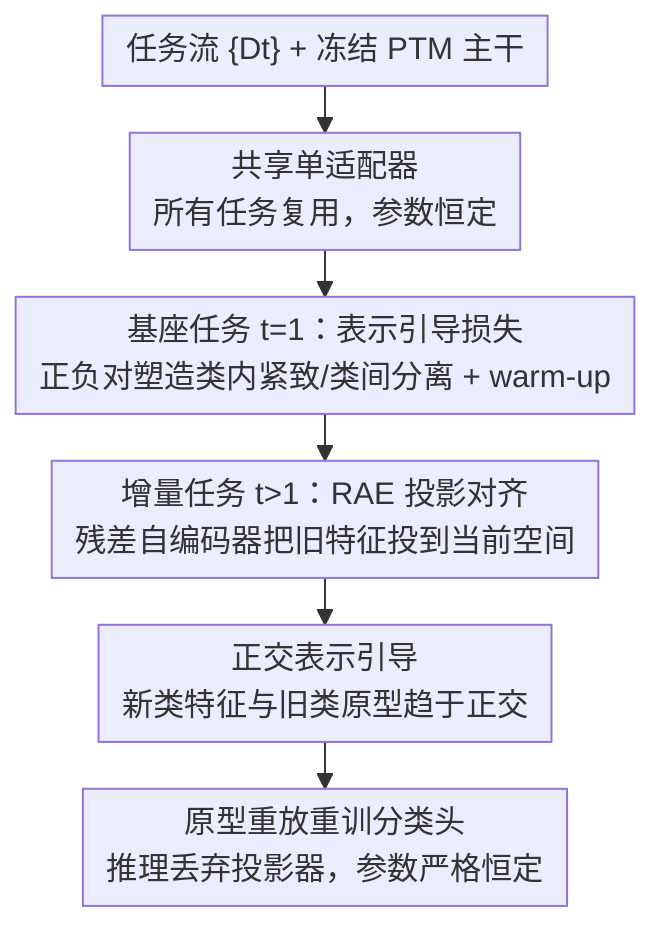

# Representation-Steered Incremental Adapter-Tuning for Class-Incremental Learning with Pre-Trained Models

**会议**: CVPR 2026  
**论文**: [CVF Open Access](https://openaccess.thecvf.com/content/CVPR2026/html/Zhao_Representation-Steered_Incremental_Adapter-Tuning_for_Class-Incremental_Learning_with_Pre-Trained_Models_CVPR_2026_paper.html)  
**代码**: https://github.com/zjrzjrz/RSIAT  
**领域**: 持续学习 / 类增量学习  
**关键词**: 类增量学习、预训练模型、共享适配器、表示引导、原型漂移

## 一句话总结
RSIAT 在基于预训练模型的类增量学习中只用**一个共享适配器**（参数不随任务增长），靠基座任务的"表示引导损失"先把特征塑造得类内紧致、类间分离，再在增量任务用"残差自编码器投影 + 正交损失"对齐新旧特征空间、压制原型漂移，在六个 CIL 基准上以更少参数刷新了稳定性-可塑性的折中。

## 研究背景与动机
**领域现状**：类增量学习（CIL）要求模型在数据流式到来时不断学新类、又不忘旧类。随着预训练模型（PTM）普及，主流从"从头训"转向参数高效微调（PEFT）：冻结 backbone，只训练 prompt 或 adapter 这类小模块。L2P/DualPrompt/CODA-Prompt 用 prompt 池，EASE/MOS/SSIAT 用 adapter，效果都不错。

**现有痛点**：这些 PTM-based CIL 方法暴露两个根本问题。第一，**多数方法每来一个新任务就新增一组任务专属模块**（prompt/adapter），推理时还要检索选模块，导致可训练参数随任务数**线性增长**，且模块误选或互相干扰会显著掉点。第二，尽管 PTM 泛化强，现有方法**缺乏显式机制去结构化跨任务的表示空间**：没有显式正则时，新任务会让旧类特征发生漂移，表现为原型偏移、决策边界模糊、表示稳定性下降。

**核心矛盾**：理想 CIL 系统应满足两件事——(i) 参数增长受限、最好恒定；(ii) 特征空间类内紧致、类间可分、且新旧任务对齐。而现有方法要么为了可塑性不断长模块（违背 i），要么用强正则（如知识蒸馏）硬压旧表示、反而拖慢甚至阻碍 adapter 学新类（在 ii 上顾此失彼）。

**本文目标**：拆成三件事——共享单适配器去掉参数膨胀；在基座任务主动塑造好的表示几何；在增量任务温和地对齐空间、抑制漂移而不"拉手刹"压死 adapter。

**切入角度**：作者持"表示优先"的视角——与其事后用强约束补救漂移，不如一开始就把特征空间塑造好，并在后续任务用一个能跟随表示演化的轻量投影器做对齐。

**核心 idea**：单共享适配器 + 基座"表示引导损失" + 增量"残差自编码器对齐 + 正交损失"，用温和约束换来稳定又可塑的特征空间。

## 方法详解

### 整体框架
RSIAT 建立在 SSIAT 基线之上（共享 adapter $A$、冻结 PTM、用余弦分类损失 $L_{cos}$，并在每个任务后存下各类原型与协方差、用语义漂移估计来重训分类头）。它的核心是一个跨两阶段、连续的机制：**基座任务**（$t=1$）用共享 adapter 配余弦分类器，外加一个带 warm-up 的表示引导损失 $L_{RS}$，把特征塑造成类内紧致、类间分离，让后续任务从一个"好维护"的表示结构起步；**增量任务**（$t>1$）继续更新同一个 adapter，同时用一个残差自编码器（RAE）投影器把上一模型的特征投到当前空间做对齐，并加正交损失防止新类侵占旧类原型。整条流程始终复用同一个共享 adapter，推理时丢弃投影器、参数量严格恒定。

### 关键设计

**1. 共享单适配器：把参数增长按到恒定**

针对"每来一个任务就长一组模块、参数线性增长且要检索选模块"的痛点，RSIAT 全程只维护一个共享 adapter $A$，所有任务复用、不新增任务专属分支，于是推理时既不需要 instance-level 的模块检索、也不会因误选模块掉点。形式上沿用 SSIAT 的设定：抽取嵌入 $f_i^t=\phi(x_i;A^t)$、做 $\ell_2$ 归一化 $\hat z_i^t=f_i^t/\lVert f_i^t\rVert$，用带尺度 $s$ 与边界 $m$ 的余弦损失 $L_{cos}^{(t)}$ 收紧决策边界。代价是单适配器要"一肩挑"所有任务的可塑性与稳定性，这正是后面两组损失要解决的。

**2. 基座表示引导损失 $L_{RS}$ 与 warm-up：先把特征几何塑造好**

针对"只用余弦损失约束太弱、簇会重叠"的痛点，作者在基座任务加一个成对的表示引导损失，主动构造好特征空间。设 $S_{ij}=\langle\hat z_i^1,\hat z_j^1\rangle$ 为样本余弦相似度，正样本对掩码 $M_{ij}^+=\mathbb{I}(y_i=y_j,i\ne j)$、负样本对掩码 $M_{ij}^-=\mathbb{I}(y_i\ne y_j)$，则

$$L_{pos}=\frac{1}{|P|}\sum_{i,j}(1-S_{ij})M_{ij}^+,\quad L_{neg}=\frac{1}{|N|}\sum_{i,j}(1+S_{ij})M_{ij}^-,\quad L_{RS}=L_{pos}+\alpha L_{neg}.$$

正损失把同类拉拢、负损失把异类推开，$\alpha$ 平衡类内紧致与类间分离。关键是 **warm-up 调度**：一上来就加强 $L_{RS}$ 会盖过 $L_{cos}$、妨碍 adapter 先把数据学个大概，所以系数按 $\lambda_{RS}(e)=\lambda_{RS}\cdot\min(1,e/E_w)$ 从 0 线性涨到目标值（$e$ 为 epoch，$E_w$ 为 warm-up 时长）。这样基座阶段先粗学、再逐步加强表示塑造，给后续任务留下一个既鲁棒又可适配的特征底座。

**3. 残差自编码器投影对齐 $L_{align}$：温和对齐而不给 adapter 拉手刹**

针对"更新共享 adapter 必然扰动上一任务表示、但强正则（如蒸馏）又会拖慢 adapter 学新类"的痛点，RSIAT 用一个带恒等跳连的残差自编码器投影器 $P^t(f^{t-1})=\text{AutoEncoder}^t(f^{t-1})+f^{t-1}$ 来对齐 $t-1$ 与 $t$ 的特征空间。任务起点令 $A^t=A^{t-1}$、投影器初始化为零，于是残差形式下投影器初始是恒等映射（I-projection），与模型完美对齐；随着 adapter 更新，投影器**只需在恒等路径上建模表示的增量漂移**，无需对 adapter 施加约束。对齐用 L2 损失 $L_{align}^{(t)}=\frac{1}{|B^t|}\sum_x\lVert f^t-P^t(f^{t-1})\rVert_2^2$。这种"投影器追着模型跑、而不是反过来束缚模型"的设计，正是它既能抑制漂移、又不像强正则那样产生优化阻力的原因。

**4. 正交表示引导 $L_{orth}$：让新类与旧类原型互不侵占**

针对"新类学习挤占旧类表示空间"的痛点，RSIAT 用累积的旧类原型 $\{\mu_c\}$ 做正交约束。先用投影器把旧原型和旧任务特征映到当前空间并归一化（$\hat p_c=P^t(\mu_c)/\lVert\cdot\rVert$，$\hat u_i=P^t(f_i^{t-1})/\lVert\cdot\rVert$），再最小化两者余弦相似度的绝对值

$$L_{orth}^{(t)}=\frac{1}{|Y_{1:t-1}||B^t|}\sum_{c}\sum_{i}|\langle\hat p_c,\hat u_i\rangle|.$$

它促使新类特征与旧类原型趋于正交，从而"学新类时尽量不动旧类表示"，增强稳定性。增量任务总损失为 $L^{(t)}=L_{cos}^{(t)}+\beta L_{align}^{(t)}+\gamma L_{orth}^{(t)}$。

> ⚠️ **框架↔关键设计一致**：框架图四个贡献节点（共享单适配器 / 基座表示引导损失 / RAE 投影对齐 / 正交表示引导）逐一对应设计 1–4，末端"原型重放重训分类头"是沿用 SSIAT 的脚手架步骤、非本文新设计。

### 损失函数 / 训练策略
基座任务：$L^{(1)}=L_{cos}^{(1)}+\lambda_{RS}(e)\,L_{RS}$；增量任务：$L^{(t)}=L_{cos}^{(t)}+\beta L_{align}^{(t)}+\gamma L_{orth}^{(t)}$。adapter 维度设 64，RAE 下采样维固定 64、中间上采样维用来调可训练参数量；推理时丢弃 RAE，仅用冻结 PTM + 共享 adapter + 分类头，参数严格恒定。

## 实验关键数据

### 主实验
六个 CIL 基准（ViT-B/16-IN21K backbone，无 exemplar），报告平均精度 $\bar A$ 与最终精度 $A_B$（节选数据集）：

| 方法 | CIFAR $\bar A$ | IN-R $\bar A$ | IN-A $\bar A$ | OmniBench $\bar A$ | CUB $\bar A$ | VTAB $\bar A$ |
|------|------|------|------|------|------|------|
| RanPAC | 94.35 | 82.98 | 69.32 | 85.95 | 93.13 | 92.56 |
| EASE | 92.35 | 81.74 | 65.34 | 81.11 | 92.23 | 93.61 |
| MOS | 94.75 | 82.96 | 69.13 | 85.91 | 93.49 | 92.62 |
| SSIAT（基线） | 94.35 | 83.63 | 70.83 | 84.31 | 93.38 | 94.21 |
| **RSIAT** | **95.15** | **86.92** | **74.89** | **86.42** | **93.99** | **94.65** |

RSIAT 在全部六个数据集上 $\bar A$ 与 $A_B$ 双双最优，优势在 ImageNet-A/R 这类域差大的数据上尤为明显（末阶段比次优 +1.91 on IN-A、+1.47 on IN-R）。与**用 20 exemplar/类的传统 CIL 方法**比，RSIAT 在 **0 exemplar** 下仍占优：

| 方法 | Exemplar | IN-R $\bar A$ | IN-R $A_B$ | CIFAR $\bar A$ | CIFAR $A_B$ |
|------|----------|------|------|------|------|
| FOSTER | 20/类 | 81.34 | 74.48 | 89.87 | 84.91 |
| TagFex | 20/类 | 83.23 | 78.45 | 92.17 | 89.26 |
| **RSIAT** | **0** | **86.92** | **82.75** | **95.15** | **92.20** |

### 消融实验
在 ImageNet-R/A（B0I20）上逐组件消融（$\bar A$/$A_B$）：

| 配置 | IN-R $\bar A$ | IN-R $A_B$ | IN-A $\bar A$ | IN-A $A_B$ | 说明 |
|------|------|------|------|------|------|
| Baseline（余弦头+共享adapter） | 83.63 | 79.38 | 70.83 | 62.43 | 起点 |
| + $L_{orth}$ | 84.15 | 78.32 | 72.83 | 61.95 | 升 $\bar A$ 但略压最终可塑性 |
| + $L_{align}$ | 84.72 | 80.17 | 74.30 | 65.04 | 两指标一致提升 |
| + IRS（align+orth） | 84.86 | 80.52 | 74.37 | 65.31 | 增量引导协同最优 |
| + IRS（去残差） | 80.59 | 74.02 | 65.37 | 51.48 | 去掉恒等跳连后崩盘 |
| + IRS + $L_{RS}$ | 85.36 | 81.45 | 74.62 | 65.50 | 叠加基座引导 |
| RSIAT（完整） | **86.92** | **82.75** | **74.89** | **66.23** | 全组件 |

### 关键发现
- **残差跳连是命门**：把 RAE 的恒等跳连去掉（IRS wo res），IN-A 的 $A_B$ 从 65.31 暴跌到 51.48，证明"投影器只学增量漂移、不束缚 adapter"才是温和对齐有效的根因。
- $L_{orth}$ 单独加会提升 $\bar A$ 却略损最终 $A_B$（限制了可塑性），$L_{align}$ 则两指标同升；二者合成 IRS 取得最佳协同。
- 基座的 $L_{RS}$ 叠加在 IRS 之上仍有稳定增益，说明"先塑造好特征几何"与"后续温和对齐"是互补而非替代关系。

## 亮点与洞察
- **残差恒等投影器的巧思**：让对齐项从初始的恒等映射出发、只建模漂移增量，等于把"对齐"做成了不给 adapter 拉手刹的软约束，这个"投影器追模型、而非模型迁就投影器"的思路可迁移到任何需要跨阶段特征对齐的持续学习场景。
- **表示优先 + warm-up**：先粗学再逐步加强表示塑造，避免强约束一上来压死学习，是平衡稳定性-可塑性的实用调度技巧。
- **参数恒定还能更准**：单共享 adapter 打掉了"参数随任务线性增长"的通病，且在 exemplar-free 下反超用 20 exemplar 的传统方法，对长任务序列的可扩展性友好。

## 局限与展望
- 方法依赖每任务后存储旧类原型与协方差来重训分类头并算正交损失，类别极多时原型存储与正交项的计算量会上升（⚠️ 复杂度量级以原文为准）。
- 单共享 adapter 容量固定，面对域差极大或任务数极长时，是否会触及容量瓶颈、可塑性是否仍够，文中长序列实验有所验证但上限未充分探讨。
- RS 损失、warm-up、$\alpha/\beta/\gamma$ 等超参对不同数据集需分别设定（附录给出），跨数据集的自适应配置仍是开放问题。

## 相关工作与启发
- **vs SSIAT（直接基线）**：SSIAT 已用共享 adapter + 语义漂移感知，但只靠余弦损失、几何约束弱导致簇重叠；RSIAT 补上基座表示引导与增量 RAE 对齐 + 正交损失，把"显式结构化表示空间"这一缺口填上，六基准全面领先。
- **vs EASE / MOS（adapter 扩展派）**：它们靠新增/合并 adapter 子空间换可塑性，参数随任务增长且需检索；RSIAT 坚持单适配器、用表示几何与温和对齐拿稳定性，参数恒定。
- **vs 强正则（知识蒸馏类）**：蒸馏硬压旧表示会拖慢 adapter 学新类；RSIAT 的残差投影器是软对齐，抑制漂移而不产生优化阻力。

## 评分
- 新颖性: ⭐⭐⭐⭐ 共享适配器并非首创，但"残差恒等投影 + 基座表示引导 + 正交"的组合与"表示优先"视角有新意。
- 实验充分度: ⭐⭐⭐⭐⭐ 六基准、两种 backbone、长序列/大基座设定、与传统 exemplar 方法对比、逐组件消融与可视化齐全。
- 写作质量: ⭐⭐⭐⭐ 动机到设计链条清楚，损失定义完整，部分记号偏密。
- 价值: ⭐⭐⭐⭐⭐ 参数恒定下刷新 CIL 折中、exemplar-free 反超有 exemplar 基线，落地价值高。

<!-- RELATED:START -->

## 相关论文

- [\[CVPR 2026\] Smart Replay: Adaptive Scheduling of Memory Rehearsal for Computational Resource-Aware Incremental Learning](smart_replay_adaptive_scheduling_of_memory_rehearsal_for_computational_resource-.md)
- [\[AAAI 2026\] Incremental Maintenance of DatalogMTL Materialisations](../../AAAI2026/others/incremental_maintenance_of_datalogmtl_materialisations.md)
- [\[ICML 2025\] Addressing Imbalanced Domain-Incremental Learning through Dual-Balance Collaborative Experts (DCE)](../../ICML2025/others/addressing_imbalanced_domain-incremental_learning_through_dual-balance_collabora.md)
- [\[CVPR 2026\] Your Dissimilarities Define You: Complementary Learning Exploiting Class Diversities](your_dissimilarities_define_you_complementary_learning_exploiting_class_diversit.md)
- [\[ECCV 2024\] An Incremental Unified Framework for Small Defect Inspection](../../ECCV2024/others/an_incremental_unified_framework_for_small_defect_inspection.md)

<!-- RELATED:END -->
