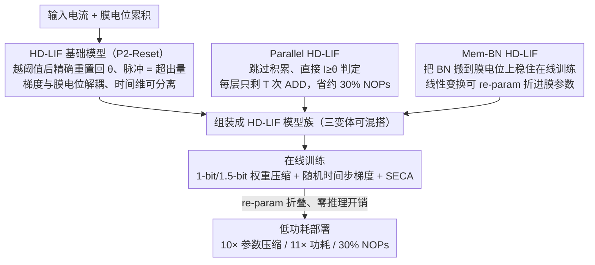

# Rethinking SNN Online Training and Deployment: Gradient-Coherent Learning via Hybrid-Driven LIF Model

**会议**: CVPR 2026  
**arXiv**: [2410.07547](https://arxiv.org/abs/2410.07547)  
**代码**: [GitHub](https://github.com/hzc1208/HD_LIF)  
**领域**: 脉冲神经网络 / 模型压缩  
**关键词**: SNN, online training, LIF model, gradient separability, low-power inference

## 一句话总结

提出 HD-LIF（混合驱动 LIF）脉冲神经元模型族，通过在阈值上下区域采用不同脉冲计算机制，理论证明梯度可分离性和对齐性，解决 SNN 在线训练的前后向传播不一致问题，同时实现学习精度、内存复杂度和功耗的全阶段优化——以 10× 参数压缩、11× 功耗降低和 30% NOPs 节省达到 CIFAR-100 上 78.61% 精度。

## 研究背景与动机

**领域现状**：SNN 因类脑和能效特性受到关注。STBP（时空反向传播）是主流训练算法，通过引入代理梯度解决脉冲不可微问题，显著提升了 SNN 性能。但 STBP 的反向传播链有时间依赖性，GPU 内存随时间步线性增长，严重限制了 SNN 在复杂场景和长序列上的应用。

**现有痛点**：在线训练通过截断时间依赖梯度使 GPU 内存恒定，但面临两大根本缺陷：(1) 代理梯度函数与膜电位值相关（如 Triangle Function $\partial s / \partial m = \frac{1}{\gamma^2}\max(\gamma - |m - \theta|, 0)$），各时间步的梯度贡献权重 $\epsilon[i,t]$ 不同且不可预测，截断后导致前后向传播不一致，学习精度退化；(2) 现有在线训练方法仅优化训练 GPU 内存，推理阶段相比 STBP 训练的模型无任何额外优势（参数量、功耗、计算量都一样），损害了实际应用价值。

**核心矛盾**：在线训练的核心是截断时间维度梯度依赖 → 但传统 LIF 的代理梯度与膜电位值耦合 → 截断后梯度不一致 → 性能退化。这个矛盾使得在线训练一直无法突破"方便但性能差"的困境。

**本文目标** 设计一种脉冲神经元模型，使其梯度天然可分离且对齐（截断不引起不一致），同时在推理阶段也能提供参数压缩、功耗降低和计算优化的额外优势。

**切入角度**：修改脉冲发放机制——在阈值以上区域采用 Precise-Positioning Reset（P2-Reset），使代理梯度与膜电位值解耦，实现梯度对时间维度的天然可分离性。

**核心 idea**：通过混合驱动脉冲计算（阈值以下保留传统 LIF 积累、阈值以上用 P2-Reset 使梯度与膜电位解耦），同时解决在线训练的梯度不一致和推理部署的效率问题。

## 方法详解

### 整体框架

整篇方法围绕一个核心改动：把脉冲神经元的发放机制拆成阈值上下两段，让代理梯度不再黏着膜电位值，从而在线训练截断时间依赖时不会引入前后向不一致。具体地，HD-LIF 在标准 LIF 上保留阈值以下的充电-泄漏积累，但在膜电位越过阈值发放后改用 P2-Reset（Precise-Positioning Reset）：膜电位精确重置回阈值 $\theta$，发放出的脉冲值取膜电位超出阈值的量 $s^* = m - \theta$，而非传统 LIF 固定吐出 $\theta$。在这个基础神经元之上，论文再叠两层工程优化——把一部分神经元换成无积累的并行版本压低推理算力，把批归一化搬到膜电位上稳住在线训练——最终形成 vanilla / Parallel / Mem-BN 三个可混搭的 HD-LIF 变体，配合 1-bit/1.5-bit 权重压缩与多位脉冲量化覆盖训练到部署的全链路。

### 关键设计

**1. HD-LIF 基础模型：让梯度和膜电位值解耦，截断才"免费"**

在线训练性能退化的根子在于传统 LIF 的代理梯度 $\partial s / \partial m = f(m)$ 依赖膜电位具体值，于是时间梯度贡献权重 $\epsilon[i,t] = \mathcal{F}(m_t, \dots, m_i)$ 是一串膜电位的函数，不可预测也不可分离，截断时间维度后前向算的和反向传的对不上。P2-Reset 把这个耦合直接掐断：发放后膜电位精确归位到 $\theta$、脉冲值线性等于超出量，使 $\partial s^* / \partial m$ 在阈值上下两区分别恒为常数（1 和 0），与膜电位取值无关。论文据此证明（Theorem 4.2）HD-LIF 的时间梯度权重退化成有限集常值的连乘 $\epsilon[i,t] = \chi[i,i] \prod_{j=t+1}^{i} \chi[j,j-1]$，其中 $\chi[i,i] \in \{0,1\}$、$\chi[j,j-1] \in \{0, \lambda_j\}$（$\lambda_t$、$\theta_t$ 是每时间步可学习参数）。

$$\epsilon[i,t] = \chi[i,i] \prod_{j=t+1}^{i} \chi[j,j-1], \quad \chi[i,i]\in\{0,1\},\ \chi[j,j-1]\in\{0,\lambda_j\}$$

正因为这串权重不再含膜电位，在线训练截断时间梯度后能无缝逼近 STBP 的梯度（Theorem 4.2(i) 给出具体等式），同时发放过程里 $s$ 与 $m$ 不存在不可微跳变，空间维度的梯度也天然对齐——这就是它相比 SLTT 等数值近似方案的本质区别：不是事后缓解不一致，而是从神经元层面让不一致根本不发生。

**2. Parallel HD-LIF：把推理算力从 NOPs 上抠下来**

vanilla HD-LIF 解决了梯度问题，但推理时仍要做完整的充电-泄漏积累，每层神经元需 T 次 MUL + 2T 次 ADD，相比普通 LIF 在 NOPs 上并不占便宜。Parallel 版本干脆跳过积累，直接判定 $s_t^* := (I_t \geq \theta_t)$，每层只剩 T 次 ADD。论文以约 50% 比例把它和 vanilla 块混搭，既保住静态积累带来的表达力又砍掉一半神经元的算力，实测节省约 30% NOPs，精度只从 80.16% 掉到 78.82%（CIFAR-100，降 1.34%），是个性价比很高的换挡。

**3. Mem-BN HD-LIF：在膜电位上做 BN，且推理零开销**

在线训练丢掉了时间梯度项，光控住输入电流分布还不够，膜电位的累积分布同样会漂。传统 BN 接在卷积层后只能监控输入电流，Mem-BN 把归一化直接搬到膜电位上：$\hat{m}_t = \alpha_t \cdot m_t + \beta_t \cdot \text{BN}_t(m_t)$，用可学习的 $\alpha_t, \beta_t$ 调节归一化强度，并在 $\alpha_t{=}1, \beta_t{=}0$ 时退回 vanilla HD-LIF 作为性能下界。关键在推理：BN 是线性变换，可以通过 re-parameterization 整个折进膜相关参数——$\hat{\lambda}_t = \alpha_t^* \lambda_t$、$\hat{I}_t = \alpha_t^* I_t - \beta_t^*$——于是训练期吃到 BN 的稳定性红利，部署时一条额外计算都不多，做到"零成本的推理 BN"。

### 损失函数 / 训练策略

突触权重用 1-bit（$\{-1,+1\}$）或 1.5-bit（$\{0,\pm 1\}$）压缩，其中 1.5-bit 通过引入零值进一步促进突触稀疏、压低功耗。训练上采用随机时间步梯度更新：每个 batch 只随机挑一个时间步做反向传播，在已经恒定的内存之上再省一截开销。此外迁移了一个轻量的 SECA（脉冲高效通道注意力，源自 ECA-Net）：GAP → 1D Conv → Sigmoid → 通道加权，参数量 $O(K)$、计算量 $O(KC)$ 几乎可忽略，且 spike 序列在时间维度共享同一组权重以贴合 SNN 设定。

## 实验关键数据

### 主实验

| 数据集 | 方法 | 网络 | 参数(MB) | 训练方式 | 时间步 | 精度(%) |
|--------|------|------|---------|---------|--------|---------|
| CIFAR-10 | GLIF (STBP) | ResNet-18 | 44.66 | STBP | 4,6 | 94.67, 94.88 |
| CIFAR-10 | SLTT (Online) | ResNet-18 | 44.66 | Online | 6 | 94.44 |
| CIFAR-10 | **Ours** | ResNet-18 | **2.82** | Online | 4 | **95.59** |
| CIFAR-100 | GLIF (STBP) | ResNet-18 | 44.84 | STBP | 4,6 | 76.42, 77.28 |
| CIFAR-100 | SLTT (Online) | ResNet-18 | 44.84 | Online | 6 | 74.38 |
| CIFAR-100 | **Ours** | ResNet-18 | **3.00** | Online | 4 | **78.45** |
| ImageNet-1k | SLTT (Online) | ResNet-34 | 87.12 | Online | 6 | 66.19 |
| ImageNet-1k | **Ours** | ResNet-34 | **10.06** | Online | 4 | **69.77** |
| DVS-CIFAR10 | NDOT (Online) | VGG-SNN | 37.05 | Online | 10 | 77.50 |
| DVS-CIFAR10 | **Ours** | VGG-SNN | **2.49** | Online | 10 | **83.00** |

### 消融实验（CIFAR-100, ResNet-18）

| 配置 | 参数(MB) | 精度(%) | SOPs(M) | NOPs(M) | 功耗(mJ) |
|------|---------|---------|---------|---------|---------|
| LIF baseline | 44.84 | 71.75 | 273.02 | 6.59 | 0.25 |
| HD-LIF | 4.40 | 80.16 | 284.49 | 6.59 | 0.26 |
| HD-LIF + 4bit量化 | 4.40 | 79.62 | 233.84 | 6.59 | 0.03 |
| HD-LIF + 50% Parallel | 4.40 | 78.82 | 254.08 | 4.62 | 0.23 |
| **HD-LIF + 4bit + 50% Parallel** | **4.40** | **78.61** | **190.13** | **4.62** | **0.02** |

### SECA 消融

| 方法 | CIFAR-10 | CIFAR-100 | DVS-CIFAR10 |
|------|---------|----------|-------------|
| HD-LIF | 95.59% | 78.45% | 81.70% |
| HD-LIF + Mem-BN + SECA | **95.91** (+0.32) | **79.33** (+0.88) | **83.50** (+1.80) |

### 关键发现

- HD-LIF 相比 LIF baseline 精度提升 8.41 个点（71.75→80.16%），同时参数压缩 ~10×——梯度可分离性是性能提升的根本原因
- 全配置（HD-LIF + 4bit + 50% Parallel）在保持 78.61% 精度的同时：参数压缩 10×，功耗降低 11×（0.25→0.02 mJ），NOPs 节省 30%
- DVS-CIFAR10 上 HD-LIF 超 Dspike 6.30%、超 NDOT 5.50%，证明对神经形态数据同样有效
- HD-LIF 在静态数据集上单时间步即可接近 SOTA（类 ANN 行为），在神经形态数据上随时间步增长精度递增（保持 SNN 特性），展现混合驱动的双重性

## 亮点与洞察

- 从根本上解决在线训练的梯度不一致问题——不是用数值近似或正则化去缓解，而是通过重新设计脉冲计算机制使梯度天然可分离。Theorem 4.2 的理论保证让这个方案有扎实的数学基础
- "训练+部署一体化"的全阶段优化视角新颖——之前在线训练只管降低训练内存，推理和 STBP 一样；HD-LIF 的 P2-Reset + 权重压缩 + 并行计算使推理也获得极大收益
- Mem-BN 的 re-parameterization 设计精巧——训练时有 BN 稳定性收益，推理时无开销增加，通过参数融合实现"零成本推理 BN"

## 局限与展望

- 实验局限于分类任务（CIFAR-10/100、ImageNet、DVS-CIFAR10），未在检测、分割等下游任务验证
- Parallel HD-LIF 完全跳过膜电位积累，对需要时间建模的任务（如时序预测、语音识别）可能不适合
- 1-bit/1.5-bit 权重压缩激进，在更大规模模型和更复杂任务上的扩展性待验证
- SECA 的通道注意力在时间维度共享权重，可能限制了对时间动态特征的建模能力

## 相关工作与启发

- **vs SLTT/OTTT**：传统在线训练直接截断时间梯度，精度退化是固有问题；HD-LIF 从神经元模型层面解决梯度可分离性，使截断变得"免费"，CIFAR-100 上超 SLTT 4.07%
- **vs GLIF**：GLIF 用 STBP 训练带可学习门控的 LIF 变体，精度高但 GPU 内存随时间步线性增长；HD-LIF 在线训练内存恒定且精度更高（78.45% vs 77.28%），参数量仅为 1/15
- **vs 可逆训练方法**（reversible SNN）：可逆训练能保证在线和 STBP 梯度一致但需双向计算所有中间变量，计算开销翻倍；HD-LIF 无需可逆计算，训练开销更低

## 评分

- 新颖性: ⭐⭐⭐⭐ P2-Reset 机制和梯度可分离性理论新颖，模型族设计完整
- 实验充分度: ⭐⭐⭐⭐ 5 个数据集 + 详细消融 + 多指标全面对比，但缺少非分类任务验证
- 写作质量: ⭐⭐⭐⭐ 理论推导清晰，Definition→Theorem 结构严谨
- 价值: ⭐⭐⭐⭐ 为 SNN 在线训练提供了根本性解决方案，训练+部署一体化思路有广泛影响

<!-- RELATED:START -->

## 相关论文

- [\[ICML 2026\] Beyond Model Readiness: Institutional Readiness for AI Deployment in Public Systems](../../ICML2026/others/beyond_model_readiness_institutional_readiness_for_ai_deployment_in_public_syste.md)
- [\[CVPR 2026\] Convolutional Neural Networks Driven by Content Similarity](convolutional_neural_networks_driven_by_content_similarity.md)
- [\[AAAI 2026\] DeToNATION: Decoupled Torch Network-Aware Training on Interlinked Online Nodes](../../AAAI2026/others/detonation_decoupled_torch_network-aware_training_on_interlinked_online_nodes.md)
- [\[CVPR 2026\] Bidirectional Query-Driven Generation of Parametric CAD Sketch](bidirectional_query-driven_generation_of_parametric_cad_sketch.md)
- [\[CVPR 2026\] AVGGT: Rethinking Global Attention for Accelerating VGGT](avggt_rethinking_global_attention_for_accelerating_vggt.md)

<!-- RELATED:END -->
