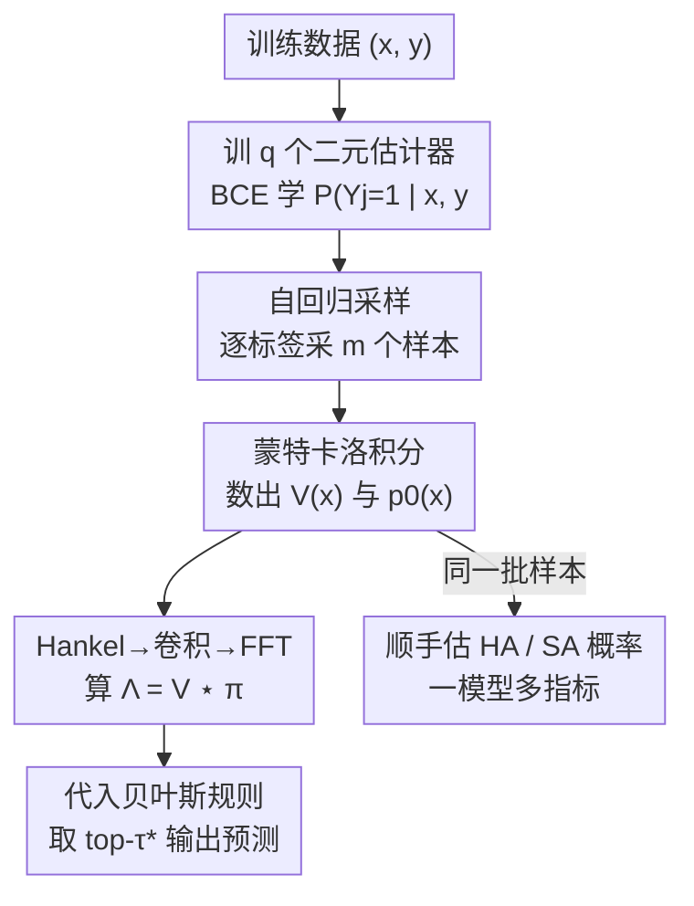

# Revisiting F-measure Optimization in Multi-Label Classification: A Sampling-based Approach

**会议**: CVPR 2026  
**论文**: [CVF Open Access](https://openaccess.thecvf.com/content/CVPR2026/html/Wang_Revisiting_F-measure_Optimization_in_Multi-Label_Classification_A_Sampling-based_Approach_CVPR_2026_paper.html)  
**代码**: https://github.com/ZixunWang/MLC-F1-Sampling  
**领域**: 多标签分类 / F-measure 优化  
**关键词**: 多标签分类、F-measure 优化、贝叶斯决策规则、自回归采样、FFT 加速

## 一句话总结
针对多标签分类中 F-measure 的最优预测，本文把贝叶斯规则里 $O(q^3)$ 的矩阵乘法用 Hankel 结构改写成卷积、再用 FFT 降到 $O(q^2\log q)$，并用「训 $q$ 个二元估计器 + 自回归采样 + 蒙特卡洛积分」替代原来难训的 $q$ 个多分类估计器，缓解稀疏分布问题，在六个数据集上一致超过过去十年的标准做法。

## 研究背景与动机

**领域现状**：多标签分类（MLC）要为一个样本同时预测多个标签，评估时常用 F-measure（精确率与召回率的调和平均）。和直接对每个标签卡 0.5 阈值的二元相关（Binary Relevance）不同，F-measure 是一个非分解（non-decomposable）指标——它把整个标签集合耦合在一起算，不能逐标签独立最优化。Dembczynski 等人 2010 年给出了 F-measure 的贝叶斯最优决策规则（Theorem 1），证明只要拿到 $q^2+1$ 个概率（一个 $q\times q$ 的矩阵 $V(x)$ 加上空集概率 $p_0(x)$），就能做出一致（consistent）的最优预测。这套「估概率 → 代入贝叶斯规则」的范式做了十多年，是 F-measure 优化的标准答案。

**现有痛点**：标准做法（记作 DMN，Direct Multinomial estimation）有两个工程与统计上的硬伤。第一是**预测慢**：拿到 $V(x)$ 后要算 $\hat\Lambda(x)=\hat V(x)U$ 这步矩阵乘法，复杂度 $O(q^3)$，标签数 $q$ 一大（如 bibtex 有 159 个标签）就吃不消。第二是**估计难**：为了估出 $V_{j,k}$，DMN 把每个标签的二分类问题改写成 $q$ 个多分类（multinomial）任务，每个估计器要估 $q+1$ 类。这个「标签变换」（Equation 5）把本就稀少的正样本进一步切成 $q$ 份，叠加 MLC 数据天然的标签不平衡，得到一个极端长尾的多分类分布，非常难训。

**核心矛盾**：贝叶斯规则本身是对的、是最优的，但它要求的那组概率 $V(x)$ 通过「多分类直接估计」这条路去拿，既慢（$O(q^3)$ 矩阵乘）又不准（标签变换制造稀疏长尾）。问题不在贝叶斯规则，而在「用什么计算方式算预测」和「用什么估计策略拿概率」。

**本文目标**：在不动贝叶斯规则、保持一致性的前提下，(1) 把预测阶段的矩阵乘法加速；(2) 换一条不需要标签变换、不制造稀疏分布的概率估计路线。

**切入角度**：作者两点观察。其一，矩阵乘法里的那个矩阵 $U$（$U_{k,\tau}=(k+\tau)^{-1}$）是一个**Hankel 矩阵**（反对角线为常数），这种结构允许把矩阵乘转成卷积，再用 FFT 加速。其二，借鉴贝叶斯推断「直接估计难就改成采样」、以及生成式分类器在小样本下优于判别式分类器的经验，与其去直接估那个稀疏的多分类分布，不如**先采样、再用蒙特卡洛积分把概率数出来**。

**核心 idea**：用「Hankel→卷积→FFT」把预测从 $O(q^3)$ 降到 $O(q^2\log q)$；用「训 $q$ 个二元估计器做自回归采样 + 蒙特卡洛积分」替代「训 $q$ 个多分类估计器」，绕开标签变换、缓解稀疏，称为 SMN（Sampling-based MultiNomial estimation）。

## 方法详解

### 整体框架

整个方法挂在 Dembczynski 的贝叶斯规则上，目标始终是估出 $V(x)\in[0,1]^{q\times q}$ 和 $p_0(x)$，再代入 Theorem 1 输出预测。本文把这条管线的两个环节分别替换：估计环节用「二元估计器 + 自回归采样 + 蒙特卡洛积分」（SMN）替代原来的多分类直接估计；预测环节用「Hankel 卷积 + FFT」替代矩阵乘法。两处替换互相独立——FFT 加速对任何基于 Theorem 1 的方法都适用，SMN 则专门解决稀疏估计问题。一个额外红利是：采样得到的标签样本既能估 F-measure 所需的 $V$，也能顺手估出 HA、SA 这些指标的贝叶斯规则所需概率，于是同一个模型能一对多地优化多种指标。

### 关键设计

**1. Hankel 结构 + FFT：把 $O(q^3)$ 的矩阵乘改写成卷积**

贝叶斯规则要算 $\hat\Lambda(x)=\hat V(x)U$，其中 $U_{k,\tau}=(k+\tau)^{-1}$，这步稠密矩阵乘是 $O(q^3)$，$q$ 大时成了预测瓶颈。作者注意到 $U$ 是 Hankel 矩阵——它的每条反对角线取值都是常数，因为 $U_{k,\tau}$ 只依赖 $k+\tau$ 这个和。于是把 $U$ 的反对角线拉直成一个向量 $\pi=(U_{1,1},\cdots,U_{1,q},U_{2,q},\cdots,U_{q,q})^\intercal$，$\hat V$ 第 $j$ 行与 $U$ 的乘积就恰好等于该行与 $\pi$ 的（翻转）卷积：$\hat V_{j,\cdot}^\intercal U=\hat V_{j,\cdot}^\intercal\star\pi$，因为 $\pi_{k:k+q-1}=U_{1:q,k}$。做 $q$ 次卷积就拿到整个 $\hat\Lambda$。卷积可用快速傅里叶变换（FFT）高效计算，复杂度从 $O(q^3)$ 降到 $O(q^2\log q)$，而且 CUDA 的 cuFFT 库天然并行。这一招的灵感来自 Dai & Li 在 Dice 优化分割里的同类技巧，区别在于本文是从矩阵的 Hankel 结构显式推出卷积形式，而非套用。

**2. 采样-再-估计：用二元估计器替代难训的多分类估计器**

DMN 为了估 $V_{j,k}=P(Y_j=1,\|Y\|_1=k\mid x)$，被迫做标签变换把问题改成多分类，结果正样本被切碎成长尾分布、极难训。本文换思路：如果能从真实条件分布 $P(Y\mid X=x)$ 里采出 $m$ 个标签向量样本 $\{\hat s^{(t)}\}_{t=1}^m$，就可以直接用蒙特卡洛积分把概率「数」出来——

$$\hat V_{j,k}=\frac{1}{m}\sum_{t=1}^m \mathbb{1}\big(\hat s_j^{(t)}=1,\ \|\hat s^{(t)}\|_1=k\big),$$

由大数定律，当 $m\to\infty$ 时它依概率收敛到真值 $V_{j,k}$。关键是怎么采样：按概率链式法则把联合分布分解为 $P(Y\mid x)=\prod_{j=1}^q P(Y_j\mid Y_{<j},x)$，于是训 $q$ 个**二元**估计器 $\hat\psi_j$，每个用 BCE 损失学「给定特征 $x$ 和前面已采的标签 $y_{<j}$ 时第 $j$ 个标签为正的概率」（Equation 9），它们合起来就是一个自回归模型，可以逐标签自回归采样。相比多分类估计器，这些二元估计器训练在**原始标签**上、不经标签变换，因此不受稀疏长尾之苦，更好训、估得更准。实现上是一个共享特征编码器 + $q$ 个全连接输出头的单一模型。值得一提，若把「采样」换成「每步贪心取最高概率」，方法就退化成经典的分类器链（Classifier Chain）——但分类器链是启发式地利用标签依赖、没有优化目标的理论保证，而本文采样是为了估 Theorem 1 所需概率、带一致性保证，动机完全不同。

**3. 一致性保证：把采样估计的误差界显式写出来**

仅有「采样能数出概率」还不够，作者用 Theorem 2 给出 $\hat V$ 的一致性界：在概率至少 $1-\delta$ 下，

$$\|\hat V-V\|_F\le q\Big(\sqrt{\tfrac{\log(2q^2/\delta)}{2m}}+C\sqrt{q\,\epsilon_n}\Big),$$

其中 $\|\cdot\|_F$ 是 Frobenius 范数，$\epsilon_n$ 是二元估计器 $\hat\psi_j$ 在 BCE 损失下超额风险的收敛率。这个界把误差拆成两块：第一项来自**采样误差**，随样本数 $m$ 增大而消失；第二项来自二元估计器的**训练误差**，收敛率取决于函数类的选择。它解释了为什么实验里采样数不必很大——比如 COCO（80 标签）只需 $m=150$ 个样本就收敛，作者归因于标签空间本质上的低维结构。这条界也是和 Waegeman 等人早期同类自回归采样工作的核心区别：后者没分析在什么条件下采样有益，本文则明确指出多分类估计的稀疏症结、并给出可量化的理论保证。

**4. 一模型多指标：同一批采样样本顺手优化 HA / SA**

MLC 里不同指标的贝叶斯规则不同（F-measure 要 top-$\tau^*$、HA 要边缘概率卡 0.5、SA 要联合分布取 argmax），传统做法得为每个指标各训一个模型（如 BR 估边缘、LP 估联合）。本文框架的副产品是统一：采样拿到的 $\{\hat s^{(t)}\}$ 既能数出 $V$，也能用同样的蒙特卡洛积分数出边缘概率 $\hat p_j=\frac{1}{m}\sum_t \hat s_j^{(t)}$ 和联合概率 $\hat p_y=\frac{1}{m}\sum_t \mathbb{1}(\hat s^{(t)}=y)$，分别代入 HA、SA 的贝叶斯规则即可。于是一个模型、一套样本，一对多地优化多种指标，对「不同场景侧重不同指标」的真实应用很友好。

### 损失函数 / 训练策略

二元估计器用 BCE 损失训练（Equation 9），输入为 $(x, y_{<j})$，目标为 $y_j$；$q$ 个头共享编码器。框架不限于自回归采样：把训练条件从「前序标签 $y_{<j}$」换成「除自己外的所有标签 $y_{-j}$」，再用 Gibbs 采样（MCMC，迭代式条件采样、丢掉 burn-in）也能数出 $V$，说明采样路线是通用的而非绑定自回归。

## 实验关键数据

数据集六个：tabular 的 yeast / enron / medical / bibtex，CV 的 COCO / VOC（用 ImageNet 预训练 ResNet50 抽低维特征）。所有方法统一用两层前馈网络做骨干、只换输出头，强调「干净公平」的算法对比而非堆模型。指标为 F1（×100）。

### 主实验（F1 性能对比）

| 方法 | yeast | enron | medical | bibtex | COCO | VOC |
|------|-------|-------|---------|--------|------|-----|
| BR（独立二元） | 62.20 | 51.50 | 33.89 | 29.70 | 77.19 | 84.24 |
| CC（分类器链） | 62.75 | 51.83 | 32.96 | 34.15 | 77.51 | 83.86 |
| ASL（不平衡损失） | 65.95 | 53.10 | 51.22 | 38.33 | 77.24 | 84.33 |
| SF1（平滑 F1 损失） | 63.89 | 52.92 | 36.17 | 31.11 | 77.87 | 84.49 |
| CCS [41]（二元代理） | 65.16 | 54.89 | 23.94 | 21.06 | 75.17 | 83.84 |
| DMN [12]（标准做法） | 65.89 | 55.33 | 38.54 | 37.85 | 77.27 | 85.01 |
| **SMN（本文）** | **66.02** | **56.44** | **53.81** | **44.98** | **78.24** | **86.08** |

SMN 在全部六个数据集上都拿到最好成绩。提升在「难」数据集上尤其明显：medical（训练集极小，978 样本）从 DMN 的 38.54 提到 53.81，bibtex（159 标签）从 37.85 提到 44.98——这两个数据集恰好是稀疏问题最重的，印证了「限制 DMN/CCS 的正是稀疏」。一个旁证是 ASL（专门治不平衡）在这两个数据集上也明显好过 DMN/CCS。

### 运行时间与采样消融

| 操作 | yeast | enron | medical | bibtex | COCO | VOC |
|------|-------|-------|---------|--------|------|-----|
| 估 $\hat V$：DMN | 3.34 | 5.70 | 5.49 | 59.27 | 85.10 | 15.01 |
| 估 $\hat V$：SMN | 2.53 | 5.43 | 6.06 | 64.12 | 101.74 | 17.08 |
| 算 $\hat\Lambda$：矩阵乘 | 0.20 | 0.16 | 0.17 | 0.43 | 1.35 | 0.72 |
| 算 $\hat\Lambda$：FFT | 0.10 | 0.14 | 0.15 | 0.33 | 1.03 | 0.63 |

FFT 在所有数据集上都快于矩阵乘，标签多时收益更大（COCO 上 1.35s → 1.03s，约 1.3× 加速），且与用 SMN 还是 DMN 无关。SMN 估 $\hat V$ 虽因要采样而略慢，但收敛只需约 150 个样本，多数数据集上时间开销比 DMN 多不到 20%，作者认为相对性能提升是划算的。

### 关键发现

- **采样顺序鲁棒**：随机选 100 个标签顺序重训（COCO 选 20 个），多数数据集 std < 0.4%；默认顺序的成绩与随机顺序均值几乎重合（偏差远小于 1 个 std），说明默认顺序既非刻意调优、也不是性能关键因素。唯一例外是 medical（std 1.05%），因训练集太小导致训练本身不稳。
- **Gibbs 采样同样有效**：把自回归换成 Gibbs 采样，成绩与自回归相当（如 medical 56.68、enron 56.92），证明框架对采样方法不挑食。
- **一模型多指标可行**：同一套采样样本能分别给出 F-measure / HA / SA 的最优预测，省去为每个指标单训模型。

## 亮点与洞察

- **把「矩阵是 Hankel」这件结构事实变成 1.3× 加速**：很多人不会去看那个系数矩阵 $U_{k,\tau}=(k+\tau)^{-1}$ 长什么样，作者识别出它的反对角线恒定（Hankel），顺势把矩阵乘转卷积、再 FFT，是「观察结构 → 换计算范式」的漂亮一手，且这招对任何基于该贝叶斯规则的方法都通用。
- **把「难估计」重述成「难采样的对偶」**：核心洞见是 DMN 的痛不在贝叶斯规则、而在标签变换制造的稀疏长尾；既然直接估稀疏分布难，就改成「采样 + 数出来」，用二元估计器（训在原始标签）绕开稀疏。这是把统计估计问题转译成采样问题的典型生成式思路。
- **退化关系把新方法和经典方法接上了**：采样换成贪心解码就退化成分类器链——这条桥既解释了分类器链为何经验上好用（它在隐式逼近这套概率），又点出本文相对它的增量是「带理论目标和一致性保证」。
- **理论界有实践指导意义**：Theorem 2 把误差拆成采样项和训练项，直接解释了「为什么 $m=150$ 就够」，让超参选择不靠玄学。

## 局限与展望

- **采样带来额外开销**：SMN 估 $\hat V$ 普遍比 DMN 慢（COCO 上 85s → 102s），虽控制在 20% 内，但在超大 $q$ 或在线低延迟场景下，采样数与时间的权衡仍需谨慎。
- **骨干刻意简单**：为公平对比统一用两层前馈网，CV 数据集也只用 ResNet50 抽的低维特征，没有验证在端到端深度骨干（如 transformer 标签依赖建模）下增益是否保持。
- **一致性界依赖二元估计器收敛率 $\epsilon_n$**：界里 $C\sqrt{q\epsilon_n}$ 这项随标签数 $q$ 放大，若二元估计器本身训得不好（小数据如 medical），采样估计也会跟着抖（实验里 medical std 最高），理论与现象一致但也说明方法下限受估计器质量牵制。
- **可改进**：把自回归头换成显式建模标签依赖的结构、或自适应决定每个样本的采样数 $m$（易样本少采、难样本多采），有望进一步压时间。

## 相关工作与启发

- **vs DMN [Dembczynski 12]**：两者都用同一套 F-measure 贝叶斯规则，但 DMN 用标签变换 + $q$ 个多分类估计器直接估概率，制造稀疏长尾、且预测 $O(q^3)$；本文用 $q$ 个二元估计器 + 采样估概率、FFT 预测 $O(q^2\log q)$，在所有数据集上更优，难数据集上优势尤大。
- **vs CCS / Zhang 等 [41]**：CCS 也只用二元估计器，但仍沿用 Equation 5 的标签变换、没解决稀疏，且二元估计器**独立**训练、忽略标签依赖，结果反而比 DMN 还差（medical 仅 23.94）；本文二元估计器是自回归条件训练、显式利用依赖。
- **vs Classifier Chain [31]**：贪心解码下本文退化为分类器链，但分类器链是启发式、无优化目标保证；本文采样有明确的一致性理论。
- **vs Waegeman 等 [37]**：早期也用过自回归采样估概率，但没分析何时有益；本文补上了稀疏动机和一致性界。
- **启发**：「系数矩阵有特殊结构（Hankel/Toeplitz/循环）→ 卷积 → FFT 提速」可迁移到其他非分解指标（如 Dice、Jaccard）的贝叶斯优化；「直接估计稀疏分布难就改采样 + 蒙特卡洛」的生成式转译，对任何需要估高维稀疏联合概率的任务都值得一试。

## 评分
- 新颖性: ⭐⭐⭐⭐ 识别 Hankel 结构做 FFT 加速 + 用采样绕开稀疏估计，两点都是把已知贝叶斯规则的瓶颈对症拆解，思路清晰但单点技术多为已有工具组合。
- 实验充分度: ⭐⭐⭐⭐ 六个跨域数据集 + 时间对比 + 采样顺序/Gibbs/一模型多指标三组消融，覆盖到位；骨干刻意简单，缺端到端深度模型验证。
- 写作质量: ⭐⭐⭐⭐ 动机—方法—理论—实验链条紧凑，公式与图示清楚，理论界与实验现象互相印证。
- 价值: ⭐⭐⭐⭐ 给做了十年的 F-measure 标准做法同时解决「慢」和「难训」两个老问题，且 FFT 加速对整条贝叶斯规则家族通用，实用价值高。

<!-- RELATED:START -->

## 相关论文

- [\[CVPR 2026\] Prototype-based Causal Intervention for Multi-Label Image Classification](prototype-based_causal_intervention_for_multi-label_image_classification.md)
- [\[CVPR 2026\] Cross-View Distillation and Adaptive Masking for Incomplete Multi-View Multi-Label Classification](cross-view_distillation_and_adaptive_masking_for_incomplete_multi-view_multi-lab.md)
- [\[CVPR 2026\] Revisiting Sparsity Constraint Under High-Rank Property in Partial Multi-Label Learning](revisiting_sparsity_constraint_under_high-rank_property_in_partial_multi-label_l.md)
- [\[CVPR 2026\] DF²-VB: Dual-level Fuzzy Fusion with View-specific Boosting for Multi-view Multi-label Classification](df2-vb_dual-level_fuzzy_fusion_with_view-specific_boosting_for_multi-view_multi-.md)
- [\[CVPR 2026\] EXOTIC: External Vision-driven Incomplete Multi-view Classification](exotic_external_vision-driven_incomplete_multi-view_classification.md)

<!-- RELATED:END -->
