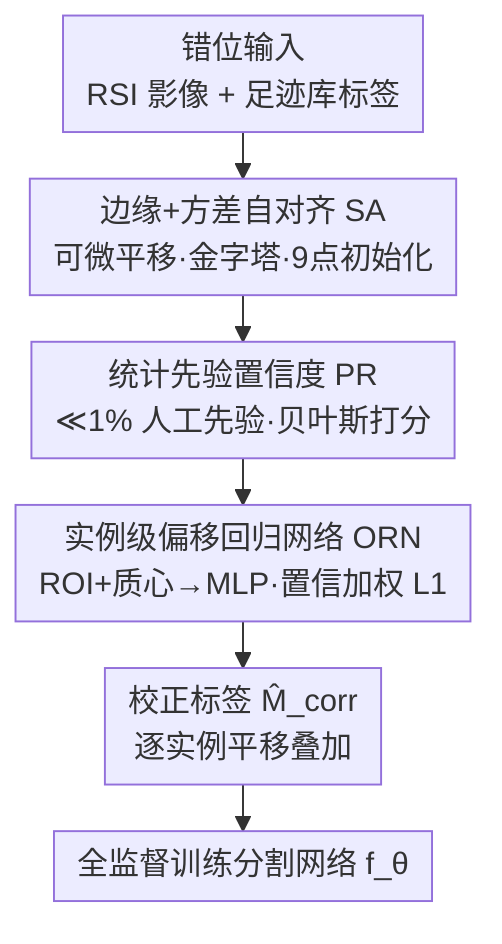

# Revisiting the Necessity of Full Accuracy: Weakly Supervised Object-Level Offset Correction for Misaligned Building Labels

**会议**: CVPR 2026  
**论文**: [CVF Open Access](https://openaccess.thecvf.com/content/CVPR2026/html/Xu_Revisiting_the_Necessity_of_Full_Accuracy_Weakly_Supervised_Object-Level_Offset_CVPR_2026_paper.html)  
**代码**: https://github.com/dayunyan/OMAF-Building-Alignment  
**领域**: 遥感 / 语义分割  
**关键词**: 建筑物提取, 标签错位校正, 弱监督, 实例级偏移, 域适应

## 一句话总结
针对 Google Earth 图像缺乏正射校正导致的建筑物足迹标签与屋顶位置错位问题，本文提出 OMAF 框架：先用边缘+方差约束的可微自对齐估出实例级偏移，再用极少量人工先验做贝叶斯置信度筛选，最后训练一个偏移回归网络把噪声伪标签蒸馏成干净的校正标签，使各类分割模型的 mIoU 最高提升 40.6%。

## 研究背景与动机
**领域现状**：高分辨率遥感图像的建筑物语义分割是城市规划、灾害响应的基础任务。一种廉价扩充训练数据的范式是直接把 Google Earth 的 RGB 影像与公开足迹库（如 Google Open Buildings、Microsoft Global ML Building Footprints）配对当作标注，尤其适合公开标注稀缺的欠发达地区。

**现有痛点**：免费的 Google Earth 影像没有 RPC 元数据和高精度 DSM，无法做严格正射校正，于是足迹库里的建筑物轮廓与影像中屋顶位置之间天然存在 2D 平移错位（论文图 2 归纳了位置偏移、形状不匹配、虚假新增三类，其中正射缺失导致的位置偏移最普遍）。直接拿这种错位的 $(I, M_{raw})$ 去训分割模型，会强迫模型学到错误的空间关联，在密集建筑区尤其严重地拉低性能。

**核心矛盾**：要么依赖**模拟偏移**（往真值上人为加位移噪声）做监督学习——但合成数据天然难泛化到真实影像；要么用**模板匹配 + 互相关**做局部网格搜索——但性能严重依赖模板设计，边缘类模板只对规则纹理建筑有效，复杂城区要逐类手工设计模板，劳动量大。本质上现有方法要么需要人工构造精确参考标签，要么假设数据集里大部分标签本就无偏，这些假设在任意时空条件下的真实地理数据上都站不住。

**本文目标**：在**几乎不增加人工标注**的前提下，从原始错位的足迹标签里生成高质量、空间对齐的校正标签，再用它去训练任意分割模型。

**切入角度**：作者的关键观察有两点——(1) 正确对齐时，足迹标签的边界应当贴合图像中屋顶轮廓的强边缘；(2) 同一屋顶区域内的像素纹理/颜色一致、强度方差低。把对齐变成一个可被梯度优化的目标函数，就能逐实例自动搜偏移，而不靠手工模板。

**核心 idea**："对齐 → 筛信 → 回归蒸馏"三段式：用可微自对齐把对齐做成优化问题，用极少先验（≪1%）给每个估计打置信分，再用一个回归网络把高置信样本的知识泛化到全集，最终输出干净标签。题目"Revisiting the Necessity of Full Accuracy"正是在说——不必追求逐像素全精度标注，弱监督的对象级偏移校正就足够把分割救回来。

## 方法详解

### 整体框架
OMAF（Object-based Multi-stage Alignment Framework）把"修标签"拆成两阶段：阶段一估出每个实例 $i$ 的最优偏移向量 $\hat{v}_i$，生成校正标签集 $\hat{M}_{corr}=\bigcup_i \mathcal{T}_{\hat{v}_i}(M_{raw}^i)$；阶段二用校正后的干净对 $(I,\hat{M}_{corr})$ 去全监督训练最终分割模型 $f_\theta$。其中阶段一又串联三个模块：**自对齐（SA）** 先用边缘+方差损失逐实例搜出粗偏移，**置信度估计（PR）** 用统计先验给每个偏移打分、压掉离谱估计，**偏移回归网络（ORN）** 把带置信权重的伪标签蒸馏成一个能泛化的回归器，对全集重新推理出平滑的偏移。

错位被建模为实例级 2D 平移：对实例 $i$ 存在未知偏移 $v_i=(dx_i,dy_i)$，校正掩码 $M^i(x,y)=M_{raw}^i(x-dx_i, y-dy_i)$（旋转、缩放在此场景可忽略）。

### 关键设计

**1. 边缘+方差约束的可微自对齐（SA）：把"对齐"变成一个能梯度下降的优化问题**

这一步直接回应"模板匹配靠手工设计、网格搜索不可微"的痛点。作者为每个实例定义对齐总损失 $\mathcal{L}_{align}(v)=\lambda_{edge}\mathcal{L}_{edge}(v)+\lambda_{var}\mathcal{L}_{var}(v)+\lambda_{reg}\mathcal{L}_{reg}(v)$，三项分别对应三个先验：边缘项 $\mathcal{L}_{edge}$ 让平移后掩码边界 $\partial M_v$ 贴近图像强边缘——用一张距离变换图（DT map）$D_E$ 记录每个像素到最近边缘的距离，损失即边界像素到最近边缘的平均距离 $\frac{1}{|\partial M_v|}\sum_{(x,y)\in\partial M_v} D_E(x,y)$；方差项 $\mathcal{L}_{var}=\sum_{c\in\{R,G,B\}}\text{Var}(I_c(M_v))$ 鼓励掩码内区域同质（屋顶内部纹理一致）；正则项 $\mathcal{L}_{reg}=\|v\|_2^2$ 抑制过大偏移。

难点在于平移算子 $\mathcal{T}_v$ 涉及非整数坐标采样、本身不可微。作者用可微采样破解：构造基础坐标网格 $G$，新采样网格 $G'=G-v$，再对 $M_{raw}$ 做双线性插值采样 $M_v=\text{Sample}_{bilinear}(M_{raw}, G-v)$，于是 $\nabla_v\mathcal{L}_{align}$ 可算、$v$ 可迭代更新。为应对遥感影像非凸的损失曲面，再叠两道保险：**粗到细金字塔**用递减 $\sigma_k$ 的高斯核构造图像金字塔 $\{I_k\}$（$K=3$ 层）并在各层算 DT 图；**鲁棒初始化**借鉴非极大抑制思想，从 9 点集 $\{0,\pm d\}^2$ 各跑一遍完整优化得到 9 个局部解，取对齐损失最小者 $\hat{v}^*=\arg\min_{j}\mathcal{L}_{align}(\hat{v}_j)$ 作为最终估计——城区重复结构带来大量局部极小，单点初始化极易陷进去，这是它必须做的。

**2. 统计先验驱动的置信度估计（PR）：用≪1%人工标注给每个偏移打"可信分"**

SA 对大多数实例够准，但有两类典型失败：收敛到结构相似但错误的位置、方向对但幅度过大。若直接拿去训练会严重误导后续。作者用一个极小代价的统计先验来识别这些坏估计：人工标注一小批代表性样本（占全集 ≪1%）拿到真值偏移，用滑动窗口匹配算法把原始足迹和人工标注配对（局部匹配能把漏标/虚假足迹的误差限制在窗内、防止扩散），从匹配出的真值偏移集 $\{v_{gt}\}$ 拟合一个 2D 高斯先验 $p(v)=\mathcal{N}(v\,|\,\mu_p,\Sigma_p)$。

然后在贝叶斯框架下评估任一 SA 估计 $\hat{v}^*$ 的可信度：后验 $\propto$ 似然 $\times$ 先验，作者假设似然均匀（所有候选偏移先验上等可能），于是实例级置信度直接简化为先验密度 $c_i=p(\hat{v}_i^*)=\mathcal{N}(\hat{v}_i^*\,|\,\mu_p,\Sigma_p)$。直观说就是：一个偏移若落在"人工先验认为合理"的偏移分布中心附近就高分，统计上离谱（如幅度异常大）就低分，从而在下游自动降权。这一步只单独提升约 1.16% mIoU，但它真正的价值是为下一步回归网络提供干净的加权监督。

**3. 实例级偏移回归网络（ORN）：把噪声伪标签蒸馏成可泛化的平滑偏移**

为什么不直接把 $\{(\hat{v}_i^*, c_i)\}$ 当软像素标签喂分割网络？因为低置信样本会破坏边界约束、导致边缘模糊。作者改为训练一个网络**直接回归实例级偏移**，绕开像素级标签预测的边缘模糊。架构上用 DeepLabV3+（ResNet-D-101 主干）抽多尺度特征图 $F$，对实例 $i$ 的包围盒 $B_i$ 做 ROI 池化得固定长特征 $f_{roi_i}$，再拼上归一化质心坐标 $p_i=(x_c/W, y_c/H)$ 作为相对空间上下文，送入 MLP 回归头得 $\hat{v}_{pred,i}=\text{MLP}([f_{roi_i}, p_i])$。

训练用**置信度加权 L1 损失** $\mathcal{L}_{regress}=\frac{1}{\sum c_i}\sum_i c_i\cdot\|\hat{v}_{pred,i}-\hat{v}_i^*\|_1$：用 PR 给的 $c_i$ 加权，让网络聚焦高置信估计、自动忽略低质量伪标签。这一步是整个框架增益最大的环节（+5.00% mIoU），因为它既抑制了 PR 标出的低置信错误，又靠网络的泛化能力把对的偏移规律推广到全集。质心特征 $p_i$ 是额外的小补丁，专门救质心偏移较大的建筑（+0.82%）。训完后对全训练集推理得 $\{\hat{v}_{pred,i}\}$，按 $\hat{M}_{corr}=\bigcup_i\mathcal{T}_{\hat{v}_{pred,i}}(M_{raw}^i)$ 生成最终校正标签，再去标准全监督训练分割模型。

### 损失函数 / 训练策略
ORN 用 AdamW + 余弦退火训 1000 iter，输入随机 512×512 crop、置信阈值 0.7 过滤；为保留系统性几何偏差的方向学习，**显式禁用旋转/翻转增强**。最终分割网络则正常加随机缩放（0.5–2.0）、旋转、翻转，AdamW 训 2000 iter。实验在两张 A800 上完成。

## 实验关键数据

数据集为两个自建集 Islahiye（24.7 km²、5825 栋建筑，标签来自 Microsoft Global ML Building Footprints）与 Antakya（35.8 km²、7279 栋，标签来自 BRIGHT），影像 0.5m 分辨率、来自 Google Earth Pro、均缺正射校正。切成 1024×1024 patch、过滤建筑像素 <100 的块后得 592 / 130 个有效 patch，按 9:0.5:0.5 划分，测试集人工精标作可靠真值。指标用 mIoU、AUC、F1。

### 主实验（错位标签 $M_{raw}$ vs OMAF 校正标签 $\hat{M}_{corr}$，mIoU %）

跨 CNN / Transformer / Mamba 三大架构，校正标签一致大幅提升分割性能：

| 分割模型 | 架构 | Islahiye mIoU | Antakya mIoU | 最大提升 |
|--------|------|------|------|------|
| Deeplabv3plus | CNN | 57.8 → 75.7 | 53.9 → 66.0 | +17.9 |
| UNetFormer | Transformer | 35.8 → 76.4 | 45.0 → 68.2 | **+40.6** |
| SegFormer-B | Transformer | 58.1 → 77.3 | 54.8 → 67.7 | +19.2 |
| FeedFormer-B | Transformer | 58.0 → 74.3 | 51.9 → 65.6 | +16.3 |
| VWFormer-B | Transformer | 59.0 → 75.8 | 55.4 → 67.2 | +16.8 |
| VMamba-B | Mamba | 58.0 → 76.3 | 57.3 → 68.5 | +18.3 |
| SegMAN-B | Mamba | 57.5 → 75.6 | 56.7 → 67.8 | +18.1 |

UNetFormer 在 Islahiye 上原本只有 35.8 mIoU（对错位最敏感），校正后飙到 76.4，体现 OMAF 对错位敏感模型救济最强。

### 消融实验（Islahiye，逐步叠加组件，mIoU %）

| 配置 | mIoU | 增量 | 说明 |
|------|------|------|------|
| 原始错位标签 $M_{raw}$ | 57.12 | — | 基线 |
| + SA | 66.34 | +9.22 | 仅边缘+方差自对齐 |
| + PR | 67.50 | +1.16 | 加置信度加权稳定预测 |
| + ORN (w/o $p_i$) | 72.50 | +5.00 | 回归网络泛化、压低置信错误 |
| + ORN (w/ $p_i$) | 73.32 | +0.82 | 加质心特征救大偏移建筑 |

### 关键发现
- **SA 与 ORN 是两大主力**：SA 单独就把错位标签从 57.12 拉到 66.34（+9.22），ORN 再贡献最大单步增益 +5.00；PR 直接增益小（+1.16）但为 ORN 提供干净加权监督，是"放大器"而非"主力"。
- **质心特征 $p_i$ 增益有限但定向有效**：仅 +0.82%，因为数据集里多数建筑质心偏移很小；但对质心偏移较大的建筑，校正精度明显改善（论文图 4 (f)→(g)）。
- **对错位越敏感的模型救济越大**：UNetFormer 提升达 +40.6 mIoU，远高于本就鲁棒的 Deeplabv3plus（+17.9），说明错位标签对不同架构的伤害不均，而 OMAF 能普惠地补齐。

## 亮点与洞察
- **把"对齐"重写成可微优化**：用距离变换图 + 双线性可微采样把不可微的整数平移变成可梯度下降的目标，比模板匹配的网格搜索更通用、不依赖手工模板设计——这套"DT 边缘项 + 区域方差项"的对齐损失可迁移到任何"掩码该贴边缘+内部同质"的配准任务。
- **极小先验撬动全集**：用 ≪1% 人工标注拟合一个 2D 高斯偏移先验，再以贝叶斯后验当置信分自动筛伪标签，是"弱监督修标签"里很经济的杠杆设计。
- **回归而非像素软标签**：作者明确指出直接用低置信软像素标签会糊边缘，转而回归实例级标量偏移，既保边界又靠网络泛化补全——这个"别把噪声标签当软标签、改成回归一个紧凑量"的思路对其他噪声标注场景有启发。
- **题眼"不必全精度"**：核心主张是对象级弱监督偏移校正足以救回分割，质疑了"必须逐像素精标"的默认前提。

## 局限与展望
- **错位被简化为纯 2D 平移**：作者显式假设旋转和缩放可忽略（故训练禁用旋转/翻转增强），但在地形起伏大、视角倾斜严重的区域，错位未必是纯平移，⚠️ 这一假设的适用边界论文未充分量化。
- **形状不匹配/虚假新增两类误差未正面解决**：论文图 2 列了三类错位，但方法主要针对最普遍的位置偏移（场景 a），对时相差异引起的 (b)(c) 两类（建筑增删、形状变化）依赖 PR 的置信筛选间接缓解，没有专门机制。
- **只在两个自建小数据集上验证**：Islahiye/Antakya 均为同一地震灾区、同源 Google Earth Pro 影像，跨传感器、跨地理风格的泛化性还需更多验证。
- **仍需少量人工先验**：虽 ≪1%，但置信度估计依赖人工标注的偏移分布质量；先验代表性不足时（如建筑风格差异大）可能误判置信度。

## 相关工作与启发
- **vs 模拟偏移监督学习** [16,17,55]：他们往真值上加合成位移噪声训练，本文直接在真实错位数据上做无监督/弱监督自对齐，区别在于不依赖合成数据，本文优势是更贴真实分布、劣势是需要少量人工先验稳训练。
- **vs 模板匹配 + 互相关** [52,53]：他们靠局部网格搜索最大化模板与图像块相似度，性能严重依赖模板选择且不可微；本文用可微优化 + 边缘/方差损失，免去逐类手工模板，对复杂城区更通用。
- **vs 学习型校正（MRF / 一致性损失 / 形变场）** [42,17,55,3]：这些方法要么需手工构造精确参考标签、要么假设大部分标签无偏；本文用置信度估计显式识别并降权坏估计，弱化了"多数标签无偏"的强假设。

## 评分
- 新颖性: ⭐⭐⭐⭐ 把标签对齐重写成可微优化 + 极小先验贝叶斯置信筛选 + 回归蒸馏的组合在遥感弱监督修标签里很务实新颖。
- 实验充分度: ⭐⭐⭐⭐ 跨 CNN/Transformer/Mamba 七个模型一致提升、消融清晰，但仅两个同源小数据集，跨域验证偏弱。
- 写作质量: ⭐⭐⭐⭐ 问题建模、三模块动机与公式交代清楚，图 3 pipeline 直观。
- 价值: ⭐⭐⭐⭐ 为大规模廉价遥感数据集构建与域适应提供了低成本可落地方案，mIoU 最高 +40.6 实用价值明确。

<!-- RELATED:START -->

## 相关论文

- [\[NeurIPS 2025\] Semi-Supervised Regression with Heteroscedastic Pseudo-Labels](../../NeurIPS2025/others/semi-supervised_regression_with_heteroscedastic_pseudo-labels.md)
- [\[CVPR 2026\] 3D-Object Perception Transformer (3PT)](3d-object_perception_transformer_3pt.md)
- [\[CVPR 2026\] Debiased Sample Selection for Learning with Noisy Labels](debiased_sample_selection_for_learning_with_noisy_labels.md)
- [\[ICCV 2025\] Revisiting Image Fusion for Multi-Illuminant White-Balance Correction](../../ICCV2025/others/revisiting_image_fusion_for_multi-illuminant_white-balance_correction.md)
- [\[CVPR 2026\] Revisiting F-measure Optimization in Multi-Label Classification: A Sampling-based Approach](revisiting_f-measure_optimization_in_multi-label_classification_a_sampling-based.md)

<!-- RELATED:END -->
