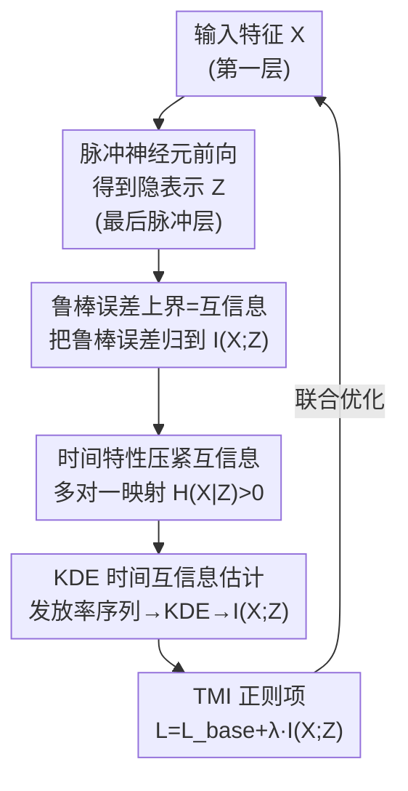

# Robust Spiking Neural Networks by Temporal Mutual Information

**会议**: CVPR 2026  
**论文**: [CVF Open Access](https://openaccess.thecvf.com/content/CVPR2026/html/Xu_Robust_Spiking_Neural_Networks_by_Temporal_Mutual_Information_CVPR_2026_paper.html)  
**代码**: https://github.com/zju-bmilab/SNN_TMI_code  
**领域**: 脉冲神经网络 / 对抗鲁棒性  
**关键词**: 脉冲神经网络, 对抗鲁棒性, 互信息, 信息瓶颈, 时间特性

## 一句话总结
本文从信息论角度证明深度网络的鲁棒误差上界由「输入与隐表示之间的互信息」决定，并指出 SNN 独有的时间特性（累积发放 + 脉冲时序依赖）天然让这一互信息更小，据此提出沿时间维度直接最小化互信息的 TMI 正则项，在 CIFAR/ImageNet 等多个数据集和多种攻击下稳定提升 SNN 的内在鲁棒性。

## 研究背景与动机

**领域现状**：脉冲神经网络（SNN）因事件驱动、低功耗的时间动力学而受关注，但随着部署增多，它在对抗扰动下的鲁棒性成为重要问题。现有提升 SNN 鲁棒性的工作分两路：一路照搬 ANN 的空间特征手段（对抗训练 AT、输入扰动、权重正则），另一路利用 SNN 的时间动力学（频域编码、基于时序的梯度计算）。

**现有痛点**：第一路把 SNN 当成静态网络，完全忽略其时间特性，效果受限；而且对抗训练依赖外部对抗样本、不提供内在鲁棒性，换一种攻击就可能失效。第二路虽然建模了时间信息，却几乎没人去回答**为什么、以及在多大程度上**时间特性会影响鲁棒性——缺一个能解释「时间特性 → 鲁棒性」的理论桥梁。

**核心矛盾**：鲁棒性的根因到底落在哪个量上没人说清。如果只看空间特征，在推理阶段网络是确定性的一一映射，给定隐表示 $Z$ 就能反推输入 $X$，条件熵 $H(X|Z)=0$，互信息被算得偏大且松，无法刻画鲁棒性。

**本文目标**：(1) 把模型鲁棒误差和某个可优化的量建立严格联系；(2) 证明 SNN 的时间特性能让这个量天然更优；(3) 给出可落地的估计与正则方法。

**切入角度**：作者借信息瓶颈（IB）原理，把网络看作马尔可夫链 $X\to Z\to Y$，用 Shamir 等人的泛化误差界，把「鲁棒误差」转写成关于互信息 $I(X;Z)$ 的上界——互信息越紧（越小），鲁棒误差界越紧。再观察到 SNN 的脉冲发放是**多对一**映射，给定脉冲无法唯一恢复膜电位，于是 $H(X|Z)>0$，互信息天然比空间特征更小。

**核心 idea**：用「沿时间维直接最小化输入与隐表示的互信息」代替「照搬 ANN 的空间防御」，把 SNN 时间特性带来的紧互信息这一内在优势显式地用作鲁棒性正则。

## 方法详解

### 整体框架
方法的目标是给 SNN 训练加一个**时间维互信息正则项**，让网络在不依赖对抗样本的前提下获得内在鲁棒性。整条链路是：先在理论上把鲁棒误差界归结到 $I(X;Z)$；再论证 SNN 的时间特性让 $I(X;Z)$ 天然更紧；最后在工程上把第一层输入特征 $X$ 与最后一个脉冲神经元层的隐表示 $Z$ 各自压成一维「脉冲发放率序列」，用核密度估计（KDE）拟合连续分布并算出 $I(X;Z)$，把它加进常规分类损失一起优化。

整体可以分为「理论侧（为什么该最小化 $I(X;Z)$）」和「实现侧（怎么估计并最小化）」两段。实现侧是一条清晰的前向 pipeline：

### 关键设计

**1. 鲁棒误差上界 = 输入-隐表示互信息：给鲁棒性找一个可优化的「锚」**

第一路对抗训练的问题是治标不治本——它靠外部对抗样本硬记，换攻击就废，本质上没刻画出鲁棒性由什么决定。作者把网络看成信息流 $X\to Z\to Y$，并对对抗样本 $X+\epsilon$ 引入对应的隐表示 $Z+\epsilon'$，注意到鲁棒模型里 $Z+\epsilon'$ 相对 $Z$ 只是多了冗余噪声，信息流可写成 $X+\epsilon \to Z+\epsilon' \to Z \to Y$。推理阶段参数固定、给定 $Z$ 时 $Y$ 无不确定性，故 $\hat H(Y|Z)=\hat H(Y|Z+\epsilon')=0$，于是 $\hat I(Z+\epsilon';Y)=\hat I(Z;Y)$。代入 Shamir 等人的泛化误差界，鲁棒误差被界定为：

$$|I(Z;Y)-\hat I(Z+\epsilon';Y)| \le C\big(c_1\log(m)\sqrt{|Z|}\,I(X;Z) + c_2|Z|^{3/4}I(X;Z)^{1/4} + c_3\hat I(X;Z)\big)$$

这把抽象的「鲁棒误差」变成了一个**单调依赖 $I(X;Z)$** 的上界：$I(X;Z)$ 越小，界越紧，模型内在越鲁棒。这一步是全文的理论地基，让「最小化互信息」成为有依据的优化目标，而不是经验技巧。⚠️ 界中各常数 $c_1,c_2,c_3,C$ 的具体形式以原文为准。

**2. 时间特性让互信息天然更紧：多对一映射使 $H(X|Z)>0$**

要让上界更紧就得让 $I(X;Z)=H(X)-H(X|Z)$ 更小；$X$ 给定时 $H(X)$ 固定，关键看条件熵 $H(X|Z)$ 是否大。作者对比了两种特征。**空间特征**下，ANN 推理是确定性一一映射 $Z_S=\sigma(WX_S+b)$，给定 $Z_S$ 可唯一反推 $X_S$，所以 $H(X_S|Z_S)=0$，互信息偏大且松。**时间特性**下，SNN 的脉冲传递是**多对一**，原因有二：其一是**累积发放机制**——膜电位累积到阈值才发一个脉冲，给定脉冲 $Z$ 无法恢复具体膜电位（图中 $X_1$、$X_2$ 不同却映到同一脉冲），故 $H(X|Z)>0$；其二是**脉冲间时序依赖**——当前时刻脉冲 $z_t$ 受当前及之前所有输入 $x_i\,(i\le t)$ 影响，已知 $z_t$ 也定不出 $x_t$，不确定性持续存在。两点合起来给出 $H(X|Z)>H(X_S|Z_S)=0$，从而 $I(X;Z)<I(X_S;Z_S)$。这正是 SNN 比 ANN 更适合做这类内在鲁棒正则的根本原因：时间维本身就是一个免费的信息压缩器。

**3. KDE 时间互信息估计：把脉冲序列变成可微的连续分布**

直接在 SNN 上算互信息有两个坑：已有的直方图分桶法（AIMIE）忽略脉冲间的连续信息，且 SNN 为省算力时间步 $T$ 很小，几个直方图桶根本给不出有判别力的分布。作者改用**发放率序列 + 核密度估计（KDE）**。先把时间特性沿通道维求平均（$\hat X_{input}=\frac{1}{C_i}\sum_j x_i[:,j,:,:]$）、再沿高宽维求平均，得到一维发放率序列 $X\in\mathbb{R}^T$（隐表示 $Z$ 同理）——通道平均一方面去掉空间噪声，另一方面比直接 max-pooling 保留更多连续信息。然后对长度为 $T$ 的序列用高斯核 KDE 估计概率密度，例如 $\text{PDF}_X=\frac{1}{T}\sum_{i=1}^{T}\exp\!\big(-\frac{(x_i-\hat b_{x_j})^2}{2\sigma^2}\big)$，进而得到边缘与联合分布，按 $I(X;Z)=\sum_{i}\sum_{j}p(\hat b_{x_i},\hat b_{z_j})\log\frac{p(\hat b_{x_i},\hat b_{z_j})}{p(\hat b_{x_i})p(\hat b_{z_j})}$ 计算互信息。KDE 比直方图更平滑、收敛更快，在小 $T$ 下仍能给出可用的连续分布估计。

**4. TMI 正则项与层选择：把互信息当损失加进训练**

有了可微的 $I(X;Z)$，作者把它作为正则项叠到任意常规损失上：

$$L = L_{base}(Y,Y_{target}) + \lambda\, I(X;Z)$$

其中 $L_{base}$ 可以是 SNN 常用的交叉熵，$\lambda$ 为固定缩放系数（实验取 0.05）。一个关键工程选择是「在哪两层之间算 $I$」。由数据处理不等式，浅层 $Z'$ 满足 $I(X;Z)\le I(X;Z')$；若选浅层，过高的 $I(X;Z')$ 反而说明该层提取能力差、会拖累最终特征。因此 TMI 取**第一层输入 $X$** 与**最后一个脉冲神经元层（分类层之前）的隐表示 $Z$** 来算互信息——既覆盖整条信息流，又把正则压在最具代表性的深层表示上。这一设计让正则真正作用在「决定输出的那段表示」上，消融也证明深层 $Z$ 比浅层 $Z'$ 在 PGD/FGSM 上各高约 3%。

### 损失函数 / 训练策略
最终目标即上式 $L=L_{base}+\lambda I(X;Z)$。KDE 中固定带宽 $\sigma=0.4$、在 $[0,255]$ 范围取 256 个均匀 bin，$\lambda=0.05$。该正则可叠加到任意训练范式（STBP、TET、SNN-RAT 等）之上，对各种攻击类型通用，因为它增强的是「内在鲁棒性」而非针对某一种对抗样本。

## 实验关键数据

数据集：CIFAR-10/100、DVS-CIFAR10、Tiny-ImageNet、ImageNet；网络：VGG11、AlexNet、VGGSNN；攻击：FGSM、PGD、BIM、RGA（SNN 专用）、AutoAttack、高斯噪声（白盒 $\epsilon=4/255$，部分 $8/255$）。

### 主实验（CIFAR-100，VGGSNN/AlexNet，PGD/FGSM 攻击下测试精度 %）

| 网络 | 方法 | Natural | FGSM | PGD | 说明 |
|------|------|---------|------|-----|------|
| VGGSNN | STBP | 68.11 | 13.51 | 2.05 | 基线 |
| VGGSNN | STBP-H（输出熵） | 68.62 | 12.14 | 1.69 | 替代正则 |
| VGGSNN | STBP-AIMIE（直方图 MI） | 67.98 | 12.54 | 1.47 | 替代正则 |
| VGGSNN | **STBP-TMI（本文）** | 68.12 | **15.20** | **2.45** | FGSM +1.7%，PGD +0.4% |
| VGGSNN | TET | 72.66 | 15.19 | 2.25 | 基线 |
| VGGSNN | **TET-TMI（本文）** | 72.32 | **17.29** | **4.63** | PGD 翻倍 |
| AlexNet | STBP | 66.33 | 13.11 | 2.40 | 基线 |
| AlexNet | **STBP-TMI（本文）** | 66.44 | **15.20** | **5.02** | PGD 大幅提升 |

TMI 在几乎不损 Natural 精度的前提下，对各种攻击稳定提点，且优于输出熵正则（-H）和直方图互信息（-AIMIE）。叠加到 SOTA 鲁棒方法上也有效：CIFAR-100/VGG11、FGSM 下 SNN-RAT 把鲁棒精度从 vanilla 的 4.30% 提到 25.86%，再加 TMI 进一步到 **27.32%**。

### 消融实验（CIFAR-100，FGSM/PGD）

| 配置 | FGSM | PGD | 说明 |
|------|------|-----|------|
| TMI（通道平均 + 深层 $Z$） | **25.80** | **4.36** | 完整方法 |
| max-pooling 替代平均 | 12.23 | — | 通道维改 max-pool，掉一半 |
| 浅层 $Z'$ 替代深层 $Z$ | ~22.8 | ~1.4 | 比深层各低约 3% |

另有 TASA（时间平均脉冲活跃度）分析（Table 2，CIFAR-10/AlexNet/PGD）：不加 TMI 时 AlexNet 各层的原始图与对抗图的 TASA 差异逐层放大，第 5 层达 0.1661；加 TMI 后第 5 层降到 **0.0802**，说明模型对原始/对抗图学到了更相似的时间特征。

### 关键发现
- **通道平均比 max-pooling 关键得多**：max-pool 把离散脉冲硬压成单值、丢失连续信息，FGSM 鲁棒精度从 25.80% 暴跌到 12.23%；连续化（平均 + KDE）是 TMI 有效的前提。
- **深层 $Z$ 优于浅层 $Z'$**：互信息越小越能准确表征「输入信息被提取的程度」，把正则压在分类层前的深层表示上比浅层各高约 3%。
- **时间特性才是鲁棒性的有效刻画量**：用 SNN 空间特征算的互信息（MINE）与鲁棒性无稳定单调关系，而时间特性互信息呈现「互信息越高越脆弱」的清晰趋势——这也是「为什么要沿时间维做正则」的实证支撑。

## 亮点与洞察
- **把「鲁棒性」翻译成「互信息」再翻译成「时间特性」**：两级归约（鲁棒误差界 ← $I(X;Z)$ ← SNN 多对一映射）让一个原本经验化的目标变得可优化、可解释，这是全文最漂亮的地方。
- **SNN 的「缺点」被用成了优点**：脉冲发放不可逆、膜电位不可恢复，本来被视为信息丢失，这里恰恰提供了 $H(X|Z)>0$ 的免费压缩，成为内在鲁棒性的来源。
- **KDE 代替直方图估计互信息**这一 trick 可迁移到任何「小样本/短序列下估计分布」的场景，比直方图更平滑、收敛更快。
- **正则即插即用**：TMI 不依赖对抗样本、可叠加到 STBP/TET/SNN-RAT 上，作为内在鲁棒性增强器，比对抗训练更通用。

## 局限与展望
- 绝对鲁棒精度仍偏低：CIFAR-100/PGD 下即便最好也只有个位数（如 4–5%），TMI 是「相对提升」而非把鲁棒性做到可用水平。
- 理论界依赖一系列假设（IB 马尔可夫链、推理期确定性、$\hat H(Y|Z)=0$ 等），且常数项较多；界的紧致程度与实际增益之间的定量关系未充分量化。⚠️ 部分推导细节以原文为准。
- 互信息只在「第一层 ↔ 最后脉冲层」之间算，是否对所有架构都是最优层选择、对很深网络是否仍稳健，文中未充分展开。
- 改进方向：把 TMI 与对抗训练显式结合、或扩展到多层互信息约束；在神经形态硬件上验证其能耗-鲁棒性权衡。

## 相关工作与启发
- **vs 对抗训练（AT / HIRE-SNN / SNN-RAT / MPPD）**：它们靠外部对抗样本提鲁棒、不提供内在鲁棒性且易被换攻击攻破；TMI 从信息论出发增强内在鲁棒性、不依赖对抗样本，还能叠加到 SNN-RAT 上再提点。
- **vs 时间动力学方法（FEEL-SNN 频域编码 / 时序梯度正则）**：它们改进了时间信息建模，但没回答「时间特性为何影响鲁棒性」；本文给出 $H(X|Z)>0$ 的理论解释并据此设计正则。
- **vs ANN 的 MINE 互信息估计**：MINE 靠 batch 采样近似空间特征互信息，会破坏单图特异性、且与 SNN 鲁棒性无稳定关系；TMI 在时间维用 KDE 估计，CIFAR-100/FGSM 上带来 ~1.69% 提升而 MINE 仅 ~0.43%。
- **vs 直方图互信息（AIMIE）**：直方图忽略脉冲间连续信息、小 $T$ 下分桶失效；KDE 给出更平滑、收敛更快的连续分布估计，鲁棒性更优。

## 评分
- 新颖性: ⭐⭐⭐⭐⭐ 把鲁棒误差界归约到时间维互信息，并指出 SNN 多对一映射天然压紧互信息，视角新且自洽。
- 实验充分度: ⭐⭐⭐⭐ 覆盖 5 个数据集、3 种网络、多种攻击，含 TASA 与互信息-鲁棒性趋势分析；但绝对鲁棒精度低、部分结果放在附录。
- 写作质量: ⭐⭐⭐⭐ 理论推导清晰、动机层层递进；常数项偏多、个别符号需对照原文。
- 价值: ⭐⭐⭐⭐ 为 SNN 鲁棒性提供了可解释的理论框架与即插即用正则，对神经形态/低功耗鲁棒部署有参考价值。

<!-- RELATED:START -->

## 相关论文

- [\[CVPR 2026\] On the Role of Temporal Granularity in the Robustness of Spiking Neural Networks](on_the_role_of_temporal_granularity_in_the_robustness_of_spiking_neural_networks.md)
- [\[CVPR 2026\] Temporal Interaction in Spiking Transformers with Multi-Delay Mixer](temporal_interaction_in_spiking_transformers_with_multi-delay_mixer.md)
- [\[CVPR 2026\] Temporal Representation Enhancement (TRE): Learning to Forget Dominant Patterns for Enhanced Temporal Spiking Features](temporal_representation_enhancement_tre_learning_to_forget_dominant_patterns_for.md)
- [\[ICML 2026\] Bullet Trains: Parallelizing Training of Temporally Precise Spiking Neural Networks](../../ICML2026/others/bullet_trains_parallelizing_training_of_temporally_precise_spiking_neural_networ.md)
- [\[AAAI 2026\] TDSNNs: Competitive Topographic Deep Spiking Neural Networks for Visual Cortex Modeling](../../AAAI2026/others/tdsnns_competitive_topographic_deep_spiking_neural_networks_for_visual_cortex_mo.md)

<!-- RELATED:END -->
