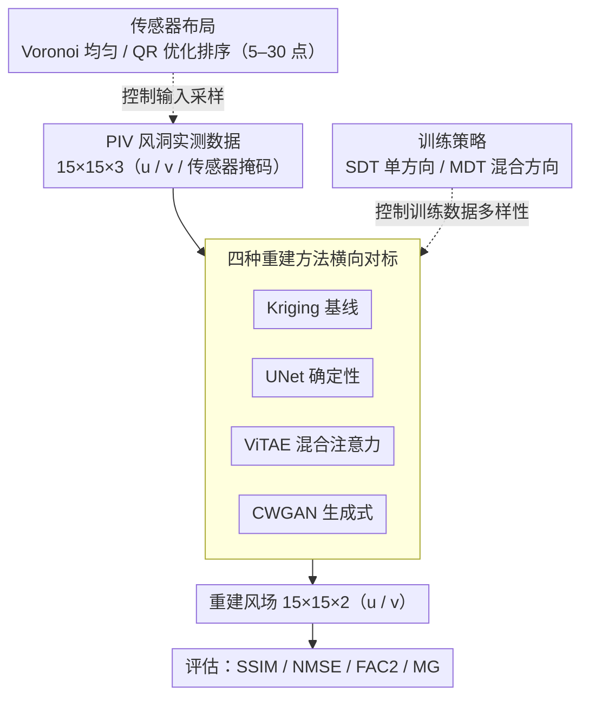

# Rooftop Wind Field Reconstruction Using Sparse Sensors: From Deterministic to Generative Learning Methods

**会议**: CVPR 2026  
**arXiv**: [2603.13077](https://arxiv.org/abs/2603.13077)  
**代码**: [github.com/Yng314/windreconstruction](https://github.com/Yng314/windreconstruction)  
**领域**: 其他 / 流体重建  
**关键词**: 风场重建, 稀疏传感器, UNet, ViTAE, CWGAN, PIV实验数据, 传感器优化

## 一句话总结

建立基于PIV风洞实验数据的学习-观测框架，系统比较Kriging插值与三种深度学习模型（UNet/ViTAE/CWGAN）在5–30个稀疏传感器下的屋顶风场重建能力，揭示混合风向训练（MDT）下深度学习一致优于Kriging（SSIM提升18–34%），并通过QR分解优化传感器布局提升系统鲁棒性达27.8%。

## 研究背景与动机

**领域现状**：屋顶空间承载无人机/UAM起降、太阳能板、HVAC等日益增长的功能，实时全场风信息对安全运营至关重要。然而屋顶流场高度复杂——受建筑几何效应影响，呈现分离流、锥形涡旋和跨方向变异性。传统CFD计算成本高且缺乏实时能力，实际传感器部署又极其稀疏。

**现有痛点**：
- 现有研究普遍依赖CFD模拟数据训练，不捕获真实测量噪声和湍流特性→模型在真实部署时可能失效
- 大多数研究仅单一网络架构评估，缺乏不同DL方法的系统性对比
- 方向特定训练（仅在单一风向上训练测试）限制了跨方向泛化能力
- 传感器布局多采用均匀网格，缺乏数据驱动的优化

**本文切入角度**：首次使用真实PIV风洞实验数据，系统比较传统Kriging与三种代表性DL架构（确定性UNet、混合ViTAE、生成式CWGAN），在两种训练策略（单方向SDT/混合方向MDT）、六种传感器密度（5–30）、传感器位置扰动和QR优化布局等多维度进行全面基准测试。

## 方法详解

### 整体框架

PIV风洞实验数据（15×15网格，u/v两个速度分量）→ 稀疏传感器采样（Voronoi均匀布局或QR优化布局）→ 四种重建方法 → SSIM/NMSE/FAC2/MG四个评估指标。输入维度为15×15×3（u速度、v速度、传感器掩码），输出为15×15×2（重建的u/v速度场）。

实验数据来自东京大学工业科学研究所的边界层风洞，测试对象为1:200缩尺矩形建筑模型（高宽长比1:1:2），在0°、22.5°和45°三个来流风向下，使用PIV获取屋顶平面（z/H=1.05）的瞬时速度场，时间分辨率0.001s，空间分辨率0.035H。每次8秒采集产生7999个时间快照。

整个工作不是单条 pipeline，而是一个把三个实验维度叠在同一台架上的基准框架：以 PIV 实测场为输入，主轴是**四种重建方法横向对标**（贡献最核心、放在最上），两条实验变量——**训练策略**（SDT/MDT）控制模型见过多少种流态、**传感器布局**（Voronoi/QR）控制输入怎么采样——分别从两侧汇入主轴，最后统一用 SSIM/NMSE/FAC2/MG 四个指标在重建场上评估。

### 关键设计

**1. 四种重建方法横向对标：用同一套数据逼问"确定性、混合注意力、生成对抗谁更适合稀疏风场"**

这篇论文的主体不是提新模型，而是把三种建模哲学放进同一个 PIV 实验台架里硬碰硬，再加一个传统地统计基线。Kriging 作为基线，用高斯变差函数（相关长度 0.5–10.0 网格单元）配零 nugget 强制精确插值，本质是假设风场空间平稳、相邻点高度相关，传感器越稀就越吃这个假设。UNet（472K 参数 / 0.03 GFLOPs）是确定性路线，编码器-解码器加跳跃连接做端到端映射，三层下采样（16→8→4→2）、滤波器 32 递增到 128 通道、1×1 卷积出场。ViTAE（467K 参数 / 0.02 GFLOPs）走 Transformer+CNN 混合：把 15×15 场按 3×3 patch 切成 25 个 patch、线性投影到 64 维，过 8 层（8 头注意力）Transformer 编码器后再用 CNN 解码器恢复空间分辨率，指望注意力捕捉远距离涡旋关联。CWGAN（8.77M 参数 / 1.3 GFLOPs）是生成式路线，生成器仍是 UNet 骨架（64→128→256 通道），判别器用步进卷积加 LeakyReLU、去掉 sigmoid 以适配 Wasserstein 距离。四条线参数量从几十万到近千万、推理代价相差一个量级，恰好让"精度-成本"的取舍暴露在同一坐标系里。

**2. SDT vs MDT：把"训练数据的风向多样性"单独拎出来当变量**

稀疏重建里最容易被忽视的不是网络结构，而是训练数据见过多少种流态。论文为此设计了两种正交的训练策略。SDT（单方向训练）只用 0° 风向的三次实验训练，再去 22.5° 和 45° 上测跨方向泛化——这是大多数旧研究的默认做法。MDT（混合方向训练）则每个风向各取一次实验 $\mathcal{D}_{0°}^{(1)}, \mathcal{D}_{22.5°}^{(1)}, \mathcal{D}_{45°}^{(1)}$ 混合训练，剩下的独立实验留作测试。关键在划分方式：按"独立实验实现"切分而非随机快照采样，不同实现之间没有时间连续性，从根上堵住了同一段时序泄漏进训练集又混进测试集的捷径。这一对照直接回答了"DL 到底强在哪"——后面会看到，DL 相对 Kriging 的全部优势几乎都建立在 MDT 之上。

**3. QR 分解选传感器：把"装在哪几个点"从均匀网格变成数据驱动的最优排序**

传感器只有 5–30 个，装在哪里比装多少更影响重建。论文不再用 Voronoi 均匀布点，而是借 POD+QR 给每个候选位置排个信息量座次。先对训练风场堆成数据矩阵 $\mathbf{Y} \in \mathbb{R}^{N \times 450}$（450 = 15×15×2 个 u/v 自由度），中心化后 SVD 取出 POD 模式，保留前 $r=40$ 个（覆盖 84.6% 总能量）构成缩减基 $\boldsymbol{\Psi}_r \in \mathbb{R}^{450 \times r}$。再对 $\boldsymbol{\Psi}_r^T$ 做列主元 QR 分解

$$\boldsymbol{\Psi}_r^T \mathbf{P} = \mathbf{Q}\mathbf{R}$$

排列矩阵 $\mathbf{P}$ 的列顺序就是传感器的重要性排名——QR 的列主元贪心地每步挑出让剩余基向量最线性独立的那一行，等价于最大化测量矩阵 $\mathbf{H}\boldsymbol{\Psi}_r$ 的条件，从而保证选中的少数传感器对主导流结构提供尽可能不冗余的观测。

### 损失函数 / 训练策略

- UNet/ViTAE：MSE损失，Adam优化器，自适应学习率衰减+早停（patience=20），80-20训练/验证划分
- CWGAN：Wasserstein距离 + L1重建损失（权重比1:100），5次判别器更新/1次生成器更新，Adam优化器（lr=0.0001）+早停

## 实验关键数据

### 主实验：MDT下各方法在不同传感器密度的性能

| 传感器数 | 方法 | SSIM↑ | FAC2↑ | 推理时间(ms) |
|:---:|------|:---:|:---:|:---:|
| 5 | Kriging | 0.415 | — | ~1.493 |
| 5 | UNet | 0.531 | — | ~0.109 |
| 5 | CWGAN | **0.550** | — | ~0.164 |
| 20 | UNet | ~0.78 | >0.80 | ~0.109 |
| 20 | CWGAN | **~0.80** | >0.80 | ~0.164 |
| 30 | Kriging | ~0.78 | ~0.778 | ~1.493 |
| 30 | UNet | ~0.82 | ~0.808 | ~0.109 |
| 30 | CWGAN | **~0.85** | ~0.811 | ~0.164 |

MDT下DL vs Kriging：SSIM +18.2~33.5%，FAC2 +3.5~24.2%，NMSE -10.2~27.8%。

### 计算效率与鲁棒性对比

| 模型 | 参数量 | GFLOPs | 大小(MB) | 扰动SSIM下降 | QR优化提升 |
|------|:---:|:---:|:---:|:---:|:---:|
| UNet | 471,586 | 0.0285 | 1.80 | 6.5–14.8% | -0.7%(SDT)/+0.4%(MDT) |
| ViTAE | 467,491 | 0.0210 | 1.78 | 6.7–16.8% | +2.6%/+4.8% |
| CWGAN | 8,770,000 | 1.301 | 33.46 | **3.3–8.2%** | +6.5%/+1.8% |
| Kriging | — | — | — | 5.4–13.9% | +4.1%/+7.9% |

### 关键发现

- **SDT下Kriging反超DL**：仅5个传感器+单方向训练时，Kriging SSIM=0.502远优于DL的0.194–0.237（差距52–61%）→极稀疏+无多样性训练时空间相关假设更有效
- **MDT是DL的关键转折**：切换到MDT后DL在5传感器下SSIM提升131–146%，而Kriging因空间平稳假设被多方向流场违反而退化
- **20传感器是性能交叉点**：SDT下DL在此密度开始在NMSE上全面超越Kriging
- **CWGAN的"确定性化"**：100:1的L1权重使CWGAN实际行为趋近确定性映射，多次采样结果几乎无差异
- **0°风向最难重建**：边界-中心差异最大，速度类别不平衡，是MDT中Kriging退化的主因
- **QR优化在MDT下效果更显著**：90%正向改善 vs SDT的60%

## 亮点与洞察

- **首个使用真实PIV数据的系统性DL风场重建基准**——摆脱了CFD模拟数据偏差，直接面向真实部署条件
- SDT vs MDT的对比清晰揭示了训练数据多样性对DL方法的决定性影响——这一结论对其他流场重建任务同样适用
- QR传感器优化将POD降维与信息论结合，在数据驱动的传感器布置上提供了理论有保证的方法
- 不同方法的适用场景总结具有实用指导价值：单方向少传感器→Kriging；多方向多传感器→UNet（平衡稳定）；追求最高精度→CWGAN（计算代价高）；资源受限→ViTAE

## 局限与展望

- 仅2D平面风场（15×15网格），限于z/H=1.05单一高度，3D结构缺失
- 仅三个风向角（0°/22.5°/45°），超出此范围的泛化需要额外实验数据或迁移学习
- CWGAN参数量（8.77M）为UNet的18.6倍但SSIM仅提升5–9%，效率比偏低
- 单一孤立矩形建筑，未验证复杂建筑群布局的适用性
- 每个快照独立重建，未利用时序动态信息进行多步预测

## 相关工作与启发

- **vs 传统POD-LSE方法**：线性降维方法在非线性湍流特征面前表现受限→DL在中高传感器密度下优势明显
- **vs CFD数据训练的研究**：CFD系统偏差（湍流闭合模型、离散化误差）可能导致训练-部署域差距，PIV实验数据直接消除这一问题
- **启发**：稀疏→稠密重建的框架可推广到气象、海洋、室内环境等流场监测；QR传感器优化与压缩感知理论有联系

## 评分

⭐⭐⭐⭐ (4/5)

综合评价：方法层面无新架构创新，但实验设计极为全面（4方法×2策略×6传感器配置×扰动分析×QR优化×时序平均策略），在真实PIV数据上的系统性基准测试对建筑环境工程有高实用价值。代码开源，可复现性好。

<!-- RELATED:START -->

## 相关论文

- [\[CVPR 2026\] POLISH'ing the Sky: Wide-Field and High-Dynamic Range Interferometric Image Reconstruction](polishing_the_sky_widefield_and_highdynamic_range.md)
- [\[CVPR 2026\] SimRecon: SimReady Compositional Scene Reconstruction from Real Videos](simrecon_simready_compositional_scene_reconstruction_from_real_videos.md)
- [\[CVPR 2026\] ZO-SAM: Zero-Order Sharpness-Aware Minimization for Efficient Sparse Training](zo-sam_zero-order_sharpness-aware_minimization_for_efficient_sparse_training.md)
- [\[CVPR 2026\] TeamHOI: Learning a Unified Policy for Cooperative Human-Object Interactions with Any Team Size](teamhoi_learning_a_unified_policy_for_cooperative_human-object_interactions_with.md)
- [\[CVPR 2026\] Rethinking SNN Online Training and Deployment: Gradient-Coherent Learning via Hybrid-Driven LIF Model](rethinking_snn_online_training_and_deployment_grad.md)

<!-- RELATED:END -->
