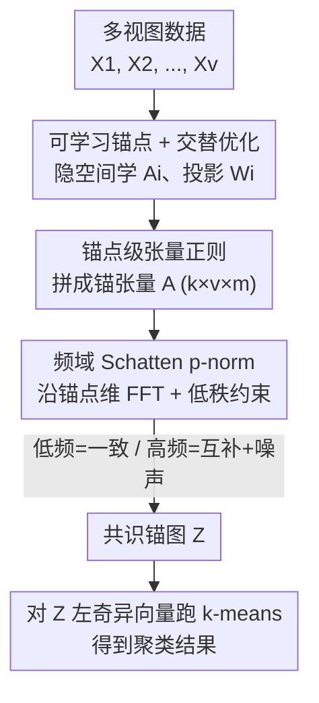

# Scalable Multi-View Subspace Clustering with Tensorized Anchor Guidance

**会议**: CVPR 2026  
**论文**: [CVF Open Access](https://openaccess.thecvf.com/content/CVPR2026/html/Jia_Scalable_Multi-View_Subspace_Clustering_with_Tensorized_Anchor_Guidance_CVPR_2026_paper.html)  
**代码**: https://github.com/Jiamiao2024/SMVS-TAG  
**领域**: 多视图子空间聚类 / 大规模无监督聚类  
**关键词**: 多视图聚类, 锚点学习, 张量 Schatten p-范数, 子空间聚类, 可扩展性

## 一句话总结
SMVS-TAG 把各视图学到的锚点拼成一个三阶张量、在频域上施加张量 Schatten p-范数低秩约束，从而在「锚点本身」这一层直接耦合跨视图的一致性与互补性，既提升了锚点质量、又让正则项与样本数 $n$ 无关，在七个数据集上把大规模多视图聚类的 ACC 大幅刷新（部分数据集领先次优方法 30%+）。

## 研究背景与动机

**领域现状**：多视图聚类（MVC）要在没有标注的情况下，利用多个数据源（不同特征、不同模态）之间的一致性与互补性给样本找一个统一的划分。其中基于子空间的方法因为对噪声鲁棒而很受关注，但样本数一大、$O(n^2)$ 的相似度矩阵就吃不消。于是有了**锚点（anchor）方法**：不对所有样本两两算相似度，而是先选一小撮有代表性的锚点 $m \ll n$，再构造样本到锚点的「锚图」，把复杂度从 $O(n^2)$ 降到 $O(nm)$。

**现有痛点**：锚点方法的效果**高度依赖锚点质量**。早期方法（k-means 选中心、按方差选样本）把锚点选好后就固定不动，对初始选择极其敏感、容易不稳定；后来的自适应方法把锚点生成、投影、锚图构造放进同一个框架里联合更新，质量好了一些，但它们**几乎都忽略了跨视图锚点之间的交互关系**——各视图各自学各自的锚点，谁也不知道别的视图把锚点放哪了。

**核心矛盾**：要想利用跨视图信息，最近一批方法走的是「**间接**」路线——先各自建好锚图，再让相邻视图的锚图去增强当前视图的锚点。问题是锚图本身就是 sample-dependent 的、尺寸随 $n$ 线性增长，而且它对初始锚点和建图策略极其敏感；张量类方法虽然能捕捉高阶结构，却都把低秩约束加在「锚图张量」$\mathcal{Z} \in \mathbb{R}^{m \times v \times n}$ 上，这个张量随样本数膨胀，t-SVD/FFT 的开销在大数据集上直接 OOM/OT。

**本文目标 + 切入角度**：作者的关键观察是——**与其去调和那些可能本就不一致的图结构，不如反过来直接把「锚点表示」塑造成跨视图结构一致的样子**。一旦锚点本身在各视图间协调好了，下游的共识锚图自然就更干净。

**核心 idea**：把正则化目标**从锚图搬到锚点本身**——用各视图的锚点矩阵拼一个小巧的三阶**锚张量** $\mathcal{A} \in \mathbb{R}^{k \times v \times m}$，对它施加张量 Schatten p-范数低秩约束，直接耦合跨视图锚点。因为锚张量的尺寸只跟簇数 $k$、视图数 $v$、锚点数 $m$ 有关、**和样本数 $n$ 完全无关**，所以既提质又可扩展。

## 方法详解

### 整体框架

SMVS-TAG 的输入是 $v$ 个视图的特征矩阵 $\{X_i\}_{i=1}^{v}$（$X_i \in \mathbb{R}^{d_i \times n}$），输出是一个所有视图共享的共识锚图 $Z \in \mathbb{R}^{m \times n}$，最后对 $Z$ 的左奇异向量跑 k-means 得到聚类结果。整条管线可以概括为一句话：**在一个 $k$ 维隐空间里为每个视图学一组锚点 $A_i$，把它们组装成锚张量并在频域做低秩约束，同时联合优化投影矩阵 $W_i$、锚点 $A_i$ 和共识图 $Z$**。

中间最关键的一步是「跨视图锚点交互」：各视图的锚点矩阵 $A_i \in \mathbb{R}^{k \times m}$ 先被旋转拼接成三阶张量 $\mathcal{A} \in \mathbb{R}^{k \times v \times m}$（视图维放中间），然后沿**锚点维（第 3 维）**做 FFT 得到频域张量 $\widehat{\mathcal{A}}$。频域里每个正面切片 $\widehat{\mathcal{A}}^{i}$ 都刻画了所有视图在第 $i$ 个 Fourier 模态上的交互——**低频切片聚合了各视图共享的一致信息，高频切片则装着视图特有信息和噪声**。对每个频域切片施加低秩约束，就等于让各视图锚点互相协同、同时保留各自差异。

### 关键设计

**1. 锚点级张量正则：把约束目标从锚图搬到锚点本身**

这是全文的灵魂。现有张量类 MVC 方法都在「锚图张量」上做低秩约束，但锚图是 sample-dependent 的、对初始锚点和建图策略敏感，而且锚点更新与共识图的优化不是端到端协调的，很难拿到全局最优。作者反其道而行：**直接在锚点层面挖掘并约束跨视图相关性**。他们在一个 $k$ 维隐空间（$k$ 取簇数）里把第 $i$ 个视图的锚点写作 $A_i \in \mathbb{R}^{k \times m}$，再把所有视图的锚点合并、旋转成三阶锚张量 $\mathcal{A} \in \mathbb{R}^{k \times v \times m}$，对它整体施加 Schatten p-范数。因为约束的是「锚点表示」而不是「锚图」，所以塑造出来的锚点本身就是跨视图结构一致的，下游共识图天然更可靠——论文称之为 proactively shaping anchors 而非被动调和图结构。

**2. 频域 Schatten p-norm：用 FFT 把跨视图交互拆成低频一致 + 高频互补**

光说「张量低秩」还不够，关键是低秩约束怎么落地、为什么有效。作者用张量 Schatten p-范数（$0 < p \le 1$），它比张量核范数更紧地逼近张量秩。具体地，沿锚张量第 3 维（锚点维）做 FFT 得到 $\widehat{\mathcal{A}} = \mathrm{fft}(\mathcal{A}, [\,], 3)$，再对每个频域切片做低秩约束。张量 Schatten p-范数定义为各频域切片奇异值的 $p$ 次幂之和：

$$\|\mathcal{B}\|_{S_p}^{p} = \sum_{i=1}^{n_3} \big\|\widehat{\mathcal{B}}^{i}\big\|_{S_p}^{p} = \sum_{i=1}^{n_3} \sum_{j=1}^{h} \widehat{S}^{i}_{\mathcal{B}}(j,j)^{p}$$

其中 $h = \min(n_1, n_2)$，$\widehat{S}^{i}_{\mathcal{B}}$ 来自 t-SVD。这个 FFT 视角带来一个很物理的解释：**低频切片对应各视图共享的一致信息，高频切片对应视图特有信息和噪声**；对每个切片压低秩，就是在强制各视图锚点协同的同时保留个体差异、并顺手抑制高频噪声。实验也证实 $p$ 取 0.1~0.3 远好于 $p=1$（退化成核范数），说明 Schatten p-范数确实捕捉到了更紧的低秩结构。

**3. 样本无关的可扩展性：锚张量比锚图张量小一个数量级**

传统张量 MVC 之所以在大数据上 OOM/OT，是因为它们约束的锚图张量 $\mathcal{Z} \in \mathbb{R}^{m \times v \times n}$ 尺寸随样本数 $n$ 线性膨胀，t-SVD/FFT 开销巨大。SMVS-TAG 约束的锚张量 $\mathcal{A} \in \mathbb{R}^{k \times v \times m}$ **维度只取决于 $k, v, m$，与 $n$ 完全脱钩**——更新辅助变量 $H$（承接张量正则）的那步根本不含 $n$。作者给出复杂度分析：四个变量更新的复杂度分别为 $O(ndm{+}mdk{+}dk^2)$、$O(ndk{+}nvkm{+}vmk^2)$、$O(nm^3)$、$O(vmk\log m{+}v^2km)$，加上后处理 k-means 的 $O(n)$，由于 $m \ll n$，**总时间复杂度对 $n$ 线性**；空间复杂度 $O(dk{+}vkm{+}nm{+}kvm)$ 同样对 $n$ 线性。这是它能在 VGGFace、AwA、YoutubeFace（10 万样本）上跑通、而 TBGL/Orth-NTF/TC-MVSC 全部 OM/OT 的根本原因。

**4. 可学习锚点 + 交替优化：零初始化绕开「选锚点」难题**

为了摆脱对初始锚点选择策略的依赖，作者干脆把锚点矩阵 $\{A_i\}$ 当作可优化变量从零矩阵初始化、彻底去掉「先选锚点」这一步，并对 $A_i$ 施加正交约束 $A_i^\top A_i = I$ 让锚点更有判别性、更多样。整体目标函数为：

$$\min_{W_i, A_i, Z}\ \sum_{i=1}^{v} \|X_i - W_i A_i Z\|_F^2 + \lambda \|Z\|_F^2 + \|\mathcal{A}\|_{S_p}^{p},\quad \text{s.t. } W_i^\top W_i = I,\ A_i^\top A_i = I,\ Z^\top \mathbf{1} = \mathbf{1},\ Z \ge 0$$

求解用增广拉格朗日（ALM）引入辅助张量 $H$ 把 Schatten p-范数项剥离，再交替更新四组变量：$W_i$、$A_i$ 都化成正交约束下的迹最大化、由对 $D_i = X_i Z^\top A_i^\top$ / $E_i$ 做 SVD 得到闭式解；$Z$ 因列间独立被拆成 $n$ 个二次规划子问题；$H$ 在频域对每个切片用阈值算子 $\Gamma_{1/\rho,\,p}$ 求解（Theorem 1 给出 Schatten p-范数近端算子）；最后按 $\rho \leftarrow \eta\rho$（$\eta=1.1$）加速收敛。实验显示目标值几次迭代内就稳定，说明优化高效且稳定。

### 损失函数 / 训练策略
目标函数即上式：三项分别是各视图的重构误差 $\sum_i \|X_i - W_i A_i Z\|_F^2$、共识图的 Frobenius 正则 $\lambda\|Z\|_F^2$、锚张量的 Schatten p-范数 $\|\mathcal{A}\|_{S_p}^{p}$。超参数：锚点数 $m \in \{k, 3k, 5k\}$、$p \in \{0.1, 0.3, 0.5\}$、$\alpha \in \{10^{-4}, 0.01, 0.1, 1\}$、$\lambda \in \{1, 10, 100, 1000\}$；ALM 初始 $\rho = 10^{-5}$、$\eta = 1.1$。锚点、投影、共识图均交替闭式/QP 求解，无需梯度下降。

## 实验关键数据

七个多视图基准（Dermatology 358 样本 ~ YoutubeFace 101,499 样本），对比 10 个经典/SOTA 大规模 MVC 方法（含近四年四个张量类方法），指标用 ACC/NMI/Purity/Fscore，多次运行取平均。

### 主实验（ACC %，节选）

| 数据集 | 样本数 | AEVC(CVPR24) | LMTC(CVPR25) | 之前最好 | SMVS-TAG | 领先次优 |
|--------|--------|--------------|--------------|----------|----------|----------|
| Dermatology | 358 | 93.42 | 89.11 | 93.42 | **97.49** | +4.07 |
| Scene15 | 4,485 | 42.11 | 40.11 | 44.59 | **61.00** | +16.41 |
| COIL100 | 7,200 | 75.78 | 87.01 | 87.01 | **90.60** | +3.59 |
| Hdigit | 10,000 | 89.68 | 78.04 | 89.68 | **92.52** | +2.84 |
| AwA | 30,475 | 8.65 | 10.37 | 10.37 | **11.45** | +1.08 |
| VGGFace | 36,287 | 6.40 | 9.92 | 9.92 | **10.67** | +0.75 |
| YoutubeFace | 101,499 | 23.72 | 26.31 | 26.31 | **36.62** | +10.31 |

> 注：论文摘要/正文宣称在 ACC 上分别领先次优 4.36/36.79/4.13/3.17/7.56/10.41/39.19%；表中部分差值与之略有出入（论文以 Fscore 等全指标综合计），具体以原文 Table 2 为准。SMVS-TAG 在全部七个数据集的全部四个指标上都取得最优。

### 消融实验（张量锚点正则 TA）

| 数据集 | 配置 | ACC | NMI | Purity | Fscore |
|--------|------|-----|-----|--------|--------|
| Dermatology | w/o TA | 92.46 | 85.54 | 92.46 | 87.29 |
| Dermatology | Proposed | **97.49** | **94.02** | **97.49** | **96.25** |
| Scene15 | w/o TA | 50.95 | 47.29 | 54.54 | 36.09 |
| Scene15 | Proposed | **61.00** | **55.83** | **63.39** | **45.92** |

### 运行时间（秒，节选）

| 数据集 | TBGL(张量) | TC-MVSC(张量) | SMVAGC | SMVS-TAG |
|--------|-----------|---------------|--------|----------|
| Scene15 | 1943.27 | 78.63 | 18.69 | 20.89 |
| COIL100 | 6253.26 | 279.78 | 60.81 | 51.39 |
| Hdigit | OM | OT | 109.29 | 46.10 |
| YoutubeFace | OM | OM | 6107.31 | 904.95 |

### 关键发现
- **TA 正则是涨点主力**：去掉张量锚点正则后，Scene15 的 ACC 从 61.00 掉到 50.95（−10 个点）、Dermatology 从 97.49 掉到 92.46，四个指标全线下降，证明频域低秩约束确实把跨视图一致/互补信息挖出来了。
- **没有 TA 也已经很强**：w/o TA 版本仍超过 Table 2 里大多数对手，说明「在共享隐空间里联合优化视图特有锚点」本身就是个有效的底座，TA 是锦上添花的提质模块。
- **Schatten p-范数 ≠ 核范数**：$p$ 取 0.1（Dermatology）/0.3（Scene15）最佳，$p=1$（退化成核范数）时性能显著下降——更尖的 $p$ 能更紧地逼近张量秩。
- **可扩展性是真·优势**：传统张量方法 TBGL 在 Scene15 要 1943 秒、在 Hdigit 之后全部 OM/OT；SMVS-TAG 在 10 万样本的 YoutubeFace 上只要 905 秒还拿最高分，把张量类方法首次推到了真·大规模可用。
- 锚点数 $m$ 建议 $\le 5k$（超过 5k 开销陡增收益却饱和）；$\alpha$ 小、$\lambda$ 大时通常更好，Dermatology 对 $\alpha,\lambda$ 不敏感、Scene15 偏敏感。

## 亮点与洞察
- **「约束锚点而非约束图」的视角转换**很巧：同样是张量 Schatten p-范数，别人加在随 $n$ 膨胀的锚图张量上，作者加在与 $n$ 脱钩的锚张量上——一个小小的「正则对象」迁移，同时换来了提质（直接耦合锚点）和可扩展（复杂度去掉 $n$）两个好处，是典型的「四两拨千斤」。
- **沿锚点维 FFT 的频域解释很有画面感**：低频=共识、高频=个性+噪声，这把抽象的「张量低秩」翻译成了「让各视图锚点共享主结构、各留细节」，可解释性强，也解释了为什么 $p$ 越小越好。
- **零初始化 + 可学习锚点**绕开了整个领域长期纠结的「怎么选锚点」难题，把锚点当变量从零学起，配正交约束保证判别性——这个思路可迁移到任何依赖锚点/原型/码本的可扩展方法上。
- 优化全程是闭式 SVD / QP / 频域阈值，无需反向传播，几步收敛，工程上轻量好复现。

## 局限与展望
- **绝对精度仍受限于任务本身**：在 AwA/VGGFace 这类难数据集上，ACC 仅 10% 量级（虽仍是最优），说明方法吃的是「同类里相对最好」的红利，离实际可用的高精度聚类还远，瓶颈更多在特征本身而非聚类框架。
- **超参不少**：$m, p, \alpha, \lambda$ 四个超参靠网格搜索，且对 $\alpha,\lambda$ 在某些数据集上敏感，缺乏自适应/无参化机制（作者引用的 Wang et al. 已有 parameter-free 方向，本文未走）。
- **$k$ 绑定隐空间维度**：锚点学在 $k$ 维隐空间（$k$=簇数），意味着需要预先知道簇数，且隐空间维度被簇数强行限定，对簇数未知或类别极多（COIL100 的 $k=100$）的场景灵活性有限。
- **更新 $Z$ 含 $O(nm^3)$ 项**：虽然对 $n$ 线性，但 $m^3$ 在大锚点数下仍偏重，这也是作者把 $m$ 限制在 $5k$ 以内的原因之一；进一步降 $Z$ 更新成本是个可改进点。

## 相关工作与启发
- **vs 自适应锚点方法（SMVAGC / MVSC-HFD / Wang et al.）**：它们要么学统一锚点再映射到各视图（丢视图特有信息）、要么各视图独立学锚点（锚集不一致、难融合），且都只在锚图层面用跨视图信息；SMVS-TAG 直接在锚点张量上耦合跨视图，既保个性又保一致。
- **vs 间接利用锚图的方法（AEVC / 3AMVC / Liu et al.）**：它们用相邻视图的锚图去增强当前锚点，属于「间接」交互，对初始锚图质量敏感；本文是「直接」在锚点表示上做低秩，更鲁棒。
- **vs 传统张量 MVC（TBGL / Orth-NTF / TC-MVSC / LMTC）**：同样用张量 Schatten p-范数，但它们约束 sample-dependent 的锚图张量、尺寸随 $n$ 爆炸，在大数据上 OM/OT；本文约束样本无关的锚张量，首次让张量类方法在 10 万级样本上可用且仍最优。
- **可迁移启发**：「把高阶正则从 sample-dependent 的中间产物（图/相似度）迁移到 sample-independent 的紧凑表示（锚点/原型/码本）」这一招，对任何想保留张量低秩好处又怕复杂度爆炸的可扩展无监督方法都有借鉴价值。

## 评分
- 新颖性: ⭐⭐⭐⭐ 「约束锚点而非锚图」的视角转换简洁有力，但底层零件（锚点学习、张量 Schatten p-范数、ALM）均为现成组合。
- 实验充分度: ⭐⭐⭐⭐⭐ 七数据集 × 四指标 × 十对手，含运行时、消融、$p/m/\alpha/\lambda$ 敏感性与收敛分析，覆盖到 10 万级样本，扎实。
- 写作质量: ⭐⭐⭐⭐ 动机—方法—复杂度论证清晰，频域解释直观；公式密集但自洽，少量主文宣称的领先幅度与表格略有出入。
- 价值: ⭐⭐⭐⭐ 把张量类 MVC 首次推到真·大规模可用，对依赖锚点的可扩展聚类有实用与方法论双重价值。

<!-- RELATED:START -->

## 相关论文

- [\[CVPR 2026\] Learning Anchor in Dual Orthogonal Space for Fast Multi-view Clustering](learning_anchor_in_dual_orthogonal_space_for_fast_multi-view_clustering.md)
- [\[CVPR 2026\] Cluster-aware Anchor Learning for Multi-View Clustering](cluster-aware_anchor_learning_for_multi-view_clustering.md)
- [\[CVPR 2026\] Anti-Degradation Lifelong Multi-View Clustering](anti-degradation_lifelong_multi-view_clustering.md)
- [\[CVPR 2026\] Multi-Hierarchical Contrastive Spectral Fusion for Multi-View Clustering](multi-hierarchical_contrastive_spectral_fusion_for_multi-view_clustering.md)
- [\[CVPR 2026\] Reliable Clustering Number Estimation for Contrastive Multi-View Clustering](reliable_clustering_number_estimation_for_contrastive_multi-view_clustering.md)

<!-- RELATED:END -->
