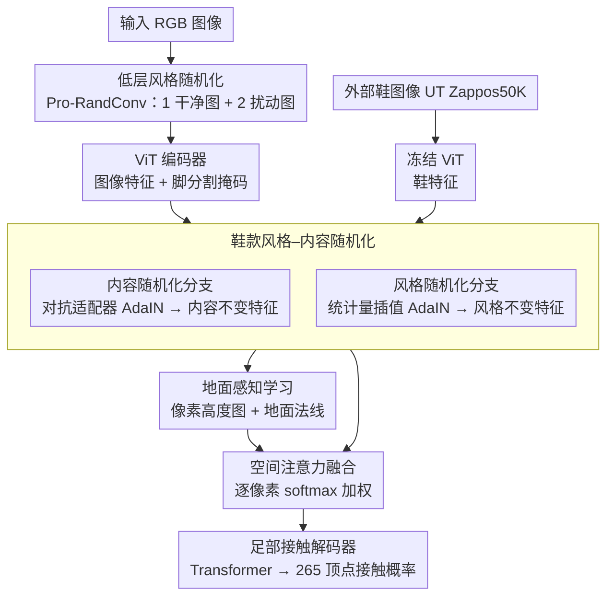

<!-- 由 src/gen_stubs.py 自动生成 -->
# Shoe Style-Invariant and Ground-Aware Learning for Dense Foot Contact Estimation

**会议**: CVPR2026  
**arXiv**: [2511.22184](https://arxiv.org/abs/2511.22184)  
**代码**: [dqj5182/FECO_RELEASE](https://github.com/dqj5182/FECO_RELEASE)  
**领域**: 其他  
**关键词**: 足部接触估计, 鞋款风格不变性, 地面感知学习, 对抗训练, 密集接触预测

## 一句话总结

提出 FECO 框架，通过鞋款风格–内容随机化（对抗训练）和地面感知学习（像素高度图 + 地面法线），从单张 RGB 图像实现鲁棒的密集足部接触估计，在多个基准上显著超越现有方法。

## 研究背景与动机

**足部接触的重要性**：人体运动和平衡从根本上依赖于脚与环境的交互，精确捕捉足部接触区域对理解人体运动动力学和建模真实物理行为至关重要。

**现有方法的局限**：已有工作多将足部接触简化为关节级接触（joint-level），依赖零速度约束等几何启发式，无法捕捉分布在脚底多个精细区域的密集接触模式。

**通用模型精度不足**：尽管存在密集人体接触估计方法（POSA、BSTRO、DECO），它们对足部区域的预测精度仍然较差；专用的身体部位接触模型（如手部 HACO）已被证明优于通用模型。

**鞋款外观多样性挑战**：真实世界中脚通常被鞋覆盖，鞋的颜色、纹理、材质和款式变化极大，模型容易过拟合到训练数据中鞋款与接触模式的虚假关联（如运动鞋→滑板动作）。

**地面信息模糊性**：地面表面（地毯、沥青、地板）纹理往往单调或重复，视觉线索匮乏，而接触本身沿与地面平行方向发生，缺乏显式地面几何推理会导致预测不准。

**遮挡与视角变化**：上述困难还受到遮挡、视角和光照变化的复合影响，凸显了需要捕捉几何和物理上下文而非表面外观的表示学习。

## 方法详解

### 整体框架

这篇论文要从单张 RGB 图像预测脚底密集的接触区域，难点在于脚通常被各式各样的鞋遮挡、地面纹理又往往单调无线索，模型很容易学到「运动鞋→滑板动作」这种虚假关联。FECO 的整体思路是：先用两级随机化把模型对鞋面外观和局部纹理的依赖剥离掉，再额外引入地面几何（高度图 + 法线）补上接触推理最需要的物理上下文，最后用注意力把两路特征融合后交给 Transformer 解码出每个足部顶点的接触概率。训练时每个样本同步喂入一张干净图和两张低层随机化图，五个模块端到端联合优化。

### 关键设计

**1. 低层风格随机化：先抹掉模型对局部纹理统计量的依赖**

接触模式本质是几何/物理的，但模型容易抓住鞋面的颜色、材质等低层纹理当捷径。这里用 Pro-RandConv 在输入端做随机局部纹理扰动：随机采样卷积权重、可变形卷积偏移和仿射参数，经「可变形卷积 → Instance Normalization → 仿射变换 → tanh」对图像施加随机变换。同一张图被扰动成两份风格不同但内容不变的副本一起训练，迫使模型忽略局部纹理统计量、转而依赖更稳定的结构线索。

**2. 鞋款风格–内容随机化：用外部鞋库把「鞋长什么样」和「脚怎么接触」解耦**

低层随机化只能扰动纹理，扰不动整双鞋的款式偏差（运动鞋/靴子/凉鞋天然对应不同动作分布）。这里改用外部鞋图像数据集 UT Zappos50K（50K 图像，含鞋/凉鞋/拖鞋/靴子四类）作为独立风格源（而非在 mini-batch 内采样），先用 ViT 提取鞋特征，再分两条并行路径处理：内容随机化分支用对抗适配器 $\mathbf{A}_{\text{prev}}$、$\mathbf{A}_{\text{after}}$（零初始化 3×3 卷积 + 可学习缩放因子 $\gamma=0.02$）对鞋特征做 AdaIN，把鞋内容保留、注入输入图像的风格统计量，专门用于对抗训练以防预测器过拟合输入风格；风格随机化分支则从均匀分布采样插值权重 $\alpha$，在输入特征与鞋特征的通道统计量之间插值后做 AdaIN，生成鞋款风格不变表示。两条分支一个管「覆盖率」一个管「鲁棒性」，把鞋外观从接触预测里彻底剥离。

**3. 地面感知学习：把接触推理最缺的地面几何显式补回来**

接触发生在与地面平行的方向上，但地面纹理（地毯、沥青、地板）线索匮乏，缺乏显式几何推理就会预测不准。FECO 引入地面特征编码器，输出两路互补的几何信号：像素高度图经 DPT 解码器预测每像素高度、按图像最大边长缩放到像素单位，提供密集几何上下文；地面法线则先用脚分割掩码抑制脚区域特征以防捷径学习，再经全局平均池化 + 两层全连接 + tanh + L2 归一化预测单位长度的地面法线向量，提供全局方向。前者给「密度」、后者给「方向」，共同支撑沿地面方向的接触判断。

**4. 空间注意力融合：让模型自己决定何时信几何、何时信外观**

随机化特征和地面特征性质不同，简单相加会互相干扰。这里把两者沿通道拼接后，经 3×3 卷积降维到 256 通道 → ReLU → Dropout(0.2) → 1×1 卷积，输出两路 softmax 权重，对地面特征与风格不变特征做自适应加权融合，按像素决定两类信息的占比。

**5. 足部接触解码器：把融合特征翻译成密集顶点接触概率**

最后用 Transformer 架构（自注意力 + 交叉注意力），输入接触 token 与图像特征，输出 265 个足部网格顶点的接触 logits，经 sigmoid 得到接触概率，并通过回归器投影到 11 关节和 3 关键点（OpenPose 定义）做多级预测，从而既能输出密集接触又兼容关节级评测。

### 损失函数

$$\mathcal{L} = \mathcal{L}_{\text{main}} + \mathcal{L}_{\text{style}} + \mathcal{L}_{\text{style-adv}} + \mathcal{L}_{\text{mask}} + \mathcal{L}_{\text{ground}}$$

- $\mathcal{L}_{\text{main}}$：主分支多级预测的 BCE 损失
- $\mathcal{L}_{\text{style}}$：风格分支 BCE 损失（梯度仅回传到风格分支解码器）
- $\mathcal{L}_{\text{style-adv}}$：风格分支预测与均匀分布的 BCE（仅训练对抗适配器）
- $\mathcal{L}_{\text{mask}}$：脚分割的 BCE + Dice 损失平均
- $\mathcal{L}_{\text{ground}} = \mathcal{L}_{\text{pixel-height}}(\text{MAE}) + \mathcal{L}_{\text{ground-normal}}(\text{cosine similarity})$

所有损失对干净图像和两张 ProRandConv 增强图像分别计算后取平均。

## 实验

### 数据集与设置

训练使用 10 个数据集（PROX/BEHAVE/InterCap/EgoBody/RICH/MOYO/Hi4D/MMVP/MotionPRO + 自建 COFE），涵盖脚–场景/物体/地面/人体多类交互，共百万级图像。主评估集为 MMVP。ViT-Huge backbone、AdamW(lr=1e-5)、batch=4、单 A6000 训练 10 epochs。

### 主要结果

| 方法 | Precision ↑ | Recall ↑ | F1-Score ↑ |
|------|------------|----------|------------|
| POSA | 0.276 | 0.308 | 0.255 |
| BSTRO | 0.436 | 0.538 | 0.464 |
| DECO | 0.374 | 0.511 | 0.409 |
| **FECO (Ours)** | **0.563** | **0.613** | **0.577** |

FECO 在 MMVP 上 F1 超 BSTRO 11.3%，超 DECO 16.8%。在关节级足部接触估计（COFE 数据集视频序列）上，FECO 作为唯一不使用时序信息的方法，F1=0.515 仍大幅超过 WHAM(0.363) 和 Footskate Reducer(0.301)。

### 消融实验

| 消融项 | F1-Score |
|--------|----------|
| 无低层随机化 | 0.555 |
| +低层随机化 | 0.577 (+4.0%) |
| 无风格/内容随机化 | 0.522 |
| +内容随机化 | 0.531 |
| +风格随机化 | 0.554 |
| +两者结合 | 0.577 (+10.5%) |
| 无地面学习 | 0.506 |
| +地面法线 | 0.527 |
| +像素高度图 | 0.569 |
| +空间注意力 | 0.577 (+14.0%) |

### 关键发现

- **风格–内容随机化互补**：内容随机化提高 recall（覆盖率），风格随机化提高 precision（鲁棒性），两者结合达到最优 F1 平衡。
- **地面几何逐级增益明确**：法线提供全局方向 → 像素高度图提供密集几何上下文 → 空间注意力自适应融合，三步叠加 F1 提升 14%。
- **COFE 数据集有效**：加入 COFE 后 F1 从 0.450 提升到 0.515（+14.4%），野外多样外观和多种足部交互有效补充了 3D mocap 数据。
- **与其他风格泛化技术对比**：鞋款风格–内容随机化(0.577) 显著优于 BIN(0.396)、MixStyle(0.448)、SagNets(0.511)、LatentDR(0.542)。

## 亮点

- 首个专用的密集足部接触估计框架，填补了该领域的空白
- 鞋款风格–内容双分支随机化设计巧妙，利用外部鞋数据集实现风格解耦，思路可迁移到其他存在外观偏差的任务
- 地面感知学习引入像素高度图和地面法线两种互补几何信号，且用脚掩码抑制捷径学习的细节设计值得学习
- 构建了 31K+ 标注的 COFE 数据集并公开，为社区提供了标准化的野外足部接触评测基准
- 单图推理无需时序信息，但在关节级评测中仍超越依赖视频的方法

## 局限性

- 密集接触估计依赖 SMPL-X 足部网格拓扑结构（265 顶点），对非人形足部或极端鞋型的泛化能力未知
- 训练数据绝大部分来自受控 3D mocap 环境，COFE 虽增加了野外样本但规模仍有限（31K）
- 像素高度图和地面法线的 GT 生成依赖已有深度/几何估计工具，可能引入累积偏差
- 仅在 MMVP 和 COFE 上做了定量评测，缺乏更多真实场景（户外/复杂地形）的验证
- ViT-Huge backbone 计算量大，实时应用的可行性存疑

## 相关工作

- **关节级接触**：Footskate Reducer(零速度约束) → HuMoR/PIP/WHAM(学习关节接触用于运动) → Foot Stabilization(SMPL 距离阈值)
- **密集接触**：POSA(cVAE 条件生成) → BSTRO(Transformer 视觉输入) → DECO(野外标注) → HACO(手部专用，本文借鉴其解码器)
- **风格泛化**：BIN(BN/IN 门控) → SagNets(内容/风格双网络对抗) → RandConv(随机卷积) → 本文的鞋款专用风格–内容随机化
- **地面表示**：Pixel Height(阴影生成) → PixHt-Lab/ORG(3D 重建) → 本文将像素高度图扩展到接触估计

## 评分

- 新颖性: ⭐⭐⭐⭐ — 首个专用密集足部接触估计框架，鞋款风格–内容随机化 + 地面感知学习的组合新颖
- 实验充分度: ⭐⭐⭐⭐ — 10 个数据集训练、详尽消融（五组）、多方法&多粒度对比，但测试场景偏受控
- 写作质量: ⭐⭐⭐⭐ — 结构清晰，公式推导完整，图表配合良好
- 价值: ⭐⭐⭐⭐ — 开辟密集足部接触估计新方向，数据集和代码开源，对运动捕捉/VR/机器人步态有应用潜力

<!-- RELATED:START -->

## 相关论文

- [\[NeurIPS 2025\] Learning Dense Hand Contact Estimation from Imbalanced Data](../../NeurIPS2025/others/learning_dense_hand_contact_estimation_from_imbalanced_data.md)
- [\[CVPR 2026\] NaiLIA: Multimodal Nail Design Retrieval Based on Dense Intent Descriptions and Palette Queries](nailia_multimodal_nail_design_retrieval_based_on_dense_intent_descriptions_and_p.md)
- [\[ICML 2026\] Learning Permutation-Invariant Macroscopic Dynamics](../../ICML2026/others/learning_permutation-invariant_macroscopic_dynamics.md)
- [\[ICML 2026\] Continual Learning of Domain-Invariant Representations](../../ICML2026/others/continual_learning_of_domain-invariant_representations.md)
- [\[AAAI 2026\] Spike Imaging Velocimetry: Dense Motion Estimation of Fluids Using Spike Cameras](../../AAAI2026/others/spike_imaging_velocimetry_dense_motion_estimation_of_fluids_using_spike_cameras.md)

<!-- RELATED:END -->
