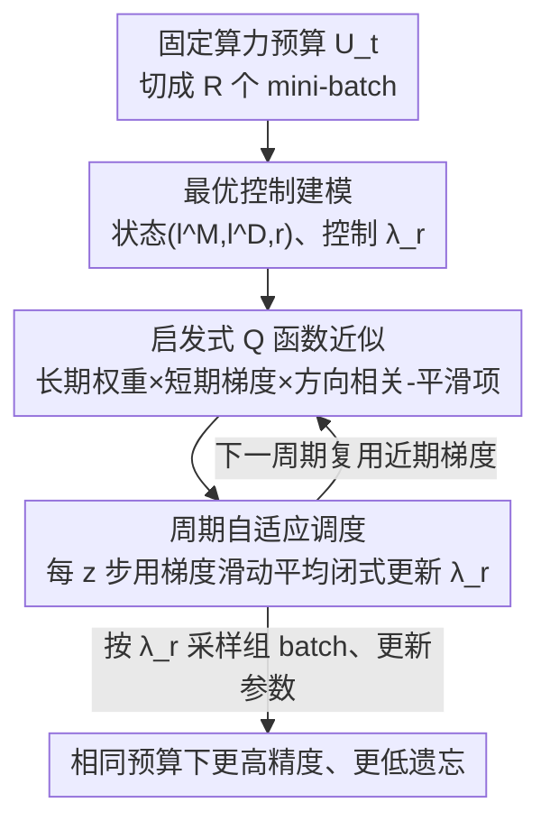

# Smart Replay: Adaptive Scheduling of Memory Rehearsal for Computational Resource-Aware Incremental Learning

**会议**: CVPR 2026  
**论文**: [CVF Open Access](https://openaccess.thecvf.com/content/CVPR2026/html/Chen_Smart_Replay_Adaptive_Scheduling_of_Memory_Rehearsal_for_Computational_Resource-Aware_CVPR_2026_paper.html)  
**代码**: 无  
**领域**: 持续学习 / 增量学习  
**关键词**: 增量学习, 内存回放, 计算预算, 最优控制, 自适应调度

## 一句话总结
本文提出"计算资源感知增量学习（CRIL）"这一新设定，并设计 Smart Replay——把每个 mini-batch 里回放样本占比 $\lambda_r$ 当作可调控制量，用最优控制 + 启发式 Q 函数在固定算力预算下逐步动态调度回放比例，在相同算力下比固定回放比的基线精度更高、遗忘更低。

## 研究背景与动机

**领域现状**：增量学习（IL）要在不全量重训的前提下，从数据流里不断学新知识又不忘旧知识。主流做法分三类——正则化（约束参数更新）、结构扩展（冻结/扩网络）、内存回放（存一小批旧样本反复回放）。其中内存回放因简单通用最常用，做法通常是把旧样本与新样本按**固定比例** $\lambda$ 混进每个 mini-batch，或从二者并集里联合采样。

**现有痛点**：绝大多数 IL 研究只盯着"数据稀缺"，为了压遗忘堆了很重的计算（蒸馏、梯度投影、动态扩展），却忽略了真实场景里更刺眼的约束——**算力/时间预算有限**（模型要每天甚至每小时更新一次）。而且作者发现一个反直觉现象（Fig.1）：在算力受限时，**回放越多并不总是越好**——buffer 大时频繁回放能护旧知识但拖累新任务学习；buffer 小时频繁回放几乎没收益。

**核心矛盾**：新样本和旧（记忆）样本的**学习动态不匹配**。记忆样本之前已被优化过，再训时损失常先升后快速降；新样本则要从零优化。两者的算力需求是异质且随时间变化的。一个固定不变的回放比，必然在有限 epoch 内造成**收敛失衡**（Fig.2）——要么旧任务过拟合、新任务欠拟合，要么反过来。

**本文目标**：把"在固定算力预算下，如何把计算资源在学新任务和回放旧记忆之间动态分配"形式化为一个优化问题，让回放比例随训练状态自适应变化。

**核心 idea**：不再用固定 $\lambda$，而是把**每个 mini-batch 的回放比 $\lambda_r$ 当作一个随时间调度的控制变量**，用最优控制框架求"让新任务损失 + 记忆损失的总下降量最大"的调度序列；再用一个可解析求解的启发式 Q 函数，把这个调度落成"每隔几步根据近期梯度更新一次 $\lambda_r$"的实用算法。

## 方法详解

### 整体框架

Smart Replay 解决的是"固定算力预算 $U_t$ 下，怎么把每个 mini-batch 的回放比 $\lambda_r$ 调到最优"。整体思路是把一个任务阶段的训练过程建模成一个**离散时间动态系统**：状态是当前记忆损失/新任务损失/步数三元组 $(l_r^M, l_r^D, r)$，控制量是回放比 $\lambda_r\in[0,1]$（决定这一批里 $\lambda_r b$ 个记忆样本、$(1-\lambda_r)b$ 个新样本），目标是让整个训练过程的累积损失下降量最大。然后用最优控制（OC）+ Bellman 方程导出每步该取的 $\lambda_r$，再因为"每步算全量梯度不现实"退化成一个**周期性、基于近期 mini-batch 梯度滑动平均**的可解析调度算法。

先把问题设定讲清。给定记忆保留比 $\delta$，阶段 $t$ 可访问样本数为 $N_t = n[1+\delta(t-1)]$；算力预算按系数 $\vartheta$ 增长：$U_t = U_{base}[1+\vartheta(t-1)]$，其中 $U_{base}=q\,e\,n$（$e$ 为单任务训练 epoch 数）。固定预算下总处理样本数 $C\le U/q$，按 batch 大小 $b$ 切成 $R=C/b$ 个 mini-batch，每批产生一次参数更新。$\delta=1,\vartheta=1$ 时退化为全量重训（性能上界），但现实里预算增长往往跟不上样本量膨胀，所以才需要精打细算地分配。

### 关键设计

**1. 最优控制建模：把回放比调度变成"最大化累积损失下降"的序列决策**

直接的痛点是：固定 $\lambda$ 无法适应新/旧样本随时间变化的异质学习动态。本文把训练过程建成离散时间动态系统：第 $r$ 步状态 $(l_r^M, l_r^D, r)$ 按 $\Delta l_r^M = l_r^M - l_{r+1}^M$、$\Delta l_r^D = l_r^D - l_{r+1}^D$ 演化，控制量 $\lambda_r$ 决定 batch 组成。优化目标是让两类损失的总下降最大：

$$\min\,(l_R^M + l_R^D)\;\Leftrightarrow\;\max \sum_{r=0}^{R-1}\big(\Delta\mathcal{L}_r^M(\lambda_r) + \Delta\mathcal{L}_r^D(\lambda_r)\big).$$

在 OC 框架下定义即时奖励 $R = \Delta l_r^M + \Delta l_r^D$，值函数 $V$ 为从当前状态到训练结束能拿到的最大累积损失下降，并满足 Bellman 递归 $V(l_r^M,l_r^D,r)=\max_{\lambda_r}[R + V(l_{r+1}^M,l_{r+1}^D,r+1)]$，括号内即状态-动作值函数 $Q$。最优控制为 $\lambda_r^* = \arg\max_{\lambda_r} Q(l_r^M, l_r^D, r;\lambda_r)$。这一步的价值在于：它把"何时多回放、何时少回放"从拍脑袋的固定/线性启发式，变成了一个有明确数学目标（最大化总损失下降）的最优调度问题，且因为是有限时域、各步等权，所以不引入折扣因子。

**2. 启发式 Q 函数近似：把不可解的值函数拆成"长期权重 × 短期梯度 × 方向相关 − 平滑项"四个可算因子**

值函数 $V$ 表示"从当前到训练结束的最大潜在收益"，无法精确量化。本文抓住"损失通常呈指数衰减"这一规律，启发式地把预测的末期损失写成 $l_r^\Omega e^{\rho_\Omega (r-R)/R}$（$\rho_M,\rho_D>0$ 为记忆/新任务的衰减率），从而把 $Q$ 拆成两个时间相关的指数权重 $w_r^M = e^{\rho_M(r-R)/R}$、$w_r^D = e^{\rho_D(r-R)/R}$ 加权的损失下降，再减一个平滑正则项 $\epsilon(\lambda_r-\lambda_{r-1})^2$ 防止相邻步剧烈抖动。

接着用一阶 Taylor 把损失下降线性化为梯度内积：$\Delta l_r^\Omega \approx \nabla L_r^\Omega \Delta\boldsymbol{\theta}_r$，而参数更新 $\Delta\boldsymbol{\theta}_r = \eta[\lambda_r\nabla L_r^M + (1-\lambda_r)\nabla L_r^D]$。代入整理后，$Q$ 成为关于 $\lambda_r$ 的二次式，含四个关键因子：① 长期权重比 $w_r^M/w_r^D$（任务间的时间自适应加权）；② 短期梯度范数 $\|\nabla L_r^M\|,\|\nabla L_r^D\|$（各任务当下的即时贡献）；③ 梯度方向相关 $\cos\beta$（两任务是协同还是冲突）；④ 平滑正则。二次式天然好解，这是后面能闭式求 $\lambda_r$ 的前提，也让"该多学新任务还是多回放"被这四个有物理含义的量共同决定。

**3. 周期自适应调度：每 z 步用近期梯度滑动平均闭式更新一次 $\lambda_r$**

每步都算全量损失和梯度 $\nabla L_r^M,\nabla L_r^D$ 不现实——实际只有当前 mini-batch 的梯度。本文用滑动平均做鲁棒估计：每 $z$ 步更新一次 $\lambda_r$，区间内估计梯度范数 $\|\widehat{\nabla L_r^\Omega}\| = \frac{1}{z}\sum_{j=r-z}^{r-1}\|\nabla_\theta L(\boldsymbol{\theta}_j; B_j^\Omega)\|$（$\Omega\in\{M,D\}$），类似地用区间内余弦均值估计 $\widehat{\cos\beta}$。对二次 $Q$ 求极值得到闭式更新：

$$\lambda_r = \lambda_{r-1} + \eta\frac{\gamma_r}{2\epsilon}\Big[\tfrac{w_r^M}{w_r^D}\tfrac{\|\widehat{\nabla L_r^M}\|^2}{\|\widehat{\nabla L_r^D}\|^2} + \big(1-\tfrac{w_r^M}{w_r^D}\big)\tfrac{\|\widehat{\nabla L_r^M}\|}{\|\widehat{\nabla L_r^D}\|}\widehat{\cos\beta} - 1\Big],$$

其中长期权重比化简为 $w_r^M/w_r^D = e^{\Delta\rho(r-R)/R}$。把 $\gamma = \gamma_r/(2\epsilon)$ 和 $\Delta\rho = \rho_M - \rho_D$ 当超参：$\gamma$ 控制 $\lambda_r$ 的更新步长，$\Delta\rho$ 刻画记忆/新任务衰减率之差。$\Delta\rho$ 越正越大，意味着记忆样本越容易收敛，模型就在训练早期**调低**回放比、把算力先投给新任务适应；且 $\Delta\rho$ 与记忆比 $\delta$ 相关——buffer 越小（$\delta$ 小）记忆样本拟合越快，需要的 $\Delta\rho$ 越大。初始 $\lambda_0=\tau$。为省算力，只用网络**顶层参数**的梯度来指导 $\lambda_r$ 更新。这套设计的好处是：调度被压成"每 $z$ 步算一次闭式解"的极轻量操作，几乎不增加训练开销，却把固定 $\lambda$ 的失衡问题转成了随状态自适应的"弱→强"回放轨迹。

### 一个完整示例

在 CIFAR-100 / Tiny-ImageNet 的最小预算设定下观察 $\lambda_r$ 的实际轨迹（Fig.4）：训练初期 $\lambda_r$ 较小，主要由长期权重比里的 $\Delta\rho$ 主导——少回放、多给新任务算力以增强可塑性（plasticity）；随着新任务逐渐收敛，$\lambda_r$ 转由梯度驱动逐步升高，加速记忆损失下降以恢复稳定性（stability）；同时随阶段 $t$ 推进，buffer 里样本越来越多，也要求更大的回放比。整体呈现"弱→强"的回放过渡。Rotated-MNIST 上因学习率仅 0.01，同样趋势更平缓。对比固定 $\lambda$：固定比下任务损失降、记忆损失却随 $t$ 升（越来越遗忘），而 Smart Replay 让两类损失收敛到接近的水平（Fig.5 中结果贴近对角线），取得更好的新旧平衡。

## 实验关键数据

数据集：Class-IL 用 CIFAR-100（5 任务）、Tiny-ImageNet（10 任务）；Domain-IL 用 Rotated-MNIST（5 个旋转角度域）。预算三档 $\vartheta\in\{0,0.1,0.2\}$，内存两档：limited（$\delta=0.1$）与 unlimited（$\delta=1$）。骨干为 ResNet-18/34、三层 MLP，base budget $e=20$ epoch，SGD、batch 200。指标为平均精度 $A=\frac{1}{T}\sum_i\frac{1}{i}\sum_j A_{i,j}$（越高越好）。基线含 Union 联合采样、多个固定 $\lambda$、线性启发式 $\lambda\!\uparrow$（0.2→0.8）/ $\lambda\!\downarrow$（0.8→0.2），并把方法套到 ER、iCaRL、MEMO、STAR 四种 IL 方法上。

### 主实验（limited-memory，CIFAR-100 平均精度 %，节选）

| 回放策略 | ER ϑ=0 | iCaRL ϑ=0 | STAR ϑ=0.2 |
|----------|--------|-----------|------------|
| Union | 62.30 | 62.25 | 64.27 |
| λ=0.2（固定） | 61.94 | 62.90 | 65.11 |
| λ=0.3（固定） | 61.89 | 63.38 | 65.35 |
| λ↗（线性升） | 63.84 | 65.16 | 66.25 |
| λ↘（线性降） | 57.91 | 60.28 | 62.60 |
| **Smart（本文）** | **64.58** | **65.43** | **67.27** |

结论：limited 设定下，Smart Replay 在 CIFAR-100 上比最优固定 $\lambda$ 高约 2%；Tiny-ImageNet 上在 $\vartheta=0.1/0.2$ 时提升更明显（最高近 5%，因算力越紧、把有限资源用对越关键）；Rotated-MNIST 较简单、提升温和。unlimited 设定下（样本全可用、多样性更高），Smart Replay 在所有数据集和四种 IL 方法上仍稳定优于固定比基线。线性升 $\lambda\!\uparrow$ 是固定/启发式里最强的，但仍逊于自适应的 Smart。

### 消融实验（Q 函数四因子，平均精度 %）

| 配置 | CIFAR(Lim) | Tiny(Lim) | CIFAR(Unl) | Tiny(Unl) | 说明 |
|------|-----------|-----------|------------|-----------|------|
| Smart（完整） | 64.58 | 42.37 | 74.70 | 53.94 | — |
| w/o Long（$w_r^M/w_r^D=1$） | 61.43 | 41.39 | 74.20 | 52.93 | 去长期权重，limited 下掉点明显（易在记忆样本上过拟合） |
| w/o Short（梯度范数比=1） | 40.20 | 18.32 | 56.55 | 23.54 | 去短期梯度，失去自适应，λ 渐趋 0、严重遗忘 |
| w/o Cosine（$\cos\beta=0$） | 64.03 | 42.02 | 74.27 | 53.23 | 去方向相关，轻微下降 |
| w/o Smooth（去平滑项） | 36.89 | 16.23 | 39.12 | 20.12 | Q 退化为线性、λ 在 0/1 间剧烈震荡，最差 |

### 关键发现

- **平滑项和短期梯度因子最关键**：去掉平滑项 $\lambda_r$ 在 0/1 间硬切换、训练崩到 36.89%；去掉短期梯度比则失去自适应、$\lambda_r$ 渐趋 0 导致遗忘，跌到 40.20%。二者是 Smart Replay 能稳定工作的支柱。
- **长期权重在 limited 设定更重要**：buffer 小时记忆样本易被过拟合，长期权重比能压住早期回放、保护可塑性；w/o Long 在 limited（CIFAR 掉 3.15）比 unlimited（仅掉 0.5）更伤。
- **$\Delta\rho$ 是最敏感、需经验调的超参**：limited 下 $\Delta\rho$ 从 1.0 升到 3.0 持续涨点（用 $\tau=0.2,\Delta\rho=2.0$）；unlimited 下 $\Delta\rho=0.5$ 优于 0 或 1.0（用 $\tau=0.5,\Delta\rho=0.5$）。$\Delta\rho$ 与 buffer 大小强相关，buffer 越小需越大 $\Delta\rho$。$z=50,\gamma=1$ 在各设定下固定通用。

## 亮点与洞察

- **把"回放比例"从固定超参提升为可调度的控制变量**：这是最核心的视角转换——别人在挑"存哪些样本/怎么采样"，本文挑"每一批回放多少"，并用最优控制给它一个有数学目标的动态调度，思路干净且通用（能直接套到 ER/iCaRL/MEMO/STAR 上）。
- **启发式 Q 函数把抽象值函数落成四个有物理含义的可算因子**：长期指数权重（时间自适应）、短期梯度范数（即时贡献）、$\cos\beta$（任务协同/冲突）、平滑项（稳定性），且整体是二次式可闭式求解——既保留最优控制的理论骨架，又能在每 $z$ 步用 mini-batch 梯度滑动平均轻量算出来。
- **"弱→强"回放轨迹很有启发**：早期少回放保新任务可塑性、后期多回放保旧知识稳定性，这条经验性轨迹其实是 stability-plasticity 权衡在时间维度上的自然展开，可迁移到任何需要在"学新 vs 护旧"间动态分配算力的连续/在线学习场景。
- **算力感知（CRIL）设定本身是贡献**：显式把"固定计算预算 $q C_t\le U_t$"写进 IL 优化目标，比传统只关注数据稀缺的 IL 更贴近"每小时更新一次模型"的真实部署。

## 局限与展望

- **$\Delta\rho$ 仍靠经验调**：作者承认选合适的 $\Delta\rho$ 依赖经验调参，虽与 buffer 大小有可解释的关联，但没有自动确定机制。
- **依赖一阶 Taylor 近似与指数衰减假设**：Q 函数把损失下降线性化、并假设损失指数衰减，这些近似在训练动态剧烈或损失非单调时是否仍稳健，正文未充分检验 ⚠️。
- **只用顶层梯度指导调度**：为省算力只取顶层参数梯度估计 $\lambda_r$，可能在深层表征剧烈变化的任务上低估真实梯度信号，本文未消融这一近似的影响 ⚠️。
- **排除了强扩展型框架**：因 DER/TagFex 等强扩展方法算力开销大、与受限设定冲突而被排除，因此 Smart Replay 在那类高算力框架上的增益未知。
- **可改进方向**：把 $\Delta\rho$ 也纳入在线自适应（如随 buffer 状态自动调）、或用更高阶的损失动态模型替代一阶 Taylor，可能进一步减少调参并提升鲁棒性。

## 相关工作与启发

- **vs 固定比/Union 采样**: 传统内存回放要么按固定 $\lambda$ 独立采样、要么从新旧并集联合采样，本文指出二者都无法适应新旧样本随时间变化的异质动态；Smart Replay 在 mini-batch 粒度动态调 $\lambda_r$，相同算力下精度更高、遗忘更低。
- **vs 任务/簇级回放调度 [22,39]**: 已有工作在任务或聚类级别做回放调度，本文把控制粒度推进到**batch 级**，决定每一批回放多少记忆样本，更细更及时。
- **vs reorder 类高效训练（如课程学习 [44]）**: 课程学习按易→难给样本，本文借鉴"动态决定样本何时参与训练"的思路，但落点是 IL 里"新 vs 旧"的算力分配，并用最优控制给出闭式调度，而非启发式排序。
- **vs online IL [26,43,45]**: CRIL 设定类似 online IL 但放松了"每样本只过一次"的严格单遍约束，从而能通过受控回放在性能与效率间取得更好平衡。

## 评分
- 新颖性: ⭐⭐⭐⭐ 把回放比例提升为最优控制下的可调度控制量、并提出算力感知 IL 设定，视角新且通用。
- 实验充分度: ⭐⭐⭐⭐ 覆盖 2 种内存 × 3 档预算 × 4 种 IL 方法 × 3 数据集，消融与超参分析完整；但多在中小数据集、未上大规模。
- 写作质量: ⭐⭐⭐⭐ 从动机到 OC 推导再到闭式算法链条清晰，公式略密但有四因子直观解释。
- 价值: ⭐⭐⭐⭐ 即插即用、几乎零额外开销，对"算力受限要频繁更新"的真实 IL 部署很实用。

<!-- RELATED:START -->

## 相关论文

- [\[CVPR 2026\] DREAM: Document Recognition with Explicit Adaptive Memory](dream_document_recognition_with_explicit_adaptive_memory.md)
- [\[CVPR 2026\] Representation-Steered Incremental Adapter-Tuning for Class-Incremental Learning with Pre-Trained Models](representation-steered_incremental_adapter-tuning_for_class-incremental_learning.md)
- [\[CVPR 2026\] FEAT: Federated Geometry-Aware Correction for Exemplar Replay under Continual Dynamic Heterogeneity](feat_federated_geometry_aware_correction_for_exemplar_replay_under_continual_dynamic_heterogeneity.md)
- [\[CVPR 2026\] Curvature-Aware Zeroth-Order Optimization for Memory-Efficient Test-Time Adaptation](curvature-aware_zeroth-order_optimization_for_memory-efficient_test-time_adaptat.md)
- [\[CVPR 2026\] HAD: Heterogeneity-Aware Distillation for Lifelong Heterogeneous Learning](had_heterogeneity-aware_distillation_for_lifelong_heterogeneous_learning.md)

<!-- RELATED:END -->
