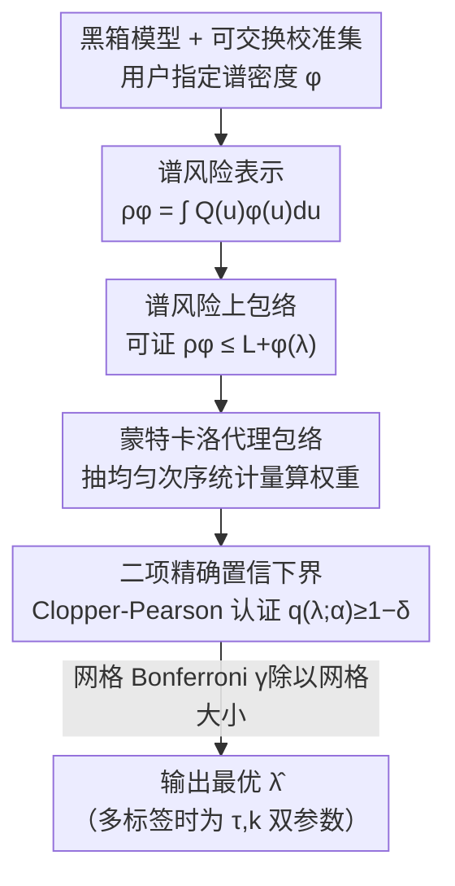

# Spectral Conformal Risk Control: Distribution-Free Tail Guarantees via Bayesian Quadrature

**会议**: CVPR 2026  
**论文**: [CVF Open Access](https://openaccess.thecvf.com/content/CVPR2026/html/Esfeh_Spectral_Conformal_Risk_Control_Distribution-Free_Tail_Guarantees_via_Bayesian_Quadrature_CVPR_2026_paper.html)  
**代码**: https://github.com/MohammadMahdiKazemi/BQ_SRC (将公开)  
**领域**: 保形风险控制 / 不确定性量化 / 安全部署理论  
**关键词**: 保形预测, 谱风险, CVaR, 二项置信下界, 贝叶斯求积

## 一句话总结
本文提出 BQ-SRC，把保形风险控制从「只管平均损失」推广到「管尾部高代价错误」的谱风险（如 CVaR），用贝叶斯求积视角构造分布无关的风险上包络，并用二项精确置信下界替代 DKW 充气把蒙特卡洛保守性砍掉约 3 倍，在合成回归、多标签分类、语义分割等任务上以更小的预测集维持有限样本的尾部风险保证。

## 研究背景与动机
**领域现状**：现代视觉系统（医学影像、自动驾驶、安全监控）部署时，偶发的灾难性错误比平均精度更要命——漏掉一个小肿瘤、把行人错分割、把罕见但关键的标签全部抑制，这些都是「尾部事件」。保形预测（Conformal Prediction, CP）能给出分布无关、有限样本的不确定性保证：split CP 控制 miscoverage 概率，CRC（Conformal Risk Control）把它推广到控制任意有界单调损失的期望 $\mathbb{E}[\ell(Z;\lambda)]$，RCPS 给出风险控制的有限样本保证。最近 BQC 把保形预测放进「贝叶斯求积」的框架里：把测试损失分布看成它的分位函数 $Q_Z$，再用一个均匀积分子去积分。

**现有痛点**：上面这些方法几乎都在控制**均值**——平均 miscoverage、平均损失，等于隐含假设「所有错误代价相同」。但安全攸关的部署恰恰相反：哪怕整体错误率已经很低，从业者真正需要的是「证明罕见、高损失的失败仍然几乎不可能发生」。均值风险方法对此无能为力，没有旋钮去专门收紧尾部。

**核心矛盾**：要的是「尾部敏感」的风险度量（如 CVaR：只看最差那部分损失的平均），但同时还想保住保形预测那种**分布无关 + 有限样本**的硬保证，而且只用对训练好模型的黑箱访问。如何把「谱风险/相干风险」这一族风险厌恶准则塞进保形框架，又不牺牲有效性，是个空白。另外，DKW 式的蒙特卡洛分位数估计对所有阈值一致成立，导致非常保守，预测集被撑大。

**本文目标**：(1) 把 CRC/BQC 推广到任意谱风险（律不变相干风险测度），让从业者用一个谱密度 $\phi$ 就能编码尾部厌恶；(2) 收紧蒙特卡洛保守性，在不削弱有效性的前提下给出更紧的预测集；(3) 对多标签分类提供双参数控制。

**核心 idea**：用一个非递减的谱密度 $\phi$ 替换贝叶斯求积里的均匀积分子，构造可由校准数据计算的「谱风险上包络」；再用一个**精确二项置信下界**（而非 DKW 充气）来认证「上包络不超过目标 $\alpha$」这一事件的高概率成立。

## 方法详解

### 整体框架
BQ-SRC 解决的是：给定一个训练好的黑箱模型、一批可交换的校准数据，要为部署超参数 $\lambda$（如阈值、集合大小）选一个**可证明**满足 $\rho_\phi(\lambda)\le\alpha$ 的值，其中 $\rho_\phi$ 是用户指定的谱风险。整条流水线是：先把谱风险写成「分位函数对谱密度积分」的形式，再用校准损失的次序统计量构造一个**上包络** $L_\phi^+(\lambda)$（可证明 $\rho_\phi(\lambda)\le L_\phi^+(\lambda)$）；由于真实损失 CDF 未知，用蒙特卡洛抽均匀次序统计量得到一个「代理上包络」$\widetilde L_\phi^+(\lambda)$ 的分布；最后对「代理包络 $\le\alpha$」的成功概率做**精确二项置信下界**测试，把网格上所有通过测试的 $\lambda$ 一次性认证（Bonferroni 跨网格），输出满足约束的最优 $\lambda$。

### 关键设计

**1. 谱风险上包络：用谱密度替换均匀积分子，把尾部厌恶编码进保形保证**

要控尾部，得先有一个能编码「越坏的损失权重越大」的风险度量。本文用的是谱风险：对随机变量 $Z$，$\rho_\phi(Z)=\int_0^1 Q_Z(u)\,\phi(u)\,du$，其中 $Q_Z$ 是分位函数，谱密度 $\phi:[0,1]\to\mathbb{R}_+$ 满足**非递减**且 $\int_0^1\phi(u)\,du=1$。非递减保证高分位（更坏的损失）拿到更大权重，这就是「风险厌恶」的来源。$\phi\equiv 1$ 退化成均值风险（即 CRC/split CP），$\phi(t)=\frac{1}{1-\beta}\mathbf{1}\{t>\beta\}$ 就是 $\mathrm{CVaR}_\beta$，而「mix 95/5」密度 $\phi(t)=0.95\cdot 1+0.05\cdot\frac{1}{0.1}\mathbf{1}\{t>0.9\}$ 把 95% 权重给均值、5% 给 $\mathrm{CVaR}_{0.9}$。由 Kusuoka 表示，任意律不变相干风险都能写成 CVaR 的混合，所以这一族 $\phi$ 覆盖面很广。

真正的技术核心是怎么从校准数据**可证明地上界** $\rho_\phi(\lambda)$。把校准损失排序 $\ell_{(1)}\le\cdots\le\ell_{(n)}$（约定 $\ell_{(n+1)}=1$），用概率积分变换（PIT）$U_i=F_\lambda(\ell_i)$ 的次序统计量 $T_{(i)}$ 把 $[0,1]$ 切成 $n+1$ 个小区间，定义区间权重 $W_i=F_\phi(T_{(i)})-F_\phi(T_{(i-1)})=\int_{T_{(i-1)}}^{T_{(i)}}\phi(t)\,dt$（$F_\phi$ 是 $\phi$ 的反导数）。上包络就是加权和

$$L_\phi^+(\lambda):=\sum_{i=1}^{n+1} W_i\,\ell_{(i)}(\lambda).$$

定理 3.1 证明 $\rho_\phi(\lambda)\le L_\phi^+(\lambda)$，而且在所有与校准次序约束相容的非递减分位函数里，这个上界是**最紧**的（由分段常数的「最不利重排」$K^*_\lambda$ 取到）。当 $\phi\equiv 1$ 时，均匀间距服从 Dirichlet(1)，正好退回 split CP / CRC。这一步的妙处在于：它把「对一个未知分布的谱风险」转成了「对可交换损失的、由独立均匀次序统计量加权的求和」，从而可以用蒙特卡洛分析其分布。

**2. 二项精确置信下界：把 DKW 的一致保守性换成逐点精确认证，省下约 3 倍蒙特卡洛余量**

由于真实 CDF $F_\lambda$ 未知，无法直接算 $L_\phi^+(\lambda)$ 的分布。本文构造代理包络 $\widetilde L_\phi^+(\lambda)$：直接抽 $n$ 个 i.i.d. 均匀随机数取其次序统计量来算权重 $W_i'$（PIT 后这些 $F_\lambda(\ell_i)$ 本就是 i.i.d. Unif(0,1)，间距分布相同）。要认证的事件是「$(1-\delta)$ 分位数 $Q_{1-\delta}(\lambda)\le\alpha$」，等价于非超越概率 $q(\lambda;\alpha)=\mathbb{P}[\widetilde L_\phi^+(\lambda)\le\alpha]\ge 1-\delta$。

传统做法用 DKW 充气：取经验 $(1-\delta+\eta)$ 分位数，$\eta=\sqrt{\log(2/\gamma)/(2M)}$，这个界对**所有阈值一致**成立，因而很保守。本文换个角度：成功计数 $S_\lambda(\alpha)=\sum_{m=1}^M\mathbf{1}\{\widetilde L_{\phi,m}^+(\lambda)\le\alpha\}\sim\mathrm{Binomial}(M,q(\lambda;\alpha))$，对它直接做单边精确 Clopper-Pearson 下界

$$\underline q_\lambda=\mathrm{Beta}^{-1}\big(\gamma;\,S_\lambda(\alpha),\,M-S_\lambda(\alpha)+1\big),$$

当 $\underline q_\lambda\ge 1-\delta$ 就接受 $(\lambda,\alpha)$。因为这是**逐点**（针对固定阈值 $\alpha$）而非一致的，余量小得多：$M=5000,\gamma=10^{-3},\delta=0.05$ 时，DKW 充气加 $\eta\approx 0.0276$，而二项 LCB 余量约 $z_{1-\gamma}\sqrt{(1-\delta)\delta/M}\approx 0.0096$，约 **3 倍**收缩。关键是这个收缩只动蒙特卡洛误差、不改包络本身，有效性仍是校准条件的。对有限网格 $\Lambda$，把每个测试的水平设成 $\gamma/|\Lambda|$ 做 Bonferroni 联合界，就能以 $1-\gamma$ 概率同时认证所有被接受的 $\lambda$（定理 3.2）。

**3. 双参数 $(\tau,k)$ 控制：给多标签分类两个旋钮，弱支配单参数方法**

多标签分类（如 MS-COCO 80 类）单靠一个阈值不够灵活。本文把预测集定义为「分数过阈值的标签 $\cup$ Top-$k$ 标签」：$S(x;\tau,k)=\{c:s_c(x)\ge\tau\}\cup\{\text{Top-}k\}$，部署参数 $\lambda=(\tau,k)$。每张图的假阴率（漏掉的真阳比例）损失对 $\tau$ 非递减、对 $k$ 非递增，于是在偏序 $(\tau_1,k_1)\preceq(\tau_2,k_2)\iff\tau_1\ge\tau_2,k_1\le k_2$ 下，定理 3.1 与二项 LCB 对每个固定 $(\tau,k)$ 逐字成立。在二维网格上选**可行且平均集合最小**的那对：

$$(\hat\tau,\hat k)=\arg\min_{(\tau,k)\in G}\mathbb{E}[|S(X;\tau,k)|]\quad\text{s.t.}\quad \underline q_{(\tau,k)}\ge 1-\delta.$$

由于可行前沿同时包含纯 $\tau$ 和纯 $k$ 的最优点，选出的 $(\hat\tau,\hat k)$ **弱支配**任一单参数控制——要么效率更好、要么有效性更好，不会更差。代价只是网格变成二维，复杂度 $O(|G|(n\log n+Mn))$，蒙特卡洛仍可并行。

### 损失函数 / 训练策略
本文是后处理校准方法，**不训练模型**，只对黑箱模型的输出做校准。算法 1 的流程：对网格里每个 $\lambda$，排序校准损失；抽 $M$ 组均匀次序统计量算代理包络；统计成功计数 $S_\lambda(\alpha)$ 算 Clopper-Pearson 下界；返回首个满足 $\underline q_\lambda\ge 1-\delta$ 的 $\lambda$。分段常数 $\phi$（CVaR、混合）的权重积分有前缀和闭式；光滑 $\phi$ 用 Gauss-Legendre 求积（容差 $10^{-8}$）。跨 $\lambda$ 复用同一组蒙特卡洛次序统计量（common random numbers）只降方差、不影响有效性，因为 LCB 只用计数。

## 实验关键数据

### 主实验
评估对比 CRC、RCPS、BQC，覆盖合成基准、异方差回归、MS-COCO 多标签、Cityscapes/ADE20K 语义分割、CLIP 零样本分类。统一 $1-\delta=0.95$、$M=5000$、$\gamma=10^{-3}$、二项 LCB。

合成谱风险控制（$\alpha=0.4$，目标是把违例率压到 $\delta=5\%$ 以下）：

| 任务/设置 | 方法 | 谱风险 | 违例率 |
|--------|------|------|------|
| 合成 $n=10$ | CRC | 0.342 | 21.46% |
| 合成 $n=10$ | BQC | 0.152 | 0.08% |
| 合成 $n=10$ | BQ-SRC (CVaR 0.9) | 0.000 | 0.00% |
| 合成 $n=200$ | CRC | 0.397 | 42.50% |
| 合成 $n=200$ | BQ-SRC (CVaR 0.9) | 0.234 | 0.00% |
| 异方差回归 | CRC | 0.099 | 46.18% |
| 异方差回归 | BQ-SRC (mix 95/5) | 0.010 | 0.90% |

CRC 这种均值风险方法在尾部度量下大面积违例（合成 $n=200$ 时高达 42.5%、回归时 46.18%），而 BQ-SRC 用尾部谱（CVaR 0.9 / mix 95/5）把违例率压到 $\le 1\%$。

MS-COCO 多标签（$\alpha=0.1$，效率看平均预测集大小）：

| 方法 | 谱风险 | 违例率 | 预测集大小 |
|------|------|------|----------|
| CRC | 0.099 | 44.50% | 2.93 |
| RCPS | 0.061 | 0.00% | 3.57 |
| BQC | 0.090 | 5.00% | 3.04 |
| BQ-SRC-LCB (mix 95/5) | 0.087 | 1.80% | **3.39** |
| BQ-SRC-2D ($\tau$-$k$) | 0.085 | 0.60% | 3.47 |

在匹配有效性下，BQ-SRC 的预测集（3.39）比 RCPS（3.57）更小，即更高效；双参数控制以略大的集合（3.47）换更强有效性（违例 0.60% vs 1.80%）。

### 消融实验
| 配置 | 关键发现 | 说明 |
|------|---------|------|
| 蒙特卡洛预算 $M$ | $M\ge 2000$ 后违例率稳定 | 支撑主实验取 $M=5000$；所有预算下二项 LCB 都比 DKW 更紧 |
| 二项 LCB vs DKW | 余量 $0.0096$ vs $0.0276$（约 3×收缩） | 只动蒙特卡洛误差、不改包络，有效性不变 |
| 双参数前沿 | $(\hat\tau,\hat k)$ 弱支配纯 $\tau$/纯 $k$ 最优 | 二维前沿带来额外效率 |
| ADE20K 语义分割 | mix 95/5 把经验风险从 ~0.099 降到 0.082、覆盖率 0.901→0.918，每像素只多 ~0.25 类 | CVaR 0.9 给出平凡上界（几乎预测所有标签，集合 134–150） |

### 关键发现
- 谱密度的选择是把双刃剑：CVaR 0.9 这种极端尾部谱能把违例率打到 0，但在分割上会退化成「几乎预测全部标签」的平凡解（每像素 134–150 类），mix 95/5 这种「均值 + 少量尾部」的混合最实用。
- 二项 LCB 的收益普适：跨所有蒙特卡洛预算都比 DKW 紧，且不牺牲有效性，是「免费的午餐」。
- 均值风险方法（CRC）在尾部度量下系统性违例，校准集越大违例越严重（$n=10$ 时 21%、$n=200$ 时 42%），说明「平均达标 ≠ 尾部达标」。

## 亮点与洞察
- **把贝叶斯求积视角用到了点子上**：保形预测 → 分位函数 → 对谱密度积分，这个换元让「控尾部风险」变成「换一个积分权重 $\phi$」，框架统一且向后兼容（$\phi\equiv 1$ 退回 CRC），从业者几乎零成本就能切换风险偏好。
- **「逐点精确 vs 一致保守」的洞察可迁移**：DKW 之所以保守是因为它对所有阈值一致成立，而实际只需要在目标 $\alpha$ 这一点上认证——换成单边二项/Clopper-Pearson 就省下约 3 倍余量。这个「别用一致界去做逐点任务」的思路在很多置信区间场景都适用。
- **双参数弱支配的论证干净**：因为可行前沿同时含纯 $\tau$、纯 $k$ 最优点，所以多一个旋钮只会不劣，这种「加自由度必不劣」的结构性保证比单纯堆实验更有说服力。
- **完全黑箱、后处理**：不碰模型权重、不需重训，对已部署系统友好。

## 局限性 / 可改进方向
- **有限网格 + Bonferroni**：保证是「固定有限网格上的族范围有效」，连续 $\Lambda$ 或超大网格时 Bonferroni 会变松；作者把 anytime-valid 的 e-process 构造留作未来工作。
- **极端尾部谱的方差与平凡解**：当 $\phi$ 把质量压到 $t\to 1$，包络估计方差增大，且 CVaR 0.9 在分割上直接退化成预测几乎所有标签的无用上界——谱密度需要按任务精心挑，论文没给出自动选择 $\phi$ 的方法。
- **效率与尾控的取舍是真实存在的**：异方差回归上 BQ-SRC 的区间长度 15.62 反而比 RCPS 的 14.32 更长，是用效率换尾部控制；不能无脑认为 BQ-SRC 处处更优。
- **校准条件保证**：有效性是 calibration-conditional 的，对分布漂移的鲁棒性未深入；作者列为未来方向。

## 相关工作与启发
- **vs CRC [5]**：CRC 控制任意有界单调损失的**期望**（均值风险），BQ-SRC 把均匀积分子换成谱密度 $\phi$，推广到任意谱/相干风险；$\phi\equiv 1$ 时 BQ-SRC 恰好退回 CRC。CRC 在尾部度量下大面积违例，正是 BQ-SRC 要补的洞。
- **vs RCPS [7]**：RCPS 给风险控制的有限样本保证，但同样面向均值且预测集偏大；BQ-SRC 在匹配有效性下集合更小（COCO 3.39 vs 3.57），靠的是二项 LCB 的紧收缩。
- **vs BQC [39]**：BQC 首次把保形预测放进贝叶斯求积视角，但仍用均匀积分子控均值；BQ-SRC 是其谱风险推广，并额外引入二项 LCB 收紧与双参数控制。
- **与谱/相干风险理论的衔接**：用 Artzner 的相干公理、Kusuoka 表示、Rockafellar-Uryasev 的 CVaR 优化、Acerbi 的谱表示打底，把成熟的金融风险度量工具搬进了视觉系统的安全部署。

## 评分
- 新颖性: ⭐⭐⭐⭐ 把谱风险 + 贝叶斯求积 + 二项精确 LCB 三者缝合，思路统一且向后兼容，但单个组件多为已有理论的组合迁移。
- 实验充分度: ⭐⭐⭐⭐ 覆盖合成/回归/多标签/分割/零样本五类任务，有违例率+效率+消融，理论论文里算扎实；部分结果（零样本、Cityscapes）压进附录。
- 写作质量: ⭐⭐⭐⭐ 定理-证明-算法-实验链条清晰，记号严谨；但符号密度高，对非保形预测背景读者门槛偏高。
- 价值: ⭐⭐⭐⭐ 给安全攸关视觉部署提供了「换一个 $\phi$ 就能控尾部」的即插即用工具，且二项 LCB 收紧是可独立复用的实用 trick。

<!-- RELATED:START -->

## 相关论文

- [\[ACL 2025\] Theoretical Guarantees for Minimum Bayes Risk Decoding](../../ACL2025/others/theoretical_guarantees_for_minimum_bayes_risk_decoding.md)
- [\[CVPR 2026\] Tunable Soft Equivariance with Guarantees](tunable_soft_equivariance_with_guarantees.md)
- [\[CVPR 2026\] Spectral Mixture-of-Experts for Continual Learning](spectral_mixture-of-experts_for_continual_learning.md)
- [\[ICLR 2026\] Bayesian Influence Functions for Hessian-Free Data Attribution](../../ICLR2026/others/bayesian_influence_functions_for_hessian-free_data_attribution.md)
- [\[CVPR 2026\] Confusion-Aware Spectral Regularizer for Long-Tailed Recognition](confusion-aware_spectral_regularizer_for_long-tailed_recognition.md)

<!-- RELATED:END -->
