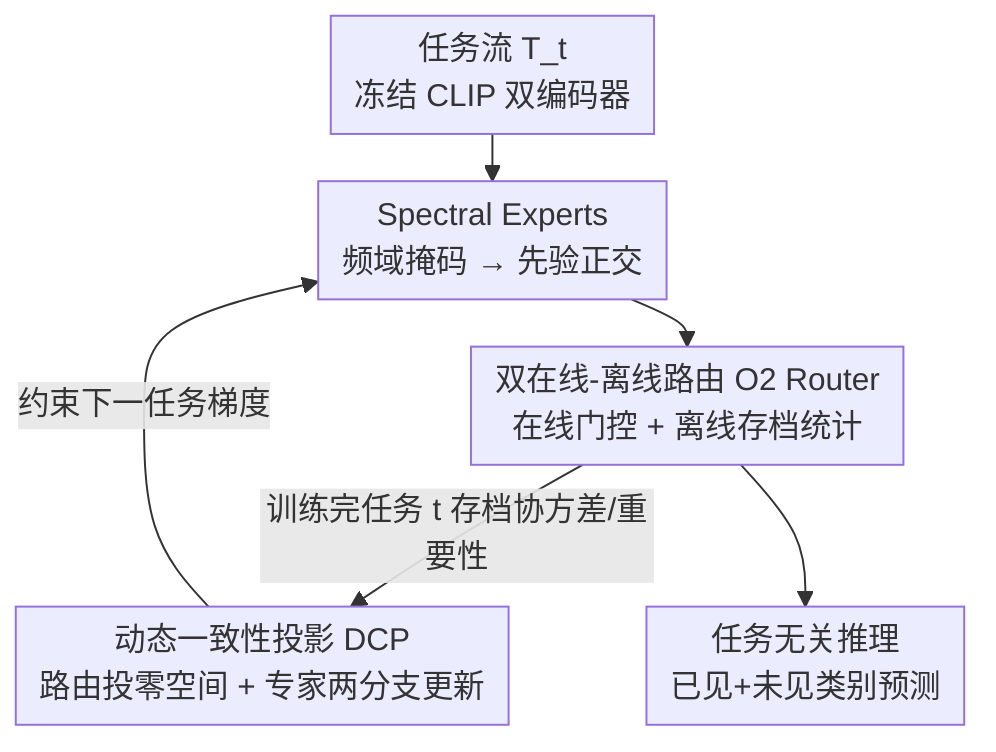

# Spectral Mixture-of-Experts for Continual Learning

**会议**: CVPR 2026  
**论文**: [CVF Open Access](https://openaccess.thecvf.com/content/CVPR2026/html/Yin_Spectral_Mixture-of-Experts_for_Continual_Learning_CVPR_2026_paper.html)  
**代码**: https://github.com/ouycc/Spectral_MoE  
**领域**: 持续学习 / Mixture-of-Experts / 参数高效微调  
**关键词**: 持续学习, 谱域专家, 频域正交, 路由漂移, 一致性投影

## 一句话总结
针对 LoRA-MoE 做持续学习时的"结构性干扰"和"组合式遗忘"两大失效，本文提出 Spectral MoE：用互不重叠的频域掩码把每个专家约束到独立频率子空间从而天然正交，再配一套在线/离线双路由 + 动态一致性投影来锁住路由策略，在跨域任务无关增量学习上同时拿到更高的保留率和可塑性。

## 研究背景与动机
**领域现状**：持续学习（CL）希望模型像人一样不断学新任务又不忘旧任务。基于 CLIP 这类预训练 VLM 做 CL 时，全量微调代价太高，于是主流转向参数高效微调（PEFT），尤其是把多个 LoRA 模块组织成稀疏激活专家、用路由器按输入动态组合的 MoE-Adapter 路线。直觉上"不同任务用不同专家"应该能天然隔离干扰。

**现有痛点**：作者指出这条路线在任务无关（推理时拿不到任务 ID）的跨域设定下会撞上两个被忽视的失效模式。其一是**结构性干扰（Structural Interference）**：所有专家的 LoRA 增量 $\Delta W_m$ 都挂在同一个冻结骨干上、且没有强制正交约束，新任务的参数更新会落进和旧任务重叠的子空间；当 top-k 路由同时激活新旧专家时，它们非正交的更新相互纠缠，即使旧专家权重没被直接改写，旧任务性能也会塌。其二是**路由漂移（Router Drift）**：共享路由器持续在新任务上训练，它的决策边界会慢慢偏移，开始把旧任务的输入路由到错误的专家组合——模型还记得每个专家的单项技能，却忘了"该怎么把它们组合起来"完成旧任务，作者称之为**组合式遗忘（Compositional Forgetting）**。

**核心矛盾**：根子在"专家参数共享同一空间 + 路由策略可塑但会漂"这对张力上。已有补救要么是反应式的梯度投影（如 OGD 在旧任务后才算梯度子空间再投影），要么是 BiLoRA 那样按"任务级"分配频域子空间——但任务级掩码对 MoE 不够用，因为同一输入会共激活多个专家、它们仍共享同一个任务级掩码，更新依旧重叠。

**本文目标**：把两个失效分别从源头解决——结构性干扰要"先验正交"，组合式遗忘要在不牺牲新任务可塑性的前提下约束路由与专家组合。

**核心 idea**：给**每个专家**分配互不相交的频域掩码，让专家增量在数学上先验地两两 Frobenius 正交（Spectral Experts）；再用一套在线/离线双路由把历史专家统计存档下来，驱动一个动态一致性投影，把路由梯度投到历史输入的零空间、并按专家重要性做差异化保护。

## 方法详解

### 整体框架
输入是一串跨域任务流 $\{T_1,\dots,T_T\}$，每个任务有自己的数据集和不相交的标签空间，训练完即不可再访问；推理时不给任务 ID，模型要在所有已见 + 未见类别的并集上预测。骨干是冻结的 CLIP 双编码器，只在 Transformer 块里插入可训练的 Spectral MoE 模块，用对比损失适配新任务。整套方法由三块协同：① **Spectral Experts** 在参数层面把每个专家关进独立频率子空间，从源头消灭结构性干扰；② **双在线-离线路由（O2 Router）** 把"在线实例级路由"和"离线历史统计存档"解耦；③ **动态一致性投影（DCP）** 用离线存下来的协方差，把路由和专家的梯度投影到保护旧知识的子空间，解决组合式遗忘。三者的关系是：Spectral Experts 管"专家本身别打架"，O2 Router 管"记下历史怎么用专家"，DCP 拿这份记忆去"约束新更新别破坏旧组合"。

### 关键设计

**1. Spectral Experts：用互斥频域掩码让专家更新先验正交**

针对结构性干扰这个痛点，作者把专家从空间域搬进频域来参数化。每个谱域专家 $E_m$ 的权重增量定义为 $\Delta W_m = F_o (S_m \odot \Theta_m) F_i^H$，其中 $F_o, F_i$ 是酉 DFT 矩阵，$\Theta_m$ 是可学习的复频率系数，$S_m \in \{0,1\}$ 是一张**固定的二值掩码**，$\odot$ 是逐元素乘。关键在掩码的构造：用一个逐层、无放回的分配器，把所有频率对划分给各个专家，保证任意两个专家的掩码**两两不相交**，即 $S_m \odot S_n = 0,\ \forall m \neq n$。在酉 DFT 参数化和共轭对称约束下，作者证明（命题 1）这样得到的更新矩阵两两 Frobenius 正交：$\langle \Delta W_m, \Delta W_n \rangle_F = 0$。

为什么这样有效：它和 BiLoRA 这类"任务级"频域掩码的本质区别是粒度——任务级掩码下，同一输入共激活的多个专家仍共享一张掩码、更新照样重叠；而这里是**专家级**互斥掩码，哪怕 top-k 同时点亮新旧专家，它们的更新也被锁在各自的频带里、天然不冲突。而且掩码是固定的，这条正交性质在整个训练过程中恒成立（training-invariant），不像 OGD 那样要事后算梯度子空间再补救。一个附带好处是参数量大减：专家不再是参数沉重的 LoRA，而是一小撮固定数量的非零频率系数。

**2. 双在线-离线路由（O2 Router）：在线门控负责推理，离线存档喂给投影**

光保住专家参数不够，模型还得记住"对某个任务该激活哪些专家"。痛点是已有 MoE-Adapter 常用任务专属路由器，这和任务无关推理（拿不到任务 ID）天然冲突。作者的解法是把路由拆成两半。**在线共享实例路由** $G^I_{\text{shared}}$ 用一套共享参数 $W_g$，对任意特征 $x$ 做实时 top-k 门控 $a(x) = \sigma(\text{Topk}(xW_g, k))$，训练和推理都用它——共享参数让常用的专家组合能跨任务复用、促进知识迁移，又因为依赖具体实例 $x$ 而能做到比任务级路由更细的选择粒度。**离线任务专属路由** $G^T_t$ 则不是一个网络，而是任务 $T_t$ 训练完后算出的一个静态汇总向量 $\bar{a}_t = \frac{1}{|D_t|}\sum_{x \in D_t} a(x)$，记录这个任务下各专家的平均使用强度。

为什么这样有效：离线路由**完全不参与在线门控决策**，它只作为历史元信息被存档下来，告诉后续学习"哪些专家对哪个旧任务重要"。这就把"任务无关推理"和"需要任务级历史统计来做保护"这对看似矛盾的需求解耦开——在线那条保持任务无关、可正常推理，离线那条悄悄攒下投影所需的协方差和重要性，供下面的 DCP 取用。

**3. 动态一致性投影（DCP）：路由投零空间 + 专家按重要性两分支更新**

这是直接对付组合式遗忘的机制。作者先推出"输出对旧任务不变"的两个充分条件：(i) **路由一致性**——路由更新要正交于历史输入，$x_t \Delta W_g = 0$；(ii) **专家组合一致性**——稀疏谱专家更新在历史门控下的加权和为零，$\sum_m a^t_m \Delta\Theta'_m = 0$。

对路由，作者把历史特征堆成 $X_t$、算未中心化协方差 $\bar{X}_t = X_t^\top X_t$，对其做 SVD 取近零奇异值对应的右奇异向量构成零空间基 $\tilde{V}_x$，得到投影矩阵 $H_w = \tilde{V}_x \tilde{V}_x^\top$，于是路由更新变成 $\Delta W_g = H_w \nabla_{W_g}\mathcal{L}$，保证更新落在历史输入的零空间里、不破坏旧路由。

对专家，作者没有死板地强制加权和为零（那会牺牲新任务可塑性），而是把梯度拆成"稳定分支"和"可塑分支"。同样对历史门控 $\bar{A}_t = A_t^\top A_t$ 做 SVD 得专家零空间投影 $H_e$，然后用两分支规则更新：

$$\Delta E = \underbrace{H_e (D_\eta \nabla_E \mathcal{L})}_{\text{稳定分支}} + \underbrace{(I - H_e)\big((I - D_\eta)\nabla_E \mathcal{L}\big)}_{\text{可塑分支}}$$

其中 $D_\eta = \text{diag}(\eta_1,\dots,\eta_N)$ 是按专家重要性来的松弛矩阵，$\eta_m = \eta_{\min} + (\eta_{\max}-\eta_{\min})\,\bar{a}_{t,m}^{\,\gamma}$，重要性 $\bar{a}_{t,m}$ 正是离线路由存下来的归一化使用强度。这样越重要的专家 $\eta_m$ 越接近 $\eta_{\max}$，其梯度被更强地导进稳定零空间 $H_e$ 来保护；不重要的专家则保持可塑去学新任务。为什么有效：它把"该冻谁、冻多狠"从粗粒度的整体冻结，细化成每个专家**自适应的稳定-可塑权衡**，既挡住组合式遗忘又不把模型学僵。

### 损失函数 / 训练策略
任务适配用对比损失 $\mathcal{L}$（CLIP 图文对齐风格）；优化器 AdamW，学习率 0.001，batch 64。架构上共 $N=32$ 个谱专家，路由每输入选 top-$k=4$。投影超参 $\eta_{\min}=0.95$、$\eta_{\max}=1.0$、聚焦强度 $\gamma=2$。每个任务训练完即存档三样离线先验：路由协方差 $H_w$、专家协方差 $H_e$、平均专家使用强度。

## 实验关键数据

### 主实验
在 11 任务跨域 MTIL（多域任务增量）基准上，用 Transfer（未见任务的泛化）、Average、Last（旧任务平均保留）三指标对比，本文在三项全面 SOTA：

| 设定 | 指标 | 本文 | 之前最优 | 说明 |
|------|------|------|----------|------|
| Full-shot MTIL | Average | **78.1** | 77.5 (MoE-Adapters++) | 整体最优 |
| Full-shot MTIL | Last | **86.3** | 86.2 | 保留率最高 |
| Full-shot MTIL | Transfer | **70.1** | 69.0 | 泛化最高，证明保护不僵 |
| Few-shot MTIL | Average | **72.1** | 71.7 | 数据稀缺下仍稳 |
| Few-shot MTIL | Last | **76.5** | 76.3 | — |
| CIL (TinyImageNet 5-step) | Average | **81.95** | 81.12 (MoE-Adapters) | 单域细粒度也有效 |

计算成本上本文同时是三项最省：可训练参数仅 **23.5M**，约为 MoE-Adapters（59.8M）的 1/2.5、ZSCL（149.6M）的 1/6.4；显存 21580 MiB 最低；训练速度 1.24s/it，比 ZSCL（3.94s/it）快 3 倍多。省参数来自谱专家用一小撮固定频率系数替代了参数沉重的 LoRA。

### 消融实验

| 配置 | Transfer | Average | Last | 说明 |
|------|---------|---------|------|------|
| Full（完整） | 70.1 | 78.1 | 86.3 | SE + DCP 全开 |
| w/o $H_w$（去路由投影） | 66.2 | 75.1 | 84.0 | 路由失稳，Average 掉 3.0 |
| w/o $H_e(D_\eta)$（去动态专家投影） | 69.4 | 74.6 | 79.8 | 最严重，Last 暴跌 6.5 |
| w/o 两者（只剩 SE） | 69.8 | 75.0 | 80.2 | 证明仅 SE 不够 |

谱专家单项消融（用 Last Forgetting Rate 的曲线下面积 AUC 衡量总遗忘，越低越好）：full-shot 下把 LoRA 换成 SE，AUC 从 1.81% 降到 **0.91%**（遗忘减半）；few-shot 下从 1.68% 降到 **0.61%**。专家投影矩阵 $D_\eta$ 的对比：$D_\eta=I$（全稳定）太僵，Transfer 掉到 68.7；$D_\eta=0$（全可塑）灾难性遗忘，Last 跌到 80.3；动态 $D_\eta$ 同时拿到最高 Last（86.3）和高 Transfer（70.1）。

### 关键发现
- **动态专家投影 $H_e(D_\eta)$ 是最关键组件**：去掉它 Last 从 86.3 暴跌到 79.8，比去掉路由投影（掉到 84.0）严重得多，说明"按重要性差异化保护专家"比"统一保护路由"更要命。
- **SE 和 DCP 是协同关系而非可替代**：只剩 SE（去掉整个 DCP）Average 仅 75.0——SE 解决了结构性干扰，但组合式遗忘还得靠 DCP，二者合起来才到 78.1 的 SOTA。
- **超参趋势清晰**：专家数 $N$ 越细越好、$N=32$ 处峰值；$\gamma=1$（线性）太钝护不住重要专家、$\gamma\geq3$ 太僵，$\gamma=2$ 最优；安全下限 $\eta_{\min}$ 越高保留越好，$\eta_{\min}=0$ 会让冷门专家灾难性遗忘，故取 0.95。

## 亮点与洞察
- **把"专家正交"从事后补救变成先验保证**：用固定的、专家级互斥频域掩码，让正交性在训练全程数学上恒成立（命题 1 的 Frobenius 正交），而不是 OGD 那样每个任务后重新算梯度子空间——这是把"约束"内建进参数化的漂亮做法。
- **在线/离线路由解耦解决了一个真实矛盾**：任务无关推理要求路由不依赖任务 ID，但有效的旧任务保护又需要任务级历史统计；把离线路由做成"只存档、不决策"的静态汇总向量，巧妙绕开了这对张力，这个解耦思路可迁移到任何"推理要任务无关、但训练想用任务先验"的场景。
- **重要性加权的两分支梯度更新**很值得借鉴：不做整体冻结，而是按每个专家的历史使用强度连续调节稳定/可塑配比，把"稳定-可塑权衡"从全局超参细化到了专家级，迁移到任意带模块化结构的持续学习都适用。
- 顺带把参数量压到对手的 1/2.5～1/6.4，说明频域稀疏参数化本身就是个高效的表达方式。

## 局限与展望
- **依赖存档历史协方差**：DCP 要为每个任务存路由协方差、专家协方差和使用强度，任务数极多时这部分内存/计算会线性累积，论文未讨论长序列（几百任务）下的扩展性。
- **频带预算是固定分配**：掩码用无放回分配器静态切分频率对，专家数 $N$ 和总频率对数决定了每个专家的带宽预算；当任务数超过频带能支撑的专家数时该如何扩容，论文没给方案，先验正交也就有了上限。
- **正交性证明带前提**：Frobenius 正交依赖酉 DFT 参数化 + 共轭对称约束 + 掩码两两不相交，实际实现里共轭对称投影的近似误差对正交性的影响、以及近零奇异值阈值如何选，正文一笔带过（细节在补充材料），复现时是潜在坑点。
- **只在 CLIP + 分类任务上验证**：跨域 MTIL/CIL 都是图像分类，能否迁到检测、分割或纯 NLP 的持续学习仍待验证。

## 相关工作与启发
- **vs MoE-Adapters / MoE-Adapters++**：同样是 LoRA-MoE 路线，但它们靠启发式的"部分专家冻结"做粗粒度保护、且常依赖与任务无关推理冲突的机制；本文用频域先验正交 + 几何投影做"有原则"的解耦，既细粒度又兼容任务无关，Average 反超（78.1 vs 77.5）且参数省一半多。
- **vs BiLoRA（频域 PEFT）**：BiLoRA 也用频域掩码，但是**任务级**的，对 MoE 不够——同输入共激活的多专家共享掩码、更新仍重叠；本文升级成**专家级**互斥掩码，从根上保证共激活专家间正交。
- **vs OGD（梯度投影）**：OGD 是反应式的，旧任务训练完才算梯度子空间再把新更新投上去；本文的正交是参数化内建的先验性质（a priori），全程成立，无需事后构造。
- **vs ZSCL（全参数 + 蒸馏）**：ZSCL 靠师生蒸馏和抗遗忘正则保 CLIP 零样本能力，但全参数微调代价高（149.6M、3.94s/it）；本文用 PEFT + 投影达到更好保留与泛化，且快 3 倍多。

## 评分
- 新颖性: ⭐⭐⭐⭐⭐ 把专家级频域互斥掩码（先验正交）+ 在线离线双路由 + 重要性加权两分支投影三件事串成一个自洽框架，每一环都直击一个明确失效模式。
- 实验充分度: ⭐⭐⭐⭐ MTIL/few-shot/CIL 三套基准 + 完整组件消融 + 超参敏感性 + 计算成本全覆盖，但都局限在 CLIP 图像分类，缺跨任务类型验证。
- 写作质量: ⭐⭐⭐⭐ 失效模式定义清晰、方法推导（充分条件 → 投影构造）逻辑顺，公式较密但都有动机支撑，部分证明放补充材料。
- 价值: ⭐⭐⭐⭐ 在 PEFT 持续学习上同时改善保留/泛化/效率，重要性加权两分支更新和路由解耦的思路对模块化持续学习有较强可迁移性。

<!-- RELATED:START -->

## 相关论文

- [\[CVPR 2026\] A Faster Path to Continual Learning](a_faster_path_to_continual_learning.md)
- [\[CVPR 2026\] Exemplar-Free Continual Learning for State Space Models](exemplar-free_continual_learning_for_state_space_models.md)
- [\[CVPR 2026\] Subspace Alignment for CLIP-based Continual Learning via Canonical Correlation Analysis](subspace_alignment_for_clip-based_continual_learning_via_canonical_correlation_a.md)
- [\[CVPR 2026\] Neural Mixture Density Processes](neural_mixture_density_processes.md)
- [\[CVPR 2026\] Parameter-efficient Continual Learning for Enhancing Plasticity without Forgetting under Limited Model Capacity](parameter-efficient_continual_learning_for_enhancing_plasticity_without_forgetti.md)

<!-- RELATED:END -->
