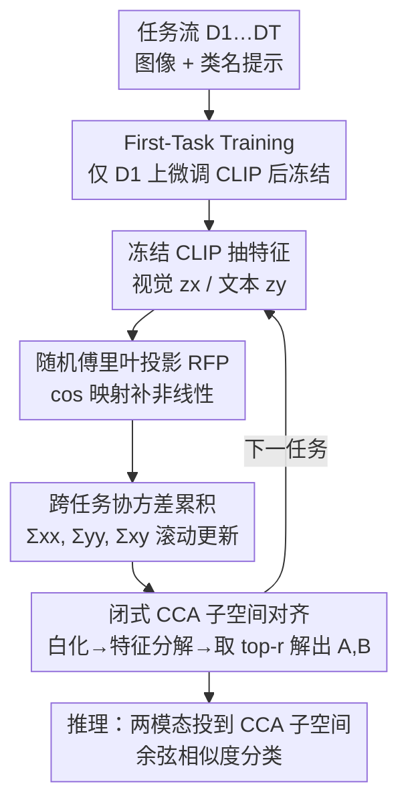

# Subspace Alignment for CLIP-based Continual Learning via Canonical Correlation Analysis

**会议**: CVPR 2026  
**论文**: [CVF Open Access](https://openaccess.thecvf.com/content/CVPR2026/html/Zhang_Subspace_Alignment_for_CLIP-based_Continual_Learning_via_Canonical_Correlation_Analysis_CVPR_2026_paper.html)  
**代码**: https://github.com/zhwhu/CCA-CL  
**领域**: 持续学习 / 多模态VLM  
**关键词**: CLIP, 持续学习, 非对称漂移, 典型相关分析, 子空间对齐

## 一句话总结
针对 CLIP 持续学习中"视觉编码器漂移远大于文本编码器"导致的跨模态对齐退化（作者称之为 Asymmetric Drift），本文提出 CCA-CL：跨任务累积视觉-文本协方差统计，用闭式典型相关分析（CCA）解出一个最大化两模态相关性的共享子空间，在不改 CLIP 参数、不存样本的前提下把两模态拉回对齐，并用随机傅里叶投影补上非线性，在四个基准上同时拿下 SOTA 精度与最快训练速度（CIFAR-100 上 5.8 分钟）。

## 研究背景与动机

**领域现状**：用冻结/微调的预训练 CLIP 做类增量持续学习（CIL）是近年主流——要么冻住 CLIP 当特征提取器、外挂可学模块（PROOF、ENGINE），要么用 LoRA 等参数高效方式微调主干（MagMax、LGVLM）。两条路的共同目标都是"尽量保住 CLIP 原始表示、又能适应新任务"。

**现有痛点**：这些方法都只盯着"如何更新参数适应新任务"，却忽视了一个跨任务积累出来的结构性问题——视觉分支和文本分支的更新幅度严重不对称。视觉输入分布随任务剧烈变化（如 Task A 沙漠场景 → Task B 猫的图像），图像编码器被推着大幅漂移；而文本侧只是 `"a photo of [CLS]"` 模板里换个类名，分布方差极小，文本编码器几乎不动。

**核心矛盾**：作者把这个现象正式定义为 **Asymmetric Drift（AD，非对称漂移）**。视觉漂移 $\Delta_v$ 持续大于文本漂移 $\Delta_t$，两模态在特征空间里以不同速度移动，导致视觉-文本特征间距 $\text{dist}(t)$ 随任务单调增大，跨模态对齐越来越差、精度持续下滑（论文图 3 实测）。一个自然的解法是"每个任务都把两模态距离拉近"，但若直接在 CLIP 原空间里通过微调 CLIP 来缩小距离，又会破坏预训练知识、引发灾难性遗忘——这正是矛盾所在。

**本文目标 + 切入角度**：在**不改动 CLIP 参数**的前提下缩小模态距离。作者的观察是：与其在 CLIP 原空间里硬掰特征，不如把两模态**投影到一个新的共享子空间**，让它们在那个子空间里天然对齐。这正是 1936 年的经典统计工具——典型相关分析（CCA）擅长的事：CCA 能找到一对线性投影，使两组变量投影后的相关性最大化。

**核心 idea**：跨任务累积视觉-文本协方差统计，解闭式 CCA 得到一对投影矩阵 $(A,B)$，把图像/文本特征投到"相关性最大、距离最小"的共享子空间里再比相似度。因为只累积协方差矩阵、不存原始样本，方法天然适配 exemplar-free（无样本回放）设定；再用随机傅里叶投影补上线性 CCA 表达不了的非线性关系。

## 方法详解

### 整体框架

CCA-CL 的整条流水线是：第一个任务上轻量微调一次 CLIP（First-Task Training, FTT）让模型适配下游域，之后**永久冻结 CLIP**；从此每来一个任务，就用冻结的编码器抽取视觉特征 $z_x$ 和文本特征 $z_y$（可选先过随机傅里叶投影 RFP），把它们的跨任务协方差统计 $(\Sigma_{xx},\Sigma_{yy},\Sigma_{xy})$ 累积更新，然后解一个**闭式** CCA 得到当前任务的投影矩阵 $(A_t,B_t)$。推理时，图像特征和所有类别的文本原型都投到这个 CCA 子空间里，按余弦相似度分类。整套流程除了第一任务那次微调外**没有任何梯度训练**——CCA 是闭式解，RFP 是随机映射，所以又快又稳。

### 关键设计

**1. 跨任务协方差累积 + 闭式 CCA 子空间对齐：把"缩小模态距离"变成不需训练的统计问题**

这是方法的核心。要解决的痛点是：AD 让视觉、文本特征在 CLIP 原空间里越漂越远，而直接微调 CLIP 去拉近它们会毁掉预训练知识。CCA-CL 的做法是绕开原空间，去找一个**两模态相关性最大**的共享子空间。给定一个 mini-batch 的图像特征 $z_x\in\mathbb{R}^{N\times D}$ 和对应文本特征 $z_y\in\mathbb{R}^{N\times D}$，以滚动均值 $\bar z_x,\bar z_y$ 为中心，递归累积三个协方差：

$$\Sigma_{xx}\leftarrow\Sigma_{xx}+(z_x-\bar z_x)^\top(z_x-\bar z_x),\quad \Sigma_{yy}\leftarrow\Sigma_{yy}+(z_y-\bar z_y)^\top(z_y-\bar z_y),\quad \Sigma_{xy}\leftarrow\Sigma_{xy}+(z_x-\bar z_x)^\top(z_y-\bar z_y)$$

这种"只累积协方差矩阵"的设计有个关键好处：协方差隐式保留了过去任务数据分布的长期记忆，却**不需要存任何原始样本**，所以天然是 exemplar-free 的。累积完后解闭式 CCA：先对 $\Sigma_{xx},\Sigma_{yy}$ 做特征分解得到白化矩阵 $W_x=U_x\Lambda_x^{-1/2}U_x^\top$、$W_y=U_y\Lambda_y^{-1/2}U_y^\top$；算白化后的交叉协方差 $C=W_x\Sigma_{xy}W_y$；对 $K=CC^\top$ 做特征分解 $KV=V\Lambda_\rho$（$\Lambda_\rho=\text{diag}(\rho_1,\dots,\rho_D)$ 是典型相关系数）。然后按**能量准则**只保留前 $r$ 个方向：$\sum_{i=1}^{r}\rho_i^2 / \sum_{i=1}^{D}\rho_i^2\ge\eta$（$\eta$ 一般取 0.99），丢掉噪声主导的小相关方向。最终投影矩阵为

$$A=W_xV_r,\qquad B=W_y(C^\top V_r)\Lambda_\rho^{r\,-1}$$

把两模态投到共享子空间 $z_x^{\text{cca}}=A^\top z_x$、$z_y^{\text{cca}}=B^\top z_y$。在这个子空间里两模态相关性最大、距离最小，对齐问题就被一个无需梯度的闭式解搞定了。和需要训练的 Deep CCA / Kernel CCA 不同，这里全程用闭式 CCA 做统计对齐，正是它在持续学习里又快又不破坏 CLIP 的原因。

**2. 随机傅里叶投影（RFP）：给线性 CCA 补上非线性表达力**

线性 CCA 只能刻画两模态间的线性依赖，复杂场景下表达力不够。本文的补法是在累积协方差之前，先给 $z_x,z_y$ 各过一层随机傅里叶映射，把特征升维到能让非线性相关变得线性可分的高维空间：

$$z_x'=\phi(z_x)=\sqrt{\tfrac{2}{D'}}\cos(Wz_x+b),\qquad z_y'=\phi(z_y)=\sqrt{\tfrac{2}{D'}}\cos(Wz_y+b)$$

其中投影矩阵 $W\in\mathbb{R}^{D'\times D}$ 从高斯分布 $\mathcal{N}(0,\sigma^{-2}I)$ 采样、$b$ 从 $[0,2\pi]$ 均匀采样、$D'$ 是投影维度。这组随机投影隐式逼近一个 RBF 核映射，把原特征送进高维空间后，原本的非线性跨模态相关就近似变成线性可分，再套用前面同一套闭式 CCA（公式不变，只是把 $\Sigma$ 换成 $z'$ 上的统计量）。RFP 的妙处在于：它**不引入任何可训练参数、也不增加优化步骤**，纯随机映射，却把 CCA 的表达力从线性扩展到非线性。消融里 RFP 单独贡献 +4.5% 精度。

**3. First-Task Training（FTT）+ 全程冻结流水线：用一次微调换适配，靠冻结避免 AD**

CCA-CL 只在第一个任务上解冻全部 CLIP 参数、做一次轻量微调（SGD，学习率仅 $1\times10^{-6}$，batch 64，5 个 epoch），之后所有任务都冻结 CLIP。这个设计有双重动机，且都很具体：其一，第一任务微调让 CLIP 先适配下游数据域，在"下游适配"和"保住泛化/零样本能力"之间取一个折中；其二——也是更贴本文主题的——**减少总训练量本身就能缓解 AD**：既然非对称漂移来自持续的非对称参数更新，那把后续任务全冻住、改用统计对齐，就从根上掐断了漂移的来源。去掉 FTT 的 `CCA-CL (no FTT)` 是个完全无参数更新的 training-free 变体，CIFAR-100 上只比完整版掉 2%（83.0→81.0），却把训练时间从 5.8 分钟压到 3.9 分钟，说明子空间对齐才是性能主力、FTT 只是锦上添花。

### 损失函数 / 训练策略
除第一任务的轻量微调（标准分类微调）外，整个持续学习过程**没有损失函数也没有梯度训练**：协方差靠滚动累积、投影矩阵靠闭式 CCA 解出。推理时按子空间内余弦相似度分类：

$$\hat y=\arg\max_c\frac{(A^\top\phi_{\text{rfp}}(F_v(x)))^\top(B^\top\phi_{\text{rfp}}(z_y^{(c)}))}{\|A^\top\phi_{\text{rfp}}(F_v(x))\|_2\,\|B^\top\phi_{\text{rfp}}(z_y^{(c)})\|_2}$$

## 实验关键数据

四个基准（CIFAR-100、ImageNet-R、ImageNet-100、CUB-200），均按类增量切成 10 个任务，CLIP ViT-B/16 主干，单张 RTX 4090。指标为平均增量精度 Avg 和最后一任务精度 Last。

### 主实验

| 方法 | 回放 | CIFAR-100 (Avg/Last) | ImageNet-R | ImageNet-100 | CUB-200 |
|------|------|------|------|------|------|
| Continual-CLIP | × | 75.2 / 66.7 | 79.1 / 72.0 | 85.0 / 75.4 | 76.3 / 71.3 |
| MagMax (ECCV'24) | × | 85.6 / 79.0 | 87.1 / 80.8 | 86.3 / 75.9 | 70.8 / 62.1 |
| RAPF (ECCV'24) | ✓ | 86.1 / 79.0 | 85.5 / 80.2 | 87.5 / 80.2 | 83.0 / 76.3 |
| ENGINE (ICCV'25) | ✓ | 86.9 / 79.2 | 86.2 / 80.3 | — | 85.3 / 79.2 |
| PROOF (TPAMI'25) | ✓ | 84.8 / 76.2 | 82.8 / 77.0 | 84.7 / 72.4 | 83.9 / 79.3 |
| **CCA-CL (no FTT)** | × | 85.4 / 81.0 | 84.7 / 79.4 | 86.0 / 78.0 | 85.9 / 79.2 |
| **CCA-CL** | × | **87.2 / 83.0** | **86.8 / 81.3** | 86.9 / 80.2 | **86.3 / 79.7** |

CCA-CL 在**所有数据集的 Last 精度上都最高**，CIFAR-100 上比次优高出 3.8%（83.0 vs ENGINE 79.2），且**不依赖任何样本回放或 GPT 生成提示**。Avg 精度上除 ImageNet-100 外也全部最高（ImageNet-100 上 CLAP/RAPF 靠回放略高）。值得注意的是 training-free 的 `no FTT` 变体不更新任何参数，仍能在 CIFAR-100 排第二、在其余数据集打败多数对手。

### 消融实验

| CCA | RFP | FTT | CIFAR-100 Acc | 说明 |
|-----|-----|-----|------|------|
| | | | 66.7 | Continual-CLIP 基线（全冻） |
| ✓ | | | 76.5 | +CCA 子空间对齐，+9.8 |
| ✓ | ✓ | | 81.0 | +RFP 非线性，再 +4.5 |
| ✓ | ✓ | ✓ | **83.0** | +FTT 首任务微调，再 +2.0（完整版） |

三个组件逐一叠加都有正贡献：CCA 子空间对齐是绝对主力（+9.8），RFP 补非线性次之（+4.5），FTT 锦上添花（+2.0）。

### 关键发现
- **效率碾压**：CCA-CL 跑完 CIFAR-100 全部 10 任务仅 5.8 分钟，RAPF 要 13.9 分钟（2 倍多），ENGINE/SLCA 超过 80 分钟（10 倍以上慢），而 CCA-CL 精度还最高——因为核心是闭式解+随机映射，没有迭代训练。去掉 FTT 后更降到 3.9 分钟。
- **RFP 宽度 $W$ 的取舍**：$W$ 从 2048→10240，精度先升后稳、显存单调涨；$W=6144$（即 $1024\times6$）取得最佳折中（81.0% Last，6.3 GB 显存），再大只换来可忽略的精度、却显著吃显存。
- **能量阈值 $\eta$**：$\eta=0.99$ 时平均只保留 $\bar r=47.2$ 个典型方向却拿到 81.0% 最佳精度；$\eta$ 太大（如 1.0 保留全部 6144 维）反而把噪声方向也留进来，精度不升反微降。说明子空间需要"压缩+去噪"。
- **动机验证**：图 5 直接对比模态距离——直接微调 CLIP 距离随任务递增、精度递减；Continual-CLIP 冻结后距离稳定但一直很大；CCA-CL 把距离压到又小又稳，精度因此全程领先，坐实了"AD → 模态距离增大 → 精度下降"这条因果链以及子空间对齐的有效性。

## 亮点与洞察
- **把一个被忽视的现象正式建模成可度量的问题**：作者用 $\Delta_v,\Delta_t,\text{dist}(t)$ 三个量把"视觉漂移 > 文本漂移 → 模态距离增大 → 精度下降"量化出来，Asymmetric Drift 这个命名和度量本身就是贡献，给后续工作提供了抓手。
- **用 90 年前的经典统计工具解现代多模态难题**：CCA（1936）天生就是"找两组变量相关性最大的投影"，和"两模态对齐"问题精准匹配；用它的**闭式解**换掉梯度训练，既快又不碰 CLIP 参数，这种"老工具新用"很优雅。
- **协方差即记忆**：只累积 $\Sigma$ 不存样本，就隐式保留了历史分布——这是把 exemplar-free 持续学习做轻量的可复用思路，可迁移到其他需要"无样本记住过去"的增量场景。
- **RFP 零参数补非线性**：用随机傅里叶特征逼近 RBF 核，不加任何可训练参数就把线性 CCA 升级到非线性，这个 trick 在任何"线性方法表达力不够但又不想训练"的地方都能套用。

## 局限与展望
- 作者承认 CCA-CL 仍依赖**第一任务的 CLIP 微调（FTT）**，未来计划引入参数高效微调（PEFT）来进一步提升可扩展性与稳定性。
- ⚠️ 自己发现：方法**强依赖文本侧的稳定性假设**——AD 的前提是"文本分布方差小、文本编码器几乎不动"。在文本提示更丰富/更多样（如长描述、GPT 生成提示）的设定下，文本漂移可能不再可忽略，CCA-CL 的优势是否还在需要验证。
- 实验只测了 10-task 的类增量切分和四个相对标准的图像分类基准；更长任务序列、更细粒度或跨域更剧烈的场景下，协方差累积是否会饱和/退化未充分探讨。
- RFP 的 $W$ 一大显存就显著上涨（10240 维要 11.9 GB），高维特征+大类别数时的显存成本可能成为瓶颈。

## 相关工作与启发
- **vs PROOF / ENGINE（冻结 CLIP + 外挂可学模块）**：它们靠训练额外模块做特征融合/注入文本知识来适配新任务，需要梯度训练且部分依赖回放或 GPT 提示；CCA-CL 不挂可学模块、用闭式 CCA 做统计对齐，更快且 exemplar-free。
- **vs MagMax / LGVLM（微调 CLIP 自身）**：它们通过任务向量或逐任务 LoRA 持续更新 CLIP，正是非对称漂移的来源；CCA-CL 反其道而行，冻结 CLIP、只在子空间里对齐，从根上回避 AD。
- **vs MG-CLIP / Mod-X（从模态错位视角切入）**：MG-CLIP 保持稳定模态 gap、Mod-X 从几何角度分析模内旋转与模间偏移；本文则从**距离视角**形式化 AD，并用 CCA 投影到共享子空间显式最小化模态距离，角度与手段都不同。
- **vs Deep CCA / Kernel CCA**：经典 CCA 的现代变体多需训练；本文坚持用**闭式 CCA**，正是看中其无需训练、适合持续学习快速增量的特性，并用 RFP 零参数补上非线性短板。

## 评分
- 新颖性: ⭐⭐⭐⭐ 首次提出并量化 Asymmetric Drift，用闭式 CCA + RFP 做无样本子空间对齐，问题定义与方法都有新意。
- 实验充分度: ⭐⭐⭐⭐ 四基准 + 充分消融 + 效率/参数敏感性分析 + 动机可视化，但任务序列与数据集类型偏标准。
- 写作质量: ⭐⭐⭐⭐ 动机—度量—方法—验证一条线讲得清楚，公式与流程完整。
- 价值: ⭐⭐⭐⭐ 又快又准又不存样本，对实际持续学习部署很友好，AD 度量与协方差即记忆思路可复用。

<!-- RELATED:START -->

## 相关论文

- [\[CVPR 2026\] A Faster Path to Continual Learning](a_faster_path_to_continual_learning.md)
- [\[CVPR 2026\] Spectral Mixture-of-Experts for Continual Learning](spectral_mixture-of-experts_for_continual_learning.md)
- [\[CVPR 2026\] Exemplar-Free Continual Learning for State Space Models](exemplar-free_continual_learning_for_state_space_models.md)
- [\[CVPR 2026\] Parameter-efficient Continual Learning for Enhancing Plasticity without Forgetting under Limited Model Capacity](parameter-efficient_continual_learning_for_enhancing_plasticity_without_forgetti.md)
- [\[CVPR 2026\] AdaPrior: Bayesian-Inspired Adaptive Prior Correction for Long-Tailed Continual Learning](adaprior_bayesian-inspired_adaptive_prior_correction_for_long-tailed_continual_l.md)

<!-- RELATED:END -->
