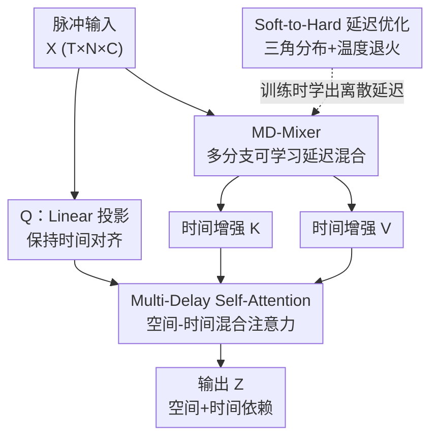

# Temporal Interaction in Spiking Transformers with Multi-Delay Mixer

**会议**: CVPR 2026  
**论文**: [CVF Open Access](https://openaccess.thecvf.com/content/CVPR2026/html/Shi_Temporal_Interaction_in_Spiking_Transformers_with_Multi-Delay_Mixer_CVPR_2026_paper.html)  
**代码**: 无  
**领域**: 脉冲神经网络 / Spiking Transformer  
**关键词**: 脉冲神经网络, Spiking Transformer, 时间建模, 学习延迟, 自注意力

## 一句话总结
针对脉冲 Transformer 的自注意力"只建模空间、几乎不建模时间"的缺陷，本文先提出 TIC 指标量化这一问题，再用受生物轴突传输延迟启发的 Multi-Delay Mixer（多分支可学习延迟）作为即插即用模块为 Key/Value 注入多尺度时间依赖，在静态、神经形态、长序列三类基准上一致刷新脉冲 Transformer 的 SOTA。

## 研究背景与动机

**领域现状**：脉冲神经网络（SNN）以事件驱动、稀疏发放的方式处理信息，部署在神经形态硬件上极其节能。近年来把 Transformer 架构搬进 SNN 形成了一批 Spiking Transformer（Spikformer、QKFormer、Spike-driven Transformer V1/V2 等），在图像识别和神经形态数据上表现亮眼。

**现有痛点**：这些模型里的脉冲自注意力（SSA、QKTA、SDSA 等）几乎只在**单个时间步内**计算空间相关性，**时间依赖**完全交给脉冲神经元自身的膜电位动力学（LIF 的泄漏积分）去隐式处理。这种隐式时间建模能力太弱，处理神经形态数据（本身带丰富时序）时性能受限。已有的显式时序方法要么计算开销大（STSA），要么牺牲建模能力，始终没解决好。

**核心矛盾**：脉冲神经元的内禀动力学不足以捕获跨时间步的长程时序模式，而注意力机制本身又被设计成"逐时间步独立"。更糟的是，领域里**缺一个能量化"注意力到底建模了多少时间依赖"的指标**，导致大家只能看任务精度，看不清瓶颈在哪。

**本文目标**：(1) 给出一个能直接度量注意力时间建模能力的指标；(2) 设计一个能给现有脉冲自注意力补上多尺度时间建模、又不破坏事件驱动特性、还能即插即用的模块。

**切入角度**：作者从生物神经系统的**轴突传输延迟**取经——不同轴突有不同的传输延迟，让神经元能在不同时间尺度上整合信息。把这种"延迟"机制做成可学习的，就能让注意力显式地把历史时间步的信息混进来。

**核心 idea**：用一组**通道级、可学习的多分支时间延迟**去构造时间增强的 Key/Value，把脉冲自注意力从"纯空间"升级成"空间-时间混合"。

## 方法详解

### 整体框架

本文要解决的是"脉冲自注意力缺时间建模"。整体思路分三层：先用 **TIC 指标**诊断出问题（现有注意力的时间依赖高度集中在当前步、历史贡献几乎为零）；再用 **Multi-Delay Mixer（MD-Mixer）** 这个核心模块，通过多条可学习延迟分支把历史时间步的特征加权混入；最后把 MD-Mixer 嵌进注意力的 K/V 投影路径，构成 **Multi-Delay Self-Attention Framework**，让注意力同时吃到空间和时间信息。延迟本身离散难优化，作者再配一套 **Soft-to-Hard 延迟优化**用连续梯度学出离散延迟。

输入是脉冲张量 $X \in \mathbb{R}^{T \times N \times C}$（$T$ 时间步、$N$ token、$C$ 通道）。Query 走普通 Linear 投影保持时间对齐，Key 和 Value 各过一个 MD-Mixer 做时间混合，三者经 BN + 脉冲神经元后送入原有脉冲自注意力，输出 $Z$。整个 MD-Mixer 是 drop-in 替换，不改注意力主体。

### 关键设计

**1. TIC（Temporal Interaction Coefficient）：把"注意力建模了多少时间"量化出来**

要改进时间建模，得先能测量它。作者定义时间步 $q$ 的时间交互系数为 $\text{TIC}_q = H(\tilde{R}_q)$，即对**依赖分布** $\tilde{R}_q$ 取信息熵。依赖分布由依赖向量 $R_q = [R_{q\to 1}, \dots, R_{q\to q}]$ 经 L1 归一化得到，其中每个分量 $R_{q\to p} = \left\| \frac{\partial Z_q}{\partial X_p} \right\|_1$（$p \le q$）衡量第 $q$ 步的注意力输出对第 $p$ 步输入的梯度依赖强度。直觉上，TIC 越高说明依赖分布越"铺得开"、跨越的历史时间步越多、时间交互越丰富；TIC 越低说明依赖几乎全压在当前步。作者在 CIFAR10-DVS 上可视化 SSA/QKTA/SDSA 的依赖向量，发现它们的分布都**尖锐地集中在当前时间步**，远处时间步贡献几乎为零，TIC 值一直很低——这就把"时间建模不足"从模糊感觉变成了可测的瓶颈。

**2. MD-Mixer：用多分支可学习延迟做通道级时间聚合**

这是全文核心，直接针对 TIC 揭示的"历史信息进不来"。受轴突有多种传输延迟启发，MD-Mixer 给每个通道 $i$ 配 $K$ 条延迟分支，每条分支有自己可学习的延迟量 $d_i^{(k)}$ 和聚合权重 $\alpha_i^{(k)}$，把不同滞后的历史特征加权求和：

$$\tilde{X}_{t,i} = \sum_{k=1}^{K} \alpha_i^{(k)} X_{t-d_i^{(k)}, i}$$

延迟 $d_i^{(k)}$ 和权重 $\alpha_i^{(k)}$ 都在训练中联合优化，从而**数据驱动地**为每个通道学出最合适的多尺度时间模式。和靠预设时间窗或循环连接的做法不同，这里是通道专属的稀疏延迟采样，既保留了 SNN 的事件驱动特性，又很省：复杂度从 $O(TD^2)$ 降到 $O(KTD)$、参数量从 $D^2$ 降到 $KD$，约 $D/K$ 倍的下降（论文举例 $K=5$、$D=256$）。也就是说，给 K/V 投影换上 MD-Mixer 不仅没变贵，理论上还更省。

**3. Multi-Delay Self-Attention Framework：延迟只加在 K/V，Query 保持对齐**

有了 MD-Mixer，怎么接进注意力是个设计选择。作者的做法是只让 **Key 和 Value 走 MD-Mixer**（吸收历史时间信息），而 **Query 仍走普通 Linear 保持当前时间对齐**：

$$Q = \text{SN}(\text{BN}(\text{Linear}(X))), \quad K = \text{SN}(\text{BN}(\text{MD-Mixer}(X))), \quad V = \text{SN}(\text{BN}(\text{MD-Mixer}(X)))$$

这样当前步的 Query 去和"已经混入了历史上下文的 K/V"做注意力，注意力计算就从逐时间步独立的纯空间相关，扩展成跨时间步的空间-时间混合（$Z = \text{Atten}(Q, K, V)$，$\text{Atten}$ 是任意通用注意力函数）。框架对底层注意力不挑食，因此能无缝套到 Spikformer、QKFormer、SDT-V1/V2 等各种架构上。

**4. Soft-to-Hard 延迟优化：用连续梯度学出离散延迟**

延迟 $d$ 本质是离散整数（第几个时间步），没法直接梯度下降。作者引入一个**三角形延迟分布** $\phi(d; d^*) = N\!\left(\sigma\!\left(1 - \frac{|d - d^*|}{\tau}\right)\right)$，其中 $d^*$ 是分布中心（即想学的延迟）、$\tau$ 是温度控制尖锐度、$\sigma(\cdot)=\max(0,\cdot)$ 是 ReLU、$N(\cdot)$ 对所有候选延迟归一化。延迟被软化成一个分布后，把它接进 MD-Mixer 内脉冲神经元的膜电位更新：输入电流 $I_{t,j} = \sum_{k=1}^{K} \alpha_j^{(k)} \sum_{d=0}^{T-1} \phi(d; d_j^{(k),*}) \cdot X_{t-d,j}$，即用分布权重去调制各滞后历史特征的贡献。训练时温度 $\tau$ 按**平方余弦调度逐步退火**：初期 $\tau$ 大、分布很宽，可在多个时间尺度上探索；随着 $\tau$ 减小，分布逐渐收窄、最终逼近 one-hot，精确落到一个离散延迟上。这套"软到硬"的渐进锐化让离散延迟能通过连续梯度高效学到。

### 损失函数 / 训练策略

无额外损失项，沿用各 Spiking Transformer baseline 的分类训练目标；关键训练机制是延迟温度 $\tau$ 的平方余弦退火调度（soft-to-hard）。消融在 SDT-V1 上进行。

## 实验关键数据

### 主实验

**静态数据集 ImageNet**（top-1 准确率，T=4）：MD-Mixer 作为 K/V 投影的替换，在多种架构上一致提升。

| 架构 | Params(M) | Baseline | +STAtten | +MD-Mixer |
|------|-----------|----------|----------|-----------|
| SDT-V1-8-768 (224²) | 66.34 | 76.32 | 78.11 | 78.23 |
| SDT-V2-8-512 (224²) | 55.4 | 79.49 | 79.85 | **80.02** |

SDT-V1-8-768 上 MD-Mixer 较 baseline 提升 1.91%，与 STAtten 基本持平（+0.12%）但更省参数/计算。

**神经形态 + 长序列数据集**：MD-Mixer 在 DVS 与序列基准上提升更明显，多处刷新 SOTA。

| 数据集 | 架构 | Baseline | +STAtten | +MD-Mixer |
|--------|------|----------|----------|-----------|
| CIFAR10-DVS | Spikformer-2-256 (T=16) | 80.90 | 82.40 | **83.37** |
| N-Caltech101 | SDT-V1-2-256 (T=16) | 81.80 | 83.15 | **84.59** (+2.79) |
| s-CIFAR100 | QKFormer-2-256 | 55.99 | 56.23 | **64.33** (+8.34) |
| s-CIFAR10 | SDT-V1 | 83.65 | 83.90 | **86.65** |
| UCF101-DVS | +SDT-V2 | — | TIM 63.8 | **66.3** (+2.5) |
| HMDB51-DVS | +SDT-V2 | — | TIM 58.6 | **62.8** (+4.2) |

长序列 s-CIFAR 提升尤其大（s-CIFAR100 上 QKFormer +8.34%），作者解释为序列数据时序结构比 DVS 数据更丰富、更结构化，正好发挥多延迟的长程建模优势。

### 消融实验

**可学习延迟 vs 随机延迟**（聚合权重两者都可学）：

| 数据集 | 配置 | 准确率(%) | 说明 |
|--------|------|-----------|------|
| s-CIFAR10 | Baseline | 83.65 | — |
| s-CIFAR10 | +随机延迟 | 84.39 | 仅 +0.74，靠时间多样性 |
| s-CIFAR10 | +MD-Mixer | **86.65** | +3.00，可学习是关键 |
| CIFAR10-DVS | +随机延迟 | 80.52 | +0.52 |
| CIFAR10-DVS | +MD-Mixer | **82.44** | +2.44 |

**延迟分支数 K 与时间步数**：K 不是越多越好——s-CIFAR10 上从 1 分支 84.3% 升到 3 分支峰值 86.7%，再到 6 分支跌回 84.2%；CIFAR10-DVS 上 4 分支 82.4% 最佳，6 分支跌到 80.9%。时间步越多精度越高（CIFAR10-DVS 从 T=10 的 81.7% 到 T=32 的 83.5%）。

### 关键发现
- **可学习延迟是性能主因**：随机延迟只带来约 0.5~0.7% 的微弱提升，可学习延迟则带来 2.4~3.0% 的大幅提升——说明收益来自"自适应学到正确的多尺度延迟"，而非单纯增加时间多样性。
- **延迟分支数存在最优值**（DVS 上约 3~4 个）：分支过多反而因时间建模过于复杂而掉点，呼应了 $K \ll D$ 的高效设计前提。
- **MD-Mixer 确实把 TIC 拉高了**：集成后依赖向量明显变宽，TIC16 从 baseline 的 1.74/2.10/2.35（QKTA/SSA/SDSA）升到 2.86/3.39/3.15，时间交互能力的提升与精度提升相互印证。

## 亮点与洞察
- **先造指标再造方法**：TIC 用"输出对历史输入的梯度依赖熵"把"时间建模能力"量化成可视、可比的数，既支撑了 motivation，又能在消融里反过来验证方法有效——这种"诊断指标 + 对症模块"的闭环很值得借鉴。
- **生物轴突延迟 → 多分支可学习延迟**的迁移很自然，且做成了通道级稀疏采样，把复杂度从 $O(TD^2)$ 压到 $O(KTD)$，"加时间建模"反而更省，是难得的免费午餐。
- **Soft-to-Hard 退火学离散延迟**是个可复用 trick：凡是要在网络里学"选第几个/哪一档"这类离散索引的场景，都可以用"三角/软分布 + 温度退火逼近 one-hot"来用连续梯度优化。
- **只给 K/V 加延迟、Query 保持对齐**的非对称设计很巧——让"当前查询"去检索"带历史上下文的键值"，语义清晰且不打乱时间锚点。

## 局限与展望
- 论文未给出 K/V 路径加入延迟分支后的端到端实测延迟/能耗对比，复杂度优势主要是理论分析（⚠️ 以原文为准），硬件部署上的真实收益待验证。
- 延迟分支数 K 是敏感超参且数据集相关（DVS 上 3~4 最佳），换数据集需重新调，缺乏自适应选 K 的机制。
- 三角延迟分布、平方余弦退火调度等设计较多依赖经验，论文把梯度分析与退火细节放在补充材料，正文难以完整复现。
- 在静态 ImageNet 上的增益（~0.5~1.9%）明显小于神经形态/序列数据，说明方法收益高度依赖数据本身的时序结构，对弱时序任务价值有限。

## 相关工作与启发
- **vs STSA / STAtten**：同样想给脉冲注意力补时间建模。STSA 显式联合时空但计算开销大；STAtten 用分块策略在保持复杂度下改进时序。本文不直接改注意力计算，而是在 K/V 投影前插入轻量的多延迟混合模块，作为 drop-in 替换，且理论复杂度反而更低，在多数基准上略优于 STAtten。
- **vs TIM**：TIM 在 Spikformer 上把历史时间信息注入 Query 分支，仅加少量参数。本文相反——把延迟加在 K/V、Query 保持对齐，且延迟是通道级多分支可学习的；在 UCF101-DVS / HMDB51-DVS 上分别超过 TIM 2.5% / 4.2%。
- **vs 普通脉冲自注意力（SSA/SDSA/QKTA）**：它们靠 LIF 神经元内禀动力学隐式处理时间，TIC 分析显示时间依赖几乎全压在当前步；MD-Mixer 显式注入多尺度延迟，把注意力从纯空间升级为空间-时间混合。

## 评分
- 新颖性: ⭐⭐⭐⭐⭐ TIC 量化指标 + 生物启发的多分支可学习延迟 + soft-to-hard 离散延迟优化，组合新颖且自洽
- 实验充分度: ⭐⭐⭐⭐⭐ 覆盖静态/神经形态/长序列三类基准、四种架构，配 TIC 可视化与多组消融
- 写作质量: ⭐⭐⭐⭐ motivation 到方法逻辑清晰，但延迟分布与梯度细节多放补充材料，正文略难自洽复现
- 价值: ⭐⭐⭐⭐ 即插即用、理论更省、一致刷 SOTA，对脉冲 Transformer 时间建模有通用价值，但增益强依赖数据时序结构

<!-- RELATED:START -->

## 相关论文

- [\[CVPR 2026\] On the Role of Temporal Granularity in the Robustness of Spiking Neural Networks](on_the_role_of_temporal_granularity_in_the_robustness_of_spiking_neural_networks.md)
- [\[CVPR 2026\] Robust Spiking Neural Networks by Temporal Mutual Information](robust_spiking_neural_networks_by_temporal_mutual_information.md)
- [\[CVPR 2026\] Temporal Representation Enhancement (TRE): Learning to Forget Dominant Patterns for Enhanced Temporal Spiking Features](temporal_representation_enhancement_tre_learning_to_forget_dominant_patterns_for.md)
- [\[CVPR 2026\] MooCap: A Multi-View Benchmark for Cow-Object-Human Interaction and Behavior Dynamics](moocap_a_multi-view_benchmark_for_cow-object-human_interaction_and_behavior_dyna.md)
- [\[CVPR 2026\] Keep It Frozen: Domain-Routed Conditional Residual Modulation for Multi-Domain Vision Transformers](keep_it_frozen_domain-routed_conditional_residual_modulation_for_multi-domain_vi.md)

<!-- RELATED:END -->
