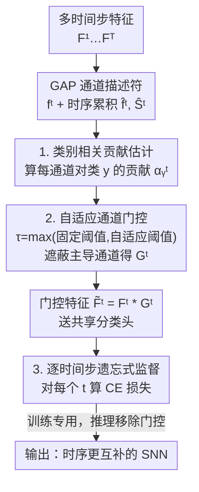

# Temporal Representation Enhancement (TRE): Learning to Forget Dominant Patterns for Enhanced Temporal Spiking Features

**会议**: CVPR 2026  
**论文**: [CVF Open Access](https://openaccess.thecvf.com/content/CVPR2026/html/Liu_Temporal_Representation_Enhancement_TRE_Learning_to_Forget_Dominant_Patterns_for_CVPR_2026_paper.html)  
**代码**: 无  
**领域**: 脉冲神经网络 / 时序表示学习  
**关键词**: 脉冲神经网络(SNN), 时序冗余, 学习遗忘, 通道门控, 类别贡献估计

## 一句话总结
针对脉冲神经网络（SNN）在多个时间步上反复激活同一批主导通道、导致时序表示高度冗余的问题，本文提出 TRE：训练时按类别估计每个通道的贡献度，用自适应阈值门控把"过度主导"的通道暂时遮蔽掉，逼后续时间步去挖互补语义；推理时不加任何遮蔽、零额外开销，在 CIFAR-100/ImageNet/DVS-CIFAR10 上稳定涨点。

## 研究背景与动机
**领域现状**：SNN 用离散脉冲在多个时间步（timestep）上处理输入，天然带时序动态、且低功耗，是连接神经科学与高能效计算的有前途的模型。直接训练（direct training）的 SNN 通常用代理梯度（surrogate gradient）反传，并在每个时间步用**完全相同的监督信号**（同一个分类头、同一个 label）来稳定优化。

**现有痛点**：作者观察到，这种"时间不变监督"会让不同时间步的特征收敛到几乎相同的表示子空间——网络在 T=1~4 上反复激活同一批高响应通道（论文 Fig.1 的通道贡献密度曲线又窄又尖），后面的时间步基本在复读前面的语义，几乎不带来新信息。作者把这个现象称为**时序冗余（temporal redundancy）**。

**核心矛盾**：根因在于"统一监督"与"时序多样性"之间的冲突。统一监督让优化稳定，但也让各时间步梯度高度同质化，特征互信息 $I(f^t; f^{t-1})$ 上升、而新时间步对目标类别的边际信息 $I(f^t; y) - I(f^{t-1}; y)$ 下降，多时间步的容量被浪费。已有改进（更深的网络、多步校准、一致性约束如 TET/SLTT）大多是去**对齐/稳定**时序特征，反而进一步强化了趋同，没人去主动**多样化**它。

**切入角度**：作者借了认知神经科学里"预测编码（predictive coding）"的思路——大脑每个感知周期会**抑制已经解释过的信号、突出新颖的残差信息**。类比到 SNN，就应该在后续时间步把"已经被充分利用的主导模式"忘掉，把注意力转向尚未开发的语义子空间。掩码类方法（在 CNN 里遮蔽主导空间区域来暴露其他线索）证明了"抑制主导"有效，但它们只作用在空间域，管不了 SNN 特有的时序冗余。

**核心 idea**：把时序学习重新表述为一个**"学习遗忘（learning-to-forget）"**过程——按类别度量每个通道对当前预测的贡献，用动态阈值把贡献过高的主导通道在训练时门控掉，逼模型在后续时间步探索互补特征；不改架构、不加推理开销。

## 方法详解

### 整体框架
TRE 是一个只在训练期生效的时序调制机制，挂在任意直接训练 SNN 的骨干上。对一个时间步序列 $\{F^1, \dots, F^T\}$（每个 $F^t \in \mathbb{R}^{H\times W\times C}$），它的处理链路是：先用全局平均池化（GAP）把每个时间步压成通道描述符 $f^t = \text{GAP}(F^t)$；再把前 $t-1$ 步的描述符与 logits 做时序累积，得到通道相关性的"时序先验"；据此做**类别相关贡献估计**，算出每个通道对真值类 $y$ 的贡献分 $\alpha_y^t$；用**自适应通道门控**把贡献超过阈值的主导通道置零，得到门控后特征 $\tilde F^t = F^t * G^t$；门控特征送进共享分类头，并用**逐时间步遗忘式监督**约束每一步的预测。推理时整条门控链路全部移除，网络退化成原始 SNN，**不增加任何计算量或延迟**。

### 关键设计

**1. 类别相关贡献估计：把"哪些通道在主导当前预测"量化出来**

要"遗忘主导模式"，先得知道哪些通道是主导的——而且必须是**针对当前真值类**的主导，否则盲目遮蔽会误伤有用特征。本文为此设计了一个类别条件的归因。先做时序累积，把历史时间步的信息当先验：$\hat f^t = \frac{1}{t-1}\sum_{i=1}^{t-1} f^i$，$\hat S^t = \frac{1}{t-1}\sum_{i=1}^{t-1} S^i$，其中 $S^i = \text{FC}(f^i)$ 是第 $i$ 步的 logits、FC 为共享线性层。然后用分类头对类 $y$ 的权重行 $w_y \in \mathbb{R}^C$（$w_{y,c}$ 表示通道 $c$ 的取值对预测类 $y$ 的证据量），定义通道 $c$ 在时刻 $t$ 的相关性分数

$$\alpha_y^t[c] = \frac{\big(\exp(\hat f^t_c \cdot w_{y,c}) - 1\big)\cdot \exp\!\big(\sum_{i\neq c}\hat f^t_i \cdot w_{y,i}\big)}{\sum_{k=1}^{K}\exp(\hat S^t_k)}.$$

直观上 $\alpha_y^t[c]$ 衡量的是"去掉通道 $c$ 这一项后、模型对类 $y$ 的置信度会发生多大边际变化"——分子第一项 $\exp(\hat f^t_c w_{y,c})-1$ 正是该通道的指数化边际贡献。它给后面提供了一个**带时序记忆、又对类别敏感**的主导模式打分。⚠️ 公式（含归一化分母的具体含义）以原文 Eq.(5) 为准。

**2. 自适应通道门控：用"固定+自适应"双阈值精准遮蔽主导通道，而不是简单 top-k**

有了贡献分还需要决定遮蔽谁、遮蔽多少。固定遮蔽 top-k 个通道有个毛病：在贡献分布平的样本上会把有用特征也一刀切掉（论文 Table 4 显示 top-k 越大掉得越多）。本文改用数据自适应的阈值：先算一个常数基线阈值 $\theta_0^c$，再算一个随当前样本贡献分布走的阈值 $\theta_a^c = \mu(\alpha_y^t) + \lambda_c\,\sigma(\alpha_y^t)$（$\mu,\sigma$ 是贡献分的均值与标准差，$\lambda_c$ 是控制灵敏度的通道缩放因子），取二者较大者作为统一阈值 $\tau^c = \max(\theta_0^c, \theta_a^c)$。门控向量用指示函数定义：$G^t[c] = \mathbb{I}(\alpha_y^t[c] < \tau^c)$——贡献低于阈值的通道保留（门为 1），超过阈值的主导通道被置零（门为 0）。门控后特征 $\tilde F^t = F^t * G^t$（沿通道维广播逐元素乘）。这样遮蔽的数量随样本自适应，既能压住真·主导通道，又不会过度抹掉互补信息。为了缓解训练/推理的分布偏移，门控操作还像 dropout 一样做归一化以保持期望激活幅度（论文 Fig.3：归一化门控带来的分类分数偏移远小于不归一化）。

**3. 逐时间步遗忘式监督：让每一步都去找"新证据"而非复读旧的**

门控只在训练时把主导通道遮住，但要真正让网络学到互补表示，得让损失"看到"被遮蔽后的预测。第一步 $t=1$ 没有历史可累积，用原始预测 $p^1$ 监督；从 $t>1$ 起，用门控后特征过分类头得到 $\tilde p^t = \text{softmax}(\text{FC}(\text{GAP}(\tilde F^t)))$，整体目标为

$$L = L_{CE}(p^1, y) + \sum_{t=2}^{T} L_{CE}(\tilde p^t, y).$$

因为后续时间步的主导通道被遮了，要继续把这一步的预测做对，网络就**被迫**在剩下的、原本被忽视的语义通道里找判别证据。这就把"统一监督导致趋同"扭转成"差异化监督鼓励探索"，让各时间步学到互补且更具时序判别力的表示——而这一切只发生在训练，推理时门控全撤、零开销。

### 损失函数 / 训练策略
骨干用 LIF 神经元 + Spiking ResNet-19/34；CIFAR-100 与 DVS-CIFAR10 用 SGD（momentum 0.9，初始 lr 0.1，cosine 退火到 0）按标准直训协议；ImageNet 沿用 PSN 配置训 320 epoch。发放阈值设为 1、膜衰减常数设为 2。CIFAR-100 用 T=4、DVS-CIFAR10 用 T=10。

## 实验关键数据

### 主实验
静态数据集（CIFAR-100 + ImageNet）上，TRE 用更少的时间步就超过一众 SOTA：

| 数据集 | 方法 | 骨干 | 时间步 | 准确率 |
|--------|------|------|--------|--------|
| CIFAR-100 | SLTT | ResNet-18 | 6 | 74.67% |
| CIFAR-100 | TET | ResNet-19 | 4 | 74.47% |
| CIFAR-100 | GAC-SNN | ResNet-18 | 4 | 79.83% |
| CIFAR-100 | SlipReLU (转换) | ResNet-18 | 128 | 78.55% |
| CIFAR-100 | **TRE (本文)** | ResNet-19 | 4 | **81.27%** |
| ImageNet | MPBN | ResNet-34 | 4 | 64.71% |
| ImageNet | PSN | ResNet-34 | 4 | 70.54% |
| ImageNet | **TRE (本文)** | ResNet-34 | 4 | **71.60%** |

CIFAR-100 上仅用 4 步就比用 6 步的 SLTT 高 +6.60%，比用 128 步的转换方法 SlipReLU 高 +2.72%（时间步少两个数量级）；ImageNet/ResNet-34 上比同设置的 PSN 高 +1.04%、比 MPBN 高近 7 个点。

动态神经形态数据 DVS-CIFAR10（事件相机数据）上同样领先：

| 方法 | 骨干 | 时间步 | 准确率 |
|------|------|--------|--------|
| LM-H | ResNet-19 | 10 | 79.10% |
| TET | ResNet-19 | 10 | 83.00% |
| **TRE (本文)** | ResNet-19 | 10 | **83.60%** |

### 消融实验
和不同监督策略对比（同骨干 ResNet-19）：

| 数据集 | 监督方式 | 时间步 | 准确率 | 说明 |
|--------|---------|--------|--------|------|
| CIFAR-100 | baseline（统一监督） | 4 | 77.75% | 起点 |
| CIFAR-100 | TET（解耦时间步监督） | 4 | 80.16% | 仅调监督结构 |
| CIFAR-100 | **TRE** | 4 | **81.27%** | 比 baseline +3.52，比 TET +1.11 |
| DVS-CIFAR10 | baseline | 10 | 78.40% | 起点 |
| DVS-CIFAR10 | TET | 10 | 83.00% | — |
| DVS-CIFAR10 | **TRE** | 10 | **83.60%** | 比 baseline +5.20，比 TET +0.60 |

门控策略分析（CIFAR-100, T=4）——验证自适应阈值优于固定 top-k：

| 门控策略 | 准确率 | 说明 |
|---------|--------|------|
| Top-1 gating | 80.88% | 固定遮蔽贡献最高的 1 个通道 |
| Top-2 gating | 80.82% | — |
| Top-4 gating | 80.52% | 遮越多掉越多 |
| **TRE 自适应阈值** | **81.27%** | 按样本分布自适应遮蔽 |

### 关键发现
- **显式"多样化"比"对齐/稳定"更管用**：TRE 比同样改时序优化的 TET 在两个数据集上都更高，说明主动遮蔽主导模式 > 仅调整监督结构。
- **事件数据收益更大**：DVS-CIFAR10 上对 baseline 的提升（+5.20）大于 CIFAR-100（+3.52），因为神经形态数据本身时序结构更丰富，更受益于互补时序线索的挖掘。
- **固定 top-k 会过度遮蔽**：top-k 越大准确率反而越低，自适应阈值能区分"该遮的主导通道"与"该留的互补通道"。
- **门控归一化稳训练**：归一化门控让训练/推理的分类分数分布几乎一致（Fig.3），避免激活过饱和。
- **时序冗余确有其事**：相比同样走时序解耦的 PSN，TRE 显著降低了 ImageNet 上跨时间步的特征相似度，印证它确实提升了时序表示多样性。

## 亮点与洞察
- **"学习遗忘"这个框架本身很巧**：大多数时序 SNN 工作都在想办法让各时间步"对齐/一致"，本文反其道而行——主动遗忘已经被充分利用的主导通道，把时序冗余问题转化成一个可操作的"按类别贡献门控"机制，思路新颖。
- **训练加料、推理零开销**：所有门控只在训练期生效，推理时网络完全退回原始 SNN，不动架构、不加延迟，这对强调低功耗/低延迟的 SNN 落地非常友好，是很实用的工程取舍。
- **类别条件的通道归因可迁移**：用分类头权重 $w_y$ 对当前类做边际贡献估计、再配自适应阈值门控，这套"按类别找主导单元并抑制"的范式，思路上可迁移到普通 ANN 的特征正则、长尾抑制或注意力 dropout。

## 局限与展望
- **只验证了分类任务**：实验全在图像/神经形态**分类**（CIFAR-100/ImageNet/DVS-CIFAR10）上，对检测、分割、时序事件流等更需要时序判别的任务是否有效未知。
- **额外超参与训练成本**：引入了基线阈值 $\theta_0^c$、自适应缩放因子 $\lambda_c$ 等超参，且训练期每步都要做累积+贡献估计+门控，训练开销与超参敏感性原文未充分量化（⚠️ 需以原文附录为准）。
- **贡献估计依赖共享分类头**：$\alpha_y^t$ 的计算建立在"分类头权重能代表通道证据"的假设上，若特征与分类头不够线性可分，主导通道的识别可能不准。
- **改进思路**：把固定+自适应双阈值换成可学习的软门控、或把"遗忘"调度成随训练进度退火（早期多遗忘、后期少遗忘），可能进一步平衡探索与稳定。

## 相关工作与启发
- **vs TET / SLTT（时序优化类）**：它们通过解耦时间步监督或丢弃时序梯度来稳定/提效，但仍是让时序特征趋同；TRE 反过来主动多样化，消融里在相同设置下持续高于 TET（CIFAR-100 +1.11、DVS +0.60）。
- **vs ANN-to-SNN 转换（QCFS/SlipReLU 等）**：转换法靠长仿真窗口逼近 ANN，时间步动辄上百、延迟高；TRE 走直训路线，4 步即超过 128 步的 SlipReLU，时间步少两个数量级。
- **vs 空间掩码 / 特征遮蔽（CNN 的 dropblock、attention dropout、SNN 的 temporal self-erasing）**：这些都在**空间域**抑制主导区域；TRE 的根本区别是把抑制搬到**时序域**，并由类别相关贡献估计驱动，专门解时序冗余而非空间冗余。

## 评分
- 新颖性: ⭐⭐⭐⭐ 把时序学习重构成"学习遗忘"、用类别贡献门控主动多样化时间步表示，视角新颖。
- 实验充分度: ⭐⭐⭐⭐ 覆盖静态+神经形态、多骨干、监督策略与门控策略消融齐全；但仅限分类任务、缺训练开销量化。
- 写作质量: ⭐⭐⭐⭐ 从时序冗余的现象→形式化→机制讲得清楚，公式与图配合到位。
- 价值: ⭐⭐⭐⭐ 训练加料、推理零开销，对低功耗 SNN 很实用，且"按类别遮蔽主导单元"思路可迁移。

<!-- RELATED:START -->

## 相关论文

- [\[CVPR 2026\] On the Role of Temporal Granularity in the Robustness of Spiking Neural Networks](on_the_role_of_temporal_granularity_in_the_robustness_of_spiking_neural_networks.md)
- [\[CVPR 2026\] Temporal Interaction in Spiking Transformers with Multi-Delay Mixer](temporal_interaction_in_spiking_transformers_with_multi-delay_mixer.md)
- [\[CVPR 2026\] Robust Spiking Neural Networks by Temporal Mutual Information](robust_spiking_neural_networks_by_temporal_mutual_information.md)
- [\[CVPR 2026\] Adaptive Spatial-Temporal Window: Unlocking the Potential of Event Cameras in Heterogeneous Velocity Scenarios](adaptive_spatial-temporal_window_unlocking_the_potential_of_event_cameras_in_het.md)
- [\[AAAI 2026\] Expressive Temporal Specifications for Reward Monitoring](../../AAAI2026/others/expressive_temporal_specifications_for_reward_monitoring.md)

<!-- RELATED:END -->
