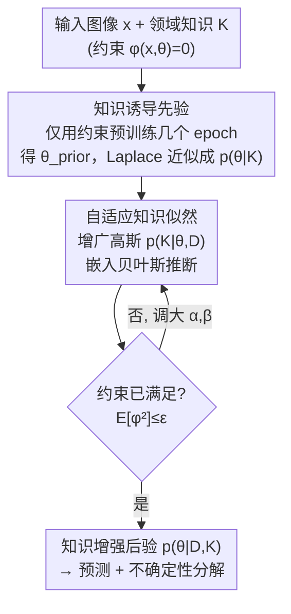

# Towards Knowledge-augmented Bayesian Deep Learning For Computer Vision

**会议**: CVPR 2026  
**论文**: [CVF Open Access](https://openaccess.thecvf.com/content/CVPR2026/html/Ma_Towards_Knowledge-augmented_Bayesian_Deep_Learning_For_Computer_Vision_CVPR_2026_paper.html)  
**代码**: 待确认  
**领域**: 贝叶斯深度学习 / 不确定性估计  
**关键词**: 贝叶斯深度学习, 知识增强, 信息先验, 自适应似然, 约束优化

## 一句话总结
把领域知识同时塞进贝叶斯推断的「先验」和「似然」两端——先用知识约束预训练出一个信息先验 $p(\theta\mid K)$，再在主训练阶段用一个会自适应加码的「知识似然」$p(K\mid\theta,D)$ 持续把约束摁住——在图像分类和单目 3D 手部重建上同时拿到更高精度、更稳的约束满足和更好的不确定性估计。

## 研究背景与动机
**领域现状**：贝叶斯深度学习（BDL）把网络参数当成随机变量，在给出预测的同时还能量化不确定性，这对高风险决策场景很关键。但主流 BDL 几乎都用**非信息先验**（各向同性高斯、Laplacian、Logistic 等），相当于「先验里什么领域知识都不放」。

**现有痛点**：当手头明明有领域知识（物理定律、人体生物力学的关节活动范围、特征重要性约束等）时，非信息先验白白浪费了这些信息，尤其在数据稀疏时精度吃亏。已有的「信息先验」工作（如 BANANA）会把知识解析地编码进先验，但**先验一旦学好就被冻住**——它只是一个软的归纳偏置，不是硬保证。训练一旦推进，来自数据似然的梯度很容易把这个先验「冲掉」，让模型漂移到违反知识的区域（knowledge drift），在分布偏移或带噪数据上尤其明显。

**核心矛盾**：知识到底该当「初始化」还是当「训练全程的约束」？只当先验（BANANA 路线）会被数据梯度覆盖；只当训练期正则项又缺一个概率基础、和贝叶斯推断接不上。两者各执一端。

**本文目标**：构造一个统一的概率框架，让同一份领域知识 $K$ **既塑造初始先验、又在整个贝叶斯推断过程中被持续强制执行**，并且要有收敛与泛化的理论保证。

**切入角度**：从后验的因式分解入手。把目标后验写成 $p(\theta\mid D,K)\propto p(D\mid\theta)\,p(K\mid\theta,D)\,p(\theta\mid K)$——知识自然地出现在两个位置：先验项 $p(\theta\mid K)$ 和一个额外的似然项 $p(K\mid\theta,D)$。这给了「知识两次出场」一个干净的贝叶斯解释。

**核心 idea**：用「信息先验 + 自适应知识似然」的两阶段混合框架，把知识从「一次性初始化」升级成「贯穿初始化和训练全程的连续约束」。

## 方法详解

### 整体框架
方法要解决的是「知识怎么贯穿贝叶斯推断始终」。出发点是后验的三因子分解：

$$p(\theta\mid D,K)\propto p(D\mid\theta)\,p(K\mid\theta,D)\,p(\theta\mid K)$$

其中 $p(D\mid\theta)$ 是标准数据似然，$p(\theta\mid K)$ 是用知识学出来的**信息先验**（替换掉传统的非信息先验），$p(K\mid\theta,D)$ 是一个**自适应知识似然**，负责在训练时持续把约束摁住。整条管线分两阶段串行：

- **Stage 1**：只用知识 $K$（不碰任务数据拟合）对模型做几个 epoch 的预训练，得到满足约束的点估计 $\theta_{\text{prior}}$，再用 Laplace 近似把它变成一个高斯先验 $p(\theta\mid K)$。
- **Stage 2**：以这个学到的先验为起点，在任务数据 $D$ 上跑完整贝叶斯推断；推断过程中插入自适应知识似然 $p(K\mid\theta,D)$，并用一套受增广拉格朗日法（ALM）启发的规则迭代调大约束惩罚，直到知识被严格满足。

推断时对后验做样本平均 $p(y\mid x^*,D,K)\approx\frac1S\sum_{s=1}^{S}p(y\mid x^*,\theta_s)$，并据此把总不确定性分解成认知不确定性（epistemic，模型知识不足）和偶然不确定性（aleatoric，数据固有随机），分别用互信息/方差度量。

### 关键设计

**1. 知识诱导先验：用约束预训练换一个「自带知识」的起点**

针对「非信息先验浪费了已有知识、数据稀疏时吃亏」的痛点，Stage 1 不去拟合数据，而是只让网络满足知识约束。设 $L_1(\theta,K)$ 是从约束函数 $g(x)=0$（如关节角限制、几何一致性）导出的可微知识损失，求 $\theta_{\text{prior}}=\arg\min_\theta L_1(\theta,K)$，它恰好对应知识条件先验的 MAP 估计 $\arg\max_\theta p(\theta\mid K)\propto p(K\mid\theta)p(\theta)$。由于只关心知识满足、不管数据拟合，这一步很轻（论文里通常 <5 个 epoch），数据拟合留给 Stage 2。

光有点估计还不够，贝叶斯推断要的是分布。于是在 $\theta_{\text{prior}}$ 处做 Laplace 近似，把点估计撑成一个高斯先验：

$$p(\theta\mid K)\approx\mathcal N\!\left(\theta_{\text{prior}},\,H^{-1}\right),\quad H=\nabla_\theta^2 L_1$$

这个高斯既编码了约束下的「平均行为」（均值 $\theta_{\text{prior}}$），又用 Hessian 的逆刻画了约束允许的「局部波动」。它给 Stage 2 一个已经满足知识的起跑点——论文用 PAC-Bayes 证明（Theorem 3.3 / Corollary 3.4）：只要这个知识先验 $P_K$ 足够接近数据后验 $Q$，用 $P_K$ 的泛化界**严格紧于**用随机小高斯先验 $P_0$ 的界，给「信息先验更好」提供了可证的依据。

**2. 自适应知识似然：把硬约束写成可微的「增广高斯」似然**

只靠先验会被数据梯度冲掉，所以 Stage 2 要让知识在训练全程持续在场。难点是怎么把「约束 $\phi(x,\theta)=0$」写成一个能塞进似然、还能用梯度优化的概率分布。理想情况下要 $\phi(x,\theta)\sim\delta(0)$（Dirac），即满足约束概率为 1、否则为 0，但 Dirac 不连续、会让训练发散。

本文的做法是用一个**带自适应超参的增广高斯**来近似这个 Dirac：$p(\phi(x,\theta))\sim\mathcal N\!\left(-\tfrac{\alpha}{\beta},\,\tfrac1\beta\right)$，整段约束似然取各样本之积 $p(K\mid\theta,D)=\prod_{x\in D}p(\phi(x,\theta))$。它在 $\phi\ge 0$ 区间上在零点取最大密度、且零点密度有限，数值稳定。妙处在于它和增广拉格朗日法天然同构：

$$-\log p(\phi(x,\theta))=\text{const.}+\alpha\,\phi(x,\theta)+\tfrac{\beta}{2}\,\phi(x,\theta)^2$$

最小化这个负对数似然就是在做带 $\alpha$（拉格朗日乘子）和 $\beta$（惩罚系数）的约束优化，当 $\alpha,\beta$ 足够大时会逼着 $\phi(x,\theta)\to 0$。各类约束都能化成这个等式形式：常数约束 $\phi=a$ 改写成 $\phi-a=0$，不等式约束 $\phi\ge 0$ 用 $\min(0,\phi)=0$ 表达，多约束直接求和。

**3. 自适应更新规则：让惩罚随「约束违反程度」动态加码**

固定的 $\alpha,\beta$ 要么太弱压不住约束、要么太强压垮数据拟合。Algorithm 1 借 ALM 的对偶上升思路，按约束违反量 $\mathbb E_{x\sim D,\theta\sim\hat p}[\phi^2(x,\theta)]$ 迭代调这两个参数：每轮先用当前 $\alpha^{(k)},\beta^{(k)}$ 算出似然、重估后验 $\hat p^{(k+1)}$（VI 下是 $\arg\min_{q\in\Omega}\mathrm{Div}(q\,\|\,p(\theta\mid D,K^{(k+1)}))$，MCMC 下是接着原链多跑一段 burn-in）；然后

$$\alpha^{(k+1)}=\alpha^{(k)}+\beta^{(k)}\,\mathbb E_{x\sim D,\theta\sim\hat p^{(k+1)}}[\phi^2(x,\theta)]$$

——约束违反越大，$\alpha$ 涨得越多（相当于对偶变量上的梯度上升）。$\beta$ 则按满足进度自适应：若这一轮违反量比上一轮显著下降（$<\tau$ 倍）就维持，否则线性放大成 $\gamma\beta^{(k)}$（$\gamma>1$）。循环直到约束违反量低于阈值 $\epsilon$ 或 $\alpha$ 触顶。论文给了配套理论：Theorem 3.1 说序列极限点能达到最优知识满足，Theorem 3.2 说在 $\epsilon_k\to0$ 的理想条件下收敛到全局最优（最小化与基后验的散度且严格满足约束）。实验里**三轮迭代通常就够**，之后改善很小。

### 损失函数 / 训练策略
Stage 1 的目标就是知识损失 $L_1(\theta,K)$（只约束、不拟合数据，跑 <5 epoch）。Stage 2 的训练目标 = 数据项 + 自适应知识似然的负对数；以 3D 手部重建为例，数据项是一个弱 2D 重投影损失（无 3D 监督），知识项来自关节角越界量 $\phi(x,\theta)=\sum_{j=1}^{15}\max(y_j-y_j^{\max},\,y_j^{\min}-y_j,\,0)$。后验估计默认用 deep ensembles，框架也兼容 SGLD、Bayes-Backprop、Laplace 近似等多种贝叶斯推断方法。

## 实验关键数据

### 主实验
两组任务：半合成知识的图像分类（Decoy MNIST 的特征重要性约束、Rotated MNIST 的旋转不变性约束）和带真实生物力学知识的单目 3D 手部重建（FreiHAND）。指标含准确率 ACC、负对数似然 NLL、知识约束违反量 KC（$\mathbb E[\phi^2]$，越低越满足知识），以及用认知不确定性做 OOD 检测的 AUROC/AUPR。

| 数据集 | 指标 | 本文(Full) | BANANA | 高斯先验 |
|--------|------|-----------|--------|---------|
| Decoy MNIST | ACC ↑ | **98.37** | 91.32 | 80.21 |
| Decoy MNIST | KC ↓ | **0.00** | 1.03 | 2.95 |
| Rotated MNIST | ACC ↑ | **94.68** | 51.11 | 37.92 |
| Rotated MNIST | KC ↓ | **0.003** | 0.062 | 0.033 |
| FreiHAND (EJ, mm) | EJ ↓ | **7.89** | 19.83 | 25.06 |
| FreiHAND (EV, mm) | EV ↓ | **8.25** | 20.75 | 27.74 |

在 Rotated MNIST 上本文把准确率从 BANANA 的 51% 拉到 95%——这正暴露了 BANANA「先验冻住」的死穴：旋转一致性约束需要训练全程持续执行，只当先验完全压不住。3D 手部重建上 KC 从 BANANA 的 2.08 降到 0.02（约束几乎完美满足），EJ 比 BANANA 改善近 60%。

与 SOTA 弱监督 3D 手部重建方法相比也刷新纪录：

| 方法 | EJ ↓ | EV ↓ |
|------|------|------|
| Ren et al. | 10.7 | 11.0 |
| KNOWN-Hand | 8.5 | 8.9 |
| Ours (Full) | **7.9** | **8.3** |

OOD 检测上优势同样明显：Rotated MNIST → Omniglot 的 AUROC，基线全在 4%~16% 的崩溃区间，本文 Full 达 83.5%；FreiHAND → ARCTIC-O 的 AUPR 从 BANANA 的 15.45 升到 66.74。

### 消融实验
| 配置 | 关键指标 | 说明 |
|------|---------|------|
| Ours (Full) | DecoyMNIST ACC 98.37 / KC 0.00 | 信息先验 + 自适应似然 |
| Ours (Likelihood-Only) | ACC 98.33 / KC 0.01 | 去掉 Stage 1，仅自适应似然 + 随机先验 |
| 高斯先验角度违反率 | 5.48% | FreiHAND，从头训不带约束 |
| Likelihood-Only 角度违反率 | 2.57% | 只有似然约束 |
| Ours (Full) 角度违反率 | **0.14%** | 加上 Stage 1 预训练后近乎归零 |

### 关键发现
- **Likelihood-Only 已经吊打所有基线，Full 再小幅稳定提升**：单靠自适应似然就足以超过 BANANA 等方法（说明「训练期持续约束」是主要功臣）；加上 Stage 1 信息先验后约束满足更彻底、解更鲁棒（角度违反率 2.57%→0.14%，约束 KC 在多任务上进一步逼近 0）。
- **Stage 1 先验在低数据区收益最大**：Decoy MNIST 只用 1%~10% 训练数据时，Full 与其他方法的准确率差距最大——预训练先验给了小样本泛化一个关键「起跑优势」。
- **框架与具体贝叶斯推断方法解耦**：把后验估计换成 SGLD、Bayes-Backprop、Laplace 近似，ACC 都在 97.8%~98.5%，说明 Algorithm 1 是个通用插件。
- **非信息先验的具体选择不敏感**：Likelihood-Only 下换高斯/Laplacian/Logistic 先验，ACC 几乎不变（98.30~98.39），这反过来说明「不如干脆换成学出来的信息先验」。
- **代价可控**：Stage 1 是一次性离线轻量预训练；Stage 2 大约是标准 ensemble 的两倍训练时间，但三轮迭代通常就收敛，且每轮都基于上一轮模型、远比从头训便宜。

## 亮点与洞察
- **「知识两次出场」有了干净的贝叶斯解释**：把后验拆成 $p(D\mid\theta)p(K\mid\theta,D)p(\theta\mid K)$，让「知识既当先验又当似然」不再是工程拼凑，而是因式分解的自然结果——这个视角本身就很可复用。
- **用增广高斯把硬约束「软着陆」成可微似然**，并点破它与增广拉格朗日法的同构关系：$-\log p(\phi)=\text{const}+\alpha\phi+\frac\beta2\phi^2$。这等于把约束优化几十年的成熟工具（自适应乘子/惩罚更新）直接搬进贝叶斯似然，既有数值稳定性又有收敛保证。
- **诊断式消融很有说服力**：单独造一个「角度违反率」指标去量 Stage 1 的作用（5.48%→0.14%），直接证明预训练把生物力学约束烧进了参数空间，而不是泛泛地报个总指标。
- **思路可迁移**：任何能写成等式/不等式约束的领域知识（物理定律、几何一致性、安全规则、逻辑规则）都能套这个 $\phi(x,\theta)=0$ 模板接进任意贝叶斯推断器，对需要可信赖不确定性的医学、自动驾驶等场景有现成价值。

## 局限与展望
- **依赖知识可微化**：核心约束必须能写成可微的 $\phi(x,\theta)$ 才能进似然。对纯符号/离散逻辑知识（知识图谱、规则推理）怎么松弛成可微项，论文没展开。
- **理论保证条件偏理想**：全局最优（Theorem 3.2）要求 $\epsilon_k\to0$，作者也承认这个假设难以验证、现实中未必成立；PAC-Bayes 收紧界要求知识先验「足够接近」数据后验，知识本身有偏时这个前提可能不满足。
- **额外训练开销**：Stage 2 约翻倍训练时间，加上 Stage 1 预训练，对大规模模型的成本论文只在补充材料里略带，正文缺与基线的完整效率对比。
- **评测规模偏小**：分类停在 MNIST 系（Decoy/Rotated/灰度 CIFAR-10），3D 任务是 FreiHAND，尚未在 ImageNet 级或更复杂真实知识场景验证可扩展性。
- **超参鲁棒性靠补充材料**：$\gamma,\tau,\alpha_{\max},\epsilon$ 等更新规则超参的敏感性正文未给，实际落地时调参负担尚不清楚。

## 相关工作与启发
- **vs BANANA（信息先验路线）**：两者都学知识先验，但 BANANA 把知识当**静态初始化**，先验学好后推断阶段不再用知识，分布偏移/噪声下会发生 knowledge drift；本文把知识延续到推断全程的自适应似然里，Rotated MNIST 上 ACC 51%→95%、手部重建 KC 2.08→0.02 的差距主要就来自这一点。
- **vs 传统非信息先验 BDL（各向同性高斯/Laplacian/Logistic/Student-t）**：这些先验追求表达力（重尾、层次结构、缓解 cold-posterior）却不注入领域知识；本文证明（PAC-Bayes）只要知识先验够接近后验，泛化界严格更紧，且实测对非信息先验的具体选择不敏感，干脆整体替换。
- **vs 知识增强确定性网络（特征选择/架构先验/正则项）**：以往把约束当正则项加到单个确定性网络上，缺概率基础、也给不出不确定性；本文系统地把这套思路推广到贝叶斯模型，让约束满足和不确定性量化一并拿到。
- **vs 约束优化（ALM）**：本文实质是把增广拉格朗日的乘子/惩罚自适应更新「翻译」成贝叶斯似然的超参更新，把确定性约束优化的收敛工具借给了概率推断。

## 评分
- 新颖性: ⭐⭐⭐⭐⭐ 「后验因式分解 → 知识既当先验又当自适应似然」的统一视角干净且少见，把 ALM 嫁接进贝叶斯似然很巧。
- 实验充分度: ⭐⭐⭐⭐ 分类+3D 重建+OOD+低数据+多推断器+诊断式消融覆盖全面，但数据集规模偏小、缺正文级效率对比。
- 写作质量: ⭐⭐⭐⭐ 动机与方法推导清晰、理论与实验呼应好；不少关键细节（更新规则、收敛分析、超参敏感性）推给了补充材料。
- 价值: ⭐⭐⭐⭐⭐ 给「可信赖、可注入领域知识」的贝叶斯深度学习提供了通用、有理论保证、可插任意推断器的框架，落地面广。

<!-- RELATED:START -->

## 相关论文

- [\[CVPR 2026\] Computer Vision with a Superpixelation Camera](computer_vision_with_a_superpixelation_camera.md)
- [\[CVPR 2026\] Adaptive Bayesian Early-Exit Networks for Efficient Non-Transferable Learning](adaptive_bayesian_early-exit_networks_for_efficient_non-transferable_learning.md)
- [\[CVPR 2026\] Learning What Helps: Task-Aligned Context Selection for Vision Tasks](learning_what_helps_task-aligned_context_selection_for_vision_tasks.md)
- [\[CVPR 2026\] Evidential Deep Partial Label Learning to Quantify Disambiguation Uncertainty](evidential_deep_partial_label_learning_to_quantify_disambiguation_uncertainty.md)
- [\[CVPR 2026\] AdaPrior: Bayesian-Inspired Adaptive Prior Correction for Long-Tailed Continual Learning](adaprior_bayesian-inspired_adaptive_prior_correction_for_long-tailed_continual_l.md)

<!-- RELATED:END -->
