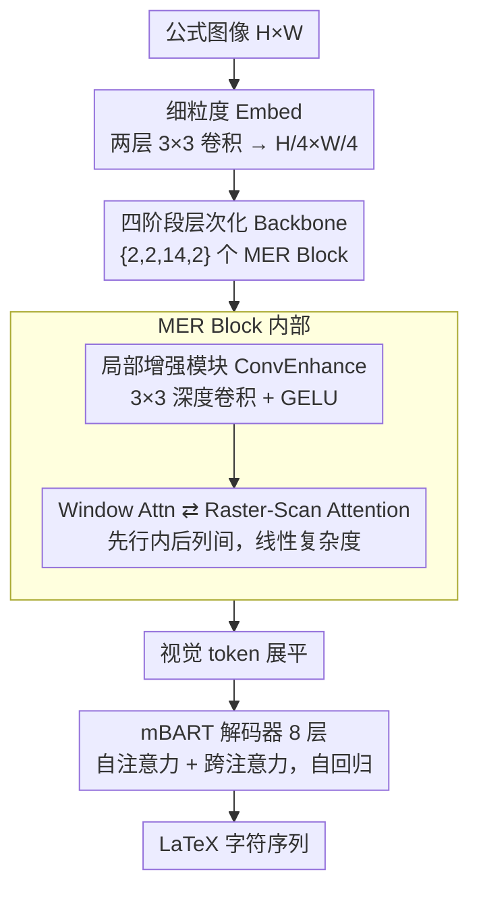

# UniMERNet: A Universal Network for Real-World Mathematical Expression Recognition

**会议**: CVPR 2026  
**论文**: [CVF Open Access](https://openaccess.thecvf.com/content/CVPR2026/html/Gu_UniMERNet_A_Universal_Network_for_Real-World_Mathematical_Expression_Recognition_CVPR_2026_paper.html)  
**领域**: 数学表达式识别 / 文档 OCR  
**关键词**: 公式识别, Raster-Scan Attention, 注意力分解, 百万级数据集, 视觉编码器

## 一句话总结
UniMERNet 把公式图像转 LaTeX 这件事重新做了一遍：它构造了百万级、覆盖四类真实场景的 UniMER-1M 数据集，并基于「解码器注意力天然呈光栅扫描（先横后纵）」这一观察，提出 Raster-Scan Attention 把二维注意力拆成水平、垂直两次一维计算，把复杂度从 $O(NH^2W^2D)$ 降到 $O(NHWD(H+W))$，在 313M 参数下推理省 ~10× 显存、快 5×，同时四个真实场景的 CDM 全面超过 Texify、GOT 乃至 72B/78B 的多模态大模型。

## 研究背景与动机

**领域现状**：数学表达式识别（MER）是把公式截图转成 LaTeX/Markdown 的任务，是科学文献解析、为大模型喂数学语料、多模态理解的关键前置环节。社区对一个好用的 MER 工具有三条硬要求：识别准、算得快、泛化强（尤其在真实世界各种字体/背景/长公式下要稳）。

**现有痛点**：开源专用模型（Pix2tex、Texify、CAN 等）大多只在简单手写公式或干净印刷体上训练，数据单一，碰到真实场景里的复杂长公式就崩；基于 Donut 的通用文档模型（Nougat、GOT）没有专门为公式优化，结构化解析吃力。另一边，GPT-4o、Qwen2.5-VL、InternVL2.5 这类多模态大模型靠海量参数泛化更好，但没专门适配公式识别，高精度和实时性都落后于专用模型，而且动辄要 8 卡分布式推理。

**核心矛盾**：现有注意力机制和公式这种「密集、严格二维布局、有阅读顺序」的数据天然不匹配。全局自注意力能建模长程依赖，但对高分辨率公式图代价是平方级的计算冗余；Swin 这类局部窗口注意力省算力却感受野受限，抓不到跨行的长程关系。准确率和效率被卡在 trade-off 上。

**本文目标**：做一个高精度、低成本、能覆盖真实场景的开源 MER 方案，需要同时解决两件事——训练数据不够多样、注意力机制不够契合公式结构。

**切入角度**：作者去观察一个已经训好的 mBART 解码器在预测公式时的跨模态注意力分布，发现一个很强的规律：模型的注意力总是精准落在「下一个要预测的字符」上，整体轨迹是从左到右、到行末再跳到下一行行首——一条标准的光栅扫描（raster-scan）路径，和人类阅读习惯完全一致。这说明模型其实已经自主学到了符号间的二维空间关系，那么强行用全局注意力让每个位置都看遍全图，大量计算就是浪费的。

**核心 idea**：既然公式信息流是「先横后纵」的顺序结构，那就把二维注意力沿这两个正交方向分解成两次一维注意力（行内 + 列间），用与阅读顺序对齐的归纳偏置换来线性复杂度，做到「算得像全局注意力一样准，但代价小一个量级」。

## 方法详解

### 整体框架
UniMERNet 是一个双流编码器–解码器结构：输入一张公式图，视觉编码器先把它压成层次化的视觉特征 token，解码器（mBART）再自回归地把这些 token 翻译成 LaTeX 字符序列。整个方法的灵魂在编码器——它由一系列「MER block」堆叠而成，每个 block 交替使用窗口注意力（抓局部细节）和本文提出的 Raster-Scan Attention（用先横后纵的一维分解抓全局长程依赖），并在注意力/MLP 前插入轻量卷积增强模块补足局部感知。配合百万级、覆盖四类真实场景的 UniMER-1M 训练数据，模型在精度和效率上同时拿到收益。

### 关键设计

**1. Raster-Scan Attention：把二维注意力沿阅读顺序拆成横、纵两次一维计算**

这是全文的核心，针对的就是「全局注意力平方级冗余、局部窗口又看不远」这个矛盾。作者基于解码器注意力呈光栅扫描的观察，把标准二维注意力分解成两个正交的一维 pass：先做**行内注意力（Row-wise）**，再做**列间注意力（Column-wise）**。对特征图 $X \in \mathbb{R}^{H\times W\times C}$，先线性投影出 $Q,K,V$，转置成按行组织后在每一行内部算注意力：

$$A_w = \mathrm{softmax}\!\left(\frac{Q_w K_w^{\top}}{\sqrt{D}}\right) \in \mathbb{R}^{N\times H\times W\times W}, \quad V'_w = A_w V_w$$

这一步建模每一行内字符序列的横向依赖，复杂度 $O(NHWDW)$。然后把行内结果转置成按列组织，沿垂直方向再算一次：

$$A_h = \mathrm{softmax}\!\left(\frac{Q_h K_h^{\top}}{\sqrt{D}}\right) \in \mathbb{R}^{N\times W\times H\times H}, \quad \mathrm{Attention_{final}} = A_h V_h$$

这一步复杂度 $O(NHWDH)$，负责跨行关系（多行公式必须靠它）。两步串起来，总复杂度从全局注意力的 $O(NH^2W^2D)$ 降到 $O(NHWD(H+W))$——对图像尺寸从平方变成线性。它之所以有效有三层：(i) 横向优先的顺序和公式阅读流一致，提供了一个有用的归纳偏置；(ii) 「先字符序列、再结构关系」两步天然吻合公式的层次结构；(iii) 线性复杂度让模型能直接吃 $384\times1344$ 这种高分辨率长公式输入而几乎不增成本。和 CCNet 的 criss-cross（同时收集行列）、Axial-DeepLab 的独立轴向分解相比，R-S Attention 的关键区别是**顺序性**——先横后纵的串行流，更贴合 MER 严格的阅读顺序约束；消融里把顺序反过来（V→H）在 CPE 上就掉点（0.948 vs 0.952 CDM），印证了这个阅读顺序偏置确实有用。

**2. 带 MER Block 与卷积增强的层次化视觉编码器：在一个 block 里同时拿到局部细节和全局长程**

光有 R-S Attention 还不够，公式识别既要看清单个符号的笔画细节（局部），又要建模跨行跨结构的关系（全局）。编码器借鉴 Donut/Nougat 的层次结构：先用两层 $3\times3$ 卷积的细粒度 embedding 把 $H\times W$ 图降到 $H/4\times W/4$、维度 $C$；再经四阶段骨干网络（含 overlapping patch embedding）逐级下采样到 $H/32\times W/32$、维度 $8C$，四个阶段分别放 $\{2,2,14,2\}$ 个 MER block。每个 MER block 是标准 Transformer 结构，但**交替使用 Window Attention 和 R-S Attention**——窗口注意力管局部、R-S 管全局，两者轮流融合。此外在每个注意力/MLP 模块前加一个 **ConvEnhance**（$3\times3$ 深度卷积 + GELU）补局部感知。消融显示加 ConvE 在所有子集上都稳定小幅提升，说明卷积的局部先验和注意力的全局建模是互补而非冗余。

**3. UniMER-1M 数据集 + 分层采样：用「足够多样」的数据治泛化病**

真实场景泛化差的根因之一是数据太单一——现有公式数据集要么印刷体太规整、要么手写公式很少超过 256 字符，长度和复杂度分布严重失衡。作者构造了 UniMER-1M（1,061,791 个 LaTeX–图像对），并配套 UniMER-Test（23,757 样本）覆盖四类真实场景：SPE（简单印刷）、CPE（复杂长印刷）、SCE（屏幕/文档截图，字体不一、有噪声形变）、HWE（手写）。关键不只是「量大」，而是用**分层采样（stratified sampling）**同时按公式长度和结构复杂度分层，从 arXiv、Wikipedia、StackExchange 等平台刻意纳入极短和极长的复杂样本，把长度分布拉平。消融（Table 4）很说明问题：只用 Pix2tex 训练，SPE 上 CDM 98.5% 但 CPE 只有 66.7%、HWE 33.6%（在简单数据上过拟合）；换成 UniMER-1M，CPE 直接从 66.5% 跳到 95.5%。这条设计单独就贡献了真实场景上的巨大增益。

### 损失函数 / 训练策略
PyTorch 实现，最大序列长度 1536，8×A100（80GB），batch size 64，AdamW + 线性 warmup 余弦退火，初始学习率 $1\times10^{-4}$（warmup 起点 $1\times10^{-5}$、最小 $1\times10^{-8}$），weight decay 0.05，在 UniMER-1M 上训练 500K 次迭代。输入图按公式平均长宽比 1:3.5 设计，baseline 编码器输入 $192\times672$，借 R-S Attention 的高效可扩到 $384\times1344$。数据增强含几何形变、高斯噪声等；分词用 Donut 的 BPE tokenizer 并加 LaTeX 专用 token（与 Texify 一致）。

## 实验关键数据

### 主实验
在 UniMER-Test 四个子集上用 CDM（渲染后按字符+空间匹配的视觉相似度，比 BLEU 更适合 MER）对比专用模型与多模态大模型：

| 类型 | 方法 | 参数 | FPS(bs=64) | SPE CDM | CPE CDM | SCE CDM | HWE CDM |
|------|------|------|-----------|---------|---------|---------|---------|
| 专用 | Pix2tex | 25M | - | 0.939 | 0.461 | 0.653 | 0.213 |
| 专用 | Texify | 312M | 8.05 | 0.985 | 0.706 | 0.799 | 0.534 |
| 专用 | GOT | 535M | 3.88 | 0.541 | 0.189 | 0.750 | 0.612 |
| 专用 | Mathpix(API) | - | - | 0.966 | 0.842 | 0.815 | 0.931 |
| 通用 | Qwen2.5-VL | 72B | - | 0.804 | 0.365 | 0.940 | 0.863 |
| 通用 | GPT-4o(API) | - | - | 0.962 | 0.783 | 0.920 | 0.836 |
| **本文** | **UniMERNet** | **313M** | **10.48** | **0.991** | **0.955** | **0.939** | **0.941** |
| **本文** | **UniMERNet†** | **313M** | **8.39** | **0.995** | **0.972** | **0.940** | **0.954** |

†为 $384\times1344$（2×）输入。与同样 Swin+mBART 架构的 Texify 相比，UniMERNet 在 SPE/CPE/SCE/HWE 上 CDM 分别 +1.0% / +26.6% / +14.1% / +42.0%；对参数量大两个数量级、要 8 卡推理的 72B/78B 大模型，UniMERNet 单卡 10.48 FPS、所有子集 CDM ≥94%，全面反超。

### 消融实验
注意力类型与 ConvE 模块的消融（编码器固定其余配置）：

| 注意力类型 | FPS(bs=64) | 显存(Max GPU) | CPE CDM | HWE CDM | 说明 |
|-----------|-----------|--------------|---------|---------|------|
| Global Attn | OOM | 3.2GiB(bs=1) | 0.943 | 0.939 | 准但 bs=64 直接 OOM |
| Window Attn | 5.9GiB | 1.6GiB | 0.931 | 0.929 | 省算力但感受野有限 |
| Criss-Cross Attn | 5.6GiB | 1.2GiB | 0.938 | 0.934 | 同时收行列 |
| Axial Attn | 5.9GiB | 1.6GiB | 0.930 | 0.926 | 独立轴向分解 |
| R-S Attn (V→H) | 5.6GiB | 1.2GiB | 0.948 | 0.938 | 顺序反向，掉点 |
| R-S Attn (ours) | 5.6GiB | 1.2GiB | 0.952 | 0.939 | 先横后纵 |
| R-S Attn w/ ConvE | 5.6GiB | 1.2GiB | **0.955** | **0.941** | 完整模型 |

### 关键发现
- **R-S Attention 是性价比之王**：相比 Global Attention，仅需 37% 显存、推理快 5×，CPE 上还 +1.2% CDM；Global 在 bs=64 时直接 OOM，而 R-S 能稳跑。
- **阅读顺序偏置真实存在**：把 H→V 反成 V→H，CPE 从 0.952 掉到 0.948，效率几乎不变——说明涨点来自顺序契合阅读习惯，不是单纯多算了一遍。
- **数据多样性比模型结构更能救泛化**：Table 4 中换上 UniMER-1M 后 CPE 从 66.5%→95.5%，是单项最大增益来源；ConvE 则是稳定的小幅锦上添花。
- **手写场景额外验证**：在 CROHME/HME100K 上对比 ICAL、SSAN 等专用手写模型，UniMERNet 即便不在对应训练集微调也能超过此前 SOTA，且多行手写越难领先越明显。

## 亮点与洞察
- **从「观察模型行为」反推架构设计**：先可视化解码器跨注意力发现光栅扫描规律，再据此设计编码器注意力——这种「让数据/模型告诉你该怎么设计归纳偏置」的路子，比凭空堆模块更有说服力，也解释了为什么 V→H 一反就掉点。
- **二维注意力分解不是新词，但「带顺序」是关键**：CCNet/Axial 早就做过行列分解，UniMERNet 的差异在于强调串行的「先横后纵」顺序，把 MER 特有的严格阅读顺序约束编码进注意力流，这个洞察可迁移到任何有强阅读顺序的密集 OCR 任务（如表格、乐谱、化学式）。
- **数据与架构双轮驱动、各管一摊**：消融清楚地把「泛化靠数据（UniMER-1M）、效率靠架构（R-S Attention）」拆开，避免了「不知道涨点到底来自哪」的常见模糊，复现和迁移时知道动哪个旋钮。
- **小模型打大模型的实用样本**：313M 单卡 10 FPS 全面压过 72B/78B 多模态大模型，说明在垂直任务上「专用结构 + 高质量数据」仍有巨大空间，不必盲目堆参数。

## 局限与展望
- **R-S Attention 依赖公式的强二维阅读顺序**，对版式极不规则、严重旋转或交错排布的公式，先横后纵的假设可能失效，论文未充分压测这类极端布局。
- **CDM 为主、BLEU 为辅的评测取舍**：作者认为同一公式有多种 LaTeX 写法使 BLEU 不可靠，主用 CDM/ExpRate；但 CDM 依赖渲染匹配，对渲染失败或罕见符号的鲁棒性如何，文中讨论不多。
- **数据与许可未在缓存中完全展开**：UniMER-1M 含来自 arXiv/Wikipedia/Mathpix 标注的样本，规模化采集与版权/标注一致性的细节是潜在工程风险点。
- **改进方向**：把「带顺序的轴向分解」推广到非笛卡尔阅读顺序（如从右到左语言、二维表格的混合顺序），或让顺序本身可学习/自适应，而非硬编码 H→V。

## 相关工作与启发
- **vs Texify（同架构 baseline）**：两者都是 Swin 风格编码器 + mBART 解码器，区别在 UniMERNet 用 R-S Attention 替换注意力、并换上 UniMER-1M 训练，结果四子集 CDM 全面领先（CPE +26.6%、HWE +42.0%），干净地证明了「换注意力 + 换数据」的合力。
- **vs Global / Window Attention**：Global 准但平方复杂度、bs 一大就 OOM；Window 省但感受野受限抓不到跨行。R-S 用线性复杂度同时拿到全局视野，是对这对 trade-off 的直接破解。
- **vs CCNet（criss-cross）/ Axial-DeepLab（轴向）**：都做行列分解，但它们是「同时收集」或「独立轴向」，缺少 MER 需要的严格阅读顺序；R-S 的串行先横后纵正是涨点关键（V→H 一反就掉）。
- **vs GPT-4o / Qwen2.5-VL 等多模态大模型**：大模型泛化强但未专门适配公式，高精度和实时性都不及专用模型；UniMERNet 用 1/200 的参数、单卡推理反超，提示垂直任务上专用化仍有巨大红利。

## 评分
- 新颖性: ⭐⭐⭐⭐ 「从解码器注意力光栅扫描反推编码器设计」的洞察很扎实，R-S 在轴向分解基础上引入阅读顺序串行性是有意义的增量。
- 实验充分度: ⭐⭐⭐⭐⭐ 四真实场景 + 注意力/顺序/ConvE/数据多维消融 + 手写 benchmark + 效率显存对比，证据链完整且自洽。
- 写作质量: ⭐⭐⭐⭐ 动机—观察—方法—验证逻辑清晰，复杂度推导和图表到位；部分符号转置细节略简。
- 价值: ⭐⭐⭐⭐⭐ 开源高精度低成本 MER 方案 + 百万级数据集 + 评测基准，对文档解析和喂大模型数学语料有直接落地价值。

<!-- RELATED:START -->

## 相关论文

- [\[CVPR 2026\] From Pixel to Precision: Enhancing Handwritten Mathematical Expression Recognition with Image-Level Reward](from_pixel_to_precision_enhancing_handwritten_mathematical_expression_recognitio.md)
- [\[CVPR 2026\] Crowdsourcing of Real-world Image Annotation via Visual Properties](crowdsourcing_of_real_world_image_annotation_via_visual_properties.md)
- [\[CVPR 2026\] Clair Obscur: an Illumination-Aware Method for Real-World Image Vectorization](clair_obscur_an_illumination-aware_method_for_real-world_image_vectorization.md)
- [\[CVPR 2026\] DREAM: Document Recognition with Explicit Adaptive Memory](dream_document_recognition_with_explicit_adaptive_memory.md)
- [\[NeurIPS 2025\] egoEMOTION: Egocentric Vision and Physiological Signals for Emotion and Personality Recognition in Real-World Tasks](../../NeurIPS2025/others/egoemotion_egocentric_vision_and_physiological_signals_for_emotion_and_personali.md)

<!-- RELATED:END -->
