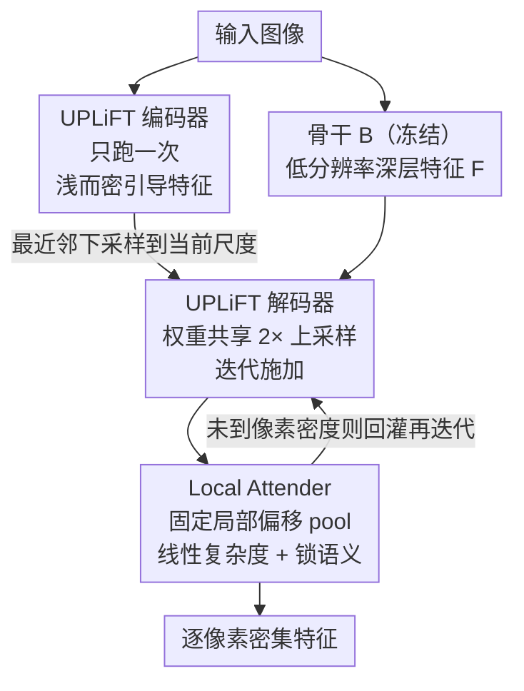

# UPLiFT: Efficient Pixel-Dense Feature Upsampling with Local Attenders

**会议**: CVPR 2026  
**论文**: [CVF Open Access](https://openaccess.thecvf.com/content/CVPR2026/html/Walmer_UPLiFT_Efficient_Pixel-Dense_Feature_Upsampling_with_Local_Attenders_CVPR_2026_paper.html)  
**代码**: https://github.com/mwalmer-umd/UPLiFT/ （有）  
**领域**: 表示学习 / 特征上采样 / 通用视觉  
**关键词**: 特征上采样、局部注意力、线性复杂度、DINOv2、VAE 特征

## 一句话总结
UPLiFT 用一个权重共享的卷积式 2× 解码器迭代地把预训练骨干（如 DINOv2）的低分辨率特征上采样到逐像素密度，并提出一个完全基于固定局部偏移的 **Local Attender** 算子来取代跨注意力，从而在保持特征语义一致、避免「迭代上采样语义漂移」的同时把复杂度从二次降到线性——在分割/深度估计上超过所有现有上采样器，速度还更快。

## 研究背景与动机
**领域现状**：DINOv2、CLIP、SigLIP 这类预训练 ViT 骨干是密集视觉任务的强力起点，但 ViT 为了构造 token 必须对空间维度做下采样，输出特征图天然稀疏（如 448×448 输入只得到 32×32 特征）。很多任务（分割、深度、超分）又需要密集特征。直接提高 ViT 的 token 密度可以得到更密的特征，但自注意力随 token 数 **二次** 增长，代价高得离谱。于是出现了一类「任务无关的特征超分辨率」方法：作为即插即用的 add-on，把骨干的粗特征学习性地变密，复用骨干语义又绕开二次成本。

**现有痛点**：这条线有两个流派，各有死穴。早期的迭代式方法（FeatUp、LiFT）用简单模块多次 2× 上采样，便宜、轻量，但 LiFT 反复迭代到像素级时会发生 **语义漂移（semantic drift）**——每迭代一步特征分布就偏离骨干一点，越叠越糊，下游性能塌方（论文里 LiFT 迭代到像素级反而不如只做一次 2× 再双线性）。近期的跨注意力流派（LoftUp、JAFAR、AnyUp）用高分辨率 query 去 pool 低分辨率 key/value，效果强、还能任意尺寸，但它们又掉回 ViT 的老坑：跨注意力对 token 数 **二次** 缩放，时间和显存都炸，AnyUp 即使改成窗口注意力仍是二次。

**核心矛盾**：「特征语义稳定」和「线性可扩展」似乎二选一——跨注意力靠「输出必须是输入特征的线性组合」这条隐式约束稳住了语义分布，但这种全局 pool 正是二次成本的来源；迭代式便宜却稳不住语义。

**本文目标**：造一个既线性可扩展、又能稳住特征语义的迭代式上采样器，同时把适用面从预测任务（分割/深度）扩到生成任务（VAE 隐特征上采样、文生图、超分）。

**切入角度**：作者注意到一个观察（来自 [44]）——ViT 里有些自注意力头总是学会「按固定方向偏移去 attend 局部位置」。既然注意力的有效部分常常就是局部、固定方向的 pool，那何必算全局跨注意力？只用局部邻域信息就足够上采样一个图像区域内的特征。

**核心 idea**：用一个**完全基于固定局部偏移定义、抛弃 Query-Key-Value 范式**的 Local Attender 算子来做特征 pool——它保留「输出是输入特征局部线性组合」这条语义正则约束（所以不漂移），但因为邻域大小是常数，复杂度对 token 数严格线性。

## 方法详解

### 整体框架
UPLiFT 在推理时由两个简单卷积模块组成：**UPLiFT 编码器 $E_{\text{UPLiFT}}$** 和 **UPLiFT 解码器 $D_{\text{UPLiFT}}$**。骨干 $B$（冻结）对输入图像产出低分辨率深层特征；$E_{\text{UPLiFT}}$ 对原图**只跑一次**，产出一张「浅而密」、保持原始像素密度的引导特征图（shallow high-res features）。然后 $D_{\text{UPLiFT}}$ 这个**单一、权重共享**的 2× 上采样器被**反复施加**：每一步把当前低分辨率特征上采样 2×，而每一步都用从 $E_{\text{UPLiFT}}$ 引导特征上「最近邻下采样到对应尺寸」的那张图来引导，直到把骨干特征推到逐像素密度。解码器的**最后一步**接上 Local Attender 算子来真正完成上采样并锁住语义分布。

与 LiFT 的关键区别是效率：LiFT 每一步都要把双线性放大的输入图重新过一遍图像编码器（成本随步数累积）；UPLiFT 把编码器做成「一次跑出全分辨率引导特征、之后只是下采样取用」，所以编码器只跑一次。

### 关键设计

**1. Local Attender：用固定方向偏移的局部 pool 取代 QKV 跨注意力**

这是全文的核心，针对「跨注意力稳语义但二次缩放、迭代式便宜但语义漂移」这对矛盾。算子吃两张特征图：**引导特征 $G$**（高分辨率，通道 $C_G$）和**值特征 $V$**（低分辨率，通道 $C_V$）。它先固定一个**邻域 $N$**——一组 2D 整数方向偏移 $(i,j)$ 的集合，令 $\|N\|=n$。对 $V$ 里位置 $(x,y)$ 的 token $V_{x,y}$，它**只能** attend 到 $V_{x+i,y+j},\ (i,j)\in N$ 这些固定偏移位置。$N$ 的形状和大小可灵活设计（论文在附录里试了多种邻域）。

机制上，整个算子**只有一个可学习元素**：对 $G$ 施加一个 $1\times1$ 卷积把它变成 $H\times W\times n$，再做逐位置 softmax 得到「Attender Map」$A$。$A_{x,y,k}$ 就是要施加在 $V_{x+i_k,y+j_k}$ 上的注意力权重（$(i_k,j_k)$ 是 $N$ 的第 $k$ 个偏移）。实现上，把 $N$ 里每个偏移对 $V$ 做带复制填充（replication padding）的平移，得到 $n$ 张「偏移值特征图」，乘上 $A$ 后沿新加的「邻域维」求和，就得到形状 $H\times W\times C_V$ 的局部注意力特征。设 $G$ 的空间 token 数为 $T$，则成本为

$$\mathcal{O}(nT)$$

由于 $n$ 是常数，这就是对 $T$ **严格线性**——这正是它打败二次跨注意力的根因。

为什么它还能稳住语义？因为输出永远是 $V$ 内特征的**凸/线性组合**（softmax 权重之和为 1），这复刻了跨注意力那条隐式正则——「上采样结果必须是输入特征的线性组合」，所以特征分布不会在迭代中漂走。同时，所有操作都以「当前 token 的相对位置」定义，**不需要位置编码**。和 AnyUp 的窗口注意力相比，后者仍要算 QKV、仍是二次；Local Attender 把注意力权重直接由 $G$ 的 $1\times1$ 卷积预测出来，邻域固定，所以是线性。

**2. 让 Local Attender 兼任上采样算子：把引导特征切成 $c\times c$ 单元格**

上面的初始形式里 $G$ 和 $V$ 空间尺寸相同，只能 pool 不能放大。要让它同时承担上采样，作者放宽假设：令 $V$ 为 $H\times W\times C_V$、$G$ 为 $cH\times cW\times C_G$（$c\in\mathbb{Z}$）。把 $G$ 的 token 按 $c\times c$ 分组成一个 $H\times W$ 网格的「单元格」；对单元格 $C_{x,y}$ 里的所有 token，其邻域都围绕对应的值 token $V_{x,y}$ 定义。这样邻域大小不变，但 $V$ 的每个 token 现在对应 $G$ 里一个 $c\times c$ 单元格，输出尺寸由 $G$ 决定，最终得到 $cH\times cW\times C_V$ 的放大特征。

这个设计精巧在：它**没有引入额外可学习参数**就把「pool」升级成了「带上采样的 pool」，而且输出依然是 $V$ 内特征的线性和——既放大了分辨率又保证了特征一致性。UPLiFT 把它放在解码器最后一步：用解码器初步输出当 $G$、用**原始骨干特征**当 $V$，于是无论迭代多少步，输出特征始终被锚定在骨干特征分布上，这就是它根治 LiFT 语义漂移的机制。

**3. 多步、多深度的自监督重建训练：让模型在训练时就经历「迭代上采样」**

针对「LiFT 训练只学单步、推理却要叠很多步导致误差累积」的痛点，UPLiFT 在训练目标里**显式包含多次解码器施加**。给定一张最高分辨率图 $I$（$H\times W$）和一个训练深度 $d$，把图下采样 $2^d$ 倍得到 $I'$；用骨干 $B$ 抽出高/低分辨率特征 $F=B(I)$、$F'=B(I')$，再用 $E_U$ 从 $I'$ 抽引导特征 $F'_E$。然后从 $F'$ 出发，$D_U$ + Local Attender 连续上采样 $d$ 次得到 $F'_{2^d\times}$（尺寸回到与 $F$ 一致），最简单的目标就是

$$L_{\text{simple}}=D_{L2}(F'_{2^d\times},\,F)$$

更进一步，每个中间上采样步都能取出中间特征图，和「把 $I$ 下采样到对应中间分辨率再过骨干」得到的中间真值比，给出逐级的中间损失：

$$L_d=\sum_{k=1}^{d} D_{L2}\!\left(F'_{1/2^{d-k}},\,F_{1/2^{d-k}}\right)$$

作者发现训练时混用多个深度效果最好，主结果用 $d\in D:=\{1,2,3\}$，最终目标 $L_{\text{UPLiFT}}=\sum_{d\in D} L_d$。这种「训练即多步」的安排让 UPLiFT 学会在推理时稳定地连续上采样，是它相对 LiFT 不漂移的训练侧保障。所有解码器 $D_U$ 共享同一套权重。

### 损失函数 / 训练策略
预测任务：DINOv2-S/14 骨干，ImageNet-1K 训 1 epoch，最大真值图 448、最大输入图 224，多步损失 3 个深度。生成任务：为保住特征分布需要更大的 UPLiFT 模型（但仍只有对应 CFM 参数量的 1/2 ~ 1/6），在 Unsplash-Lite（25k 图）训 5 epoch，最大真值图 1024、4 个深度，用 SD1.5 的 VAE 做编解码。

## 实验关键数据

### 主实验：分割与深度估计（DINOv2-S/14，448×448）
UPLiFT 在四个分割数据集上 mIoU/Acc 全部第一，且推理比所有高性能上采样器都快；深度估计上 RMSE 并列最佳、$\delta_1$ 第二。

| 上采样器 | 参数(M) | 时间(ms) | COCO mIoU↑ | VOC mIoU↑ | ADE20K mIoU↑ | Cityscapes mIoU↑ | 深度 δ1↑ | 深度 RMSE↓ |
|---|---|---|---|---|---|---|---|---|
| Bilinear | – | 2.8 | 59.41 | 81.62 | 40.43 | 59.71 | 58.83 | 0.68 |
| LiFT（迭代到像素级） | 1.2 | 51.9 | 57.42 | 80.97 | 38.95 | 61.98 | 55.07 | 0.73 |
| FeatUp | 0.2 | 109.6 | 61.77 | 83.52 | 42.07 | 60.50 | 60.01 | 0.66 |
| LoftUp | 4.3 | 223.5 | 62.19 | 84.63 | 42.16 | 62.09 | 58.69 | 0.68 |
| JAFAR | 0.7 | 111.7 | 61.71 | 84.38 | 41.96 | 61.89 | 60.59 | 0.65 |
| AnyUp | 0.9 | 146.7 | 62.08 | 84.33 | 42.25 | 61.33 | **61.32** | **0.63** |
| **UPLiFT** | 0.8 | **79.4** | **62.55** | **85.21** | **42.97** | **65.38** | 61.16 | **0.63** |

关键看点：UPLiFT 只用 0.8M 参数、79.4ms，就在分割上全面超过 4.3M/223.5ms 的 LoftUp；它的迭代式在 Cityscapes 上把次优 LiFT 的 61.98 直接拉到 65.38，证明「Local Attender 治好语义漂移」是实打实的。深度估计本该利好能 pool 全局的跨注意力方法，但只用局部信息的 UPLiFT 仍打平 AnyUp，说明骨干特征里的全局信息已足够，无需全局 pool。

### 效率与缩放
| 配置 | 现象 |
|---|---|
| 448×448（1024 token） | UPLiFT 79.4ms，比 LoftUp 223.5ms 快约 2.8× |
| ≈1500 token（624×624） | LoftUp/JAFAR/AnyUp 全部 24GB 显存 OOM；UPLiFT 比它们快 2.5–5× |
| 最大可处理 | UPLiFT 可上采样到 2601 visual token 不爆显存 |

跨注意力方法时间/显存随 token 数二次增长，UPLiFT 线性增长——图越大优势越夸张，这是 Local Attender 设计的直接收益。

### 生成任务：VAE 隐特征上采样
| 任务 / 数据 | 方法 | 参数(M) | 速度 | 质量 |
|---|---|---|---|---|
| 文生图 COCO-5k 512→1024 | CFM-20 | 306 | 8.79 s/img | FID 28.81 |
| 文生图 COCO-5k 512→1024 | **UPLiFT** | **53** | **5.15 s/img** | **FID 24.23** |
| 超分 LHQ 256→1024 | CFM(50 iters) | 306 | – | SSIM 0.69 / PSNR 25.69 |
| 超分 LHQ 256→1024 | **UPLiFT(2 iters)** | **53** | 271 ms/img | **SSIM 0.73 / PSNR 26.70** |

UPLiFT 用 1/6 参数、约 1/200 训练数据、仅 2 步迭代，就在文生图上 FID 更低、延迟降 41%；超分上 SSIM/PSNR 超过专门为该数据集训练的 CFM，而推理只比「在隐空间直接双线性」慢 13%，质量却高一个数量级。注意 CFM 是逐数据集训练的专用模块，UPLiFT 用的是同一个通用模型。

### 关键发现
- **Local Attender 是性能与效率的双引擎**：它让迭代式上采样在分割上反超跨注意力（消除了 LiFT 的语义漂移），又把复杂度压到线性（图大时快 2.5–5× 且不 OOM）。
- **局部信息足够做密集预测**：深度估计这种「需要全局理解」的任务里，纯局部 pool 的 UPLiFT 仍打平能 pool 全局的 AnyUp，说明全局语义已被骨干特征承载，上采样器无需再做全局注意力。
- **训练即多步**很关键：把多次解码器施加 + 多深度损失放进训练，是迭代到像素级却不退化的训练侧保障。

## 亮点与洞察
- **把「注意力」拆成「固定偏移 + 一张 1×1 卷积预测的权重图」**：抛弃 QKV，邻域固定使复杂度恒为 $\mathcal{O}(nT)$，却保留了「输出是输入特征线性组合」这条最值钱的正则约束——这是用最小代价拿到跨注意力核心收益的典型范例，可迁移到任何「需要内容自适应局部 pool」的场景。
- **复用「输入图本身就是高分辨率信息源」的直觉，但把编码器从「每步重跑」改成「跑一次再下采样取用」**，是一个朴素却显著的效率优化。
- **一个通用模块打多个专用模块**：生成任务里用同一个 UPLiFT 既做文生图上采样又做多数据集超分，对比逐数据集训练的 CFM 仍占优，凸显 task-agnostic 上采样器的实用价值。
- **二次 → 线性的工程意义**：把可处理 token 上限从 ~1500 推到 2601，意味着这类上采样器第一次能跑到更大图而不爆显存，对高分辨率部署很实在。

## 局限与展望
- **固定步长牺牲了灵活性**：UPLiFT 只能按 2× 整数步迭代，不能像跨注意力那样直接上采样到任意目标尺寸（作者承认这点，但认为多数应用只需逐像素密度，影响不大）。
- **邻域 $N$ 的设计是超参**：邻域形状/大小要预先设定，论文把多邻域消融放在附录，正文未给出敏感性的清晰画面，实际换骨干或任务时可能需要重新调。
- **生成任务要更大模型**：为保住 VAE 特征分布，生成版 UPLiFT 必须放大（虽仍小于 CFM），说明「线性 + 局部」在分布更复杂的隐空间上需要更多容量补偿。
- **可改进方向**：让邻域/步长可学习或自适应输入尺度，或把 Local Attender 直接塞回骨干内部做高效密集骨干，而不仅作为外挂上采样器。

## 相关工作与启发
- **vs LiFT**：同属迭代式、同样用「输入图引导上采样」的直觉，但 LiFT 每步重跑图像编码器且迭代会语义漂移；UPLiFT 编码器只跑一次、并用 Local Attender 把输出锚定在骨干特征分布上，所以能迭代到像素级仍不退化，分割反超 LiFT 一大截。
- **vs FeatUp**：FeatUp 的隐式网络质量高但要为每张图训一个隐式模型、推理 109.6ms 且参数小但慢；UPLiFT 单一权重共享模块、推理 79.4ms 且质量更高。
- **vs LoftUp / JAFAR**：它们用高分辨率 query pool 低分辨率 KV，靠「线性组合」约束稳语义，但 QKV 跨注意力二次缩放；UPLiFT 保留同样的正则约束却把注意力局部化到固定偏移，复杂度线性，更快更省显存。
- **vs AnyUp**：AnyUp 也假设「只需局部信息」并改用窗口注意力，但窗口注意力仍是二次；UPLiFT 的 Local Attender 才真正做到线性。
- **vs CFM（生成侧 SOTA）**：CFM 用流匹配在「解码到像素→双线性放大→重编码」基础上细化高分辨率隐特征，参数/数据/迭代都重；UPLiFT 直接在隐空间局部上采样，用 1/6 参数、约 1/200 数据、2 步就拿到相当甚至更好的视觉质量与更低延迟。

## 评分
- 新颖性: ⭐⭐⭐⭐ Local Attender 用「固定偏移 + 1×1 卷积权重」重铸注意力 pool，在保留跨注意力正则约束的同时做到线性复杂度，思路干净且有效。
- 实验充分度: ⭐⭐⭐⭐ 覆盖分割/深度/文生图/超分四类任务、多个数据集、参数与速度都报，效率缩放曲线也给了；邻域与深度消融放附录略减正文说服力。
- 写作质量: ⭐⭐⭐⭐ 动机—矛盾—方法链条清晰，Local Attender 的两阶段推导（pool→兼任上采样）讲得明白，公式与图配合到位。
- 价值: ⭐⭐⭐⭐ task-agnostic 上采样器的实用痛点（二次缩放、语义漂移）被一并解掉，单模块通用、可即插即用，对高分辨率密集任务部署有直接价值。

<!-- RELATED:START -->

## 相关论文

- [\[CVPR 2026\] NAF: Zero-Shot Feature Upsampling via Neighborhood Attention Filtering](naf_zero-shot_feature_upsampling_via_neighborhood_attention_filtering.md)
- [\[CVPR 2026\] Upsample Anything: A Simple and Hard to Beat Baseline for Feature Upsampling](upsample_anything_a_simple_and_hard_to_beat_baseline_for_feature_upsampling.md)
- [\[ICLR 2026\] AnyUp: Universal Feature Upsampling](../../ICLR2026/others/anyup_universal_feature_upsampling.md)
- [\[CVPR 2026\] From Pixel to Precision: Enhancing Handwritten Mathematical Expression Recognition with Image-Level Reward](from_pixel_to_precision_enhancing_handwritten_mathematical_expression_recognitio.md)
- [\[CVPR 2026\] ALLNet: Multi-task Dense Prediction for Degraded Images](allnet_multi-task_dense_prediction_for_degraded_images.md)

<!-- RELATED:END -->
