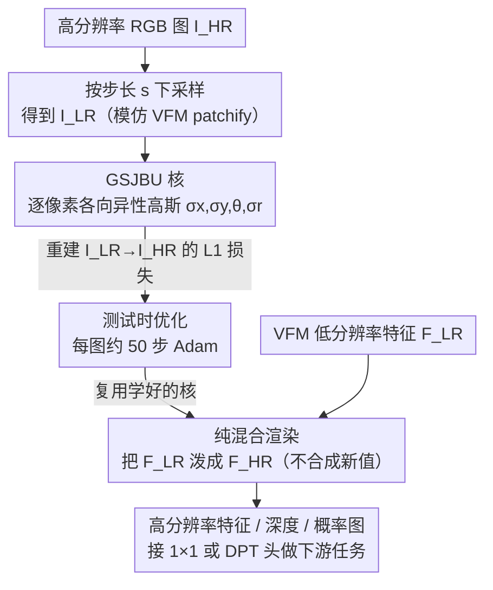

# Upsample Anything: A Simple and Hard to Beat Baseline for Feature Upsampling

**会议**: CVPR 2026  
**论文**: [CVF Open Access](https://openaccess.thecvf.com/content/CVPR2026/html/Seo_Upsample_Anything_A_Simple_and_Hard_to_Beat_Baseline_for_CVPR_2026_paper.html)  
**代码**: https://seominseok0429.github.io/Upsample-Anything/ (项目页)  
**领域**: 通用视觉 / 特征上采样  
**关键词**: 特征上采样, 测试时优化, 联合双边上采样, 高斯泼溅, 视觉基础模型

## 一句话总结
Upsample Anything 把经典联合双边上采样（JBU）和 2D 高斯泼溅统一成一个逐像素各向异性高斯核，靠每张图各跑 50 步「RGB 自重建」的测试时优化学出这套核，再把核原封不动搬到基础模型的低分辨率特征上做纯混合上采样——不需要任何数据集级训练、224×224 图只要约 0.419 秒，却在分割、深度、深度图/概率图上采样上全面达到或逼近 SOTA。

## 研究背景与动机
**领域现状**：DINO、CLIP、SigLIP、MAE 这类视觉基础模型（VFM）给出了通用、语义丰富的特征，但 ViT 主干会把特征下采样 14×/16×，CNN 主干靠多级 pooling 也类似。结果是特征图空间分辨率太低，做分割、深度这类逐像素任务时必须接 DPT、UPerNet、SegFormer 这样又大又重的解码器去「补回」空间细节。

**现有痛点**：为了不动编码器、只补特征分辨率，社区做了一批「特征上采样器」（FeatUp、LoftUp、JAFAR、AnyUp 等）。它们分两类：一类是数据集级训练，换个主干或换个数据集就得重训，而且显存吃紧、大多只能跑到 112–224 像素；另一类是测试时优化（FeatUp 的 Implicit 版），虽免了离线训练，但每张图要优化约 49 秒才收敛，慢到不实用。两条路都难同时满足「免训练、快、跨域稳」。

**核心矛盾**：上采样器要么把「知识」固化进网络权重里（于是绑死主干/数据集、迁移差），要么用纯优化换取通用性（于是奇慢）。本质矛盾是——前馈上采样器在「合成」新特征值，这让它既强大又脆弱，一旦域漂移就失准。

**本文目标**：要一个既不依赖数据集级训练、又能在一秒内完成、还能跨主干/跨模态（特征、深度、概率图甚至 3D）通用的上采样算子。

**切入角度**：作者回到 JBU 的老智慧——JBU 从不「编造」新值，它只学「邻居该按多大权重混合」，所以天生与模型/任务无关。但经典 JBU 用全局、各向同性的 $(\sigma_s,\sigma_r)$，在复杂结构附近表达力不足。如果能把这套「只混合不合成」的权重做成逐像素、各向异性、可微优化的，就能两头通吃。

**核心 idea**：把 JBU 重写成一个逐像素各向异性的 2D 高斯泼溅核（称 GSJBU），用「把 RGB 图从下采样版重建回去」这个自监督目标在测试时学出每个像素的核，再把核搬到特征空间做纯混合渲染。

## 方法详解

### 整体框架
Upsample Anything 分两步：先在 **RGB 图像域**做测试时优化（TTO），学一套逐像素高斯核；再把这套核搬到**特征域**做渲染上采样。关键在于：优化只用一张高分辨率 RGB 图自己监督自己，整个过程没碰任何标注、也没碰下游任务。

给一张高分辨率图 $I_{hr}$，先用步长 $s$ 双线性下采样得到 $I_{lr}$（模仿 VFM 的 patchify 下采样）；然后优化每像素的各向异性高斯参数 $\{\sigma_x,\sigma_y,\theta,\sigma_r\}$，让 GSJBU 从 $I_{lr}$ 重建回 $I_{hr}$。优化收敛后（默认仅 50 步），把学到的核 $\{\hat\sigma_x,\hat\sigma_y,\hat\theta,\hat\sigma_r\}$ 直接套到基础模型的低分辨率特征 $F_{lr}\in\mathbb{R}^{C\times H/s\times W/s}$ 上，用同一套各向异性权重把它泼成高分辨率特征 $F_{hr}\in\mathbb{R}^{C\times H\times W}$。因为混合权重只依赖「空间近 + 颜色相似」，这套核换主干、换模态都能用。

### 关键设计

**1. GSJBU：把 JBU 与 2D 高斯泼溅缝成逐像素各向异性核**

痛点是经典 JBU 用一组全局且各向同性的 $(\sigma_s,\sigma_r)$，在边界、细长结构附近表达力不够；而单纯的 2D 高斯泼溅（2DGS）虽连续可微，却因为缺少空间—值域约束、又是稠密表示，优化时既重又容易过平滑。作者把两者合一：给每个低分辨率位置 $q$ 配一个各向异性的空间协方差

$$\Sigma_q = R(\theta_q)\begin{bmatrix}\sigma_x^2(q) & 0\\ 0 & \sigma_y^2(q)\end{bmatrix}R^\top(\theta_q),\quad R(\theta_q)=\begin{bmatrix}\cos\theta_q & -\sin\theta_q\\ \sin\theta_q & \cos\theta_q\end{bmatrix}$$

对某个高分辨率坐标 $p$，空间权重与值域（引导）权重分别是 $\log w^s_{p\leftarrow q}=-\tfrac12 (p-\mu_q)^\top\Sigma_q^{-1}(p-\mu_q)$ 和 $\log w^r_{p\leftarrow q}=-\tfrac{\lVert I(p)-I(q)\rVert^2}{2\sigma_r^2(q)}$，最终归一化混合权重 $w_{p\leftarrow q}=\mathrm{softmax}_q\big(\log w^s_{p\leftarrow q}+\log w^r_{p\leftarrow q}\big)$。从几何上看，JBU 不过是「中心在 $q$、协方差为 $\sigma_s^2 I$ 的各向同性高斯」这一特例；GSJBU 把它推广成逐像素、可旋转、可拉伸的各向异性高斯，于是核能贴合局部朝向和尺度，边界保得更利落。这一步是全文的「核」——后面的优化和渲染都围着它转。

**2. 用 RGB 自重建做测试时优化，借 VFM 的 patchify 当监督信号**

难点在于：没有标注、没有配对训练数据，怎么学出每个像素的核？作者的观察是——VFM 本来就靠固定步长 patchify 把图下采样成低分辨率特征，那就**在 RGB 域模拟同样的下采样过程**：把 $I_{hr}$ 双线性下采样成 $I_{lr}$，再让 GSJBU 把它重建回去，损失就是最朴素的 L1：$\mathcal{L}_{TTO}=\lVert \text{GSJBU}(I_{lr})-I_{hr}\rVert_1$。直觉是：能把 RGB 高频细节正确「混」回来的核，必然学会了「在边界两侧该怎么取邻居、跨边界别乱混」这套局部混合规律，而这套规律和 RGB 同栅格的特征是共享的。参数初始化为 $\sigma_x=\sigma_y=16,\ \sigma_r=0.12,\ \theta=0$，用 Adam（lr=1e-3）只优化 50 步。这正是它比 FeatUp(Implicit) 的 49 秒快两个数量级的原因：监督信号现成（就是输入图本身）、参数少（每像素 4 个）、收敛极快。

**3. 纯混合渲染、零值合成——迁移性的真正来源**

特征渲染时，$F_{hr}(p)=\sum_{q\in\Omega(p)} w_{p\leftarrow q}\,F_{lr}(q)$，严格地只对已有的低分辨率特征做重加权，**不产生任何新内容**。这一点看似保守，却是它能跨主干、跨任务、跨模态的关键：因为核学的是「怎么混」而非「混成什么」，权重只依赖空间—值域相似度，所以同一套核既能泼 DINOv2 的特征，也能泼 ConvNeXt 的特征，甚至能直接泼原始深度图、分割概率图。与之相对，FeatUp/LoftUp/AnyUp 这类前馈上采样器在「合成」特征值，一旦遇到没见过的主干、分辨率或分布外数据就容易失准。换句话说，「不合成」既是它精度天花板的来源（无法无中生有出超分辨细节），也是它泛化下限的保障。

### 损失函数 / 训练策略
唯一的优化目标就是上面的 RGB 自重建 L1 损失 $\mathcal{L}_{TTO}=\lVert \text{GSJBU}(I_{lr})-I_{hr}\rVert_1$，没有任何可学习网络模块、没有数据增强、没有 batch。全程在整张高分辨率栅格上并行计算（纯 PyTorch，不切块）。默认每图 50 步 Adam，lr=1e-3。下游评测时，分割接一个 1×1 卷积线性头（作者把常规 10 epoch 延长到 100 epoch + cosine 衰减，因为发现浅头容易欠拟合），深度接一个去掉内部插值层的 DPT 风格头。

## 实验关键数据

### 主实验
语义分割（COCO / PASCAL-VOC / ADE20k，默认主干 DINOv2-S，线性探针）：

| 方法 | COCO mIoU | PASCAL-VOC mIoU | ADE20k mIoU |
|------|-----------|-----------------|-------------|
| Bilinear | 60.43 | 81.27 | 41.48 |
| FeatUp | 60.96 | 81.91 | 41.92 |
| AnyUp（前 SOTA） | 61.25 | 82.18 | 42.02 |
| **Upsample Anything** | **61.41** | **82.22** | **42.95** |
| Upsample Anything (prob.) | **63.40** | **84.57** | **44.29** |

深度 / 表面法向估计（NYUv2，冻结 DINOv2 + DPT 风格头）：

| 方法 | 深度 RMSE↓ | 深度 δ1↑ | 法向 Mean↓ | 法向 <11.25°↑ |
|------|-----------|----------|-----------|---------------|
| Bilinear | 0.545 | 0.804 | 23.8 | 33.0 |
| AnyUp | 0.513 | 0.817 | 22.2 | 36.8 |
| LoftUp | 0.796 | 0.789 | 28.9 | 25.0 |
| **Upsample Anything** | **0.498** | **0.829** | **21.5** | **38.1** |

### 消融实验
不同上采样策略的「速度—精度」权衡（PASCAL-VOC 分割 + NYUv2 深度）：

| 方法 | 时间(s) | VOC mIoU↑ | NYUv2 RMSE↓ |
|------|--------|-----------|-------------|
| Bilinear | 0.00009 | 81.27 | 0.545 |
| JBU（手工核） | 0.00600 | 81.65 | 0.531 |
| LIG（隐式优化） | 481.5 | 78.54 | 0.642 |
| 2DGS（无约束） | — | 易过平滑 | — |
| **GSJBU（本文）** | 0.4197 | **82.22** | **0.498** |

优化步数消融（PASCAL-VOC）：

| 迭代步数 | PSNR↑ | mIoU↑ | 时间(s) |
|---------|-------|-------|---------|
| 50 | 35.33 | **82.22** | 0.041 |
| 500 | 35.60 | 82.15 | 6.161 |
| 5000 | 35.60 | 82.17 | 61.458 |

分辨率—显存/时间扩展性（AnyUp vs 本文，单位 时间s / 峰值显存MB）：

| 分辨率 | AnyUp | Upsample Anything |
|--------|-------|-------------------|
| 224×224 | 0.0137 / 531 | 0.0419 / 3970 |
| 512×512 | 0.0893 / 10284 | 0.3211 / 20590 |
| 1024×1024 | **OOM** | 1.808 / 82256 |

### 关键发现
- **强主干下特征上采样的边际收益其实很小**：在 DINOv2 这类高容量主干上，各种上采样器相对 bilinear 的提升都不大（COCO 上从 60.43 到 61.41 量级），作者据此提出一个反直觉判断——主干够强时，「特征上采样到底帮了多少分割」值得重新审视。
- **几何任务比语义任务更吃精确上采样**：深度/法向估计上提升明显（RMSE 0.545→0.498、法向 <11.25° 33.0→38.1），说明精确上采样对几何类任务更关键。
- **PSNR 500 步就饱和，但分割精度反而 50 步最好**：迭代到 500 步 PSNR 收敛到 35.60，可下游分割在 50 步时反而最高（82.22）——过度优化重建会轻微伤害下游，于是默认就用 50 步（顺带换来 0.419s 的最快速度）。
- **线性扩展是它对 AnyUp 的硬优势**：AnyUp 的窗口注意力随分辨率二次增长，512×512 以上爆显存、1024×1024 直接 OOM；本文走纯泼溅、显存线性增长，1024×1024 仍能跑。
- **「升采样概率图而非特征」是个意外好用的范式**：prob. 变体在更小的概率栅格上算、计算量最低，分割精度却最高（ADE20k 42.95→44.29），提示一条新路子——直接上采样任务概率，而不是中间特征。

## 亮点与洞察
- **把一个 2003 年量级的经典滤波器（JBU）重新解释成 2D 高斯泼溅，并指出 JBU 是各向同性高斯泼溅的离散特例**——这个统一视角既漂亮又实用，让「免训练上采样」一下子有了可微、可逐像素优化的现代形态。
- **用「RGB 自重建」当免费监督信号**：不需要任何标注或配对数据，只靠输入图本身就能学出迁移到特征空间的混合核，这是整套方法又快又通用的根。
- **「只混合不合成」的设计哲学可迁移**：任何想要跨主干/跨模态稳定的密集预测后处理，都可以借鉴「学权重而非学值」的思路；论文也确实把同一管线直接用到了深度图上采样、概率图上采样。
- **特征相似度可视化揭示了一个隐藏好处**：本文上采样后的特征在跨图同类匹配上比 AnyUp 更有空间判别力（AnyUp 倾向整图高相似、缺乏区分），暗示它对小样本分割、类级特征匹配可能更有利。

## 局限与展望
- 作者承认在严重遮挡或低信噪比引导（RGB 模糊/噪声大）下，测试时优化会变得不稳定。
- 「纯混合不合成」的本质决定了它无法无中生有出真正的超分辨细节——当低分辨率特征本身已经丢掉某结构时，它没法恢复；这也是为什么在 NYUv2 深度图上采样上，因为 GT 本身偏平滑，bilinear 的 RMSE 反而更低（0.167 vs 0.214），但边缘锐度上本文明显更好。
- 每张图都要独立优化 50 步，虽然只要 0.419s，但相对前馈上采样器（AnyUp 在 224 上 0.0137s）仍慢一个量级，批量/视频场景下累计开销不小；显存在高分辨率下也偏大（1024×1024 达 82GB 级）。
- 评测主要在标准分割/深度 benchmark，3D 特征上采样在正文只是定性提及，缺少定量对照。改进方向：把每像素核做摊销预测（一次前馈出核、再少量微调）以兼顾速度，或引入对遮挡/噪声鲁棒的正则。

## 相关工作与启发
- **vs JBU（Joint Bilateral Upsampling）**：JBU 用全局、各向同性、手工固定的 $(\sigma_s,\sigma_r)$，免训练但质量受限于固定核。本文把核做成逐像素各向异性、可微优化，保留了 JBU「只混合不合成」的迁移性，同时大幅提升表达力——是 JBU 在 2DGS 框架下的连续、边缘感知扩展。
- **vs FeatUp**：FeatUp(JBU) 把 JBU 的值域核换成可学 MLP、需数据集级训练；FeatUp(Implicit) 把高分辨率特征参数化为隐式函数、每图优化但要约 49s。本文同属测试时优化，却只要 0.419s，靠的是「RGB 自重建 + 每像素仅 4 参数」而非隐式 MLP。
- **vs LoftUp / JAFAR / AnyUp**：这几者分别用跨注意力融合 RGB 坐标、联合注意力滤波、分辨率条件核，性能强但都依赖数据集级训练，换主干/分布外就掉点；AnyUp 还因稠密注意力在 512 以上 OOM。本文免训练、线性显存、跨域更稳，但绝对精度上在标准分割 benchmark 仅小幅领先（强主干下大家都接近 bilinear）。
- **vs 2DGS 基线**：直接拿 2D 高斯泼溅做特征插值缺少空间—值域约束，重且易过平滑；本文用 JBU 约束「驯服」了高斯优化，换来又快又稳。

## 评分
- 新颖性: ⭐⭐⭐⭐ 把 JBU 与 2DGS 统一成可微逐像素各向异性核、并用 RGB 自重建做监督，视角新颖且简洁，但每个零件都来自经典工具的重新组合。
- 实验充分度: ⭐⭐⭐⭐ 覆盖分割/深度/法向/深度图/概率图多任务、多主干、扩展性与步数消融齐全；3D 特征上采样仅定性、深度图上采样在 NYUv2 上 RMSE 反不如 bilinear 略显尴尬。
- 写作质量: ⭐⭐⭐⭐ 动机—统一视角—方法链条清晰，公式与图示到位；对「强主干下上采样收益有限」的诚实讨论加分。
- 价值: ⭐⭐⭐⭐⭐ 免训练、即插即用、跨主干跨模态、0.419s，作为「难以打败的简单 baseline」实用价值很高，且「升采样概率图」的范式提示有启发性。

<!-- RELATED:START -->

## 相关论文

- [\[CVPR 2026\] NAF: Zero-Shot Feature Upsampling via Neighborhood Attention Filtering](naf_zero-shot_feature_upsampling_via_neighborhood_attention_filtering.md)
- [\[CVPR 2026\] UPLiFT: Efficient Pixel-Dense Feature Upsampling with Local Attenders](uplift_efficient_pixel-dense_feature_upsampling_with_local_attenders.md)
- [\[ICLR 2026\] AnyUp: Universal Feature Upsampling](../../ICLR2026/others/anyup_universal_feature_upsampling.md)
- [\[AAAI 2026\] How Hard Is It to Rig a Tournament When Few Players Can Beat or Be Beaten by the Favorite?](../../AAAI2026/others/how_hard_is_it_to_rig_a_tournament_when_few_players_can_beat_or_be_beaten_by_the.md)
- [\[CVPR 2026\] Align Once to Explain: Feature Alignment for Scalable B-cosification of Foundational Vision Transformers](align_once_to_explain_feature_alignment_for_scalable_b-cosification_of_foundatio.md)

<!-- RELATED:END -->
