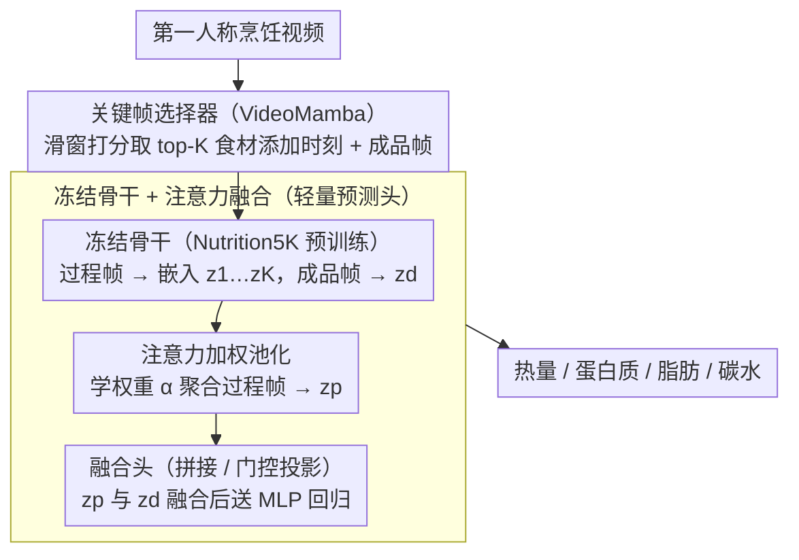

# V-Nutri: Dish-Level Nutrition Estimation from Egocentric Cooking Videos

**会议**: CVPR 2026  
**arXiv**: [2604.11913](https://arxiv.org/abs/2604.11913)  
**代码**: [https://github.com/K624-YCK/V-Nutri](https://github.com/K624-YCK/V-Nutri)  
**领域**: 食物计算 / 视频理解  
**关键词**: 营养估计, 第一人称视频, 关键帧选择, 多模态融合, 食物分析

## 一句话总结

提出 V-Nutri 框架，首次利用第一人称烹饪视频中的过程信息来辅助菜品营养估计，通过 VideoMamba 关键帧选择模块提取食材添加时刻，与最终成品图像融合来预测热量和宏量营养素。

## 研究背景与动机

**领域现状**：视觉营养估计方法主要依赖最终成品的单张图像来预测热量和营养成分，如 Nutrition5K 和 Im2Calories 等工作。

**现有痛点**：单张成品图像的信息本质上是有限的：油、酱汁、乳制品等营养重要成分在烹饪后会被吸收、融化或视觉融合到最终菜品中，使得仅从外观难以准确估计。

**核心矛盾**：营养关键信息在烹饪过程中逐步"消失"，但现有方法仅利用信息最少的最终状态。

**本文目标**：探索烹饪视频中的过程信息是否能为菜品级营养估计提供互补证据。

**切入角度**：第一人称烹饪视频保留了完整的时间营养证据（食材身份、添加事件、中间状态），且可穿戴相机的普及使这一方向越来越实用。

**核心 idea**：用关键帧选择模块从长视频中定位营养信息密集的时刻（如食材添加），与成品图像融合来提升营养估计准确性。

## 方法详解

### 整体框架

V-Nutri 想解决的核心问题是：油、酱汁、乳制品这些营养关键成分在烹饪后会被吸收或视觉融合，单看成品图像测不准热量和宏量营养素。它的思路是把第一人称烹饪视频里"食材正在被加入"的那几个时刻找出来，作为成品图像看不到的补充证据。

整条管线分三段走。先用一个轻量的关键帧选择器扫一遍长视频，挑出营养信息最密集的过程帧（食材添加时刻）和最终成品帧；再用一个在食物数据上预训练好的视觉骨干把这些帧编码成特征；最后由一个注意力加权的融合头把过程证据和成品特征聚合起来，送进 MLP 回归出热量、蛋白质、脂肪、碳水四个数值。整个过程只训练后半段的融合与回归部分，骨干保持冻结。此外，作者还在 HD-EPIC 上补标了视频级营养真值，搭出这个方向的首个评测基准（数据侧贡献，不在上面的推理管线里）。

### 关键设计

**1. VideoMamba 关键帧选择器：从冗长视频里挑出营养密集的稀疏时刻**

第一人称烹饪视频又长又冗余，大部分画面（搅拌、等待、走动）几乎不含营养信息，密集处理全序列既低效又会把噪声引进来。这里用 VideoMamba 的选择性状态空间模型做事件检测：滑动窗口把视频切成短片段，逐段判断是否出现食材添加这类候选事件，只把命中的时刻保留为过程关键帧。选用 VideoMamba 的关键在于它对序列长度是线性复杂度，正好适配"长且信息稀疏"的第一人称视频——既扫得动整段，又不必为每一帧都付出注意力的平方代价。

**2. 冻结的 Nutrition5K 骨干 + 注意力加权融合：在小数据下安全地聚合过程证据**

选出来的关键帧需要变成能预测营养的特征，但视频营养标注数据很少，从头训一个视觉编码器会过拟合。于是骨干直接复用在 Nutrition5K 上预训练好的网络（ResNet-101 / ViT-B / ViT-L）并冻结，把每个过程关键帧编码为嵌入 $z_1,\dots,z_K$、成品帧编码为 $z_d$。过程帧之间的重要性并不均等（真正加食材的那帧比中间状态更有信息），所以不是简单平均，而是学一组注意力权重 $\alpha_1,\dots,\alpha_K$ 做加权池化得到过程表示

$$z_p = \sum_{k=1}^{K} \alpha_k\, z_k,$$

再把 $z_p$ 与成品嵌入 $z_d$ 融合后送 MLP 回归——融合用拼接（直接 concat 两个嵌入）或门控投影（学一个标量门 $\sigma(w)$ 在两路特征间加权）两种方式之一。整个可学习部分只有注意力网络、融合门和回归头，参数量很小——这种"冻结骨干 + 轻量融合"的组合让模型在有限数据上既能利用食物领域的先验，又不至于过拟合。

**3. HD-EPIC 营养标注扩展：补出首个视频级营养估计基准**

这个方向之前没法做实验，是因为没有任何数据集把烹饪视频和菜品营养真值对应起来。作者在 HD-EPIC 数据集上补标了两类时间戳——烹饪过程中的关键帧（食材添加时刻）和最终成品帧，并配上菜品级的营养真值，从而把一段视频和它对应的热量/宏量营养素数值连起来。这套标注既给本文的训练和评测提供了落脚点，也成为第一个面向"过程感知营养估计"的可复现基准。

### 损失函数 / 训练策略

模型用标准回归损失（MAE / MSE）拟合四维营养向量 $\mathbf{y}_c = [y^{kcal}, y^{protein}, y^{fat}, y^{carb}]$。训练时骨干冻结，只更新注意力融合模块和 MLP 回归器，进一步压低在小规模数据上过拟合的风险。

## 实验关键数据

### 主实验

| 骨干 | 输入 | 热量 MAE↓ | 蛋白质 MAE↓ | 脂肪 MAE↓ | 碳水 MAE↓ |
|------|------|----------|-----------|----------|----------|
| ViT-L | 仅成品 | 185.3 | 12.1 | 9.8 | 18.5 |
| ViT-L | 成品+过程帧 | **172.8** | **11.2** | **9.1** | **17.3** |
| ViT-B | 仅成品 | 198.7 | 13.5 | 10.6 | 19.8 |
| ViT-B | 成品+过程帧 | 191.2 | 12.8 | 10.1 | 19.0 |
| ResNet-101 | 成品+过程帧 | 205.1 | 14.2 | 11.3 | 20.5 |

### 消融实验

| 配置 | 热量 MAE↓ | 说明 |
|------|----------|------|
| 完整模型 (ViT-L) | 172.8 | 成品+过程帧+事件检测 |
| 无事件检测(随机帧) | 182.1 | 随机选帧替代事件检测 |
| 仅成品帧 | 185.3 | 仅用最终成品 |
| 均匀采样过程帧 | 179.5 | 均匀采样替代事件检测 |

### 关键发现

- 过程关键帧的收益强烈依赖骨干表示能力：ViT-L 获益最大，ResNet-101 改善有限
- 事件检测质量是关键：随机帧的收益远小于检测到的食材添加帧
- 在受控条件下过程信息确实提供了互补营养证据

## 亮点与洞察

- "过程感知"的营养估计是一个合理且实用的研究方向：随着可穿戴相机的普及，利用烹饪视频进行营养监测是可行的
- 轻量融合策略（冻结骨干+注意力加权池化）避免了过拟合，适合数据量有限的场景

## 局限与展望

- HD-EPIC 数据集规模有限，泛化性验证不足
- 过程帧的收益在弱骨干上不明显，方法对骨干依赖性强
- 未考虑烹饪方式（煎、炸、蒸等）对营养变化的影响
- 可结合食材识别和份量估计进一步提升准确性

## 相关工作与启发

- **vs Nutrition5K**: Nutrition5K 仅用成品图像，V-Nutri 扩展到视频，利用过程信息补充成品不可见的营养线索
- **vs 长视频理解**: 本文不追求全序列理解，而是高效提取稀疏过程证据

## 评分

- 新颖性: ⭐⭐⭐⭐ 首次将烹饪视频过程信息引入营养估计
- 实验充分度: ⭐⭐⭐ 数据集规模有限，但消融较充分
- 写作质量: ⭐⭐⭐⭐ 问题定义清晰
- 价值: ⭐⭐⭐ 方向有意义但改善幅度有限

<!-- RELATED:START -->

## 相关论文

- [\[CVPR 2026\] OmniFood8K: Single-Image Nutrition Estimation via Hierarchical Frequency-Aligned Fusion](omnifood8k_nutrition_estimation.md)
- [\[CVPR 2026\] SimRecon: SimReady Compositional Scene Reconstruction from Real Videos](simrecon_simready_compositional_scene_reconstruction_from_real_videos.md)
- [\[ICLR 2026\] MOSIV: Multi-Object System Identification from Videos](../../ICLR2026/others/mosiv_multi-object_system_identification_from_videos.md)
- [\[CVPR 2026\] Shoe Style-Invariant and Ground-Aware Learning for Dense Foot Contact Estimation](shoe_style-invariant_and_ground-aware_learning_for_dense_foot_contact_estimation.md)
- [\[ICCV 2025\] Toward Material-Agnostic System Identification from Videos](../../ICCV2025/others/toward_material-agnostic_system_identification_from_videos.md)

<!-- RELATED:END -->
