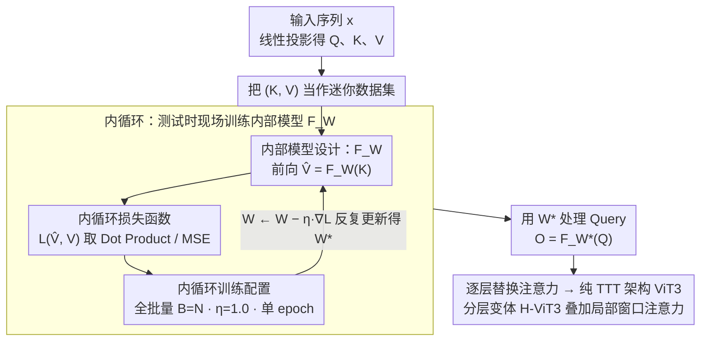

# ViT3: Unlocking Test-Time Training in Vision

**会议**: CVPR 2026 Oral  
**arXiv**: [2512.01643](https://arxiv.org/abs/2512.01643)  
**代码**: [GitHub](https://github.com/LeapLabTHU/ViTTT)  
**领域**: 高效架构 / 视觉序列建模  
**关键词**: Test-Time Training, 线性复杂度, 内部模型, 视觉Transformer, 卷积

## 一句话总结

系统性探索Test-Time Training（TTT）在视觉任务中的设计空间，总结六条实用设计洞察，提出ViT3——一个线性复杂度的纯TTT视觉架构，在分类/生成/检测/分割任务中匹配或超越Mamba和线性注意力方法。

## 研究背景与动机

Vision Transformer的二次复杂度O(N²)限制了长视觉序列的处理。TTT模型提供了一种新的线性复杂度路径：将注意力操作重新表述为在线学习问题——在测试时用Key-Value对作为"迷你数据集"训练一个紧凑的内部模型，然后用这个模型处理Query。

然而，TTT的设计空间巨大且探索不足：内部训练（损失函数、学习率、批量大小、epoch数）和内部模型（架构、大小）的选择缺乏系统理解。这导致了视觉TTT模型的性能被锁定，无法充分发挥其潜力。

## 方法详解

### 整体框架

ViT3 想把 Test-Time Training（TTT）真正用好在视觉上。TTT 的核心是把注意力重新表述成一个在线学习问题：每一层不再做 softmax 注意力，而是把当前序列的 Key-Value 对当成一个「迷你数据集」，在测试时现场训练一个紧凑的内部模型 $F_W$，再用训练好的 $F_{W^*}$ 去处理 Query 得到输出。宏观架构和 Transformer 一样（逐层把注意力换成 TTT 层），复杂度从 $O(N^2)$ 降到线性。难点不在框架，而在 TTT 巨大的设计空间（内循环用什么损失、学习率、批量、epoch，内部模型用什么架构、多大）此前缺乏系统理解，导致视觉 TTT 性能被锁死。这篇论文的贡献就是系统扫这个设计空间，提炼出六条洞察、收敛成三类核心设计（内循环损失函数 / 内循环训练配置 / 内部模型设计），据此搭出 ViT3。

下图是单个 TTT 层的数据流：把当前序列的 Key-Value 对喂进内循环，反复更新内部模型 $F_W$ 得到适配权重 $W^*$，再用 $W^*$ 处理 Query。三类核心设计正好是这条内循环上的三个旋钮——用什么损失、怎么更新、训练什么模型。

### 关键设计

**1. 内循环损失函数：避开二阶导数消失的损失（Insight 1）**

内循环要靠外循环梯度反传来学，如果损失的混合二阶导数 $\partial^2 L / \partial \hat{V} \partial V$ 为零（如 MAE/L1），外循环梯度信号在反传内部更新时会消失，内部模型学不动。因此 TTT 不适合用这类损失，推荐 Dot Product Loss 或 MSE Loss。

**2. 内循环训练配置：视觉要全批量、大学习率，而非照搬语言的小批量（Insight 2&3）**

视觉数据是非因果的，照搬语言任务的因果小批量是次优的。实验发现视觉任务适合单 epoch、全批量梯度下降（$B=N$），且较大的内部学习率（$\eta=1.0$）最有效。这一点和语言 TTT 的结论正好相反，是把 TTT 迁到视觉时最容易踩错的地方。

**3. 内部模型设计：宽度有效、深度无效，卷积最适合（Insight 4&5&6）**

内部模型该长什么样直接决定 TTT 上限。增大宽度一致提升性能（宽度 scaling 有效）；但加深内部模型反而更差——3 层 MLP 训练损失更高、属于欠拟合的优化困难而非容量不足，残差和初始化都救不回来，所以当前设置下深度 scaling 无效。架构上，卷积（尤其深度可分离卷积 DWConv）特别适合做内部模型，利用了卷积的局部性先验，达到 80.1% Top-1（对比 MLP 78.9%），且可并行计算。

### 损失函数 / 训练策略

- 外循环：标准ImageNet 300 epoch训练（DeiT-S设置）
- 内循环：Dot Product Loss, η=1.0, 单epoch全批量
- 内部模型：DWConv（深度可分离卷积），可并行化计算
- 分层架构（H-ViT3）：结合局部窗口注意力和全局TTT

## 实验关键数据

### 图像分类（ImageNet-1K）

| 方法 | 类型 | Params | Top-1 |
|------|------|--------|-------|
| DeiT-S | Transformer | 22M | 79.8 |
| Vim-S | Mamba | 26M | 80.3 |
| Agent-DeiT-S | Linear | 23M | 80.5 |
| ViT3-S | TTT | 24M | 81.6 |
| H-ViT3-S‡ | TTT | 54M | 84.9 |
| H-ViT3-B‡ | TTT | 94M | 85.5 |

### 消融实验（内部模型架构）

| 内部模型 | Top-1 | 说明 |
|----------|-------|------|
| FC(x) 线性层 | 79.1 | 等价于线性注意力 |
| MLP r1 2层 | 78.9 | 基线TTT |
| MLP r4 2层 | 79.6 | 宽度scaling有效 |
| SiLU(FC(x)) | 79.4 | 约束设计优于完整MLP |
| DWConv(x) | 80.1 | 卷积最优 |

### 关键发现

- TTT比线性注意力更强（因为可以用更复杂的非线性内部模型）
- 全批量优于迷你批量（视觉的非因果特性），与语言任务结论相反
- 深层内部模型性能反而下降（3层MLP 77.5% < 2层MLP 78.9%），是优化问题而非容量问题
- 残差连接和初始化策略无法完全解决深层内部模型的优化困难

## 亮点与洞察

- 首次系统性探索视觉TTT设计空间，六条洞察为后续研究提供了清晰指导
- 揭示了TTT中深层内部模型的优化困难这一重要开放问题
- DWConv作为内部模型的发现——利用了卷积的局部性先验
- ViT3作为纯TTT架构在多任务上与高度优化的Transformer竞争

## 局限与展望

- 深层内部模型的优化困难是核心未解决问题，限制了TTT的潜力上限
- 内部模型每次更新约4倍于普通前向传播的计算量，效率仍有提升空间
- 迷你批量在视觉中表现差，但设计视觉特定的扫描顺序可能改善
- 未探索TTT在视频等长序列视觉任务中的潜力

## 相关工作与启发

- **vs Mamba**: SSM的扫描路径引入因果偏置，ViT3的全批量更自然适配视觉
- **vs 线性注意力**: 线性注意力是d×d线性层，TTT可以是任意非线性模型，表达能力更强
- **vs Softmax Attention**: Softmax注意力可视为宽度N的两层MLP，TTT用更紧凑但可训练的模型替代

## 评分

- 新颖性: ⭐⭐⭐⭐ 系统性探索+六条洞察的总结方式在领域内新颖
- 实验充分度: ⭐⭐⭐⭐⭐ 分类/生成/检测/分割全覆盖，内部设计的消融极其详尽
- 写作质量: ⭐⭐⭐⭐⭐ 结构清晰，洞察-实验-备注的组织方式教科书级
- 价值: ⭐⭐⭐⭐ 为视觉TTT领域奠定了系统性基础，指明了多个未来方向

<!-- RELATED:START -->

## 相关论文

- [\[ICML 2026\] Test-Time Training with KV Binding Is Secretly Linear Attention](../../ICML2026/others/test-time_training_with_kv_binding_is_secretly_linear_attention.md)
- [\[CVPR 2026\] Neural Collapse in Test-Time Adaptation](neural_collapse_in_test-time_adaptation.md)
- [\[CVPR 2026\] Towards Stable Federated Continual Test-Time Adaptation in Wild World](towards_stable_federated_continual_test-time_adaptation_in_wild_world.md)
- [\[CVPR 2026\] Bootstrapping Multi-view Learning for Test-time Noisy Correspondence](bootstrapping_multi-view_learning_for_test-time_noisy_correspondence.md)
- [\[CVPR 2026\] WiTTA-Bench: Benchmarking Test-Time Adaptation for WiFi Sensing](witta-bench_benchmarking_test-time_adaptation_for_wifi_sensing.md)

<!-- RELATED:END -->
