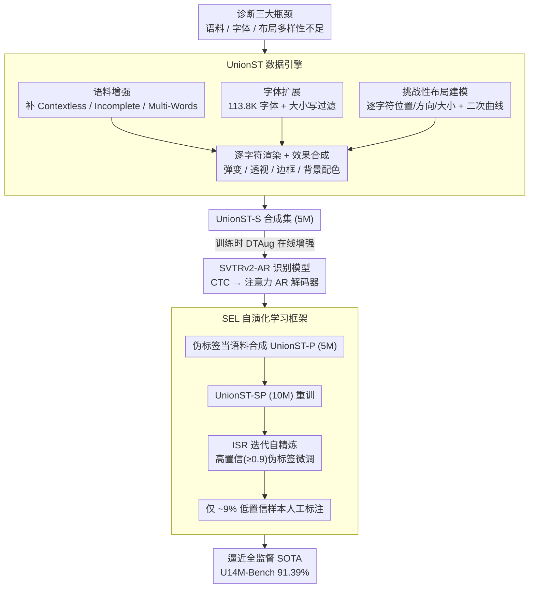

<!-- 由 src/gen_stubs.py 自动生成 -->
# What Is Wrong with Synthetic Data for Scene Text Recognition? A Strong Synthetic Engine with Diverse Simulations and Self-Evolution

**会议**: CVPR2026  
**arXiv**: [2602.06450](https://arxiv.org/abs/2602.06450)  
**代码**: [YesianRohn/UnionST](https://github.com/YesianRohn/UnionST)  
**领域**: 其他  
**关键词**: Scene Text Recognition, 合成数据, 数据引擎, 自演化学习, 伪标签

## 一句话总结

系统分析了现有渲染合成数据在语料、字体、布局多样性上的不足，提出 UnionST 合成引擎和自演化学习框架（SEL），仅用合成数据即大幅超越传统合成集，结合 SEL 仅需 9% 真实标注即可逼近全监督性能。

## 研究背景与动机

**场景文字识别（STR）依赖大规模训练数据**：真实数据标注昂贵且类别不均衡，合成数据是低成本替代方案，但现有合成数据与真实数据存在显著域差距。

**渲染方法仍优于生成式方法**：扩散模型等生成式方法在文字正确性上远不如渲染方法（最佳编辑准确率仅 84.67%），且计算成本高 10-10000 倍。

**语料多样性不足**：现有合成集主要由单个语义词构成，缺乏无语义文本（车牌、电话号码）、不完整文本和多词短语。

**字体覆盖有限**：主流引擎仅用 1.2K-3.6K 种字体，无法覆盖现实中的艺术字体。

**布局过于单一**：字符多为水平排列、等大小，无法模拟弯曲、多方向、多尺度文本。

**现有 SOTA 模型即使在最大真实数据集上仍有很大提升空间**：说明 STR 问题在数据层面远未解决，需要更高质量的合成数据。

## 方法详解

### 整体框架

这篇论文的出发点是诊断「现有渲染合成数据到底差在哪」，结论是语料、字体、布局三方面多样性都不够，于是给出 **UnionST 渲染引擎**逐一补齐，再叠一个**自演化学习框架 SEL** 把少量真实数据的价值榨干。整条 pipeline 串成四段：① UnionST 引擎从增强语料库采样文本、选兼容字体、逐字符独立渲染并计算位置/方向/大小参数，再施加弹性变形/透视/边框、选背景并按颜色对应表上色，输出合成图像与标签，得到 5M 的 UnionST-S；② 训练时再叠 DTAug 在线增强补足小尺寸/模糊样本；③ 识别模型选用把 CTC 解码器换成注意力 AR 解码器的 SVTRv2-AR；④ SEL 用模型给无标注真实数据打伪标签、把伪标签当语料合成 UnionST-P 与 UnionST-S 合并重训，再做 ISR 迭代自精炼，最后只对约 9% 低置信样本人工标注，逼近全监督上界。

### 关键设计

**1. 语料增强：补上现有合成集几乎没有的「非常规文本」**

现有合成集主要是单个语义词，缺无语义文本、不完整文本和多词短语。这里在常见语义词之外加入三类挑战性文本：Contextless（随机字符模拟车牌、电话号码等无语义文本）、Incomplete（随机删除字符模拟遮挡/裁剪）、Multi-Words（短语和多词文本片段），让语料分布贴近真实场景。

**2. 字体扩展：把字体覆盖从千级拉到十万级**

主流引擎只用 1.2K–3.6K 种字体，覆盖不到现实中的艺术字体。UnionST 收集 113.8K 种公开字体（对比 MJ 的 1.4K），并自动过滤大小写不可区分的字体，使合成图能覆盖到 Artistic 这类长尾。

**3. 挑战性布局建模：让字符能弯、能转、能变大小**

字符多为水平等大排列，无法模拟弯曲、多方向、多尺度文本。这里对每个字符独立建模位置 $p_i$、方向 $o_i$、大小 $s_i$，用二次曲线参数 $a \in [20, 200]$ 控制弯曲度，再用全局旋转角 $\phi \sim \text{Uniform}[0, 2\pi)$ 引入多方向，从而合成出 Curve、多方向、多尺度等困难布局。

**4. DTAug 在线增强：在训练时模拟小尺寸与模糊样本**

为补足低质量样本，训练时对图像在线施加下采样和传输畸变增强，模拟小尺寸/模糊文本，增强对 General 子集的鲁棒性。

**5. SVTRv2-AR 识别模型：换掉对弯曲文本不友好的解码器**

CTC 解码器隐含单调对齐假设，对弯曲/多方向文本是个瓶颈。这里把 SVTRv2 的 CTC 解码器替换为注意力 AR 解码器，解除单调对齐限制，更好地读出困难布局的文本。

**6. 自演化学习框架 SEL：用伪标签把真实数据的标注需求压到 9%**

合成数据再好仍有域差距，但全标注真实数据太贵。SEL 先用 UnionST-S 训练的模型给无标注真实数据打伪标签，把伪标签文本当语料合成 UnionST-P（5M），与 UnionST-S 合并成 UnionST-SP（10M）；再做迭代自精炼（ISR）——每轮筛出高置信度（≥0.9）伪标签样本微调模型，两轮后只对剩余约 9% 低置信度样本人工标注，即可逼近全监督性能。

### 损失函数

采用标准 STR 训练损失（CTC 损失 / AR 交叉熵损失），重点在数据层面创新而非损失设计。

## 实验

### 主要结果

| 训练数据 | 数据量 | Common AVG | U14M-Bench AVG |
|---|---|---|---|
| ST-2D（所有 2D 合成集合并） | 36.0M | 94.90% | 73.36% |
| UnionST-S | 5.0M | **95.32%** | **83.00%** |
| U14M-Filter（真实数据） | 3.22M | 96.56% | 87.22% |
| UnionST-SP | 10.0M | 96.07% | 84.86% |
| UnionST-SP + Real | 10.0M + 3.22M | **97.84%** | **91.39%** |

- 仅 5M 的 UnionST-S 在 U14M-Bench 上超越 36M 的 ST-2D **9.64%**，在 Multi-Words 子集上甚至超过真实数据。
- UnionST-SP + Real 将 U14M-Bench 准确率首次推到 **91.39%**（首次突破 90%）。

### 自演化学习效果

| 阶段 | U14M-Bench AVG |
|---|---|
| UnionST-SP（仅合成） | 84.86% |
| + 第 1 轮伪标签 | 89.12% |
| + 第 2 轮伪标签 | 89.81% |
| + 290K 人工标注困难样本 | 91.23% |
| 全监督上界 | 91.39% |

仅标注 9%（290K / 3.22M）真实数据即达到全监督的 0.16% 以内。

### 消融实验关键发现

1. **弯曲布局**对 Curve 子集提升最显著（从 19.83% → 46.70%）。
2. **多方向变化**同时影响 Curve、MLO 和 Salient 子集。
3. **语料增强**主要受益 Contextless（+11%）和 Multi-Words（+18%），但对 Common 略有下降，说明 Common 主要是常见词，仅在其上评测易导致过拟合。
4. **字体多样性**在小规模时效果不明显，但在 5M 规模下减少字体会导致 Artistic 子集明显下降。
5. **DTAug** 对 General 子集提升明显。
6. **伪语料的不可替代性**：用 MJ+ST 或 ST-2D 做 ISR 基础数据分别只能达到 73.30% 和 80.51%，远低于 UnionST-SP 的 89.12%。

## 亮点

- 系统性地诊断了渲染合成数据的三大瓶颈（语料/字体/布局），并逐一给出解决方案
- 5M 合成数据超越 36M 传统合成集，说明数据质量远比数量重要
- SEL 框架将人工标注需求降低 91%，实用价值极高
- 首次在 Union14M-Benchmark 上突破 90% 准确率

## 局限性

- 仅针对英文场景，多语言（中文、阿拉伯文等）扩展尚未验证
- 未涉及文档 OCR 和手写识别场景
- 渲染合成图像的视觉真实感仍不如生成式方法，视觉多样性有上限
- 字体过滤策略以大小写区分为准则，可能遗漏部分有用的艺术字体
- ISR 第三轮迭代已无增益，伪标签的错误累积问题尚待研究

## 相关工作

- **渲染合成**：MJ、ST、CurvedST、SynthAdd、SynthTIGER、UnrealText、SynthText3D——均未充分组合挑战性因素
- **生成式合成**：MOSTEL、AnyText、TextCtrl、TextSSR、Flux.1 Kontext——正确性不足，成本高
- **数据视角分析**：TRBA、STR-Fewer-Labels、Union14M——揭示了 STR 数据瓶颈
- **自/半监督方法**：CCD、CCDPlus、ViSu——利用合成数据驱动半监督学习

## 评分

- 新颖性: ⭐⭐⭐⭐ — 系统性诊断+工程改进的组合，SEL 框架有创新
- 实验充分度: ⭐⭐⭐⭐⭐ — 对比全面，消融详尽，涵盖多种场景和基线
- 写作质量: ⭐⭐⭐⭐ — 结构清晰，问题定义明确，图表丰富
- 价值: ⭐⭐⭐⭐⭐ — 实用性极强，合成引擎和 SEL 框架对 STR 社区有直接推动

<!-- RELATED:START -->

## 相关论文

- [\[ACL 2025\] Theorem Prover as a Judge for Synthetic Data Generation](../../ACL2025/others/theorem_prover_as_a_judge_for_synthetic_data_generation.md)
- [\[ACL 2025\] KodCode: A Diverse, Challenging, and Verifiable Synthetic Dataset for Coding](../../ACL2025/others/kodcode_a_diverse_challenging_and_verifiable_synthetic_dataset_for_coding.md)
- [\[ACL 2025\] TARGA: Targeted Synthetic Data Generation for Practical Reasoning over Structured Data](../../ACL2025/others/targa_targeted_synthetic_data_generation_for_practical_reasoning_over_structured.md)
- [\[CVPR 2026\] BenDFM: A Taxonomy and Synthetic CAD Dataset for Manufacturability Assessment in Sheet Metal Bending](bendfm_a_taxonomy_and_synthetic_cad_dataset_for_ma.md)
- [\[ACL 2025\] Generating Synthetic Relational Tabular Data via Structural Causal Models](../../ACL2025/others/generating_synthetic_relational_tabular_data_via_structural_causal_models.md)

<!-- RELATED:END -->
