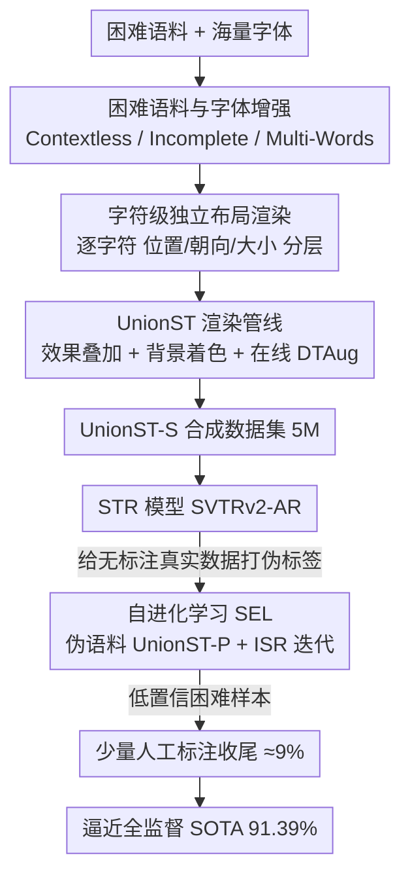

# What's Wrong with Synthetic Data for Scene Text Recognition? A Strong Synthetic Engine with Diverse Simulations and Self-Evolution

**会议**: CVPR 2026  
**论文**: [CVF Open Access](https://openaccess.thecvf.com/content/CVPR2026/html/Ye_Whats_Wrong_with_Synthetic_Data_for_Scene_Text_Recognition_A_CVPR_2026_paper.html)  
**代码**: https://github.com/YesianRohn/UnionST  
**领域**: 场景文本识别 / 合成数据引擎  
**关键词**: 场景文本识别, 合成数据, 渲染引擎, 伪标签, 自进化学习

## 一句话总结
作者先量化诊断主流渲染式合成数据「语料单一、字体常规、版式平直」三大短板，再提出 UnionST 渲染引擎补齐这些维度造出 UnionST-S 数据集，配合「伪语料 + 迭代自精炼」的自进化学习框架，仅用纯合成数据就在 Union14M 上达到 83.0% 平均准确率，且只标注 9% 真实数据即可逼近全监督 SOTA（91.39%）。

## 研究背景与动机

**领域现状**：场景文本识别（STR）极度依赖大规模、类别均衡的训练文本，而真实数据采集与标注成本高、长尾分布难覆盖。合成数据因「标签天然完美 + 成本极低」成为刚需，目前有两条路线：传统渲染式（MJ、ST、SynthTIGER 等，靠 CPU 渲染保证标签 100% 正确）和深度生成式（文本编辑、扩散模型 T2I）。

**现有痛点**：生成式方法虽然视觉更逼真，但「会画字 ≠ 会写对字」——论文在 ScenePair 上实测，即便最好的 TextCtrl 编辑准确率也只有 84.67%，Flux.1 Kontext 仅 12.81%，错标会直接污染识别模型。渲染式虽标签可靠，但作者系统评测 36M 主流渲染样本后发现它们存在结构性缺口：① 语料大多是单个、语义丰富的短词，在多词、无语义场景下崩盘；② 字体常规易识别，遇到艺术字就失效；③ 版式平直单调、字符等大水平排布，无法合成弯曲、多朝向文本。

**核心矛盾**：合成数据与真实数据之间存在巨大 domain gap，而这个 gap 的根源不在「数量」（36M 样本仍打不过 3.2M 真实数据），而在「困难样本的多样性与组合覆盖度」——现有引擎只单独处理过个别难点（如 CurvedST 只管弯曲），从未把困难条件系统地建模并自由组合。

**本文目标**：(1) 渲染引擎的潜力是否已耗尽，能否进一步逼近真实分布？(2) 增强后的合成数据能否撬动无标注真实数据做自进化，把标注成本压到极低？

**切入角度**：与其追求「更逼真的像素」，不如回到数据中心视角，把渲染管线的每个环节（语料 / 字体 / 布局）拆开逐个补齐困难维度，让一个引擎能造出「困难条件的并集（union）」。

**核心 idea**：用一个可控性极强的渲染引擎 UnionST 把困难语料、海量字体、字符级自由布局三者全开并自由组合，再用它产出的模型反过来给无标注真实数据打伪标签、迭代自我进化，从而「先用合成顶住，再用极少真实标注收尾」。

## 方法详解

### 整体框架
UnionST 体系分两大块。**前半是数据引擎**：从困难语料里采样目标文本 → 选一个支持全部字符的字体 → 逐字符独立计算位置/朝向/大小并分层渲染 → 叠加弹性形变、透视、描边等效果 → 放到带阴影/浮雕增强的背景上着色，输出「图像 + 完美标签」，批量造出 5M 的 UnionST-S。**后半是自进化学习（SEL）**：用 UnionST-S 训出的 STR 模型给大规模无标注真实图像打伪标签，把这些伪文本当作「伪语料」重新喂回引擎造出 UnionST-P，与 UnionST-S 合并成 UnionST-SP（10M）重训；再做两轮迭代自精炼（ISR），每轮只吸收高置信伪标签自训练，最后只把剩下的低置信困难样本交给人工标注收尾。识别模型本身选用 SOTA 的 SVTRv2 并把 CTC 解码器换成自回归（AR）解码器，以发挥困难样本的价值。

### 关键设计

**1. 三维诊断：把渲染缺口拆成可量化、可补齐的维度**

作者没有空谈「合成数据不行」，而是把渲染管线显式拆成「语料 / 字体 / 布局」三件事并逐项体检（见 Tab.1 的对比矩阵）。现有引擎在这三维上几乎都是空白或部分实现：MJ/ST 语料是孤立短词、字体常规、布局平直；CurvedST 只补了弯曲一项。UnionST 第一次在四类语料（Common / Contextless / Incomplete / Multi-Words）、字体规模（113.8K 个字体，对比 ST 的 1.2K）、四类布局（Curve / Multi-Oriented / Multi-Sized / Salient）上全部做到「完整且可控」。这个诊断本身就是论文的方法论起点——它把「domain gap」这个模糊概念落到了可操作的工程清单上。语料增强具体做法是：Contextless 用随机字符模拟车牌/电话；Incomplete 在语义词里随机删一个字符模拟遮挡截断；Multi-Words 拼接短语和长度不一的文本片段。字体侧则自动过滤掉大小写难以区分的字形，保证字符判别清晰。

**2. 字符级独立布局建模：用一组参数化方程造出弯曲/多朝向/多尺寸文本**

传统引擎把整行文本当一个刚体水平摆放，天然造不出弯曲和多朝向。UnionST 的关键转变是「逐字符分层渲染」：对文本 $T$ 中每个字符 $i$，独立定义其位置、朝向、大小 $\text{placement}_T = \{(p_i, o_i, s_i) \mid i = 1,\dots,N\}$。位置由一条二次曲线加全局旋转给出：

$$p_i = \begin{bmatrix} \cos\omega & \sin\omega \\ -\sin\omega & \cos\omega \end{bmatrix} \begin{bmatrix} x_i \\ a x_i^2 + b \end{bmatrix}, \qquad o_i = \arctan(2 a x_i) + \omega$$

其中曲率参数 $a$ 从 $[20, 200]$ 采样（$a=0$ 即直线文本），$b$ 是直线上的对应坐标，全局旋转角 $\omega$ 在 $[0, 2\pi)$ 上均匀采样以产生任意朝向；竖排文本等价于交换横纵轴。字符大小 $s_i$ 随位置变化自然带来 Multi-Sized 效果。这套参数化把「弯曲 + 多朝向 + 多尺寸」统一进一个连续可控的采样空间，比起预设几种模板的旧方法，能自由组合出连续谱系的困难版式——消融显示光是加上布局这一项，Multi-Oriented 子集就从 30.4% 跳到 87.3%（配合语料后）。

**3. UnionST 渲染管线 + 在线 DTAug：把困难维度组合成完整样本**

有了语料和布局，引擎按固定流程把它们组装成图：(a) 从语料采样文本、按字符集查询选一个兼容字体；(b) 逐字符分层渲染并计算 placement 参数；(c) 叠加弹性形变、透视变换、描边等效果；(d) 随机选背景、按预定义颜色对应表着色，再用随机文本实例、阴影或浮雕增强背景，输出图文对。训练阶段额外引入在线增强 DTAug（下采样 + 传输失真），专门模拟小尺寸和模糊样本——这一步弥补了离线渲染难以覆盖的低质成像条件。整条管线全程跑在 CPU 上，成本只有扩散式 TextSSR 的 1/20、闭源 Nano Banana 的 1/10000，却能保证标签绝对正确，这正是它能压制生成式方法的根本原因。

**4. 自进化学习 SEL：用伪语料 + 迭代自精炼把真实标注压到 9%**

合成语料再全也和真实文本分布有 gap，作者用两步缩小它。**伪语料增强**：先用 UnionST-S 训出的模型 $M_a$ 给大规模无标注真实数据 $D_U$ 打伪标签 $\hat{Y}_U$，把这些预测文本当作「目标语料」重新驱动 UnionST 引擎造出 UnionST-P（5M），再与 UnionST-S 合并成 UnionST-SP（10M）重训。注意这里借用的是真实数据的「文本内容分布」而非像素，巧妙规避了伪标签像素噪声。**迭代自精炼 ISR**：从 $M_0 = M_b$ 起，每轮用上一轮模型在 $D_U$ 上识别、只挑置信度高于阈值 $\vartheta$（如 0.9）的伪标签样本 $D_P^{(t)}$ 做微调得到 $M_t$；高置信样本当「近似正确标签」扩充训练量与分布，低置信样本（往往是真正的困难样本，边际价值最高）则留到最后才人工标注 $D_L^{\text{hard}}$ 收尾。两轮 ISR 后模型在 Union14M 上达 89.81%，比用全量真实数据还高 2.59%；再补上仅 9% 的困难样本人工标注，与 SOTA 的差距收到 0.16% 以内，人工标注量直降 91%。

### 损失函数 / 训练策略
识别模型采用 SVTRv2 的先进编码器 + 自回归（AR）注意力解码器：原版 SVTRv2 用 CTC 解码已超越并行解码（PD）和旧 AR 方法，但 CTC 假设字符单调对齐，在高度弯曲/多朝向文本上吃力；换成 AR 解码后输入输出序列对齐更灵活，才能吃透 UnionST 里困难样本的价值。这也是论文「数据中心」立场的体现——模型只做最小必要改动，把舞台留给数据。

## 实验关键数据

### 主实验
评测覆盖 6 个常规 benchmark（Common）和 Union14M-Benchmark（含 Curve/MLO/ART/CTL/SAL/MLW/GEN 七个困难子集），指标为归一化准确率。

| 训练数据 | 规模 | Common AVG | U14M-Bench AVG |
|----------|------|-----------|----------------|
| ST-2D（全部 2D 合成聚合） | 36.0M | 94.90 | 73.36 |
| TextSSR（扩散合成） | 3.55M | 86.10 | 48.46 |
| **UnionST-S** | 5.0M | 95.32 | **83.00** |
| **UnionST-P** | 5.0M | 96.21 | 84.30 |
| **UnionST-SP** | 10.0M | 96.07 | 84.86 |
| U14M-Filter（纯真实数据） | 3.22M | 96.56 | 87.22 |
| UnionST-S + 1%R（32K 真实） | 5.0M+32K | 96.44 | 87.26 |
| **UnionST-SP + R** | 10.0M+3.22M | **97.84** | **91.39** |

关键对比：纯合成的 UnionST-S（5M）在 U14M-Bench 上比 36M 的 ST-2D 高 9.64%，在 Multi-Oriented 子集上更是高出 21.26%；仅加 1% 真实标注（32K）就追平 3.2M 全量真实数据；最终 UnionST-SP + 全真实数据刷出 91.39% 的新 SOTA。

### 消融实验
逐项叠加引擎组件（0.5M 规模），看每个维度对困难场景的贡献：

| 配置 | Common AVG | U14M-Bench AVG | 说明 |
|------|-----------|----------------|------|
| Baseline | 88.30 | 42.26 | 平直布局 + 普通语料 |
| + Layout | 89.42 | 47.35 | 加字符级布局 |
| + Layout + Corpus | 90.55 | 63.82 | 再加困难语料（涨幅最大） |
| + Layout + Corpus + Font | 90.60 | 70.60 | 再加海量字体 |
| + 全部 + DTAug | 90.32 | — | 在线退化增强 |

ISR 自进化的逐轮效果（Tab.5）：UnionST-SP 起点 84.86% → 第一轮 $D_P^{(1)}$ 89.12% → 第二轮 $D_P^{(2)}$ 89.81% → 补 290K 困难人工标注 91.23%。

### 关键发现
- **困难语料（Corpus）贡献最大**：U14M-Bench 从 47.35% 跃升到 63.82%（+16.5%），远超其他单项，印证「语料单一」才是渲染数据最致命的短板。
- **字体多样性显著拉动艺术字**：加字体后 U14M 再涨 6.8%，尤其 Artistic 子集受益明显。
- **文本正确性比视觉逼真更重要**：生成式方法 ScenePair 编辑准确率最高仅 84.67%，错标会污染下游；渲染式虽不够逼真但标签 100% 正确，反而在直接训练和混合真实数据两种设定下都压制 TextSSR。
- **数量不等于质量**：UnionST-S 从 5M 扩到 10M 仅微涨，说明瓶颈在分布覆盖而非样本数；用伪语料对齐真实文本分布（UnionST-P）比单纯堆量有效得多。

## 亮点与洞察
- **把「domain gap」工程化为可勾选的清单**：Tab.1 的 ✓/✗ 矩阵把模糊的「合成不如真实」拆成语料/字体/布局/各类困难场景的逐项缺口，方法论上很干净，是这篇最值得借鉴的思维方式——任何「合成 vs 真实」的领域都能套这套诊断。
- **字符级参数化布局**：用一条二次曲线 + 全局旋转就统一表达弯曲/多朝向/多尺寸，连续可采样、可自由组合，比预设模板优雅得多，可迁移到任何需要可控版式合成的任务（如表格、公式、乐谱 OCR）。
- **伪标签当「语料」而非「监督信号」**：只借真实数据的文本内容分布去驱动渲染引擎，规避了伪标签像素噪声，这个「用伪标签做内容、用引擎做像素」的解耦很巧妙。
- **困难样本留到最后人工标注**：ISR 把高置信样本自动消化、把人工预算精准投到边际价值最高的低置信困难样本上，标注省 91% 还逼近 SOTA，是主动学习思想在 STR 数据闭环里的漂亮落地。

## 局限与展望
- 全套体系依赖大规模无标注真实数据 $D_U$ 来打伪标签做 SEL，在真实图像也稀缺的语种/场景下，伪语料增强的收益会打折。
- 布局建模目前用二次曲线参数化，对极端复杂排版（如环形、立体三维场景文字）仍是近似；3D 渲染（UnrealText）在实验中未显出优势，但这不代表 3D 路线没价值，可能只是实现不够好。
- DTAug 等在线增强是手工设计的退化模拟，超参（曲率范围、置信阈值 $\vartheta$）需经验设定，缺乏自适应机制。
- 评测集中在英文 STR，对中文/多语言、长尾字符集的可扩展性未充分验证。

## 相关工作与启发
- **vs 渲染式（MJ/ST/SynthTIGER/CurvedST）**：它们各自只补了渲染管线的局部（ST 考虑深度分割，CurvedST 只管弯曲），UnionST 第一次在语料/字体/布局三维同时全开并自由组合，因此 5M 就压过 36M 的 ST-2D。
- **vs 生成式（TextSSR/AnyText/扩散编辑）**：生成式追求像素逼真但牺牲文本正确性（最高 84.67%），本文用实验证明「正确性 > 逼真度」，渲染式才是可靠训练数据源。
- **vs 少标注 STR（STR-Fewer-Labels）**：后者用 1.7% 真实 + 半监督追平 MJ+ST，本文则用更强的合成预训练 + 伪语料 + ISR，把这条路推到「9% 标注逼近全监督 SOTA」。
- **vs Union14M**：本文沿用其困难 benchmark 与 U14M-Filter，但从「数据合成与标注闭环」角度回应了 Union14M「STR 远未解决」的论断。

## 评分
- 新颖性: ⭐⭐⭐⭐ 三维诊断 + 字符级布局 + 伪语料自进化的组合很完整，单项虽有前作影子但系统性整合是新的。
- 实验充分度: ⭐⭐⭐⭐⭐ 覆盖渲染/生成多基线、逐项消融、ISR 逐轮、标注比例梯度，证据链扎实。
- 写作质量: ⭐⭐⭐⭐ 问题驱动、逻辑清晰，Tab.1 诊断矩阵和图示帮助理解，公式部分略简。
- 价值: ⭐⭐⭐⭐⭐ 把 STR 合成数据的天花板抬高，且给出极省标注的实用闭环，工程落地价值高、代码开源。

<!-- RELATED:START -->

## 相关论文

- [\[CVPR 2026\] What Is Wrong with Synthetic Data for Scene Text Recognition? A Strong Synthetic Engine with Diverse Simulations and Self-Evolution](what_is_wrong_with_synthetic_data_for_scene_text_recognition_a_strong_synthetic_.md)
- [\[CVPR 2026\] Adaptive Data Augmentation with Multi-armed Bandit: Sample-Efficient Embedding Calibration for Implicit Pattern Recognition](adaptive_data_augmentation_with_multi-armed_bandit_sample-efficient_embedding_ca.md)
- [\[CVPR 2026\] DREAM: Document Recognition with Explicit Adaptive Memory](dream_document_recognition_with_explicit_adaptive_memory.md)
- [\[CVPR 2026\] Confusion-Aware Spectral Regularizer for Long-Tailed Recognition](confusion-aware_spectral_regularizer_for_long-tailed_recognition.md)
- [\[CVPR 2026\] Learning What Helps: Task-Aligned Context Selection for Vision Tasks](learning_what_helps_task-aligned_context_selection_for_vision_tasks.md)

<!-- RELATED:END -->
