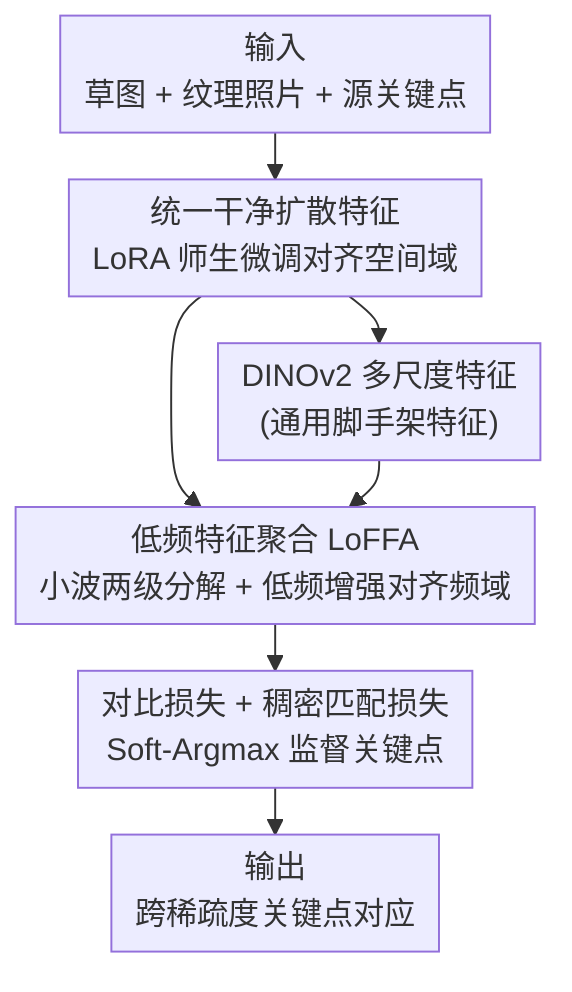

# When Lines Meet Textures: Spatial-Frequency Aligned Diffusion Features for Cross-Sparsity Correspondence

**会议**: CVPR 2026  
**论文**: [CVF Open Access](https://openaccess.thecvf.com/content/CVPR2026/html/Zhu_When_Lines_Meet_Textures_Spatial-Frequency_Aligned_Diffusion_Features_for_Cross-Sparsity_CVPR_2026_paper.html)  
**代码**: https://github.com/Mofr77/SFA-DIFT  
**领域**: 扩散特征 / 跨模态语义对应  
**关键词**: 草图-照片对应、扩散特征、小波低频聚合、LoRA微调、关键点匹配

## 一句话总结
针对"稀疏线条草图"与"纹理丰富照片"之间难以建立语义关键点对应的问题，本文提出 SFA-DIFT：先用 LoRA 把 CleanDIFT 微调成跨模态统一的"干净扩散特征"对齐空间域，再用基于小波的低频聚合模块（LoFFA）对齐频域，在自建的 MS-PSC6K 基准上把 PCK 全面刷到新 SOTA。

## 研究背景与动机
**领域现状**：在两张外观相似的图之间找语义对应（semantic correspondence）已被研究得比较成熟，近年发现 Stable Diffusion（SD）的中间层特征天然带有强语义，于是出现了 DIFT、SD+DINO 这类"用扩散特征做对应"的范式。把它用到"草图 ↔ 照片"这种**跨稀疏度**（cross-sparsity）场景——即一边是只有几根轮廓线的抽象草图、一边是布满纹理的真实照片——是一个有应用价值（草图检索、内容编辑、创意设计）又能检验跨模态理解能力的测试场。

**现有痛点**：直接搬扩散特征会失败。SD 特征严重偏向纹理和外观，喂给纯线条草图时会产生作者所说的"特征空洞"和噪声伪影，关键点定位崩塌；t-SNE 上草图和照片各自聚成两团，模态判别性极高，根本没法跨模态匹配。已有补救也都不彻底：CleanDIFT 用去噪让特征更平滑，对草图能"补全"缺失结构，但过度平滑反而削弱了语义表达力；SketchFusion 用 CLIP 注入高层语义、拉近空间分布，却只是"高层补丁"，治标不治本，底层频率失配仍在。

**核心矛盾**：作者把失败归因拆成了两个正交的鸿沟。一是**空间域错位**：草图是对物体结构的稀疏抽象，大量纹理区域在草图侧没有对应物，且线条位置常偏离真实边界，造成系统性空间偏移。二是**频域不一致**：通过对数幅度傅里叶谱分析发现，纹理图的能量在各频段都有分布（低频管宏观形状、中频管表面纹理、高频管细节），而草图谱呈"低频高台 + 高频尖刺 + 中频几乎为空"的形态，两者频谱形状根本不同。只在空间域对齐（如 SketchFusion）就无法消除这个频域裂缝。

**本文目标 / 切入角度**：既然鸿沟是空间 + 频域双重的，对齐就必须同时在两个域上做（dual-domain alignment）。空间域上把两个模态映射进一个共享的"干净语义子空间"，频域上则要显式地放大两模态共享的低频结构、压住模态特有的高频纹理噪声。

**核心 idea**：用"LoRA 微调出的统一干净扩散特征（对齐空间）+ 小波低频聚合模块（对齐频域）"两段式管线，把稀疏线条和稠密纹理拉进同一个可比较的特征空间，再用对比损失 + 稠密匹配损失训练出鲁棒对应。

## 方法详解

### 整体框架
SFA-DIFT 的输入是一对图像（一张草图 + 一张纹理照片）以及照片上的源关键点，输出是这些关键点在草图（或反向）上的对应位置。整条管线分两个串行阶段：**第一阶段**先用无监督的 LoRA 微调把预训练 CleanDIFT 改造成"统一干净扩散特征"提取器（Unified CleanDIFT），解决空间域错位；**第二阶段**冻结这个提取器，把它和 DINOv2 抽出的多尺度特征一起喂进 LoFFA 模块，用小波变换在频域上增强共享低频成分，再用对比损失 + 稠密匹配损失训练出最终对应。两阶段分别对应"先对齐空间、再对齐频率"的设计哲学。

### 关键设计

**1. 统一干净扩散特征：用 LoRA 师生微调把草图和照片拉进同一个干净空间**

这一步直击"空间域错位"。出发点是 CleanDIFT 已经能从干净图（不加噪）直接抽语义特征，但它没见过多少草图，对线条理解有限。作者在 U-Net 所有线性投影层插入 LoRA，对每个权重矩阵 $W$ 做低秩适配 $W' = W + \alpha BA$，其中 $A\in\mathbb{R}^{r\times d}$、$B\in\mathbb{R}^{d\times r}$（秩 $r\ll d$）是仅有的可训练参数、$\alpha$ 是可学习缩放因子。这样既保住了模型对纹理图的丰富理解，又能以极小代价适配草图特性，是参数高效的。

训练采用师生双前向：**教师路**给草图 $x_0$ 加噪到随机时间步 $t$ 的 $x_t$，用冻结的原始 SD 抽中间层特征作为目标 $F_{target}$；**学生路**把干净草图 $x_0$ 喂进 LoRA 模型、固定时间步 $t'=261$（沿用 CleanDIFT 对干净图的最优设定），并经一组以时间步为条件的逐点投影头得到 $F_{proj}$。损失是两者的负余弦相似度，在数据分布和采样时间步上取期望：

$$\mathcal{L}_{ada}=\mathbb{E}_{x_0,\epsilon,t}\Big[-\sum_{k=1}^{K}\frac{F^{(k)}_{proj}(x_0,t')\cdot F^{(k)}_{target}(x_t,t)}{\lVert F^{(k)}_{proj}(x_0,t')\rVert\,\lVert F^{(k)}_{target}(x_t,t)\rVert}\Big]$$

通过在整个时间步范围上采样，模型学到的是与时间步无关的、两模态统一的干净特征——这正是让草图和照片在 t-SNE 上按"语义类别"而非"模态"聚类的关键。

**2. 低频特征聚合 LoFFA：用两级小波分解显式放大共享低频、压住高频纹理噪声**

空间对齐后频域裂缝仍在（草图是低频主导、照片是宽频谱），这一步专门补这个缝。LoFFA 接收由 Unified CleanDIFT 和 DINOv2 抽出的 $L$ 层多尺度特征 $F^S$、$F^T$，每层先做卷积降通道，再用 AdaIN 把照片特征的分布对齐到草图分布（草图分布保持不变）——让"纹理重"的一侧主动向"线条简"的一侧靠拢。

核心是 LoFE（Low-Frequency Enhancement）子模块：对输入特征做**层级化两级离散小波变换（DWT）**，先得到一级低频 $F^{(1)}_{LL}$ 和高频 $F^{(1)}_{H}$，把低频再过一个 CBG 块（Conv+BN+GELU）后做第二级 DWT 得到 $F^{(2)}_{LL}$、$F^{(2)}_{H}$；对最低频成分用 sigmoid 门控调制 $\tilde{F}^{(2)}_{LL}=F^{(2)}_{LL}\odot(1+M)$，其中注意力掩码 $M$ 由一个轻量 sigmoid 卷积网络生成，$(1+M)$ 是自适应缩放因子。随后用可学习权重的逆小波变换（IDWT）逐级带着保留下来的高频成分重建，得到低频增强特征 $H(F^{S,in}_l)$。整个 LoFE 嵌在缩放残差里以保稳定：$F^{S,out}_l=F^{S,in}_l+\beta\big(H(F^{S,in}_l)-F^{S,in}_l\big)$（$\beta$ 可学习）。源/目标两路走同样流程，保证两模态获得等量的低频增强；最后各层经自适应加权求和 $\hat{F}^S=\sum_l \omega_l F^{S'}_l$ 得到最终表示。"在频域里挑出低频、用门控放大、再小波重建"正是把草图和照片在频谱上对齐的具体手段。

**3. 对比损失 + 稠密匹配损失：让关键点既"拉近正样本"又"全图可微监督"**

光有对齐特征还需要对应监督。作者用了双目标：一是 CLIP 式对称对比损失 $\mathcal{L}_{CL}$，在关键点位置采样特征，把对应对拉近、非对应对推远；二是稠密匹配损失，针对传统 End-Point-Error 在不连续特征图上的缺陷，对每个源关键点 $k^S_i$ 与整张目标特征图算相似度图 $C_i=\hat{F}^S(k^S_i)^\top\hat{F}^T$，再用可微 Soft-Argmax 得到预测位置 $\hat{k}^T_i$，损失为 $\mathcal{L}_{Dense}=\sum_i\lVert\hat{k}^T_i-(k^T_i+\epsilon)\rVert_2$（$\epsilon$ 是加在真值上的小高斯噪声做正则）。Soft-Argmax 的好处是梯度能回传到所有空间位置，避免硬 argmax 的不可导。总损失 $\mathcal{L}=\mathcal{L}_{CL}+\mathcal{L}_{Dense}$。

**4. MS-PSC6K 基准与鲁棒性比值（RR）：把"跨风格泛化"做成可公平比较的评测**

原始 PSC6K 只有 125 类、1250 张照片、每张配 5 张草图共 15 万标注关键点，风格单一。作者给每张照片生成 5 种不同纹理风格（抽象、巴洛克、写实、新印象、后印象），扩成含 7500 张纹理图的 MS-PSC6K，并用 Sketchy（62500 张草图）来无监督微调 Unified CleanDIFT。为公平衡量纹理扰动下的鲁棒性，提出鲁棒性比值 $\mathrm{RR}=\frac{\frac{1}{N}\sum_i \mathrm{PCK}(x^s_i,\hat{x}^{t,pert}_i)}{\frac{1}{N}\sum_i \mathrm{PCK}(x^s_i,\hat{x}^{t,orig}_i)}$，即扰动后 PCK 与原图 PCK 之比，把绝对掉点归一化成可横比的相对量（RR>1 表示偏好多样风格而非照片）。这套数据 + 指标本身就是论文的一项贡献。

## 实验关键数据

### 主实验
PCK@α 表示在边界框尺度 α 容差内正确关键点比例，α∈{0.01,0.05,0.1} 对应 PCK@1/@5/@10。下表为 PSC6K 上与 SOTA 的对比（‡=监督方法，*=零样本）：

| 方法 | PCK@1 | PCK@5 | PCK@10 |
|------|-------|-------|--------|
| SD* | 3.02 | 38.66 | 69.77 |
| CleanDIFT+DINO* | 5.73 | 55.47 | 83.81 |
| CleanDIFT+DINO‡ | 9.44 | 70.25 | 90.99 |
| SketchFusion‡ | - | 70.31 | 89.86 |
| Self-Sup‡ | 5.33 | 58.02 | 84.87 |
| **SFA-DIFT‡ (本文)** | **9.81** | **72.94** | **92.70** |

在 MS-PSC6K 五种风格上，本文方法平均 PCK@1/@5/@10 = **8.70 / 69.21 / 91.02**，全面优于 SketchFusion、Self-Sup、CleanDIFT+DINO 等；而这些 baseline 直接迁移会显著掉点、在 MS-PSC6K 上重训甚至更差（异质数据上不收敛），凸显本文的跨风格泛化优势。

鲁棒性比值（RR，越接近/超过 1 越稳）对比：

| 方法 | RR@1 | RR@5 | RR@10 |
|------|------|------|-------|
| Self-Sup‡ | 0.56 | 0.74 | 0.87 |
| SketchFusion‡ | - | 0.71 | 0.87 |
| CleanDIFT+DINOv2‡ | 0.82 | 0.96 | 0.99 |
| **Unified CleanDIFT*(本文)** | **0.99** | **0.99** | **1.00** |
| SFA-DIFT‡ (本文-full) | 0.87 | 0.95 | 0.98 |

### 消融实验
下表为 MS-PSC6K 与 PSC6K 平均的组件消融：

| 配置 | PCK@1 | PCK@5 | PCK@10 | 说明 |
|------|-------|-------|--------|------|
| CleanDIFT* | 5.59 | 57.27 | 84.57 | 零样本预训练基线 |
| Unified CleanDIFT* | 5.94 | 58.69 | 85.57 | 仅空间对齐（LoRA） |
| Unified CleanDIFT + Conv‡ | 8.68 | 68.78 | 90.17 | 用普通卷积替 LoFFA 的监督基线 |
| LoFFA w/o AdaIN‡ | 8.57 | 68.64 | 90.52 | 去掉分布对齐 |
| LoFE → Conv‡ | 8.53 | 69.01 | 90.51 | 去掉低频增强 |
| DWT & IDWT → Conv‡ | 7.96 | 66.98 | 89.77 | 去掉显式频率变换（掉最多） |
| Single DWT & IDWT‡ | 8.51 | 68.45 | 90.52 | 只做一级小波分解 |
| **SFA-DIFT‡ (full)** | **8.89** | **69.83** | **91.32** | 完整模型 |

### 关键发现
- **频率变换是 LoFFA 的命门**：把 DWT&IDWT 换成普通卷积时 PCK@1 从 8.89 跌到 7.96（掉约 0.93），是所有变体里掉点最多的——说明显式的小波频域处理、而非"多堆几层卷积"，才是跨频域对齐的关键。
- **两级分解优于一级**：Single DWT&IDWT（8.51）比 full（8.89）低，深层频率分解能更细地分离共享低频与模态特有高频。
- **空间对齐是基础但不够**：仅 Unified CleanDIFT（5.94）相比 CleanDIFT（5.59）只是小幅提升，必须叠加监督的 LoFFA 才能跳到 8.89，印证"空间 + 频率双对齐缺一不可"。
- **泛化鲁棒性突出**：Unified CleanDIFT 的 RR 稳定在 1.0 附近，说明它对纹理变化近乎不变；baseline 在 MS-PSC6K 上微调后 RR 反而下降，是因为缺频率对齐、过拟合到高频风格。

## 亮点与洞察
- **把"对应失败"诊断成正交的空间 + 频域双鸿沟，再对症下两味药**：这个"先做频谱分析、再设计 dual-domain 对齐"的思路本身很有说服力，比 SketchFusion 那种"打高层语义补丁"更触及根因，可迁移到任何"稀疏 vs 稠密"的跨模态匹配（如点云-图像、热力图-RGB）。
- **小波域的低频门控增强很巧**：用两级 DWT 把低频拎出来、sigmoid 生成 $(1+M)$ 自适应放大、再 IDWT 带高频重建，是一种"只改频谱该改的部分、其余原样保留"的轻量做法，比直接在空间域加卷积更可控，且消融证明它确实是涨点主力。
- **RR 指标值得借鉴**：把"扰动后绝对掉点"归一化成"扰动后/原图 PCK 之比"，让不同强度方法的鲁棒性能公平横比，这套评测设计可复用到任何带分布偏移的对应/匹配任务。
- **全程参数高效**：空间对齐只动 LoRA、频域只加轻量 LoFFA，没有重训整个扩散模型，工程上友好。

## 局限与展望
- **推理慢**：作者自己承认依赖扩散特征导致效率受限，每对对应平均要 0.8 秒，难以实时；未来计划探索更高效的扩散特征表示。
- **SFA-DIFT-full 的 RR 略低于纯 Unified CleanDIFT**（0.87 vs 0.99 @1）：作者解释是高方差干扰（纹理、色偏）与结构线索竞争所致，但这也意味着加了 LoFFA 的完整模型在极端纹理扰动下的"相对稳定性"反而被监督训练拉低了一点，存在性能与鲁棒性的微妙取舍。
- **依赖合成多风格数据**：MS-PSC6K 的纹理风格是生成出来的，对真实世界更杂乱的草图/照片分布是否同样有效，论文未充分验证。
- **绝对 PCK@1 仍偏低**（约 8-10%）：跨稀疏度对应本身极难，离实用还有距离；这更多是任务难度而非方法缺陷，但提醒该方向远未解决。

## 相关工作与启发
- **vs CleanDIFT**：CleanDIFT 通过跨时间步对齐让 SD 能从干净图直接抽特征、抑制噪声，但它没专门适配草图，且过度平滑会削弱语义。本文在其上加 LoRA 师生微调做出"统一"版本（空间对齐），再补一个频域模块，相当于把 CleanDIFT 从"单图去噪"升级成"跨稀疏度对齐"。
- **vs SketchFusion**：SketchFusion 用 CLIP 调制信号注入高层语义、拉近空间分布，但只治空间不治频率，特征嵌入仍大幅分离。本文指出这是"高层补丁治标不治本"，并用显式频域小波处理补上了它漏掉的低频对齐。
- **vs SD+DINO / DIFT 系**：这类直接用扩散特征做语义对应的方法在外观一致的图对上有效，但在草图这种纯线条输入上会产生"特征空洞"和模态特异聚类。本文的统一干净特征 + 低频聚合正是为打破这种模态判别性而设计。

## 评分
- 新颖性: ⭐⭐⭐⭐ 把对应失败拆成空间+频域双鸿沟并各下一味药（尤其小波低频门控）是有洞察的组合创新，但每个组件（LoRA、CleanDIFT、DWT、AdaIN）单看都是成熟件。
- 实验充分度: ⭐⭐⭐⭐ 自建 MS-PSC6K + RR 指标，主实验/跨风格/鲁棒性/消融齐全，消融清晰定位了频率变换的作用；但绝对精度低、缺真实分布验证。
- 写作质量: ⭐⭐⭐⭐ 诊断→方法→实验逻辑顺，频谱/t-SNE 分析有说服力，公式记号略密。
- 价值: ⭐⭐⭐⭐ 为草图-照片这类跨稀疏度对应提供了"空间+频率双对齐"的原则性框架和可复用基准，对跨模态匹配有借鉴意义。

<!-- RELATED:START -->

## 相关论文

- [\[CVPR 2026\] Generalizable Radio-Frequency Radiance Fields for Spatial Spectrum Synthesis](generalizable_radio-frequency_radiance_fields_for_spatial_spectrum_synthesis.md)
- [\[CVPR 2026\] Content-Aware Frequency Encoding for Implicit Neural Representations with Fourier-Chebyshev Features](content-aware_frequency_encoding_for_implicit_neural_representations_with_fourie.md)
- [\[CVPR 2026\] OmniFood8K: Single-Image Nutrition Estimation via Hierarchical Frequency-Aligned Fusion](omnifood8k_nutrition_estimation.md)
- [\[CVPR 2026\] Bootstrapping Multi-view Learning for Test-time Noisy Correspondence](bootstrapping_multi-view_learning_for_test-time_noisy_correspondence.md)
- [\[CVPR 2026\] Region-Wise Correspondence Prediction between Manga Line Art Images](region-wise_correspondence_prediction_between_manga_line_art_images.md)

<!-- RELATED:END -->
