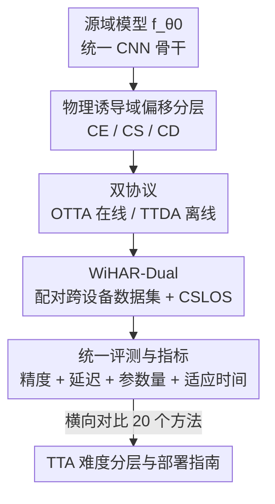

# WiTTA-Bench: Benchmarking Test-Time Adaptation for WiFi Sensing

**会议**: CVPR 2026  
**论文**: [CVF Open Access](https://openaccess.thecvf.com/content/CVPR2026/html/Li_WiTTA-Bench_Benchmarking_Test-Time_Adaptation_for_WiFi_Sensing_CVPR_2026_paper.html)  
**代码**: https://github.com/BdLI-group/WiTTABench  
**领域**: WiFi感知 / 测试时适应 / Benchmark  
**关键词**: WiFi感知, 测试时适应, 域偏移, 人体活动识别, 跨设备

## 一句话总结
WiTTA-Bench 是第一个系统评测「WiFi 感知测试时适应（TTA）」的基准：它把 WiFi 信道状态信息（CSI）的域偏移拆成跨环境、跨人、跨设备三类物理诱导偏移，在线（OTTA）与离线（TTDA）两套协议下统一跑了 20 个代表性 TTA 方法，并自采了一套配对的跨设备数据集 WiHAR-Dual，得出「CE < CS < CD 的难度分层、OTTA 与 TTDA 互补、视觉里好用的一致性方法在 WiFi 上反而失灵」等一批 WiFi 独有结论。

## 研究背景与动机

**领域现状**：WiFi 感知用普通路由器/网卡就能做被动、保护隐私的人体活动识别（HAR），是摄像头在暗光、遮挡、隐私敏感场景下的替代方案。近年基于 CSI 的深度模型（THAT、DeepFi、Person-in-WiFi 等）在「同分布」测试下精度很高。

**现有痛点**：这些模型一旦换了房间、换了人、换了网卡，精度就断崖式下跌——因为布局、体型、硬件的微小变化都会扰乱多径传播模式。真实部署里往往拿不到源域训练数据（隐私 + 在线约束），传统的域适应（DANN、MMD、MixStyle）需要源数据，因此不可用。测试时适应（TTA）只用无标签目标样本在推理阶段自校准，是更现实的方案。

**核心矛盾**：TTA 在计算机视觉里很成熟，但 WiFi 的域偏移本质不同——它来自无线物理传播和硬件差异（多径、衰减、天线增益、振荡器漂移），产生的是非平稳、设备相关的失真，而不是视觉里的纹理/风格变化。视觉 TTA 的经验能不能迁移到 WiFi，完全没人系统验证过；这个方向连一个统一的评测基准都没有。

**本文目标**：建立第一个 WiFi TTA 基准，回答三个问题——WiFi 域偏移的主导模式是什么（RQ1）、各类 TTA 方法在不同偏移下的效果如何（RQ2）、哪些因素影响 TTA 的有效性与效率（RQ3）。

**切入角度**：作者主张 WiFi 的偏移应该按「物理来源」而非「数据现象」来组织——环境、人、设备各自对应一类物理扰动（传播路径、人体运动动力学、硬件响应），从而构成一条难度递增的层级。

**核心 idea**：把「物理诱导的三类偏移 × 在线/离线两套协议 × 20 个 TTA 方法 × 兼顾精度与效率的指标」标准化成一个可复现、可扩展的测试床，并补上长期缺失的「干净跨设备」数据。

## 方法详解

这是一篇 benchmark 论文，所以「方法」= 数据集 + 评测协议 + 基准设计，而不是某个新模型。整篇工作把一个零散的研究问题（WiFi 模型换场景就崩）转成一个可量化、可对比的评测管线：固定同一个骨干网络，把目标域按物理来源切成三类偏移，在两套适应协议下跑 20 个 TTA 方法，用一组兼顾精度和部署成本的指标统一打分。

### 整体框架

输入是源域训练好的一个轻量 CNN 模型 $f_{\theta_0}$（4 个 Conv2d-BN-ReLU-MaxPool 块，通道数 [16, 32, 64, 128]，接两层 MLP 分类头）和无标签的目标域 CSI；输出是「20 个 TTA 方法 × 3 类偏移 × 2 套协议」的精度-效率画像，以及由此提炼的若干 WiFi 独有结论。整条评测管线如下：

整个基准把无标签目标样本喂给 TTA 方法，方法只能通过无监督目标（熵最小化、伪标签一致性等）就地更新模型 $\theta_t = \arg\min_\theta \mathcal{L}_{\text{TTA}}\big(f_\theta(x^{(t)})\big)$，全程不回看源数据 $D_S$——这是 source-free TTA 的硬约束，也是作者排除掉 DATTA、MDTA、CARING 等需要源标签/域监督方法的原因。

### 关键设计

**1. 物理诱导的三类域偏移分层：把「换场景就崩」拆成可解释的 CE / CS / CD**

WiFi 的偏移和视觉不同，作者坚持按物理来源切分而非按数据现象切分。三类偏移各自对应一种物理扰动：跨环境（CE）来自房间几何、材料、家具布局变化，改变多径轨迹和反射路径，导致时延扩展、路径增益、相位相干性变动；跨人（CS）来自体型、动作风格、步态速度，引入多普勒频移和动态散射，扭曲时间-频谱流形；跨设备（CD）来自天线方向图、标定偏置、振荡器漂移，造成幅度缩放、相位偏移、噪声底不匹配。作者通过 PCA/t-SNE/UMAP 特征可视化 + 聚类指标量化发现，这三类偏移在特征空间上呈现递增的破坏程度：CE 是整团特征「相干平移」（拓扑不变、只是统计包络漂移），CS 是「运动流形重组」（类边界被局部挤压变形），CD 则几乎是「完全不相交的流形」（甚至 PCA 轴出现镜像翻转）。这条 CE → CS → CD 的难度层级是全文的骨架，后面所有结论都挂在它上面。

**2. OTTA 与 TTDA 双协议：把「实时 vs 离线」两种部署现实都覆盖到**

同一类偏移，部署约束不同，能用的方法也不同。作者用两套互补协议统一所有基线（共享同一骨干和超参以保证公平）。OTTA（在线测试时适应）从 CSI 流里实时、逐 batch 地用轻量更新（多为 BatchNorm 重标定、熵最小化）跟随渐变偏移，强调低延迟、流式友好，每个 batch 后立即评测；TTDA（测试时域适应）则在无标签目标集上离线微调几个 epoch（仅归一化层或有限参数更新），冻结后稳定推理，适合一次性校准或边缘设备的短离线窗口。两者都是 source-free 的，区别只在「何时、如何」适应。这个二分让基准能干净地回答「实时性 vs 适应深度」之间的权衡，而不是把所有方法混在一个不公平的设定里比。

**3. WiHAR-Dual 配对跨设备数据集：补上长期缺失的「干净 CD」评测**

跨设备一直是 WiFi 感知最难也最缺数据的一环。已有数据集（MM-Fi、Widar3.0）把硬件和其他因素（环境、人）纠缠在一起，无法单独隔离设备偏移。作者自采了 WiHAR-Dual：在完全相同的环境、人、活动下，用两块异构网卡——Intel 5300（30 子载波 × 3 天线，802.11n）和 Atheros AR9580（56 子载波 × 1 天线，802.11ac 兼容）——同步配对录制，从而第一次提供了「只变设备、其他全控住」的受控 CD 基准。再配上 CSLOS 数据集补充 LOS/NLOS 遮挡多样性，两套数据合起来才能系统覆盖 CE/CS/CD 三类真实偏移。这个配对设计是整篇能可信地下「CD 最难」结论的前提。

**4. 兼顾精度与部署成本的统一指标体系：让「能不能上边缘设备」也进入排名**

WiFi 感知常部署在资源受限的边缘端，只看精度会误导。作者除准确率外还纳入四个效率指标：每样本 GFLOPs（计算量）、延迟（ms/样本，OTTA 的适应+推理耗时）、更新参数量、总适应时间（秒，TTDA 的离线微调耗时）。基准覆盖 5 大方法学类别（归一化标定、熵最小化、伪标签、抗遗忘正则、一致性/自监督），20 个方法全部共享同一骨干与超参，这样画出来的精度-延迟-参数 Pareto 前沿才有可比性，也才能给出「轻偏移用 OTTA、重偏移用 TTDA」这类直接面向部署的指南。

### 一个完整示例：一次跨设备适应

以 WiHAR-Dual 上 Atheros → Intel 的跨设备路由为例：源模型在 Atheros 上训练，直接用到 Intel 上时，t-SNE 里目标特征几乎和源域完全不相交、类簇坍塌翻转，基线精度极低（CD base 仅 ~14%）。此时在线的 OTTA（如 TENT）只靠 BatchNorm 重标定，因为 RF 响应已是「全新流形」，只能拿到边际提升（CD OTTA 平均 21.5%）；而离线的 TTDA 聚类方法 ASFA 能用整批目标数据重组类流形，把潜在运动几何在新 RF 世界里重建，绝对精度恢复最高 +30%（CD TTDA 最佳 37.0%）。这个例子正好说明三个设计如何咬合：CD 这一类「硬物理偏移」（设计 1）只有靠 TTDA 的结构性重对齐（设计 2）才救得动，而能可信地观测到这点，靠的是 WiHAR-Dual 的受控配对（设计 3）和把适应时间也算进去的指标（设计 4）。

## 实验关键数据

### 主实验：三类偏移下的难度分层

下表汇总各偏移类型下 OTTA / TTDA 的最佳与平均精度（Fig. 4，单位 %），清晰呈现 CE < CS < CD 的难度趋势，以及 TTDA 在重偏移下的优势：

| 偏移类型 | OTTA 最佳 | OTTA 平均 | TTDA 最佳 | TTDA 平均 |
|----------|-----------|-----------|-----------|-----------|
| 跨环境 CE | 35.2 | 32.2 | 55.6 | 48.4 |
| 跨人 CS | 35.8 | 33.7 | 38.5 | 37.5 |
| 跨设备 CD | 23.0 | 21.5 | 37.0 | 28.7 |

CD 上所有方法都明显掉点；TTDA 在 CE 上把精度推到 55.6%，远高于 OTTA，体现「离线全特征重对齐」的威力。

### 方法排名：WiHAR-Dual 上的两套协议

| 协议 | 最佳方法 | 最佳精度 | 最差方法 | 最差精度 |
|------|----------|----------|----------|----------|
| OTTA | T3A | 37.9 | CoTTA | 26.2 |
| TTDA | SHOT++ | 74.7 | SFDA-UR | 35.0 |

在 CSLOS 上 OTTA 最佳是 PETAL（34.3）、最差 CoTTA（24.9）；TTDA 最佳 BAIT（37.3）、最差 ISFDA（32.9）。值得注意的是重计算的一致性方法 CoTTA 在两套数据上都垫底，而轻量的归一化/熵方法（DUA、EATA、TENT）反而稳居前列。

### 消融/分析：骨干泛化性

为验证结论不依赖特定骨干，作者把默认 CNN 换成 MobileNetV2 和 ResNet-10，在 WiHAR-Dual 三类偏移下复测代表性 OTTA 方法（平均精度 %）：

| 设定 | 骨干 | Base | TENT | EATA | T3A | SAR |
|------|------|------|------|------|-----|-----|
| CE | ResNet-10 | 25.72 | 39.37 | 39.87 | 38.93 | 39.73 |
| CE | MobileNetV2 | 25.10 | 36.60 | 36.90 | 35.30 | 34.70 |
| CD | ResNet-10 | 14.29 | 28.55 | 28.93 | 14.29 | 29.02 |
| CD | MobileNetV2 | 15.60 | 39.30 | 38.50 | 15.40 | 38.80 |

跨 CE/CS/CD 的趋势高度一致：归一化类 OTTA 始终有效、CD 最难、方法排名基本保持——说明结论是 WiFi 物理层面的，不是骨干的产物。注意 T3A 在 CD 上几乎没提升（14.29 ≈ base），因为它只调分类头、不动统计量，救不了「全新流形」。

### 关键发现

- **反直觉：CE 比 CS 更好适应**，这与早期域适应文献相反。原因在偏移性质——CE 是全局低秩的「包络漂移」（类簇拓扑不变，只需重新居中 mean/variance 即可），而 CS 是「运动流形重组」，目标样本侵入并重塑类边界，破坏了简单重居中的假设，需要流形锚定或源监督。
- **域偏移指标预测不了 TTA 难度**：SS、CH、DB、熵、甚至 MMD 与适应后精度的 Spearman 相关只有 −0.21 ~ 0.18（|r| ≤ 0.25）。ME1→E3 聚类分数最差却不是 TTA 精度最低的——静态几何指标只刻画局部紧致度，捕捉不到优化稳定性、熵正则等动态因素，这是 WiFi 非平稳物理失真带来的根本局限。
- **视觉经验在 WiFi 上失灵**：视觉里一致性 OTTA（CoTTA）通常胜过归一化（TENT），但 WiFi 上恰好相反——硬件/天线增益/频率响应主导的失真不是语义变化，强制预测一致性耗算力却几乎不涨精度；WiFi 信号主要需要「重新居中（均值-方差对齐）+ 重新自信（熵抑制）」，而非伪目标自训练去「幻想」。
- **超参敏感性两极分化**：归一化 OTTA（TENT、DUA、EATA）在大范围学习率/batch 上精度平坦、鲁棒；聚类 TTDA（ASFA）则是尖锐的高增益最优点，参数偏一点就从 ~63% 暴跌到 35%——根源是 TTDA 递归伪标签自训练的反馈放大。
- **源模型质量正相关但会饱和**：源精度从 50% 调到 100%，TTA 精度随之上升但逐渐饱和；SHOT 在极高源精度下反而略降，提示过自信伪标签会自我强化偏置。
- **效率画像**：OTTA 在 <10 ms 延迟、≤1M 参数下维持 ~34-35% 精度；TTDA 以 80-500 s 适应时间换 45-60% 精度，ASFA 性价比最稳（~48%），SHOT++ 峰值最高（~57%）。

## 亮点与洞察

- **把「物理来源」当一等公民**：CE/CS/CD 的分层不是随便切的数据集划分，而是对应三种可解释的无线物理扰动，让「为什么 CD 最难」有了机理解释（设备 = 全新流形），这种「按物理而非按现象组织 benchmark」的思路可迁移到雷达、毫米波、声学等其他无线感知任务。
- **WiHAR-Dual 的受控配对是真功夫**：在相同环境/人/活动下用两块异构网卡同步录制，把硬件偏移从其它因素里干净剥离出来，这是能可信下「CD 最难、需结构重对齐」结论的实验前提，也是社区长期缺的资源。
- **一条对从业者极实用的部署指南**：轻偏移（CE/CS）用低延迟 OTTA，重偏移（CD）用离线 TTDA——直接把「精度-延迟-参数」三维权衡落到可操作的选型规则上。
- **打破跨模态的经验直觉**：「视觉里好用的一致性方法在 WiFi 上反而浪费算力」这个发现提醒大家不要盲目把 vision TTA 搬到无线域，WiFi 真正需要的是统计重居中而非伪标签自训练。

## 局限性 / 可改进方向

- **任务局限于 HAR**：基准只覆盖人体活动识别，作者也承认；不过 CE/CS/CD 层级源自任务无关的无线物理（多径、散射、硬件响应），预期可泛化到其他 WiFi 感知任务，但这只是「预期」，缺少实证。
- **没有提出新方法**：WiTTA-Bench 只是评测床，揭示了「物理诱导偏移需要 physics-aware TTA」却没给出针对 WiFi 设计的新适应算法，CD 这类硬偏移仍是开放难题（最佳也才 ~37%）。
- **指标预测失败留下空白**：现有静态域偏移指标无法预测 TTA 难度，但论文没给出能预测的替代指标，部署前「这个目标域好不好适应」仍无法预判。
- **数据规模与多样性有限**：WiHAR-Dual 仅两块网卡、CSLOS 仅遮挡多样性，活动类别数（7~12 类）和受试者规模都不大，跨设备结论是否在更多硬件组合上成立有待验证。
- **可改进方向**：可以探索「物理先验注入的 TTA」（如显式建模多径包络漂移做重居中、对 CD 做硬件无关的相位/幅度标定），以及能在线预判适应难度的动态指标。

## 相关工作与启发

- **vs 视觉 TTA 基准（如通用 TTA benchmark）**: 它们针对视觉的纹理/风格/损坏偏移，结论是一致性方法占优；WiTTA-Bench 把同一套方法搬到 WiFi CSI 上，发现物理诱导偏移让结论翻转（归一化/熵方法占优），把 TTA 评测的范围首次从视觉扩展到无线感知。
- **vs WiFi 专用适应方法（DATTA、MDTA、CARING）**: 这些方法依赖有标签源域、域监督或有标签目标样本，违反严格的 source-free TTA 假设，因此不在本基准的可比范围；WiTTA-Bench 坚持「只用无标签目标、不回看源数据」的干净设定，第一次给出公平横评。
- **vs 传统域适应/泛化（DANN、MMD、MixStyle）**: 它们需要源数据做特征对齐或不变表示学习，无法满足隐私和在线部署约束；TTA（及本基准）则在推理时就地自校准，更贴近真实 WiFi 边缘部署。
- **启发**: 「按物理来源分层 + 把效率指标纳入排名 + 提供受控配对数据」这套基准方法论，对任何「换硬件/换场景就崩」的传感任务（IMU、雷达、声学）都有借鉴价值。

## 评分
- 新颖性: ⭐⭐⭐⭐ 第一个 WiFi TTA 基准 + 自采受控跨设备数据集，物理分层视角新颖；但属基准而非新方法。
- 实验充分度: ⭐⭐⭐⭐⭐ 20 方法 × 3 偏移 × 2 协议 × 2 数据集，含骨干泛化、超参敏感、源质量、Pareto、持续适应等多维分析。
- 写作质量: ⭐⭐⭐⭐ 结构清晰、结论有机理解释；图表偏多、部分附录依赖，正文细节略密。
- 价值: ⭐⭐⭐⭐⭐ 为 WiFi 感知 TTA 立了可复现标准与部署指南，并给出一批反直觉的实用结论，社区基础设施价值高。

<!-- RELATED:START -->

## 相关论文

- [\[CVPR 2026\] Neural Collapse in Test-Time Adaptation](neural_collapse_in_test-time_adaptation.md)
- [\[CVPR 2026\] Towards Stable Federated Continual Test-Time Adaptation in Wild World](towards_stable_federated_continual_test-time_adaptation_in_wild_world.md)
- [\[CVPR 2026\] Back to Source: Open-Set Continual Test-Time Adaptation via Domain Compensation](back_to_source_open-set_continual_test-time_adaptation_via_domain_compensation.md)
- [\[CVPR 2026\] Curvature-Aware Zeroth-Order Optimization for Memory-Efficient Test-Time Adaptation](curvature-aware_zeroth-order_optimization_for_memory-efficient_test-time_adaptat.md)
- [\[CVPR 2026\] Dance Across Shifts: Forward-Facilitation Continual Test-Time Adaptation through Dynamic Style Bridging](dance_across_shifts_forward-facilitation_continual_test-time_adaptation_through_.md)

<!-- RELATED:END -->
