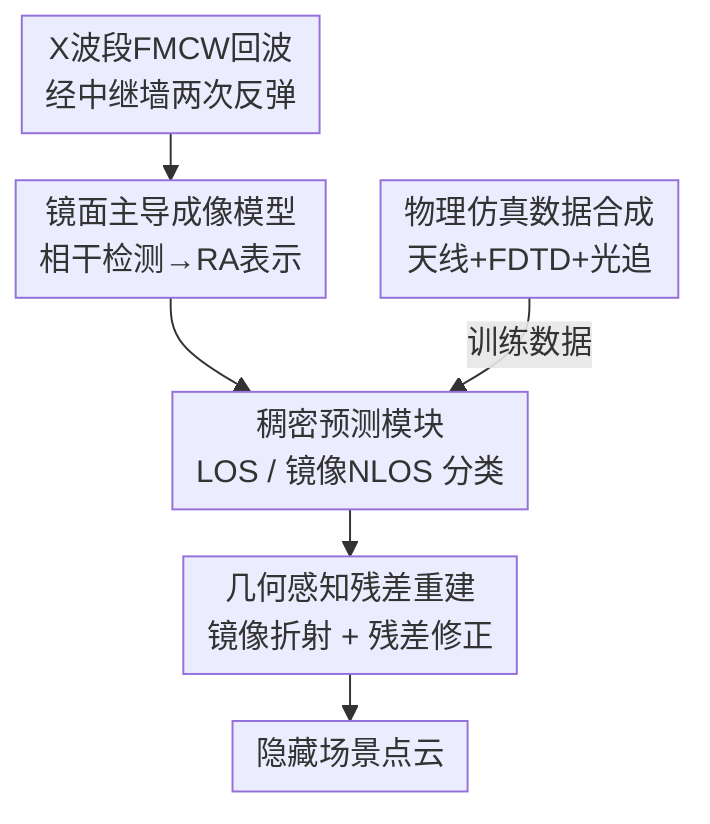

# X-band Radar Non-Line-of-Sight Imaging

**会议**: CVPR 2026  
**论文**: [CVF Open Access](https://openaccess.thecvf.com/content/CVPR2026/html/Du_X-band_Radar_Non-Line-of-Sight_Imaging_CVPR_2026_paper.html)  
**代码**: 待确认  
**领域**: 计算成像 / 雷达感知  
**关键词**: 非视距成像, X 波段雷达, 镜面反射, 几何感知重建, 自动驾驶感知

## 一句话总结
用 10 GHz 的 X 波段雷达取代光学/毫米波传感器做非视距（NLOS）成像，借助长波长把粗糙墙面的"漫反射"变成"镜面反射"，再配一套"稠密预测 + 几何感知残差重建"的神经网络对抗长波带来的低角分辨率，把"拐角成像"的可用距离从光学的几米一举拉到真实场景 40 m。

## 研究背景与动机
**领域现状**：非视距成像（NLOS imaging）想做的事是"看见拐角后面的东西"——物体不在直接视线（LOS）里，但它发出/反射的信号经过中继墙（relay wall）多次反弹后还是能被传感器收到，于是可以反推隐藏几何。过去十年这个方向绝大多数工作都在光学可见光/红外波段做，靠 SPAD + 飞秒激光做瞬态成像，再用 f-k migration、LCT、phasor field 等逆问题方法重建。

**现有痛点**：光学 NLOS 有一个物理上的死穴——它依赖**漫反射**的多次反弹。每反弹一次，回波强度按距离的平方衰减（quadratic falloff），两三次反弹下来信号衰减得比噪声平均还快；而照明功率又被人眼安全限制卡死，所以光学 NLOS 实际只能工作在**几米**量级，根本没法用在自动驾驶这种需要几十米感知的户外场景。为了缓解衰减，一部分工作把 NLOS 推到毫米波（77 GHz，λ≈3.9 mm），但 77 GHz 的波长和典型中继墙的表面粗糙度（σ≈10⁻⁴–10¹ mm）相当，墙面对它仍然是**强漫反射**，进到隐藏区的能量依然很弱。

**核心矛盾**：波长是把双刃剑。波长越短，角分辨率越高、重建越准，但漫反射越严重、衰减越快、传不远；波长越长（X 波段 10 GHz，λ=30 mm），墙面相对它变"光滑"、镜面反射占主导、能量传得远，但角分辨率随之崩坏、空间信息糊成一团。光学/毫米波选了前者牺牲了距离，本文要选后者，于是必须解决"长波长导致的低分辨率"这个副作用。

**切入角度**：作者注意到自由空间路径损耗随频率单调上升——10 GHz 相比 77 GHz 少约 20 dB、相比光学少约 150 dB；同时表面散射随波长变长被强烈抑制，镜面/漫反射比（specular-to-diffuse ratio）显著升高。也就是说，在 X 波段下，原本"漫反射"的墙面近似变成一面"镜子"，把发射波规整地折向拐角后方。

**核心 idea**：**用 X 波段雷达把 NLOS 拉进"镜面散射区"换取超长距离，再用神经网络重建去补回长波长损失的角分辨率**——物理建模负责"能传远"，学习模块负责"看得清"。

## 方法详解

### 整体框架
系统输入是 X 波段相控阵雷达发出 FMCW 调频信号、经中继墙两次反弹后收到的回波；输出是隐藏区域物体的笛卡尔坐标点云（NLOS recovery）。中间分三段：先用物理推导得到一个**镜面主导的 NLOS 成像模型**，把回波经相干检测整理成距离-方位（Range-Azimuth, RA）表示；再用一个 **Swin-UNet 稠密预测模块**在这张糊掉的 RA 图上逐像素定位峰值，并把每个点分成 LOS 还是镜像 NLOS（mNLOS）；最后用**几何感知残差重建模块**，根据可见区与隐藏区之间的镜面反射几何，把 mNLOS 点折射回它们真正的物理位置。训练数据则由一套**物理仿真器**合成，它把成像模型落地为可生成 RA 图的端到端雷达模拟器。

### 关键设计

**1. X 波段镜面主导成像模型：把"积分整片墙"塌缩成"一面镜子"**

最一般的 NLOS 前向模型要对中继墙 $\Pi$、隐藏物体 $O$ 上所有可行光路 $L(\mathbf{w}_1,\mathbf{o},\mathbf{w}_2)$ 做三重积分（式 1），既要乘收发波束方向图 $B_t,B_r$，又要乘三处表面反射率和路径衰减，计算和反演都极重。作者抓住 X 波段的物理特性做简化：长波长下墙面近似镜面，墙面 BRDF 退化成一个狄拉克 delta 形式的镜面核 $\rho_\Pi(\mathbf{w}_1)\approx\alpha(\mathbf{w}_1)\,\delta(\mathbf{n}\mathbf{r}_{\mathbf{w}_1\mathbf{o}}-\mathbf{n}\mathbf{r}_{\mathbf{l}\mathbf{w}_1})$（式 2，入射角=反射角才有响应）。这个约束直接把三重积分塌缩到唯一的镜面反射点 $\mathbf{w}_1^\star,\mathbf{w}_2^\star$ 上（式 3）。

更妙的是，由于墙变成镜子，可以用反射算子 $R_\Pi$ 把真实隐藏物体 $O$ 映射成镜面后方的虚拟物体 $O'$，整个 NLOS 测量等价于"隔着一层透明界面看虚拟场景"（式 5）。同时路径衰减也从一般形式简化为单跳自由空间传播：两次镜面反弹等价于一段总长 $r_t+r_r$ 的直传，回波功率按有效距离平方反比衰减 $A=1/L^2$（式 4），而不是漫反射那种逐次平方叠加。正是这个"漫→镜"的转换，让同等发射功率下 NLOS 可用距离比光学远约 10×——这是整篇论文能"传得远"的物理根基。

**2. 稠密预测模块：在糊掉的 RA 图上把峰值点抠出来并分清 LOS / mNLOS**

X 波段角分辨率低，RA 图上目标峰宽而散、信噪比低，直接 CFAR 检峰会漏掉低 SNR 目标，也分不清哪些是直接视线回波、哪些是绕墙来的镜像回波。作者把复数 RA 测量 $\kappa\in\mathbb{C}^{H\times W}$ 喂进一个 Swin-UNet 形态的 Transformer 编解码骨干，它能建模长程空间依赖、兼顾局部几何细节和全局上下文，从而精确定位宽峰。解码特征经线性层投到两通道、再过逐元素 Sigmoid，得到稠密置信图 $c\in[0,1]^{H\times W\times 2}$，两个通道分别编码该像素是 LOS 点 $\mathbf{w}$ 还是 mNLOS 反射点 $\mathbf{o}'$ 的概率。

训练用高斯热图 + focal loss（式 8，$\alpha=2,\beta=4$）来监督：每个真值峰位放一个高斯核，focal loss 强调难例、压制背景。之所以用高斯热图而不是逐格二值标签，是因为 X 波段的峰天然横跨多个 RA 单元——对手"Further Than CFAR"用 per-cell 二值监督就被宽峰坑了，RTN 那种目标检测式监督则在峰挨得很近时重建失败。用 Transformer 捕全局特征这一点也很关键：消融里把 Swin-UNet 换成普通 UNet，Macro-F1 直接掉 21.2%。这一步本质是用学习把长波长丢掉的角分辨率"上采样"回来。

**3. 几何感知残差重建：先按镜面几何把镜像点折回去，再学一个残差修真**

稠密预测拿到的 mNLOS 点 $\mathbf{o}'$ 还停在"镜子后方"的虚拟位置，必须折射回真实隐藏点 $\mathbf{o}$。朴素做法是纯解析镜面反射：把每个 mNLOS 点按几何角一致性锚定到最可信的 LOS 簇、聚类出一段局部中继墙、再线拟合估出墙法向 $\mathbf{n}$，然后做镜面对称。但 LOS 采样稀疏，解析法向估得很噪，curved wall、墙面非理想性会带来系统性偏差。

作者的解法是在解析镜面反射上叠一个**学习残差** $\Delta\mathbf{o}_\theta$：

$$\mathbf{o} = R_\Pi(\mathbf{o}') + \Delta\mathbf{o}_\theta = \big(\mathbf{o}' - 2(\mathbf{n}^\top\mathbf{o}'+b)\mathbf{n}\big) + \Delta\mathbf{o}_\theta$$

其中 $b$ 是墙的线偏移，$\Delta\mathbf{o}_\theta$ 由对中继墙上邻近点做注意力聚合预测，用 $\ell_1$ 损失监督到"真值点与解析镜像之差"（式 9）。这样解析项提供了强几何先验、让网络好学，残差项专门修墙面弯曲等非理想偏差，最终既准确又可解释。消融显示去掉残差后重建 F1 从 0.45 掉到 0.40、CD 从 8.2 升到 9.2——几何先验 + 残差修正的组合确实把重建质量顶上去了。

**4. 物理信息仿真数据合成：把成像模型变成能产真实 RA 图的端到端模拟器**

真实 X 波段 NLOS 数据极难大规模采集且无密集真值，而以往信号级模拟器又太粗。作者基于第 3 节的成像模型搭了一套端到端雷达模拟器：先物理建模 4×8 天线阵的 3D 辐射方向图、阵元耦合与精确几何；用 FDTD（时域有限差分）解算不同材料的反射系数与传播损耗；从 Unreal Engine 取真实材质与场景几何；再用专门的光线追踪器把天线仿真与材料参数整合、建模多径传播；最后让 RF 信号过相干检测产出 RA 数据。由此合成 2,160 张带真值的 RA 图，覆盖城市、停车场、住宅等多样场景，专供稠密预测模块训练与跨模态评测——它是"看得清"那条学习链路的数据弹药。

### 损失函数 / 训练策略
两段式监督：稠密预测模块用高斯热图 + focal loss（式 8）预训练，对正样本用 $(1-c)^{\alpha}\log c$、对负样本按到峰距离的高斯权 $(1-Y)^{\beta}$ 衰减，$\alpha=2,\beta=4$；几何感知模块用残差的 $\ell_1$ 损失（式 9），把预测残差对齐到"真值点 − 解析镜像点"。模型只在仿真数据上训练，再迁移到真实样机数据上评测。

## 实验关键数据

### 主实验
评测分两个子任务：**稠密预测**（在未折射的原始点云上评 LOS/mNLOS 的定位与分类）和**重建**（折射回真实位置后评完整点云），指标用 Macro-F1（越高越好）和 Chamfer Distance CD（越低越好）。基线包括雷达 NLOS 经典法 NLOS-CFAR、两个学习基线 Further Than CFAR 与 RTN。仿真集结果（Table 2）：

| 数据/方法 | 稠密预测 Macro-F1 ↑ | 重建 F1 ↑ | 重建 CD [m²] ↓ |
|-----------|------|------|------|
| NLOS-CFAR | 0.23 | 0.03 | 29.7 |
| RTN | 0.57 | 0.20 | 14.0 |
| Further Than CFAR | 0.41 | 0.16 | 13.5 |
| **本文 Proposed** | **0.85** | **0.45** | **8.2** |

作者报告：稠密预测 Macro-F1 比次优基线 RTN 高 32.9%；几何感知重建相对次优基线 F1 提升 55.6%、CD 降低 65.3%。在真实样机数据上（122 帧 / 15 个户外场景），本文稠密预测 F1=0.47、重建 F1=0.20、CD=24.3，同样在 F1 上领先所有基线，并实测在 40 m 处（往返 80 m）准确重建出 NLOS 车辆。

### 消融实验
| 配置 | 稠密预测 Macro-F1 ↑ | 重建 F1 ↑ | 重建 CD [m²] ↓ | 说明 |
|------|------|------|------|------|
| Proposed（完整） | 0.85 | 0.45 | 8.2 | Swin-UNet + 残差重建 |
| Proposed w/o residual | 0.85 | 0.40 | 9.2 | 去掉学习残差，只用解析镜像 |
| Proposed + UNet | 0.67 | 0.27 | 11.9 | Swin-UNet 换成普通 UNet |

### 关键发现
- **骨干网比检测头更影响"看不看得见"**：把 Swin-UNet 换成普通 UNet，稠密预测 Macro-F1 掉 21.2%（0.85→0.67），说明 Transformer 的全局上下文对在低 SNR、宽峰的 X 波段图上分清 LOS/mNLOS 是刚需，卷积骨干捕不到全局特征。
- **学习残差贡献在"准不准"**：去掉残差后稠密预测 F1 不变（0.85），但重建 F1 从 0.45 掉到 0.40、CD 从 8.2 升到 9.2——残差专门修墙面弯曲等非理想偏差，价值落在最终几何精度上。
- **跨模态验证印证物理直觉**：同等 1.6 mW 发射功率下，850 nm 的 SPAD-LiDAR 只能重建近处、远处 NLOS 全失；77 GHz 雷达 LOS 距离改善但 NLOS 仍受漫反射限制；只有 X 波段让同样的墙面变镜面，NLOS 可用距离约为光学的 10×。
- **基线 CD 偶尔偏低有 caveat**：Further Than CFAR 在墙附近预测大量假阳点，反而简化了后续墙拟合，CD 看着略低，但其稠密预测 CD 被假阳撑得很高，整体并不优。

## 亮点与洞察
- **"换波段把漫反射变镜面"是物理层面的降维打击**：与其在光学/毫米波里硬抗衰减，不如换到 X 波段让物理站到自己这边——这个"用更长波长换更强镜面 + 更远距离，再用学习补回分辨率"的取舍，是整篇论文最聪明的一步。
- **解析几何先验 + 学习残差的组合范式可迁移**：先用物理可解释的解析解打底（镜面对称式），再让网络只学"难以解析的非理想偏差"，比纯端到端回归更好学、更可解释，CD 下降明显。这套思路在任何"有强物理先验但现实有系统偏差"的重建任务里都能借鉴。
- **高斯热图监督对宽峰友好**：X 波段峰天然横跨多个 RA 单元，逐格二值监督会失效——把检测建成高斯热图回归是个被实验证实的实用 trick。
- **端到端物理仿真器是数据闭环的关键**：FDTD 材料反射 + Unreal 场景 + 光追多径，让"无密集真值"的雷达 NLOS 也能拿到 2,160 张可训练样本，仿真器本身就是可复用资产。

## 局限与展望
- **未用多普勒信息**：当前样机不利用 Doppler 线索，作者把它列为未来工作；这意味着动态目标的速度/运动信息被浪费了。
- **仅在仿真训练、真实数据迁移**：模型只在合成 RA 图上训练，真实数据上指标（重建 F1=0.20、CD=24.3）明显低于仿真（0.45 / 8.2），sim-to-real gap 仍不小。
- **依赖镜面假设**：方法的物理根基是"X 波段下墙面近似镜面"，对极端粗糙、强弯曲或多次复杂反弹的中继面，镜面塌缩近似会失效（作者也专门测了 beam splitting 与 curved wall 的挑战场景）。
- **样机规模有限**：4×8 阵列、122 帧 / 15 场景，真实评测体量偏小；穿透雾、植被等恶劣条件的鲁棒性也还是展望而非已验证。
- **可改进方向**：把多普勒并入重建、用穿透特性扩展到遮挡更强的场景、扩大真实数据并做 sim-to-real 自适应都是自然的下一步。

## 相关工作与启发
- **vs 光学 NLOS（f-k migration / LCT / phasor field）**: 它们靠短波长拿到厘米级 3D 精度，但漫反射多次衰减 + 人眼安全功率限制把距离锁死在几米；本文用 X 波段把距离推到 40 m，代价是角分辨率低、需要学习模块补回，精度不及光学但距离量级碾压。
- **vs 77 GHz 毫米波 NLOS（Scheiner / NLOS-CFAR）**: 毫米波波长仍与墙面粗糙度相当、漫反射严重，NLOS 区受限；本文降到 10 GHz 让墙面更镜面，路径损耗再少约 20 dB，NLOS 能量更强。
- **vs UWB NLOS（Tang / Chen）**: UWB 距离够远但角分辨率极差（10°–14.5°），只能做粗定位、靠已知中继墙反传多径；本文角分辨率 4°，并用稠密预测 + 几何重建实现细粒度隐藏物体重建。
- **vs 雷达感知（RTN / Further Than CFAR）**: 这些方法多为直接视线检测或 per-cell 监督，迁移到 NLOS 时被宽峰、低 SNR 坑；本文 Swin-UNet + 高斯热图在稠密预测上把它们甩开 30%+。

## 评分
- 新颖性: ⭐⭐⭐⭐⭐ 首个把 NLOS 成像推进 X 波段、用"漫→镜"换 10× 距离的工作，物理建模 + 神经重建 + 物理仿真器三位一体。
- 实验充分度: ⭐⭐⭐⭐ 有仿真跨模态对比、真实样机 40 m 验证、消融拆解两个模块；但真实数据体量偏小、sim-to-real gap 仍明显。
- 写作质量: ⭐⭐⭐⭐⭐ 物理推导（式 1→5 的塌缩）讲得清楚，动机的波长权衡逻辑顺，图表完整。
- 价值: ⭐⭐⭐⭐⭐ 把"拐角成像"从实验室几米推向户外几十米，对自动驾驶绕墙感知有实打实的应用潜力。

<!-- RELATED:START -->

## 相关论文

- [\[ECCV 2024\] Domain Reduction Strategy for Non-Line-of-Sight Imaging](../../ECCV2024/others/domain_reduction_strategy_for_non-line-of-sight_imaging.md)
- [\[CVPR 2026\] Region-Wise Correspondence Prediction between Manga Line Art Images](region-wise_correspondence_prediction_between_manga_line_art_images.md)
- [\[CVPR 2026\] Dual-Band Thermal Videography: Separating Time-Varying Reflection and Emission Near Ambient Conditions](dual_band_thermal_videography_separating_time-varying_reflection_and_emission_ne.md)
- [\[CVPR 2026\] Adaptive Bayesian Early-Exit Networks for Efficient Non-Transferable Learning](adaptive_bayesian_early-exit_networks_for_efficient_non-transferable_learning.md)
- [\[CVPR 2026\] NexusFlow: Unifying Disparate Tasks under Partial Supervision via Invertible Flow Networks](nexusflow_unifying_disparate_tasks_under_partial_supervision_via_invertible_flow.md)

<!-- RELATED:END -->
