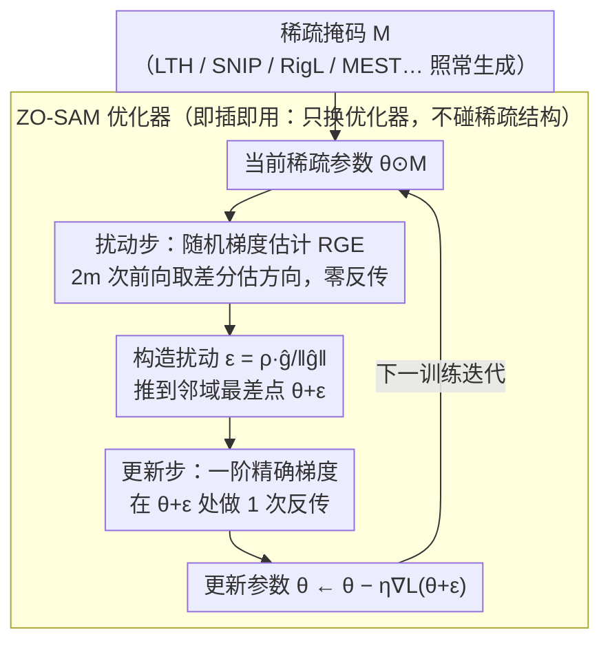

# ZO-SAM: Zero-Order Sharpness-Aware Minimization for Efficient Sparse Training

**会议**: CVPR 2026  
**arXiv**: [2603.13115](https://arxiv.org/abs/2603.13115)  
**代码**: 无  
**领域**: 其他  
**关键词**: 稀疏训练, SAM, 零阶优化, 梯度方差, 平坦极小值

## 一句话总结

提出 ZO-SAM，在 SAM 的扰动步骤中用零阶梯度估计替代反向传播，将 SAM 的计算开销从 2 次反传减少为 1 次，首次让 SAM 在稀疏训练中变得实用，在 CIFAR-10/100 和 ImageNet-1K 上一致提升所有主流稀疏训练方法 0.38%-2.54%。

## 研究背景与动机

**领域现状**：稀疏神经网络通过保持少量活跃权重大幅降低参数量和计算成本。主流方法分静态（LTH, SNIP, GraSP）和动态（SET, DSR, RigL, MEST）两类。

**现有痛点**：
   - 稀疏训练中梯度信号混乱嘈杂——大量权重被剪枝后，剩余参数承担不成比例的负担，梯度方差随稀疏度增加急剧增大
   - 高稀疏度导致损失面变窄变陡，优化轨迹低效迂回
   - SAM 可引导模型到平坦极小值来缓解这些问题，但其**双重反传的计算开销**正好违背了稀疏训练节约计算的初衷

**核心矛盾**：SAM 的泛化收益 vs 双倍计算开销，在稀疏训练（本身就是为省计算）的场景下矛盾尤为突出

**切入角度**：SAM 的扰动步骤对梯度精度要求不高（只需确定扰动方向），可用粗糙的零阶估计替代精确梯度

**核心 idea**：在 SAM 扰动步用零阶随机梯度估计（RGE），更新步保留一阶精确梯度，将反传次数从 2 减为 1

## 方法详解

### 整体框架

标准 SAM 的每一步要做两次前向反传：先正常算一遍梯度找到"最伤泛化的扰动方向" $\epsilon$，把参数推到 $\theta+\epsilon$ 这个邻域最差点，再在那里算一遍梯度真正更新参数。这第二遍计算才是为了到达平坦极小值，第一遍只是为了挑方向——而 ZO-SAM 的核心观察正是：挑方向这件事根本不需要精确梯度。于是它把第一步（扰动步）换成不需要反传的零阶梯度估计，只在第二步（更新步）保留一次精确反传，整体反传次数从 2 降到 1。

扰动步用估计出的梯度方向构造扰动 $\epsilon = \rho \frac{\hat{\nabla}\mathcal{L}(\theta)}{\|\hat{\nabla}\mathcal{L}(\theta)\|}$，更新步在扰动点 $\theta^*(\epsilon)=\theta+\epsilon$ 处用精确梯度更新 $\theta \leftarrow \theta - \eta \nabla\mathcal{L}(\theta^*(\epsilon))$。整个 ZO-SAM 只是顶替优化器套在稀疏训练循环外面，稀疏掩码 $M$ 怎么生成照旧，这样既拿到了 SAM 引导平坦极小值的泛化收益，又把开销压回到接近普通 SGD 的水平，刚好回应了稀疏训练"本来就是为省计算"的初衷。

### 关键设计

**1. 随机梯度估计（RGE）替代扰动步反传：把"挑方向"的成本压到几乎为零**

第一遍反传是 SAM 双倍开销的来源，但扰动步只是想知道"往哪个方向推参数最伤泛化"，方向大致对就够了。ZO-SAM 因此用随机梯度估计（Random Gradient Estimation）从前向函数值差分里估出梯度方向：

$$\hat{\nabla}\mathcal{L}(\theta) = \frac{1}{m}\sum_{i=1}^m \frac{\mathcal{L}(\theta + \delta u_i) - \mathcal{L}(\theta - \delta u_i)}{2\delta} u_i$$

其中 $u_i \sim \mathcal{N}(0, I)$ 是随机采样的扰动方向，$\delta$ 是小步长，$m \ll d$ 是采样数。它只需 $2m$ 次前向传播，而 $m$ 取得很小，成本远低于一次完整反传。这里没有选另一种零阶方案 CGE（坐标式梯度估计），因为 CGE 要沿每个坐标各评估一次、共 $d$ 次，而 $d$ 是百万级的参数维度，根本不可行；RGE 用少量随机方向采样既算得起，其随机性还顺带让景观探索更平滑。

**2. 更新步保留一阶精确梯度：在真正决定收敛的那一步不省精度**

扰动步可以糊弄，但更新步直接决定参数往哪走、能不能稳定收敛，这里的梯度噪声会被放大成训练发散。所以 ZO-SAM 不动这一步——在扰动后的点 $\theta^*(\epsilon)$ 处仍用标准反传算精确梯度再更新。整套方法的巧思就在这种"按需分配精度"：在只需方向的地方用零阶省掉一次反传，在需要精度的地方老老实实保留一阶。

**3. 作为优化器即插即用，兼容所有稀疏训练方法：不碰稀疏结构本身**

ZO-SAM 只改优化器、不改稀疏结构搜索逻辑，因此可以直接顶替 SGD 套在任何稀疏训练流程外面。论文据此验证了与 7 种方法的组合——静态的 LTH、SNIP、GraSP 和动态的 SET、DSR、RigL、MEST——稀疏掩码怎么生成、怎么动态调整都照旧，ZO-SAM 只负责把优化轨迹引向更平坦的极小值。

### 损失函数 / 训练策略

训练用标准分类交叉熵损失，ZO-SAM 只替换优化器、不引入额外损失项。超参方面，邻域大小 $\rho$ 直接继承 SAM 默认值，新增的只有零阶步长 $\delta$ 和采样数 $m$ 两个。

## 实验关键数据

### 主实验 — ResNet-32 on CIFAR-10/100（90%/95%/98% 稀疏度）

| 方法 | CIFAR-10 90% | CIFAR-10 98% | CIFAR-100 90% | CIFAR-100 98% |
|------|-------------|-------------|--------------|--------------|
| RigL | 93.07 | 89.00 | 70.34 | 64.07 |
| **RigL+ZO-SAM** | **93.66**(+0.59) | **90.61**(+1.61) | **72.88**(+2.54) | **65.17**(+1.10) |
| MEST | 92.56 | 89.22 | 70.44 | 64.59 |
| **MEST+ZO-SAM** | **93.50**(+0.94) | **91.53**(+2.31) | **72.20**(+1.76) | **66.01**(+1.42) |

### Transformer on ImageNet-1K

| 模型 | 稀疏度 | 方法 | Accuracy(%) | 提升 |
|------|--------|------|-------------|------|
| DeiT-Small | 70% | RigL | 77.99 | - |
| DeiT-Small | 70% | **RigL+ZO-SAM** | **79.16** | +1.17 |
| DeiT-Tiny | 50% | SViTE | 70.18 | - |
| DeiT-Tiny | 50% | **SNIP+ZO-SAM** | **71.32** | +1.14 |

### 收敛速度对比

| 方法 | 达到90%精度的epoch数（CIFAR-10, sp=0.9） |
|------|--------------------------------------|
| SGD | 104 |
| ESAM | 75 |
| LookSAM(k=5) | 79 |
| GSAM | 84 |
| **ZO-SAM** | **70** |

### 关键发现
- **稀疏度越高，ZO-SAM 收益越大**：98% 稀疏度下提升最显著（MEST+ZO-SAM 在 CIFAR-10 上 +2.31%），因为高稀疏度梯度方差问题更严重
- ZO-SAM 使损失面从窄深盆地变为宽浅盆地（可视化验证）
- 梯度方差显著降低：90% 稀疏度下 ZO-SAM 的梯度方差约为 SGD 的 1/3
- 收敛速度比 SGD 快约 30 个 epoch，与 ESAM 等高效 SAM 变体相当
- 在 Transformer（DeiT）上同样有效，不局限于 CNN
- 在 CIFAR-10-C 分布偏移测试中表现更鲁棒

## 亮点与洞察
- **精确诊断稀疏训练的核心问题**：不是笼统说"稀疏训练难"，而是精确定位到"梯度方差大"这个具体原因，然后针对性解决。
- **零阶-一阶的混合策略非常巧妙**：扰动步不需要精确方向（用零阶），更新步需要精确梯度（用一阶），精准分配计算资源。这种"在不需要精度的地方省计算"的思路值得学习。
- **即插即用的通用性**：7 种稀疏训练方法 × 3 种稀疏度 × 2 个数据集全面提升，无需修改稀疏方法本身。
- **SAM 在稀疏训练中的首次实用化**：之前 SAM 的双倍开销使其在稀疏训练中不实际，ZO-SAM 消除了这个障碍。

## 局限与展望
- RGE 引入的近似噪声在极高维度下可能累积，大模型上需更多验证
- 零阶采样数 $m$ 的选择缺乏自适应策略，目前需手动调优
- 仅验证了 $\ell_\infty$ 稀疏训练，结构化稀疏（如通道剪枝）未涉及
- 在完整 ImageNet-1K 上仅测了 DeiT-Tiny/Small，更大模型（ViT-Large 等）的效果未知
- 与更高效的 SAM 变体（ESAM, LookSAM）的组合未探索——是否可以"ZO-ESAM"进一步加速？

## 评分
- 新颖性: ⭐⭐⭐⭐ 零阶+SAM 的组合虽然简单，但选择性地应用于扰动步的设计决策体现了深入思考
- 实验充分度: ⭐⭐⭐⭐⭐ 7 种方法 × 3 稀疏度 × 多数据集/架构，覆盖全面
- 写作质量: ⭐⭐⭐⭐ 动机分析（梯度方差、损失面可视化）做得好
- 价值: ⭐⭐⭐⭐ 让 SAM 在稀疏训练中真正可用，实际工程价值高

<!-- RELATED:START -->

## 相关论文

- [\[CVPR 2026\] Order Matters: 3D Shape Generation from Sequential VR Sketches](order_matters_3d_shape_generation_from_sequential_vr_sketches.md)
- [\[CVPR 2026\] ViT3: Unlocking Test-Time Training in Vision](vit3_unlocking_test_time_training_in_vision.md)
- [\[NeurIPS 2025\] Sharpness-Aware Minimization with Z-Score Gradient Filtering](../../NeurIPS2025/others/sharpness-aware_minimization_with_z-score_gradient_filtering.md)
- [\[CVPR 2026\] Rethinking SNN Online Training and Deployment: Gradient-Coherent Learning via Hybrid-Driven LIF Model](rethinking_snn_online_training_and_deployment_grad.md)
- [\[CVPR 2026\] FEAT: Federated Geometry-Aware Correction for Exemplar Replay under Continual Dynamic Heterogeneity](feat_federated_geometry_aware_correction_for_exemplar_replay_under_continual_dynamic_heterogeneity.md)

<!-- RELATED:END -->
