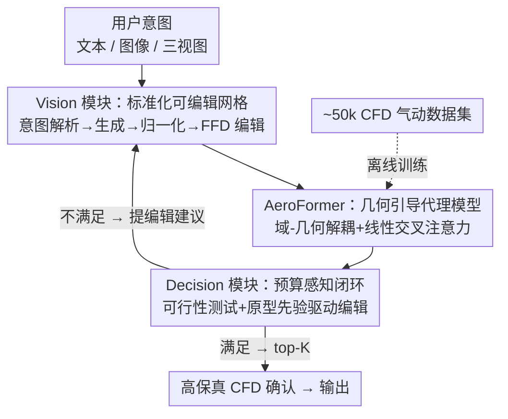

# AeroAgent: A Vision-Physics-Decision Framework for Aerodynamic Vehicle Design

**会议**: CVPR 2026  
**论文**: [CVF Open Access](https://openaccess.thecvf.com/content/CVPR2026/html/Liu_AeroAgent_A_Vision-Physics-Decision_Framework_for_Aerodynamic_Vehicle_Design_CVPR_2026_paper.html)  
**代码**: 未公开  
**领域**: Agent / 物理仿真 / 3D生成  
**关键词**: 气动设计, AI agent, CFD代理模型, 闭环优化, Transformer surrogate

## 一句话总结
AeroAgent 把"文本/图像生成 3D 车形 → 用 Transformer 代理模型 AeroFormer 秒级预测阻力和流场 → 规划器在预算内做 propose-evaluate-refine 闭环编辑"串成一个统一框架，只在最后用少量高保真 CFD 确认 top-K 候选，5 步迭代即可平均降阻 2–12%、把高保真 CFD 调用减少 50–80%。

## 研究背景与动机
**领域现状**：早期车身造型要同时平衡美学、低阻力系数 $C_d$ 和法规尺寸约束。现实流程里设计师在草图、3D 模型和仿真工程师之间反复往返，高保真 CFD 仿真和手工修改占掉了绝大部分日历时间——一个造型从草图到"气动合格、法规合规"往往要数周。

**现有痛点**：近年的生成模型能从文本/图像快速产出惊艳的 3D 车形，但"快速生成"如果没有可信物理在回路里，并不能缩短端到端设计时间。作者把相关工作拆成三条互不咬合的腿：(1) 文本/CAD 生成模型探索丰富造型空间，却把下游物理当事后评估；(2) CFD 流场代理模型（神经算子）能把压力/速度场预测加速几个数量级，但通常孤立训练、不和编辑/决策耦合；(3) 经典气动形状优化（伴随法、FFD）能直接降阻，但每次迭代都要解一次 CFD，且绑死特定参数化和边界条件。

**核心矛盾**：generation-only、surrogate-only、CFD-only 三种 pipeline 各只解决问题的一条腿，没有一个能给造型团队提供一条**端到端、预算感知**的闭环设计回路。真正卡时间的不是生成 3D，而是"生成 → 物理评估 → 改形"这条回路要么断裂、要么每步都烧高保真 CFD。

**本文目标**：研究一个 AI agent 如何在**严格 CFD 预算**下闭合这条回路——既能从异构设计意图（纯文本 / 真实图像 / 文本条件图像 / 三视图）出发，又能让物理反馈真正驱动编辑，还要把昂贵的高保真 CFD 压到只确认最终少数候选。

**核心 idea**：围绕**单一标准化、可编辑的 3D 表示**搭一个 vision–physics–decision 三模块框架，用快速代理模型 AeroFormer 撑起内循环的所有评估，只把 top-K 留给高保真 CFD 确认。

## 方法详解

### 整体框架
AeroAgent 的输入是用户的设计意图（文本或图像），输出是一批降阻后、合规、保持造型质量的 3D 车形（STL）及其 CFD 确认的 $C_d$。整条回路由三个模块协同：**Vision** 把异构意图转成标准化、CFD-ready 的 3D 网格并支持局部编辑；**Physics（AeroFormer）** 给定几何就秒级预测阻力、表面压力和体积速度场；**Decision** 作为编排中枢，把法规尺寸、阻力、美学当作可行性测试，结合原型先验和代理灵敏度生成可执行编辑，跑一个预算感知的 propose–evaluate–refine 闭环，只在收敛后把 top-K（$K \le B_{hf}$）送高保真 CFD 确认。内循环**从不调用**高保真求解器——这是"低预算"的关键。支撑 Physics 的还有一个离线构建的 ~50k 仿真气动数据集。

### 关键设计

**1. Vision 模块：用单一标准化可编辑 3D 表示打通"生成—编辑—评估"**

针对"生成模型把物理当事后评估、产出的网格无法直接喂进 CFD"的断裂，Vision 模块要求所有候选最终都是同一套标准化 STL，让下游物理和决策看到一致输入。流程是：先把自然语言意图解析成结构化视觉规格（视角、背景/光照、车身类型、风格锚点、负面约束），车身类型被限定在 {sedan, SUV, MPV, pickup, sport car} 五类；纯文本输入先用商用文生图模型（Nano Banana）合成一张条件图，用户图像则做抠图、曝光/白平衡校正和局部修整。再用统一的 image-to-3D 模型（Hunyuan3D 3.0）重建网格并导出 STL，接一套固定后处理：PCA 主轴对齐（带车头方向消歧）、用轮子线索拟合上方向和地平面、重定心和单位归一化（米）、水密性与法向一致性检查。进入设计回路前，每个候选的整体尺寸 $(L, W, H)$ 会用"最小改动各向异性缩放"按 $L \to H \to W$ 的优先级投影到该车身类的法规/制造区间，缩放因子记进元数据。局部精修则用小步长**自由变形（FFD）**：典型动作包括调风挡角、车顶弧度、船尾收敛、扩散器角度、轮拱造型，所有编辑都参数化、限步、全程记录，使厘米级网格微编辑与粗粒度外观编辑互补。每个候选最终打包成标准 STL + 一份 `meta.json`（包围盒、轴距、坐标变换、网格健康摘要、车身类标签、FFD 格点/掩码与编辑历史），把"一致几何 + 可追溯编辑"递交给下游。

**2. AeroFormer：域-几何解耦的几何引导 Transformer 代理模型**

针对"代理模型孤立训练、且对百万点级 3D 域算不动"的痛点，AeroFormer 用统一的**逐点表示**同时处理体积流域和车体表面，无需逐形状重新划分 CFD 网格（mesh-free）。给定 3D 查询点集 $X = \{x_i \in \mathbb{R}^3\}$，先用坐标 MLP 映成 latent token（体积采样和表面采样各用一套不共享权重的 MLP，分别专精流场和几何线索）。骨干的核心是把体积域和表面几何**解耦后再用交叉注意力融合**，让体积特征以当前车形为条件：query 来自体积 token，key/value 来自表面 token，

$$Q = z_{vol}W_Q, \quad K = z_{surf}W_K, \quad V = z_{surf}W_V$$

标准 softmax 交叉注意力随 token 数二次增长，对百万点域不可行。AeroFormer 改用**线性注意力**：对 $q,k$ 行向施加核映射 $\Psi(\cdot)$ 得 $\tilde{q}_i, \tilde{k}_i$，并把 $\sum_i \tilde{k}_i \otimes v_i$ 预先算一次复用，使整体复杂度降到近 $O((N_{vol}+N_{surf})C^2)$。表面分支在 STL 上做面积加权采样得到点和法向，默认用 Transolver 式的切片/聚合编码器（把点映到一小组可学习"物理状态"、在状态空间做注意力再 deslice 回点），同时保留线性自注意力作为通用 baseline。三个任务特定头分别预测压力 $\hat{p}$、速度 $\hat{u}$ 和标量阻力 $\hat{C_d}$，统一接口 $S_t(x; Q_t)$ 按任务给不同查询集（压力查体积或表面、速度查体积、阻力查空集）。训练时三任务独立优化：场输出用 squared-error 损失 $L_t = \frac{1}{|Q_t|}\sum_q \|\hat{y}_t(q) - y_t(q)\|_2^2$，阻力用标量回归 $L_d = (\hat{C_d} - C_d)^2$。这种 mesh-free + 线性注意力的设计让它在 $10^5$ 到 $5\times10^6$ 点都能近线性扩展，是内循环能"秒级评估"的物理基础。

**3. Decision 模块：可行性测试 + 原型先验驱动的预算感知闭环**

针对"模糊意图无法直接变成编辑、且每步都烧高保真 CFD"的问题，Decision 模块是单一真相源和编排中枢。它把法规尺寸、阻力、美学当作**并发硬约束**，候选被接受当且仅当三者同时满足：

$$\Pi(x; U) = \mathbb{1}[x \in F]\cdot\mathbb{1}[C_d(x) \le \tau_d]\cdot\mathbb{1}[E(x; U) = 1]$$

其中 $F$ 是法规尺寸可行集，$\tau_d$ 是阻力阈值，$E(\cdot; U) \in \{0,1\}$ 是判断是否满足用户美学意图的二值谓词（实现上用一个大型多模态模型 GPT-5 充当自动美学评估器）。可行集 $A = \{x \in C \mid \Pi(x;U)=1\}$ 里的任意候选都算合格，后续在 $A$ 内挑谁送 CFD 可再用"更低阻力"等偏好，但不改可行性定义。从模糊意图到可执行编辑靠**原型先验 + 物理反馈**：一个精选的低阻、高美学范例库提供尾部收敛、风挡角、车顶弧等形状先验，规划器给定当前候选及其代理评估（阻力 + 流场可视化），从库里选一小组既符合先验、又可能改善可行性的动作，发给 Vision 做网格级更新。闭环的停止条件有四个：连续 $m$ 轮 $|\Delta C_d| < \epsilon$（阻力收敛）、$E(x;U)=1$ 且无可行编辑能再改善、无候选可行改进、或时间/高保真预算用尽。只有最终 top-K 设计送高保真 CFD 确认（$K \le B_{hf}$，默认 $K=1$ 即每车只确认排第一的候选），所有投影和编辑（尺寸缩放因子、代理和排序器快照、随机种子）全程记录，支持精确复现和跨团队审计。

**4. 大规模车辆气动数据集：~50k 仿真撑起代理模型的工业级训练**

代理模型要"工业级可信"必须有匹配量产车的大规模标注，作者为此构建了约 50k 个标准化 STL 车形、覆盖五类车身的气动数据集，每个配上体积压力、体积速度和标量阻力 $C_d$ 标签。几何来自授权公开模型和合规生成 pipeline，按 Vision 模块同样的规范归一化（坐标系、单位、水密、网格健康）并投影到类别尺寸区间；标签用 GPU 加速的格子玻尔兹曼（Lattice–Boltzmann）求解器在统一边界条件、基于残差的收敛判据和短时平均下生成。整套数据在 160 张 RTX 4090 上并行跑了约两个月，单 case 平均约 4 GPU-小时，合计约 $2\times10^5$ GPU-小时——正是这份规模让 AeroFormer 能在五类车上同时学好标量阻力和场级预测。

## 实验关键数据

### 主实验：AeroFormer 对比气动代理模型
在车体周围长方体域内预测压力场、速度场和 $C_d$，所有方法用相同标准化 STL、域和数据划分（1000 训练 / 100 测试子集）。场预测看相对 L2/L1（越低越好），阻力看 $R^2$（越高越好）。

| 模型 | 压力 Rel L2 ↓ | 压力 Rel L1 ↓ | 速度 Rel L2 ↓ | 速度 Rel L1 ↓ | $C_d$ $R^2$ ↑ |
|------|------|------|------|------|------|
| 3D-GeoCA | 0.1853 | 0.0661 | 0.0521 | 0.0274 | 0.9310 |
| Transolver | 0.1797 | 0.1090 | 0.0681 | 0.0377 | 0.9134 |
| Transolver++ | 0.2084 | 0.1259 | 0.0775 | 0.0448 | 0.9012 |
| AB-UPT | 0.2524 | 0.1396 | 0.1021 | 0.0720 | 0.7821 |
| TripNet | 0.1921 | 0.1377 | 0.1007 | 0.0686 | 0.9045 |
| **AeroFormer（本文）** | **0.1072** | **0.0566** | **0.0279** | **0.0152** | **0.9484** |
| 相对提升 | 40.3% | 14.3% | 46.4% | 44.5% | 1.86% |

AeroFormer 在所有指标都拿到最优，压力/速度场的 Rel L2 相对次优分别降 40.3% / 46.4%，且能在 A 柱、车顶分离、尾流等高梯度区更好地还原流场；3D-GeoCA 和 TripNet 只能出体积输出、不能产表面场。

### 效率与可扩展性
点数从 $10^5$ 增到 $5\times10^6$，对比训练/推理的显存、时间和吞吐。

| 阶段 | 模型 | 显存(GB)@5M ↓ | 时间(s)@5M ↓ | 吞吐(pts/s)@5M ↑ |
|------|------|------|------|------|
| 训练 | AeroFormer | 54.3 | 1.00 | 4.1×10⁶ |
| 训练 | Transolver | 70.2 | 1.10 | 3.4×10⁶ |
| 推理 | AeroFormer | 7.5 | 0.2 | 3.3×10⁷ |
| 推理 | Transolver | 9.3 | 0.3 | 2.6×10⁷ |

3D-GeoCA 在 $5\times10^6$ 点直接跑不出（表中为 –）。AeroFormer 在最大分辨率下显存、速度、吞吐全面占优，mesh-free + 线性注意力让它在大 3D 域上不至于资源爆炸。

### 五步造型与降阻闭环
对五类车各取一辆代表，跑 5 步 propose–evaluate–refine，最终用高保真 CFD 复核。

| 车型 | $C_d$ 变化 | 降幅 |
|------|------|------|
| 跑车 | 0.339 → 0.261 | 23.1% |
| 轿车 | 0.305 → 0.257 | 15.7% |
| SUV | 0.401 → 0.351 | 12.4% |
| MPV | 0.382 → 0.364 | 4.7% |
| 皮卡 | 0.512 → 0.491 | 4.1% |

单车 5 步在一张 RTX 4090 上 700–850 秒完成，其中 vision（文生图/图生3D + 网格后处理）约 600–630 s、规划约 180–210 s，**代理推理仅约 5 s**。在更大的量产风格车集上平均，5 步迭代降阻约 2–12%、高保真 CFD 调用减少 50–80%，GPT-5 美学谓词保持不变或略升。

### 关键发现
- **代理可独占内循环**：在单 coupe 的 4 轮渐进编辑里，AeroFormer 预测的 $C_d$ 曲线和高保真 CFD 几乎重合且单调下降，说明代理能同时抓住阻力变化的符号和幅度——这正是"内循环全用代理、只留 top-K 给 CFD"成立的依据。
- **跨车型泛化稳**：在全量数据上训练后，五类车的 $C_d$ 预测 $R^2$ 都 > 0.96；随机抽 50 辆 SUV 逐一对比，AeroFormer 与 CFD 的 $C_d$ 曲线几乎重叠（$R^2 \approx 0.98$）且无系统性偏置，足以当早期筛选/排序工具。
- **时间瓶颈在 vision 不在物理**：5 步总耗时里物理只占 ~5 s，绝大部分花在文生图/图生3D 和网格后处理上——这反过来说明代理模型已经不是闭环的速度瓶颈。

## 亮点与洞察
- **"单一标准化可编辑表示"是把三模块缝起来的关键**：正因为 Vision 强制所有候选都是同一套带 `meta.json` 的标准 STL，Physics 才能 mesh-free 地直接评估、Decision 才能可追溯地下编辑指令；很多代理模型做不进真实回路，卡的就是几何表示不统一。
- **域-几何解耦 + 线性交叉注意力**：把体积域当 query、表面几何当 key/value，让流场显式以车形为条件，又用线性注意力把百万点的二次复杂度压到近线性——这套"几何 condition 流场"的思路可迁移到任何"边界几何决定外部场"的代理任务（如散热、声学）。
- **预算感知闭环把昂贵预言机留到最后**：内循环全用代理、只让 top-K 进高保真 CFD，配合全程可复现日志，这种"廉价代理探索 + 昂贵真值确认"的预算分配范式对任何带高成本验证的设计优化都通用。
- **用 LLM 当美学谓词**：把"是否满足造型意图"交给 GPT-5 输出二值 $E(x;U)$，让美学这种难以量化的约束也能进可行性测试——虽是 proxy，却让闭环能自动判停。

## 局限与展望
- **作者承认**：框架只在五类常见乘用车上训练，对差异很大的几何（重卡、大巴、极端气动概念车）未必能泛化，需要额外数据。美学和品牌意图由 LLM 图像评分器估计、**没有用户研究验证**，只能当 proxy 而非专业设计判断的替代。
- **自己发现的局限**：(1) 内循环可信度完全寄托在代理模型上，论文虽展示了 $C_d$ 曲线吻合，但代理在训练分布外（如极端编辑导致的非常规车形）是否仍可信、会不会把规划器引向"代理觉得低阻但真实高阻"的陷阱，缺乏系统性压力测试。(2) "降阻 2–12%"是相对各自 baseline 工作流的平均，不同车型差异极大（皮卡仅 4.1% vs 跑车 23.1%），且基线工作流本身的强弱未充分交代，横向比较需谨慎。(3) 代码与数据集未公开，~50k CFD 标签和五类车的 LBM 仿真协议都在补充材料里，复现门槛高。⚠️ 部分细节（如 FFD 具体参数化、原型库规模）以原文/补充材料为准。
- **改进思路**：给代理加不确定性估计，在闭环里用"代理置信度"动态决定何时插入一次高保真 CFD 校正，而非固定只在最后确认 top-K，可能进一步压缩"代理误导"风险。

## 相关工作与启发
- **vs 文本/CAD 生成模型（CAD-Llama 等）**：它们大幅扩展造型空间，但物理性能只在事后评估、气动反馈不进生成回路；本文的 Vision 模块显式闭环，输出标准化、CFD-ready 网格和轻量编辑句柄，可被下游物理规划器反复评估和精修。
- **vs CFD 流场代理（Transolver / 3D-GeoCA / TripNet）**：它们多在窄流族上训练或要求求解器特定的网格输入；AeroFormer 用 mesh-free、几何条件的 Transformer，耦合体积和表面双分支，在大规模 LBM 仿真上联合预测阻力、表面压力和速度场，且在标量和场级指标上都超过它们。
- **vs 经典气动形状优化（伴随法 / 响应面 / FFD）**：经典方法每次迭代都要解 CFD、且绑死参数化和边界条件，多为离线且需手工参数化；AeroAgent 把代理、可行性约束和 LLM 美学判据统一进一个预算感知闭环，几轮迭代就能在低 CFD 预算下把多种车身朝低阻推进。

## 评分
- 新颖性: ⭐⭐⭐⭐⭐ 首次把 vision–physics–decision 缝成一个预算感知闭环，围绕单一标准化可编辑 3D 表示打通生成—评估—编辑，AeroFormer 的域-几何解耦也有亮点。
- 实验充分度: ⭐⭐⭐⭐ 代理对比、效率扩展、五步闭环、渐进降阻、跨车型泛化都覆盖，但闭环的"降阻幅度"基线交代偏弱、缺代理分布外压力测试。
- 写作质量: ⭐⭐⭐⭐ 问题拆解清晰、公式和接口定义规范、图示完整；个别工程细节压进补充材料。
- 价值: ⭐⭐⭐⭐⭐ 把"快速 3D 生成 + 可信物理 + 预算感知决策"落到真实气动设计回路，对工业早期造型有直接实用价值。

<!-- RELATED:START -->

## 相关论文

- [\[NeurIPS 2025\] 3DID: Direct 3D Inverse Design for Aerodynamics with Physics-Aware Optimization](../../NeurIPS2025/physics/3did_direct_3d_inverse_design_for_aerodynamics_with_physics-aware_optimization.md)
- [\[NeurIPS 2025\] Vision Transformers for Cosmological Fields: Application to Weak Lensing Mass Maps](../../NeurIPS2025/physics/vision_transformers_for_cosmological_fields_application_to_weak_lensing_mass_map.md)
- [\[CVPR 2026\] PhysSkin: Real-Time and Generalizable Physics-Based Skin Simulation](physskin_real-time_and_generalizable_physics-based_animation_via_self-supervised.md)
- [\[CVPR 2026\] AviaSafe: A Physics-Informed Data-Driven Model for Aviation Safety-Critical Cloud Forecasts](aviasafe_a_physics-informed_data-driven_model_for_aviation_safety-critical_cloud.md)
- [\[ICML 2026\] Learning to Refine: Spectral-Decoupled Iterative Refinement Framework for Precipitation Nowcasting](../../ICML2026/physics/learning_to_refine_spectral-decoupled_iterative_refinement_framework_for_precipi.md)

<!-- RELATED:END -->
