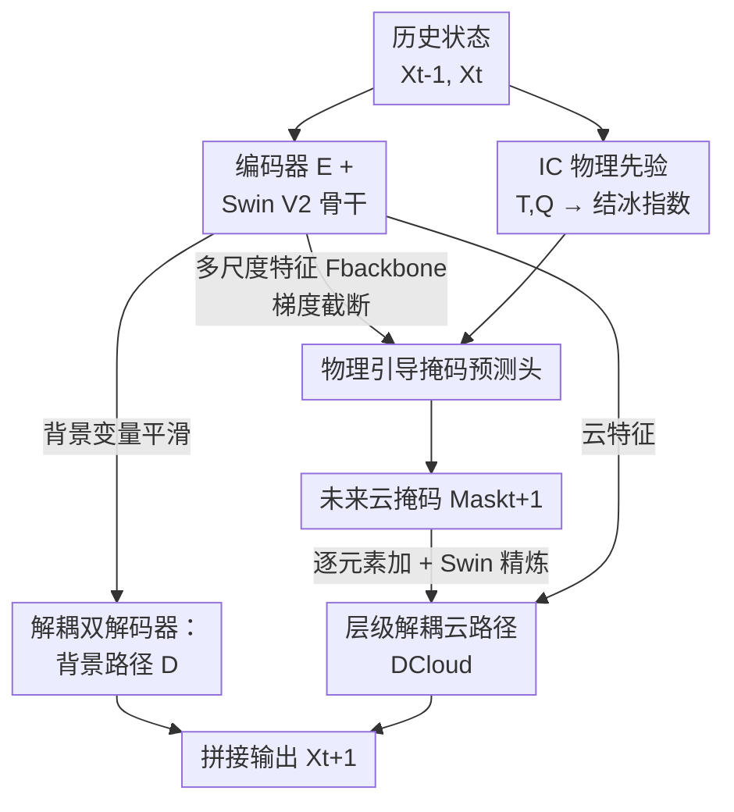

# AviaSafe: A Physics-Informed Data-Driven Model for Aviation Safety-Critical Cloud Forecasts

**会议**: CVPR 2026  
**论文**: [CVF Open Access](https://openaccess.thecvf.com/content/CVPR2026/html/Zhu_AviaSafe_A_Physics-Informed_Data-Driven_Model_for_Aviation_Safety-Critical_Cloud_Forecasts_CVPR_2026_paper.html)  
**代码**: 无  
**领域**: 物理信息神经网络 / 气象预报 / 时空预测  
**关键词**: 物理信息神经网络, 云微物理预报, 航空安全, 层级化架构, 结冰指数

## 一句话总结
AviaSafe 把"先用掩码定位云在哪、再回归云有多浓"的层级化思路和航空气象里验证多年的"结冰条件指数(IC)"嵌进一个 Swin Transformer 预报骨干里，第一次实现了全球、逐 6 小时、可分相态（冰/液/雨/雪）的云微物理量预报，在 93.7% 的变量-时效组合上优于 FuXi 基线，并在 7 天时效的关键背景变量上追平甚至超过业务级数值预报 ECMWF HRES。

## 研究背景与动机
**领域现状**：以 GraphCast、Pangu-Weather、FuXi 为代表的 AI 天气预报模型已经用千倍的计算加速逼平甚至超过传统数值预报(NWP)，但它们的预报对象都是位势、温度、风、比湿这类**空间上平滑、连续**的大尺度大气变量。

**现有痛点**：航空安全真正关心的是云的**相态**——高冰水含量(HIWC)云会让过冷水滴在发动机上爆发性结冰，导致功率骤降甚至停车，全球约 11%–30% 的航空事故与恶劣天气相关。但现有 AI 模型只预报"总云水""总降水"这类聚合湿度量，把所有凝结水当成一种东西，无法区分冰相还是液相；传统 NWP 虽然能用显式微物理方程模拟相态，却算力昂贵难以业务化，而且在零下条件下倾向把液态水**过早转成冰相**，系统性低估云液水含量，从而漏报结冰风险。

**核心矛盾**：云的四个相态量(CIWC 云冰、CLWC 云液、CRWC 云雨、CSWC 云雪)是**稀疏、间断、重尾**的场——大部分格点为零，少数地方有极端值。直接用预报平滑变量的那套均匀回归网络去拟合，要么把稀疏的发生区域抹平、要么在不该有云的地方生成伪影；同时纯数据驱动训练没有物理约束，可能产出违反热力学的状态。

**本文目标**：在保持 AI 模型计算高效的前提下，直接预报四个可分相态的云微物理量，覆盖全球、逐 6 小时、最长 7 天时效，且预报要物理自洽、能服务航线规划。

**切入角度**：作者的关键观察是——云的形成本身是"两步的"：先要满足特定大气条件云才会出现，云出现后强度才由局地热力学过程决定。把这个物理事实映射成网络结构，就能避免让一个回归器同时背负"判断有没有云"和"算云多浓"两个统计性质截然不同的任务。

**核心 idea**：用"先定位后定量"的层级化架构，再把航空气象里经验验证了几十年的**结冰条件指数(IC index)** 作为无参数物理先验注入掩码预测分支，让网络在物理可信的区域里聚焦回归云强度。

## 方法详解
AviaSafe 把天气预报形式化为序列到序列问题：输入两个历史大气状态 $(X_{t-1}, X_t)$，预测下一时刻 $\hat{X}_{t+1}$，再自回归滚动得到多步时效。整个模型最大的特点不是换了多强的骨干，而是围绕"云是稀疏间断的"这一事实，把预报拆成**定位(哪里有云) + 定量(云多浓)** 两个解耦子任务，并用物理公式给定位环节兜底。

### 整体框架
数据来自 ERA5 再分析，1°×1° 全球 181×360 网格，9 个变量 × 13 个气压层 = 117 通道。变量被分成两组：要直接预报的**云微物理量**(CIWC/CLWC/CRWC/CSWC)，和提供大尺度动力-热力环境的**背景变量**(位势 Z、温度 T、比湿 Q、纬向风 U、经向风 V)。

模型由两个协同模块组成：**预报骨干(Forecasting Backbone)** 和**物理引导头(Physics-Informed Guidance Head)**。输入经编码器 $E$ 和一串 Swin Transformer V2 块提取多尺度时空特征；骨干一边把自身特征送进两个**解耦解码器**分别预报平滑的背景变量和稀疏的云变量，一边把各 Swin 块的输出拼成多尺度特征 $F_{backbone}$（**梯度截断**后）喂给引导头。引导头先用一个纯公式的 IC Block 算出"潜在结冰区"掩码，再把它和"当前云在哪"的诊断掩码、以及 $F_{backbone}$ 一起送进 Mask Predictor，预测出未来云掩码 $Mask_{t+1}$；这个掩码经卷积后回注到云预报路径，逐元素加到骨干特征上、再过一个 Swin 块精炼，最后由云解码器 $D_{Cloud}$ 输出云微物理预报。两个解码器的输出拼接成完整的 $\hat{X}_{t+1}$。

### 关键设计

**1. 层级化"先定位再定量"+ 解耦双解码器：把稀疏判断和强度回归拆开**

这一步直接针对"稀疏间断场不能用平滑回归器硬拟合"的痛点。传统做法是一个网络一口气回归所有变量，但云变量大部分格点是零、少数是极端值，均匀回归器会被零主导而把发生区域抹平。AviaSafe 把云预报拆成两层：先由引导头预测**未来云会出现在哪**（一个二值掩码 $Mask_{t+1}$，本质是分割任务），再由云解码器只在这些区域里**回归云有多浓**（回归任务）。这正好对应物理事实——云的出现取决于大尺度大气条件，云的强度取决于局地热力学。

与此配套的是**解耦双解码器**：平滑的背景变量(Z/T/Q/U/V)走直通的解码器 $D$，稀疏的云变量走带掩码引导的解码器 $D_{Cloud}$，两条路各用适配自己变量统计特性的策略。消融显示，仅仅做这一步任务解耦（w/o (MP, IC)，即去掉掩码预测但保留双解码器）就已经在 9 个变量里的 8 个上优于 FuXi 基线，证明"别让一个回归器同时背平滑场和稀疏场"本身就是大头收益。

**2. IC 物理先验：用无参数的结冰指数告诉网络"哪里可能长冰晶"**

纯数据驱动的掩码预测容易注入噪声引导（消融里的 w/o IC 变体就出现了云变量误差不降反升）。作者引入航空气象里经验验证了几十年的**结冰条件指数(IC index)**，它是一个**完全确定、不含任何可学习参数**的公式，把温度、气压、湿度映射成"过冷水能否存在、冰晶能否爆发性增长"的指示。

具体地，每个气压层 $k$ 的 IC 值是湿度因子和温度因子的乘积 $IC_k = f_Q \cdot f_T$。湿度因子由比湿 $Q$、温度 $T$、气压 $p$ 算出：

$$f_Q(Q_k, T_k, p_k) = 2.0 \times \left( \frac{p_k \cdot Q_k}{\varepsilon \cdot e_s(T_{C,k})} - 0.5 \right)$$

其中 $\varepsilon = 0.622$ 是物理常数，$e_s$ 是用 August-Roche-Magnus 公式算的饱和水汽压 $e_s(T_C) = 6.1094 \times \exp\!\left(\frac{17.625\,T_C}{T_C + 243.04}\right)$，$T_C = T - 273.15$ 是摄氏温度。温度因子则是 $f_T(T_{C,k}) = T_{C,k} \cdot \frac{T_{C,k} + 14.0}{-49.0}$，这是一个对过冷水温度区间敏感的抛物线型权重。把 IC 指数当成一张 13 通道的"潜在云生长区"掩码注入网络，相当于把领域知识直接写进了输入，保证引导信号物理可信，而不是让网络盲猜。

**3. 物理引导掩码预测头：融合诊断掩码、IC 掩码与截断的主干特征**

引导头要回答"未来云在哪"。它的输入是两路拼接：一路是 **65 通道的混合物理特征**，由两种互补掩码拼成——① **诊断掩码** $Mask_{cloud}$（52 通道二值图，对四个输入云变量做阈值得到，表示"当前哪里有云"）；② **潜在掩码** $Mask_{ic}$（13 通道，即设计 2 算出的 IC 指数，表示"哪里可能长云"）。另一路是预报骨干输出的多尺度特征 $F_{backbone}$。

这里有个关键工程细节：$F_{backbone}$ 在送入引导头前被**从反向梯度流中 detach 截断**。这样引导头能蹭到骨干丰富的层级语义，但它的梯度不会反过来污染专注做回归的骨干参数——回归任务和分割任务的优化目标被干净地隔离。两路特征拼成 $F$ 后过 Mask Predictor：先 MLP 投影到优化表示空间，再过一个 Swin 块捕捉长程空间依赖，最后用反卷积上采样恢复全分辨率，得到 $Mask_{t+1}$。这张预测掩码经一个卷积层提炼成引导特征，回注到云解码路径，把 $D_{Cloud}$ 的容量集中到真正有云活动的区域。

### 损失函数 / 训练策略
模型端到端训练，损失是预报主损失加掩码辅助损失的加权和。主损失用**纬度加权 Charbonnier L1 损失**（L1 的鲁棒变体，对离群值不敏感）：

$$\mathcal{L}_{\text{forecast}} = \frac{1}{N} \sum_{i=1}^{N} \alpha_i \sqrt{(\hat{X}_i - X_i)^2 + \epsilon^2}$$

其中 $\alpha_i$ 是纬度权重，校正不同纬度格点面积差异。掩码预测因为云像素极度稀疏、类别严重不平衡，用 **Focal Loss** 做辅助监督：$\mathcal{L}_{\text{guide}} = \frac{1}{M}\sum_j [-\alpha_t(1-p_{t,j})^\gamma \log(p_{t,j})]$，取 $\gamma = 1.5$、$\alpha_t = 0.25$。总损失 $\mathcal{L}_{\text{total}} = \mathcal{L}_{\text{forecast}} + \lambda \mathcal{L}_{\text{guide}}$，$\lambda = 1$ 给两个任务等权。训练用 2 张 A100、32000 次迭代、总 batch 8、AdamW($\beta_1=0.9, \beta_2=0.95$，权重衰减 0.1)、初始学习率 $2.5\times10^{-4}$ 配余弦退火；训练集 2018–2023，测试集独立留出整个 2024 年。

## 实验关键数据

### 主实验
基线是复现的 FuXi（20 个 Swin V2 块），并与业务级 ECMWF HRES（0.1° 双线性插值到 1°）对比。核心结论：AviaSafe 在 **93.7%** 的变量-时效组合上的归一化 RMSE(NRMSE) 优于 FuXi 基线；背景变量上 >92% 的预报步为负 NRMSE（即更优），云变量里 CRWC 有 85.7% 的步、CLWC 有 89.3% 的步胜出。对 CIWC 的长时效优势尤其明显：1–2 天两者接近，但 3–7 天差距显著拉开，且优势**不随时效衰减反而持续增大**，到 15 天仍在改进。

| 对比 | 变量/范围 | AviaSafe 表现 | 说明 |
|------|-----------|---------------|------|
| vs FuXi 基线 | 全变量×7天 | 93.7% 组合 NRMSE 更优 | 总体优势 |
| vs FuXi 基线 | 背景变量 Z/T/U/V/Q | >92% 预报步更优 | 平滑场也涨 |
| vs FuXi 基线 | CIWC 3–7 天 | 优势显著且随时效增长 | 长时效不衰减 |
| vs ECMWF HRES | Q500/T500 7天 | 持平到更优 | 追平业务 NWP（云变量因 HRES 产品缺失无法直比） |

### 消融实验
表 1 报告前 5 天平均 RMSE（越低越好），逐步加组件：

| 配置 | CIWC50 (×10⁻⁸) | CLWC100 (×10⁻⁸) | CRWC250 (×10⁻⁸) | Z500 | 说明 |
|------|------|------|------|------|------|
| Baseline (FuXi) | 1.059 | 1.318 | 1.010 | 139.52 | 单一回归器 |
| w/o (MP, IC) | 1.012 | 0.892 | 0.889 | 138.95 | 仅解耦双解码器 |
| w/o IC | 1.053 | 0.968 | 0.961 | 137.23 | 加掩码预测但无物理先验 |
| AviaSafe (Full) | **0.956** | **0.875** | **0.863** | **135.81** | 完整模型 |

### 关键发现
- **任务解耦贡献最大**：仅去掉掩码预测保留双解码器(w/o (MP, IC))就在 9 个变量里 8 个胜过基线，说明"别让一个回归器同背平滑场和稀疏场"是最大头的收益来源。
- **无物理先验的掩码会帮倒忙**：w/o IC 变体在背景变量上继续降误差，却在云变量上**误差回升**（CIWC50 从 1.012 涨到 1.053）——没有 IC 约束的掩码会向云路径注入噪声引导。加上 IC 后完整模型相对次优变体在 CIWC50 降 5.5%、CRWC250 降 2.9%，证明物理先验把掩码"稳"住了。
- **物理可解释性案例**：作者把气象可预报性里的条件非线性最优扰动(CNOP)框架迁移过来做"显著性图"，对 2024 年 1 月一次 HIWC 云事件分析，发现模型识别出阿拉伯半岛上空的高空脊为关键信号，向东传播输送水汽触发目标区成云；反事实扰动实验还显示模型有**相态依赖行为**：水汽充足但温度不利时冰相生成被抑制，与已知热力学一致。

## 亮点与洞察
- **把"先定位后定量"做成网络结构而非后处理**：稀疏场预报的老大难是发生区被抹平，AviaSafe 用分割(掩码)+回归(强度)两层解耦从根上回避，而且这个拆分有清晰的物理对应（云的出现 vs 云的强度由不同机制决定），不是工程上的拍脑袋。
- **无参数物理先验是最低成本的领域知识注入**：IC 指数是纯公式、零可学习参数，却能在消融里把"帮倒忙的掩码"扭转成"有效空间先验"，这种"用经验公式当输入通道"的做法可以迁移到任何有成熟领域经验公式的预测任务（如海洋、电力负荷）。
- **梯度截断隔离双任务**：$F_{backbone}$ detach 这个细节很容易被忽略，但它保证了分割辅助任务不会反噬主回归骨干，是多任务里"借特征但不串梯度"的干净写法。
- **优势随时效增长而非衰减**：大多数预报模型误差随时效单调恶化，AviaSafe 对 CIWC 的相对优势却在长时效持续扩大，说明物理约束在长滚动下抑制了误差累积，这对中长期航空规划价值很大。

## 局限与展望
- **作者承认**：当前时空分辨率偏粗(1°、6 小时)、预报时效偏短，后续要做高分辨率、更长时效，并融入观测数据。
- **云变量无法直接对标业务 NWP**：因测试期 ECMWF HRES 的云产品不可得，论文只能在背景变量上和 HRES 比，云变量的"超越 NWP"缺乏直接证据，仅与自家 FuXi 基线对比 ⚠️。
- **IC 指数是经验公式**：它对过冷水/冰晶的刻画来自航空观测经验，温度因子的具体形式（如 $-49.0$、$+14.0$ 等常数）属于工程拟合，跨气候带或极端情形的普适性未做敏感性分析。
- **改进思路**：可把诊断掩码的阈值、IC 因子的系数也变成可学习/可校准的，在保留物理形式的同时让数据微调常数；或引入卫星/雷达观测做数据同化，缓解 ERA5 本身对云液水的偏差。

## 相关工作与启发
- **vs GraphCast / Pangu-Weather / FuXi**: 它们预报聚合湿度量(总降水、比湿)，把凝结水当成一种；AviaSafe 直接预报四个可分相态的云微物理量，区别在于面对稀疏间断场专门设计了层级解耦 + 物理先验，而不是简单地多加几个输出通道。
- **vs 传统数值预报 ECMWF HRES**: NWP 用显式微物理方程能模拟相态但算力昂贵、且零下条件下过早冰化导致系统性低估云液水；AviaSafe 用数据驱动保持千倍效率，并用 IC 先验补回相态信息，在关键背景变量上 7 天时效追平甚至超过 HRES。
- **vs 把 ODE / 参数化方案嵌入网络的物理增强方法**: 以往工作多是嵌入描述大气总体运动的原始方程或模拟参数化方案，但云特有的微物理过程难以有效整合、常为通用过程牺牲性能；AviaSafe 选择只注入一个航空验证的轻量经验指数(IC)，专攻云相态这个垂直问题，是"小而专"的物理注入路线。

## 评分
- 新颖性: ⭐⭐⭐⭐ 首个全球、逐6小时、可分相态的数据驱动云微物理预报，把航空 IC 指数与神经网络结合的角度新颖。
- 实验充分度: ⭐⭐⭐⭐ 主实验 + 三档消融 + CNOP 可解释性案例较完整，但云变量无法直比业务 NWP 是硬伤。
- 写作质量: ⭐⭐⭐⭐ 动机推导清晰、物理公式给全、架构图配套；个别公式排版（缓存里 LaTeX 有乱码）需对照原文。
- 价值: ⭐⭐⭐⭐ 直接服务航空结冰风险评估与航线优化，应用价值明确，物理先验注入范式可迁移。

<!-- RELATED:START -->

## 相关论文

- [\[NeurIPS 2025\] Physics-Informed Neural Networks with Fourier Features and Attention-Driven Decoding](../../NeurIPS2025/physics/physics-informed_neural_networks_with_fourier_features_and_attention-driven_deco.md)
- [\[AAAI 2026\] Towards a Foundation Model for Partial Differential Equations Across Physics Domains](../../AAAI2026/physics/towards_a_foundation_model_for_partial_differential_equations_across_physics_dom.md)
- [\[ICLR 2026\] Astral: Training Physics-Informed Neural Networks with Error Majorants](../../ICLR2026/physics/astral_training_physics-informed_neural_networks_with_error_majorants.md)
- [\[CVPR 2026\] PhysSkin: Real-Time and Generalizable Physics-Based Skin Simulation](physskin_real-time_and_generalizable_physics-based_animation_via_self-supervised.md)
- [\[CVPR 2026\] AeroAgent: A Vision-Physics-Decision Framework for Aerodynamic Vehicle Design](aeroagent_a_vision-physics-decision_framework_for_aerodynamic_vehicle_design.md)

<!-- RELATED:END -->
