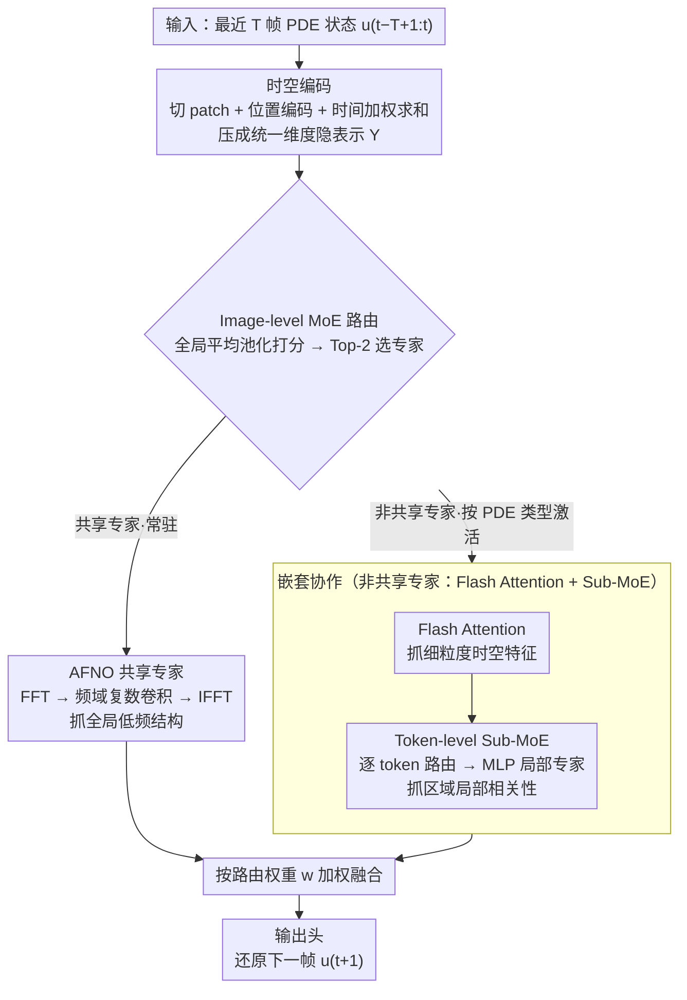

# NESTOR: A Nested MOE-based Neural Operator for Large-Scale PDE Pre-Training

**会议**: CVPR 2026  
**arXiv**: [2602.22059](https://arxiv.org/abs/2602.22059)  
**代码**: [有](https://github.com/Event-AHU/OpenFusion)  
**领域**: 科学计算  
**关键词**: 神经算子, 混合专家(MoE), PDE求解, 大规模预训练, 傅里叶注意力  

## 一句话总结

提出嵌套式 MoE 神经算子 NESTOR，通过 image-level MoE 捕获不同 PDE 类型的全局特征 + token-level Sub-MoE 捕获物理场内局部相关性，在 12 个 PDE 数据集上实现大规模预训练并有效迁移到下游任务。

## 研究背景与动机

偏微分方程（PDE）广泛应用于物理、流体力学等领域。传统数值方法（FEM、FDM）计算成本高，神经算子（FNO、DeepONet 等）通过学习函数空间映射实现快速推理，但面临两个核心挑战：

**训练数据稀缺**：PDE 训练数据通常需要昂贵的实验或数值模拟获取

**单一架构局限**：现有大规模 PDE 预训练（如 DPOT、MPP）采用单一网络架构，难以同时处理：
   - **PDE 间的宏观差异**：不同方程的动力学机制、边界条件、变量维度差异巨大
   - **PDE 内的微观异质**：同一方程物理场内存在复杂的时空局部相关性

核心洞察：PDE 系统的多样性和复杂性需要不同专家网络针对不同输入进行专门化处理，而非"一个网络处理所有"。MoE 的路由机制天然适合这一需求，但单层 MoE 仅能区分方程类型，无法捕获同一方程内部的区域异质性。

## 方法详解

### 整体框架

NESTOR 想解决的是「一个网络吃下十几种 PDE」时的两难：不同方程之间动力学差异巨大，同一方程内部又有复杂的空间局部相关性，单一架构很难两头都顾上。它的解法是把任务框成自回归预测——输入最近 $T$ 帧 PDE 状态 $u_{t-T+1:t}$，预测下一帧 $u_{t+1}$——并在中间塞进一个两层嵌套的专家系统。

数据流是这样转的：输入先被切成 patch 做时空编码，压成统一维度的隐表示；接着进入核心的嵌套 MoE，外层 image-level MoE 按整张图的全局特征挑出适合当前 PDE 类型的几个专家，每个被选中的非共享专家内部再用 token-level Sub-MoE 逐个空间位置挑局部专家；选中的专家按路由权重加权融合，最后由输出头还原成下一帧物理场。外层负责「这是哪类方程」，内层负责「这块区域该用谁」——这种「外层套内层」正是 NESTOR 名字里 Nested 的来源。

### 关键设计

**1. 时空编码：把帧数不一的多帧输入压成统一维度**

不同 PDE 数据集喂进来的历史帧数 $T$ 并不一致，但后续模块要求固定维度的输入，所以第一步先把时间轴抹平。输入 $x \in \mathbb{R}^{B \times C \times H \times W}$ 划成不重叠的 patch $X_p \in \mathbb{R}^{B \times N \times C \times P_H \times P_W}$，经线性映射加位置编码得到 $X \in \mathbb{R}^{B \times N \times D}$，再重排为 $X \in \mathbb{R}^{B \times X \times Y \times T \times C}$，最后用一组可学习权重在时间维上做加权求和，把 $T$ 帧坍缩成一帧表示：

$$Y = \sum_{t=1}^{T} W_t X_t, \quad Y \in \mathbb{R}^{B \times X \times Y \times C_{\text{out}}}$$

这样无论输入几帧，出来的都是同一规格，后面的专家系统就能统一处理多个数据集。

**2. Image-level MoE：按整张图的全局特征判断「这是哪类方程」并路由专家**

PDE 之间的宏观差异需要不同专家专门化处理，外层 MoE 就承担这个「分类-路由」的角色。它对输入特征做全局平均池化得到样本级表示 $\bar{x}_b \in \mathbb{R}^C$，过线性层打分再 softmax，按 Top-$k$ 选出得分最高的专家，并把它们的概率归一化成融合权重：

$$s_b = \bar{x}_b W^\top + b, \quad p_b = \text{softmax}(s_b)$$

$$w_{b,i} = \frac{p_{b,i}}{\sum_{j \in \mathcal{I}_b} p_{b,j}}, \quad i \in \mathcal{I}_b$$

专家池配置为 6 个非共享专家 + 1 个共享专家，门控每次激活 2 个非共享专家。两类专家刻意做成异构互补：共享专家是 AFNO（自适应傅里叶神经算子），走 FFT → 频域复数卷积 → IFFT，专门抓全局低频的空间结构；非共享专家是 Flash Attention，抓细粒度时空特征，其注意力之后再接下面的 Sub-MoE。实验里能看到专家确实自发分工——Expert 0+1 偏好 NS 方程、Expert 2+3 偏好浅水波方程，说明这层路由不是摆设，而是真的按方程类型把样本分流了。

**3. Token-level Sub-MoE：在选中的专家内部，逐个空间位置挑局部专家**

只靠外层 MoE 只能区分方程类型，没法处理同一方程内部不同区域的异质性，于是把路由再下沉一层。Sub-MoE 替换掉 Flash Attention 里原本的 FFN，路由粒度从整张图细到单个 token（空间位置），同样走 Top-$k$。每个局部专家是标准 MLP：

$$\text{ExpertMLP}(x) = W_2 \sigma(W_1 x + b_1) + b_2$$

其中 $W_1 \in \mathbb{R}^{C \times (rC)}$、$W_2 \in \mathbb{R}^{(rC) \times C}$，$r$ 为 MLP ratio，激活用 GELU；配置同样是 6 非共享 + 1 共享、Top-2 激活。可视化显示不同局部专家在空间上呈区域特异的激活模式，正好对应物理场里不同区域（如涡旋区 vs 平稳区）的局部相关性差异。

**4. 嵌套协作：宏观分类套微观分区，大容量却低激活**

前两层不是各干各的，而是「外层定大类、内层分小区」的层级协作：image-level 先按 PDE 类型选定专家组合（NS 激活 Expert 0+1、SWE 激活 Expert 2+3），被选中的专家内部再由 token-level Sub-MoE 进一步识别空间区域特征。这种嵌套让总参数堆到 83M（容量足够覆盖多样的方程），但每次前向只激活 13M（激活率 16.67%），用稀疏激活换来了「大模型容量 + 小模型算力」的折中。

### 一个完整示例：一帧 NS 湍流如何被两层路由处理

以一个 Navier-Stokes 湍流样本走一遍：输入若干帧涡量场，先被时空编码压成单帧隐表示 $Y$。进入 image-level MoE 后，全局平均池化得到的样本特征打分时，门控判定它属于「NS 类」，于是激活 Expert 0 和 Expert 1 这两个非共享专家（外加常驻的 AFNO 共享专家提供频域全局特征）。

被选中的 Expert 0 内部，Flash Attention 算完注意力后进入 Sub-MoE：此时不再是整张图统一处理，而是每个空间位置各自路由——涡旋剧烈的 token 走向擅长高频局部结构的那批 MLP 专家，背景平稳区的 token 走向另一批。两个 image 专家各自完成「注意力 + token 级 Sub-MoE」后，按外层归一化权重 $w_{b,i}$ 加权融合，再过输出头还原成预测的下一帧涡量场。整条链路里只有 13M / 83M 参数真正参与了这次前向。

### 损失函数 / 训练策略

总损失由三部分组成：

$$\mathcal{L} = \mathcal{L}_2 + \alpha \mathcal{L}_{\text{aux}_1} + \beta \mathcal{L}_{\text{aux}_2}$$

- **主任务损失** $\mathcal{L}_2$：L2 相对误差（L2RE），$\mathcal{L}_2 = \frac{\|\hat{y}_i^{(c)} - y_i^{(c)}\|_2}{\|y_i^{(c)}\|_2}$
- **Image-level 负载均衡损失** $\mathcal{L}_{\text{aux}_1}$：防止专家分配不均
- **Token-level 负载均衡损失** $\mathcal{L}_{\text{aux}_2}$：同上

负载均衡损失统一定义为 $\mathcal{L}_{\text{aux}} = E \sum_{i=1}^{E} p_i \cdot f_i$，其中 $p_i$ 为平均路由概率，$f_i$ 为实际 token 分配比例。

训练策略：向输入帧注入小尺度噪声增强鲁棒性（沿用 DPOT 的去噪预训练策略）。

## 实验关键数据

### 主实验

12 个 PDE 数据集上的预训练和微调结果（L2RE↓）：

| 模型 | 激活参数 | FNO-ν 1e-5 | FNO-ν 1e-4 | FNO-ν 1e-3 | PDEBench Avg(1) | PDEBench Avg(0.1) | DR | SWE | CFDBench |
|---|---|---|---|---|---|---|---|---|---|
| FNO | 0.5M | 0.116 | 0.092 | 0.016 | 0.130 | 0.153 | 0.032 | 0.009 | 0.027 |
| DPOT-T (预训练) | 7M | 0.098 | 0.061 | 0.010 | 0.029 | 0.018 | 0.032 | 0.006 | 0.010 |
| **Ours (预训练)** | 13M | 0.120 | 0.095 | **0.009** | **0.027** | **0.016** | 0.031 | **0.005** | 0.011 |
| DPOT-FT500 | 7M | 0.052 | 0.037 | 0.006 | 0.015 | 0.016 | 0.015 | 0.002 | 0.004 |
| **Ours-FT500** | 13M | **0.051** | **0.022** | **0.004** | **0.011** | **0.010** | **0.012** | 0.003 | **0.004** |

微调 500 epochs 后，在 12 个任务中 9 个达到 SOTA，全局最优 10/12。

### 消融实验

PDEBench 六个子任务上的消融（FT-500，Avg L2RE↓）：

| 方法 | Avg L2RE | 性能下降 |
|---|---|---|
| **完整模型** | **0.0173** | - |
| w/o Sub-MoE | 0.0197 | +0.0024 |
| w/o 负载均衡损失 | 0.0178 | +0.0005 |
| FlashAttn + AFNO 直接相加 | 0.0196 | +0.0023 |

### 关键发现

1. **Sub-MoE 贡献最大**：移除后误差增加 0.0024，验证了 token 级别细粒度专家选择的重要性
2. **MoE 融合优于简单相加**：将 AFNO 和 FlashAttn 的 MoE 融合替换为直接相加，误差增加 0.0023，证明路由选择机制优于固定融合
3. **专家数不是越多越好**：6 个非共享专家在 FT-500 下取得最佳平均性能，12 个专家反而因优化困难而性能下降
4. **预训练数据量有正向影响**：12 个数据集预训练的 Avg L2RE（0.0208）优于 3 个数据集（0.0234）
5. **下游任务迁移效果显著**：在 512×512 高分辨率湍流任务上，微调后精度提升 47.3%
6. **激活效率**：总参数 83M 中仅激活 13M（16.67%），远低于 MoE-POT-T 的 56.67%

## 亮点与洞察

1. **嵌套 MoE 设计有清晰的物理对应**：image-level → PDE 类型分工，token-level → 物理场空间区域分工，"宏观分类-微观分区"具有良好的可解释性
2. **异构专家设计**：共享专家用 AFNO（频域全局特征），非共享专家用 Flash Attention（空间局部特征），两类互补而非冗余
3. **可解释性分析充分**：Table 5 的专家激活频率统计和 Figure 5 的 token 级别空间热图，清晰展示了 MoE 的功能分化
4. **大容量低成本**：83M 总参数但仅 16.67% 激活率，为 PDE 神经算子的高效扩展提供了思路

## 局限与展望

1. **预训练阶段部分数据集不占优**：FNO-ν 1e-5 和 1e-4 上预训练性能不如 DPOT，说明嵌套 MoE 在数据有限时可能过拟合到特定专家
2. **NS-cond 和 PDE Arena-NS 表现较弱**：这两个数据集上 Ours-FT500 与 DPOT-FT500 基本持平甚至略差
3. 仅实验了 2D PDE，3D PDE 的可扩展性未验证
4. 专家数量（6）和激活数（2）为手动设定，缺少自适应机制
5. 负载均衡损失贡献有限（仅 0.0005），可探索更有效的专家平衡策略
6. 可结合物理约束损失（如 PDE 残差损失）进一步提升物理一致性

## 评分

⭐⭐⭐⭐ 4/5

将嵌套 MoE 引入 PDE 神经算子是有意义的创新，"宏观分类-微观分区"的设计直觉清晰、实验验证充分。在 12 个基准中 10 个 SOTA 的结果令人信服。扣分在于：创新主要是 MoE 架构的工程组合（AFNO + Flash Attention + 双层路由），各组件均为已有技术；此外 83M 参数仅激活 13M 虽然计算高效，但总内存开销仍然较大。

<!-- RELATED:START -->

## 相关论文

- [\[AAAI 2026\] PhysicsCorrect: A Training-Free Approach for Stable Neural PDE Simulations](../../AAAI2026/physics/physicscorrect_a_training-free_approach_for_stable_neural_pde_simulations.md)
- [\[ICLR 2026\] One Operator to Rule Them All? On Boundary-Indexed Operator Families in Neural PDE Solvers](../../ICLR2026/physics/one_operator_to_rule_them_all_on_boundary-indexed_operator_families_in_neural_pd.md)
- [\[ICML 2026\] Topology-Preserving Neural Operator Learning via Hodge Decomposition](../../ICML2026/physics/topology-preserving_neural_operator_learning_via_hodge_decomposition.md)
- [\[ICLR 2026\] DRIFT-Net: A Spectral--Coupled Neural Operator for PDEs Learning](../../ICLR2026/physics/drift-net_a_spectral--coupled_neural_operator_for_pdes_learning.md)
- [\[NeurIPS 2025\] Enforcing Governing Equation Constraints in Neural PDE Solvers via Training-free Projections](../../NeurIPS2025/physics/enforcing_governing_equation_constraints_in_neural_pde_solvers_via_training-free.md)

<!-- RELATED:END -->
