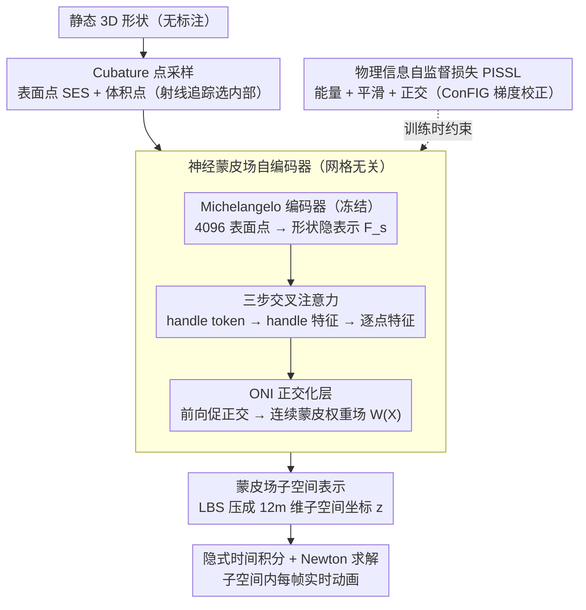

# PhysSkin: Real-Time and Generalizable Physics-Based Skin Simulation

**会议**: CVPR 2026  
**arXiv**: [2603.23194](https://arxiv.org/abs/2603.23194)  
**代码**: [项目页](https://zju3dv.github.io/PhysSkin/)  
**领域**: 物理仿真 / 3D 动画  
**关键词**: 物理动画, 神经蒙皮场, 自监督学习, 子空间物理, 线性混合蒙皮

## 一句话总结

提出 PhysSkin，一个泛化的物理信息框架——通过神经蒙皮场自编码器从静态 3D 几何体直接学习连续蒙皮权重场，配合物理信息自监督学习策略（能量最小化+平滑性+正交性约束），实现跨形状、跨离散化的实时物理动画，无需任何标注数据或仿真轨迹。

## 研究背景与动机

实时物理动画是计算机视觉与图形学的长期目标，在 VR/AR、角色动画、交互式数字内容创作中意义重大。当前方法面临的困境：

**经典子空间方法**（如全空间 FEM/MPM）：需要在高维全空间中求解大规模非线性优化，难以实时；即使用子空间降维，也需要对特定网格拓扑优化映射矩阵，无法泛化

**神经子空间方法**（如 CROM、Simplicits）：用神经网络学习子空间映射，但每个物体都需要单独训练网络，无法跨形状泛化

**监督蒙皮方法**（如 RigNet、Anymate）：从专家标注数据中学习骨架和蒙皮权重，但数据标注代价高、缺乏物理约束、且往往依赖类目特定先验（如人体/动物骨架模板）

**核心问题**：如何学习一个**物理一致、跨形状泛化、离散化无关**的变形子空间映射，且**不依赖任何标注数据**？

## 方法详解

### 整体框架

PhysSkin 要破的局很具体：物理动画要么慢（全空间 FEM/MPM 实时求解太重），要么不泛化（神经子空间方法每个物体都得单独训练），要么依赖昂贵标注（监督蒙皮方法）。它的思路是回到线性混合蒙皮（LBS）的老办法——把全空间的复杂变形表示成少数几个 handle 变换的加权叠加，但用神经网络去学习那个"加权"（连续蒙皮权重场），并且让整个学习过程不碰任何标注。

整条管线这样转：先从一个静态 3D 形状上采样表面点和体积 cubature 点；表面点喂进 Transformer 编码器得到形状的隐表示；隐表示再经交叉注意力解码器，对空间里任意一点输出它的连续蒙皮权重场；训练时不用任何 ground-truth，全靠物理信息自监督损失（能量最小化 + 平滑 + 正交）来约束这个场。推理时给一个全新形状，前馈一次就拿到它的蒙皮场，再在低维子空间里求解动力学方程，动画就实时跑起来。关键在于子空间维度 $12m$（$m$ 个 handle、每个 12 个仿射参数）远小于全空间 $3n$，Newton 法在这么小的空间里几步就收敛。

### 关键设计

**1. 蒙皮场子空间表示：用 LBS 把全空间变形压成少量 handle 坐标**

直接在全空间 $\mathbb{R}^{3n}$ 上解非线性动力学注定实时不了，PhysSkin 沿用 LBS 的思想把全空间位移写成 $m$ 个仿射变换的加权叠加：

$$\phi(\mathbf{X}, \mathbf{z}) = \mathbf{X} + \sum_{i=1}^m W_i(\mathbf{X}) \mathbf{Z}_i \begin{bmatrix}\mathbf{X}\\1\end{bmatrix}$$

这里 $W_i(\mathbf{X})$ 是第 $i$ 个 handle 在空间点 $\mathbf{X}$ 处的蒙皮权重，$\mathbf{Z}_i \in \mathbb{R}^{3\times 4}$ 是它的仿射变换。所有 handle 变换拼成子空间坐标 $\mathbf{z} \in \mathbb{R}^{12m}$，而 $m \ll n$。动力学就在这个子空间里用隐式时间积分求解：

$$\mathbf{z}_{t+1} = \arg\min_{\mathbf{z}} \frac{1}{2h^2}\|\mathbf{z} - 2\mathbf{z}_t + \mathbf{z}_{t-1}\|_\mathbf{M}^2 + E_{pot}(\phi(\mathbf{X}, \mathbf{z}))$$

正因为优化变量从 $3n$ 降到 $12m$，每帧的 Newton 求解才能快到实时——蒙皮权重场 $W_i$ 在这里扮演的就是子空间映射的"基函数"角色。

**2. 神经蒙皮场自编码器：三步交叉注意力实现 shape→handles→points 的网格无关解码**

蒙皮权重场 $W_i(\mathbf{X})$ 不能写死成某个网格的拓扑，否则换个网格就失效，所以 PhysSkin 用一个编码器-解码器把它做成对任意空间点都能查询的连续场。编码器借用 Michelangelo 的 Transformer 点云编码器：从形状表面采 4096 个点，经交叉注意力加 8 层自注意力，得到形状隐表示 $\mathbf{F}_s \in \mathbb{R}^{256 \times 768}$；这个编码器事先在 ShapeNet 上用 SDF 重建任务预训练，训练 PhysSkin 时冻结。

解码器是三步交叉注意力，对应一个自然的层级：第一步，$m$ 个可学习的 handle token $\mathbf{Q}_h$ 从 $\mathbf{F}_s$ 里交叉注意力提取出 handle 隐表示 $\mathbf{F}_h$；第二步，任意空间查询点 $\mathbf{X}$ 再从 $\mathbf{F}_h$ 里交叉注意力提取逐点蒙皮特征 $\mathbf{F}_p$；第三步，一个 ResNet 式 MLP 把特征解码成该点的蒙皮权重 $W(\mathbf{X}) \in \mathbb{R}^m$。"形状 → handles → 点"这条链路天然与网格无关，所以同一个模型能直接处理不同拓扑、不同分辨率的物体。

**3. Cubature 点采样：用表面+体积采样替代固定网格拓扑**

要做到离散化无关，就不能依赖任何固定网格。PhysSkin 改成在形状上采两类点：表面点用 Sharp Edge Sampling (SES) 抓住几何细节；体积点则先把形状转成水密网格、体素化，再用射线追踪判断内外、保留内部点。每个训练 batch 从候选点集里随机采 1000 个点。体积点之所以不能省，是因为物体的内部变形（比如挤压时内部如何被填充）光靠表面点根本刻画不出来，必须有体内的样本去约束。

**4. ONI 正交化层：在前向传播里直接促正交，给损失减压**

蒙皮模式之间需要尽量正交，不然子空间基底冗余、条件数变差，但只靠损失去拉正交会很吃力。PhysSkin 在 MLP 最后一层插了一个 Orthogonalization by Newton's Iteration (ONI) 模块，让网络在前向时就把输出往正交方向推一把；同时它用 ELU 激活、允许蒙皮权重带符号（不强制非负），换来更强的表达力。这样正交性一部分由结构保证，损失端的优化压力随之减轻。

### 一个完整示例：一架飞机走一遍管线

拿一个 10K 顶点的飞机模型为例。先在它表面采 4096 个点送进冻结的 Michelangelo 编码器，得到 $256\times768$ 的形状隐表示；$m$ 个 handle token 从中各自"认领"一块区域，提炼出 $m$ 个 handle 隐表示。接着对飞机内外采样的 cubature 点（每 batch 1000 个，含 SES 表面点和射线追踪选出的体积点）逐点查询，每个点从 handle 隐表示里提特征、过 ONI 正交化的 MLP，得到它的 $m$ 维蒙皮权重。这样整架飞机就被压进了一个 $12m$ 维的子空间——比原来的 $3\times 10\text{K}=30\text{K}$ 维小了几个数量级。跑动画时每帧只在这 $12m$ 维里解一次隐式积分，约 12 ms 出一帧；换成 121K 顶点的包，子空间维度不变，每帧也才 13 ms 左右——这正是 PhysSkin 实时性几乎与顶点数解耦的来源。

### 损失函数 / 训练策略

整个网络靠物理信息自监督学习（PISSL）训练，没有任何标注，核心是三个约束的协同。**势能最小化** $\mathcal{L}_{pot}$ 从高斯分布随机采子空间坐标 $\mathbf{z}$、最小化期望势能，让蒙皮场倾向于编码低能量的合理变形模式；为稳定，材料模型用线性弹性到 Neo-Hookean 的线性插值。**空间平滑** $\mathcal{L}_{smooth} = \mathbb{E}_{\mathbf{X}}\sum_{i=1}^m \|\nabla\Phi_\theta^i(\mathbf{X})\|^2$ 惩罚蒙皮权重的空间梯度，避免变形出现伪影。**正交约束** $\mathcal{L}_{orth}$ 对所有蒙皮模式的列间点积取平方和、强制基底正交，并配一个 on-the-fly 的 $\ell_2$ 归一化：每步训练都把蒙皮模式矩阵逐列归一化，防数值漂移、让正交约束更易收敛。

这三个损失在优化方向上经常互相打架（能量、平滑、正交各拉各的），朴素地加权相加会因梯度冲突而不稳定甚至不收敛。PhysSkin 引入 ConFIG 来校正这种破坏性的梯度干扰，把三者拉到一个平衡的下降方向上——后面的消融会看到，少了它正交性会恶化近三个数量级。总损失为 $\mathcal{L} = \mathcal{L}_{smooth} + \lambda_{pot}\mathcal{L}_{pot} + \lambda_{orth}\mathcal{L}_{orth}$。

## 实验关键数据

### 主实验

**RigNet 数据集——蒙皮场质量评估**

| 方法 | 正交性 $\Omega_{orth} \downarrow$ | 条件数 $\kappa_{log} \downarrow$ | 谱熵 $H_{spec} \uparrow$ |
|------|------|------|------|
| RigNet | 0.5324 | 2.7997 | 0.9762 |
| M-I-A | 1.4098 | 27.7357 | 0.7224 |
| Anymate | 1.5737 | 2.6093 | 0.9682 |
| Puppeteer | 0.5615 | 5.5605 | 0.9798 |
| **PhysSkin** | **0.0033** | **1.0453** | **0.9999** |

PhysSkin 在正交性上比第二好的方法（RigNet）低两个数量级。

**ShapeNet 数据集**

| 方法 | $\Omega_{orth} \times 10^{-2} \downarrow$ | $\kappa_{log} \downarrow$ | $H_{spec} \uparrow$ |
|------|------|------|------|
| Simplicits（逐物体训练） | 0.2621 | 1.5205 | 0.9941 |
| Anymate | 5.3520 | 4.9221 | 0.8858 |
| **PhysSkin** | **0.0098** | **1.0460** | **0.9997** |

即使 Simplicits 为每个物体单独训练一个网络，PhysSkin 的泛化模型仍大幅超越。

**实时动画效率对比**

| 3D 形状 | 顶点数 | FEM 每步 (ms) | MPM 每步 (ms) | **PhysSkin 每步 (ms)** |
|---------|--------|--------------|-------------|---------------------|
| Airplane | 10K | 79.83 | 141.83 | **12.26** |
| Bag | 121K | 3012.47 | 233.79 | **13.39** |
| Camera | 80K | 2121.02 | 203.38 | **12.52** |
| Pillow | 127K | 3170.93 | 251.81 | **13.74** |

PhysSkin 比 FEM 快 6.5-230 倍，比 MPM 快 11.5-18.3 倍，且时间几乎与顶点数无关。

### 消融实验

| 配置 | $\Omega_{orth} \times 10^{-2} \downarrow$ | $\kappa_{log} \downarrow$ | $H_{spec} \uparrow$ |
|------|------|------|------|
| w/o 蒙皮归一化 | 6.5533 | 8.5492 | 0.8113 |
| w/o ONI 层 | 0.0081 | 1.0844 | 0.9997 |
| w/o ConFIG 优化 | 8.9247 | 11.8595 | 0.7594 |
| w/o $\mathcal{L}_{orth}$ | 100.0 | 29.18 | NaN |
| w/o $\mathcal{L}_{smooth}$ | 0.0050 | 1.0567 | 0.9998 |
| **Full Model** | **0.0033** | **1.0453** | **0.9999** |

### 关键发现

1. **ConFIG 是最关键组件**：移除后正交性恶化 2700 倍（0.0033→8.9247），证明梯度冲突是核心优化难题
2. **正交约束不可或缺**：移除 $\mathcal{L}_{orth}$ 后正交性指标飙至 100，谱熵直接 NaN
3. **蒙皮归一化显著影响**：移除归一化导致正交性恶化约 2000 倍
4. **实时性与顶点数几乎解耦**：从 10K→127K 顶点，PhysSkin 步耗仅从 12.26→13.74 ms
5. **单模型泛化所有形状**：一个 PhysSkin 模型处理所有类别的物体，而 Simplicits 需要逐物体训练

## 亮点与洞察

1. **完全无需标注的物理蒙皮**：不需要仿真轨迹、不需要专家标注的骨架/蒙皮权重，仅从静态几何体出发——这大幅降低了 3D 动画的门槛
2. **物理约束的优化策略是核心贡献**：on-the-fly 归一化 + ConFIG 梯度校正的组合，解决了多约束优化中的根本性冲突问题
3. **离散化无关的连续蒙皮场**：同一模型可以处理不同拓扑、分辨率的网格，甚至可以直接用于 3D 高斯溅射模型
4. **评价指标的原创性**：提出了基于矩阵分析和谱理论的 3 个蒙皮质量指标（正交性、条件数、谱熵），填补了自监督蒙皮无法用 ground-truth 评估的空白
5. **实时性来自问题维度的根本降低**：子空间维度 $12m$（$m$ 个 handle × 12 参数）远小于全空间 $3n$，使 Newton 法在子空间中快速收敛

## 局限与展望

1. **缺乏语义先验**：蒙皮权重完全由物理约束驱动，未融入语义信息（如关节位置、功能部件），复杂拓扑下可能次优
2. **handle 数量固定**：$m$ 的选取影响表达力上限，但论文未充分讨论如何自适应选取
3. **材料模型较简**：仅支持超弹性材料（Neo-Hookean），未涵盖塑性、粘弹性、断裂等复杂材料行为
4. **评估限于蒙皮质量**：虽然展示了动画结果，但缺少与 ground-truth 仿真轨迹的定量精度对比
5. **预训练编码器的依赖**：形状编码器 Michelangelo 在 ShapeNet 上预训练，迁移到 ShapeNet 以外的 3D 形状的泛化性未验证

## 相关工作与启发

- **与 Simplicits (SIGGRAPH 2024) 的关系**：PhysSkin 直接继承了 Simplicits 的蒙皮场子空间思路，但解决了其两大痛点：(1) 泛化性——单模型 vs 逐物体训练；(2) 训练稳定性——ConFIG + 归一化 vs 朴素优化
- **与 Anymate 的区别**：Anymate 用监督学习从标注数据学习，PhysSkin 完全自监督；Anymate 输出离散骨架权重，PhysSkin 输出连续场
- **对多目标优化的启发**：ConFIG 梯度校正方法在物理信息神经网络（PINN）等其他多约束学习场景中可能同样适用

## 评分

- **新颖性**: ⭐⭐⭐⭐⭐ — 泛化式物理自监督蒙皮场+多约束梯度校正，解决方案完整且原创
- **实验充分度**: ⭐⭐⭐⭐ — 两个数据集、多基线对比、完整消融、效率对比
- **写作质量**: ⭐⭐⭐⭐ — 理论推导清晰，架构可视化优秀
- **实用价值**: ⭐⭐⭐⭐⭐ — 实时性+泛化性+无需标注，3D 动画工业级实用

<!-- RELATED:START -->

## 相关论文

- [\[CVPR 2026\] Continuous Exposure-Time Modeling for Realistic Atmospheric Turbulence Synthesis](continuous_exposure-time_modeling_for_realistic_atmospheric_turbulence_synthesis.md)
- [\[ICLR 2026\] Sublinear Time Quantum Algorithm for Attention Approximation](../../ICLR2026/physics/sublinear_time_quantum_algorithm_for_attention_approximation.md)
- [\[NeurIPS 2025\] Simulation-Based Inference for Neutrino Interaction Model Parameter Tuning](../../NeurIPS2025/physics/simulation-based_inference_for_neutrino_interaction_model_parameter_tuning.md)
- [\[CVPR 2026\] AeroAgent: A Vision-Physics-Decision Framework for Aerodynamic Vehicle Design](aeroagent_a_vision-physics-decision_framework_for_aerodynamic_vehicle_design.md)
- [\[CVPR 2026\] AviaSafe: A Physics-Informed Data-Driven Model for Aviation Safety-Critical Cloud Forecasts](aviasafe_a_physics-informed_data-driven_model_for_aviation_safety-critical_cloud.md)

<!-- RELATED:END -->
