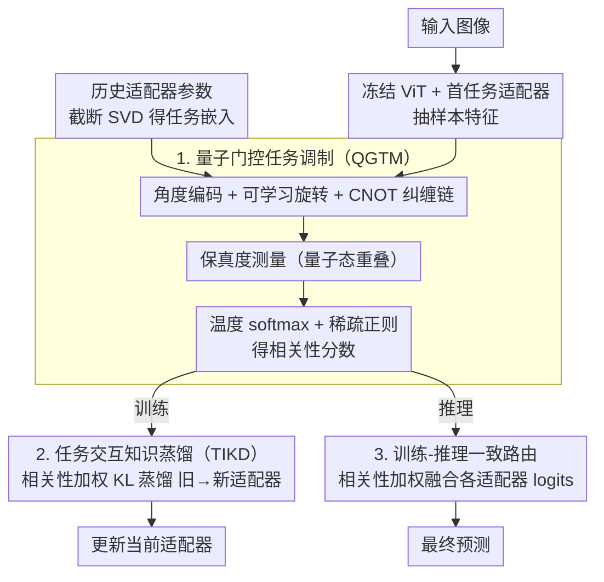

# QKD: Quantum-Gated Task-interaction Knowledge Distillation for Class-Incremental Learning

**会议**: CVPR 2026  
**arXiv**: [2604.11112](https://arxiv.org/abs/2604.11112)  
**代码**: [https://github.com/Frank-lilinjie/CVPR26-QKD](https://github.com/Frank-lilinjie/CVPR26-QKD)  
**领域**: 物理学  
**关键词**: 类增量学习, 量子计算, 知识蒸馏, 预训练模型, 适配器

## 一句话总结
QKD 将量子门控引入类增量学习，通过参数化量子电路在高维 Hilbert 空间中建模样本-任务相关性，引导跨任务知识蒸馏和推理时适配器融合，在 5 个基准上达到 SOTA。

## 研究背景与动机

**领域现状**：基于预训练模型（PTM）的类增量学习（CIL）冻结骨干网络，为每个任务学习轻量适配器。Prompt-based 方法靠相似性检索提示，Adapter-based 方法为各任务分配独立适配器。

**现有痛点**：Prompt-based 方法的局部相似性检索在任务子空间重叠时产生噪声匹配；Adapter-based 方法将适配器视为独立子空间，忽略了跨任务相关性，推理时的启发式路由/融合无法处理纠缠的子空间。

**核心矛盾**：路由和融合缺乏显式的学习型任务交互机制——如何量化当前样本与各历史任务的相关性，并将其用于训练时的知识转移和推理时的适配器选择？

**本文目标**：设计统一的可学习机制，动态量化样本-任务相关性，同时服务于训练时知识蒸馏和推理时自适应路由。

**核心 idea**：将样本特征和任务嵌入映射到量子 Hilbert 空间，利用量子叠加和干涉天然编码复杂的多路任务依赖关系。

## 方法详解

### 整体框架
QKD 要解决的是：基于预训练模型的类增量学习里，旧任务的适配器子空间往往彼此重叠纠缠，可现有方法要么靠余弦相似度做局部检索（重叠时就误匹配），要么把各适配器当成互相独立的盒子（推理时只能启发式投票）——都没有一个**可学习的、能量化"当前样本和每个历史任务到底有多相关"的机制**。QKD 的整篇思路就是用一套量子门控算出这组相关性分数，然后让训练和推理**共用同一组分数**。

具体怎么转：骨干 ViT 冻结，每来一个任务训一个轻量适配器；对每个已学适配器用截断 SVD 压出一个紧凑的任务嵌入。当一张图进来，先抽出它的样本特征（用冻结 ViT 加首任务适配器），量子门控模块把"样本特征 + 各任务嵌入"送进一个参数化量子电路，测量后得到一组归一化的相关性分数 $\{s_t\}$。训练阶段，这组分数当权重，把旧适配器的输出分布有选择地（KL 散度）蒸馏进正在学的新适配器；推理阶段，**同一组分数**又拿来加权融合各适配器的分类 logits。一组量子门控，串起了知识转移和自适应路由两件事。

### 关键设计

**1. 量子门控任务调制（QGTM）：把样本-任务相关性算成量子态保真度**

前面的痛点是任务子空间高度重叠时，余弦相似度只看局部夹角、MLP 又难拟合这种多路纠缠的几何关系。QGTM 改用量子电路来编码这层关系：对第 $t$ 个适配器，先把其各层适配器参数堆成矩阵、做截断 SVD 取主子空间并用全 1 向量聚合成一个任务嵌入态 $|\phi_t\rangle$；样本特征归一化后做角度编码，逐比特施加 $R_y$ 旋转把经典数值灌进量子态，再叠一层可学习旋转门 $R_y(\theta)$，并用一条 CNOT 链把各比特纠缠起来（堆叠 $l_q$ 层），使得任意两维特征的关联都能在叠加态里被表达。得到样本态 $|\psi\rangle$ 后，**直接测量它与每个任务态的保真度（量子态重叠）** $p_t=|\langle\psi|\phi_t\rangle|^2$ 作为几何相关性，并加一项稀疏正则 $\mathcal{L}_s=\|\alpha\|_1$ 逼门控只盯最相关的少数任务，最后经温度 softmax 归一化得到 $s_t=\mathrm{softmax}_t\big(p_t/\tau\big)$。之所以有效，是因为量子 Hilbert 空间维度随比特数指数增长、叠加与干涉天然能编码"多个任务同时部分相关"这种纠缠结构，而这正是经典余弦/MLP 表达不出来的几何。

> ⚠️ QGTM 的具体门序定义以原文为准。

**2. 任务交互知识蒸馏（TIKD）：让相关的旧任务多教、不相关的闭嘴**

有了相关性分数，怎么用在训练上？朴素的做法是把所有旧适配器一视同仁地蒸馏过来，但不相关任务反而是干扰。TIKD 的做法是：当前样本 $x$ 分别过每个旧适配器得到输出 logits $z^{(i)}$、过新适配器得到 $z^{(\text{new})}$，以量子门控的 $s_t$ 为权重，对每个旧适配器做一项 KL 散度蒸馏并加权求和 $\mathcal{L}_{\text{QKD}}=\sum_i s_i\,\mathrm{KL}\big(\sigma(z^{(i)})\,\|\,\sigma(z^{(\text{new})})\big)$，逼新适配器去对齐高相关旧任务的预测分布。这样高相关的旧任务权重大、贡献更多可迁移的知识，低相关的被压到接近零、自动让路——选择性地把"该继承的"继承下来，而不是把整段历史平均糊上去。

**3. 训练-推理一致的路由：同一组门控分数复用到推理融合**

很多 adapter-based 方法的隐患是训练时学的是一套对齐，推理时却换成另一套启发式路由（多数投票、固定权重），两边不一致就掉点。QKD 干脆让推理复用训练那套量子门控：测试样本进来，同一个 QGTM 算出它与所有任务的 $s_t$，直接拿来加权融合各适配器输出的分类 logits 得到最终预测。因为路由机制和训练时蒸馏所依赖的是**完全同一个相关性度量**，训练优化的目标和推理实际执行的逻辑天然对齐，消掉了那道不一致的缝。

### 一个完整示例
假设已学过任务 1（鸟）、任务 2（车）、任务 3（飞机），现在来一张"客机"图片：QGTM 抽出它的样本特征，分别和三个任务嵌入过量子电路，测量后得到相关性分数比如 $s=[0.1,\ 0.15,\ 0.75]$——和"飞机"任务最相关、和"鸟"次之、和"车"几乎无关。训练这张图所属新任务时，TIKD 就以 $0.75$ 的权重主要对齐飞机适配器的预测分布(KL)、$0.1/0.15$ 微量参考鸟/车、几乎屏蔽无关知识。推理时遇到同一张图，同一组 $[0.1,0.15,0.75]$ 直接拿来融合三个适配器的 logits，飞机适配器的判断主导最终预测。整条链里相关性分数只算一次、用两处，画面是一致的。

> ⚠️ 示例中的具体分数为说明性数值，非原文实测。

### 损失函数 / 训练策略
总损失 $\mathcal{L}_{\text{total}}=\mathcal{L}_{\text{CE}}+\lambda_{\text{kd}}\mathcal{L}_{\text{QKD}}+\lambda_{\text{s}}\mathcal{L}_{\text{s}}$：分类交叉熵 + 相关性加权的 KL 蒸馏损失 + 稀疏正则 $\|\alpha\|_1$。只更新当前适配器与量子门控网络，旧适配器冻结；量子电路参数与适配器参数联合端到端训练。

## 实验关键数据

### 主实验

| 数据集 | QKD 最终准确率 | 之前SOTA | 提升 |
|--------|---------------|----------|------|
| CIFAR-100 | SOTA | EASE | +提升 |
| CUB-200 | SOTA | MOE-Adapters | +提升 |
| ImageNet-R | SOTA | - | - |

### 消融实验

| 配置 | 准确率 | 说明 |
|------|--------|------|
| 量子门控 | 最优 | 完整模型 |
| 替换为余弦相似度 | 下降 | 表达力不足 |
| 替换为 MLP | 下降 | 复杂依赖捕获差 |
| w/o TIKD | 下降 | 跨任务知识转移缺失 |

### 关键发现
- 量子门控始终优于余弦相似度和 MLP 替代，证明量子 Hilbert 空间的几何表达力确实更强
- TIKD 在任务数增多时效果更明显，说明随着子空间重叠加剧，选择性知识转移越来越重要
- 训练-推理一致的路由是关键，不一致会导致性能下降

## 亮点与洞察
- **量子计算的实用化尝试**：不是为了"用量子而量子"，而是因为量子 Hilbert 空间的几何特性确实适合建模多路任务依赖
- **训练-推理一致性**：同一套相关性分数同时用于蒸馏和路由，设计优雅

## 局限与展望
- 量子电路目前在经典计算机上模拟，实际量子硬件上的效率尚不清楚
- 任务嵌入的 SVD 计算随任务增多而增长
- 未来可探索更深的量子电路或与真正量子硬件结合

## 相关工作与启发
- **vs EASE**: EASE 用类原型相似度做跨任务对齐，表达力有限
- **vs MOE-Adapters**: MoE 用多数投票融合，缺乏样本级自适应性

## 评分
- 新颖性: ⭐⭐⭐⭐⭐ 首次将量子计算引入 CIL，理论动机充分
- 实验充分度: ⭐⭐⭐⭐ 5 个数据集，消融证明量子门控优于经典替代
- 写作质量: ⭐⭐⭐⭐ 量子背景介绍清楚
- 价值: ⭐⭐⭐⭐ 为 CIL 提供了新工具

<!-- RELATED:START -->

## 相关论文

- [\[AAAI 2026\] Scientific Knowledge-Guided Machine Learning for Vessel Power Prediction: A Comparative Study](../../AAAI2026/physics/scientific_knowledge-guided_machine_learning_for_vessel_power_prediction_a_compa.md)
- [\[NeurIPS 2025\] Simulation-Based Inference for Neutrino Interaction Model Parameter Tuning](../../NeurIPS2025/physics/simulation-based_inference_for_neutrino_interaction_model_parameter_tuning.md)
- [\[NeurIPS 2025\] Knowledge is Overrated: A Zero-Knowledge ML and Cryptographic Hashing-Based Framework for Verifiable, Low Latency Inference at the LHC](../../NeurIPS2025/physics/knowledge_is_overrated_a_zero-knowledge_machine_learning_and_cryptographic_hashi.md)
- [\[ICML 2025\] Liger: Linearizing Large Language Models to Gated Recurrent Structures](../../ICML2025/physics/liger_linearizing_large_language_models_to_gated_recurrent_structures.md)
- [\[ICLR 2026\] Sublinear Time Quantum Algorithm for Attention Approximation](../../ICLR2026/physics/sublinear_time_quantum_algorithm_for_attention_approximation.md)

<!-- RELATED:END -->
