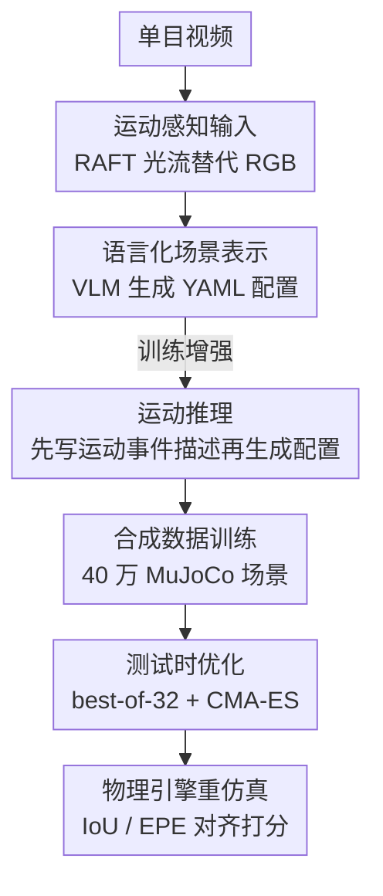

# Δynamics: Language-Based Representation for Inferring Rigid-Body Dynamics From Videos

**会议**: CVPR 2026  
**arXiv**: [2605.20576](https://arxiv.org/abs/2605.20576)  
**代码**: 无（项目页 https://iandrover.github.io/2026_dynamics/）  
**领域**: 物理感知 / 视频理解 / 多模态VLM  
**关键词**: 刚体动力学, 视频到仿真, 语言化场景表示, 光流, 测试时优化

## 一句话总结
把"从单目视频反推刚体物理状态与参数"重新表述成**文本生成**问题——训练一个 VLM 以光流为输入，直接吐出可被物理引擎执行的 YAML 场景配置（几何/初始状态/材质/相机），在 CLEVRER 上分割 IoU 达到 0.30，是主流 VLM 的 7 倍，并能零样本迁移到 235 段真实视频。

## 研究背景与动机
**领域现状**：从视频反推物体的物理属性（摩擦、弹性、质量、初速度）和相机几何，是"物理感知 + 仿真"的基础。已有工作（Vid2Param、滑块、台球、抛体等）能在受限场景下估计物理参数。

**现有痛点**：这些方法把场景参数化成**模型特定、定长的数值向量**——只针对某一类物体（球/盒）和某一种运动（滑动/抛体）。这种表示既不可扩展（换个物体数量或交互类型就失效），又通常**假设相机位姿已知/固定**，无法应对不同距离、不同视角的真实场景。

**核心矛盾**：问题的根子在于"场景到底怎么被参数化"。定长数值向量天生无法承载"任意数量物体 + 多类型交互 + 未知相机"的组合多样性——回归 head 的维度是写死的，多一个物体就装不下。

**本文目标**：要一个**统一的、可扩展的**表示，既能覆盖单/多物体、滑动/滚动/弹跳/碰撞等各种动力学，又能同时估计相机位姿，且能从合成域迁移到真实视频。

**切入角度**：作者观察到——如果把场景配置写成**结构化文本**（YAML），那么"物体几何、初始状态、材质、相机"全部变成可读、可编辑、可变长的符号序列；这天然契合 VLM 的自回归生成，物体多就多写几行，不需要改网络结构。

**核心 idea**：用**语言**作为刚体动力学的统一表示——把物理参数估计从"数值回归"改写成"生成一段物理引擎能直接消费的场景配置文本"，并用**光流输入 + 运动语言推理**两招把泛化撑起来。

## 方法详解

### 整体框架
Δynamics 要解决的是 **video → simulation**：给定单目视频 $\mathbf{X}$，模型 $\mathcal{F}_\theta$ 预测一组场景配置 $\mathbf{c}=\mathcal{F}_\theta(\mathbf{X})$，交给物理引擎 $\mathcal{S}$ 重新仿真出 $\hat{\mathbf{X}}=\mathcal{S}(\mathbf{c})$，目标是让 $\hat{\mathbf{X}}$ 的动力学忠实复现原视频。整条管线分三段：**训练**——在 MuJoCo 里采样 40 万个场景配置、渲染合成视频、用 RAFT 算光流，训练 VLM「光流 → YAML 配置」；**评估/推理**——对真实视频先算光流喂进模型生成配置，再用引擎重仿真，用分割 IoU 和光流 EPE 对齐原视频打分。

模型骨干是 Qwen2.5-VL-3B，输入是 1 秒 30FPS 视频里均匀采的 10 帧（或对应的光流图），输出是 `<answer> 配置 </answer>` 格式的 YAML。在此之上有两个增强：用**光流代替 RGB**作语义无关输入、训练模型在生成配置前先吐一段**运动事件描述**（`<think> 描述 </think> <answer> 配置 </answer>`）。推理时还叠加三种**测试时优化**（best-of-K 采样 / 偏好优化 / CMA-ES 进化搜索）进一步拔高实例级精度。

### 关键设计

**1. 语言化统一场景表示：用变长 YAML 文本取代定长数值向量**

这一招直击"定长向量装不下任意场景"的痛点。作者不再回归固定维度的参数向量，而是让模型输出一段 YAML，编码整个场景的物体几何、初始状态、材质、相机和重力。参数空间分三类（见下表逻辑）：物体属性（半径/高/宽/深/质量、滚动+滑动摩擦、阻尼）、初始状态（位置、线速度、角速度、四元数朝向）、全局参数（相机高度/俯仰角/FOV、重力）。场景由球/圆柱/盒三种基元拼出，足以覆盖网球、易拉罐、马克杯、书、箱子等常见物体的弹/滚/滑/碰。这个表示**天然变长**：一个含四个盒子的场景就是 $20\times4$ 个盒子参数 + 3 个相机参数 + 1 个重力项 = 84 个待估参数，再多物体就多写几行 YAML，不动网络结构。文本表示还顺带带来可读、可编辑、可做反事实分析（视频编辑）三个红利，并且把"仿真"统一成"文本生成"，让 VLM 端到端训练而不需要多阶段工程拼装。

**2. 运动感知输入：用光流替代 RGB，剥离与运动无关的语义**

原始 RGB 视频里混着纹理、背景、颜色这些与运动无关的语义，会成为模型估计物理参数的混淆因子，也是合成→真实域差距的主要来源。作者改用 RAFT 算出的**光流场**作输入——光流对外观和背景语义不可知，只携带显式的运动线索，且转成"每个颜色通道一个 2D 数组"后能直接喂进 VLM、不改架构。效果很直接：在 CLEVRER 上仅这一步就把全序列分割 IoU 从 0.19 提到 0.24（+26%），并大幅降低光流 EPE。代价是个别情况下阻尼估计反而 RGB 略好（棋盘地面给阻尼估计提供了额外视觉线索）。

**3. 运动推理：先生成自然语言运动事件描述，再生成配置**

直接吐配置缺少对"动力学过程"的显式建模。作者训练一个变体，让模型先用自然语言描述观测到的动力学（物体何时进出视野、何时停止滚/滑、何时触地或互相碰撞），再产出场景配置，格式为 `<think> 描述 </think> <answer> 配置 </answer>`。这些描述并非人工标注：数据生成时用**基于规则的事件挖掘脚本**处理仿真轨迹与产物（状态历史、接触记录、分割图），解析出可见性/运动变化/碰撞三类关键事件，再套进预定义模板生成结构化文本作为监督目标。先推理再配置等于给模型一个更结构化、更具物理意义的中间表示，让它对复杂多物体场景更鲁棒，也让测试时采样能在"物理上合理"的解空间里探索，而不是漂到不合理区域。

**4. 测试时优化：用重仿真自带的对齐信号无监督地挑/搜更优配置**

贪心解码不保证落在模型输出分布里质量最优的那个解（最优解常在长尾）。作者在推理时叠三种策略：**best-of-32 采样**（温度 0.1、top-p 0.9 生成 32 个候选，报 Best@32）；**偏好优化**（用前向渲染与输入视频的 mask IoU 当隐式奖励做偏好排序，无需真值）；**CMA-ES 进化搜索**（以 Best@32 为初始化，固定物体类型，优化尺寸/初始状态/物理参数/相机位姿，适应度为 $\text{IoU}-\text{EPE}$，种群 128、迭代 100 步）。关键在于这些信号都来自"重仿真后与原视频的对齐度"，因此在没有目标域真值的真实场景里也能用。

### 损失函数 / 训练策略
训练目标是把配置 $\mathbf{c}$ 当作 token 序列做自回归的负对数似然最小化：

$$p_\theta(\mathbf{c}\mid\mathbf{X})=\prod_{t=1}^{|\mathbf{c}|}p_\theta(c_t\mid\mathbf{X},c_{<t}),\qquad \mathcal{L}_{\text{VLM}}=-\!\!\sum_{(\mathbf{X},\mathbf{c})\in\mathcal{D}}\log p_\theta(\mathbf{c}\mid\mathbf{X}).$$

数据是 40 万个 MuJoCo 唯一场景：采样 YAML → 转 XML 初始化引擎 → 渲染最多 4 物体的 RGB 视频（480×320，1 秒 30FPS，每帧 8 个物理子步）。过滤掉初始重叠、超过一个物体全程出画、物体过小（面积 < 8000 像素）三类无效场景；并刻意把四种四物体组合**留作 hold-out** 测组合泛化。骨干 Qwen2.5-VL-3B 全量微调 10 epoch，bf16，8×A100-40G，AdamW，学习率 $2\times10^{-5}$，weight decay 0.01，全局 batch 128。评估指标为分割 IoU（↑）、光流 EPE（↓，end-point error）、物体组合准确率、物理参数 L1 距离（仅在组合正确时计算）。

## 实验关键数据

### 主实验
合成域 in-distribution（1–3 物体，每类 100 样本），与非 VLM（ViViT 回归）和 VLM baseline（三样本 ICL）比：

| 模型 | 输入 | 组合Acc↑ | 首帧IoU↑ | 全序列IoU↑ | 全序列EPE↓ | 滑动摩擦MAE↓ |
|------|------|---------|---------|-----------|-----------|------------|
| ViViT 回归 | 光流 | 0.00 | 0.07 | 0.06 | 8.90 | – |
| InternVL3-8B | RGB | 0.02 | 0.05 | 0.05 | 15.77 | 0.81 |
| Qwen2.5-VL-7B | RGB | 0.27 | 0.03 | 0.03 | 16.33 | 0.66 |
| Claude-4-Sonnet | RGB | 0.45 | 0.09 | 0.07 | 11.07 | 0.43 |
| **Δynamics** | RGB | 0.60 | 0.52 | 0.32 | 19.66 | 0.16 |
| **Δynamics** | 光流 | 0.97 | 0.88 | 0.49 | 9.24 | 0.16 |
| **+ 运动推理** | 光流 | **0.99** | **0.91** | **0.54** | **8.52** | 0.15 |

最强 baseline（Claude-4-Sonnet）也只能粗略认出物体组合，分割 IoU ≤ 0.09、光流 EPE > 11；Δynamics 全面碾压。RGB 版 EPE 偏高，是因为预测初始状态偶有穿模，MuJoCo 施加大的修正接触力导致突兀运动；换成光流输入后组合准确率冲到 97%、EPE 大降。

跨引擎零样本迁移（MuJoCo 训练 → Blender 渲染的 CLEVRER，100 段视频）：

| 模型 | 输入 | 首帧IoU↑ | 全序列IoU↑ |
|------|------|---------|-----------|
| Claude-4-Sonnet | RGB | 0.03 | 0.04 |
| Δynamics | RGB | 0.43 | 0.19 |
| Δynamics | 光流 | 0.63 | 0.24 |
| + 运动推理 | 光流 | **0.67** | **0.30** |

baseline 在跨引擎下几乎全崩（IoU ≤ 0.04），Δynamics 仍保 0.30，是领先 VLM 的约 7 倍；运动推理把全序列 IoU 从 0.24 提到 0.29–0.30（约 +21%）。

### 消融实验
| 配置 | 全序列IoU↑ | 说明 |
|------|-----------|------|
| RGB 输入 | 0.32（合成）/ 0.19（CLEVRER） | 基线输入，EPE 偏高且跨域掉点 |
| 光流输入 | 0.49 / 0.24 | 换语义无关输入，IoU +26%、EPE 大降 |
| + 运动推理 | 0.54 / 0.30 | 先推理再配置，复杂/未见场景更稳 |
| + best-of-32 | 0.38（CLEVRER首帧） | 采样探长尾，运动推理版增益更大（+27%） |
| + CMA-ES | 0.66（CLEVRER全序列） | 以 Best@32 初始化进化搜索，全序列最优 |

CLEVRER 测试时优化（Table 5）：运动推理版首帧 IoU 从 0.30→0.38（best-of-32，+27%），再叠 CMA-ES 全序列 IoU 冲到 0.66、EPE 降到 0.11，是单纯贪心解码（0.30）的 ~2.2 倍。

复杂场景鲁棒性（训练只见 ≤4 物体，测 4/5/6 物体，含 hold-out 的四物体组合）：运动推理版在 4/5 物体几乎不掉（IoU 0.54），6 物体也只缓慢退化到 0.52，体现出对未见多物体动力学的外推能力。

真实视频（235 段，iPhone13/Canon 拍，室内地板/跑道/球场）：

| 配置 | 全序列IoU↑ | 全序列EPE↓ |
|------|-----------|-----------|
| Δynamics | 0.26 | 0.67 |
| + 运动推理 | 0.29 | 0.58 |
| + Best@32 | 0.41 | 0.46 |
| + CMA-ES | **0.65** | **0.36** |

### 关键发现
- **光流是泛化的最大功臣**：它剥离背景/纹理语义，既提合成域 IoU（+26%）又显著缩小合成→真实域差距，是跨引擎不崩的关键。
- **运动推理 + 采样有协同效应**：运动推理给出物理上合理的中间表示，使 best-of-32 在合理解空间里探索（+27%），增益明显大于无推理版（仅 +14%）。
- **CMA-ES 是精度天花板**：以高质量 Best@32 初始化后做进化搜索，全序列对齐最佳（真实视频 IoU 0.65），代价是计算昂贵（种群 128 × 100 迭代）。
- **RGB 版的高 EPE 来自穿模**：初始状态预测重叠 → MuJoCo 大修正力 → 突兀运动，提醒"物理合理的初始化"对仿真对齐很关键。

## 亮点与洞察
- **范式重铸**：把"物理参数回归"改写成"结构化文本生成"，一举解决定长向量的可扩展性瓶颈——物体数量、交互类型、相机位姿全装进同一段 YAML，这是本文最"啊哈"的地方。
- **光流当 VLM 输入**：不改 VLM 架构、把光流转成每通道 2D 数组直接喂入，用一个工程上极轻的改动换来语义无关性和跨域鲁棒性，思路可迁移到任何"被外观语义干扰"的视频回归任务。
- **无监督测试时对齐**：重仿真后的 mask IoU / 光流 EPE 自带监督信号，使 best-of-K、偏好优化、CMA-ES 在没有目标域真值时也能用——这套"用前向渲染当 reward"的闭环对真实部署很实用。
- **规则化事件挖掘造 reasoning 监督**：不靠人标、用仿真 trace（状态/接触/分割）自动挖出可见性/运动变化/碰撞事件再套模板，低成本生成 CoT 监督。

## 局限与展望
- **基元受限**：场景只用球/圆柱/盒三种基元，复杂/不规则物体（如苹果）只能近似，几何保真度受限。
- **依赖 MuJoCo 仿真假设**：训练完全建立在 MuJoCo 物理上，地面摩擦、接触模型与真实世界的偏差会传导到参数估计；棋盘地面这类合成线索（阻尼估计）在真实域不存在。
- **相机参数被简化**：相机固定放在 $(0,-2,h)$、只变俯仰、roll/yaw 设 0，未覆盖一般 6DoF 相机运动。
- **真实域 IoU 仍偏低**：不靠 CMA-ES 时真实视频全序列 IoU 仅 0.29，重度依赖昂贵的进化搜索才能到 0.65，实时性差。
- **EPE 与穿模耦合**：初始状态穿模导致的修正力会污染 EPE，提示需要显式的物理可行性约束。

## 相关工作与启发
- **vs 受限场景物理估计（Vid2Param / 滑块 / 台球 / 抛体）**：它们用模型特定的定长参数向量、假设固定相机，只解窄子集；本文用变长语言表示同时估几何/物理/相机，覆盖多物体多类型交互的真实场景。
- **vs 可微仿真/渲染（differentiable simulation）**：那类方法做逐场景的梯度优化、需要可微引擎和预定义物理模型；本文不需要可微引擎、不预设物理模型，用单次前馈直接吐完整配置，再叠可选的测试时搜索。
- **vs 结构化图形程序（SVG/TikZ/JSON inverse rendering）**：同属"图像→结构化文本"思想，但前人聚焦静态图像/3D 资产生成与编辑，本文首次把这套范式落到**视频中的运动动力学**建模。
- **vs 通用 VLM（InternVL3 / Qwen2.5-VL / Claude-4）**：现成 VLM 三样本 ICL 在该任务上几乎不可用（IoU ≤ 0.09），说明"生成可执行物理配置"需要在合成物理数据上专门训练，而非靠通用视觉推理。

## 评分
- 新颖性: ⭐⭐⭐⭐⭐ 把刚体物理估计重铸为可执行文本生成，是干净且有效的范式转变。
- 实验充分度: ⭐⭐⭐⭐ 合成/跨引擎/真实三档 + 复杂场景外推 + 三种测试时策略，覆盖全面；但真实域绝对 IoU 仍偏低。
- 写作质量: ⭐⭐⭐⭐ 动机与方法清晰，图 2/3 把训练-推理流程讲透。
- 价值: ⭐⭐⭐⭐⭐ 为"感知↔仿真"提供统一语言桥梁，对物理感知、机器人、可控视频编辑都有延展性。

<!-- RELATED:START -->

## 相关论文

- [\[ICML 2026\] From Generalist to Specialist Representation](../../ICML2026/physics/from_generalist_to_specialist_representation.md)
- [\[ICLR 2026\] MOSIV: Multi-Object System Identification from Videos](../../ICLR2026/physics/mosiv_multi-object_system_identification_from_videos.md)
- [\[ICML 2026\] Speculative Sampling for Faster Molecular Dynamics](../../ICML2026/physics/speculative_sampling_for_faster_molecular_dynamics.md)
- [\[ICML 2025\] L2D: Large Language Models to Diffusion Finetuning](../../ICML2025/physics/large_language_models_to_diffusion_finetuning.md)
- [\[ICML 2026\] Teaching Molecular Dynamics to a Non-Autoregressive Ionic Transport Predictor](../../ICML2026/physics/teaching_molecular_dynamics_to_a_non-autoregressive_ionic_transport_predictor.md)

<!-- RELATED:END -->
