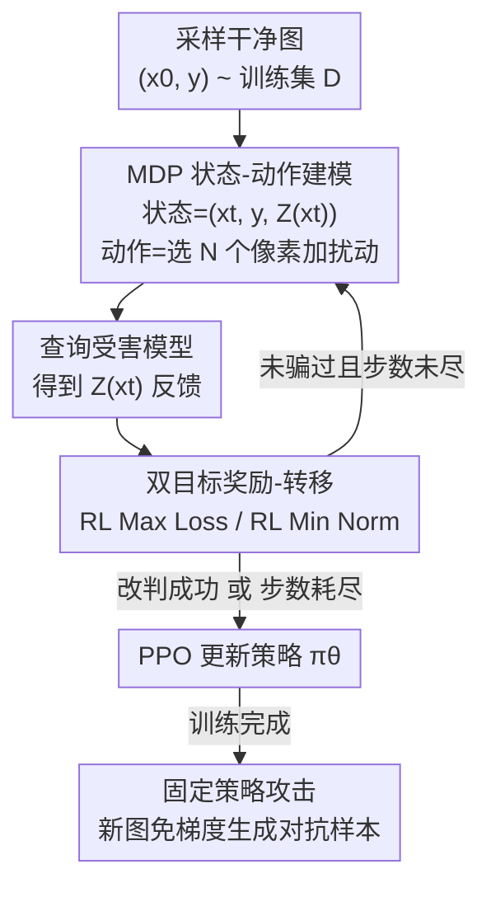

# Adversarial Agents: Black-Box Evasion Attacks with Reinforcement Learning

**会议**: CVPR 2026  
**arXiv**: [2503.01734](https://arxiv.org/abs/2503.01734)  
**代码**: 无  
**领域**: 强化学习 / 对抗机器学习 / AI 安全  
**关键词**: 黑盒对抗攻击, 逃逸攻击, 强化学习, MDP 建模, PPO, 查询效率

## 一句话总结
把"生成对抗样本"重新建模成一个马尔可夫决策过程（MDP），用 PPO 训练一个会"攒经验"的 RL 攻击智能体，让黑盒逃逸攻击随着训练越打越准、越打越省查询——在 CIFAR-10 / SVHN 上相比 Square、HSJA、Bandits 等 SOTA 黑盒攻击，最多多 17% 攻击成功率、少 31% 查询。

## 研究背景与动机

**领域现状**：对抗机器学习（AML）研究怎么给图像分类器构造"人眼看不出区别、但模型会分错"的对抗样本。白盒下用 PGD（Max Loss）或 C&W（Min Norm）这类梯度优化即可；更现实的黑盒下，攻击者只能拿到模型的输出（硬标签或类别概率），于是出现了 Square Attack、HopSkipJump、Bandits 这些基于查询的优化方法。

**现有痛点**：这些黑盒方法本质上都是**无状态（stateless）**的——每来一张目标图片，就当成一个全新的、孤立的优化问题从头解一遍。攻击者打完上一张图，对下一张图毫无经验积累可言。结果就是每张图都要重新烧大量查询，而且攻击策略永远停在原地、不会进化。

**核心矛盾**：现实中的威胁（如 APT，高级持续性威胁）是**持续地**、**大规模地**攻击同一个系统的。无状态优化和这种"持续攻击应当越打越熟练"的直觉是矛盾的——攻击者本该能从过往成败中学到一个可泛化的逃逸策略，但现有 AML 框架根本没有"记忆"和"学习"这一环。

**本文目标**：让攻击者从"每次重解一个优化问题"升级为"学一个通用攻击策略"。具体拆成三问：(1) RL 智能体能不能在训练中学到更有效、更省查询的攻击？(2) 关键超参（$\epsilon$、$c$）如何影响攻防的有效性-效率权衡？(3) 学到的策略能否泛化到没见过的图片、并打过传统黑盒方法？

**切入角度**：作者注意到黑盒攻击天然是一个"攻击者出招 → 受害模型反馈 → 攻击者再出招"的**闭环交互**，这正好可以套进 RL 的"状态-动作-奖励"框架。把输入和模型输出当状态、把扰动当动作、把对抗目标的进展当奖励，攻击过程就变成了一个可以用 RL 求解的序贯决策问题。

**核心 idea**：用一个"会攒经验"的 RL 智能体（agent）代替"每次从零开始"的无状态优化器——把对抗样本生成形式化为 MDP，用 PPO 训练策略，让攻击者把过去的攻击经验固化进策略网络里，从而在新输入上免去昂贵的逐样本优化。

## 方法详解

### 整体框架

整篇方法只做一件事：把黑盒逃逸攻击改写成 MDP，然后用 PPO 把"攻击者"训练成一个策略网络 $\pi_\theta$。一个回合（episode）从训练集 $\mathcal{D}$ 里随机抽一张干净图 $(x_0, y)$ 开始，先查询一次受害模型拿到 $Z(x_0)$ 初始化起始状态 $s_0$；之后每一步，智能体看着当前状态挑出一小撮像素去扰动，受害模型给出新的置信度反馈，环境据此决定"这步扰动留不留 + 给多少奖励"；当模型被骗到改判（攻击成功）或步数耗尽（失败）时回合结束。智能体把一路上的 $(s, a, r, s')$ 交互存下来，用 PPO 更新策略。训练完，攻击者拿固定策略在新图上"评估式"地一气呵成生成对抗样本，不再需要梯度。

作者设计了两套奖励/转移函数对应两种经典对抗目标——**RL Max Loss**（给定扰动预算内最大化模型错误）和 **RL Min Norm**（找到能骗过模型的最小扰动），二者共享同一套状态/动作表示，只在奖励和转移上分叉。

### 关键设计

**1. 把对抗样本生成形式化为 MDP：让攻击具备"状态"与"记忆"**

针对"无状态优化无法积累经验"这一根本痛点，作者把单张图的攻击拆成一个回合式 MDP。状态定义为 $s_t = (x_t, y, Z(x_t))$，即当前被扰动到第 $t$ 步的图、它的真标签、以及受害模型对它的输出——这三样恰好是黑盒攻击者唯一能拿到的信息，让智能体能"看着模型的反应"决定下一步。一次状态转移**恰好对应一次受害模型查询**，于是 RL 里的"步数"天然就是黑盒攻击里最稀缺的资源"查询数"，奖励里压低步数等价于压低查询。这一形式化是全文地基：一旦攻击是 MDP，过往无数张图的攻防经验就能被 PPO 蒸馏进一个共享策略，"越打越熟"才有了载体

**2. 子集像素动作 + 幅度约束：把高维扰动搜索压成可学的小动作**

直接在 3072 维像素上逐维学扰动，动作空间会爆炸、黑盒查询效率极差。作者把动作设计成"选 $N$ 个特征 + 各自的扰动"的集合 $a_t = \{(i_1,\delta_1),\dots,(i_N,\delta_N)\}$，每个扰动幅度受限 $|\delta_j| \le \theta$。实验里固定 $N=5$、$\theta=0.05$。这一步本质是给 RL 做降维：用 $N$ 和 $\theta$ 同时调控"扰动很多像素一点点"还是"扰动少数像素一大下"的折中，把原本不可学的全维搜索变成一个智能体能在有限查询内学好的紧凑动作，是黑盒下查询效率的关键

**3. 双目标奖励-转移：用 RL Max Loss / RL Min Norm 分别承接两类对抗目标**

AML 的两个经典目标（预算内最大化错误 vs. 最小化扰动）需要不同的奖励塑形，作者据此设计两套环境。先定义模型对真标签的置信度 $f(x,y)=\log([Z(x)]_y)$（即负交叉熵），以及一步置信度变化 $\Delta_{t+1}f = f(x_t,y)-f(x_{t+1},y)$ 与一步扰动变化 $\Delta_{t+1}\delta$。

**RL Max Loss** 在转移里把候选扰动**硬投影**回 $\epsilon$ 预算球 $x_t^{a_t}=\text{Proj}_\epsilon[\phi(x_t,a_t)-x_0]+x_0$，只要这步降低了模型置信度就接受、否则原地不动，奖励直接取 $R(s_t,a_t)=\Delta_{t+1}f$——预算约束写死在状态转移里，智能体只管"在预算内把模型置信度往下压"。

**RL Min Norm** 不设硬预算，而是把"降置信度"和"减扰动"打包进奖励 $R(s_t,a_t)=c\cdot\Delta_{t+1}f + \Delta_{t+1}\delta$，并在转移里用同一个加权式判断这步留不留，$c$ 越大越看重压低置信度、越小越看重减扰动。二者的核心区别——**预算是被硬编码进状态空间（Max Loss）还是只能靠奖励信号慢慢学（Min Norm）**——直接解释了后面实验里 Max Loss 学得更稳更好的现象

### 损失函数 / 训练策略

用 Stable-Baselines3 的 PPO 训练，每个 attack 跑 1200 次策略更新、3 个随机种子。策略网络用 EfficientNet 做特征提取器接全连接网络输出动作分布参数；价值网络是另一支共享该 EfficientNet 特征的前馈网络。受害模型为在 ImageNet-1K 预训练、再在目标数据集微调的 ResNet-50 / VGG-16 / ViT-B/16。关键超参：RL Max Loss 固定 $\epsilon=0.3$；RL Min Norm 在 CIFAR-10 用 $c=10^{-2}$、SVHN 用 $c=10^{-3}$。训练在 NVIDIA A100（40GB）上完成。

## 实验关键数据

### 主实验

在测试集 $\mathcal{D}'$ 上与三种 SOTA 黑盒攻击（Square、HSJA、Bandits）头对头比较（ASR=攻击成功率↑，AQ=成功样本平均查询数↓，$\ell_2$=平均扰动）。下表摘取 CIFAR-10 上的代表性数字：

| 方法 (CIFAR-10, $\mathcal{D}'$) | ResNet-50 ASR / AQ | VGG-16 ASR / AQ | ViT-B/16 ASR / AQ |
|--------|------|------|------|
| Square | 0.53 / 335 | 0.61 / 350 | 0.31 / 344 |
| HSJA | 0.31 / 681 | 0.36 / 637 | 0.13 / 904 |
| Bandits | 0.44 / 635 | 0.47 / 662 | 0.08 / 516 |
| **RL Max Loss** | **0.59 / 315** | 0.64 / 259 | 0.28 / 332 |
| **RL Min Norm** | 0.62 / 155 | 0.55 / 103 | 0.17 / 148 |

可以看到 RL Max Loss 在多数设置下 ASR 高于最强 baseline、查询数更低；RL Min Norm 则以极低的查询数（如 VGG-16 上仅 103 次 vs. Square 的 350 次）取胜。作者强调最极端情形（SVHN 上 VGG-16）下 RL 攻击比 baseline **多 17% 成功率、少 31% 查询**。

### 训练动态与泛化

| 现象 | 关键数字 |
|------|---------|
| RL Max Loss 训练中 ASR 提升 | VGG-16 +13.2%，ResNet-50 +9.3%，ViT-B/16 +8.7% |
| RL Min Norm 训练中 ASR 提升 | VGG-16 +9.7%，ResNet-50 +5.6%，ViT-B/16 +5.1% |
| RL Max Loss 查询数下降 | SVHN 最多 −16.9%，CIFAR-10 最多 −11.3% |
| 泛化（$\mathcal{D}$ vs. $\mathcal{D}'$） | 训练集与未见测试集上的 ASR/AQ/$\ell_2$ 分布基本一致 |

### 关键发现

- **Max Loss 比 Min Norm 学得稳**：因为 $\epsilon$ 预算被硬编码进状态转移，智能体不用分心去学约束；而 Min Norm 的扰动约束只能靠奖励信号传递，导致它"同时压扰动又压查询"很吃力，$\ell_2$ 随数据集/模型波动大。
- **ViT-B/16 最难攻**：三种 baseline 和 RL 攻击在 ViT 上 ASR 都明显低于 CNN（如 RL Max Loss 仅 ~0.28-0.32），说明 Transformer 受害模型对这类像素级黑盒攻击更鲁棒。
- **超参决定攻防取向**：RL Max Loss 的 ASR 随 $\epsilon$ 单调上升（预算越大越好骗）；RL Min Norm 随 $c$ 增大、ASR 和 $\ell_2$ 一起下降（越看重减扰动越保守），$\epsilon=0$ 对应的 ASR 恰是"1 − 模型干净准确率"。
- **学到的是策略而非过拟合**：测试集 $\mathcal{D}'$ 的指标落在训练集 $\mathcal{D}$ 分布之内，说明智能体学到的是可泛化的逃逸策略，而非记住训练图。

## 亮点与洞察

- **"无状态优化 → 有状态学习"的范式转换**：这是全文最"啊哈"的地方——把对抗攻击从"逐样本重解优化"提升为"学一个攒经验的策略"。一旦攻击是 MDP，攻击者天然获得了跨样本的迁移与持续进化能力，这正是 APT 类持续威胁最该有却此前缺失的能力。
- **"一次转移 = 一次查询"的精巧对齐**：让 RL 里压缩步数的天然倾向，直接等价于黑盒攻击里省查询这一最稀缺资源，奖励设计与威胁模型严丝合缝，不需要额外的查询惩罚项。
- **硬约束 vs. 软约束的清晰对照**：用 Max Loss（预算写进转移）和 Min Norm（约束塞进奖励）两套环境，干净地实证了"能写进状态空间的约束就别只靠奖励学"这一可迁移的 RL 设计经验。
- **可迁移到安全测试**：作者指出框架不依赖图像，malware / 网络入侵检测等离散分类任务同样适用，这个 MDP 模板对做对抗鲁棒性评测的人是现成可复用的脚手架。

## 局限与展望

- **作者承认的局限**：只在图像分类上验证；动作空间是像素级子集扰动，latent-space 扰动或许更高效；训练较慢，可引入课程学习 / 自适应奖励加速。
- **攻击迁移性仅是设想**：论文把"在初始受害模型上训好的策略当预训练、再微调到新模型"当成有前景的方向，但**并未实验验证**跨模型迁移，目前还是 hypothesis。
- **威胁模型偏理想**：实验把"边训练边攻击"算进收益，但脚注承认现实里训练阶段的大量查询本身容易被检测；如何低调地完成训练阶段并未深入。
- **ViT 上效果有限**：在 ViT-B/16 上 ASR 偏低，说明该攻击对非 CNN 架构的威胁打了折扣，普适性需谨慎看待。
- **改进思路**：把动作迁到隐空间、加入课程学习从易到难排样本、或显式建模跨受害模型的策略适配，都是把"持续攻击"从概念坐实成实战能力的关键。

## 相关工作与启发

- **vs. Square Attack / HSJA / Bandits（传统黑盒优化）**：它们都无状态、逐样本从零优化；本文用 RL 让攻击者攒经验、训练完即可免梯度泛化到新图，在 ASR 和查询效率上多数设置占优。劣势是需要一段训练期投入（且训练查询可能暴露）。
- **vs. 此前把 RL 用于对抗任务的工作**：作者指出前人仍停在"用 RL 对单个输入独立优化"的无状态用法，没用上 RL"学可泛化策略"的真正威力；本文的贡献正是把 RL 当成跨样本学习器而非单样本优化器。
- **vs. 白盒 PGD / C&W**：本文用 RL Max Loss / RL Min Norm 在黑盒（仅查询）条件下分别对标 PGD 的 Max Loss 与 C&W 的 Min Norm 目标，把原本依赖梯度的两类目标搬进了无梯度的强化学习框架。

## 评分
- 新颖性: ⭐⭐⭐⭐⭐ 把黑盒逃逸攻击重铸为可学习、可积累经验的 MDP，是清晰的范式转换
- 实验充分度: ⭐⭐⭐⭐ 双数据集 × 三受害模型 × 两 MDP + 超参敏感性，扎实；但仅图像、跨模型迁移未验证
- 写作质量: ⭐⭐⭐⭐⭐ MDP 公式、奖励设计与威胁模型对应讲得很透
- 价值: ⭐⭐⭐⭐ 揭示了"持续学习型攻击者"这一新攻击面，对防御与安全评测都有警示意义

<!-- RELATED:START -->

## 相关论文

- [\[NeurIPS 2025\] Optimizing the Unknown: Black Box Bayesian Optimization with Energy-Based Model and Reinforcement Learning](../../NeurIPS2025/reinforcement_learning/optimizing_the_unknown_black_box_bayesian_optimization_with_energy-based_model_a.md)
- [\[ICML 2025\] Meta-Black-Box-Optimization through Offline Q-function Learning (Q-Mamba)](../../ICML2025/reinforcement_learning/meta-black-box-optimization_through_offline_q-function_learning.md)
- [\[ICML 2026\] ALSO: Adversarial Online Strategy Optimization for Social Agents](../../ICML2026/reinforcement_learning/also_adversarial_online_strategy_optimization_for_social_agents.md)
- [\[NeurIPS 2025\] MetaBox-v2: A Unified Benchmark Platform for Meta-Black-Box Optimization](../../NeurIPS2025/reinforcement_learning/metabox-v2_a_unified_benchmark_platform_for_meta-black-box_optimization.md)
- [\[ICLR 2026\] Learning to Generate Unit Test via Adversarial Reinforcement Learning](../../ICLR2026/reinforcement_learning/learning_to_generate_unit_test_via_adversarial_reinforcement_learning.md)

<!-- RELATED:END -->
