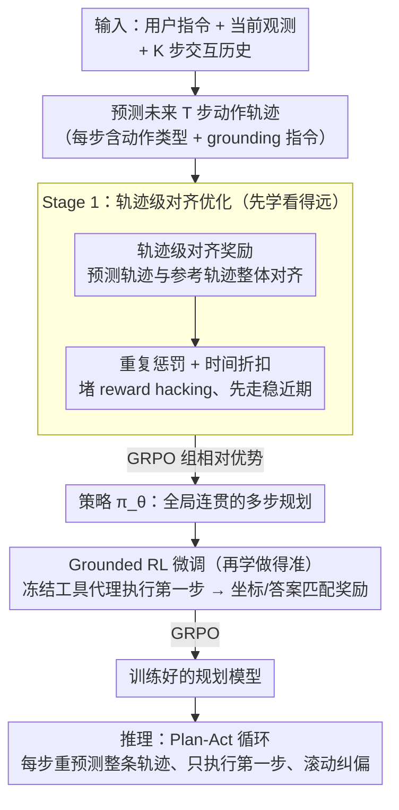

# Anticipatory Planning for Multimodal AI Agents

**会议**: CVPR 2026  
**arXiv**: [2603.16777](https://arxiv.org/abs/2603.16777)  
**代码**: 未开源  
**领域**: 强化学习  
**关键词**: 多模态智能体, 前瞻性规划, 轨迹级强化学习, GUI 交互, 工具使用, GRPO

## 一句话总结

提出 TraceR1，一个两阶段 RL 框架：第一阶段通过轨迹级奖励优化让智能体学会"向前看几步"的前瞻性规划，第二阶段通过工具执行反馈做 grounded fine-tuning 来提升单步精度，在 7 个 GUI 和工具使用 benchmark 上取得了开源 SOTA。

## 研究背景与动机

**领域现状**：当前多模态智能体在 GUI 交互、工具调用等方面取得了显著进展，但绝大多数系统本质上是**反应式（reactive）**的——仅基于当前观测决定下一步动作，不考虑长期后果。

**现有痛点**：在多步骤任务中，动作的影响往往是延迟且累积的。反应式智能体无法预判后果，导致在长时序任务中逐渐偏离目标，规划连贯性差。

**核心矛盾**：现有两条技术路线都有根本性障碍——Model-free RL 依赖稀疏的最终奖励，难以学到长期依赖；Model-based planning 需要构建世界模型，但在视觉丰富的交互环境中极其困难。

**本文目标**：如何高效训练多模态智能体，使其具备自适应的前瞻性推理能力，能在复杂长时序任务中保持规划一致性。

**切入角度**：不构建显式的世界模型，而是直接在轨迹级别做 RL，让模型学会预测未来若干步的动作序列，然后只执行第一步，类似人类"想几步、走一步"的规划方式。

**核心 idea**：通过两阶段训练——先做轨迹级对齐学全局一致性，再做 grounded RL 学单步可执行性——将前瞻性规划和精确执行统一起来。

## 方法详解

### 整体框架

TraceR1 想解决的是一个很具体的毛病：现在的多模态智能体几乎都是"看一眼当前画面就决定下一步"的反应式选手，在多步任务里走着走着就偏题。它的做法不是去搭一个显式世界模型，而是让模型在每一步都先"想几步、走一步"——给定当前观测，一次性预测出未来多步的动作轨迹 $\hat{\tau}_{t:T}$，但真正执行的只有第一步，拿到环境反馈后再重新预测。整套训练分两阶段递进：Stage 1（Anticipatory Trajectory Optimization）用轨迹级 RL 把"看得远、看得连贯"先教会，Stage 2（Grounded Reinforcement Fine-tuning）再用冻结工具代理的真实执行反馈把"每一步做得准"补上。基座是 Qwen3-VL-8B-Thinking，训练框架用 EasyR1。

### 关键设计

**1. 轨迹级对齐奖励：让模型一次想清楚未来几步，而不是逐 token 抠当前动作**

反应式智能体的根本问题在于它只对当前观测负责，而 SFT 那套 teacher forcing 又是逐 token 优化，天然忽视跨步骤的全局一致性。TraceR1 改在轨迹层面给奖励：给定用户指令 $u$、当前观测 $s_t$ 和交互历史，模型吐出未来 $T$ 步的动作序列，再和参考轨迹 $\tau^*$ 整体对齐，用一个带折扣的轨迹奖励来评分。

$$R(\hat{\tau}, \tau^*) = \sum_{t=1}^{T} \gamma^{t-1} r_t, \quad r_t = \lambda_{\text{align}} \cdot \text{sim}(\hat{a}_t, a_t^*) - \lambda_{\text{rep}} \cdot \text{rep}(\hat{a}_{1:t})$$

其中 $\text{sim}$ 衡量预测动作和参考动作的对齐度，$\text{rep}$ 惩罚轨迹内部的重复。因为奖励是对整条轨迹算的，模型被迫学会跨步骤的依赖关系，而不是只让眼前这一步看着对——这正是它能避开冗余、不稳定 rollout 的关键。

**2. 重复惩罚与时间折扣：堵住"刷奖励"和"赌远期"两个漏洞**

轨迹级奖励一旦放开，模型很容易找到捷径作弊。如果不加重复惩罚项 $\lambda_{\text{rep}}$，规划器会反复点击同一个元素、或重复调用同一个工具，靠堆叠"看似对齐"的动作把奖励刷高；而如果时间折扣 $\gamma = 1$，模型又会去赌那些不确定性极高的远期预测，反而把近期该做对的动作做糊了。这两个旋钮一个管"别原地打转"，一个管"先把近的走稳"，配合起来才让轨迹奖励真正指向有效规划。消融里去掉任意一个都会明显掉点，说明它们不是可有可无的正则。

**3. Grounded RL 微调：给抽象的轨迹奖励补上"这步到底能不能落地"的硬反馈**

Stage 1 的轨迹奖励本质是抽象的——它只告诉模型"你这条规划和参考像不像"，却没法保证预测出来的动作在真实界面上点得中、调得通。Stage 2 就把这一环补上：模型输出动作和 grounding 坐标 $(\hat{a}_t, \hat{g}_t)$，交给一个冻结的工具代理（如 UI-TARS-7B）去实际执行，再用执行结果和 ground-truth 比对算步骤奖励——GUI 任务看坐标对不对，工具调用任务看答案对不对。

$$r_t^G = \mathbb{1}[\text{coord match}] \quad \text{或} \quad \mathbb{1}[\text{answer match}]$$

有了这个 grounded 信号，模型就不会停在"规划得很理想但落地全错"的状态，前瞻性和可执行性这才接上。

**4. 推理时的 Plan-Act 循环：用 MPC 式的"滚动预测、单步执行"兼顾前瞻与鲁棒**

多步预测给了模型前瞻上下文，但交互环境随时在变，一口气把预测的好几步全执行掉就太冒险了。TraceR1 在推理时借用了 Model Predictive Control 的思路：每一步都重新预测整条未来轨迹，却只落地第一步，拿到新观测后再滚动一次。这样既保留了"想得远"带来的全局视野，又靠"只走一步、立刻纠偏"避免了把错误的远期预测照单全收。

### 一个完整示例

以一个典型的 OSWorld 桌面操作回合为例，看 plan-act 循环怎么转。$t=0$ 时模型拿到当前桌面截图和指令，一次预测出未来 $T \approx 8$ 步的完整动作轨迹（点开菜单 → 选某项 → 弹窗里选格式 → 确认 → …），但只执行排在最前的第一步"点开菜单"，把对应坐标交给冻结的 UI-TARS 执行；菜单弹出后界面变了，模型在 $t=1$ 基于新截图重新预测整条 8 步轨迹（这次第一步可能修正为"选某项"），同样只走一步。如此滚动下去，每一步都带着对后续几步的预判、又每一步都根据真实反馈重规划——前瞻的方向感和单步的准确性就在这个循环里被同时维持住。

### 损失函数 / 训练策略

两阶段都用 GRPO（Group-Relative Policy Optimization）作为优化目标，区别只在奖励信号来源不同。Stage 1 的梯度基于轨迹奖励算组相对优势：

$$\nabla_\theta J(\theta) = \mathbb{E}_{\hat{\tau}}\big[\hat{A}(\hat{\tau}, \tau^*)\, \nabla_\theta \log \pi_\theta(\hat{\tau} \mid u, s_t, \tau_{1:t-1})\big]$$

其中 $\hat{A}$ 是基于轨迹奖励归一化后的组相对优势；Stage 2 则把轨迹奖励换成 grounded 步骤奖励 $r_t^G$，其余 GRPO 流程不变。训练数据上，GUI 任务用 AgentNet、AndroidControl、GUI-Odyssey、Multimodal-Mind2Web、AgentTrek 等轨迹数据集，工具使用任务用 T3-Agent 的轨迹数据和可执行工具箱。

## 实验关键数据

### 主实验：在线 GUI 基准（Table 1 — 成功率 %）

| 模型 | 参数量 | AndroidWorld | OSWorld-Verified |
|------|--------|:---:|:---:|
| OpenAI CUA-o3 | - | 52.5 | 38.1 |
| UI-TARS-2 | - | 73.3 | 53.1 |
| Claude 4.5 Sonnet | - | - | 62.9 |
| Agent S2.5 w/ o3 | 7B w/ - | - | 56.0 |
| Qwen3-VL-32B-Thinking | 32B | 61.4 | 35.6 |
| **TraceR1 (Qwen3-VL-32B w/ Ours)** | **32B w/ 8B** | **64.8** | **41.2** |

**要点**：TraceR1 将 Qwen3-VL-32B-Thinking 的 OSWorld 成功率从 35.6% 提升到 41.2%（相对提升 15.7%），AndroidWorld 从 61.4% 提升到 64.8%，达到开源模型 SOTA。

### 工具使用基准（Table 3 — GAIA & GTA）

| 模型 | 参数量 | GAIA AnsAcc | GTA AnsAcc | GTA ToolAcc | GTA CodeExec |
|------|--------|:---:|:---:|:---:|:---:|
| GPT-4o | - | 33.4 | 57.1 | 63.4 | 95.1 |
| GPT-5 | - | 59.3 | 60.9 | 68.3 | 98.7 |
| Qwen3-VL-8B | 8B | 31.5 | 49.2 | 56.8 | 74.2 |
| T3-Agent | 7B | 16.9 | 53.8 | 64.6 | 84.3 |
| **TraceR1** | **8B** | **40.2** | **56.7** | **65.7** | **87.4** |

**要点**：8B 规模超越 GPT-4o 的 GAIA 表现（40.2 vs 33.4），比同规模 Qwen3-VL-8B 提升 +8.7 AnsAcc。

### 消融实验

| 设置 | AndroidWorld | OSWorld-Verified | GTA |
|------|:---:|:---:|:---:|
| 完整 TraceR1 (w/ Stage 2) | 64.8 | 41.2 | 56.7 |
| w/o Stage 2 | 57.2 | 36.3 | 50.2 |

去掉 Stage 2 平均下降约 6%，说明 grounded 执行反馈对规划稳定性至关重要。

其他消融发现：
- **预测步长 $T$**：$T$ 增加到 ~10 时性能最佳，过大则不确定性累积导致性能下降
- **$\lambda_{\text{rep}} = 0$**：去掉重复惩罚后出现 reward hacking（反复点同一元素）
- **$\gamma = 1$**：去掉时间折扣后模型过拟合远期不确定预测

## 亮点与洞察

1. **"向前看几步、只走一步"的思路简洁优雅**：不需要构建显式世界模型，直接用轨迹级 RL 让模型学会前瞻推理，工程上远比 model-based planning 简单。
2. **两阶段解耦设计合理**：Stage 1 管"看得远"（全局一致性），Stage 2 管"做得准"（执行可行性），分工明确。
3. **通用性强**：同一框架同时适用于 GUI 交互（桌面/移动端）和通用工具调用，7 个 benchmark 全面验证。
4. **开源 8B 模型超越 GPT-4o**：在 GAIA 上 8B 的 TraceR1 超过 GPT-4o，性价比极高。
5. **重复惩罚和时间折扣的消融做得好**：清晰展示了 reward hacking 问题及解决方案。

## 局限与展望

1. **短时域更新的局限性**：当前方法只能提供局部修正，无法重塑智能体对长期可行性和任务结构的理解。未来可探索多轮或层次化规划机制。
2. **Stage 2 依赖冻结工具代理**：工具代理的质量直接影响 grounded reward 的可靠性，如果工具代理本身有误差，修正信号也会有噪声。
3. **离线训练 vs 在线交互**：当前是离线 grounded setup，没有真正的在线环境交互，可能限制了对动态环境变化的适应性。
4. **预测步长敏感**：$T > 10$ 时性能下降，说明方法在超长时序任务上仍有瓶颈。
5. **没有记忆/状态更新机制**：当前框架缺乏跨 episode 的记忆整合，无法从历史失败中学习。

## 相关工作与启发

| 对比方法 | 差异点 |
|---------|--------|
| **GUI-R1 / InfiGUI-R1** | 同为 R1-style RL 训练，但只做步骤级奖励，缺乏轨迹级全局优化。TraceR1 在 AndroidControl-High 上超出它们 40%+，验证了轨迹级思维的必要性 |
| **Agent S2 / GTA1** | 依赖闭源模型（o3/GPT-5）做规划器，执行端用开源小模型。TraceR1 不依赖闭源规划器，直接训练开源模型的内在规划能力，更加自主 |
| **UI-TARS-1.5/2** | 商业级闭源系统，性能强但不可复现。TraceR1 用 8B 开源模型配合 32B 执行器就接近 UI-TARS-1.5 的水平 |

## 评分

- **新颖性**: ⭐⭐⭐⭐ — 轨迹级 RL + grounded fine-tuning 的两阶段设计是对现有 R1-style 方法的重要推进，"预测多步只执行一步"的 MPC 思路在多模态智能体训练中较新颖
- **实验充分度**: ⭐⭐⭐⭐⭐ — 7 个 benchmark 覆盖在线/离线 GUI 和工具使用，消融实验全面（Stage 2、预测步长、重复惩罚、时间折扣），3 次独立运行取均值
- **写作质量**: ⭐⭐⭐⭐ — 结构清晰，动机阐述充分，公式表达规范，图表丰富；Related Work 分类细致
- **价值**: ⭐⭐⭐⭐ — 提供了一个通用且实用的多模态智能体前瞻规划训练范式，8B 模型超越 GPT-4o 的结果具有很强的实践意义

<!-- RELATED:START -->

## 相关论文

- [\[ACL 2026\] Controlling Multimodal Conversational Agents with Coverage-Enhanced Latent Actions](../../ACL2026/reinforcement_learning/controlling_multimodal_conversational_agents_with_coverage-enhanced_latent_actio.md)
- [\[NeurIPS 2025\] Deep RL Needs Deep Behavior Analysis: Exploring Implicit Planning by Model-Free Agents](../../NeurIPS2025/reinforcement_learning/deep_rl_needs_deep_behavior_analysis_exploring_implicit_planning_by_model-free_a.md)
- [\[CVPR 2026\] MSRL: Scaling Generative Multimodal Reward Modeling via Multi-Stage Reinforcement Learning](msrl_scaling_generative_multimodal_reward_modeling.md)
- [\[ACL 2026\] Visually-Guided Policy Optimization for Multimodal Reasoning](../../ACL2026/reinforcement_learning/visually-guided_policy_optimization_for_multimodal_reasoning.md)
- [\[ACL 2026\] DPEPO: Diverse Parallel Exploration Policy Optimization for LLM-based Agents](../../ACL2026/reinforcement_learning/dpepo_diverse_parallel_exploration_policy_optimization_for_llm-based_agents.md)

<!-- RELATED:END -->
