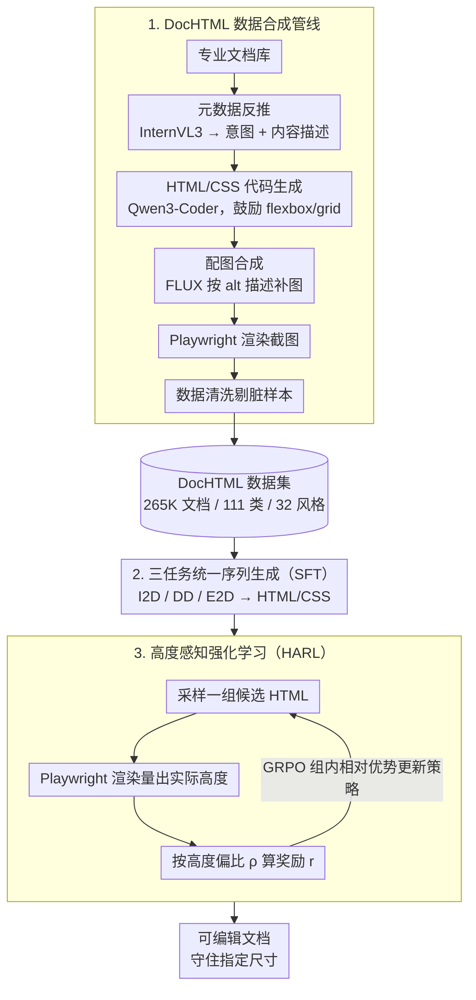

# AnyDoc: Enhancing Document Generation via Large-Scale HTML/CSS Data Synthesis and Height-Aware Reinforcement Optimization

**会议**: CVPR 2026  
**arXiv**: [2603.25118](https://arxiv.org/abs/2603.25118)  
**代码**: 无  
**领域**: Reinforcement Learning / Document Generation  
**关键词**: 文档生成, HTML/CSS, 数据合成, 强化学习, 多模态大模型

## 一句话总结
AnyDoc 提出了一个基于统一 HTML/CSS 表示的通用文档生成框架，通过自动化数据合成管线构建 265K 文档数据集 DocHTML，结合 SFT 和高度感知强化学习（HARL）微调多模态大模型，在意图到文档、文档反渲染和元素到文档三个任务上超越 GPT-4o 等基线。

## 研究背景与动机
**领域现状**：日常工作中广泛使用各类文档（简历、演示文稿、报告等），人工设计高质量文档需要平衡结构、布局、视觉和风格多个原则。近年自动文档生成受到关注。

**现有痛点**：
   - **应用范围有限**：大多数方法只针对单一类别（广告、PPT、信息图），难以处理未见类别；
   - **文档表示次优**：
     - 栅格图像：不可编辑
     - 平面坐标序列（JSON）：对复杂文档需要大量坐标计算，难以表达层次结构
   - **数据稀缺**：人工制作文档成本高，现有数据集规模小（如 Crello 仅 20K）、类别少。

**核心矛盾**：如何同时实现类别通用性、结构可编辑性和数据充足性？

**本文切入角度**：引入 HTML/CSS 作为统一文档表示——天然层次结构、强大布局机制（flexbox/grid）、可大规模合成。

**核心 idea**：HTML/CSS 统一表示 + 自动化数据合成管线 + HARL 解决溢出问题 = 通用高质文档生成。

## 方法详解

### 整体框架
AnyDoc 想做的是一个**不挑文档类别**的生成器：给一段设计意图、一张参考截图、或一堆零散素材，都能产出可编辑的高质量文档。它的关键决定是把文档统一表示成 HTML/CSS，于是整条链路就变成"任意条件 → 一段 HTML/CSS 代码 → 渲染成图"。

整体分三步走。先用一条全自动的数据合成管线造出 DocHTML 数据集（265K 文档、111 类、32 种风格），解决"没有大规模 HTML 文档数据"的问题；再以这套数据 SFT 一个多模态大模型，让它同时学会意图到文档、文档反渲染、元素到文档三个任务；最后用高度感知强化学习（HARL）做后训练，专治 SFT 模型最常见的"内容溢出指定高度"的毛病。

### 关键设计

**1. DocHTML 数据合成管线：用代码生成模型批量造出带类别多样性的 HTML 文档**

最卡脖子的不是模型而是数据——人工做文档贵，现有数据集（如 Crello 仅 20K）规模小、类别窄。这条管线把造数据拆成可流水化的五个阶段：先从专业文档库出发，用 InternVL3 反推出每篇的设计意图和内容描述作为元数据；再把元数据喂给 Qwen3-Coder-480B 生成 HTML/CSS 代码，提示里鼓励用 flexbox/grid 布局，并把所有 `` 标签统一成"占位符 URL + alt 描述"的格式；接着用 FLUX.1-dev 按 alt 描述补齐配图；用 Playwright 把代码加图像渲染成文档截图；最后一道数据清洗把尺寸不匹配、img 标签缺失、零高度元素、内容溢出的脏样本剔掉。

举个具体的：库里一张简历，InternVL3 先写出"求职简历，强调工作经历"和逐块内容；Qwen3-Coder 据此生成一段用 grid 排版的 HTML，里面的头像写成 ``；FLUX 把这张证件照补出来；Playwright 渲染出最终截图。之所以选 HTML/CSS 而不是 JSON 坐标序列，是因为标签的嵌套天然就是文档的包含层次，flexbox/grid 又把"算每个元素绝对坐标"这件苦差事交给了浏览器布局引擎，模型只需写结构、不必算像素——这也是后面实验里 HTML 表示在 Position 指标上大幅领先 JSON 的根因。

**2. 三任务统一为"条件 → HTML/CSS"序列生成：一套框架吃下三种输入形态**

文档生成在实际场景里有三种问法：只给一句设计意图（I2D，意图→文档）、给一张已有文档截图要还原可编辑代码（DD，文档反渲染）、或给一组现成的文本和图像素材要排成版（E2D，元素→文档）。AnyDoc 没有为每种问法单独建模，而是把它们都写成"条件 + 目标尺寸 → 输出 HTML/CSS"的同一个序列生成问题，三个任务共享同一个底座模型和同一份 DocHTML 数据。这样做的好处是数据和能力互相加成——反渲染学到的结构还原能力，会反过来帮意图生成排得更规整。

**3. 高度感知强化学习（HARL）：把渲染后的真实高度变成奖励，逼模型守住尺寸约束**

SFT 后的模型有个顽固问题：生成的文档常常超出指定高度，渲染时被截断，整页就废了。HARL 在 GRPO 框架上接了一个"渲染回路"来治它：对每个输入采样一组候选 HTML，逐个用 Playwright 真实渲染量出实际高度 $\hat{h}$，再和目标高度 $h$ 算偏比 $\rho = \hat{h}/h$，据此打奖励：

$$r = \max\left(0, \begin{cases} 1, & 1-\gamma \leq \rho \leq 1 \\ \gamma + \rho, & \rho < 1-\gamma \\ 1 - \alpha(\rho - 1), & \rho > 1 \end{cases}\right)$$

奖励的形状很直白：高度落在 $[1-\gamma,\,1]$ 这个略低于目标的合规区间给满分；明显填不满（$\rho < 1-\gamma$）按 $\gamma+\rho$ 线性给部分分；一旦溢出（$\rho > 1$）就按 $1-\alpha(\rho-1)$ 快速扣分。之所以能不靠人工标注偏好就学会守尺寸，是因为 GRPO 比的是组内相对优势——同一输入采出的一组候选里，高度合规的自然拿到更高奖励、溢出的被压低，模型在这种相对排序里就学会了把内容控制在框内。

### 损失函数 / 训练策略
- **SFT 阶段**：基于 Qwen2.5-VL-7B-Instruct，LoRA rank=32，batch=128，lr=1e-4
- **HARL 阶段**：全参数微调，lr=1e-6，batch=64，GRPO rollout=5
- 选择 SFT 推理中溢出最严重的 20K 样本作为 HARL 训练集

## 实验关键数据

### 主实验（I2D 意图→文档）

| 方法 | Layout | Image | Typography | Content | Height↓ | Intention |
|------|--------|-------|------------|---------|---------|-----------|
| OpenCOLE | 7.91 | 8.03 | 7.79 | 7.52 | - | 8.13 |
| FLUX.1-dev | 7.58 | 7.78 | 6.54 | 5.16 | - | 6.91 |
| GPT-4o | 8.59 | 8.75 | 8.32 | 8.41 | 0.047 | 8.96 |
| **AnyDoc** | **8.64** | **8.92** | **8.36** | **8.44** | **0.005** | 8.95 |

### 消融实验（文档反渲染，DD任务）

| 配置 | Block | Text | Position | Color | Height↓ |
|------|-------|------|----------|-------|---------|
| 坐标序列（JSON） | 0.871 | 0.925 | 0.780 | 0.812 | 0.188 |
| HTML/CSS（10K 数据） | 0.942 | 0.974 | 0.862 | 0.915 | 0.374 |
| HTML/CSS（完整数据） | 0.958 | 0.984 | 0.900 | 0.948 | 0.309 |
| + HARL | **0.965** | **0.986** | **0.910** | **0.958** | 0.309→更优 |

### 关键发现
- HTML/CSS 表示在所有指标上显著优于坐标序列（JSON），尤其是 Position 和 Color
- HARL 将 I2D 任务的 Height 指标从 0.131 降至 0.005（溢出几乎消除）
- DocHTML 数据量从 10K 增至完整集持续提升性能
- AnyDoc（7B）在多个指标上超越 GPT-4o，特别是 Height 控制

## 亮点与洞察
- **HTML/CSS 作为文档表示是关键创新**：将文档生成与 web 开发的成熟技术栈连接
- 数据合成管线完全自动化，可持续扩展类别和风格
- HARL 是精巧的解决方案：将渲染反馈引入 RL 奖励，让模型学会遵守尺寸约束
- 三个任务共享同一框架和数据集

## 局限与展望
- 7B 模型在 DD 任务的 Height 控制上仍不如 GPT-4o（模型规模的限制）
- HARL 需要 Playwright 渲染计算奖励，训练效率较低
- 生成的文档美观度仍依赖底层代码生成模型的能力
- 仅支持静态文档，交互式文档（带动态效果）未涉及

## 相关工作与启发
- 与 Design2Code 相比，不仅做反渲染还支持意图和元素到文档
- HARL 的思路（渲染→度量→奖励）可推广到其他需要视觉约束的代码生成任务

## 评分
- 新颖性: ⭐⭐⭐⭐ HTML/CSS统一表示+数据合成+HARL三位一体
- 实验充分度: ⭐⭐⭐⭐ 三个任务×多个基线×消融全面
- 写作质量: ⭐⭐⭐⭐⭐ 问题分析透彻，方法动机清晰
- 价值: ⭐⭐⭐⭐ 对自动化文档生成有实际应用价值

<!-- RELATED:START -->

## 相关论文

- [\[CVPR 2026\] Reading or Reasoning? Format Decoupled Reinforcement Learning for Document OCR](reading_or_reasoning_format_decoupled_reinforcement_learning_for_document_ocr.md)
- [\[ICML 2026\] Vulnerable Agent Identification in Large-Scale Multi-Agent Reinforcement Learning](../../ICML2026/reinforcement_learning/vulnerable_agent_identification_in_large-scale_multi-agent_reinforcement_learnin.md)
- [\[AAAI 2026\] Enhancing Robustness of Offline RL Under Data Corruption via SAM](../../AAAI2026/reinforcement_learning/enhancing_robustness_of_offline_reinforcement_learning_under_data_corruption_via.md)
- [\[ICML 2026\] Plug-and-Play Benchmarking of Reinforcement Learning Algorithms for Large-Scale Flow Control](../../ICML2026/reinforcement_learning/plug-and-play_benchmarking_of_reinforcement_learning_algorithms_for_large-scale_.md)
- [\[ICML 2026\] EAPO: Enhancing Policy Optimization with On-Demand Expert Assistance](../../ICML2026/reinforcement_learning/eapo_enhancing_policy_optimization_with_on-demand_expert_assistance.md)

<!-- RELATED:END -->
