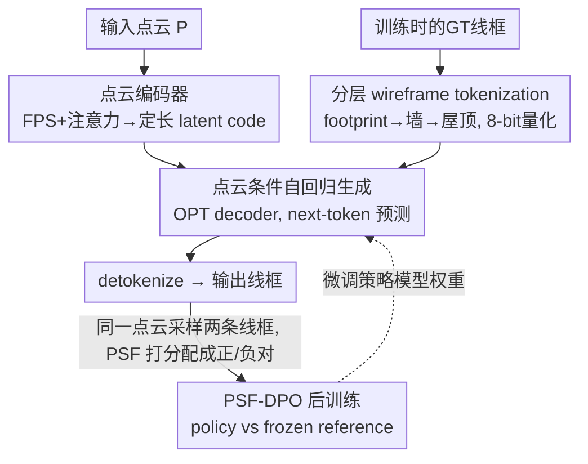

# BuildingGPT: Auto-Regressive Building Wireframe Reconstruction Model with Reinforcement Learning

**会议**: CVPR 2026  
**论文**: [CVF Open Access](https://openaccess.thecvf.com/content/CVPR2026/html/Liu_BuildingGPT_Auto-Regressive_Building_Wireframe_Reconstruction_Model_with_Reinforcement_Learning_CVPR_2026_paper.html)  
**代码**: https://github.com/3dv-casia/BuildingGPT/  
**领域**: 3D视觉 / 强化学习  
**关键词**: 建筑线框重建, 自回归生成, 点云, DPO, tokenization  

## 一句话总结
BuildingGPT 把"从点云重建建筑线框"重新表述成一个序列生成问题：先用一套分层 tokenization 把线框按"地基→墙→屋顶"的顺序编码成离散 token，再用点云条件的自回归 Transformer 逐 token 生成，最后用一个基于自定义偏好分数（PSF）的 DPO 后训练对齐人类对几何精度与拓扑正确性的偏好，在大规模 MunichWF 数据集上全面超过检测式和扩散式 SOTA。

## 研究背景与动机
**领域现状**：建筑线框（wireframe）是一种轻量又精确的 3D 表示，用顶点和边把建筑的footprint、墙、屋顶等结构串起来。从点云重建线框目前主要有两条路线：**基元检测**（先检顶点再连边，或直接检边再后处理）和**条件生成**（如 EdgeDiff 用边扩散模型从噪声边逐步去噪）。

**现有痛点**：检测式方法只盯着局部特征，遇到噪声或残缺点云时容易漏检顶点/边，导致结构不完整；扩散式方法用固定数量的 padding 边，最后仍要依赖边聚类等后处理，没法做到真正端到端。两类方法都难以保证"几何精度"和"拓扑正确性"两件事同时成立。

**核心矛盾**：建筑天然带有极强的结构与语义规律——平行、垂直、共面的边，以及 footprint/墙/屋顶之间的连接关系。但检测式和扩散式都没把这种"全局结构依赖"显式建模进去，于是局部看着对、整体拓扑却经常错乱。

**本文目标**：做一个端到端、能显式建模边与边之间长程依赖、并且能对齐人类对"好线框"偏好的重建模型。

**切入角度**：作者注意到建筑线框本质上是一串相互依赖的边，这正好契合自回归（next-token prediction）擅长的序列建模；而 RLHF/DPO 这套后训练范式又能把"人类觉得几何准、拓扑对"的偏好注入进来。两者结合此前在线框重建上几乎没人做过。

**核心 idea**：把线框重建变成"边序列的自回归生成"——分层 tokenization 决定生成顺序，点云 latent code 作条件，DPO 后训练再校准——用语言模型的范式重写一个 3D 几何重建任务。

## 方法详解

### 整体框架
BuildingGPT 的输入是一片建筑点云 $P$，输出是完整的建筑线框（一组带顶点坐标的边）。整条管线分两个训练阶段：**阶段一（预训练）**把点云编码成定长 latent code，再让一个 decoder-only Transformer 以这段 code 为条件、从 BOS 开始逐 token 自回归地吐出线框序列，detokenize 后得到线框；**阶段二（后训练）**用预训练模型自己生成的样本构造"正/负偏好对"，再用 DPO 把策略模型往人类偏好的方向微调。

这里的关键转换是：原本连续的线框坐标，被一套"分层 tokenization"按 footprint→墙→屋顶的语义顺序排成离散 token 序列，于是几何重建问题被改写成了一个标准的语言建模问题。

### 关键设计

**1. 分层建筑线框 tokenization：让生成顺序自带结构与语义先验**

这一步针对的痛点是"检测/扩散都没把建筑的结构语义规律编码进去"。作者把线框组织成三个层级——**组件**（component）、**边**（edge）、**顶点**（vertex）。组件按高度直接划分：两个端点都在地面的边归为 footprint，一端在地面的归为墙，其余归为屋顶；组件之间按 footprint→墙→屋顶排序，恰好模仿了真实世界"从地基往上盖"的建造过程。每个组件内部，顶点先按 $z\text{-}y\text{-}x$ 升序排列，边再按其最低顶点索引、次低顶点索引排序。于是整条线框序列写成

$$B = (F, W, R) = (f_1,\dots,f_{n_f},\ w_1,\dots,w_{n_w},\ r_1,\dots,r_{n_r})$$

其中每条边 $e_i$ 由六个坐标表示 $(z^1_{e_i}, y^1_{e_i}, x^1_{e_i}, z^2_{e_i}, y^2_{e_i}, x^2_{e_i})$。坐标先归一化到单位立方体，再做 8-bit 量化得到离散 token，最后插入 BOS/EOS 标记序列起止。这种"按语义组件分层、按建造顺序排列"的设计，让自回归模型在预测下一个 token 时能利用同组件内的结构一致性和组件间的垂直/平行/正交约束——后面消融显示，光是把 vanilla 的 z-y-x 排序换成这套分层排序，EF1 就从 91.9% 涨到 93.1%。

**2. 点云条件的自回归生成：把重建写成 next-token 预测**

针对"如何端到端、显式建模边间长程依赖"，作者用一个 decoder-only Transformer 学习线框序列在点云条件下的联合分布：

$$\mathrm{Pro}(S|P) = \prod_{i=1}^{n_s} \mathrm{Pro}(T_i \mid S_{1:i-1}, P)$$

点云这一侧用受 Point Transformer 启发的编码器：每个点先 embedding 成局部特征，用最远点采样（FPS）选出 $n_q$ 个 query 点，经自注意力和交叉注意力让 query 特征聚合全局结构，形成一段**定长 latent code**。这段 code 被 prepend 到 BOS token 之前，作为整条生成的条件。生成网络采用 OPT 架构（24 层、16 头、隐藏维 1536），离散 token 先经可学习 embedding 转成连续特征，再用堆叠的因果自注意力让每个 token 都能 attend 到 latent code 与全部前序 token，从而捕捉长程结构依赖。预训练用交叉熵损失 $L_{pre} = \mathrm{CE}(S, S_{gt})$。推理时从 BOS 起用 top-$k$（$k=10$）多项式采样，并加一条硬约束：**EOS 只允许在已生成 token 数为 6 的倍数时出现**，保证每条边（6 个坐标）都被完整生成，避免吐出半条边这种结构非法的输出。

**3. 基于 PSF 的 DPO 后训练：把"人类偏好的好线框"对齐进来**

预训练后的模型仍会犯一些不符合人类直觉的错误（结构缺失、边无序）。作者引入 DPO 后训练来对齐偏好，难点在于"怎么定义一个线框比另一个好"。为此他们设计了**偏好分数函数 PSF**，把几何精度和拓扑正确性揉成一个标量：

$$\mathrm{PSF} = \frac{F_c + F_e}{F_{wed}}$$

其中 $F_{wed}$ 是 Wireframe Edit Distance（衡量拓扑正确性，越低越好），$F_c$、$F_e$ 分别是 Corner F1 和 Edge F1（衡量顶点/边的几何精度，越高越好）。对每片点云，预训练模型采样出两条不同线框，PSF 高者作正样本、低者作负样本，组成偏好对（共 40,000 对）。后训练阶段有两个模型：**reference model** 从预训练权重初始化并冻结，**policy model** 同样初始化但可训练。DPO 鼓励策略模型给正样本更高似然、负样本更低似然：

$$L_{DPO} = -\log\sigma\!\left(\beta\log\frac{\pi_p(y^+|p)}{\pi_r(y^+|p)} - \beta\log\frac{\pi_p(y^-|p)}{\pi_r(y^-|p)}\right)$$

但由于正负样本在序列开头往往共享相同 token，模型可能区分困难、甚至把正样本似然也压低，所以作者额外加一个对正样本、按长度归一化的 NLL 损失来稳住训练：

$$L_{NLL} = -\frac{\log\pi_p(y^+|p)}{|y^+|}$$

总后训练损失 $L_{pos} = \mathbb{E}_{(p,y^+,y^-)\sim D}(L_{DPO} + L_{NLL})$（$\beta=0.1$）。这一步让 WED 从 1.19 进一步降到 0.98，是全管线最后一块拼图。

### 损失函数 / 训练策略
预训练用交叉熵 $L_{pre}$，在 8×A800 上训 4 天；后训练用 $L_{pos}=L_{DPO}+L_{NLL}$，单卡 A800 训 2 天，偏好对 40,000、$\beta=0.1$。顶点坐标量化分辨率 256，query/input 点数 2048/4096，latent code 长 2048。训练做随机缩放、旋转、噪声扰动增强。

## 实验关键数据

### 主实验
数据集为作者新构建的 **MunichWF**（从慕尼黑 LOD2 建筑 mesh 提取线框，过滤残缺样本后 267K 个，262K 训练 / 5K 测试），覆盖 footprint+墙+屋顶的完整建筑（不像旧数据集只有屋顶）。指标分 Distance（WED↓、ACO↓）、Corner（CP/CR/CF1）、Edge（EP/ER/EF1）三组。

| 方法 | 出处 | WED↓ | ACO↓ | CF1↑ | EF1↑ |
|------|------|------|------|------|------|
| PC2WF | ICLR21 | 38.87 | 32.66 | 10.0 | 0.8 |
| Point2Roof | JPRS22 | 4.10 | 3.75 | 61.5 | 43.9 |
| PBWR | CVPR24 | 1.54 | 1.48 | 92.6 | 88.9 |
| EdgeDiff | CVPR25 | 1.39 | 1.32 | 93.9 | 91.6 |
| BWFormer | CVPR25 | 3.56 | 2.74 | 91.4 | 87.9 |
| **BuildingGPT** | - | **0.98** | **0.88** | **97.4** | **94.4** |

相比前 SOTA EdgeDiff，WED 与 ACO 分别下降 29.5% 和 33.3%，CF1/EF1 分别提升 3.5%/2.8%，所有指标全面领先。

### 消融实验
| 配置 | WED↓ | ACO↓ | CF1↑ | EF1↑ | 说明 |
|------|------|------|------|------|------|
| Baseline（vanilla z-y-x 排序） | 1.39 | 1.25 | 96.0 | 91.9 | 仅预训练、普通 tokenization |
| + 分层 tokenization | 1.19 | 1.08 | 96.7 | 93.1 | 换成 footprint→roof 分层排序 |
| + DPO 后训练 | **0.98** | **0.88** | **97.4** | **94.4** | 完整模型 |

### 关键发现
- **两块设计各有约一半贡献**：分层 tokenization 把 WED 从 1.39 降到 1.19、EF1 +1.2 个点；DPO 后训练再把 WED 降到 0.98、EF1 再 +1.3 个点。结构感知的生成顺序和偏好对齐的后训练是互补的。
- **呈现类 LLM 的 scaling 行为**：模型从 129M 扩到 730M、数据从 20% 用到 100%，测试集交叉熵单调下降；小模型在数据增多后会饱和，大模型则持续受益，说明这个范式有靠"加参数+加数据"继续涨点的空间。
- **对输入退化较鲁棒但有阈值**：随机删点 25%/50%、噪声 0.01/0.02 时指标基本稳住（WED 1.09~1.97）；但删点 75%、噪声 0.05 时明显崩坏（CF1 跌到 85 左右、EF1 跌到 76），作者归因于全局上下文建模带来的鲁棒性，但极端稀疏/噪声仍是瓶颈。
- **零样本跨域可用**：在未见过的 AHN3 数据集上不微调也能重建出拓扑一致的线框（定性结果）。

## 亮点与洞察
- **把 3D 几何重建"语言模型化"得很彻底**：从 tokenization（决定生成顺序）→ 条件自回归（建模长程依赖）→ DPO（偏好对齐），整条管线几乎是 LLM 训练范式在 3D 重建上的一次完整移植，连 scaling law 都复现了。
- **PSF 这个偏好分数设计巧妙**：用 $\frac{F_c+F_e}{F_{wed}}$ 把"几何精度（分子，越高越好）"和"拓扑正确性（分母，越低越好）"合成一个标量，天然把两个相互拉扯的目标统一成一个可比较的偏好信号，避免了人工标注偏好对。
- **"EOS 只能在 6 的倍数处出现"是个低成本却关键的结构合法性约束**：用一条解码规则就杜绝了"半条边"这种非法输出，是把离散序列生成用于结构化几何时值得复用的 trick。
- 用模型自己采样的两条结果配成偏好对（self-sampled preference pairs），省掉人工标注，这套"自产偏好数据 + DPO"的思路可迁移到其他结构化生成任务。

## 局限与展望
- 作者承认对**复杂结构仍有局部缺失或边无序**的失败案例（论文 Fig. 8）。
- 极端输入退化（删点 75%、噪声 0.05）下性能显著下滑，说明全局上下文建模的鲁棒性也有上限。
- ⚠️ 自回归逐 token 生成对长线框（边多的复杂建筑）推理可能偏慢，论文未给出推理时延对比，实际部署成本待确认。
- DPO 的偏好对完全由 PSF 自动生成，PSF 本身的设计（三个 F1/WED 的组合形式）是否最优、对不同建筑风格是否通用，论文未充分讨论。
- 改进方向：引入更强的几何/物理约束到解码、或把偏好信号扩展到带语义的人工反馈，可能进一步压低复杂建筑的拓扑错误。

## 相关工作与启发
- **vs 检测式（PC2WF / Point2Roof / BWFormer / PBWR）**：它们先检顶点/边再连接或后处理，局部特征导向、遇噪声易漏检且非端到端；本文直接自回归生成整条边序列，显式建模边间依赖，端到端无后处理，主表上全面领先（如 PBWR 的 EF1 88.9 → 本文 94.4）。
- **vs 扩散式（EdgeDiff）**：EdgeDiff 从噪声边去噪、用固定 padding 边数仍需后处理；本文用序列长度自适应的自回归生成 + EOS 约束，无需 padding 与聚类后处理，WED 1.39 → 0.98。
- **vs 自回归 mesh 生成（PolyGen / MeshGPT）**：本文借鉴了它们"把几何排成 token 序列"的思路，但针对建筑设计了 footprint→roof 的分层语义 tokenization，并首次把 DPO 偏好对齐引入线框重建（mesh 侧的 DeepMesh/MeshRFT 用过 DPO，但任务不同）。

## 评分
- 新颖性: ⭐⭐⭐⭐⭐ 首次把"分层 tokenization + 点云条件自回归 + DPO 后训练"完整范式用于建筑线框重建
- 实验充分度: ⭐⭐⭐⭐⭐ 主对比、消融、scaling、鲁棒性、跨域泛化、失败案例俱全，还自建 267K 大规模数据集
- 写作质量: ⭐⭐⭐⭐ 方法与动机清晰，pipeline 和 PSF 讲得明白，部分实现细节（推理时延）略缺
- 价值: ⭐⭐⭐⭐⭐ 把 LLM 训练范式成功迁移到 3D 结构化重建并复现 scaling，对城市建模/数字孪生有实用价值

<!-- RELATED:START -->

## 相关论文

- [\[CVPR 2026\] Masked Auto-Regressive Variational Acceleration: Fast Inference Makes Practical Reinforcement Learning](masked_auto-regressive_variational_acceleration_fast_inference_makes_practical_r.md)
- [\[ICLR 2026\] cadrille: Multi-modal CAD Reconstruction with Reinforcement Learning](../../ICLR2026/reinforcement_learning/cadrille_multi-modal_cad_reconstruction_with_reinforcement_learning.md)
- [\[ICML 2026\] LASER: Learning Active Sensing for Continuum Field Reconstruction](../../ICML2026/reinforcement_learning/laser_learning_active_sensing_for_continuum_field_reconstruction.md)
- [\[ICML 2026\] The Surprising Difficulty of Search in Model-Based Reinforcement Learning](../../ICML2026/reinforcement_learning/the_surprising_difficulty_of_search_in_model-based_reinforcement_learning.md)
- [\[CVPR 2026\] EVA: Efficient Reinforcement Learning for End-to-End Video Agent](eva_efficient_reinforcement_learning_for_end-to-end_video_agent.md)

<!-- RELATED:END -->
