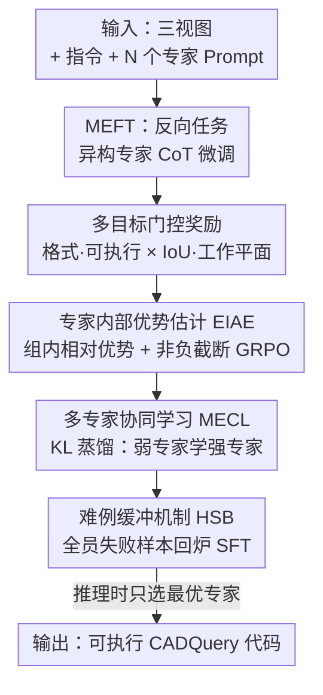

# CME-CAD: Heterogeneous Collaborative Multi-Expert Reinforcement Learning for CAD Code Generation

**会议**: CVPR 2026  
**论文**: [CVF OpenAccess](https://openaccess.thecvf.com/content/CVPR2026/html/Niu_CME-CAD_Heterogeneous_Collaborative_Multi-Expert_Reinforcement_Learning_for_CAD_Code_Generation_CVPR_2026_paper.html)  
**代码**: 数据集开源 https://modelscope.cn/datasets/zhuofanChen/CADExpert  
**领域**: 强化学习 / CAD代码生成 / 视觉语言模型  
**关键词**: 多专家强化学习, GRPO, 三视图, CADQuery, 知识蒸馏

## 一句话总结
针对"从二维工程三视图直接生成可执行、可编辑 CAD 代码"这一工业场景，CME-CAD 让多个异构预训练大模型分别扮演风格各异的"专家"，先用各自的推理风格做监督微调（MEFT），再在强化学习阶段（MERL）让强专家通过 KL 蒸馏把好策略传给弱专家、并用难例缓冲机制反复攻克最难的样本，最终在自建的工业级基准 CADExpert 上把 IoU 从 71.84% 提升到 80.71%、代码可执行率提到 98.25%。

## 研究背景与动机

**领域现状**：把设计意图自动转成精确、可编辑的 CAD 模型，是智能制造"数字优先"流程里的核心一环。现有 CAD 代码生成方法大多走两条路：要么从草图直接重建 3D（CAD-MLLM、GenCAD、Img2CAD 等），要么用文本/图像描述驱动 VLM 生成参数化命令（CAD-Coder、CAD-Llama）。方法上则普遍依赖**可验证奖励的强化学习（RLVR）**来提升推理。

**现有痛点**：从重建出来的 3D 模型往往是近似的、不可编辑的，达不到工业级的精度与可编辑性要求；而文本/图像输入又需要大量人工标注专业描述，难以规模化。更关键的是方法层面——RLVR 是 **on-policy** 的，它只能沿着模型自身已经"奖励丰富"的推理路径做优化，相当于在模型现有知识库内部打转，**无法主动探索新知识**。一旦模型初始策略本身有偏、在复杂样本上根本生成不出正确答案，奖励就会极度稀疏，优化寸步难行。

**核心矛盾**：单个模型的推理路径存在天花板，RLVR 又无法突破这个天花板（它只会强化已有套路而非引入新套路），于是 CAD 这种对空间几何和数值高度敏感、初始正确率又低的任务，就卡在"模型不会→奖励稀疏→学不动"的死循环里。

**本文目标**：(1) 把输入对齐到真实工业流程——直接从带尺寸标注的正交三视图生成精确 CADQuery 代码；(2) 找到一种能突破单模型推理天花板、又不牺牲自驱探索能力的训练范式。

**切入角度**：作者借用"博采众长"的朴素直觉——不同的预训练大模型各有各的推理风格和强项，如果让它们作为异构专家**互相学习**，就能把单个模型够不到的知识引进来，相当于给 on-policy 的 RL 注入了"别人的"探索方向。

**核心 idea**：用一组异构专家分别生成多样化推理路径，再让"表现差的专家向表现好的专家学习"（KL 蒸馏）+ "把所有专家都做错的难例反复回炉"（难例缓冲），从而在不丢失探索多样性的前提下打破单模型上限。

## 方法详解

### 整体框架
CME-CAD 是一个两阶段训练范式，输入是带精确尺寸标注的正交三视图 + 指令，输出是可执行、可编辑的 CADQuery（基于 Python 的 CAD 脚本）代码。核心做法是引入 N 个异构预训练专家模型，每个专家由一个**固定且独特的 system prompt** $P_n$ 来界定其推理风格，从而让同一个底座模型在不同 prompt 下表现出差异化的"专家人格"。

第一阶段 **MEFT（Multi-Expert Fine-Tuning）** 让模型学会每个专家各自的推理风格——但因为预训练阶段缺乏"三视图→代码"的数据，专家直接生成的 CoT 不可靠，作者用"反向任务"先喂代码再让模型反推推理路径，生成高质量 CoT 样本。第二阶段 **MERL（Multi-Expert Reinforcement Learning）** 是真正的协同核心：先设计一套带门控的多目标奖励，再在每个专家组内部估计相对优势（EIAE）跑 GRPO，然后用 KL 蒸馏让最差专家向最好专家学习（MECL），最后用难例缓冲机制（HSB）把全员失败的硬骨头存起来反复监督微调。推理时只需挑表现最好的那个专家上场，省掉传统多专家架构"全跑一遍再选优"的开销。

### 关键设计

**1. MEFT 反向任务异构专家 CoT 生成：解决专家直接推理三视图时 CoT 不可靠的问题**

直接让 VLM 从二维三视图推理出 CADQuery 代码，CoT 质量很差——因为预训练阶段几乎没有这类"图纸→代码"的数据和任务，模型根本没学过怎么从正交投影还原三维结构。作者的对策是**反向任务（reverse-task）**：训练样本构造时不让模型从零推理，而是同时给它正交投影**和对应的标准 CADQuery 代码**，让它去"反推"——已知答案的情况下，解释如何从三视图一步步得到这段代码，从而产出更可靠的推理路径。每个专家 $n$ 由独特 prompt $P_n$ 引导，针对指令 $I_i$ 产出带专家风格的 CoT $C_i^{(n)}$ 和答案 $A_i^{(n)}$，打包成专家样本 $S_n = (P_n, I_i, C_i^{(n)}, A_i^{(n)})$。训练目标是最大化"推理过程 + 正确答案"拼接序列的联合似然，即最小化负对数似然：

$$\mathcal{L} = -\sum_{n=1}^{N}\sum_{i=1}^{I}\log\big(p(\text{Concat}(C_i^{(i)}, A_i^{(i)}) \mid P_n, I_i)\big)$$

这样每个专家先把自己的推理范式学扎实，为后续协同打底。⚠️ 公式 (2) 中上标 $C_i^{(i)}$ 疑为 $C_i^{(n)}$ 的笔误，以原文为准。

**2. 多目标门控奖励：让奖励既严格卡住"代码必须能跑"又能细分几何精度**

CAD 代码对数值和坐标系极度敏感，单一奖励无法刻画"既要能执行、又要几何对、还要坐标系对"。作者把奖励拆成四项并用门控组合。**格式奖励** $R_{\text{format}}$ 用正则匹配确保模型先输出推理、再输出代码，符合得 1 否则 0；**可执行奖励** $R_{\text{exec}}$ 直接用 Python 解释器跑生成的 CadQuery 代码，能无错执行得 1 否则 0；**几何精度奖励** $R_{\text{IoU}}$ 用生成模型与真值模型的 Jaccard 交并比衡量 $R_{\text{IoU}} = J(M_{\text{gen}}, M_{\text{gt}}) = \frac{|M_{\text{gen}}\cap M_{\text{gt}}|}{|M_{\text{gen}}\cup M_{\text{gt}}|}$。

特别地，作者发现即使几何形状对了，只要**坐标系**偏了 IoU 就会彻底归零，于是引入**工作平面奖励** $R_{\text{plane}}$，从原点偏差和坐标轴朝向两方面量化坐标系一致性：原点偏差是欧氏距离 $Dis_{\text{ori}} = \|O_{\text{gen}} - O_{\text{gt}}\|_2$，法向量偏差 $Dis_{\text{vec}} = \frac{1}{2}[2 - \text{sim}(\boldsymbol{x}_{\text{gen}}, \boldsymbol{x}_{\text{gt}}) - \text{sim}(\boldsymbol{y}_{\text{gen}}, \boldsymbol{y}_{\text{gt}})]$，合成 $R_{\text{plane}} = 1 - \beta\cdot Dis_{\text{ori}} - \gamma\cdot Dis_{\text{vec}}$。最终总奖励用**乘性门控**——格式和可执行作为前置硬条件，只有两者都满足总奖励才可能为正：

$$R = \lambda_{\text{format}}R_{\text{format}} \cdot \lambda_{\text{exec}}R_{\text{exec}} \cdot \big(\lambda_{\text{IoU}}R_{\text{IoU}} + \lambda_{\text{plane}}R_{\text{plane}}\big)$$

这种"先过门槛、再比精度"的结构避免了模型靠几何分数蒙混过关却输出跑不动的代码。

**3. 专家内部优势估计（EIAE）：用组内相对优势 + 非负截断，避免复杂任务里小错误就掐死探索**

强化学习阶段把 MEFT 训练好的模型当作当前策略 $\pi_\theta$。对每个样本，不同 prompt $P_n$ 引导各专家采样 $G$ 个回答，N 个专家共 $N\times G$ 条响应 $(C_g^n, A_g^n)$，每条用奖励函数算出绝对奖励 $R_g^n$。优势估计**只在同一专家组内做**——用该响应的绝对奖励减去本专家所有 $G$ 个响应的平均奖励：

$$\mathcal{A}_n = R_g^n - \frac{1}{G}\sum_{g'=1}^{G}R_{g'}^n$$

这样优势只反映"在自己这一路风格里，这条回答比平均好多少"，不会被别的专家风格污染。基于此跑 GRPO，但关键改动是给优势加了**非负截断** $\max(\mathcal{A}_g^n, 0)$：

$$\mathcal{L}_{\text{GRPO}}^{(n)} = -\mathbb{E}_{A_g^n\sim\pi_\theta}\big[\log\pi_\theta(A_g^n \mid P_n, I_i)\cdot\max(\mathcal{A}_g^n, 0)\big]$$

动机很具体——CAD 代码生成极复杂，过程中一点小错就会带来轻微负优势，如果照常惩罚，模型会因为这些"小负分"被迅速劝退、不敢再探索不确定的动作；把负优势截断为 0 就保住了探索意愿。

**4. 多专家协同学习（MECL）：用 KL 蒸馏强制最差专家向最好专家学，且不牺牲多样性**

光有组内优势还不够，专家之间需要真正的知识流动。对每个输入 $I_i$，作者算出每个专家的平均绝对奖励 $r_n$，奖励最高的记为最优专家 $E^+$、最低的记为最差专家 $E^-$。然后引入 KL 散度惩罚，**逼着 $E^-$ 去学 $E^+$ 的高质量解**：

$$\mathcal{L}_{\text{KL}} = \text{KL}\big(\pi_\theta(A^+ \mid P_{E^-}, I_i) \,\|\, \pi_\theta(A_{\text{correct}} \mid P_{E^+}, I_i)\big)$$

巧妙之处在于：蒸馏的核心问句是"以你（弱专家）独特的 prompt 风格，你会怎么生成这个正确答案？"——因为每个专家的 system prompt 固定且独特，强制了差异化推理风格，所以知识从高奖励解迁移过去时**并不会让所有专家坍缩成同一个模型**，多样性被 prompt 锚住了。这正是它区别于"简单聚合多模型输出"的地方：不是取平均，而是让弱者按自己的风格吸收强者的本事。

**5. 难例缓冲机制（HSB）：把所有专家都做错的硬骨头存起来反复回炉，缓解奖励稀疏**

最棘手的情况是某个查询所有专家都答不对，此时奖励全为零、模型学不到任何信号。HSB 的做法是：把 RL 数据切成 $M$ 份，每训完 $\frac{1}{M}$ 就拿这部分当测试集，维护一个缓冲区 $B$ 存难例——对输入 $I_i$，若专家 $n$ 在 $G$ 个响应里错了超过 $K$ 个，就以概率 $\frac{K}{G}$ 把该样本加入缓冲区。随后对缓冲区里的数据做监督微调，用模型输出和真值答案的差异计算损失：

$$\mathcal{L}_{\text{SFT}} = -\sum_{B}\log p_\theta(A_{\text{correct}} \mid P_n, I_i)$$

通过反复"重访"这些难样本做定向微调，模型不会把最难的边界样本白白丢掉，数据利用率和鲁棒性都更高。消融显示这一机制在高复杂度的 CADExpert 上对总体性能提升最大。

### 损失函数 / 训练策略
底座模型 Qwen3-VL-4B-Instruct，8 卡 H100。MEFT 阶段学习率 $1\times10^{-5}$、batch size 32；MERL 阶段学习率仍 $1\times10^{-5}$、batch size 8，每个 prompt 采样 4 条 rollout，温度 0.9。用三个异构专家：Expert 1 = Qwen3-VL-Plus，Expert 2 = GPT-5-Mini，Expert 3 = Doubao-Seed-1.6-Vision。借助 vLLM 并行批量采样 + paged attention，多专家训练总耗时只比单专家基线增加 20%–30%（而非理论上的 N 倍），峰值显存也基本持平。推理阶段不用任何采样（无温度采样/beam search）以保证结果可复现。

## 实验关键数据

### 主实验
在自建基准 CADExpert 上对比九个未微调的 SOTA VLM 以及微调基线 CAD-RL。指标含 IoU（越高越好）、Mean/Med Chamfer Distance（越低越好）、可执行率 Exec（越高越好）。

| 模型 | IoU(%)↑ | Mean CD↓ | Med CD↓ | Exec.(%)↑ |
|------|---------|----------|---------|-----------|
| Qwen2.5-VL | 19.21 | 20.68 | 6.64 | 31.27 |
| Gemini2.5 Pro | 30.86 | 14.13 | 5.97 | 39.40 |
| GPT5-Mini | 35.15 | 9.89 | 4.81 | 47.13 |
| Qwen3-VL（底座） | 37.04 | 6.96 | 3.84 | 54.79 |
| CAD-RL*（前 SOTA） | 71.84 | 1.38 | 0.36 | 97.32 |
| **CME-CAD（本文）** | **80.71** | **1.00** | **0.11** | **98.25** |

本文 IoU 比前 SOTA CAD-RL 高出 8.87 个百分点，可执行率达 98.25%——意味着工程师几乎可以直接信任模型输出，只需对少量复杂样本做微调。未微调的通用 VLM（即便 GPT5-Mini、Gemini2.5 Pro）IoU 都在 35% 以下，可见任务本身极难。

### 消融实验
表 2 对比"单专家 vs 多专家"，表 3 拆解三大组件（EIAE / HSB / MECL）。

| 配置 | IoU(%)↑ | Mean CD↓ | Exec.(%)↑ | 说明 |
|------|---------|----------|-----------|------|
| Expert3-SFT | 40.91 | 5.34 | 85.35 | 单专家仅 SFT |
| MoE-SFT (Expert3) | 64.45 | 1.63 | 96.99 | 多专家数据做 SFT |
| E3-SFT-GRPO | 52.38 | 4.70 | 96.88 | 单专家 SFT+GRPO（反而不如多专家 SFT） |
| EIAE | 73.89 | 1.33 | 98.28 | 仅加专家内部优势估计 |
| EIAE+HSB | 78.14 | 1.13 | 98.22 | 再加难例缓冲 |
| EIAE+MECL | 76.71 | 1.28 | 98.19 | 再加协同学习 |
| **EIAE+HSB+MECL（Full）** | **80.71** | **1.00** | **98.25** | 完整模型 |

### 关键发现
- **多专家数据本身就能突破单专家天花板**：单专家哪怕跑完 SFT+GRPO（E3-SFT-GRPO IoU 52.38）也远不如仅用多专家数据做 SFT（MoE-SFT 64.45），印证了"单模型推理路径有上限、引入异构知识才能破局"的核心论点。
- **HSB 对总体性能贡献最大**：在 EIAE 基础上加 HSB，IoU 从 73.89 涨到 78.14（+4.25），是单组件涨幅最高的，原因是 CADExpert 难度高、难例多，反复回炉攻克难例收益巨大。
- **EIAE 主要拉高可执行率**：它帮模型为每个任务选最合适的专家，可执行率从 96.99 直接拉到 98%+。
- **EIAE 与 MECL 联用才能完全激活框架潜力**：三件套齐全时 IoU 80.71、Mean CD 1.00 全面最优。

## 亮点与洞察
- **"异构专家 = 同底座 + 不同 system prompt"** 是非常省成本的设计：不需要真的训 N 个模型，靠固定独特 prompt 就锚住差异化推理风格，KL 蒸馏迁移知识时多样性还不坍缩——这套"prompt 即专家身份"的思路可迁移到任何需要多视角探索的 RL 任务。
- **非负截断优势 $\max(\mathcal{A}, 0)$** 抓住了复杂生成任务的真实痛点：长程代码里小错频发会带来一堆小负优势，常规 GRPO 会把探索掐死，截断负值是个简单却对症的修补。
- **工作平面奖励**单独把"坐标系一致性"从几何精度里拆出来，是对 CAD 领域 know-how 的精准建模——它点破了"形状对但坐标系偏导致 IoU 归零"这个工程上极易踩的坑。
- **推理时只选最优专家**，相比传统多专家架构"全跑再选优"大幅省算力，而 vLLM 让多专家训练只多 20–30% 时间，工程落地性强。

## 局限与展望
- **强烈依赖外部强专家**：三个专家里 GPT-5-Mini、Doubao-Seed-1.6-Vision 都是闭源大模型，整套范式的上限被这些专家的能力天花板和可获得性绑定，数据/CoT 生成成本不低。
- **任务范围受限**：方法和 CADExpert 都聚焦正交三视图→CADQuery，对自由曲面、装配体、参数化约束更复杂的真实工业件是否同样有效，文中未充分验证。
- **奖励里多个 $\lambda$、$\beta$、$\gamma$ 超参**如何设定、敏感度如何，正文未给详细分析，复现门槛偏高。
- **"最优/最差专家"按平均奖励选**是 per-input 动态的，当所有专家表现接近时 $E^+$/$E^-$ 的区分可能噪声较大，KL 蒸馏方向是否稳定值得进一步探究。

## 相关工作与启发
- **vs CAD-RL**：CAD-RL 是首个成功生成数值精确 CADQuery 代码的方法，但它是单模型 RLVR、受困于自身推理路径；本文用异构多专家协同打破这个上限，IoU 直接 +8.87，证明"多视角知识注入"比"单模型继续 RL"更有效。
- **vs 传统 RLVR（on-policy）**：RLVR 只在模型已有知识里沿奖励丰富路径优化、无法探索新知识；CME-CAD 借异构专家引入外部推理多样性，又通过固定 prompt 保住自驱探索，兼得"突破上限"与"不丢多样性"。
- **vs CAD-Coder / CAD-Llama 等 VLM 命令生成**：它们依赖文本/图像描述、需大量人工标注且产物常不可编辑；本文直接对齐工业流程从带尺寸标注的三视图生成可执行可编辑代码，更贴近真实设计场景。
- **启发**：把"system prompt 当专家身份 + KL 蒸馏弱学强 + 难例缓冲"组合成一套通用的 multi-expert RL 训练范式，理论上可移植到数学推理、agent 工具调用等"初始正确率低、奖励稀疏"的复杂生成任务。

## 评分
- 新颖性: ⭐⭐⭐⭐⭐ "异构专家 = 同底座不同 prompt + KL 弱学强 + 难例缓冲"的组合在 CAD 代码生成上很新，对 on-policy RL 探索瓶颈的切入角度扎实。
- 实验充分度: ⭐⭐⭐⭐ 主实验对比九个 VLM + 前 SOTA，消融拆清三大组件且自洽；但缺超参敏感性与跨数据集泛化验证。
- 写作质量: ⭐⭐⭐⭐ 动机推导清晰、公式完整；个别公式上标存在笔误、部分超参定义略简。
- 价值: ⭐⭐⭐⭐⭐ 直击工业级可编辑 CAD 生成痛点，可执行率 98%+ 落地价值高，并开源 17,299 实例的 CADExpert 基准。

<!-- RELATED:START -->

## 相关论文

- [\[ICLR 2026\] cadrille: Multi-modal CAD Reconstruction with Reinforcement Learning](../../ICLR2026/reinforcement_learning/cadrille_multi-modal_cad_reconstruction_with_reinforcement_learning.md)
- [\[CVPR 2026\] MSRL: Scaling Generative Multimodal Reward Modeling via Multi-Stage Reinforcement Learning](msrl_scaling_generative_multimodal_reward_modeling.md)
- [\[CVPR 2026\] EVA: Efficient Reinforcement Learning for End-to-End Video Agent](eva_efficient_reinforcement_learning_for_end-to-end_video_agent.md)
- [\[CVPR 2026\] Reading or Reasoning? Format Decoupled Reinforcement Learning for Document OCR](reading_or_reasoning_format_decoupled_reinforcement_learning_for_document_ocr.md)
- [\[CVPR 2026\] Cross-modal Identity Mapping: Minimizing Information Loss in Modality Conversion via Reinforcement Learning](cross-modal_identity_mapping_minimizing_information_loss_in_modality_conversion_.md)

<!-- RELATED:END -->
