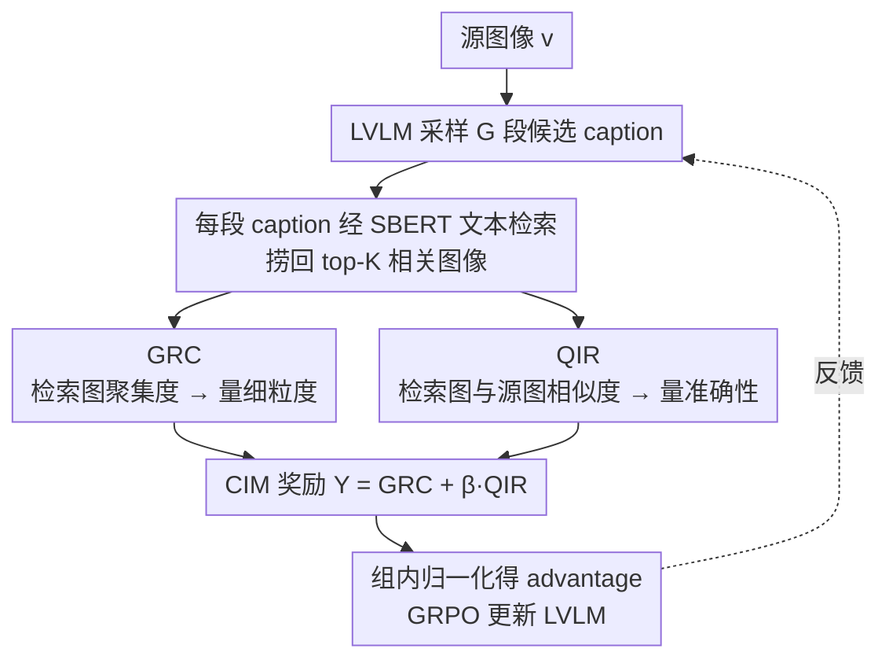

# Cross-modal Identity Mapping: Minimizing Information Loss in Modality Conversion via Reinforcement Learning

**会议**: CVPR 2026  
**arXiv**: [2603.01696](https://arxiv.org/abs/2603.01696)  
**代码**: 待发布（论文接收后公开）  
**领域**: 强化学习  
**关键词**: 图像描述, 跨模态信息损失, 检索奖励, 强化学习, GRPO

## 一句话总结
提出 Cross-modal Identity Mapping (CIM)，通过分析用 caption 检索到的图像的表示一致性（GRC）和与源图像的相关性（QIR）来量化图像描述中的信息损失，将其作为 RL 奖励信号训练 LVLM 生成细粒度且精确的描述，无需额外标注。

## 研究背景与动机
LVLM 在图像描述任务中常常遗漏或错误表示关键视觉内容。作者通过在 Oxford-IIIT Pet 数据集上的细粒度分类实验验证了这一点：多个 LVLM（如 Qwen3-VL-8B、InternVL3-8B）的物种分类准确率接近 100%，但品种分类准确率仅有 15%~40%，说明模型倾向于描述粗粒度概念而忽略细节信息，存在严重的跨模态信息损失。

现有改进方法分为两类：(1) 构建细粒度标注数据做 SFT，但标注成本高昂；(2) 用基于 VLM 的度量作为 RL 奖励，但因 VLM 自身的组合推理能力有限，容易出现 reward hacking。核心矛盾在于：如何在不依赖额外标注的情况下准确量化图像描述中的信息损失？

作者提出一个关键洞察：**caption 越细粒度，用它检索到的图像越一致；caption 越准确，检索到的图像与源图像越相似**。基于此，通过分析检索结果的分布来推断 caption 的信息损失。

## 方法详解

### 整体框架
CIM 要解决的是「怎么在没有细粒度标注的情况下，判断一段 caption 丢了多少视觉信息」。它的巧思是把这个跨模态评估问题转译成一个图像检索问题：让 LVLM 给同一张图采样出 $G$ 段候选 caption，把每段 caption 当查询去文本检索库里捞回 top-K 张相关图像，然后只看「捞回来的这堆图长得像不像、跟原图像不像」就能反推 caption 的好坏——caption 越细，捞回的图越聚成一簇；caption 越准，捞回的图越贴近源图。捞图后兵分两路：一路用 **GRC** 量「细不细」，一路用 **QIR** 量「准不准」，两路再合成单一奖励 $\Upsilon$ 经组内归一化喂给 **GRPO** 反向更新 LVLM。整条 pipeline 因此不碰任何人工标注。

### 关键设计

**1. Gallery Representation Consistency（GRC）：用检索结果的聚集程度量化 caption 的细粒度**

信息损失里最难抓的一类是「漏细节」——模型只说"a pet"而不说品种，光看文本根本判不出丢了多少。CIM 的做法是把这段 caption 检索回来的 K 张图各自过视觉表示模型、$\ell_2$ 归一化成单位向量，再取它们的平均向量长度：

$$GRC(c) = \Big\|\frac{1}{K}\sum_{r=1}^{K}\tilde{v}(x_{i_r})\Big\|_2$$

这其实就是方向统计里的 mean resultant length，衡量一组单位向量在超球面上有多集中：当 caption 足够具体（比如点出了品种、花纹、姿态），检索回的图会高度同质，向量们指向相近、平均向量接近 1；caption 一旦模糊粗粒度，检索结果五花八门，向量相互抵消、GRC 趋近 0。于是「细不细」被定量成了一个 0~1 的聚集度，完全不需要知道正确答案是什么。

**2. Query-gallery Image Relevance（QIR）：用检索图与源图的相似度量化 caption 的准确性**

光有 GRC 还不够——一段编造得很具体但描述错误的 caption 也能让检索结果很聚集（聚到错的地方去了）。QIR 补上「准不准」这一维：把源图 $v$ 和它检索回的每张图算余弦相似度，并按检索排名做指数衰减加权后求和：

$$QIR(v, c) = \sum_{r=1}^{K}\lambda(r)\cdot Cos\big(\tilde{v}(v), \tilde{v}(x_{i_r})\big),\qquad \lambda(r) = \frac{1}{2^{r-1}}$$

如果 caption 如实描述了源图，检索回的图自然跟源图语义贴近、QIR 高；一旦 caption 掺了错误信息，检索就会被带偏到别的图上、QIR 掉下来。权重 $\lambda(r)=1/2^{r-1}$ 让排名靠前、可信度更高的检索结果主导这个分数，越往后的命中影响越小。

**3. CIM 奖励与 GRPO 优化：把两维信号合成一个无标注奖励**

GRC 管细节、QIR 管准确，二者线性组合成最终奖励，用 $\beta$ 调两者权重：

$$\Upsilon(v, c) = GRC(c) + \beta\cdot QIR(v, c)$$

对同一张图采样出的 $G$ 段 caption 各算一个 $\Upsilon$，再做组内归一化得到 advantage $A_z = \dfrac{\Upsilon_z - \mathrm{mean}(\{\Upsilon\})}{\mathrm{std}(\{\Upsilon\})}$，喂进 GRPO 更新 LVLM。这样模型被推着同时往「更细」和「更准」两个方向走。整个奖励的关键就在于：caption 质量评估被彻底换成了图像-图像相似度的计算，既绕开了直接度量跨模态信息损失的难题，也避开了用 VLM 当裁判时常见的 reward hacking。

### 损失函数 / 训练策略
使用 VERL 框架做 GRPO 训练，训练数据为 RefinedCaps（6.5K 图像），每图采样 5 段 caption。文本检索用 SBERT（MPNet-base），图像编码用 OpenCLIP ViT-H/14，检索库由 RefinedCaps + DenseFusion-1M 扩增以提供更可靠的检索信号。学习率 $1\times 10^{-6}$，训练 2 个 epoch。

## 实验关键数据

### 主实验

| 模型 | 数据集 | CAPTURE | Relation QA | 提升 |
|------|--------|---------|-------------|------|
| Qwen2.5-VL-7B + CIM | COCO-LN500 | 48.93 | 44.15 | Relation Recall +20.2, QA +20.4 |
| Qwen2-VL-7B + CIM | COCO-LN500 | 48.64 | 38.71 | Relation Recall +10.4, QA +18.2 |
| LLaVA1.5-7B + CIM | COCO-LN500 | 48.62 | 24.98 | Relation Recall +12.6, QA +10.6 |
| InternVL3-8B + CIM | COCO-LN500 | 48.90 | 38.67 | Relation Recall +10.0, QA +12.2 |

### 消融实验

| 配置 | CAPTURE | 说明 |
|------|---------|------|
| GRC only | 有提升但有限 | 仅鼓励细节丰富度 |
| QIR only | 有提升但有限 | 仅约束准确性 |
| GRC + QIR | 最佳 | 两者互补 |
| 不同检索库规模 | 越大越好 | 更大 gallery 提供更可靠的检索信号 |

### 关键发现
- CIM 在 COCO-LN500 上对 Qwen2.5-VL-7B 的关系推理（Relation Recall）提升高达 20.2%，关系QA 提升 20.4%——这是一个非常显著的提升
- CIM 在多个不同架构（LLaVA、Qwen-VL、InternVL）和不同版本上均有效，证明方法的通用性
- Pearson 相关分析验证了 GRC/QIR 与实际 caption 质量（品种分类准确率的 logit）之间的正相关性

## 亮点与洞察
- 将跨模态信息损失量化问题巧妙转化为图像检索后的图像-图像相似度问题，完全无需额外标注
- GRC 和 QIR 的设计直觉清晰：一个管"detail"，一个管"accuracy"，与人对 caption 质量的直觉一致
- 在 Relation 维度的巨大提升说明现有 LVLM 在关系推理方面的信息损失最为严重，也最容易通过 RL 改善

## 局限与展望
- 检索库的构成和规模直接影响奖励信号的质量，对检索模型的选择敏感
- 训练仅用 6.5K 图像，虽然效率高但可能限制了上限
- GRC 和 QIR 的计算需要额外的检索步骤，增加了训练开销
- 指数衰减权重 $\lambda(r)$ 的设计缺乏理论依据

## 相关工作与启发
- 与 CapRL 类似使用 RL 优化 captioning，但奖励信号来源不同：CapRL 用 VQA，CIM 用检索一致性
- 自检索奖励（self-retrieval reward）的思路在先前工作中有探索，CIM 进一步将其分解为细粒度（GRC）和准确性（QIR）两个维度
- 将生成质量评估转化为检索质量评估的思路，有望推广到其他跨模态生成任务
- 与 cycle-consistency 方法（从 caption 重建图像）相比，CIM 避免了训练图像生成器的高开销
- SC-Captioner 的关键词检查方式过于粗粒度，CIM 通过检索分布提供连续且全面的质量信号

## 补充细节
- GRC 的 mean resultant length 本质上衡量单位超球面上向量集合的集中度，值越大说明向量越一致
- QIR 的指数衰减 $\lambda(r) = 1/2^{r-1}$ 使得 top-1 检索结果贡献最大，符合检索排序的可信度递减趋势
- 在 SFT 模型上应用 CIM 也能获得进一步提升，说明方法与 SFT 互补
- 实验在 LLaVA-1.5-7B 到 InternVL3-8B 等 6 种模型上均验证有效
- 检索库扩大（加入 DenseFusion-1M）后性能进一步提升，说明检索信号的可靠性与库规模正相关

## 评分
- 新颖性: ⭐⭐⭐⭐ 检索一致性作为 caption 质量代理的洞察新颖，GRC/QIR 设计巧妙
- 实验充分度: ⭐⭐⭐⭐ 多模型验证充分，有 Pearson 相关验证，但消融可以更细致
- 写作质量: ⭐⭐⭐⭐ 逻辑清晰，验证实验设计巧妙，图表质量高
- 价值: ⭐⭐⭐⭐ 无标注 RL 优化方案实用性强，关系推理提升显著

## 关键术语
- **Mean Resultant Length**: 超球面上的向量一致性度量
- **Identity Mapping**: 将图像到 caption 的转换视为恋恒映射，最小化信息损失
- **SBERT/OpenCLIP**: 分别用于文本检索和图像 embedding 提取

<!-- RELATED:START -->

## 相关论文

- [\[ICCV 2025\] R1-Onevision: Advancing Generalized Multimodal Reasoning through Cross-Modal Formalization](../../ICCV2025/reinforcement_learning/r1-onevision_advancing_generalized_multimodal_reasoning_through_cross-modal_form.md)
- [\[ICLR 2026\] cadrille: Multi-modal CAD Reconstruction with Reinforcement Learning](../../ICLR2026/reinforcement_learning/cadrille_multi-modal_cad_reconstruction_with_reinforcement_learning.md)
- [\[CVPR 2026\] EVA: Efficient Reinforcement Learning for End-to-End Video Agent](eva_efficient_reinforcement_learning_for_end-to-end_video_agent.md)
- [\[CVPR 2026\] Reading or Reasoning? Format Decoupled Reinforcement Learning for Document OCR](reading_or_reasoning_format_decoupled_reinforcement_learning_for_document_ocr.md)
- [\[ICML 2026\] SPHERE: Mitigating the Loss of Spectral Plasticity in Mixture-of-Experts for Deep Reinforcement Learning](../../ICML2026/reinforcement_learning/sphere_mitigating_the_loss_of_spectral_plasticity_in_mixture-of-experts_for_deep.md)

<!-- RELATED:END -->
