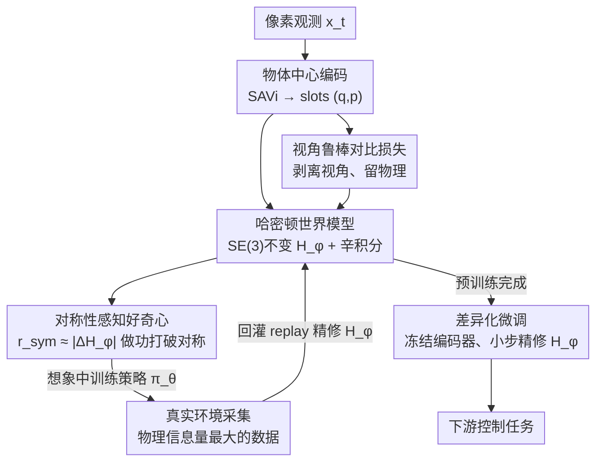

# DreamSAC: Learning Hamiltonian World Models via Symmetry Exploration

**会议**: CVPR 2026  
**论文**: [CVF Open Access](https://openaccess.thecvf.com/content/CVPR2026/html/Tang_DreamSAC_Learning_Hamiltonian_World_Models_via_Symmetry_Exploration_CVPR_2026_paper.html)  
**代码**: 无  
**领域**: 强化学习 / 世界模型  
**关键词**: 世界模型, 哈密顿动力学, 内在好奇心, 对称性探索, 外推泛化

## 一句话总结
DreamSAC 给基于像素的世界模型（DreamerV3）换上一个 SE(3) 不变的哈密顿动力学先验，并用一个"主动做功打破对称性"的内在好奇心去采集物理信息量最大的数据，让模型不再只学像素统计相关性、而是学到守恒律，从而在质量/重力/摩擦力等未见物理参数上的外推泛化比 SOTA 高 22%–163%。

## 研究背景与动机
**领域现状**：以 Dreamer 系列为代表的世界模型已能从高维像素学到环境的预测表征，在"熟悉物体+熟悉动力学的新组合"上做插值泛化（interpolative generalization）很强——它本质是在抓取观测像素序列里的非参数统计模式。

**现有痛点**：一旦面对训练分布外的物理参数（如未见过的质量比碰撞、新接触动力学、1.5 倍重力、2 倍摩擦），这类模型的预测会急剧崩坏。原因是它们只学到了像素级动力学的**统计相关性**，成了"描述系统"，对力、动量、能量守恒这些底层概念毫无内在理解。

**核心矛盾**：作者认为鲁棒外推的关键，是把学习目标从"建模像素统计"换成"发现环境的物理不变量"——即由底层对称性导出的守恒律。但要把哈密顿/拉格朗日这类物理结构嵌进端到端、从像素学习的在线智能体里有两大障碍：(1) 物理结构模型（HNN/LNN）以往只在低维状态输入或离线设定下成功，难以接像素；(2) 哈密顿要求一个视角无关的物理状态，而像素观测天生视角相关，二者目标直接冲突。还有一个更隐蔽的矛盾：要学"对称性=守恒（$\Delta H\approx 0$）"，被动观察系统自演化是学不到的，因为此时哈密顿本来就守恒、没有任何信息。

**本文目标**：让一个从像素学习的在线 MBRL 智能体，既能把视角无关的物理规律从视角相关的观测中分离出来，又能主动采集到"最能暴露自己物理理解错误"的数据。

**切入角度**：从受控哈密顿系统的物理直觉出发——智能体必须主动施加外力对系统**做功**去打破表观守恒，才能探测出哈密顿的结构（势垒、刚度等）。做功量恰好等于内部哈密顿的变化 $|\Delta H_\phi|$，于是"挑战自己的守恒律理解"这件事可以直接量化成一个内在奖励。

**核心 idea**：用"哈密顿世界模型 + 对称性感知好奇心"替代"黑盒动力学预测器 + 统计新颖性好奇心"——前者把物理不变性写进模型结构（Lie Transformer 强制 SE(3) 不变 + 对比学习剥离视角），后者奖励智能体去做功打破对称性，从而主动采集物理信息量最大的数据来精修哈密顿。

## 方法详解

### 整体框架
DreamSAC 整体基于 DreamerV3，但把两处换成物理驱动的版本，整个学习分两阶段：先用对称性探索做**无监督预训练**学物理化的世界模型，再用外在奖励做**下游任务微调**。

世界模型这一侧：观测 $x_t$ 经 SAVi 物体中心编码器映射成 $N$ 个 object slots $Z_t=\{z_t^i\}$，每个 slot 被**结构化**成广义坐标与正则动量 $z_t^i=(q_t^i,p_t^i)$；动力学是双轨的——随机状态 $Z_{t+1}$ 由积分一个 $G$-不变的内部哈密顿 $H_\phi$ 得到，确定性状态 $h_{t+1}$ 由 GRU 更新；一个视角鲁棒对比损失把视角因素从 $Z_t$ 里剥掉，保证 $Z_t$ 满足哈密顿的不变性要求。

探索这一侧：一个策略 $\pi_\theta$ **完全在想象（imagination）中训练**，去最大化对称性感知好奇心奖励 $r_{sym}$，目标是"做功打破对称性"；想象里学到的策略再拿到真实环境执行，采集"挑战世界模型"的数据回来精修 $H_\phi$。两侧交替迭代，把 $H_\phi$ 逐步逼近环境真实的物理不变律。

### 关键设计

**1. 哈密顿世界模型：把守恒律写进动力学先验，而不是让黑盒去猜**

针对"标准 RSSM 的动力学预测器是纠缠的黑盒、是外推失败的主因"这一痛点，DreamSAC 把 RSSM 的动力学先验 $p_\phi(Z_{t+1}\mid Z_t,a_t)$ 换成受控哈密顿过程。系统被建模成受控哈密顿系统，内部动力学由内部哈密顿 $H_\phi(z)$ 支配、外部动作 $a_t$ 经一个学到的输入矩阵 $g(q)$ 施加外力：

$$\frac{dq}{dt}=\frac{\partial H_\phi(z)}{\partial p},\qquad \frac{dp}{dt}=-\frac{\partial H_\phi(z)}{\partial q}+g(q)a_t$$

推理时用**辛积分器**（symplectic integrator）求解以保证长期守恒（训练/推理用不同积分策略以平衡梯度稳定性与守恒性）。关键约束是让内部哈密顿对相关 3D 物理对称群 $G$（如 SE(3)）变换 $g$ 保持不变：$H_\phi(g\cdot Z_t)=H_\phi(Z_t),\ \forall g\in G$，并用 **Lie Transformer** 这种构造上就满足该性质的 $G$-不变架构来实现 $H_\phi$。积分器确定地给出下一状态均值 $\mu_{t+1}^i$，先验建成可学共享对角协方差的因子化高斯 $p_\phi=\prod_i \mathcal{N}(z_{t+1}^i;\mu_{t+1}^i,\Sigma_\phi)$。这样把"物理不变性"作为硬结构嵌进先验，外推时只需调隐含物理参数、不破坏已学的对称性，区别于 Dreamer 那种完全无物理接地的预测器。

**2. 视角鲁棒对比损失：化解"重建要视角 / 哈密顿要视角无关"的核心冲突**

重建损失 $\mathcal{L}_{pred}$ 会逼 $Z_t$ 去编码相机参数才能重建出 $x_t$，而 $G$-不变哈密顿先验又要求 $Z_t$ 对这些参数不变——只靠 ELBO 里 KL 项的隐式压力不够。作者引入一个基于自监督对比学习的视角鲁棒损失 $\mathcal{L}_{vr}$，**不需要同步多视角数据**：对 replay buffer 里单张观测 $x_t$ 施加强视角增广 $\tau$（随机透视变换、相机抖动）生成两个视图 $x_t^A,x_t^B$，编码成 $Z_t^A,Z_t^B$ 构成正对，batch 内其余 $K-1$ 个作负对，用 InfoNCE 拉近正对、推远负对：

$$\mathcal{L}_{vr}(\phi)=-\mathbb{E}\!\left[\log\frac{\exp(\mathrm{sim}(Z_t^A,Z_t^B)/\tau)}{\sum_{j=1}^{K}\exp(\mathrm{sim}(Z_t^A,Z_j^B)/\tau)}\right]$$

这显式训练编码器把视角变化因子化掉，给出"洁净的"视角鲁棒状态 $Z_t$，刚好满足 $G$-不变哈密顿的输入要求。注意作者只用 2D 增广作为 3D 视角变化的实用代理，并不要求编码器对任意 2D 变换等变（那些往往没有 3D 物理意义）。

**3. 对称性感知好奇心：奖励"做功打破对称"，比统计新颖性更会采物理数据**

针对"被动观察学不到守恒、且 RND/ICM 这类统计新颖性好奇心会被 noisy-TV 干扰"的痛点，作者把内在奖励定义成智能体动作对系统做的功 $W_C$，由式(1)它正等于内部哈密顿的变化：

$$r_{sym,t+1}=\underbrace{|H_\phi(Z_{t+1})-H_\phi(Z_t)|}_{\text{对称性探测}}-\underbrace{\lambda_s\lVert a_t-a_{t-1}\rVert^2}_{\text{动作平滑}}$$

最大化 $r_{sym}$ 等于鼓励智能体去找"需要显著做功"的交互，这类交互最能暴露 $H_\phi$ 对刚度、势垒等结构性质的理解错误，从而生成信息量最大的数据。这解决了"学对称性"的悖论：对称意味着守恒（$\Delta H\approx 0$），但智能体只有主动挑战系统惯性才学得到这个不变性。策略 $\pi_\theta$ 按 Dreamer 方式完全在想象轨迹上训练。

**4. 退火好奇心 + 想象训练：稳住 $H_\phi$ 未成熟时的联合优化**

当 $H_\phi$ 还没训好时 $r_{sym}$ 又噪又非平稳，直接用会导致采的数据很差。作者把内在奖励从稳定的新颖性奖励**退火**到物理奖励：初期用 RND（对固定随机目标网络的预测误差）提供宽而稳的新颖性信号，随训练把权重 $w_t$ 从 0 线性退火到 1：

$$r_{int,t+1}=(1-w_t)\cdot r_{RND,t+1}+w_t\cdot r_{sym,t+1}$$

同时 $r_{sym}$ 用 EMA 目标哈密顿 $H_{target}$ 计算以进一步降噪。这套混合退火奖励先用多样数据稳住先验 $p_\phi$，再把探索从"找新颖"切到"探对称"，把联合优化引导到稳定收敛。世界模型总目标是带 $\mathcal{L}_{vr}$ 的改版 ELBO：$\mathcal{L}_{total}=\sum_t[\mathcal{L}_{pred}+\beta_{dyn}\mathcal{L}_{dyn}+\beta_{rep}\mathcal{L}_{rep}+\gamma\mathcal{L}_{vr}]$，其中 $\mathcal{L}_{dyn}/\mathcal{L}_{rep}$ 是 $\mathrm{KL}(q_\phi\Vert p_\phi)$ 拆开的动力学/表征项（分别训先验去预测后验、训编码器变得可被先验预测）。

### 损失函数 / 训练策略
- **预训练**：2M 环境步，纯无监督，最大化退火内在奖励 + ELBO（式5）。
- **下游差异化微调**：约 500K 步。丢弃并重置内在策略/评论家；**冻结视角鲁棒编码器** $q_\phi$（视觉属性没变）；只对哈密顿世界模型 $(H_\phi,g)$ 用小学习率微调——作者假设 $H_\phi$ 的不变架构充当强正则，把优化约束到只更新隐含物理参数（质量、摩擦）而不破坏已学对称性，从而做到快速系统辨识。
- **零样本评估**：冻结整个世界模型（含 $H_\phi$），只在固定的预训练想象里学一个新任务策略，测纯靠预训练物理理解的泛化能力。

## 实验关键数据

环境：DeepMind Control Suite（DMCS）与 GymFetch 的 3D 物理基准。指标：图像重建 MSE（在 1M 步、各模型预测损失收敛后测）与最终任务奖励/成功率。Baseline 均建在 SOTA 世界模型 DreamerV3 + SOTA 探索 RND 之上；DreamSAC+Random 是去掉对称性探索、换随机策略的消融。

### 主实验：世界模型预测精度（MSE，越低越好，节选 H=16）

| 环境 (H=16) | DreamerV3+Policy | DreamerV3+RND | DreamSAC (Ours) |
|--------|------|------|------|
| Cheetah | 0.798 | 0.636 | 0.405 |
| Acrobot | 0.772 | 0.211 | 0.206 |
| Hopper | 1.036 | 1.064 | 0.315 |
| Walker | 4.377 | 2.898 | 1.004 |
| FetchPush | 2.030 | 1.708 | 0.645 |
| FetchReach | 1.492 | 0.682 | 0.386 |

Acrobot(H=16) 上 DreamSAC 的 0.206 相对 DreamerV3+Policy 的 3.639 是 10 倍以上提升；FetchPush(H=8) 的 0.302 也只有 DreamSAC+Random(0.675) 的不到一半、远好于 DreamerV3+RND(0.976)，说明对称性探索确实采到了更有物理信息量的数据。

### OOD 外推泛化（FetchReach 为成功率，其余为平均奖励，节选）

| 任务 | DreamerV3+Policy | DreamerV3+RND | DreamSAC 0-shot | DreamSAC (Ours) |
|------|------|------|------|------|
| Reacher-hard / Unseen View | 265.3 | 314.0 | 149.6 | **321.9** |
| FetchReach / Unseen Goal | 919.7 | 927.4 | 934.2 | **967.6** |
| Walker-walk / Unseen Object | 0.65 | 0.70 | — | **0.80** |
| Cheetah-run / Unseen Goal | 0.76 | 0.72 | — | **0.91** |
| Walker / Unseen Gravity (1.5×) | 189.8 | 167.5 | 124.8 | **499.9** |
| Cheetah / Unseen Friction (2×) | 118.8 | 97.4 | 27.5 | **120.2** |

参数化 OOD（重力/摩擦/物性漂移）增益最大，例如 Walker Unseen Gravity 从 ~190 跳到 ~500，印证差异化微调能在哈密顿参数上做快速系统辨识。零样本版本（冻结整个世界模型）已能超过部分 DreamerV3 微调结果。

### 消融实验（表4，Reacher 为奖励、其余为 MSE）

| 配置 | Reacher Unseen View↑ | Walker 1.5×Gravity↓ | Avg. OOD MSE↓ | 说明 |
|------|------|------|------|------|
| Full | **321.9** | **1.004** | **0.705** | 完整模型 |
| w/o $\mathcal{L}_{vr}$ | 212.4 | 1.068 | 0.793 | 去视角对比损失，Unseen View 大掉 |
| w/o $H_\phi$ | 159.6 | 4.967 | 2.899 | Lie Transformer 换 MLP，重力外推崩坏 |
| w/o SAVi | 279.7 | 1.188 | 0.903 | 去物体中心编码，参数泛化变差 |

### 关键发现
- **哈密顿先验 $H_\phi$ 贡献最大**：换成普通 MLP 后 Walker 1.5× 重力 MSE 从 1.004 飙到 4.967、平均 OOD MSE 翻 4 倍，证明 $G$-不变架构是参数外推的关键。
- **$\mathcal{L}_{vr}$ 专管视角**：去掉后正好在 Unseen View 任务上掉最多（321.9→212.4），与"它负责剥离视角"的定位精准对应；t-SNE 显示有它时不同相机视角聚成紧簇、没它则散开。
- **物理可解释证据**：零动作 rollout 时学到的 $H_\phi$ 近乎恒定，说明模型真的学到了能量守恒这一物理不变量；ID 物性下预训练/微调表征混在一起、OOD 物性下则清晰分离，说明隐状态 $(q,p)$ 有物理意识。

## 亮点与洞察
- **把"好奇心"从统计新颖性重定义为物理做功**：$r_{sym}\approx|\Delta H_\phi|$ 用模型自己当下（还不完美）的哈密顿当奖励信号，天然避开 noisy-TV，而且越是采到暴露自身物理错误的数据越能精修自己——一个很优雅的自举闭环。
- **"想象中训练探索策略、真实环境执行采数据"**的解耦，让昂贵的真实交互只花在最有信息量的动作上，可迁移到任何 Dreamer 式 MBRL 的主动数据采集。
- **退火 RND→物理奖励**是个实用的稳定化技巧：物理化奖励在模型未成熟时不可靠，先借统计新颖性把先验稳住再切换，可推广到任何"奖励依赖于尚未训好的内部量"的自监督探索。
- **差异化微调把不变架构当正则**：冻结编码器、小步只调 $H_\phi$，把适应新任务收窄成"系统辨识隐含物理参数"，是结构化先验带来快速适应的具体落地。

## 局限与展望
- **依赖辛积分与对称群先验**：方法假设环境可被受控哈密顿系统刻画、且相关对称群（SE(3)）已知，对强耗散、强接触不连续或非保守主导的系统是否成立存疑 ⚠️（论文主要在 DMCS/GymFetch 这类相对规整的物理仿真上验证）。
- **canonical 坐标无形式保证**：作者自己承认把 slot 拆成 $(q,p)$ 并无 ELBO 层面的正式保证对应真正的正则坐标，只是"功能性解耦"的假设。
- **只在仿真验证**：22%–163% 的增益都来自 3D 物理仿真，未见真实机器人/真实像素的结果，sim-to-real 是开放问题。
- **大量实现细节在 Supp.**：积分策略、增广集、退火超参等关键工程在正文被略过（多处 Supp. ?? 占位），复现门槛偏高。

## 相关工作与启发
- **vs DreamerV3**：同是从像素学的 MBRL 主干，DreamerV3 用黑盒 RSSM 预测器、缺物理接地，外推就崩；DreamSAC 把动力学先验换成 SE(3) 不变哈密顿 + 辛积分，把守恒律写进结构，故在未见物理参数上大幅领先（多任务 22%–163%）。
- **vs HNN / LNN / SymODEN 等物理结构模型**：这些把哈密顿/拉格朗日先验做得很纯，但以往只在低维状态或离线被动轨迹上成功；DreamSAC 的差异是端到端从像素学、且是**在线主动**采数据（对称性探索），不靠被动观测的自演化轨迹。
- **vs RND / ICM 等新颖性好奇心**：它们奖励统计新颖/不可预测状态，易被随机元素（noisy-TV）带偏；DreamSAC 的对称性感知好奇心奖励"对守恒律的挑战"，目标直指物理信息量而非视觉新颖。
- **vs SimCLR 式对比学习**：借用 InfoNCE + 视角增广构建不变性，但把它专门用来调和"重建需视角 vs 哈密顿需视角无关"的冲突，作为 ELBO 之外的显式自监督信号。

## 评分
- 新颖性: ⭐⭐⭐⭐⭐ 把哈密顿世界模型 + 物理做功好奇心 + 对比视角剥离三者首次端到端缝进像素 MBRL，切入角度（主动做功打破对称才能学守恒）很扎实。
- 实验充分度: ⭐⭐⭐⭐ DMCS/GymFetch 多任务、结构+参数双类 OOD、消融与可视化都到位，但全是仿真、且大量细节在附录。
- 写作质量: ⭐⭐⭐⭐ 动机—机制—证据链条清晰，公式给得清；扣分在正文多处 Supp. ?? 占位、关键实现需翻附录。
- 价值: ⭐⭐⭐⭐ 为"物理接地的可外推世界模型"提供了一条可操作路线，主动数据采集与退火好奇心的思路可迁移到广义 MBRL。

<!-- RELATED:START -->

## 相关论文

- [\[CVPR 2026\] GeoWorld: Geometric World Models](geoworld_geometric_world_models.md)
- [\[NeurIPS 2025\] Foundation Models as World Models: A Foundational Study in Text-Based GridWorlds](../../NeurIPS2025/reinforcement_learning/foundation_models_as_world_models_a_foundational_study_in_text-based_gridworlds.md)
- [\[AAAI 2026\] Object-Centric World Models for Causality-Aware Reinforcement Learning](../../AAAI2026/reinforcement_learning/object-centric_world_models_for_causality-aware_reinforcement_learning.md)
- [\[ICML 2026\] Flow-Equivariant World Models: Memory for Partially Observed Dynamic Environments](../../ICML2026/reinforcement_learning/flow_equivariant_world_models_memory_for_partially_observed_dynamic_environments.md)
- [\[ICLR 2026\] Deep SPI: Safe Policy Improvement via World Models](../../ICLR2026/reinforcement_learning/deep_spi_safe_policy_improvement_via_world_models.md)

<!-- RELATED:END -->
