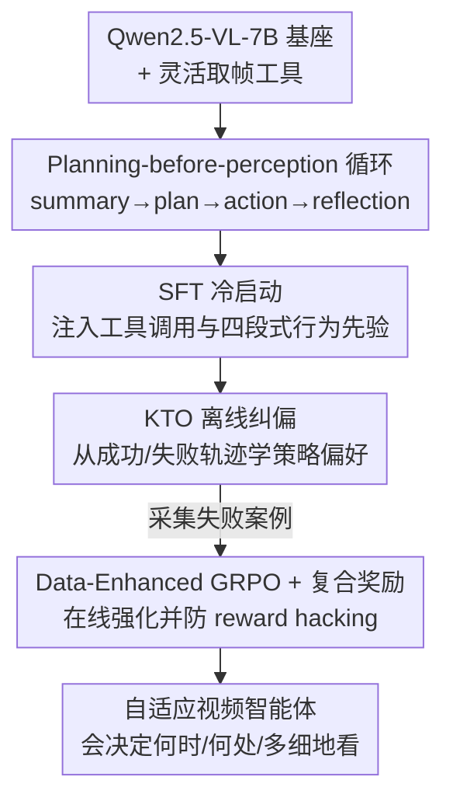

# EVA: Efficient Reinforcement Learning for End-to-End Video Agent

**会议**: CVPR 2026  
**论文**: [CVF Open Access](https://openaccess.thecvf.com/content/CVPR2026/html/Zhang_EVA_Efficient_Reinforcement_Learning_for_End-to-End_Video_Agent_CVPR_2026_paper.html)  
**代码**: 有（论文首页 "Our Code and model are at this link"，SenseTime Research）  
**领域**: 强化学习 / 视频理解 / 多模态VLM  
**关键词**: 视频智能体, 强化学习, GRPO, KTO, planning-before-perception  

## 一句话总结
EVA 把长视频理解建模成一个"先规划、后感知"的马尔可夫决策过程，让 MLLM 智能体仅凭文本问题就决定"看哪段、看几帧、看多清"，再用 SFT 冷启动 → KTO 离线纠偏 → 数据增强 GRPO 的三段式训练把它从"格式模仿者"练成"会主动探索的看视频高手"，在 6 个视频基准上以约 1/10 的视觉 token 取得比通用 MLLM 高 6–12%、比已有自适应智能体高 1–3% 的精度。

## 研究背景与动机
**领域现状**：用多模态大模型（MLLM）做视频理解，主流做法是把整段视频或均匀采样的若干帧一股脑喂进去，让模型当"被动识别器"一次性出答案。长视频动辄上千秒、token 序列极长，里面又充斥时间冗余帧。

**现有痛点**：被动喂帧有两个死穴——均匀采样要么塞了一堆冗余帧、撑爆上下文，要么恰好漏掉关键帧、证据不足；更糟的是把整段视频先摆在面前，会用噪声视觉线索"锚定"住规划，把模型带偏。近期的"智能体"方法（引入选帧工具）算是往前走了一步，但仍是**手工设计的固定工作流**：采样率固定、动作维度单一（只能调时间区间，不能调帧数和分辨率），而且通常还是**先喂一批均匀采样帧再开始推理**，本质仍是"感知优先"，在长视频上既冗余又低效。

**核心矛盾**：感知效率和推理深度之间存在张力——看得越全越准但越贵，看得越省越快但越容易漏。已有方法把 MLLM 当成"工作流里的固定零件"，沿单一控制维度产出预定参数，从没把"决定怎么看"的自主权真正交给智能体。

**本文目标**：训练一个端到端自主视频智能体，让它能根据问题和已获得的视觉证据，自己决定**看哪段（when）、看哪里（what）、看多细（how）**，并知道证据够了就停手作答。

**切入角度**：作者提出 **planning-before-perception（先规划后感知）** 范式——智能体在接触任何视觉输入之前，先只凭文本问题推理出第一步该怎么取帧，再把"总结–规划–动作–反思"组成迭代循环，逐轮精化感知。

**核心 idea**：把视频理解写成一个 MDP，配一个能同时控制时间窗口、帧数、空间分辨率的灵活取帧工具，再用"SFT 冷启动 + KTO 纠偏 + GRPO 在线强化"三段式把这套迭代推理策略真正训出来。

## 方法详解

### 整体框架
EVA 的核心是把"看视频回答问题"当成一个智能体在 MDP 里的序贯决策过程，再用一条三阶段训练流水线把策略练出来。

形式化上，每个时刻 $t$ 智能体观察到信念状态 $s_t=\{q, h_t, F_t\}$，其中 $q$ 是用户问题、$h_t$ 是图文交错的历史、$F_t$ 是迄今工具调用取回的帧证据；策略 $\pi_\theta(a_t\mid s_t)$ 输出下一步动作。关键设定是**初始状态 $s_0$ 只给问题、不给任何帧**——逼模型先规划再感知。动作就是调用一个灵活取帧工具，参数有四个：`start_time`、`end_time`（时间窗口）、`nframes`（窗口内采几帧）、`resize`（空间下采样比例，实现 zoom-in/zoom-out）。多取帧能抓清动态动作，高分辨率能抠出细节，于是智能体每一轮都在"时间×空间"的大动作空间里学怎么分配视觉 token。传统智能体方法只是这个框架的受限特例（固定工作流、只能调时间）。

每一轮智能体按 **Summary → Planning → Action → Reflection** 走：先总结已取回帧的内容、再规划列出几个候选动作并估计代价与收益、然后发出工具调用、最后反思现有视觉证据是否足够——不够就继续取帧，够了才作答。

训练侧是三段流水线，自下而上把能力一层层叠上去：

### 关键设计

**1. Planning-before-perception：把视频理解建成"先规划后感知"的 MDP + 灵活取帧工具**

这一设计直击"感知优先"的两个痛点：均匀采样要么冗余撑爆上下文、要么漏掉关键帧，而把整段视频先摆出来还会用噪声线索锚定规划。EVA 的做法是把初始状态 $s_0$ 设成"只有问题 $q$、零视觉输入"，强制智能体先从文字推理出第一步该取哪段帧，再进入 $s_t=\{q,h_t,F_t\}$ 的迭代。配套的取帧工具把动作空间从"只能选时间区间"扩成"时间窗口 + 帧数 + 分辨率"三维联合控制——比如先用低分辨率高帧率把 6600 秒的长视频整体扫一眼（省 token 拿全局），定位到关键区间后再以高帧率高分辨率精取那一小段（抠细节出正确答案）。和把 MLLM 当固定零件、沿单维出预定参数的旧智能体相比，EVA 真正把"怎么看"的自主权还给了模型，旧方法只是它的受限特例。

**2. SFT 冷启动：用 Summary–Plan–Action–Reflection 数据注入行为先验**

直接上强化学习，模型连工具调用格式和图文交错推理都不会，探索会很不稳。冷启动阶段用 Qwen2.5-VL-72B 当教师 MLLM，在 llava-video（短视频）和 cgbench（长视频）的 QA 对上，按 EVA 的问题设定生成高质量轨迹，并用三类提示词增强多样性：教师自总结的"过往成功经验"、指导高效规划选帧的"多样工作流提示"、鼓励谨慎权衡的"反思提示"。每条数据严格按四段式组织：Summary 让模型逐帧详细描述内容、把注意力压到取回的视觉证据上并理解工具参数与输出；Planning 训练在超大动作空间里提候选动作并估代价收益；Action 产出规范工具调用；Reflection 专门构造"证据不足"的数据，教模型在作答前先判断视觉信息够不够、不够就继续取帧。这一阶段给后续更激进的优化提供了稳定的行为先验（EVA-SFT 共 1 万条）。

**3. KTO 离线纠偏：从成功/失败轨迹里学细粒度策略偏好**

SFT 学会了格式和推理模式，却还选不好策略——典型翻车是"证据不足就硬猜""在短窗口里塞太多帧""在长窗口里采太少帧"。作者用 Kahneman–Tversky Optimization 在 GRPO 之前先纠这些已知坏案例。选 KTO 而非 DPO，是因为 DPO 要成对偏好数据、会强制共享对话轮次，这和多轮交互设定冲突、可能截断策略；KTO 只需单样本"chosen/rejected"标签，还能从外部采集的经验里学（而非自博弈），更稳更省样本。数据上用 LLM-as-Judge 把"明明视觉 token 不够却仍作答=猜"的轨迹标为 rejected，再重采高质量成功轨迹当 chosen（EVA-KTO 1.1 万条，按推荐比例 63% 正确 / 37% 错误，$\beta=0.1$）。在线 GRPO 之前先把这些已知失败模式纠掉，能显著改善收敛性、鲁棒性和稳定性。

**4. Data-Enhanced GRPO + 复合奖励：在线强化并防止 reward hacking**

常规 GRPO 在固定数据集上只迭代几个 epoch，对视频智能体尤其受限——模型只能从一小撮失败的"问题–视频"对里学，比如意识到自己计数弱却没新样本可练。EVA 的 **Data-Enhanced GRPO** 先从 KTO 模型采失败案例建 RL 数据集，跑若干步后再收集新失败案例，把它们当 in-context 示例喂给教师 MLLM，让它针对 HD-VILA 的未见视频生成新 QA 对后重训 GRPO，持续扩充挑战多样性。优化目标是 KL 正则的策略优化 $\max_\theta \mathbb{E}_{\tau\sim\pi_\theta}[R(\tau)]-\lambda\,\mathbb{E}_{(s,a)\sim\pi_\theta}[\mathrm{KL}(\pi_\theta(\cdot\mid s)\,\|\,\pi_{\mathrm{ref}}(\cdot\mid s))]$，参考模型 $\pi_{\mathrm{ref}}$ 由 SFT+KTO 初始化。奖励是复合的：

$$R(\tau)=w_{\mathrm{acc}}\,r_{\mathrm{acc}}+w_{\mathrm{fmt}}\,r_{\mathrm{fmt}},\qquad r_{\mathrm{acc}}=\begin{cases} r_{\mathrm{csv}}, & \text{多选}\\ r_{\mathrm{rouge}}, & \text{开放式}\end{cases}$$

多选题用 Completeness Self-Verification 奖励：让同一基座当裁判，喂它问题 + EVA 最后一轮取回的图，只有裁判和 EVA 都答对才 $r_{\mathrm{csv}}=1$，否则 0，逼模型真正定位到正确帧而非瞎猜。开放式题用 ROUGE 奖励 $r_{\mathrm{rouge}}=\frac{1}{3}(R_1+R_2+R_L)\in[0,1]$。还有一个格式奖励：调了工具但答错只给 0.05 的补偿——因为随机猜的期望准确率约 0.20~0.25，这个故意压得很低的奖励让模型无法靠"装样子调工具"骗分。混入开放式数据是关键防 hacking 手段：纯多选会让模型靠猜刷奖励，开放式逼它把答案落到视觉证据上。

### 损失函数 / 训练策略
基座选 Qwen2.5-VL-7B-Instruct（支持多分辨率输入、小分辨率帧省 token）。SFT 用 EVA-SFT + 开源智能体数据训 2 epoch，batch=8，lr=2e-6；KTO 沿用同 lr、$\beta=0.1$；GRPO 用 EVA-RL（90% 开放式 + 10% 多选）训 1 epoch，batch=64，每样本 8 个 rollout，lr=1e-6，跑在 32 张 H100 上。

## 实验关键数据

### 主实验
在采样困境基准 LSDBench 上，EVA 用极少视觉 token 逼近大模型精度：

| 模型 | 帧数 | 视觉 token | 准确率(%) |
|------|------|-----------|-----------|
| Gemini-2.0-Flash（闭源） | 2700 | 696.6k | 56.2 |
| Qwen2.5-VL | 768 | 499.2k | 52.5 |
| Qwen2.5-VL(RHS) | 225 | 146.2k | 52.2 |
| Baseline Qwen2.5-VL* | 32 | 21.0k | 49.2 |
| **EVA** | 76.9 | **10.3k** | **51.0** |

EVA 仅用 ~10K 视觉 token（不到 Gemini 的 1/60）就拿到 51.0%，比 32 帧基线高 +2.6%，说明推理驱动的视觉规划有效缓解了采样困境。

在四个长视频基准上，三阶段逐级提升（帧数带 * 为按 650 token/帧折算的估计值）：

| 模型 | LongVideoBench | MLVU | VideoMME(Overall) | LVBench |
|------|----------------|------|-------------------|---------|
| Qwen2.5-VL（32帧） | 43.2 | 48.4 | 53.6 | 31.6 |
| FrameThinker（自适应智能体） | 52.9 | 59.1 | — | 36.6 |
| EVA-SFT | 49.9 | 52.3 | 56.0 | 26.5 |
| EVA-KTO | 53.2 | 57.4 | 56.5 | 36.0 |
| **EVA-GRPO** | **55.0** | **68.3** | **60.2** | **43.3** |

EVA-GRPO 在四个基准全面领先多数开源与自适应智能体，且每段视频只处理约 20–30 帧。在零样本的 Video-Holmes 推理基准上，EVA-GRPO 取得 37.2% Overall，超过 Video-R1（36.5）、VideoChat-R1（33.0），显示推理驱动智能体的强迁移性。

### 消融实验
| 配置 | 表现趋势 | 说明 |
|------|---------|------|
| SFT only | 帧多、轮数多、分数最低 | 只学会工具格式，不会高效探索 |
| + KTO | 帧数和轮数都明显下降、分数大涨 | 纠掉"证据不足硬猜"等失败模式 |
| + GRPO（Full） | 帧数比 KTO 更少、但轮数变多、全基准最高 | 转向"少帧多轮、精打细算分配 token" |
| GRPO 数据：纯多选 | VideoMME 偏低 | 易被 reward hacking（靠猜刷分） |
| GRPO 数据：纯开放式 | 中等 | — |
| GRPO 数据：混合 MC+OE | VideoMME 最高 | 逼模型把答案落到视觉证据、训练更稳 |

### 关键发现
- **三阶段是一条清晰的进化路径**：SFT 教格式但不会探索；KTO 大幅压缩帧数与轮数并显著提分；GRPO 进一步减帧、却增加交互轮数到最高分——说明它从"被动少看少走"转向"更审慎的多轮推理 + 每轮更精准地花视觉 token"。
- **GRPO 训练数据组成至关重要**：纯多选会被 reward hacking（凭似是而非的猜测刷分），混入开放式数据强制答案 grounding 到视觉内容，VideoMME 上明显更稳更高。
- **多轮推理不等于更贵**：尽管要多轮规划感知，总 token 数与均匀采样基线相当甚至更低，文本 token 只占很小一部分，推理时延由紧凑的自适应视觉 token 主导、不随推理步数线性增长。

## 亮点与洞察
- **"先规划后感知"是个反直觉但漂亮的设定**：初始零视觉输入，逼模型像人一样"先想清要看哪段再去看"，从根上避免了整段视频锚定规划的噪声问题——这个 $s_0$ 不给帧的细节是整套范式的支点。
- **取帧工具把动作空间从一维扩到三维**：时间窗口 + 帧数 + 分辨率联合可控，"低清扫全局 → 高清抠局部"的工作流是旧智能体（只能调时间）做不到的，可迁移到任何需要"由粗到细"检索的长上下文任务。
- **KTO 卡在 SFT 和 GRPO 之间是个聪明的工程选择**：单样本偏好天然适配多轮设定、又能从外部失败经验学习，先把已知坏案例纠掉再上在线 RL，省了大量在线探索的不稳定。
- **格式奖励只给 0.05 这种"负向设计"很实用**：用低于随机猜期望的奖励精确堵住"装样子调工具骗分"的漏洞，是 reward shaping 里值得复用的小 trick。

## 局限与展望
- 作者承认：当前推理循环依赖**预定义的工具接口**，面对未见或带噪的问题分布可能力不从心；未来想做更灵活的工具生态、自演化推理策略、跨模态记忆。
- 自己发现的局限：三阶段流水线 + 三套自建数据集（EVA-SFT/KTO/RL）+ 教师 MLLM 在线造数据，整套训练管线相当重，复现成本高；教师用 Qwen2.5-VL-72B 生成数据，学生上限可能受教师质量约束。
- 横向比较需谨慎：表 2 的帧数是按 650 token/帧反推的**估计值**（⚠️ 实际帧数随自适应分辨率变化），不同模型的帧数不宜直接比大小；LSDBench 的 SOTA 数据直接引自他文，对比口径需留意。
- 改进思路：把固定工具接口换成可学习/可组合的工具集，或引入跨轮的显式记忆，缓解长视频里"反复重取相邻帧"的潜在浪费。

## 相关工作与启发
- **vs 被动 MLLM（Qwen2.5-VL、LongVA 等）**：它们均匀/密集采样后一次性识别；EVA 把视频理解变成序贯决策，按需取帧，用约 1/10 token 达到相当或更高精度，区别在"主动规划 vs 被动感知"。
- **vs 工具型智能体（FrameThinker、VideoMTR、RHS 等）**：它们仍是"感知优先"且工作流固定、只能调时间区间；EVA 初始零视觉输入、动作含帧数与分辨率，且这些方法可视为 EVA 的受限特例。
- **vs Ego-R1 / M3-Agent**：它们靠外部 MLLM API 或传统视觉模型当工具，性能受工具拖累；EVA 靠基座自身的多模态能力 + 端到端 RL，把自主权留在模型内部。
- **vs Video-R1 / VideoChat-R1（RL 视频推理）**：它们对均匀采样帧做 RL 推理；EVA 把 RL 用在"何时何处怎么看"的取帧策略本身，是对感知过程而非仅答案的强化。

## 评分
- 新颖性: ⭐⭐⭐⭐⭐ "先规划后感知 + 三维取帧工具 + SFT/KTO/GRPO 三段式"组合在视频智能体上是清晰且自洽的新范式
- 实验充分度: ⭐⭐⭐⭐ 覆盖 6 个基准 + 三阶段消融 + 数据组成消融，但部分帧数是估计值、效率分析略粗
- 写作质量: ⭐⭐⭐⭐ 动机推导和三阶段逻辑讲得清楚，图 2 数据管线信息密但稍乱
- 价值: ⭐⭐⭐⭐⭐ 用 ~1/10 token 取得更高精度，对长视频高效理解和 agentic RL 训练范式都有实用参考价值

<!-- RELATED:START -->

## 相关论文

- [\[ICML 2026\] You Can Learn Tokenization End-to-End with Reinforcement Learning](../../ICML2026/reinforcement_learning/you_can_learn_tokenization_end-to-end_with_reinforcement_learning.md)
- [\[CVPR 2026\] VideoSSR: Video Self-Supervised Reinforcement Learning](videossr_video_self-supervised_reinforcement_learning.md)
- [\[CVPR 2026\] Reading or Reasoning? Format Decoupled Reinforcement Learning for Document OCR](reading_or_reasoning_format_decoupled_reinforcement_learning_for_document_ocr.md)
- [\[CVPR 2026\] PlannerRFT: Reinforcing Diffusion Planners through Closed-Loop and Sample-Efficient Fine-Tuning](plannerrft_reinforcing_diffusion_planners.md)
- [\[CVPR 2026\] Cross-modal Identity Mapping: Minimizing Information Loss in Modality Conversion via Reinforcement Learning](cross-modal_identity_mapping_minimizing_information_loss_in_modality_conversion_.md)

<!-- RELATED:END -->
