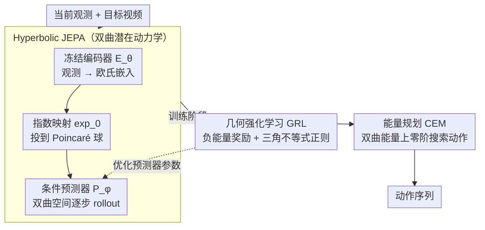

# GeoWorld: Geometric World Models

**会议**: CVPR 2026  
**arXiv**: [2602.23058](https://arxiv.org/abs/2602.23058)  
**代码**: [https://steve-zeyu-zhang.github.io/GeoWorld](https://steve-zeyu-zhang.github.io/GeoWorld)  
**领域**: 强化学习  
**关键词**: 几何世界模型、双曲空间、JEPA、强化学习、长期规划

## 一句话总结
GeoWorld 将预测式世界模型的潜在表征从欧氏空间映射到双曲流形上，通过 Hyperbolic JEPA 保持几何结构和层级关系，并提出 Geometric Reinforcement Learning 来优化多步规划，在 CrossTask 和 COIN 上实现了约 3% SR（3步）和 2% SR（4步）的提升。

## 研究背景与动机

**领域现状**：世界模型分为生成式和预测式两大类。生成式世界模型（如 VideoWorld）显式生成像素或视觉 token 来预测下一步，但缺乏对整条轨迹结构和能量景观的全局感知。预测式世界模型（如 JEPA、V-JEPA 2）不生成像素，而是在潜在空间中学习一个能量景观来度量当前状态和目标状态之间的兼容性，支持多步层级规划。

**现有痛点**：现有预测式世界模型面临两个关键问题：(1) 几何忽视——潜在表征在欧氏空间中学习，无法保持状态间的内在几何结构和层级关系，导致学到的能量景观不能捕捉有意义的测地距离；(2) 多步退化——多步视频数据稀缺且昂贵，模型主要在单步转换上训练，虽然概念上能做长期规划，但性能随 horizon 增长快速下降。

**核心矛盾**：欧氏空间的"平坦"结构无法自然编码现实世界中状态的层级关系（如"切菜"是"做饭"的子步骤），而强行在欧氏空间中建模长程依赖会导致几何漂移。

**本文目标** (1) 如何在潜在空间中保持几何和层级结构？(2) 如何在训练数据有限的情况下提升多步规划的稳定性？

**切入角度**：双曲空间的树状结构天然适合编码层级关系（距离随层级呈指数增长），且双曲测地线提供了最自然的"最短路径"概念。结合强化学习来优化预测器的能量函数，使轨迹沿测地线前进。

**核心 idea**：将 JEPA 的潜在动力学从欧氏空间提升到双曲流形上，并用几何强化学习优化多步规划中的测地线一致性。

## 方法详解

### 整体框架
GeoWorld 要解决的是程序化规划（procedural planning）：给定当前视频观测和目标视频，输出一串能把状态从当前推到目标的动作序列。它沿用 JEPA 的"预测式世界模型"思路——不解码像素，而是在潜在空间里学一个能量景观来度量状态间的兼容性——但把这套动力学整体搬到双曲流形上。整条流水线是这样转的：冻结编码器先把观测编成欧氏嵌入，经指数映射投到 Poincaré 球；条件预测器在双曲空间里逐步 rollout 出未来状态；训练时除了常规的预测损失，再加一层几何强化学习（GRL）直接优化多步规划的测地一致性；推理时用 CEM 在双曲距离构成的能量上搜出最优动作序列。三个关键设计——双曲化的 Hyperbolic JEPA、几何强化学习 GRL、能量规划 CEM——分别管住"几何结构""多步退化"和"动作搜索"。

### 关键设计

**1. Hyperbolic JEPA：把潜在动力学从平坦的欧氏空间提到双曲流形上**

预测式世界模型原本在欧氏空间学能量景观，但欧氏空间是"平"的，无法自然编码现实活动里"切菜是做饭的子步骤"这类层级关系，学出的测地距离也就没有语义意义。H-JEPA 的做法是借双曲空间的指数容积来嵌树状结构：先用预训练冻结编码器 $E_\theta$ 把观测 $x_t$ 编成欧氏嵌入 $s_t^x \in \mathbb{R}^n$，再把它当作原点切空间里的切向量，通过 Poincaré 球的指数映射投到双曲空间

$$s_{t,\mathbb{H}}^x = \exp_0(s_t^x) = \tanh(\sqrt{c}\|s_t^x\|) \frac{s_t^x}{\sqrt{c}\|s_t^x\|},$$

其中曲率 $c$ 是可学习参数。条件预测器 $P_\phi$ 吃进双曲状态序列和动作序列预测下一状态，训练目标全部建立在双曲测地距离 $d_\mathbb{H}$ 上：teacher-forcing loss 管单步预测精度，rollout loss 管两步递归预测的一致性。因为双曲空间的容积随半径指数增长，恰好是嵌入树的最优空间，状态间的测地距离也就比欧氏距离更能反映动作之间的语义层级。

**2. Geometric Reinforcement Learning：用能量优化直接补多步规划，而不靠更多多步数据**

多步视频既稀缺又贵，模型主要在单步转换上训练，概念上能做长期规划但性能随 horizon 快速衰减——光靠监督学习补不上这个洞。GRL 换个思路：把规划目标直接写成奖励来优化预测器。它定义能量代价为预测状态与目标状态的双曲距离 $c_t = d_\mathbb{H}(\hat{s}_{t+1,\mathbb{H}}^x, s_{t+1,\mathbb{H}}^x)$，奖励即负能量代价，路径价值函数是期望累积奖励 $V = \mathbb{E}[\sum \gamma^{t-1} r_t]$，于是最优价值等价于最小化整条轨迹的累积双曲距离。它的关键创新是一条三角不等式正则化

$$\mathcal{L}_\Delta = \frac{1}{T-2}\sum\big[d_\mathbb{H}(\hat{s}_t, \hat{s}_{t+2}) - d_\mathbb{H}(\hat{s}_t, \hat{s}_{t+1}) - d_\mathbb{H}(\hat{s}_{t+1}, \hat{s}_{t+2})\big]_+,$$

强制"跳两步走的距离不应超过逐步相加"，把预测轨迹钉在测地线上——这种约束在欧氏空间里不容易显式施加。总损失 $\mathcal{L}_{\text{GRL}} = \text{累积测地距离} + \beta \mathcal{L}_\Delta$。GRL 的巧妙之处是不需要额外的策略网络或奖励模型，奖励直接来自几何，优化的就是预测器自身参数。

**3. 能量规划（CEM）：把"找动作"变成在双曲能量上的零阶搜索**

有了双曲能量景观，推理阶段不需要再训练一个策略，而是直接搜：给定当前观测和目标，编码到双曲空间后定义能量代价 $C = d_\mathbb{H}(P((\hat{a}_t); s_{1,\mathbb{H}}^x), s_{1+T,\mathbb{H}}^x)$，再用 Cross-Entropy Method 迭代逼近能量最小的动作序列——每轮采样 $N=800$ 个候选、保留 $K=80$ 个精英来更新采样分布、共迭代 $I=10$ 轮。CEM 是零阶优化，不需要能量对动作可导，适合在高维动作空间里直接搜，把世界模型的预测能力转成可执行的规划。

### 损失函数 / 训练策略
两阶段训练：(1) 监督后训练阶段：$\mathcal{L}_{\text{SFT}} = \lambda \mathcal{L}_{\text{TF}} + (1-\lambda) \mathcal{L}_{\text{rollout}}$，AdamW 优化器，warmup → constant → decay 学习率调度，batch size 256，约 94500 iterations。(2) GRL 阶段：更小学习率和更短调度，batch size 128，约 25000 iterations，$\gamma=0.99$，$\beta=0.1$。预测器是 ~300M 参数 Transformer（24层，16头，1024维）。4 节点 32 卡 H100 训练。

## 实验关键数据

### 主实验 — Procedural Planning (图像input)

| 方法 | CrossTask T=3 SR | CrossTask T=4 SR | COIN T=3 SR | COIN T=4 SR |
|------|-----------------|-----------------|-------------|-------------|
| V-JEPA 2 ViT-g384 | 45.58 | 31.36 | 34.08 | 23.43 |
| **GeoWorld ViT-g384** | **47.47** | **31.48** | **34.85** | **27.79** |
| SCHEMA (LLM) | 38.93 | 24.50 | 32.09 | 22.02 |
| MTID (Generative) | 40.45 | 24.76 | 30.44 | 22.74 |

### 主实验 — Visual Planning with Videos

| 方法 | CrossTask T=3 SR | CrossTask T=4 SR | COIN T=3 SR | COIN T=4 SR |
|------|-----------------|-----------------|-------------|-------------|
| V-JEPA 2 ViT-g384 | 50.16 | 35.01 | 42.74 | 31.63 |
| **GeoWorld ViT-g384** | **51.71** | **37.04** | **45.29** | **33.29** |
| GPT-5 | 50.03 | 30.20 | 43.84 | 32.64 |
| VideoWorld | 41.59 | 25.50 | 34.88 | 23.74 |

### 长期规划 (CrossTask)

| 方法 | T=3 | T=4 | T=5 | T=6 |
|------|-----|-----|-----|-----|
| V-JEPA 2 ViT-g384 | 50.16 | 35.01 | 23.17 | 16.88 |
| **GeoWorld ViT-g384** | **51.71** | **37.04** | **24.83** | **18.26** |

### 关键发现
- GeoWorld 在所有模型规模（ViT-L/H/g/g384）上都一致超过 V-JEPA 2，说明改进不依赖于特定规模
- 随着规划 horizon 增加（T=3→T=6），GeoWorld 相对 V-JEPA 2 的优势逐渐扩大，在 T=6 时 SR 提升 1.38%（18.26 vs 16.88），验证了长期规划稳定性的增强
- mIoU 指标提升最显著（如 PP 设置下 CrossTask T=3: 86.55 vs 69.42），说明双曲表征对轨迹重叠度的提升最大
- GeoWorld ViT-g384 在视频规划设置下超越了 GPT-5 和 Gemini 2.5 Pro

## 亮点与洞察
- 将双曲几何引入世界模型是一个非常自然且优雅的设计。日常活动的层级结构（如"煮咖啡"→"磨豆→烧水→冲泡"）本质上就是树状的，双曲空间恰好是嵌入树的最佳空间。这种 geometric inductive bias 比单纯增大模型更高效
- GRL 的设计巧妙之处在于直接把测地距离作为 reward，不需要额外的奖励模型。三角不等式正则化确保了"走两步不应比直接到达更远"的几何一致性，这是欧氏空间中不容易施加的约束
- 两阶段训练（SFT → GRL）类似 LLM 的 SFT → RLHF 流程，但目标函数完全基于几何原则，不依赖人类偏好

## 局限与展望
- 只在 CrossTask 和 COIN 两个数据集上验证，且这两个数据集的动作空间相对简单（日常活动）。在更复杂的机器人操作或游戏环境中的表现未知
- Poincaré 球的曲率 $c$ 需要学习，但在所有状态间共享同一曲率可能不够灵活，不同层级的子空间可能需要不同曲率
- 编码器完全冻结，H-JEPA 只训练预测器。如果编码器本身的表征不适合双曲空间，性能天花板受限
- SR 绝对值在长 horizon 下仍然较低（T=6 只有 18.26%），说明长期规划仍是核心难题

## 相关工作与启发
- **vs V-JEPA 2**: 同为预测式世界模型，V-JEPA 2 在欧氏空间学习能量景观。GeoWorld 通过双曲映射和 GRL 在相同骨干和数据上一致提升。两者用相同冻结编码器，公平对比
- **vs VideoWorld**: 生成式世界模型，需要解码像素，在规划设置下显著弱于 GeoWorld
- **vs GPT-5/Gemini 2.5 Pro**: 强 LLM 基线在零样本设置下有竞争力，但 GeoWorld ViT-g384 在视频规划设置下超越了它们，说明专用几何模型仍有优势

## 评分
- 新颖性: ⭐⭐⭐⭐⭐ 双曲空间+世界模型+几何RL的组合在视觉规划领域是首次，理论动机和技术实现都很新颖
- 实验充分度: ⭐⭐⭐⭐ 两个数据集、多种基线、多种模型规模。但只有两个数据集且缺乏消融细节
- 写作质量: ⭐⭐⭐⭐ 数学推导严谨，但符号较多，读起来有一定门槛
- 价值: ⭐⭐⭐⭐ 提出了将几何思维引入世界模型的有前景方向，超越了 GPT-5 级别基线

<!-- RELATED:START -->

## 相关论文

- [\[CVPR 2026\] DreamSAC: Learning Hamiltonian World Models via Symmetry Exploration](dreamsac_learning_hamiltonian_world_models_via_symmetry_exploration.md)
- [\[CVPR 2026\] Talk2Move: Reinforcement Learning for Text-Instructed Object-Level Geometric Transformation in Scenes](talk2move_reinforcement_learning_for_text-instructed_object-level_geometric_tran.md)
- [\[ICLR 2026\] Deep SPI: Safe Policy Improvement via World Models](../../ICLR2026/reinforcement_learning/deep_spi_safe_policy_improvement_via_world_models.md)
- [\[NeurIPS 2025\] Foundation Models as World Models: A Foundational Study in Text-Based GridWorlds](../../NeurIPS2025/reinforcement_learning/foundation_models_as_world_models_a_foundational_study_in_text-based_gridworlds.md)
- [\[AAAI 2026\] Object-Centric World Models for Causality-Aware Reinforcement Learning](../../AAAI2026/reinforcement_learning/object-centric_world_models_for_causality-aware_reinforcement_learning.md)

<!-- RELATED:END -->
