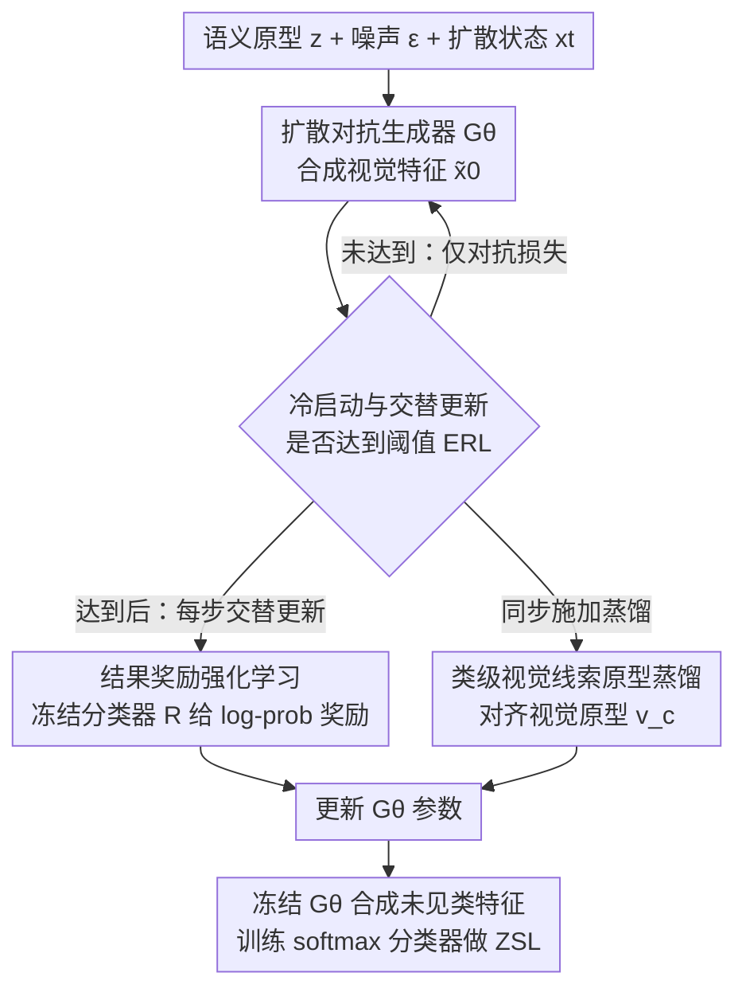

# Incentivizing Generative Zero-Shot Learning via Outcome-Reward Reinforcement Learning with Visual Cues

**会议**: CVPR 2026  
**论文**: [CVF Open Access](https://openaccess.thecvf.com/content/CVPR2026/html/Hou_Incentivizing_Generative_Zero-Shot_Learning_via_Outcome-Reward_Reinforcement_Learning_with_Visual_CVPR_2026_paper.html)  
**领域**: 强化学习 / 生成式零样本学习  
**关键词**: 零样本学习, 结果奖励RL, 特征生成, 视觉原型蒸馏, 冷启动

## 一句话总结
RLVC 把生成式零样本学习里的特征生成器当成 RL 策略，用一个冻结分类器给出的"分对了没有"的结果奖励来驱动生成器自进化，再用类级视觉线索做原型蒸馏稳住训练，在 CUB / SUN / AWA2 三个基准上把生成式 ZSL 推到新的 SOTA（CUB 上 CZSL 准确率 90.1%、GZSL 调和均值 81.2%）。

## 研究背景与动机
**领域现状**：生成式零样本学习（ZSL）的主流套路是——用 VAE / GAN / 扩散模型，以类别的语义原型（属性向量或类名的文本嵌入）为条件，为没见过的类别（unseen classes）合成视觉特征，再拿这些合成特征去训练一个普通分类器。这样就把"没有未见类样本"的问题，转化成了"合成一批假样本来训练"的数据增强问题。

**现有痛点**：作者指出两个具体毛病。其一，**生成器和下游分类器是各练各的**——生成器只在对抗损失下学"看起来像真实分布"，但没人告诉它"这些特征好不好分类"，结果合成出来的特征是 task-agnostic（任务无关）的，分类器拿到手并不好用。其二，**只靠语义条件会让相似类别在特征空间里糊成一团**——比如 "Indigo Bunting / Lazuli Bunting / Painted Bunting" 这三种鹀，语义描述高度相似但视觉上差别明显，仅凭语义原型合成的特征会出现严重的类间重叠和误分。

**核心矛盾**：生成能力（合成出分布上合理的特征）和判别需求（合成出下游分类器真正能分对的特征）之间是脱节的。对抗损失优化的是前者，但 ZSL 最终要的是后者。语义原型这种"弱监督"不足以拉开视觉上相近的类别。

**本文目标**：让生成过程直接对齐下游分类目标，同时为视觉相近的类别注入更可靠的监督，从而合成既忠实于数据分布、又对分类任务有用的特征。

**切入角度**：作者借鉴了 RL 在 LLM 后训练（DeepSeek-R1、o1）和视觉 RFT（Visual-RFT、VPRL）里的成功——RL 通过"试错—奖励"让模型自进化，且它的结果导向优化天然能把生成和下游目标直接挂钩。于是作者提出一个大胆的视角：**把生成器看作策略（policy），用结果奖励来训它**。这是首次把 RL 引入生成式 ZSL。

**核心 idea**：用"合成特征被正确分类的概率"作为结果奖励来更新生成器（policy），再用从真实可见类特征里挖出来的类级视觉原型做蒸馏，把合成特征往真实视觉中心拉，同时稳住 RL 训练。

## 方法详解

### 整体框架
RLVC 的输入是类别语义原型 $z^c$ 和高斯噪声 $\epsilon$，输出是为未见类合成的、对分类友好的视觉特征。整套系统分两个阶段在转：**先训奖励模型**——把一个视觉编码器（ViT）和一个充当奖励模型的冻结线性分类器 $R$ 一起训好，产出微调后的视觉特征和奖励信号；**再训策略**——把扩散式对抗生成器 $G_\theta$ 当 policy，用奖励模型给的结果奖励和视觉线索蒸馏一起更新它。关键的训练调度是"冷启动 + 交替更新"：先只用对抗损失把生成器练到特征有基本类间可分性，越过阈值 $E_{RL}$ 后才激活 RL，并在每一步里交替（而非简单相加）地用对抗+蒸馏损失和 RL 损失更新生成器，避免梯度打架。

底座生成框架沿用了已有的扩散式对抗结构：生成器 $G_\theta$ 接收类原型 $z^c$、噪声 $\epsilon$、扩散状态 $x_t$ 和时间步 $t$，输出 $\tilde{x}_0 = G_\theta(\epsilon, z^c, x_t, t)$；两个判别器 $D_{x_0}$（区分真实与合成的干净特征）和 $D_{x_t}$（对比真实与合成的状态转移），用带梯度惩罚的 WGAN 目标交替训练。这部分是脚手架，RLVC 真正的创新在下面三个设计。

### 关键设计

**1. 结果奖励强化学习：用"分对了没有"直接驱动生成器自进化**

这一设计针对的是"生成器和下游分类器各练各的、合成特征任务无关"这个核心痛点。作者把生成器 $G_\theta$ 当成 RL 里的策略，用一个**冻结的线性分类器** $R(x) = Wx + b$ 当奖励模型——它在奖励模型训练阶段就和视觉编码器一起练好后冻结。给定一个合成特征 $\tilde{x}_0$，把它过 $R$ 再 softmax 得到类别概率 $p(y \mid \tilde{x}_0) = \mathrm{softmax}(R(\tilde{x}_0))_y$，然后取真值类的对数概率作为结果奖励：

$$r = \log p(y \mid \tilde{x}_0)$$

直觉很直接：奖励模型对合成特征"分得越自信"，奖励越大，生成器就被推着往"更容易被分对"的方向走。为了稳住训练，作者不直接用原始奖励，而是用指数滑动平均（EMA）维护一个基线 $b \leftarrow \alpha b + (1-\alpha)\frac{1}{B}\sum_i r_i$（$\alpha=0.9$），用 $\hat{r}_i = r_i - b$ 得到优势，再加 stop-gradient 把它当常数：$\hat{A}_i = \mathrm{sg}[\hat{r}_i]$。最终 RL 目标为 $L_{RL} = -\frac{1}{B}\sum_i \hat{A}_i \log p(y_i \mid \tilde{x}_{0,i})$。由于 $\log p$ 对 $\tilde{x}_0$ 可导，梯度能穿过冻结的 $R$ 一路回传到 $G_\theta$（$R$ 参数不动）。这比对抗损失高明的地方在于：奖励信号直接来自分类目标本身，而不是"像不像真实分布"，从而把生成和判别拧成一股绳。

**2. 类级视觉线索 + 原型蒸馏损失：给视觉相近类别注入真实视觉中心**

光有语义条件，对"语义像但视觉不同"的细粒度类别仍然无能为力，而且 RL 训练通常需要一个 KL 之类的正则项来约束分布漂移、防止策略跑偏。作者把这两件事合二为一：从微调后的真实可见类特征里**挖类级视觉原型**——对每个可见类 $c$，把它所有训练样本的微调视觉特征取均值 $v^c = \frac{1}{|I_c|}\sum_{i \in I_c} x_i^s$。然后用一个原型蒸馏损失把合成特征往对应视觉原型上拉（用余弦相似度，1 减去归一化内积）：

$$L_{PD} = \frac{1}{B}\sum_{i=1}^{B}\left(1 - \frac{\tilde{x}_{0,i}^\top v^{c_i}}{\|\tilde{x}_{0,i}\|_2\,\|v^{c_i}\|_2}\right)$$

它被并进生成器更新目标 $L_G^{total} = L_G^{adv} + \lambda_{PD}L_{PD}$（$\lambda_{PD}=20$ 左右）。为什么有效：视觉原型携带的是真实数据里的视觉中心信息，比纯语义条件更能把相近类别在特征空间里拉开；同时它充当了 RL 里 KL 正则的角色，把合成特征锚在真实分布附近，避免策略在奖励驱动下漂得太远——所以作者强调视觉线索"额外还稳住了 RL 优化"。消融里也专门对比了用 KL、$\ell_1$ 替代 $L_{PD}$，验证这种原型蒸馏在多数设定下更优（见 Table 4）。

**3. 冷启动 + 交替更新：让 RL 不在生成器还没成型时就介入、也不让两路梯度互相拉扯**

把 RL 直接从头加进生成训练里有两个隐患：一是生成器初期合成的特征还很乱，奖励信号噪声大、起不到引导作用；二是对抗损失和 RL 损失的梯度方向可能冲突。作者借鉴 LLM 后训练的冷启动思路解决这两点。冷启动调度是：先用对抗目标训若干 epoch，等合成特征具备**基本类间可分性**后，到达阈值 $E_{RL}$（CUB/SUN 设 30，AWA2 设 7）才激活 RL。越过阈值后，每个 iteration 内**交替**地用 $L_G^{total}$（对抗+蒸馏）和 $L_{RL}$ 两个目标分别更新 $G_\theta$，而不是把两个损失直接相加——这样避免了梯度冲突导致的优化不稳。论文给出的训练曲线显示，激活 RL 后奖励先升后稳、优势项只有小幅波动、ZSL 准确率稳步提升，说明这套调度让训练既能受益于 RL 又保持稳定。

### 推理（CZSL 与 GZSL）
推理时冻结 $G_\theta$，按 Eq.(1) 为未见类合成视觉特征，不加任何额外技巧。CZSL 设定下只在合成的未见类特征上训一个标准 softmax 分类器；GZSL 设定下则在"微调后的可见类真实特征 + 合成的未见类特征"的并集上训分类器。

## 实验关键数据

### 主实验
在 CUB（细粒度鸟类）、SUN（细粒度场景）、AWA2（粗粒度动物）三个 ZSL 基准上，与嵌入式和生成式方法对比。Acc 是 CZSL 未见类准确率，U/S/H 是 GZSL 下未见类、可见类准确率及其调和均值。

| 数据集 | 指标 | RLVC | 之前最优生成式 (VADS) | 之前最优嵌入式 |
|--------|------|------|----------------------|----------------|
| CUB | Acc / H | **90.1 / 81.2** | 86.8 / 74.3 | 80.6 / 75.7 (VSPCN) |
| SUN | Acc / H | **77.7 / 57.6** | 76.3 / 55.7 | 75.3 / 54.8 (PSVMA+) |
| AWA2 | Acc / H | **84.0 / 80.4** | 82.5 / 79.3 | 79.2 / 79.8 (PSVMA+) |

RLVC 在三个数据集的 Acc 和大多数 H 上都拿到最佳，作者总结平均约 4.7% 的增益（不同指标/数据集上 0.1%–8.3% 不等）。值得注意的是它在 CUB 上甚至超过了 CLIP 这类大规模预训练方法。

### 消融实验
组件消融（Table 3，报告各数据集 Acc / H）：

| 配置 | CUB (Acc/H) | SUN (Acc/H) | AWA2 (Acc/H) | 说明 |
|------|-------------|-------------|--------------|------|
| 完整 RLVC | 90.1 / 81.2 | 77.7 / 57.6 | 84.0 / 80.4 | 全模型 |
| w/o RL & 视觉线索 | 88.6 / 75.1 | 75.8 / 55.1 | 75.7 / 72.8 | 退化成 vanilla 生成 |
| w/o RL | 89.2 / 80.1 | 76.1 / 55.6 | 79.4 / 73.9 | 去掉结果奖励 RL |
| w/o 视觉线索 | 88.9 / 79.2 | 77.0 / 56.9 | 74.9 / 76.6 | 去掉原型蒸馏 |
| w/o 微调视觉编码器 | 89.2 / 77.5 | 76.0 / 56.4 | 81.1 / 76.3 | 不联合微调 ViT |
| w/o 优势 (EMA) | 89.6 / 79.7 | 76.0 / 56.0 | 82.4 / 78.2 | 用原始奖励代替优势 |

蒸馏损失对比（Table 4，Acc / H）：

| 损失 | CUB | SUN | AWA2 |
|------|-----|-----|------|
| KL | 88.9 / 80.1 | 77.2 / 58.2 | 76.4 / 76.4 |
| $\ell_1$ | 89.2 / 80.9 | 77.3 / 57.8 | 75.9 / 77.6 |
| $L_{PD}$ (本文) | 90.1 / 81.2 | 77.7 / 57.6 | 84.0 / 80.4 |

### 关键发现
- **RL 是最大功臣，尤其在 AWA2 上**：去掉 RL 后 AWA2 的 Acc/H 从 84.0/80.4 直接掉到 79.4/73.9，掉幅最猛——说明结果奖励对"把生成对齐到分类任务"贡献最大。整体看，加入 RL 后 CZSL 的 Acc 平均涨 3.9%、GZSL 的 H 平均涨 5.3%。
- **视觉线索缺了普遍掉点**：去掉原型蒸馏在三个基准上都退化，印证它既拉开相近类别、又稳住 RL 的双重作用。
- **联合微调视觉编码器对 GZSL 尤为有益**：不单独优化视觉编码器、而是和奖励模型一起微调，能注入数据集特定先验、缓解域偏置，使 H 在 CUB/SUN/AWA2 分别提升 3.7%、1.2%、4.1%。
- **EMA 优势 > 原始奖励**：用滑动平均基线算优势比直接用原始奖励明显更好，说明哪怕是这么简洁的 RL 设计，针对性的优化技巧仍然重要。
- **超参敏感性**：冷启动 epoch 在 30 附近最稳最优；视觉损失系数 $\lambda_{PD}$ 随增大先升后降、峰值在 20；每类合成样本数在 400 时 H 最佳。全部实验仅用单张 RTX 4090（24GB）即可完成。

## 亮点与洞察
- **把"生成器=策略、分类概率=奖励"这条桥搭得非常干净**：奖励模型就是个冻结的线性分类器，奖励就是真值类的 log 概率，梯度能直接穿过它回传——没有引入 PPO/GRPO 这类重型策略优化算法，却把生成和判别目标真正对齐，思路简洁到可复用。
- **视觉线索一招两用**：既当"把相近类别拉开"的判别监督，又当"约束策略别漂太远"的 RL 正则（替代 KL），这种用真实视觉原型同时解决两个问题的设计很巧。
- **冷启动+交替更新的工程经验可迁移**：任何"对抗训练里想再叠一路新目标"的场景，都可能面临初期信号噪声大和梯度冲突，"先暖机、再交替而非相加"是个轻量好用的配方。
- 整套方法只需单卡 4090 就能训，把"RL 用于生成"这件听起来很重的事做得很轻，降低了复现门槛。

## 局限与展望
- **奖励模型是个固定的线性分类器**：奖励信号的质量被这个简单冻结分类器的上限卡住，对于真正困难、奖励模型自己也分不准的类别，结果奖励可能给出误导信号；作者也承认这只是"初步探索"，没有上更强或可学习的奖励模型。
- **结果奖励较稀疏/平坦**：从训练曲线看原始奖励几乎是条平线（约 -5.3）、优势项幅度极小（~1e-4 量级），说明信号本身相当弱，必须靠 EMA 才稳得住，这种奖励的有效性可能与数据集特性强相关。
- **仍依赖既有的扩散对抗底座和大量手工超参**：冷启动阈值 $E_{RL}$、$\lambda_{PD}$、每类合成样本数都需按数据集分别调（AWA2 的设置和 CUB/SUN 差异很大），泛化到新数据集时调参成本不低。
- **只在特征级 ZSL 上验证**：方法作用于预提取/合成的视觉特征，未涉及像素级图像生成或更开放的识别场景，结论能否外推到更复杂任务仍待验证。

## 相关工作与启发
- **vs VADS（CVPR'24，生成式 SOTA）**：VADS 走的是"用视觉特征演化语义原型来改善对齐"的路线，本质还是在语义—视觉映射上做文章；RLVC 换了个维度，直接用结果奖励让生成器自进化、把生成对齐到分类目标，在 CUB/AWA2 上全面超过 VADS，证明 RL 视角带来的增益不是单靠更好的原型对齐能拿到的。
- **vs 传统对抗式生成 ZSL（CE-GZSL、FREE 等）**：它们只有对抗/对比损失，合成特征任务无关；RLVC 在同样的对抗底座上叠了结果奖励这条直连分类目标的监督，消融显示这一步带来了主要增益。
- **vs Visual-RFT / VPRL 等视觉 RFT**：这些工作把 RL 用于视觉理解/推理任务、设计任务相关奖励或更高效的优化策略；RLVC 是首次把这套思路落到"生成式 ZSL 的特征合成"上，且刻意保持 pipeline 简单，强调的是"RL 能不能帮 ZSL"这个问题本身而非更复杂的算法。
- **启发**：奖励模型不必复杂——一个冻结线性分类器的 log 概率就足以提供可回传的、对齐下游任务的监督信号，这对其它"想让生成对齐某个判别目标"的任务（如可控生成、特征增强）有直接借鉴意义。

## 评分
- 新颖性: ⭐⭐⭐⭐⭐ 首次把结果奖励 RL 引入生成式 ZSL，"生成器即策略、分类概率即奖励"的视角清晰且开创性强
- 实验充分度: ⭐⭐⭐⭐ 三基准 + 组件/损失双消融 + 超参敏感性 + 训练曲线，较扎实；但奖励信号近乎平坦的现象未深挖、仅特征级验证
- 写作质量: ⭐⭐⭐⭐ 动机—方法—实验逻辑顺，图表清楚；个别公式排版（如优势/stop-gradient）需对照原文确认
- 价值: ⭐⭐⭐⭐ 简洁可复现（单卡 4090）、把 RL-for-generation 做轻，为后续更强奖励模型/更难任务留下了明确入口

<!-- RELATED:START -->

## 相关论文

- [\[CVPR 2026\] MSRL: Scaling Generative Multimodal Reward Modeling via Multi-Stage Reinforcement Learning](msrl_scaling_generative_multimodal_reward_modeling.md)
- [\[ICML 2026\] Unlocking Zero-Shot Geospatial Reasoning via Indirect Rewards](../../ICML2026/reinforcement_learning/unlocking_zero-shot_geospatial_reasoning_via_indirect_rewards.md)
- [\[CVPR 2026\] TSTM: Temporal Segmentation for Task-relevant Mask in Visual Reinforcement Learning Generalization](tstm_temporal_segmentation_for_task-relevant_mask_in_visual_reinforcement_learni.md)
- [\[CVPR 2026\] CCCaption: Dual-Reward Reinforcement Learning for Complete and Correct Image Captioning](cccaption_dual-reward_reinforcement_learning_for_complete_and_correct_image_capt.md)
- [\[ICLR 2026\] Offline Reinforcement Learning with Generative Trajectory Policies](../../ICLR2026/reinforcement_learning/offline_reinforcement_learning_with_generative_trajectory_policies.md)

<!-- RELATED:END -->
