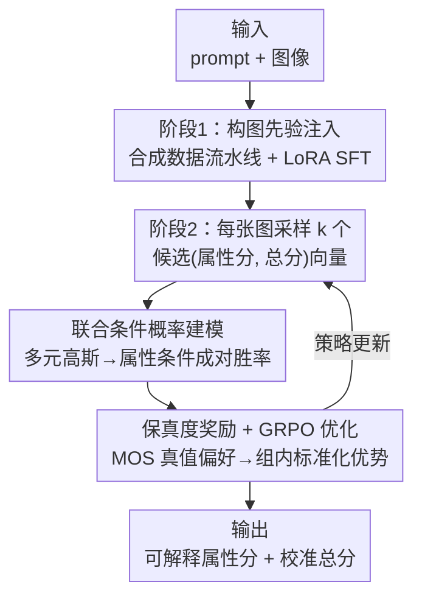

# JoPPO: Hierarchical Photography Assessment via Contrastive Joint Conditional Probabilistic Reinforcement Learning

**会议**: CVPR 2026  
**论文**: [CVF Open Access](https://openaccess.thecvf.com/content/CVPR2026/html/Yang_JoPPO_Hierarchical_Photography_Assessment_via_Contrastive_Joint_Conditional_Probabilistic_Reinforcement_CVPR_2026_paper.html)  
**代码**: https://github.com/SpatialVision-Research/JoPPO_CVPR2026  
**领域**: 强化学习 / VLM-as-a-Judge / 图像美学评估  
**关键词**: 图像美学评估, GRPO, 条件高斯, 成对胜率, VLM 裁判

## 一句话总结
JoPPO 把"用 VLM 给图打美学分"从回归单一全局分，升级成在一批图里建模"属性分与总分的联合高斯分布、推导出属性条件下的成对胜率"，并把这个胜率作为 GRPO 的奖励来训练裁判，从而让模型既能给出可解释的多属性子分，又能在排序一致性上显著超过 GPT-4o。

## 研究背景与动机

**领域现状**：用大模型当裁判（LLM/VLM-as-a-Judge）给生成内容打分、排序，已经成为开放式任务的主流评测手段。语言侧有 JudgeLM、Prometheus，视觉侧有 Prometheus-Vision 这类靠 SFT 训出来的裁判，能输出分数加自然语言理由。后来一批工作（VisualQuality-R1、Aes-R1、Q-Insight）进一步用强化学习（多基于 GRPO）来训裁判，让它直接对齐"谁更好"这个比较目标。

**现有痛点**：纯 SFT 训出来的裁判，学的是"输入→分数"的映射，但它的置信度并不能可靠反映"A 真的比 B 好"的概率——打分容易受 prompt 措辞和数据分布漂移影响，区分度低。而现有的 RL 裁判虽然直接优化比较目标，却普遍只回归一个全局分，缺少"属性条件下"的概率建模：它们说不清"为什么 A 赢"，也无法把构图、光线、色彩这些细粒度属性和总体判断统一进一个连贯的概率空间。

**核心矛盾**：美学这种判断本质是**组合性**的——总体好看，是由构图、光照、色彩、几何等多个属性合成出来的。但传统的概率排序模型（如 Thurstone）只对单一分数建模成对比较；要扩展到多属性，就得对每个维度独立算排序概率，既有巨大的计算开销，又割裂了"属性分↔总分"之间的依赖结构。于是裁判要么只看全局印象、丢掉可解释性，要么硬拆成多个独立维度、丢掉一致性。

**本文目标**：训一个能**组合推理**的裁判——先识别构图、光线、色彩、几何等属性，再据此给出可解释的总体判断；并且让"谁赢、赢多少"在一个统一的概率框架里自洽。

**切入角度**：作者把 Thurstone 假设从"单分数高斯"扩展到"属性分+总分的多元高斯"，然后利用条件高斯的解析公式，直接写出"在已知双方属性分的条件下，i 的总分高于 j"的闭式胜率。这个胜率天然把属性和总分的依赖结构编码进来，还省掉了逐维度算排序概率的开销。

**核心 idea**：用"属性条件下的联合高斯成对胜率"当奖励，套进 GRPO 做组内对比优化——即 JoPPO（Joint Probabilistic Policy Optimization）。

## 方法详解

### 整体框架
JoPPO 是一个两阶段训练范式，骨干是 Qwen2.5-VL-7B。**第一阶段**用 SFT 把"摄影构图先验"灌进 VLM：通过一条自动数据生成流水线，把 PICD 构图标注 + ControlNet 合成图 + 大模型生成的推理文本，做成结构化的构图/视角/美学推理数据，再用 LoRA 微调，让模型具备多维度感知能力。**第二阶段**是 JoPPO 强化学习：对一批图，每张图采样多个候选打分向量（属性分 + 总分），用联合高斯条件建模算出候选两两之间的"属性条件成对胜率"，再把这个胜率和人类 MOS 给的真值偏好做成保真度奖励，最后用 GRPO 的组内标准化优势 + 截断比 + KL 正则去更新策略。

输入是"一段文本 prompt q + 一张图 x"，模型输出 d 个属性分（取值 $[-1,1]$）、一个全局美学分 $s$（取值 $[0,1]$）以及自然语言解释；训练完成后即可零样本地给新图打分排序。

### 关键设计

**1. 构图先验注入：先用合成数据把"会看构图"灌进 VLM**

直接拿通用 VLM 当美学裁判，它对构图、视角这类专业摄影概念几乎是"看不懂"的，而构图质量恰恰是决定整体观感的关键。本文先做一阶段 SFT 把这个先验补上。难点是真实带构图标注的样本长尾、稀缺，所以作者设计了一条自动数据生成流水线：从 PICD 数据集抽出构图、视角等显式标签，再用 ControlNet 在深度图和 Canny 边缘图条件下合成高质量图像来扩充长尾；每张生成图配一个"组合视觉提示"，路由给 Qwen/Gemini/GPT 等大模型产出图文对齐的推理语句；同时维护一个覆盖"构图识别、视角判别、美学估计"的推理模板池，保证数据多样且逻辑一致。最后用 rank=64 的 LoRA 微调 Qwen2.5-VL-7B。消融显示这一步在需要构图理解的 PICD 上贡献巨大（去掉 SFT 掉 27.6% ACC），说明它给后续 JoPPO 的多属性建模打下了语义地基。

**2. 联合条件高斯建模：用一个解析公式把"多属性胜率"算出来**

这是全文的理论核心，针对的痛点是"传统排序模型只会算单分数比较，扩展到多属性要么开销爆炸、要么割裂依赖"。经典 Thurstone 模型假设美学判断服从高斯，两图成对胜率为

$$p_\theta(i > j) = \Phi\!\left(\frac{\mu_{s_i} - \mu_{s_j}}{\sqrt{\sigma_{s_i}^2 + \sigma_{s_j}^2 + \gamma}}\right)$$

其中 $\Phi(\cdot)$ 是标准正态 CDF，$\gamma$ 是数值稳定常数。JoPPO 把它从"单分数"扩展成"属性分 $A$ 与总分 $S$ 的联合多元高斯"：$\begin{pmatrix}A\\S\end{pmatrix} \sim \mathcal{N}\!\left(\begin{pmatrix}\mu_A\\\mu_S\end{pmatrix}, \begin{pmatrix}\Sigma_{AA} & \Sigma_{AS}\\\Sigma_{SA} & \sigma_{SS}\end{pmatrix}\right)$。利用高斯的条件分布闭式解，在已知属性分 $a$ 的条件下，总分的条件均值与方差为

$$\mu_{S|a} = \mu_S + \Sigma_{SA}\Sigma_{AA}^{-1}(a - \mu_A), \qquad \sigma^2_{S|a} = \sigma_{SS} - \Sigma_{SA}\Sigma_{AA}^{-1}\Sigma_{AS}$$

于是任意两个候选 $(a_i^{(m)}, s_i^{(m)})$ 和 $(a_j^{(n)}, s_j^{(n)})$ 的"属性条件成对胜率"就能套回 Thurstone 形式：$p_\theta(s_i^{(m)} > s_j^{(n)} \mid a_i^{(m)}, a_j^{(n)}) = \Phi\big((\mu_{s_i^{(m)}|a_i^{(m)}} - \mu_{s_j^{(n)}|a_j^{(n)}}) / \sqrt{\sigma^2_{s_i^{(m)}|a_i^{(m)}} + \sigma^2_{s_j^{(n)}|a_j^{(n)}} + \gamma}\big)$。这个设计的妙处在于：协方差项 $\Sigma_{SA}\Sigma_{AA}^{-1}$ 显式地把"属性怎么影响总分"的结构编码进了条件均值里，一次性建好整张图的联合分布，既避免了逐维度算排序概率的开销，又让比较决策落在一个有概率论依据、且属性与总分互相一致的统一空间里。

**3. 保真度奖励 + GRPO 优化：把"胜率对齐 MOS"变成可优化的 RL 目标**

有了闭式胜率，还需要一个监督信号告诉模型"什么才是对的比较"。本文用人类平均意见分（MOS）构造二值偏好真值：$p_{gt}(x_i, x_j)$ 在 $\text{MOS}(x_i) > \text{MOS}(x_j)$ 时取 1，相等取 0.5，否则取 0。然后对组 $K_i$ 里每个候选定义保真度奖励，本质是预测胜率与真值偏好的 Bhattacharyya 式匹配度（把"赢"和"不赢"两支的几何平均加起来，跨整批其他图取平均）：

$$r_k(x_i) = \frac{1}{k(B-1)}\sum_{j\neq i}\sum_{n=1}^{k}\Big[\sqrt{p_{gt}\cdot p_\theta(s_i^{(m)}>s_j^{(n)})} + \sqrt{(1-p_{gt})\cdot(1-p_\theta(s_i^{(m)}>s_j^{(n)}))}\Big]$$

当预测胜率和真值偏好同向时这一项最大，所以奖励鼓励模型把"该赢的判赢、赢的概率也对"。拿到组奖励后做组内标准化 $\tilde{r}_n(x_i) = (r_n - \mu(r))/\sigma(r)$ 当优势，再塞进标准 GRPO 目标：用 $\pi_\theta/\pi_{\theta_{old}}$ 的重要性比乘以优势、做 $[1-\epsilon, 1+\epsilon]$ 截断、并加 $\beta$ 系数的 KL 正则约束到参考策略。这样训练不需要对单个属性分做显式监督，却能联合优化维度级与整体级的美学质量——奖励信号天然把"属性条件胜率"这条结构注入了策略梯度。

### 损失函数 / 训练策略
两阶段都用 Qwen2.5-VL-7B 作骨干。阶段一 SFT：LoRA（rank=64），AdamW，基础学习率 $1\times10^{-4}$，cosine 调度 + 3% warmup，全局 batch 32，1 epoch，4 张 A100。阶段二 JoPPO：每个 prompt 采样 $G=6$ 个候选，学习率 $8\times10^{-6}$，全局 batch 512，1 epoch，8 张 A100。两阶段共约 45 小时。JoPPO 联合训练用了 PICD（构图分类）、MMPerspective（视角分类）、CADB（含属性分与总分）三个数据集。

## 实验关键数据

### 主实验
骨干 Qwen2.5-VL-7B，对比一众开源 VLM（Qwen2.5-VL-7B/72B、InternVL3-8B/38B、LLaVA 系列）、RL 美学裁判（Q-Insight、ArtiMuse）以及闭源 GPT-4o。分类任务报 Top-1 ACC，回归任务报 SRCC/PLCC，带 * 为分布外（OOD）测试集。

| 数据集（指标） | Qwen2.5-VL-72B | GPT-4o | 本文 |
|--------|------|------|------|
| PICD (ACC) | 0.313 | 0.393 | **0.720** |
| MMP (ACC) | 0.487 | 0.501 | **0.624** |
| CADB (SRCC/PLCC) | 0.586 / 0.527 | 0.538 / 0.517 | **0.629 / 0.612** |
| TAD66K* (SRCC/PLCC) | 0.232 / 0.235 | 0.252 / 0.239 | **0.265 / 0.268** |
| PARA* (SRCC/PLCC) | 0.700 / 0.724 | 0.678 / 0.738 | **0.764 / 0.804** |
| AVA* (SRCC/PLCC) | 0.408 / 0.387 | 0.501 / 0.428 | 0.427 / **0.434** |

域内 PICD 上达到 72.0% ACC，比 GPT-4o 高 +32.7%；MMPerspective 与 CADB 也分别超 GPT-4o +12.3% ACC、+0.091 PLCC。OOD 上四个基准中三个相关性优于 GPT-4o（PARA +0.086 SRCC、+0.066 PLCC）；AVA 上 SRCC 略低于 GPT-4o 但 PLCC 反超。

属性→总分（PARA）的受控评测里，模型被要求先预测构图/色彩/景深/光线/内容五个属性分再聚合成总分，每个属性的 SRCC/PLCC 都领先所有 baseline，总体相关性 0.789 SRCC / 0.822 PLCC，说明它不仅总分准、子分推理也忠实。

| PARA 属性→总分 | Comp | Color | DoF | Light | Content | Overall |
|------|------|------|------|------|------|------|
| GPT-4o (SRCC) | 0.637 | 0.667 | 0.609 | 0.599 | 0.589 | 0.661 |
| 本文 (SRCC) | **0.768** | **0.695** | **0.673** | **0.712** | **0.677** | **0.789** |

### 消融实验
| 配置 | PICD ACC | MMP ACC | CADB SRCC/PLCC | PARA SRCC/PLCC | 说明 |
|------|------|------|------|------|------|
| W/O SFT | 0.444 | 0.547 | 0.596 / 0.587 | 0.761 / 0.782 | 去掉构图先验注入 |
| W/O JoPPO（退回 GRPO） | 0.674 | 0.621 | 0.566 / 0.554 | 0.723 / 0.733 | 去掉联合条件概率奖励 |
| Ours（完整） | **0.720** | **0.624** | **0.629 / 0.612** | **0.789 / 0.822** | — |

属性→总分上的消融（W/O JoPPO vs Ours，PLCC）：Comp 0.735→0.796、Content 0.664→0.752、Overall 0.733→0.822，去掉 JoPPO 后属性分与美学因素的对齐明显变差。

### 关键发现
- **SFT 决定"看不看得懂构图"**：去掉 SFT 在 PICD 掉 27.6%、MMP 掉 7.7%，证明结构感知先验必须在早期注入；评分型数据集（CADB/PARA）也轻微下滑，说明先验还顺带强化了美学感知的根基。
- **JoPPO 决定"比较得准不准"**：把 JoPPO 退回普通 GRPO 后所有数据集都掉点，尤其属性→总分任务上属性分对齐显著变差——条件概率建模是让"细粒度属性忠实映射到整体判断"的关键。
- **闭源也打得过**：7B 小模型经两阶段训练，多数指标超过 GPT-4o 和 72B 开源模型，说明收益来自训练范式而非堆参数。

## 亮点与洞察
- **把多元高斯的条件分布闭式解用作奖励**：直接拿 $\mu_{S|a}$、$\sigma^2_{S|a}$ 套回 Thurstone CDF，一步算出"属性条件成对胜率"，既省掉逐维度排序概率的组合开销，又把"属性→总分"的协方差结构显式编码进奖励——这是把概率排序理论和 GRPO 干净缝合的关键巧思。
- **保真度奖励的 Bhattacharyya 形式**：用 $\sqrt{p_{gt}p_\theta} + \sqrt{(1-p_{gt})(1-p_\theta)}$ 同时奖励"判对方向"和"胜率数值对"，比单纯的 0/1 命中更平滑，对 RL 训练更友好。
- **可迁移性**："先建联合分布、再取条件胜率当奖励"这套思路不限于美学，凡是"多个可解释子维度合成一个总体偏好"的评测（图像质量 IQA、视频质量、甚至 LLM 多维度评测）都能照搬。
- **数据流水线值得复用**：ControlNet（深度+Canny 条件）合成 + 模板池 + 多模型路由生成推理文本，是一套解决"专业标注长尾"的实用配方。

## 局限与展望
- **依赖属性标注质量**（作者承认）：模型把属性分映射成总分，因此非常吃训练数据里属性标注的质量、覆盖度与平衡性；标注稀疏或失衡会拖累组合推理能力。
- **高斯假设的边界**：联合高斯 + Thurstone 假设美学判断近似正态，但真实人类美学偏好可能是多峰、长尾的（如风格化偏好），论文未讨论分布失配时胜率公式的可靠性。
- **协方差从哪来未充分交代**：条件公式依赖 $\Sigma_{AA}$、$\Sigma_{SA}$ 等协方差，缓存正文未清楚说明这些统计量是逐 batch 估计还是模型输出，⚠️ 以原文为准；这关系到小 batch 下协方差估计的稳定性。
- **未来方向**（作者）：扩展到图像质量评估（锐度、噪声等技术属性聚合成质量分），以及视频级评测（运动一致性、镜头稳定性、节奏等时序属性）。

## 相关工作与启发
- **vs Aes-R1 / VisualQuality-R1**: 它们也用 RL 训美学/质量裁判，但 Aes-R1 用 RAPO 联合优化标量分与成对比较、VisualQuality-R1 用 Thurstone 排序目标，本质都还在优化**单一全局分**；JoPPO 把比较空间扩到"属性条件下"，能解释"为什么 A 赢"，且属性与总分一致。
- **vs Q-Insight**: 同样基于 GRPO 多任务（质量分 + 失真类型），但它的多任务是并列的，没有把属性和总分的依赖结构建进概率模型；JoPPO 用联合条件高斯显式建模这种因果依赖。
- **vs ArtiMuse**: ArtiMuse 也做"标量预测 + 属性子分 + 文字评论"，但靠监督式预测，缺少统一的概率比较框架；JoPPO 在对比 RL 下训练，排序一致性（SRCC/PLCC）与零样本泛化更强，定性上能区分高低美学质量而 ArtiMuse 区分失败。
- **vs J1 / Prometheus（语言裁判）**: 它们把"裁判训练"做在语言/对话域，JoPPO 把同样的"成对偏好 + 概率一致性"思路落到视觉美学，并加上多属性条件建模这一视觉特有的组合结构。

## 评分
- 新颖性: ⭐⭐⭐⭐⭐ 把多元高斯条件分布的闭式胜率当 GRPO 奖励，统一了多属性与整体美学比较，角度新颖且理论自洽。
- 实验充分度: ⭐⭐⭐⭐ 域内 + 4 个 OOD、属性→总分受控评测、两组消融都做了，但协方差估计细节与高斯假设的敏感性分析略缺。
- 写作质量: ⭐⭐⭐⭐ 动机—方法—公式链条清晰；部分符号（协方差来源）交代不够完整。
- 价值: ⭐⭐⭐⭐ 7B 超 GPT-4o 的可复现配方 + 可迁移到 IQA/视频的通用框架，对"可解释 VLM 裁判"方向实用价值高。

<!-- RELATED:START -->

## 相关论文

- [\[ICLR 2026\] CUDA-L1: Improving CUDA Optimization via Contrastive Reinforcement Learning](../../ICLR2026/reinforcement_learning/cuda-l1_improving_cuda_optimization_via_contrastive_reinforcement_learning.md)
- [\[ICLR 2026\] Reasoning as Representation: Rethinking Visual Reinforcement Learning in Image Quality Assessment](../../ICLR2026/reinforcement_learning/reasoning_as_representation_rethinking_visual_reinforcement_learning_in_image_qu.md)
- [\[ICLR 2026\] PreferThinker: Reasoning-based Personalized Image Preference Assessment](../../ICLR2026/reinforcement_learning/preferthinker_reasoning-based_personalized_image_preference_assessment.md)
- [\[ICML 2025\] Hierarchical Reinforcement Learning with Targeted Causal Interventions](../../ICML2025/reinforcement_learning/hierarchical_reinforcement_learning_with_targeted_causal_interventions.md)
- [\[AAAI 2026\] HCPO: Hierarchical Conductor-Based Policy Optimization in Multi-Agent Reinforcement Learning](../../AAAI2026/reinforcement_learning/hcpo_hierarchical_conductor-based_policy_optimization_in_multi-agent_reinforceme.md)

<!-- RELATED:END -->
