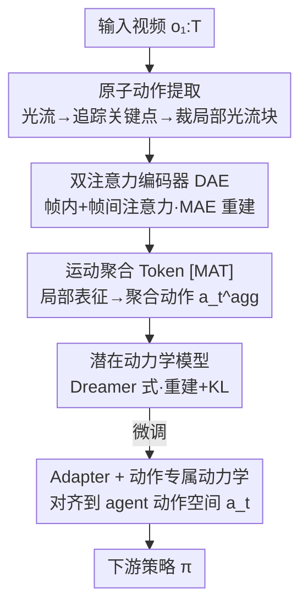

<!-- 由 tmp/gen_cvf_stubs.py 自动生成（CVF-only，无 arXiv） -->
# Local Motion Matters: A Deconstruct-Recompose Paradigm for Reinforcement Learning Pre-training from Videos

**会议**: CVPR 2026  
**论文**: [CVF Open Access](https://openaccess.thecvf.com/content/CVPR2026/html/Wang_Local_Motion_Matters_A_Deconstruct-Recompose_Paradigm_for_Reinforcement_Learning_Pre-training_CVPR_2026_paper.html)  
**领域**: 强化学习 / 视频预训练  
**关键词**: 视频预训练、强化学习、局部运动、世界模型、跨形态迁移

## 一句话总结
把视频里复杂的"整体运动"拆解成一批与身体形态无关的"原子动作"（局部光流块），用双注意力编码器学到可跨智能体迁移的局部运动表征，再通过一个可学习的聚合 token 重组进世界模型，从而在 DMControl Remastered 和 Meta-World 等下游机器人控制任务上显著提升 RL 的样本效率与最终性能。

## 研究背景与动机
**领域现状**：用大规模无标注视频给强化学习做预训练是当下提效的热门路线。主流做法分两类——一类预训练视频预测/世界模型（APV、IPV、DisWM），让下游 agent 提前理解环境动力学；另一类从帧间关系里推断"潜在动作"作为动力学因子（PreLAR、FICC、AVDC、PVDR）。

**现有痛点**：无论哪一类，它们都把智能体当成一个**不可分割的整体**，在**全局层面**建模运动。问题在于：全局运动和智能体的**形态（morphology）强耦合**——网球运动员挥拍的整体轨迹，和机械臂开抽屉的整体轨迹差异巨大。于是预训练学到的运动模式一旦换了身体形态就用不上，跨域迁移效果差。

**核心矛盾**：预训练想要"通用、可迁移"的运动知识，但全局运动建模天然把知识绑死在某一种身体形态上，二者冲突。论文的关键观察是：尽管不同智能体的**全局运动**千差万别，它们的**局部分量**却高度相似。网球前手挥拍可以拆成"手臂竖直上摆、躯干水平旋转、球的平移"这几个局部运动，而这些局部模式在很多下游任务里都能找到对应物。

**本文目标**：学到一种**与形态无关（morphology-agnostic）的局部运动表征**，让预训练知识能跨域迁移。这又分解为：(1) 怎么从视频里稳定地切出"局部运动单元"；(2) 怎么编码这些单元的时空关系；(3) 怎么把局部表征重组进下游 RL 的世界模型并对齐到具体动作空间。

**核心 idea**：用"先拆解、后重组"（Deconstruct–Recompose Paradigm, DRP）替代"全局整体建模"——拆解阶段把全局光流切成一批局部光流块（Atomic Action）并学其时空表征，重组阶段用一个聚合 token 把局部表征拼回世界模型，微调时再用 adapter 桥接到智能体自己的动作空间。

## 方法详解

### 整体框架
DRP 是一个**两阶段**框架：预训练阶段在无标注视频（Something-Something-V2）上学习可迁移的局部运动表征，微调阶段把这套表征逐步适配到下游具体智能体的动作空间。

预训练阶段又由两个相对的过程组成。**Deconstruct（拆解）**：给一段视频，先算稠密光流得到全局运动，再在前景上采样、追踪一批显著运动的关键点，在每个关键点周围裁出一个局部光流块——这就是一个"原子动作"（Atomic Action）；然后用一个双注意力编码器（DAE）以掩码自编码（MAE）的方式学这些原子动作的时空关系。**Recompose（重组）**：在每帧的 token 序列前预置一个可学习的运动聚合 token `[MAT]`，它把当帧所有局部运动表征聚合成一个"聚合动作表征" $a^{\text{agg}}_t$，再以 $a^{\text{agg}}_t$ 为动作驱动一个 Dreamer 式的潜在动力学模型，让局部表征带上动力学语义。

微调阶段（针对真实下游 agent）：缓慢微调预训练好的 DAE 与潜在动力学模型，并新引入一个 **adapter** 和一个 **Action-Specific Dynamics Model**——后者以智能体的真实动作 $a_t$ 为条件，adapter 则把预训练潜在状态映射进这个新动力学模型，从而把"通用局部运动先验"对齐到"这个 agent 的动作空间"，加速策略学习。

### 关键设计

**1. 原子动作提取：把"整体运动"切成与形态无关的局部光流块**

这一步直接针对"全局运动绑死形态"的痛点：与其建模整段全局运动，不如把它分解成一批可跨智能体复用的局部分量。具体流水线是：先用 Sea-RAFT 在相邻帧之间算稠密光流场 $F_{1:T-1}$ 表示全局运动；为了只盯住有意义的运动区域、避开静止背景，用 Grounded SAM 分割出第一帧前景 mask $M_1$，在 $M_1$ 内随机采 $K$ 个候选点，用 Co-tracker 跨帧追踪；再把时间上运动方差太低的点滤掉、重采，得到稳定关键点 $\{p^k_1\}_{k=1}^K$，重新追踪得到稳定轨迹 $\{p^k_{1:T}\}$。最后在每个时刻 $t$、以每个被追踪关键点 $p^k_t$ 为中心，从全局光流场里裁出一个 $P\times P$ 的局部光流块 $u^k_t \in \mathbb{R}^{P\times P\times 2}$，这就是一个"原子动作"。它有效是因为：局部光流块只描述"某个物理部位此刻怎么动"，剥离了整体身体结构，所以网球手臂的上摆和机械臂的上摆能落在相似的表征空间里。

**2. 双注意力编码器 DAE：分别建模局部运动的空间协同与时间演化**

光把运动切成碎块还不够，还得让模型理解"这些碎块彼此怎么配合、各自怎么随时间演化"。DAE 是个 Transformer 编码器：每个原子动作 $u^k_t$ 先被 token 化为 $\tau^k_t$，由三种 embedding 拼成——(1) 对 $u^k_t$ 做 Patch Projection 得到的内容 embedding；(2) 由关键点位置 $p^k_t$ 得到的坐标 embedding；(3) 对应时刻 $t$ 的时间 embedding；每帧序列前再预置 `[MAT]`。token 序列 $\{[MAT], \tau^1_t, \dots, \tau^K_t\}_{t=1}^T$ 过 $L$ 个双注意力块，每块含两条互补分支：**Intra-Frame Attention** 在同一时刻 $t$ 的所有 token 间做自注意力，捕捉不同局部部位之间的**空间关系**（保持空间一致性）；**Inter-Frame Attention** 对每个局部部位 $k$ 沿时间做**因果**自注意力，捕捉单个局部轨迹的**时间关系**。把空间和时间解耦成两条独立分支，比混在一起更容易学到鲁棒的局部运动表征——消融里去掉任一分支都会明显掉点。训练目标是 MAE 式重建：随机掩码一部分 token，让解码器只从可见 token 重建出原始光流块，逼模型理解局部动作之间的时空依赖。

**3. [MAT] 聚合 + 潜在动力学：把局部表征重组成可驱动世界模型的"动作"**

拆出来的是一堆局部表征，下游 RL 需要的却是能驱动动力学的"动作信号"，这一步负责把二者接上。预置的 `[MAT]` token 在每个时刻把当帧的局部运动表征聚合成一个聚合动作表征 $a^{\text{agg}}_t$。以它为动作、配合当前观测 $o_t$ 和上一步聚合动作，学一个 Dreamer 式潜在动力学模型推断潜在状态：

$$z_t \sim q_\theta\!\left(z_t \mid z_{t-1}, a^{\text{agg}}_{t-1}, o_t\right)$$

训练目标结合图像重建与 KL 正则（先验/后验对齐）：

$$\mathcal{L}_{\text{dyn}} = \mathbb{E}_{q_\theta}\!\left[\sum_{t=1}^T\Big(-\ln p_\theta(o_t\mid z_t) + \beta_z\,\mathcal{L}_z\Big)\right],\quad \mathcal{L}_z = \mathrm{KL}\!\left[q_\theta(z_t\mid z_{t-1},a^{\text{agg}}_{t-1},o_t)\,\|\,p_\theta(\hat{z}_t\mid z_{t-1},a^{\text{agg}}_{t-1})\right]$$

这一步的意义在于：经过动力学学习，局部运动表征不再只是"静态外观"，而是带上了**动力学语义**——这正是消融里"去掉本文动力学模型掉点巨大、去掉 IPV 动力学几乎无影响"的根因（见下表）。

**4. Adapter + 动作专属动力学：把通用局部先验对齐到具体 agent 的动作空间**

预训练学到的是"通用局部运动先验"，但下游每个 agent 有自己的真实动作空间，直接套用会错位。微调阶段引入一个 adapter 作为桥梁，把预训练潜在状态 $z_t$ 映射进一个新的 Action-Specific Dynamics Model，后者以智能体真实动作 $a_{t-1}$ 为条件更新自己的 agent 专属状态 $s_t$：

$$s_t \sim q_\phi\!\left(s_t \mid s_{t-1}, a_{t-1}, z_t\right)$$

其目标函数加入图像重建、奖励预测与 KL 三项（$c$ 是沿用 IPV 的上下文变量）：

$$\mathcal{L}_{\text{action}} = \mathbb{E}_{q_\phi, q_\theta}\!\left[\sum_{t=1}^T\Big(-\ln p_\theta(o_t\mid s_t, c) - \beta_r\ln p_\varphi(r_t\mid s_t) + \beta_s\,\mathrm{KL}\!\left[q_\phi(s_t\mid s_{t-1},a_{t-1},z_t)\,\|\,p_\phi(\hat{s}_t\mid s_{t-1},a_{t-1})\right]\Big)\right]$$

配合"缓慢微调 DAE 与潜在动力学"，让 `[MAT]` 学会**有选择地**重组局部表征去匹配下游 agent，既保住预训练知识又能吸收新模式，从而加速下游策略学习。

### 损失函数 / 训练策略
预训练分两步顺序执行：先做 Deconstruct（原子动作提取 + DAE 的 MAE 重建），再做 Recompose（训练潜在动力学模型 $\mathcal{L}_{\text{dyn}}$）。微调阶段渐进式适配两个过程，并以 $\mathcal{L}_{\text{action}}$ 训练 adapter 与动作专属动力学模型。所有无监督预训练 baseline 都统一在 SSV2 上预训练以保证公平比较。

## 实验关键数据

### 主实验
评测在两个有挑战性的下游机器人 benchmark 上进行：连续运动控制套件 **DMControl Remastered (DMCR)**（随机复杂图形，专门考察泛化）和机器人操作 benchmark **Meta-World**。预训练数据为 SSV2。对比对象包括 2 个 MBRL（DreamerV2/V3）和 4 个视频预训练方法（APV、IPV、PreLAR、DisWM）。主结果以学习曲线（episode return / 成功率，5 个随机种子）呈现：在 DMCR 的 Walker Run / Hopper Stand / Cheetah Run 三个任务上，DRP 在样本效率与最终性能上全面优于 baseline；在 Meta-World 六个任务上 DRP 达到 SOTA，尤其在公认困难的 "Dial Turn" 上成功掌握而 baseline 普遍挣扎，在 "Lever Pull" 等任务上最终性能也显著领先。

下表为论文给出的具体数值（DMCR，均值±标准差，return 越高越好）：

| 任务 | DRP | IPV | 关键发现 |
|------|-----|-----|---------|
| Walker Run | **681 ± 39** | 595 ± 67 | DRP 显著领先全局建模方法 |
| Hopper Stand | **796 ± 114** | 634 ± 128 | 局部表征带来更高最终回报 |

### 消融实验

**(a) 动力学模型的作用**（DMCR，Table 1，return 越高越好）：

| 配置 | Walker Run | Hopper Stand | 掉点 |
|------|-----------|-------------|------|
| DRP（完整） | 681 ± 39 | 796 ± 114 | — |
| DRP w/o dyn. | 613 ± 45 | 708 ± 106 | ↓10.0% / ↓11.1% |
| IPV | 595 ± 67 | 634 ± 128 | — |
| IPV w/o dyn. | 586 ± 61 | 628 ± 134 | ↓1.5% / ↓0.9% |

**(b) 其他消融**（学习曲线给出，无数值表）：

| 配置 | 关键指标 | 说明 |
|------|---------|------|
| Global Flow（用卷积编码整张全局光流） | 明显低于 DRP | 验证 Q2：局部拆解对跨域迁移至关重要，全局建模甚至不如 IPV |
| w/o Intra-Atten | 明显掉点 | 去掉帧内注意力，丢失局部部位间空间关系 |
| w/o Inter-Atten | 明显掉点 | 去掉帧间注意力，丢失单个局部轨迹的时间关系 |
| DRP w/o pre（从零训练） | 明显掉点 | 验证预训练先验的价值 |
| IPV pre DRP ft（全局预训练+本文微调） | 低于 DRP | 隔离出"局部预训练"本身的增益 |

### 关键发现
- **动力学语义是迁移的关键**：去掉 DRP 自己的动力学模型 return 掉 10–11%，而去掉 IPV 的动力学只掉约 1%——说明 DRP 学到的是带动力学语义、可迁移的运动模式，而 baseline 主要停在静态表征。
- **局部 vs 全局是分水岭**："Global Flow" 变体（把整张全局光流编码成单个 embedding）不仅输给 DRP，甚至相对同样做全局图像建模的 IPV 也没优势，强证据表明全局建模与形态强耦合、阻碍跨域迁移。
- **双注意力两条分支缺一不可**：帧内注意力管空间协同、帧间注意力管时间演化，去掉任一条都显著掉点。
- **跨域零样本预测更准**：开环视频预测里，DRP 在源域能更准确预测手的形状与消失；在 Meta-World 零样本设定下能保住机械臂形状、还能捕捉对操作至关重要的夹爪，而 IPV / PreLAR 出现机械臂形变、夹爪消失。

## 亮点与洞察
- **"局部运动跨形态相似"这个观察很扎实**：把网球挥拍拆成"手臂上摆/躯干旋转/球平移"再迁移到机械臂，是个直觉强、又能落地成光流块的好切入点——比抽象的"潜在动作"更可解释。
- **用现成视觉工具搭拆解流水线很务实**：Sea-RAFT（光流）+ Grounded SAM（前景）+ Co-tracker（追踪）+ 运动方差过滤，零额外标注就能稳定切出原子动作，这套组合可直接复用到其他"需要局部运动单元"的任务。
- **空间/时间注意力解耦 + `[MAT]` 聚合 token**：把"局部部位间空间关系"和"单部位时间轨迹"拆成两条分支，再用一个可学习 token 把碎片重组成可驱动世界模型的动作，这种"先解构再聚合"的结构可迁移到视频表征、模仿学习等场景。
- **消融设计干净**：用 ∆dyn. 对比 DRP 与 IPV 去掉动力学后的掉点幅度，直接量化出"本文表征带动力学语义、baseline 是静态表征"，比单看绝对分数更有说服力。

## 局限与展望
- **拆解流水线依赖多个外部预训练模型**（Sea-RAFT / Grounded SAM / Co-tracker），其失败（如光流不准、前景分割漏检、追踪漂移）会直接污染原子动作质量，论文未系统分析这一鲁棒性。
- **关键点采样与过滤含超参**（采样数 $K$、运动方差阈值、patch 大小 $P$），对不同视频域的敏感性缺乏充分扫描。
- **主结果以学习曲线为主、表格化数值少**：除 Table 1 外，多数对比靠 Figure 的曲线呈现，难以精确复核各任务的最终数值与方差。
- **下游评测集中在仿真**（DMCR、Meta-World），尚未验证真实机器人；"局部运动跨形态相似"在更剧烈形态差异（如足式 vs 飞行器）下能否成立也有待检验。
- 可改进方向：把原子动作的提取做成可端到端学习（而非依赖固定外部工具链），以及探索局部运动单元数 $K$ 的自适应选择。

## 相关工作与启发
- **vs IPV / APV（视频预测式预训练）**：它们在全局层面建世界模型，运动表征与形态强耦合；DRP 把全局运动解构成局部光流块，学与形态无关的表征，消融显示去掉本文动力学掉 10%+、去掉 IPV 动力学几乎不掉，说明 DRP 表征更"动态、可迁移"。
- **vs PreLAR / FICC（潜在动作建模）**：它们从帧间关系推断抽象潜在动作，但仍是全局建模；DRP 的"原子动作"是具象的局部光流块，更可解释，且跨域预测里能保住机械臂形状与夹爪。
- **vs Dreamer 系列（MBRL）**：Dreamer 从零训练、需大量在线交互；DRP 复用其潜在动力学结构但叠加视频预训练的局部运动先验，显著提样本效率。
- **vs "Global Flow" 自建基线**：把整张全局光流压成单个 embedding 条件化动力学，结果不如 DRP 甚至不如 IPV，反向印证"局部拆解"才是跨域迁移的关键。

## 评分
- 新颖性: ⭐⭐⭐⭐ "全局运动→局部原子动作"的解构-重组视角在视频预训练 RL 里是清晰且少见的切入。
- 实验充分度: ⭐⭐⭐⭐ 两个 benchmark、六类 baseline、5 个种子、5 个研究问题的消融较完整，但多数结果靠曲线、表格化数值偏少。
- 写作质量: ⭐⭐⭐⭐ 动机—方法—消融逻辑顺，Q1–Q5 组织清晰；部分公式在缓存里有渲染噪声需对原文核对。
- 价值: ⭐⭐⭐⭐ 提供了一套零标注、可复用的局部运动表征预训练范式，对提升下游 RL 样本效率有实际意义。

<!-- RELATED:START -->

## 相关论文

- [\[ICLR 2026\] Unsupervised Learning of Efficient Exploration: Pre-training Adaptive Policies via Self-Imposed Goals](../../ICLR2026/reinforcement_learning/unsupervised_learning_of_efficient_exploration_pre-training_adaptive_policies_vi.md)
- [\[ICML 2025\] Online Pre-Training for Offline-to-Online Reinforcement Learning](../../ICML2025/reinforcement_learning/online_pre-training_for_offline-to-online_reinforcement_learning.md)
- [\[ICLR 2026\] ReMoT: Reinforcement Learning with Motion Contrast Triplets](../../ICLR2026/reinforcement_learning/remot_reinforcement_learning_with_motion_contrast_triplets.md)
- [\[CVPR 2026\] Reinforce to Learn, Elect to Reason: A Dual Paradigm for Video Reasoning](reinforce_to_learn_elect_to_reason_a_dual_paradigm_for_video_reasoning.md)
- [\[CVPR 2026\] DreamSAC: Learning Hamiltonian World Models via Symmetry Exploration](dreamsac_learning_hamiltonian_world_models_via_symmetry_exploration.md)

<!-- RELATED:END -->
