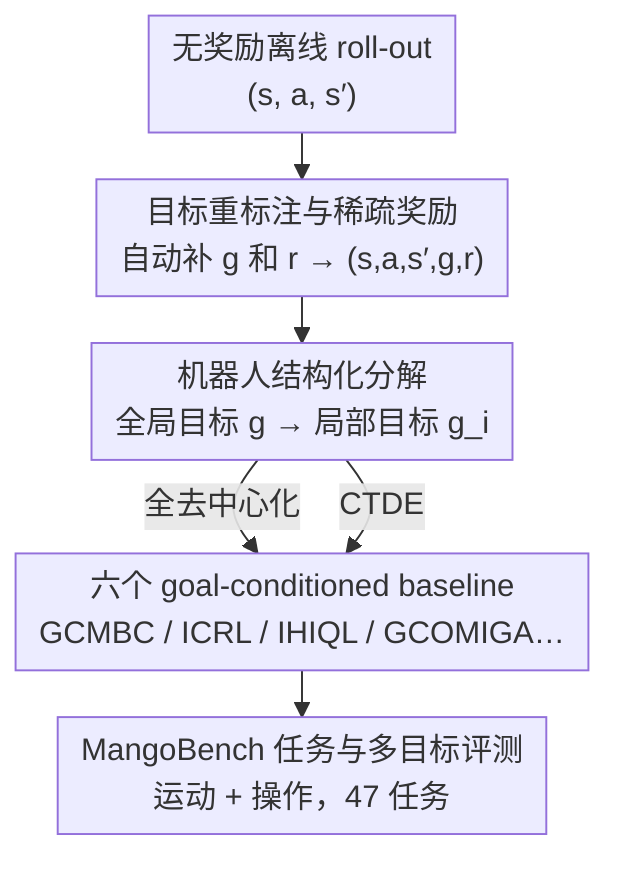

# MangoBench: A Benchmark for Multi-Agent Goal-Conditioned Offline Reinforcement Learning

**会议**: CVPR 2026  
**论文**: [CVF Open Access](https://openaccess.thecvf.com/content/CVPR2026/html/Wang_MangoBench_A_Benchmark_for_Multi-Agent_Goal-Conditioned_Offline_Reinforcement_Learning_CVPR_2026_paper.html)  
**领域**: 强化学习 / 多智能体 / 离线RL  
**关键词**: 离线多智能体RL, 目标条件RL, 稀疏奖励, 基准测试, CTDE

## 一句话总结
本文把单智能体的「离线目标条件 RL（OGCRL）」首次扩展到多智能体协作场景，提出基于目标重标注 + 机器人结构化分解的 goal-conditioned 离线 MARL 框架，并配套发布 MangoBench——首个面向该设定的全协作多目标基准（3 个环境、4 类智能体、47 个任务、6 个 baseline），实验显示分层策略的 IHIQL 在稀疏奖励下泛化最好但无方法通吃所有任务。

## 研究背景与动机
**领域现状**：离线多智能体强化学习（Offline MARL）只用预先采集的数据集学策略，避免了在真实物理环境里做昂贵、危险的在线探索，对自动驾驶、协作机器人、智能电网等场景很有吸引力。

**现有痛点**：现有离线 MARL 有两个老毛病。其一是**奖励敏感**——RL 以最大化累计奖励为目标，奖励函数稍有扰动，学到的策略就可能剧烈漂移；其二是**泛化弱**——方法严重依赖任务专属的手工奖励，一旦换个目标或换个环境就废了。这让离线 MARL 很难真正落地。

**核心矛盾**：单智能体那边其实已经有了解药。OGCRL（Offline Goal-Conditioned RL）通过「目标重标注 + 随机目标采样」，把数据集里每条轨迹都变成「任意状态 → 任意目标」的学习样本，极大丰富了 state-goal 组合、提升了泛化；同时它把奖励简化为「到达目标记 0、否则记 −1」，几乎不需要设计奖励。但这套范式一直停留在单智能体，**多智能体版本没人做过**，连能评测它的 benchmark 都没有——现有 MARL benchmark 几乎都是在线、密集奖励、单目标评测，跟「离线 + 稀疏目标奖励 + 多目标泛化」的需求完全对不上。

**本文目标**：回答一个自然的问题——能不能把离线 MARL 扩展到目标条件设定，从而一并干掉它的奖励敏感和泛化弱？这又拆成两个子问题：(1) 怎么把 OGCRL 算法迁到多智能体（既要全去中心化、也要 CTDE）；(2) 怎么造一个能公平评测这个新设定的基准。

**核心 idea**：把全局目标按机器人身体结构「分解」成各智能体的局部目标，配合目标重标注与稀疏的 goal-related 奖励，让每个智能体在只看局部信息的前提下也能学 goal-conditioned 策略；并把这一整套打包成 MangoBench 基准 + 6 个 baseline。

## 方法详解

### 整体框架
本文其实是「一个新设定（goal-conditioned 离线 MARL）+ 一套适配它的 baseline + 一个评测基准」三位一体。整体管线是：拿到无奖励的离线 roll-out 数据 `(s, a, s′)` → 通过**目标重标注**自动补出目标 `g` 和稀疏奖励 `r`，凑成完整五元组 `(s, a, s′, g, r)` → 通过**机器人结构化分解**把全局状态/目标拆成各智能体的局部观测 `o_i` 和局部目标 `g_i` → 在**全去中心化**或 **CTDE** 两种范式下训练 6 个 goal-conditioned baseline → 在**多目标评测协议**下统计成功率。整个 MangoBench 覆盖关节联控的运动（locomotion）与多实体双臂操作（manipulation）两大类任务。

### 关键设计

**1. 目标重标注与稀疏奖励：把无奖励数据自动变成可学的目标条件样本**

离线 MARL 最大的负担是手工奖励/目标设计，本文直接把它去掉。借鉴 OGCRL，对数据集里任意一条轨迹做目标重标注：随机采样一个目标 `g`，再用一条极简规则自动生成奖励——状态到达目标记 `r_1`、否则记 `r_2`（典型取 `r_1=0, r_2=-1`）。于是给定任何 roll-out `(s, a, s′)`，立刻就能凑出完整五元组 `(s, a, s′, g, r)`，不需要任何人工奖励工程。形式上整个问题被定义为一个去掉奖励的部分可观测马尔可夫博弈 $M = \langle \mathcal{N}, S, \{A_i\}_{i=1}^N, P, \gamma\rangle$ 加一个无标注数据集 $D$，学习目标是让每个智能体的 goal-conditioned 策略 $\pi_i(a_i \mid o_i, g_i)$ 最大化期望折扣回报：

$$\max_{\pi_i}\ \mathbb{E}_{(o_i^t, a_i^t, o_i^{t+1}, g_i)\sim D}\Big[\sum_{t=0}^{\infty}\gamma^t\, r(o_i^t, g_i)\Big].$$

这一步之所以关键，是因为它同时治好了两个老毛病：稀疏的二值目标奖励不再对扰动敏感，随机目标采样又把单条轨迹扩展成海量 state-goal 组合，天然带来多目标泛化能力。作者据此论证这是「最适合大规模采集多智能体数据」的设定——不需要手设奖励或目标，数据采集可以无限 scale。

**2. 机器人结构化分解：把全局目标拆成各智能体的局部目标，让去中心化执行成立**

多智能体的难点在于每个智能体只能看到局部观测 `o_i`，却要服务一个全局目标。本文按机器人身体结构做一次结构化分解：把全局状态/目标拆成与各智能体负责部位对应的局部目标 `g_i`。运动任务里，一个 ant 机器人被切成不同关节组——`2 agents × 4 joints`（左右或前后分组）、`2 agents × 4 joints (D)`（对角线交叉分组，协调更难）、`4 agents × 2 joints`（每条腿一个智能体，协调要求最高）；全局目标对应 ant 的完整关节状态，局部目标则由各身体部位对应的局部关节导出。操作任务里，每个机械臂的局部视觉观测被随机采样为局部目标，全局目标则取包含双臂与环境的全局视觉观测。

奖励也跟着这个分解走，分两种形态。**多实体任务**用局部奖励，刻画每个实体各自的贡献：

$$r(o_i, g_i) = \begin{cases} r_1, & o_i \in \mathrm{GoalStates}(g_i),\\ r_2, & \text{otherwise};\end{cases}$$

**关节联控任务**用全局奖励，衡量整个控制系统的协同效果，并把同一个标量奖励广播给所有智能体，保证各控制模块同步优化：

$$r(o, g) = \begin{cases} r_1, & o \in \mathrm{GoalStates}(g),\\ r_2, & \text{otherwise}.\end{cases}$$

这样设计的好处是：局部目标让每个智能体只盯住一小块状态-动作子空间，学习复杂度下降，对随机转移的估计也更容易；而全局奖励广播保证大家朝同一个集体目标使劲，避免各自为政。

**3. 两种训练范式：全去中心化 vs CTDE，权衡协调能力与训练稳定性**

为了系统覆盖，本文在两种范式下都给出统一目标。**全去中心化**下每个智能体只用本地观测、动作、目标学自己的策略，训练和执行都不依赖通信，梯度为 $\nabla_{\theta_i} J_i = \mathbb{E}_{(o_i,a_i,g_i)\sim D}[\nabla_{\theta_i}\log\pi_i(a_i\mid o_i, g_i)\, Q_i(o_i, a_i, g_i)]$；**CTDE**（中心化训练、去中心化执行）下执行时仍只用局部信息，但训练时让 critic 看到联合观测/动作/目标，梯度换成中心化值函数 $Q_i(o, a, g)$，从而在训练期捕捉智能体间交互。这一对范式不是摆设——后文实验正是靠对比 IHIQL（去中心化）与 HIQL-CTDE 得出「CTDE 在这个设定里收益微弱、还更不稳定」的结论，最终大多数 baseline 选了去中心化。

**4. 六个 baseline + MangoBench 基准：给空白领域立第一组标尺**

由于这个设定此前完全没有专用算法，本文一次性补齐 6 个 baseline 作为研究基线：GCMBC（goal-conditioned 多智能体行为克隆，代表数据集本身的行为水平）、ICRL（独立对比 RL，评测对比式值学习在稀疏奖励下的效果）、IHIQL 与 HIQL-CTDE（把 SOTA 的分层 HIQL 分别扩到去中心化和 CTDE，用分层策略抗稀疏奖励、做长时序推理）、GCOMIGA 与 GCOMAR（把现有离线 MARL 的 OMIGA/OMAR 通过目标重标注改成 goal-conditioned 版本，用来检验旧离线 MARL 能否扛住稀疏奖励噪声）。

基准本身（MangoBench）则解决「没东西可评」的痛点：3 个环境、4 类智能体、45 个运动任务 + 2 个操作任务，运动部分复用 OGBench 的 AntMaze（medium/large/giant/teleport 四种迷宫）与 Ant-Soccer（Arena/Maze），数据集沿用 OGBench 的 Navigate/Stitch/Explore 三种质量；操作部分把 RoboFactory 数据集改造成标准 MDP 格式（lift-barrier 同步双臂、place-food 异步双臂）。每个任务都用 **5 个预定义目标**做多目标评测，操作任务结果对 100 个随机种子取平均——这正是它相对旧 benchmark 的核心差异：旧基准用单一固定目标，评不出 goal-conditioned 策略的泛化。

## 实验关键数据

### 与现有多智能体环境对比
| 环境 | 类型 | 多目标 | 随机性 | 任务数 | 奖励设计 |
|------|------|--------|--------|--------|----------|
| VMAS | 协作+竞争 | 否 | 否 | 27 | 按场景定制 |
| SMACv2 | 协作 | 否 | 是 | 15 | 基于伤害/击杀+胜利奖励 |
| MPE | 协作+竞争 | 否 | 否 | 9 | 多基于到地标距离 |
| MA-MUJOCO | 协作 | 否 | 否 | 14 | 复用单智能体密集速度/位移奖励 |
| **MangoBench（本文）** | 协作 | **是** | **是** | **47** | **仅看状态是否到达目标的简单奖励** |

MangoBench 是表中唯一同时具备「多目标 + 随机性 + 简单通用奖励」的基准，任务数也最多。

### 去中心化 vs CTDE（AntMaze-navigate 成功率 %）
| 数据集 | IHIQL（去中心化） | HIQL-CTDE | IGCIVL | GCIVL-CTDE |
|--------|------|------|------|------|
| medium(2x4) | 95.1 ± 1.6 | 74.0 ± 0.6 | 76.0 ± 3.4 | 75.0 ± 4.2 |
| large(2x4d) | 92.2 ± 2.1 | 51.2 ± 1.7 | 26.0 ± 0.6 | 21.2 ± 1.1 |
| giant(2x4) | 57.3 ± 2.1 | 1.4 ± 0.8 | 0.0 ± 0.0 | 0.0 ± 0.0 |
| teleport(2x4) | 46.8 ± 1.7 | 27.6 ± 2.3 | 37.8 ± 2.0 | 37.9 ± 0.2 |

IHIQL 全面碾压 HIQL-CTDE，尤其在 giant 这种大尺度长时序任务上 CTDE 几乎归零（1.4%）。作者归因于 HIQL-CTDE 为了用全局状态需要两套独立的目标表示网络（一套给中心化值函数、一套给去中心化异构 actor），多网络联合优化随问题复杂度上升而严重不稳定。而对比 IGCIVL（IHIQL 的扁平单 actor 简化版）与 GCIVL-CTDE 时两者表现接近、后者训练还更稳，进一步说明退化主要来自分层结构复杂度、而非 CTDE 范式本身。

### 单目标 vs 多目标评测（lift-barrier，成功率 %）
| 评测方式 | IHIQL | GCMBC | ICRL |
|----------|-------|-------|------|
| 单目标 | 78% | 22% | 37% |
| 多目标 | 82% | 47% | 56% |

多目标评测下成功率普遍高于单目标，印证「只用单一目标评 goal-conditioned 策略会得出偏颇结论」——这正是 MangoBench 要补的缺口。

### 关键发现
- **分层是抗稀疏奖励的关键**：IHIQL 凭分层策略缓解稀疏奖励噪声，成为该设定的 SOTA；而把旧离线 MARL 改造的 GCOMIGA/GCOMAR 在多数任务直接失败，原因就是无法应对稀疏奖励引入的值函数噪声。
- **无方法通吃**：没有任何一个算法在所有任务上一致领先，作者认为这恰恰说明该方向的内在复杂度与未被开发的潜力。
- **多智能体不输甚至超过单智能体**：在 antmaze-teleport-explore、antmaze-large-stitch 等任务上，多智能体变体成功率显著更高；teleport 全系列里多智能体 IHIQL 稳定胜过单智能体 HIQL，因为去中心化让每个智能体只管局部子空间、更容易估计随机转移。
- **视觉反而比状态输入好**：操作任务里 baseline 在视觉输入下表现更好、状态输入下反而失败，与模仿学习的结论相反；作者认为视觉捕捉了超出自身状态的环境上下文，让 RL 更懂与环境的交互（图像降到 64×64 仍表现强）。
- **效率惊人**：lift-barrier 上 IHIQL 比模仿学习 DP 高 41.4%，却只用 5% 训练时间；place-food 上 ICRL 比 DP 高 75%、训练快 93%。
- **暴露协调短板**：在 Ant-Soccer 这类带外部物体（球）的任务上，性能相比单智能体明显下滑、GCOMIGA/GCOMAR 完全失败——球引入了智能体内在状态里没有的外部依赖，让协同控制更难，说明该基准能有效暴露协调难题。

## 亮点与洞察
- **把单智能体的「免奖励工程」红利迁到多智能体**：目标重标注 + 二值稀疏奖励让数据采集可以无限 scale（任意 roll-out 都能补全五元组），这套思路可迁移到任何缺标注、难设奖励的多机器人协作数据集。
- **结构化身体分解作为天然的目标分解器**：用机器人物理结构（哪些关节归哪个智能体）直接定义局部目标，比凭空设计目标分解更有物理意义，也让去中心化执行真正成立。
- **一个反直觉结论很有价值**：CTDE 在 goal-conditioned 离线 MARL 里不但收益微弱，分层版本（HIQL-CTDE）还因多网络联合优化而崩，提醒后续工作别盲目上 CTDE。
- **多目标评测的必要性被量化坐实**：同一算法在不同目标下成功率能从 0 跳到 1（IHIQL 在某目标满分但均值仅 49.6），单目标评测会系统性高估或低估能力。

## 局限与展望
- **本质是「框架 + 基准 + baseline」而非新 SOTA 算法**：6 个 baseline 都是已有 OGCRL/离线 MARL 算法的目标条件改造版，缺一个专为该设定原生设计的强方法。
- **协调能力仍是硬伤**：带外部物体的 Ant-Soccer 任务普遍掉点，作者自己也承认现有方法难以同时维持运动稳定与物体操控；未来可在 CTDE 下改进全局协调以处理动态物体交互。
- **任务分布偏运动**：45 个运动 + 仅 2 个操作任务，操作侧覆盖偏薄，难以充分检验复杂双臂/多臂场景。
- **奖励形态较粗**：二值 0/−1 奖励虽简单泛化，但对需要精细过程信号的任务可能信息量不足，长时序信用分配仍依赖分层策略硬扛。

## 相关工作与启发
- **vs OGBench / OGCRL（单智能体）**：本文直接复用 OGBench 的 AntMaze/Ant-Soccer 环境与数据集划分，并把 HIQL、CRL、GCBC 等单智能体 OGCRL 算法扩成多智能体版（IHIQL、ICRL、GCMBC）；区别在于引入结构化身体分解与局部/全局目标，把单体策略变成多智能体协作策略。
- **vs 现有 MARL benchmark（VMAS/SMACv2/MPE/MA-MUJOCO 等）**：它们都是在线、密集任务专属奖励、单目标评测，评不了离线 + 稀疏目标奖励 + 多目标泛化；MangoBench 是首个面向 goal-conditioned 离线 MARL 的全协作多目标基准。
- **vs 离线 MARL（OMIGA/OMAR）**：本文把它们改成 goal-conditioned 版（GCOMIGA/GCOMAR）并发现其在稀疏奖励下大面积失败，反衬出分层 goal-conditioned 方法（IHIQL）的优势。
- **vs 模仿学习（Diffusion Policy）**：在操作任务上，本文的 RL baseline 以远低的训练成本超过 DP，且在视觉输入下优势更明显——因为 RL 能利用失败样本并超出数据集行为，而模仿学习只复刻数据集内行为。

## 评分
- 新颖性: ⭐⭐⭐⭐ 首次把目标条件离线 RL 系统扩到多智能体并配套首个对应基准，设定本身是空白填补；扣分在算法是已有方法的改造而非原生新方法。
- 实验充分度: ⭐⭐⭐⭐ 覆盖 47 任务、6 baseline、去中心化 vs CTDE、单/多目标、状态/视觉等多维对比，结论扎实；操作任务数偏少。
- 写作质量: ⭐⭐⭐⭐ 动机链条清晰、表格论证到位，问题定义形式化规范；部分关键超参与算法细节放在附录略影响自洽。
- 价值: ⭐⭐⭐⭐ 给一个有应用前景的空白方向立了标尺与基线，对协作机器人离线学习的后续研究有明确推动作用。

<!-- RELATED:START -->

## 相关论文

- [\[ICML 2026\] Latent Representation Alignment for Offline Goal-Conditioned Reinforcement Learning](../../ICML2026/reinforcement_learning/latent_representation_alignment_for_offline_goal-conditioned_reinforcement_learn.md)
- [\[ICML 2026\] Compositional Transduction with Latent Analogies for Offline Goal-Conditioned Reinforcement Learning](../../ICML2026/reinforcement_learning/compositional_transduction_with_latent_analogies_for_offline_goal-conditioned_re.md)
- [\[CVPR 2026\] TaskForce: Cooperative Multi-agent Reinforcement Learning for Multi-task Optimization](taskforce_cooperative_multi-agent_reinforcement_learning_for_multi-task_optimiza.md)
- [\[AAAI 2026\] First-Order Representation Languages for Goal-Conditioned RL](../../AAAI2026/reinforcement_learning/first-order_representation_languages_for_goal-conditioned_rl.md)
- [\[ICML 2026\] LLM-Guided Communication for Cooperative Multi-Agent Reinforcement Learning](../../ICML2026/reinforcement_learning/llm-guided_communication_for_cooperative_multi-agent_reinforcement_learning.md)

<!-- RELATED:END -->
