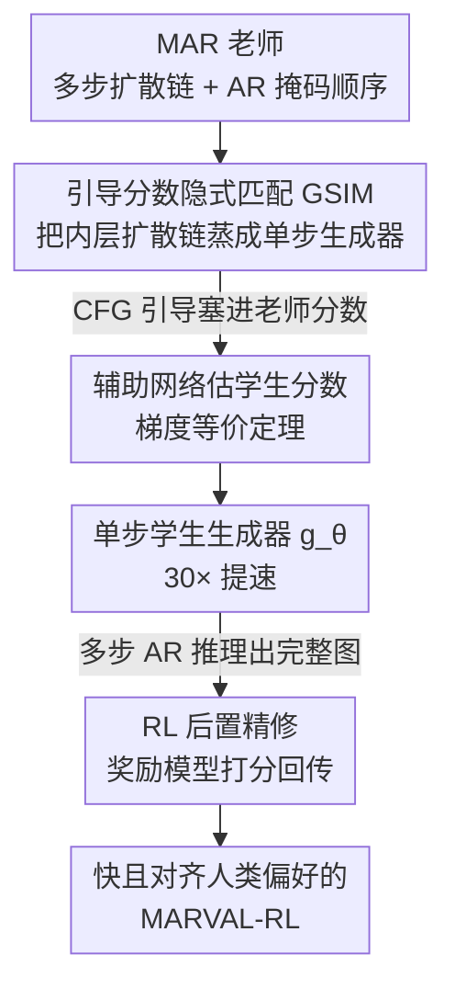

# Masked Auto-Regressive Variational Acceleration: Fast Inference Makes Practical Reinforcement Learning

**会议**: CVPR 2026  
**论文**: [CVF Open Access](https://openaccess.thecvf.com/content/CVPR2026/html/Gu_Masked_Auto-Regressive_Variational_Acceleration_Fast_Inference_Makes_Practical_Reinforcement_Learning_CVPR_2026_paper.html)  
**代码**: 待确认（项目页 https://ai4scientificimaging.org/MARVAL-RL/）  
**领域**: 强化学习 / 扩散模型 / 自回归生成  
**关键词**: MAR、扩散蒸馏、单步生成、分数蒸馏、RLHF

## 一句话总结
MARVAL 用一种带 CFG 引导的分数隐式匹配（GSIM）把 Masked Auto-Regressive 扩散模型内部那条几十上百步的扩散去噪链压成"一步生成"，在 ImageNet 256×256 上做到 FID=2.00、比 MAR 快 30 倍以上，并借助这次提速第一次让 MAR 类模型能跑可验证奖励的强化学习后训练，把 CLIP / ImageReward 这类人类偏好分数显著提上去。

## 研究背景与动机

**领域现状**：自回归（AR）模型和扩散模型各有长短——扩散保真度高、覆盖模式全，但要几百步去噪；AR 在离散空间顺序生成，天然适配 RL 和语言对齐框架，但高分辨率下感知质量打不过扩散。近期 AR+Diffusion 混合架构想兼收两者之长，其中 Masked Auto-Regressive（MAR）是代表作：把图像 latent 切成 $n$ 个 token，随机掩码一部分，用未掩码 token 作条件训一个轻量扩散头去预测被掩码 token，靠随机的掩码顺序拿到灵活的生成次序。

**现有痛点**：MAR 推理是个"嵌套双层循环"——外层是逐步揭开掩码的 AR 循环（把 token 索引随机划成 $S_1,\dots,S_K$，一组组预测），内层是给每组 token 跑一条完整的扩散去噪链。外层 $N$ 次迭代 × 内层 $T$ 步去噪，乘起来就是几千次网络前向，MAR-B 生成一张图要 20 秒。这慢不只是体验问题：它直接把 RL 后训练堵死了——RL 要反复采样、按奖励回传梯度，采一次就要 20 秒的模型根本没法做可扩展的偏好对齐。

**核心矛盾**：MAR 的表达力恰恰来自"内层那条扩散链"，但这条链也正是推理慢、RL 不可行的根源。想保留 AR 的灵活掩码顺序和扩散的高保真，又想要快和能 RL，二者在原始 MAR 架构里互相打架。

**本文目标**：在不牺牲样本质量、不破坏 AR 掩码顺序的前提下，①把内层多步扩散链压成单步；②基于这次提速，给 MAR 配上一套实际可跑的 RL 后训练。

**切入角度**：作者注意到 Score Implicit Matching（SIM）这类无数据单步蒸馏技术——直接对齐师生两个网络的分数函数，就能把多步扩散老师蒸成单步学生。但 MAR 推理时用 classifier-free guidance（CFG），普通 SIM 对齐的是无引导分布，与 MAR 真正采样的 CFG 引导分布不一致，直接套会蒸歪。于是作者把 CFG 引导显式塞进分数匹配目标里。

**核心 idea**：用"带引导的分数隐式匹配（GSIM）"把 MAR 内层扩散链蒸成单步学生生成器，再把这个快学生当策略、用奖励模型做一段独立的后置 RL 精修——蒸馏负责"快且像老师"，RL 负责"更对人类口味"。

## 方法详解

### 整体框架
MARVAL 要解决的是"把慢的多步 AR 生成变快、再用 RL 精修"，整条管线分两阶段串行：**Stage 1 蒸馏**把 MAR 老师内层那条 $T$ 步扩散去噪链蒸成单步学生生成器 $g_\theta(z,c)$（$z$ 是高斯噪声，$c$ 是来自未掩码 token / 类别嵌入 / 掩码位置嵌入的自回归上下文）；**Stage 2 RL 精修**把蒸好的 $g_\theta$ 当策略，让它按 MAR 那样跑多步 AR 推理生成完整图，再用奖励模型按文本 prompt 打分、回传梯度精修。关键是两阶段**不能合并**：蒸馏时只跑单次 AR 迭代、产出的是低保真中间图，若此时就上 RL，奖励模型评的是这些半成品而非最终多轮结果，梯度会误导、策略优化会崩——所以 RL 必须是作用在蒸好模型上的、独立的后置阶段。

### 关键设计

**1. 引导分数隐式匹配 GSIM：把"师生分布对齐"变成可优化的引导分数匹配**

这一步针对的就是"内层扩散链太慢"。作者想让单步学生分布 $q_\theta(x\mid c)$ 逼近老师分布 $p(x\mid c)$，自然目标是最小化 KL 散度 $\mathbb{E}_{c}[D_{KL}(q_\theta\Vert p)]$，但 KL 本身不可解。借助 Uni-instruct 的结论——在温和正则条件下 KL 等于沿扩散过程的 Fisher 散度积分——把目标改写成对时间 $t$ 积分的师生分数差：

$$D_{KL}(q_\theta\Vert p)=\tfrac{1}{2}\int_0^T g^2(t)\,\mathbb{E}_{x_t\sim q_{\theta,t}}\big[\,\Vert \nabla_{x_t}\log q_{\theta,t}(x_t\mid c)-s_{p_t}(x_t,c)\Vert_2^2\,\big]\,dt$$

学生分数 $\nabla_{x_t}\log q_{\theta,t}$ 不可解，用一个辅助网络 $S_\phi(x_t,t,c)$ 在学生当前重建样本上用标准去噪分数匹配训出来近似。关键的"Guided"在于：MAR 推理用 CFG，所以老师分数必须是 CFG 引导后的分数，而非裸分数——作者定义 $s_{p_t}(x_t,c)=(1+w)\,S_p(x_t,t,c)-w\,S_p(x_t,t,\varnothing)$（$w$ 是引导尺度，$\varnothing$ 是空条件）。这保证学生学的正是 MAR 推理时真正在采样的那个 CFG 分布，而不是普通蒸馏对齐的无引导分布——这是它区别于直接套 SIM 的核心。

**2. 梯度等价定理 + Pseudo-Huber 距离：让不可解的分数散度梯度变得可算且训练稳**

光有目标还不够，分数散度对 $\theta$ 的梯度涉及学生分数对参数的导数，直接算不动。作者搬来梯度等价定理（stop-gradient 记作 $\mathrm{sg}[\cdot]$）：在温和正则条件下，把目标对 $\theta$ 的梯度等价改写成一个可算的代理目标 $L_{GSIM}=L_1+L_2$，其中

$$L_1=-\{d'(y_t)\}^T\big(s_{q_{\mathrm{sg}[\theta]},t}(x_t,c)-\nabla_{x_t}\log p_t(x_t\mid x_0,c)\big),\quad L_2=d(y_t),\quad y_t=s_{q_{\mathrm{sg}[\theta]},t}(x_t,c)-s_{p_t}(x_t,c)$$

$s_{q_{\mathrm{sg}[\theta]},t}$ 由辅助网络 $S_\phi$ 近似，训练在"更新生成器 $\theta$"和"用去噪分数匹配更新辅助网 $\phi$"之间交替。理论上 $d(\cdot,\cdot)$ 取平方 $\ell_2$ 才能精确还原 KL，但实测会训练不稳，于是改用 Pseudo-Huber 距离 $d(y_t)=\sqrt{\Vert y_t\Vert_2^2+r^2}-r$（$r=10^{-5}$）来提稳和加速收敛。正是这套交替优化让"单步蒸馏"在 MAR 的掩码自回归框架里真正落地。

**3. 后置 RL 精修：把单步生成器当策略、用奖励直接回传修人类偏好**

GSIM 蒸出的学生虽然像老师，但老师分布本身就可能偏离人类偏好，加上 AR 多轮的累积误差，细节仍糊。作者把蒸好的 $g_\theta$ 当策略：给定类别嵌入 $c_{emb}$，让它按 MAR 方式跑 $K$ 步 AR 生成完整图 $x_g=G_\theta(z,c_{emb},K)$（用 $G_\theta$ 区别于单次迭代的 $g_\theta$），这一整张图算一个"动作"。再用预训练奖励模型按 prompt 打分，目标是最大化期望奖励，即最小化

$$L_{RL}=-\mathbb{E}_{c_{emb},z}\big[R(G_\theta(z,c_{emb},K),\,\text{prompt}_c)\big]$$

prompt 由类名拼成（如"a high-quality and harmonious picture of {frog}"），奖励模型用 PickScore。之所以必须等多步 AR 出完整图再打分（而不是在蒸馏阶段顺手做），就是前面说的：单步中间图是低保真半成品，对它打分会给出误导梯度。把 RL 拆成独立后置阶段，奖励信号才对应推理时的真实感知质量，梯度直接经奖励回传精修 $\theta$。

### 损失函数 / 训练策略
蒸馏阶段交替优化两套参数：生成器 $\theta$ 用 $L_{GSIM}=L_1+L_2$、辅助网 $\phi$ 用去噪分数匹配 $L_{auxiliary}$。沿用 MAR 设置：cosine 噪声调度、1000 训练步、轻量 MLP 去噪头预测噪声 $\varepsilon$。三个规模 Base（208M）/ Large（479M）/ Huge（943M）各在 8×A800 上蒸 30 epoch（约 3 天），RL 精修再 5 epoch（约 2 天）。CFG 尺度 $w$ 在蒸馏阶段手动设，最终选 $w=1.2$。

## 实验关键数据

### 主实验
ImageNet 256×256 类条件生成系统级对比（推理时间在单张 A100、batch=1 下测）：

| 类别 | 模型 | FID↓ | IS↑ | 推理时间 |
|------|------|------|-----|----------|
| 像素扩散 | ADM | 4.59 | 186.7 | 115.67 s |
| 连续 token | DiT-XL/2 | 2.27 | 278.2 | 6.62 s |
| 掩码自回归 | MAR-B (w=2.9) | 2.60 | 222.7 | 20.10 s |
| 掩码自回归 | MAR-H (w=3.2) | **2.06** | 247.7 | 30.98 s |
| 仅蒸馏 | MARVAL-B | 3.06 | 220.2 | **0.61 s** |
| 仅蒸馏 | MARVAL-L | 2.51 | 247.1 | 0.97 s |
| 仅蒸馏 | MARVAL-H | **2.00** | 256.3 | 1.67 s |

MARVAL-H 用 FID=2.00 略胜 MAR-H 的 2.06，推理却从 30.98 s 降到 1.67 s；MARVAL-B 比 MAR-B 整体快约 32.95×（内层扩散采样本身加速近 100×，叠加外层 AR 后约 32.95×）。

### 消融实验
CFG 尺度对蒸馏结果的影响（MARVAL-B）以及 RL 前后奖励指标：

| 配置 | 关键指标 | 说明 |
|------|---------|------|
| MARVAL-B, $w=1$（无 CFG） | FID 3.75 / IS 182.1 | 不引导，保真低 |
| MARVAL-B, $w=1.2$ | FID **3.06** / IS 220.2 | 选定值，realism/fidelity 平衡 |
| MARVAL-B, $w=2$ | FID 7.98 / IS 294.4 | IS 升但 FID 崩，牺牲多样性 |
| MARVAL-B, $w=4$ | FID 13.84 / IS 316.8 | 过度引导，FID 大幅恶化 |
| Huge：Distill w/o RL | CLIP 29.33 / ImgR -0.107 | RL 前 |
| Huge：Distill w RL | CLIP 29.78 / ImgR -0.064 | RL 后两项都升 |

文本到图像（DC-AR，50K 样本）泛化：20 步 DDIM 的 ImageReward=0.5876，本文"1 步+RL"压成单步反而提到 0.6903。

### 关键发现
- **CFG 尺度是把双刃剑**：$w$ 越大 IS 越高（保真增强）但 FID 先降后崩——$w=1.2$ 时 FID 最低（3.06），$w=2$ 起 FID 急剧恶化。因为 ImageNet 本身含低质样本，作者要的是 realism 与 fidelity 的平衡而非一味压 FID。
- **蒸馏几乎不掉质量还顺手提了感知质量**：单步 MARVAL 在 Large/Huge 上 FID 优于 MAR、IS 还更高，说明蒸馏在大幅简化采样的同时保住甚至改善了生成能力；Base 上扩散步数加到 $N_{diff}=100$ 后性能饱和，蒸成单步后仍能比 $N_{diff}=30$ 的 MAR-B 更好。
- **RL 是把"快但糊"修成"快且清晰"的关键阶段**：仅蒸馏的单步图偏平滑、动物脸糊、纹理丢失；RL 后毛发、羽缘、轮廓显著变锐，CLIP / ImageReward 在三个规模上一致提升，且这个提升在 T2I 任务上更明显（ImageReward 涨幅 0.10+）。

## 亮点与洞察
- **把"提速"当成解锁 RL 的钥匙，而不只是工程优化**：论文真正的叙事是"fast inference makes practical RL"——20 秒一张图的模型做不了 RL，压到 0.6 秒后 RL 后训练才第一次在 MAR 类模型上可行。这种"先除掉计算瓶颈、再打开新能力"的思路可迁移到任何因采样太慢而无法做 RLHF 的生成模型。
- **CFG 显式进蒸馏目标**这点很关键：普通分数蒸馏对齐无引导分布，但 MAR 推理时真正用的是 CFG 引导分布，作者把 $(1+w)S_p(\cdot,c)-w\,S_p(\cdot,\varnothing)$ 直接当老师分数，保证师生对齐的是同一个分布——这是别人套 SIM 到 MAR 上容易踩的坑。
- **"为什么 RL 必须后置"讲得很清楚**：蒸馏阶段单 AR 迭代产低保真图，奖励模型若评半成品就给误导梯度。这个"训练动态 ≠ 推理动态"的洞察，对所有想在中间状态上做 RL 的多步生成方法都是提醒。

## 局限与展望
- **依赖一个好用的奖励模型**：RL 阶段质量上限被 PickScore / ImageReward 这类奖励模型的偏好绑定，奖励本身的 bias 会被放大；论文也坦言 RL 后个别指标会有"minor metric degradations"。
- **两阶段、训练成本不低**：蒸馏 3 天 + RL 2 天（8×A800），且 RL 不能与蒸馏端到端联合，必须分开跑，流程偏重。
- **评测仍偏类条件 + 单 T2I 模型**：主战场是 ImageNet 类条件，T2I 只验证了 DC-AR 一个骨干；更复杂的长 prompt、组合泛化是否同样稳还需更多验证。
- **CFG 尺度需手调**：$w$ 对 FID/IS 极敏感（$w=1.2$ 好、$w=2$ 即崩），缺一个自适应选 $w$ 的机制。

## 相关工作与启发
- **vs MAR（老师）**：MAR 靠"外层 AR + 内层多步扩散"拿到灵活顺序与高保真，但双层嵌套导致推理极慢、RL 不可行；本文把内层扩散链蒸成单步、再加 RL，保住 AR 顺序的同时换来 30× 提速和偏好对齐。
- **vs SIM / Score Implicit Matching**：SIM 是无数据单步蒸馏，对齐裸分数；MARVAL 的 GSIM 在其上把 CFG 引导显式塞进老师分数、并用 Pseudo-Huber 提稳，专门适配 MAR 的 CFG 推理。
- **vs 一步扩散的偏好对齐工作**：已有不少给一步扩散做 RLHF 的研究，但都没处理"随机掩码自回归顺序下怎么做对齐"；本文用"多步 AR 出完整图再打分"的后置 RL 填了这个空白。

## 评分
- 新颖性: ⭐⭐⭐⭐ 首次把单步蒸馏 + RL 打通到 MAR 类模型，GSIM 的 CFG 引导改造是实打实的贡献。
- 实验充分度: ⭐⭐⭐⭐ 三规模系统对比 + CFG/蒸馏/RL 多组消融 + T2I 泛化，但奖励指标提升幅度偏小、骨干覆盖有限。
- 写作质量: ⭐⭐⭐⭐ 动机链（慢→RL 不可行→提速解锁）清晰，"RL 为何后置"讲得透；公式密集需一定背景。
- 价值: ⭐⭐⭐⭐ 给"AR+Diffusion 混合模型如何变快且可 RL"提供了第一条实用路径，实际部署意义明确。

<!-- RELATED:START -->

## 相关论文

- [\[CVPR 2026\] BuildingGPT: Auto-Regressive Building Wireframe Reconstruction Model with Reinforcement Learning](buildinggpt_auto-regressive_building_wireframe_reconstruction_model_with_reinfor.md)
- [\[ICML 2026\] Safe Reinforcement Learning with Preference-Based Constraint Inference](../../ICML2026/reinforcement_learning/safe_reinforcement_learning_with_preference-based_constraint_inference.md)
- [\[ICLR 2026\] Principled Fast and Meta Knowledge Learners for Continual Reinforcement Learning](../../ICLR2026/reinforcement_learning/principled_fast_and_meta_knowledge_learners_for_continual_reinforcement_learning.md)
- [\[ICML 2026\] Coupled Variational Reinforcement Learning for Language Model General Reasoning](../../ICML2026/reinforcement_learning/coupled_variational_reinforcement_learning_for_language_model_general_reasoning.md)
- [\[CVPR 2026\] Reading or Reasoning? Format Decoupled Reinforcement Learning for Document OCR](reading_or_reasoning_format_decoupled_reinforcement_learning_for_document_ocr.md)

<!-- RELATED:END -->
