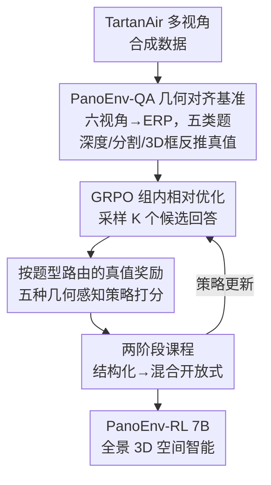

# PanoEnv: Exploring 3D Spatial Intelligence in Panoramic Environments with Reinforcement Learning

**会议**: CVPR 2026  
**论文**: [CVF Open Access](https://openaccess.thecvf.com/content/CVPR2026/html/Lin_PanoEnv_Exploring_3D_Spatial_Intelligence_in_Panoramic_Environments_with_Reinforcement_CVPR_2026_paper.html)  
**代码**: https://github.com/7zk1014/PanoEnv （有）  
**领域**: 强化学习 / 多模态VLM / 全景3D空间推理  
**关键词**: 360°全景, ERP, 空间智能, GRPO, 课程学习

## 一句话总结
针对 VLM 在 360° 等距柱状投影（ERP）全景图上 3D 空间推理几乎崩溃的问题，本文构建了 14.8K 题、五类几何对齐标注的 PanoEnv-QA 基准，并用「按题型路由的真值奖励 + 两阶段课程」的 GRPO 后训练把一个 7B 模型的总精度从 49.34% 提到 52.93%、开放式问答精度从 6.39% 提到 14.83%，反超 32B 模型。

## 研究背景与动机

**领域现状**：360° 全景图（ODI）单张就能覆盖整个场景，在 VR/AR、自动驾驶、具身智能里越来越重要。主流做法是把球面全景展平成 ERP 图像喂给现成的视觉语言模型（VLM），让它做空间问答。

**现有痛点**：ERP 投影有两个先天毛病。一是**几何畸变**——越靠近两极，像素被横向拉伸得越厉害，同一个物体在不同纬度上的尺度和形状完全不一样，模型从针孔图像里学到的视觉先验直接失效；二是**3D 监督缺失**——现有 VQA 数据集几乎没有和全景对齐的深度、3D 框、精确几何，模型既没法被正确评测，也学不到真正的 3D 关系。结果是：在 ERP 上判断「A 在 B 左边吗」「A 有多远」「谁的真实体积更大」这种透视图上一眼就能答的题，VLM 全线翻车。本文测了 14 个 SOTA 模型，最强的 Qwen2.5-VL-7B 总精度只有 49.34%，开放式（OE）题几乎归零（6.39%）。

**核心矛盾**：当前训练范式让模型养成了「2D 启发式」——用物体在图上的大小当距离代理、用 2D 位置当 3D 关系，而不是从 ERP 像素里重建一个忠实的 3D 场景表征。这种捷径在透视图上凑合能用，到了畸变严重、跨缝拼接的全景上就彻底失灵。

**本文目标**：拆成两个子问题——(1) 造一个几何真值对齐、能同时当评测台和 RL 监督源的全景 3D 推理基准；(2) 设计一套能把物理真值灌进 VLM、又不破坏原有能力的后训练方法。

**切入角度**：作者注意到合成 3D 环境（TartanAir）天然带像素级精确的深度和分割，这正是真实全景数据极难拿到的东西。既然真值是「可验证」的，就可以**程序化地从物理真值反推出问答对**，让奖励信号锚定在几何现实上，而不是靠 LLM judge 这种带噪代理。

**核心 idea**：用「几何真值生成的 QA + 按题型路由的真值奖励 + 由易到难的两阶段课程 GRPO」替代「通用奖励 + 一锅端训练」，把 3D 空间智能注入全景 VLM。

## 方法详解

### 整体框架

PanoEnv 由两块组成：**PanoEnv-QA 数据构建** 和 **3D-aware RL 后训练**。数据侧把 TartanAir 的多视角合成数据（六个立方体贴图视角）拼成高分辨率 ERP 全景，每张全景都带逐像素对齐的 RGB、深度、语义分割三模态，再用这些真值程序化生成五类、共 14,827 道几何对齐的问答题。训练侧拿一个 7B 的 Qwen2.5-VL 当骨干，用 GRPO 采样一组候选回答，交给一个**按题型自动路由**的奖励系统打分（五种策略各管一类题），最后用**两阶段课程**——先在结构化题（判断/选择）上把格式和短推理学稳，再混入开放式题恢复生成能力——更新策略，从而在不灾难性遗忘的前提下提升开放式 3D 推理。

### 关键设计

**1. PanoEnv-QA：用合成场景的物理真值程序化生成五类几何对齐题**

痛点是现有全景 VQA 既缺密集几何、又缺可验证监督，没法支撑 RL。作者从 TartanAir 出发（选它正因为有难以在真实数据获得的精确深度和分割），把每个场景的立方体贴图六视角合并成一张 ERP 全景，保证 RGB / 深度 / 语义三模态像素级对齐。生成时先做对象级分析：用分割图找出所有可见物体 $O_i$，过滤掉小目标和天空、地面、墙壁这类无定形背景，并排除 2D 框严重包含的物体对（避免「比较轮胎和它所属的车」这种平凡题）。然后对每个实例从掩码 $M_i$ 提取 2D 框、深度统计、相机来源、3D 点云和体积，按五个模板出题：

- **相机视角溯源**：考模型懂不懂 ERP 是多视角拼接而非单张照片。对任意 ERP 像素 $(p_x,p_y)$，球面坐标为 $\lambda=\left(\frac{p_x}{W}-0.5\right)2\pi,\ \phi=-\left(\frac{p_y}{H}-0.5\right)\pi$，由此得到的方向向量主轴决定来源视角；每个物体采样 100 点，被多视角看到的标为「缝合物体」。
- **距离估计**：从 ERP 深度图 $D_{ERP}$ 取掩码内有效深度，算中位数 p50、分位数、IQR 得到稳健深度画像，逼模型做真·度量推理而非拿尺寸当距离代理。
- **环境识别**：用 TartanAir 的二级标签（场景属性 indoor/outdoor、场景类别 Urban/Nature），选择题干扰项按语义挑（如「白天」配「夜晚/冬天」变体）逼细粒度推理。
- **相对空间定位**：把物体从 ERP 反投影到统一 3D 右手坐标系。用 2D 框质心和中位深度 $d_i$，先算球坐标，再转 3D 质心 $x_i=-d_i\cos\phi_i\sin\lambda_i,\ y_i=d_i\sin\phi_i,\ z_i=-d_i\cos\phi_i\cos\lambda_i$；两物体关系由 $\vec V_{ij}=\vec P_i-\vec P_j$ 各分量与阈值 $\tau_{pos}$ 比较得「上方/前方」等标签。
- **内在属性比较**：把掩码内每个像素投到 3D 得点云，算紧致 3D 框的长宽高。由体积出「谁更大」的题；并定义**扁平度分数**＝最小维/最大维之比（趋零表示像盘子或杆子那样高度各向异性），出「谁更扁/更长」的题。

这套「2D 文本引用、3D 空间查询」的跨维范式——用物体 2D 属性生成引用、再问它在 3D 空间的关系——构成了真正难的跨维推理任务，五类题各约占 20%（见表 1），不让单一技能主导成绩。

**2. 按题型路由的真值奖励：五种几何感知策略各打各的分**

通用奖励或 LLM judge 对这类几何题既带噪又不准。作者让总奖励为 $R(s,a)=w_{acc}R_{acc}+w_{fmt}R_{fmt}$，取 $w_{acc}=0.9,\ w_{fmt}=0.1$ 重压正确性；格式奖励是个二值项，回答严格遵守 `<Reasoning>...</Reasoning><Answer>...</Answer>` 结构（正则校验）才给 1.0，强制推理和答案分离。精度奖励的关键是一个**自动路由器**，按题目预标注的类型在五种策略里选一个：

- **A·是非题**：大小写不敏感的严格串匹配（"yes" 配 "Yes" 但不配 "Yes, it is"），二值。
- **B·选择题**：先做主语抽取（长句取第一个动词/介词前的主语，短答直接用），归一化（去冠词、标点、大小写）后比对，二值。
- **C·距离题**：数值解析器抽数字和单位，统一换算成米；按相对误差给分——$\le10\%$ 给 1.0、$\le20\%$ 给 0.5、否则 0.0，体现度量题应「越准越好」而非全对全错。
- **D·空间关系题**：在前后/左右/上下三条独立轴上解析方向关键词（含近义词，"above"="over"），逐轴比对，奖励＝答对的轴数比例（如真值「后、右、上」答出「后、右」给 0.67）。这种部分给分让多轴关系的学习信号细粒度得多。
- **E·计数题**：精确数值匹配，支持「3」和「three」互转，二值。

这套路由把奖励直接锚在数据集自带的物理真值上，比单一通用奖励的学习信号准得多、也更有针对性。

**3. 两阶段课程：先结构化稳住，再混开放式防遗忘**

直接在混合题型上训 RL 很不稳——奖励信号异质、开放式生成熵高。作者按由易到难的课程分两阶段：**Stage 1（结构化预训练）** 只在判断题和选择题这类低熵任务上训，奖励可靠，让策略快速掌握格式纪律和稳定的短推理（实测格式奖励很快逼近 1.0，精度奖励从约 0.5 升到 0.6 以上）；**Stage 2（混合开放式微调）** 从 Stage 1 初始化，在结构化题和等量开放式题的平衡混合上训，此时格式已饱和，模型可以专注啃开放式空间推理而不灾难性遗忘（Stage 2 格式奖励一开始就饱和、精度奖励从较低起点继续爬升）。优化器层面用 GRPO：对每个提示采 $K$ 个候选回答，优势按组内均值做基线 $A(s,a_k)=R(s,a_k)-\frac1K\sum_i R(s,a_i)$，再用 PPO 截断目标更新，并加 KL 惩罚 $L_{total}=L_{GRPO}-\beta\,D_{KL}(\pi_\theta\|\pi_{ref})$ 拉住原策略防遗忘。消融显示「结构化→混合」这条路径比反向或一锅端都更稳、OE 更高。

### 损失函数 / 训练策略
骨干为 Qwen2.5-VL-7B-Instruct，训练 2 个 epoch，组大小 $K=4$，LoRA 只加在语言解码器上、视觉编码器冻结。Stage 1 用激进超参快速学格式与离散决策，Stage 2 从 Stage 1 初始化、用保守超参稳优化并提升 OE。

## 实验关键数据

### 主实验

14 个基线在 3,040 样本测试集上的零样本表现（表 2 节选）：

| 模型 | 总精度↑ | T/F | MCQ | OE | Q-Score | P-Score |
|------|---------|-----|-----|-----|---------|---------|
| Qwen2.5-VL-7B（最强基线） | 49.34 | 65.19 | 57.24 | 6.39 | 5.60 | 5.48 |
| Qwen3-VL-8B | 47.91 | 62.85 | 55.24 | 7.70 | 5.60 | 5.35 |
| InternVL2.5-26B | 47.07 | 64.51 | 54.33 | 3.44 | 5.61 | 5.61 |
| Qwen2.5-VL-32B | 42.70 | 62.47 | 44.96 | 8.36 | 5.02 | 4.92 |
| 14 模型平均 | 36.72 | 55.98 | 37.56 | 4.26 | 4.82 | 5.17 |

RL 后训练结果（表 3）：本文 GRPO-Balanced 把 7B 骨干推到新 SOTA，OE 精度近乎翻倍，语义分还反超 32B。

| 模型 | 总精度↑ | T/F | MCQ | OE | 参数 | Q-Score | P-Score |
|------|---------|-----|-----|-----|------|---------|---------|
| Qwen2.5-VL-7B（基线） | 49.34 | 65.19 | 57.24 | 6.39 | 7B | 5.60 | 5.48 |
| Qwen2.5-VL-32B | 42.70 | 62.47 | 44.96 | 8.36 | 32B | 5.02 | 4.92 |
| **GRPO-Balanced（本文）** | **52.93** | 68.78 | 58.90 | **14.83** | 7B | **6.24** | **5.95** |

### 消融实验

五个变体对比（表 4），验证课程设计：

| 变体 | 总精度 | T/F | MCQ | OE | 说明 |
|------|--------|-----|-----|-----|------|
| Baseline (Qwen2.5-VL-7B) | 49.3 | 65.2 | 57.2 | 6.4 | 零样本 |
| GRPO-OneStage（一锅端） | 50.8 | 67.6 | 56.7 | 11.8 | 所有题一起训，优化不稳 |
| GRPO-Structured（仅结构化） | 52.3 | 69.5 | 60.9 | 5.7 | 结构化最高但 OE 崩 |
| GRPO-OE（仅开放式） | 48.6 | 66.6 | 52.3 | 13.2 | OE 改善但结构化变弱 |
| GRPO-Reverse（OE→混合） | 50.9 | 69.3 | 57.8 | 7.0 | 反向课程，OE 几乎没起来 |
| **GRPO-Balanced（结构化→混合）** | **52.9** | 68.8 | 58.9 | **14.8** | 全面最稳最优 |

### 关键发现
- **课程顺序是 OE 能否起来的关键**：只训结构化时 OE 仅 5.7%（比基线还差），只训 OE 时结构化掉、总精度反低于基线（48.6%）；反向课程（OE→混合）OE 只到 7.0%。唯有「结构化先稳住、再混开放式」才同时拿到最高总精度和最高 OE，说明先建立格式纪律和短推理、再啃高熵生成的顺序不可颠倒。
- **小模型靠正确监督能反超大模型**：7B 经几何真值奖励训练后总精度（52.93%）和语义分都超过 32B（42.70%），印证「ERP 几何难点在监督被物理锚定时可被攻克」，而非单纯堆参数。
- **OE 是全场最大短板也是最大增益点**：14 个基线 OE 平均仅 4.26%，本文把 7B 的 OE 从 6.39% 拉到 14.83%（相对 +132%），且结构化任务几乎不掉，是整套方法收益最集中的地方。

## 亮点与洞察
- **「可验证监督」是这套方法的命门**：因为题目和答案都从合成场景的物理真值程序化反推，奖励能直接锚在几何现实上，绕开了 LLM judge 的噪声——这也是它敢用 RL 而不是 SFT 的底气，思路可迁移到任何「真值可程序化获得」的结构化推理任务。
- **按题型路由的奖励很实用**：距离题用相对误差分档给分、空间题按轴数比例部分给分，把「全对全错」的稀疏信号变成稠密可塑信号，对多轴/度量类题尤其关键，是可复用的奖励工程 trick。
- **两阶段课程对「RL 既要学新技能又要防遗忘」给了一个干净答案**：低熵结构化任务先把格式和短推理打牢，再放高熵开放式，配合 KL 惩罚，避免了一锅端的优化震荡。
- **扁平度分数**这种把「形状」量化成最小维/最大维比值的小设计，让「谁更扁/更长」这类难以标注的 3D 形态题也能程序化出题。

## 局限与展望
- **合成到真实的 gap**：作者自承 PanoEnv 全建在 TartanAir 合成数据上，真实 360° 数据的真值往往带噪或不全，方法能否迁移未验证。
- **绝对精度仍低**：即便是 SOTA，总精度也才 52.93%、OE 仅 14.83%，离「可靠的全景 3D 推理」还很远，说明这是个远未解决的难题而非已被攻克。
- **只覆盖静态全景**：未扩展到全景视频的时序空间推理，作者列为未来方向。
- **骨干和增益绑定较紧**：方法在 Qwen2.5-VL-7B 上验证，+3.59% 的总精度增益是否在其他骨干上同样成立、LoRA 只调语言解码器是否限制了视觉侧几何感知的改善，论文未充分探讨。

## 相关工作与启发
- **vs OSR-Bench / 360-R1**：这两篇是全景空间推理的先行者，OSR-Bench 建了首个大规模全景空间推理基准、系统记录 SOTA 短板，360-R1 造了 OmniVQA 并用 RL 增强全景推理。本文在它们基础上补上了「高阶多物体关系题（真实 3D 体积/形状、深度比较、环境分析）+ 视角溯源元推理 + 密集几何真值」，并把真值直接做成可验证的 RL 监督。
- **vs 通用 VQA（VQA v2 / GQA / CLEVR / VSI-Bench）**：这些多停留在 2D 透视图和组合/常识逻辑，本文主打从 2D 全景反推 3D 物理关系，是跨维度的难任务。
- **vs 标准 GRPO/PPO 后训练**：本文没改 GRPO 优化本体，而是把创新放在「奖励来源（物理真值路由）」和「训练日程（两阶段课程）」上，证明对几何推理而言，监督信号的设计比优化器本身更决定成败。

## 评分
- 新颖性: ⭐⭐⭐⭐ 全景 3D 推理基准 + 几何真值路由奖励 + 两阶段课程的组合扎实，但 GRPO、课程学习、合成真值各自都非首创。
- 实验充分度: ⭐⭐⭐⭐ 14 个基线横评 + 五变体课程消融较完整，但只在单一 7B 骨干上验证，缺跨骨干和真实数据迁移实验。
- 写作质量: ⭐⭐⭐⭐ 五类题的几何定义和五种奖励策略讲得清楚、公式齐全，逻辑链顺畅。
- 价值: ⭐⭐⭐⭐ 给全景空间智能提供了可复用的「可验证监督 + RL」范式和一个几何对齐基准，对具身/全景社区有实用价值，绝对精度偏低也诚实暴露了难度。

<!-- RELATED:START -->

## 相关论文

- [\[ACL 2026\] KnowRL: Exploring Knowledgeable Reinforcement Learning for Factuality](../../ACL2026/reinforcement_learning/knowrl_exploring_knowledgeable_reinforcement_learning_for_factuality.md)
- [\[ICLR 2026\] From Narrow to Panoramic Vision: Attention-Guided Cold-Start Reshapes Multimodal Reasoning](../../ICLR2026/reinforcement_learning/from_narrow_to_panoramic_vision_attention-guided_cold-start_reshapes_multimodal_.md)
- [\[NeurIPS 2025\] Reasoning Gym: Reasoning Environments for Reinforcement Learning with Verifiable Rewards](../../NeurIPS2025/reinforcement_learning/reasoning_gym_reasoning_environments_for_reinforcement_learning_with_verifiable_.md)
- [\[ICML 2026\] RulePlanner: All-in-One Reinforcement Learner for Unifying Design Rules in 3D Floorplanning](../../ICML2026/reinforcement_learning/ruleplanner_all-in-one_reinforcement_learner_for_unifying_design_rules_in_3d_flo.md)
- [\[NeurIPS 2025\] Forecasting in Offline Reinforcement Learning for Non-stationary Environments](../../NeurIPS2025/reinforcement_learning/forecasting_in_offline_reinforcement_learning_for_non-stationary_environments.md)

<!-- RELATED:END -->
