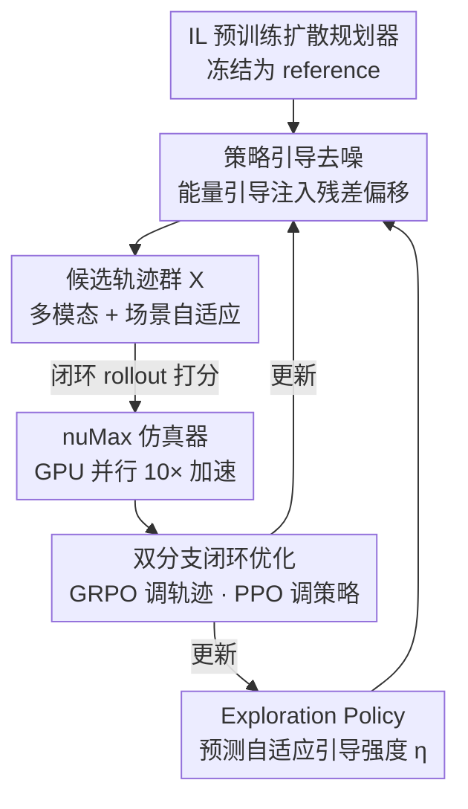

# PlannerRFT: Reinforcing Diffusion Planners through Closed-Loop and Sample-Efficient Fine-Tuning

**会议**: CVPR 2026  
**论文**: [CVF Open Access](https://openaccess.thecvf.com/content/CVPR2026/html/Li_PlannerRFT_Reinforcing_Diffusion_Planners_through_Closed-Loop_and_Sample-Efficient_Fine-Tuning_CVPR_2026_paper.html)  
**代码**: 项目页 https://opendrivelab.com/PlannerRFT  
**领域**: 强化学习 / 自动驾驶 / 扩散规划器  
**关键词**: 扩散规划器, 强化微调, 引导去噪, GRPO, 闭环仿真

## 一句话总结
PlannerRFT 给基于扩散的自动驾驶规划器做强化微调：用「策略引导去噪」把模态坍缩的扩散采样变成多样且场景自适应的轨迹群，再用 GRPO + PPO 双分支闭环优化，配合自研 10× 加速仿真器 nuMax，在 nuPlan 上拿到 SOTA 闭环规划性能。

## 研究背景与动机
**领域现状**：基于扩散的规划器（Diffusion Planner、DiffusionDrive 等）能从大规模人类示范里学出拟人、社会兼容的驾驶轨迹，是当前自动驾驶运动规划的热门概率范式。近期工作开始用强化微调（RFT）在「生成—评估」闭环里对扩散规划器做奖励驱动优化，以缓解纯模仿学习（IL）带来的分布偏移和目标错位。

**现有痛点**：RFT 这套「actor 生成候选轨迹 → 仿真打分 → group-wise 强化更新」的范式，效果几乎完全取决于 generator 的探索能力，也就是候选轨迹的分布。但原始扩散规划器存在**模态坍缩**——不同噪声输入经过去噪后收敛到几乎一样的轨迹，候选群没有多样性，强化微调拿不到有效的优化信号。

**核心矛盾**：为缓解坍缩，anchor-based 扩散规划器从「锚点中心的高斯分布」而非纯高斯噪声起步，确实能生成多样且动作一致的轨迹；但这些锚点是**固定且与场景无关**的，一部分锚点产生符合场景的机动，另一部分却产生和上下文冲突的运动，注入噪声梯度、破坏强化优化的稳定性。于是矛盾就摆在这里：探索既要**多样**（multi-modality），又要**场景一致 / 自适应**（adaptivity），二者缺一不可，而现有方法只能顾一头。

**本文目标**：在不改动原始推理 pipeline 的前提下，让扩散规划器在 RFT 时既能采出多模态候选，又能根据场景自适应地把探索方向调到「更有希望」的区域，从而提高强化采样的样本效率。

**核心 idea**：用**策略引导去噪**（policy-guided denoising）替代固定锚点——把基于能量的分类器引导注入去噪过程产生多样性，再训练一个 Exploration Policy 动态调节引导强度实现场景自适应；整体用 GRPO 优化轨迹分布、PPO 优化引导策略，组成双分支闭环微调。

## 方法详解

### 整体框架
给定一个 IL 预训练好的扩散规划器（共享场景编码器 + DiT 解码器），PlannerRFT 把它复制并冻结一份作为**全局参考 reference**，然后在原架构上插一个 **Exploration Policy** 模块，靠闭环 rollout 把规划器微调到更安全、更高效。整条流程是：参考轨迹 + 场景上下文 → Exploration Policy 给出引导强度 → 引导去噪采出一群多样且场景自适应的候选轨迹 → 在 nuMax 仿真器里闭环 rollout 打分 → 双分支优化（GRPO 调轨迹分布、PPO 调引导策略）→ 反过来更新规划器，循环往复。

整个去噪 / 推理结构不变，新增的只是「引导项 + 探索策略 + 闭环优化」这层外挂，因此微调完的模型还是一个标准的扩散规划器。

### 关键设计

**1. 策略引导去噪：用能量引导把模态坍缩的扩散采样撑成多模态**

针对原始扩散规划器「不同噪声收敛到同一轨迹」的模态坍缩，PlannerRFT 不去改去噪结构，而是借鉴基于能量的分类器引导，在每个去噪步给预测轨迹注入残差偏移，让生成的轨迹在参考轨迹邻域内散开。它把引导**解耦成横向、纵向两个正交分量**：横向能量函数衡量预测路点 $x$ 相对参考路点 $x_{ref}$ 沿法向 $n_\perp$ 的偏移，$\Psi_{lat.}=\frac{1}{T}\sum_{\tau=1}^{T}\big(n_\perp(x_\tau-x_{ref,\tau})-\lambda_{lat.}\eta_{lat.}\big)^2$，其中 $\lambda_{lat.}$ 是最大横向偏移（米），$\eta_{lat.}\in[-1,1]$ 是横向引导强度；纵向能量函数则调节规划速度 $v$ 相对参考速度 $v_{ref}$ 的偏差，$\eta_{lon.}\in[-1,1]$。两个能量函数给出**解耦正交的梯度**，不同的 $(\eta_{lat.},\eta_{lon.})$ 组合就对应不同的驾驶模态，从而一次去噪能采出一整组风格各异的轨迹。

值得注意的是，这里**故意不施加显式的地图 / 车辆级碰撞约束**——简化后的引导让那些不可行样本直接作为负反馈进入 RL 优化，比起硬约束更适合奖励驱动的探索。去噪梯度近似为 $\nabla_x\log p(\eta|x)\approx-\nabla_x\big(\Psi_{lat.}(x;\eta_{lat.})+\Psi_{lon.}(x;\eta_{lon.})\big)$。

**2. Exploration Policy：让引导强度随场景自适应，而不是固定锚点**

光有多样性还不够，固定的引导反而会在很多场景产生与上下文冲突的轨迹。PlannerRFT 训练一个 Exploration Policy $\pi_\phi$，让引导强度本身**条件于驾驶上下文 $s$ 和参考轨迹** $\eta\sim\pi_\phi(\cdot\mid s,x_{ref})$。具体做法是把参考轨迹（作为冻结的、训练良好的 IL 先验）经 MLP-Mixer 编成一个紧凑 token，再通过 cross-attention 与场景嵌入融合，捕捉参考运动和周围环境的交互；融合表征送进 **Guidance Head**，预测两个 **Beta 分布**的参数来分别控制横向、纵向引导强度，同时一个 **Value Head** $V_\psi$ 估计状态价值 $V(s_t)$ 辅助策略优化。

采样阶段反复从这两个 Beta 分布里抽 $(\eta_{lat.}^{(k)},\eta_{lon.}^{(k)})$，每组指定一种驾驶模态、把引导去噪推向对应轨迹 $\hat{x}^{(k)}$，重复 $K$ 次得到候选集 $X=\{\hat{x}^{(k)},(\eta_{lat.}^{(k)},\eta_{lon.}^{(k)})\}_{k=1}^{K}$。和均匀 / 固定分布相比，可学习的 Beta 分布能根据场景自动收紧或放宽探索范围——消融里均匀分布虽然多样性最高，但奖励方差爆炸导致训练崩溃；本设计在多样性和稳定性之间找到了由数据自己学出来的平衡点。

**3. 双分支闭环优化 + 生存奖励：稳住困难场景下的强化微调**

PlannerRFT 用**双分支**优化：一支用 GRPO（Group Relative Policy Optimization）微调扩散规划器的去噪过程、直接调整轨迹分布；另一支用 PPO 通过和仿真器的闭环交互优化 Exploration Policy。难点在于困难场景里碰撞 / 偏航会频繁把奖励重置为零，终止型（terminal）奖励几乎给不出梯度。为此本文提出**生存奖励**（survival reward）：只在有效的、非终止的轨迹段上累积逐步奖励，$R_{surv}=\frac{1}{L}\sum R_{term}\cdot\mathbb{I}[R_{term}=0]$（⚠️ 公式以原文为准，原文用指示函数把已终止步剔除），鼓励规划器**推迟失败、延长可行的时域**，从而在长时域闭环里持续改进。消融显示生存奖励在 Test14-hard 上明显优于终止奖励（72.21 vs 71.59 R-score）。

**4. nuMax 仿真器：GPU 并行让大规模闭环 RL 训练跑得起来**

RL 不像 IL 用离线预采数据，它要在线和仿真器交互，而原生 nuPlan 仿真器太慢、撑不起 4000 万环境步的训练。作者基于 Waymax 自研 **nuMax**：场景缓存做预处理加速大规模 rollout，LQR tracker 和打分器按 nuPlan 标定（动力学、奖励对齐），并用「PyTorch DDP worker ↔ JAX 仿真器」的分布式 pipeline 桥接，最终比原生 nuPlan 快约 **10×**。它不是算法创新，但是把这套闭环强化微调真正训得起来的工程底座。

### 损失函数 / 训练策略
- IL 预训练规划器采用 Diffusion Planner（在 nuPlan 100 万 clip 上训练），把 ODE 的 DPM-solver 去噪换成 **5 步 DDIM** 采样器——性能几乎不变，但引入随机性增强探索、且步数少提升 RL 训练效率。
- 微调数据从 nuPlan 收集 144,494 个非重叠场景（10 Hz，171 帧/场景），按预训练得分构造三套：Fail（10,417 个碰撞/偏航）、Lt90（24,691 个得分<90）、All（全部）。
- 全程 8×H100，微调 40M 环境步；GRPO 用生存奖励、4s 时域；引导最大偏移 $\lambda$ 适中取值（横向 2.5m、纵向 25%）效果最好。

## 实验关键数据

### 主实验
在 nuPlan 上评测，Val14 测常规驾驶、Test14-hard 测复杂场景，分非反应式（NR）和反应式（R，用 IDM 动态调整他车）两种设定，分数 0–100 越高越好。

| 设定 | 指标 | PlannerRFT | Diffusion Planner | Flow Planner |
|------|------|-----------|-------------------|--------------|
| Val14 | NR | 89.96 | 89.87 | **90.43** |
| Val14 | R | **84.46** | 82.80 | 83.31 |
| Test14-hard | NR | **77.16** | 75.99 | 76.47 |
| Test14-hard | R | **72.21** | 69.22 | 70.42 |

四个 benchmark 里三个拿到最佳。反应式交通下提升最明显：Val14-R +1.66、Test14-hard-R +2.99（相对预训练 Diffusion Planner），说明闭环 rollout 让规划器见到更广的交互模式、缓解了分布偏移。唯一提升有限的是 Val14-NR（非反应式常规场景），作者归因于非反应式环境固有的分布偏置。

### 消融实验
四种探索策略对比（均用 5 步 DDIM，D 为 DiffusionDrive 定义的多样性分数，$\bar r$/$s_r$ 为 GRPO 组内奖励均值/标准差）：

| 探索策略 | R-score↑ | NR-score↑ | 多样性 D(%) | $\bar r$↑ | $s_r$ |
|---------|---------|----------|-----------|---------|------|
| IL Pretrain（DDIM） | 68.18 | 76.01 | - | - | - |
| w/o Guidance（纯噪声） | 68.83 | 76.34 | 5.65 | 69.06 | 0.02 |
| w/ Uniform 分布 | 65.82 | 75.19 | **39.78** | 60.44 | 0.12 |
| w/ Fixed Beta 分布 | 70.65 | 76.61 | 27.73 | 71.50 | 0.07 |
| **PlannerRFT（Ours）** | **72.21** | **77.16** | 25.34 | **73.88** | 0.06 |

### 关键发现
- **多样性不是越高越好**：均匀分布多样性最高（39.78%）但 R-score 最低（65.82），因为场景无关的采样引入巨大奖励方差、训练反复崩溃；可学习 Beta 分布在 25.34% 多样性下拿到最高奖励均值，说明「场景自适应」比「盲目多样」更重要。
- **微调数据分布要平衡**：只在碰撞案例（Fail）上训会让规划器忘掉常规驾驶、全面掉点；全量（All）又因易例太多信号太弱；平衡的 Lt90（碰撞+低分）效果最好。同数据上的 IL 微调反而更差，证明增益来自探索而非多训。
- **生存奖励 > 终止奖励**，4s/6s 时域相当、2s 太短；引导最大偏移 $\lambda$ 需适中——太小限制探索、太大偏离人类专家分布，都损害稳定性。
- **定性上涌现拟人行为**：一个 OOD 变道场景里，预训练规划器卡在两车道间于 12s 碰撞；10M 步后学会保守的车道保持（安全但低效）；25M 步后学会果断变道，兼顾安全与效率。

## 亮点与洞察
- **「在 RL 视角下重新定义扩散探索」**：把扩散规划器的模态坍缩问题，转译成「强化采样缺乏有效优化信号」的问题，再用可学习的引导强度去同时满足 multi-modality 和 adaptivity——这个问题再框定（reframing）很漂亮，让引导从「固定锚点」升级为「场景条件策略」。
- **引导强度参数化为 Beta 分布**而非直接回归一个标量，天然把探索的均值和方差都交给策略学，比均匀/固定分布在稳定性上有质的差别，这个 trick 可迁移到其他需要「自适应探索幅度」的连续控制 RL。
- **横纵向能量解耦**给出正交梯度，让一次去噪就能组合出不同模态，避免了离散 motion token 的表达力损失和自回归的误差累积，是扩散+RL 在连续动作空间的一个干净接口。
- **不改推理 pipeline** 是很实用的工程取向：微调完仍是标准扩散规划器，便于落地部署。

## 局限与展望
- **强依赖仿真器与 nuPlan 标定**：整套闭环 RL 建立在 nuMax 对 nuPlan 动力学/奖励的标定上，sim-to-real 差距、以及换数据集是否还需重新标定，论文未充分讨论。
- **Val14-NR 几乎无提升**，作者也承认非反应式常规场景收益边际，说明方法主要在「交互密集 / 困难」场景才显著得益。
- **生存奖励的指示函数定义**在缓存中表达较简略（⚠️ 以原文为准），其与终止奖励的边界、对极端长尾场景的鲁棒性仍需更多分析。
- **参考轨迹作为冻结先验**意味着探索始终被锚在 IL 分布附近，$\lambda$ 一大就不稳——这限制了对「人类专家也没见过」的全新机动的探索上限。
- 改进方向：可探索把生存奖励换成更平滑的风险敏感目标、或让参考先验随训练缓慢更新（teacher-student 软更新）以放宽探索天花板。

## 相关工作与启发
- **vs Anchor-based 扩散规划器（如 DiffusionDrive）**：它们用固定、场景无关的锚点高斯起步换多样性，但锚点和场景脱节会注入噪声梯度；PlannerRFT 用场景条件的可学习引导强度替代固定锚点，多样性可控且场景一致。
- **vs 离散 motion token 的 RFT（类 LLM RFT）**：token 词表越大表达力越强但优化维度和算力暴涨；扩散在连续动作空间天然规避了离散化的表达力损失。
- **vs 自回归连续轨迹生成**：后者逐步建模易误差累积、时序不稳；扩散去噪的概率特性更适合时序一致的连续决策。
- **vs 规则式引导去噪**：固定强度的规则引导会在「避碰 vs 舒适」之间产生竞争梯度、跨场景表现波动大；本文用策略学出自适应强度来调和。

## 评分
- 新颖性: ⭐⭐⭐⭐ 把扩散探索问题在 RL 视角下重框定，策略引导去噪 + 自适应 Beta 引导强度是清晰且有效的新接口。
- 实验充分度: ⭐⭐⭐⭐ nuPlan 双设定四 benchmark + 探索策略/数据分布/奖励/偏移多组消融扎实，但只在单一数据集、缺 sim-to-real 验证。
- 写作质量: ⭐⭐⭐⭐ 动机推导清晰、图示到位；部分公式在缓存里排版破碎需对照原文。
- 价值: ⭐⭐⭐⭐ 给「扩散规划器 + 闭环 RL 微调」提供了可复用的范式和 10× 加速仿真底座，对自动驾驶规划社区实用价值高。

<!-- RELATED:START -->

## 相关论文

- [\[NeurIPS 2025\] Parameter Efficient Fine-tuning via Explained Variance Adaptation](../../NeurIPS2025/reinforcement_learning/parameter_efficient_fine-tuning_via_explained_variance_adaptation.md)
- [\[NeurIPS 2025\] Reinforcing the Diffusion Chain of Lateral Thought with Diffusion Language Models](../../NeurIPS2025/reinforcement_learning/reinforcing_the_diffusion_chain_of_lateral_thought_with_diffusion_language_model.md)
- [\[CVPR 2026\] EVA: Efficient Reinforcement Learning for End-to-End Video Agent](eva_efficient_reinforcement_learning_for_end-to-end_video_agent.md)
- [\[ICLR 2026\] Sample-efficient and Scalable Exploration in Continuous-Time RL](../../ICLR2026/reinforcement_learning/sample-efficient_and_scalable_exploration_in_continuous-time_rl.md)
- [\[CVPR 2026\] Specificity-aware Reinforcement Learning for Fine-grained Open-world Classification](specificity-aware_reinforcement_learning_for_fine-grained_open-world_classificat.md)

<!-- RELATED:END -->
